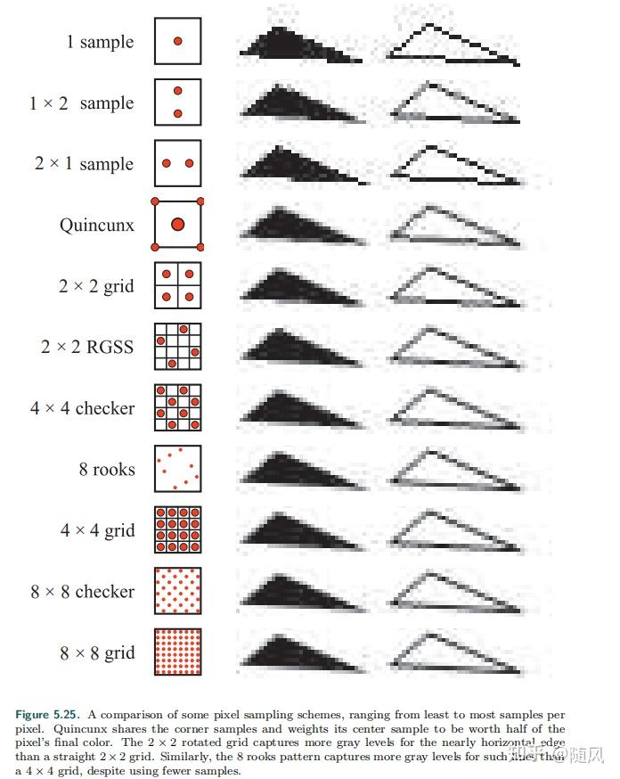

::: tip Translation notice
This page was translated with machine translation and may contain inaccuracies. If you can help improve it, please open an issue or submit a pull request.
:::


<FeatureHead
    title = "Notes - Summary of core global quantities (Part 1)"
    authorName = "Xuanyu1725"
/>

## Overview

The previous three sections of the article have described the core shader workflow relatively clearly, but there are still some overall details that need to be clarified. Therefore, this tutorial will summarize some of the global quantities that must be mastered in the core shader based on the foundation established in the previous sections. The remaining global quantities will be placed in the next note (Global Quantity Note 02).

## Preface

Due to the long writing cycle of each tutorial, and because the Feature publication cycle is once a month, there will be some backlog of manuscripts. Some of the things mentioned so far have been modified by Mojang before publication, and some are no longer accurate after the accurate information was updated at the time of publication (although we warned this in the preface of the first article). For changes that have a greater impact on the basic process, I will modify the original text on the Feature. For some small changes in rendering logic, I will only use appendices or notes to remind you during the update process.

What I want to talk about in this article may also be timely. Future readers must refer to the Wiki and the official change log to learn.

There are certain errors in the hexadecimal representation and normalized floating point representation of color values. The article tries to give official information and values ​​widely used in the community, so the two representation methods may be mixed.

This article was written on the evening of November 10th. The demo version is 1.21.11, and the previously published version is 1.21.8.

The global quantity blocks listed in this section are:

- Globals

- Fog

- DynamicTransform

- Projection

- LightmapInfo

## text

At present, global variables are introduced by **uniform blocks**. By introducing a block object (generally declared in the containing shader), all global variables related to it are also introduced.

Although some global variables are bound and introduced as a whole, not all global variables have assigned values ​​in some scenarios. Calling these unassigned global variables in these scenarios is undefined behavior and may lead to unexpected output or even game crashes.

## Layout keyword

Here is a GLSL keyword `layout`, which is used to specify the memory alignment of the global volume block.

In vertex attributes, the commonly used `layout(location = x)` is used to specify the position index of the vertex attribute, and the vertex attribute is assigned a value through this index in the code. But in core shaders such as Minecraft, the position index of the vertex attribute is automatically assigned by the engine (finding the position through the vertex attribute variable name), so there is no need to manually specify it.

`layout(std140)`is used to specify the memory alignment of the global volume block as`std140`, which is a standard alignment specified by OpenGL and ensures that the memory layout of the global volume block is consistent under different platforms and drivers.

The rules for `std140` alignment are as follows:

- Scalar types (such as `float`, `int`, `bool`) occupy 4 bytes and are aligned on 4-byte boundaries.

- Vector types (such as `vec2`, `vec3`, `vec4`) occupy 8, 12, 16 bytes and are aligned to multiples of their size (vec2 is aligned to 8 bytes, vec3 and vec4 are aligned to 16 bytes).

- Matrix types (such as `mat2`, `mat3`, `mat4`) are stored column-wise, and each column is treated as a vector type.

- Each element of an array type is aligned by its type, and the start of the array is aligned to a 16-byte boundary.

Although the alignment of `std140`makes types like`vec3` too long, do not attempt to access the extra bytes used for alignment, as this will lead to undefined behavior.

### Shared block Globals

The shared block is a block that can be used by both the core shader and the post-processing shader.

The shared block is declared in `globals.glsl` as follows:

```glsl
layout(std140) uniform Globals {
    ivec3 CameraBlockPos;
    vec3 CameraOffset;
    vec2 ScreenSize;
    float GlintAlpha;
    float GameTime;
    int MenuBlurRadius;
    int UseRgss;
};
```


#### CameraBlockPos

CameraBlockPos was introduced in version 1.21.11 and is used to represent the absolute coordinate of the camera in the world, in blocks. Note that it is not the player's position, it is the same as the player's position in first person, but it will be different in third person or free view.

### CameraOffset

CameraOffset was introduced in version 1.21.11 and represents the decimal coordinate of the camera within the block. It can be combined with CameraBlockPos to obtain the precise position of the camera.

#### ScreenSize

ScreenSize represents the width and height of the current buffer (in pixels). Although the size theoretically does not have decimals, since floating point calculations dominate the shader pipeline, converting it to `ivec2`may cause computational disadvantages (for example, interpolation requires floating point numbers rather than integers), so the type used here is`vec2`.

Examples of ScreenSize used in vanilla are as follows:

```glsl
// rendertype_lines.vsh 用于控制线框、鱼线等类型的渲染

#version 330

    .
    .
    .

void main() {

    .
    .
    .

    vec3 ndc1 = linePosStart.xyz / linePosStart.w;
    vec3 ndc2 = linePosEnd.xyz / linePosEnd.w;

    // ScreenSize 在这里被用作计算线宽和偏移量，因为这些线应该在屏幕中不被拉伸，故不能直接使用NDC坐标为基准
    vec2 lineScreenDirection = normalize((ndc2.xy - ndc1.xy) * ScreenSize);
    vec2 lineOffset = vec2(-lineScreenDirection.y, lineScreenDirection.x) * LineWidth / ScreenSize;

    if (lineOffset.x < 0.0) {
        lineOffset *= -1.0;
    }

    if (gl_VertexID % 2 == 0) {
        gl_Position = vec4((ndc1 + vec3(lineOffset, 0.0)) * linePosStart.w, linePosStart.w);
    } else {
        gl_Position = vec4((ndc1 - vec3(lineOffset, 0.0)) * linePosStart.w, linePosStart.w);
    }

    .
    .
    .

    vertexColor = Color;
}
```


#### GlintAlpha

GlintAlpha is the intensity of the enchanted light effect, with a value between$[0,1]$. In the code, it is directly multiplied with RGB, but since the enchantment light effect itself is a translucent rendering object, multiplying by GlintAlpha actually plays the role of adjusting the transparency of the enchantment light effect. We will introduce this feature when we talk about translucent mixing later.

An example of using GlintAlpha in vanilla is as follows

```glsl
// glint.fsh 用于渲染物体表面的附魔光效，附魔光效是一个独立的渲染对象，这里的采样是对附魔光效的纹理而不是附加光效的物体

#version 330

    .
    .
    .

void main() {
    vec4 color = texture(Sampler0, texCoord0) * ColorModulator;
    if (color.a < 0.1) {
        discard;
    }
    // GlintAlpha 这里用作与雾乘算，然后再与采样的颜色乘算
    float fade = (1.0f - total_fog_value(sphericalVertexDistance, cylindricalVertexDistance, FogEnvironmentalStart, FogEnvironmentalEnd, FogRenderDistanceStart, FogRenderDistanceEnd)) * GlintAlpha;
    fragColor = vec4(color.rgb * fade, color.a);
}
```


#### GameTime

GameTime is a global quantity that represents world time. By default, it occurs approximately every 20 minutes.$[0,1]$The inner loop is performed once, and the specific calculation formula is:$(gametime \mod 24000) / 24000$

Here's$gametime$It is 20 units per second, which is the same value returned by `/time query gametime`(but there may be a delay between the client and the server). This time is not affected by the game rule`doDaylightCycle`(or`advance_time` as of 1.21.11).

GameTime is measured in ticks, not real time, so its update rate can be changed with `/tps`.

> Note: In old versions (may be versions below 1.21.5, need to verify) the post-processing shader can only use the Time global variable, which is calculated every second.$[0,1]$inner loop

An example of using GameTime in vanilla is as follows

```glsl
//rendertype_end_portal.fsh 用于渲染末地传送门内的星空效果

#version 330

    .
    .
    .

mat4 end_portal_layer(float layer) {
    // GameTime 在这里被用于随时间变化的平移效果
    mat4 translate = mat4(
        1.0, 0.0, 0.0, 17.0 / layer,
        0.0, 1.0, 0.0, (2.0 + layer / 1.5) * (GameTime * 1.5),
        0.0, 0.0, 1.0, 0.0,
        0.0, 0.0, 0.0, 1.0
    );

    mat2 rotate = mat2_rotate_z(radians((layer * layer * 4321.0 + layer * 9.0) * 2.0));

    mat2 scale = mat2((4.5 - layer / 4.0) * 2.0);

    return mat4(scale * rotate) * translate * SCALE_TRANSLATE;
}

out vec4 fragColor;

void main() {
    .
    .
    .
}
```


#### MenuBlurRadius

MenuBlurRadius is a blur program used for post-processing. It specifies the intensity of the blur, which is equal to the **menu background blur level** in the video settings, that is,$[0,10]$an integer within . Although this variable exists in a general program, the branch using this variable will only be entered when the menu or title interface is opened (that is, the blur effect of the background when the menu is opened)

Examples of MenuBlurRadius used in vanilla are as follows

```glsl
//box_blur 是一个后处理程序，用于创造模糊效果

#version 330

    .
    .
    .

// This shader relies on GL_LINEAR sampling to reduce the amount of texture samples in half.
// Instead of sampling each pixel position with a step of 1 we sample between pixels with a step of 2.
// In the end we sample the last pixel with a half weight, since the amount of pixels to sample is always odd (actualRadius * 2 + 1).
void main() {
    vec2 oneTexel = 1.0 / InSize;
    vec2 sampleStep = oneTexel * BlurDir;

    vec4 blurred = vec4(0.0);
    
    // 当 Radius 小于 0.5 时，MenuBlurRadius 才会被使用
    // 1.21.10 中只有三个场景调用此程序：
    //     实体外轮廓（Radius 设为 2.0）
    //     蜘蛛视角（Radius 设为 7.0 和 15.0）
    //     打开菜单栏或标题界面时（Radius 设为 0.0）
    
    float actualRadius = Radius >= 0.5 ? round(Radius) : float(MenuBlurRadius);
    for (float a = -actualRadius + 0.5; a <= actualRadius; a += 2.0) {
        blurred += texture(InSampler, texCoord + sampleStep * a);
    }
    blurred += texture(InSampler, texCoord + sampleStep * actualRadius) / 2.0;
    fragColor = blurred / (actualRadius + 0.5);
}
```


#### UseRgss

Actually a Boolean value, this global quantity is 1 when **Texture Filtering** in the video settings is set to **RGSS** mode, and 0 otherwise.

RGSS (Rotated Grid Super-Sampling) is an anti-aliasing technology. We know that each fragment may correspond to a larger area on the texture rather than a pixel on the texture, so aliasing may occur during sampling. RGSS improves the sampling effect by selecting multiple sampling points within the texture area and rotating them at an angle so that the sampling points are rarely flush with the vertical and horizontal directions.



### Fog

The global volume block related to fog is introduced by the shader `fog.glsl` and is declared as follows:

```glsl
layout(std140) uniform Fog {
    vec4 FogColor;
    float FogEnvironmentalStart;
    float FogEnvironmentalEnd;
    float FogRenderDistanceStart;
    float FogRenderDistanceEnd;
    float FogSkyEnd;
    float FogCloudsEnd;
};
```


Most of these global quantities have been briefly described in the previous tutorial. Here we introduce these global quantities in a more quantitative way.

#### FogColor

FogColor is a normalized color value and the core variable of fog rendering.

There are many factors that affect FogColor, including time, biome, boss bar (such as wither), weather, status effects (night vision, blindness and darkness) and special environments (such as underwater, lava and fine snow), etc.

The factors that affect FogColor are in the table below. Most of them only give qualitative descriptions. I will give the complete calculation process in the appendix.

1. community

The most important factor that determines the fog color is that each biome has a designated fog color. In the end, the actual basic fog color is that of the biome.$0.15$times

2. time

In the main world, the brightness of the fog will change with time.$C$for new colors,$\begin{pmatrix}r \\ g \\ b \end{pmatrix}$for the old color,$T \in [0, 1]$is the time of day, then:

    $$
    A = \max(0, \min(\frac{1}{2} + \cos(2\pi T), 1))\\
    C = \begin{pmatrix} 0.94A + 0.06 & 0 & 0 \\ 0 & 0.94A + 0.06 & 0 \\ 0 & 0 & 0.91A + 0.09 \end{pmatrix} \begin{pmatrix} r \\ g \\ b \end{pmatrix}
    $$

3. sky color

The smaller the rendering distance, the closer the color of the fog is to the color of the sky, until when the rendering distance is 32, the color of the fog is no longer affected by the color of the sky.

The changing rules of sky color will be quantitatively analyzed in the introduction of the illumination global quantity block.

4. sun

When the rendering distance is greater than or equal to 4, the direction the player faces at sunrise or sunset will also affect the fog color.

5. weather

When the weather is thunderstorm, the overall tone will be grayer. When the weather is rainy, the overall tone will be grayer but more bluish than a thunderstorm.

6. underwater

When the player enters the water, the color of the fog depends on the biome the camera is in. When moving from one biome to another, the fog color will gradually change within 5 seconds.
    
Fog in swamps and mangroves is thicker than in other biomes, a feature controlled by the mob biotag `has_closer_water_fog`.

7. Fine snow and lava

Fine snow and fog in magma are fixed values ​​RGB(0.623, 0.734, 0.785) and RGB(0.6,0.1,0.0) respectively.

8. high:
    
When it is not super flat and the player is not in fine snow or lava, the brightness magnification of the fog color compared to the original color is calculated by the formula `power(clamp((y-minY)*0.03125,0.0,1.0))`. This is reflected in the fact that the fog will gradually change from the original color to pure black in the process from 32 blocks above the lowest height to the lowest.

9. Blindness and Darkness:

When the player has these two status effects and is not in fine snow or lava, the fog color will be set to pure black. And blindness takes precedence over darkness effects.

10. Wither:

When the Wither's boss slot is present, the fog color becomes darker and redder. This feature is controlled by bossbar's `CreateWorldFog`and`DarkenScreen`(can only be changed in`CustomBossEvents`of`level.dat`, currently the `/bossbar` command does not have this interface).

11. Night vision:

If the player's perspective is not underwater and there is no darkness effect, night vision will make the fog colors brighter.

#### FogEnvironmentalStart & FogEnvironmentalEnd

Used to render spherical fog that dominates at close range

FogEnvironmentalEnd and FogEnvironmentalStart will be affected by various factors. In the description, they are generally called visible distance and starting distance.

When the camera is in the air of the main world, the weather is sunny, and there is no blindness or darkness, atmospheric fog will be applied, with a starting distance of 0.0 and a visible distance of 1024.0.

1. underwater

When the camera goes underwater, the starting distance is set to -8.0 and the viewing distance is set to 24.0.

After 2.2 seconds, the viewing distance increases to 58.0 in 2.0 seconds and then to 96.0 in approximately 24.7 seconds.

This is reflected in the fact that the visual distance drops sharply after entering the water, rises rapidly in a short period of time, and then rises to the maximum visual distance in a longer period of time.

2. weather

When the weather is rainy or thunderstorm, the starting distance will be set to -80.0 and the visible distance will be set to 896.0.

3. magma

When the camera enters the lava, the starting distance is set to 0.25 and the visible distance is set to 1.0.

If the player has fire resistance, the starting distance will be 0.0 and the visual distance will be set to 5.0.

4. dark

When the player has a dark effect, the starting distance will be set to 11.25 and the visible distance will be set to 15.0.

5. blindness

When the player is blinded, the starting distance will be set to 1.25 and the visual distance will be set to 5.0.

Blindness takes precedence over darkness, and neither takes effect in lava.

6. The Nether and the Ender Dragon

When the player is in the Nether (specifically, the dimension where the nether effect is applied) or a dimension where the Ender Dragon boss fight event exists, the starting distance will be set to 5% of the rendering distance, and the visual distance will be set to half of the rendering distance, but not lower than 96.

#### FogRenderDistanceStart & FogRenderDistanceEnd

FogRenderDistanceStart and FogRenderDistanceEnd are used to render a cylindrical shape that dominates the rendering distance boundary, in order to mask the boundaries of chunk loading. The visible distance is the rendering distance, and the starting distance is 90% of the rendering distance.

#### FogSkyEnd

FogSkyEnd is used for rendering sky fog, equal to the rendering distance. Although sky fog also uses the `apply_fog()` function, the starting distance of spherical fog provided by it is a fixed value of 0 and the visual distance is FogSkyEnd. The starting distance and visual distance of cylindrical fog are both FogSkyEnd. This means that the actual effect of sky fog only depends on the spherical fog.

```glsl
fragColor = apply_fog(ColorModulator, sphericalVertexDistance, cylindricalVertexDistance, 0.0, FogSkyEnd, FogSkyEnd, FogSkyEnd, FogColor);
```


#### FogCloudsEnd

FogCloudsEnd is used for the rendering of cloud fog, which is equal to the **Cloud Distance** in the video settings. However, it does not directly render the fog, but weakens the opacity of the clouds based on the fog value.

```glsl
color.a *= 1.0f - linear_fog_value(vertexDistance, 0, FogCloudsEnd);
```


This occurs as the clouds' opacity decreases linearly with distance from the camera origin until they are completely invisible beyond FogCloudsEnd.

### DynamicTransform DynamicTransform

Global variables related to various transformations are included in the shader `dynamictransforms.glsl` and are declared as follows:

```glsl
layout(std140) uniform DynamicTransforms {
    mat4 ModelViewMat;
    vec4 ColorModulator;
    vec3 ModelOffset;
    mat4 TextureMat;
    float LineWidth; // until 1.21.11
};
```


> Here the matrix appears, note that declarations in GLSL are column-wise. What follows is in mathematical form.

These global quantities are called dynamic transformations because they are determined by frequently changing data such as the player's position and orientation.

#### ModelViewMat

ModelViewMat was introduced in Section 2 **Core Shader Workflow (Part 1)**. It is a matrix used for model-view transformation. It is calculated from the rotation angle of the camera. Its main function is to linearly transform the coordinate system so that the camera is at the origin and facing$-z$axis. Since the data input to the shader itself takes the camera as the origin, this matrix only assumes the rotation function (excluding the rotation function).$z$axis rotation)

$$ \text{ModelViewMat} = \begin{bmatrix} -\cos\theta & 0 & \sin\theta & 0 \\ \sin\theta\sin\phi & \cos\phi & \cos\theta\sin\phi & 0 \\ -\sin\theta\cos\phi & \sin\phi & -\cos\theta\cos\phi & 0 \\ 0 & 0 & 0 & 1\end{bmatrix} $$

The order of rotation execution is yaw first (around$y$axis rotation angle$\theta$), then pitch (around$x$axis rotation angle$\phi$), due to the rotation between the local coordinate system in the Minecraft command context and the camera coordinate system in OpenGL$180°$offset, so the rotation matrix here doesn't look like the familiar standard form. The specific calculation can be found in Section 2 **Core Shader Workflow (Part 1)**.

#### ColorModulator

Based on extensive testing and experience, this global quantity doesn't actually do anything, but it is multiplied by almost all colors in the code, and changing it is equivalent to a uniform multiplication of all colors.

We have not found information related to this value in the source code for the time being, maybe it is just used for shader debugging.

#### ModelOffset

> The global variable name that plays the same role in the old version is `ChunkOffset`

Since the vertex attribute `Position` specifies the offset of the vertex within the chunk, to know the offset of the vertex relative to the camera (origin), you must know the offset of the starting point of the chunk relative to the camera. This offset is the value of ModelOffset.

#### TextureMat

It is used to enchant light effects, wind bombs, world boundaries and other dynamic texture effects. It is a 4D UV transformation matrix, mainly translation.

### Projection transformation Projection

The global variables related to projection (although there is currently only one) are included in the shader `projection.glsl` and are declared as follows:

```glsl
layout(std140) uniform Projection {
    mat4 ProjMat;
};
```


#### ProjMat

ProjMat is responsible for projecting the view space into the clipping space in vanilla. The projection method is a perspective projection matrix described by FOV (field of view) and Aspect (aspect ratio), n (near plane position), f (far plane position).

$$ \text{ProjMat} = \Large\begin{bmatrix} \frac{1}{\tan{\frac{\text{FOV}}{2}\times \text{Aspect}}} & 0 & 0 & 0 \\ 0 & \frac{1}{\tan{\frac{\text{FOX}}{2}}} & 0 & 0 \\ 0 & 0 & \frac{n+f}{n-f} & \frac{2nf}{n-f} \\ 0 & 0 & -1 & 0 \end{bmatrix} $$

### Lightmap LightmapInfo

Global quantities related to lightmap generation are declared as follows by the core shader `lightmap.fsh`

The generation of light maps is a relatively complex process. I will introduce the detailed calculation process in the next section. Here only a summary of global information is provided.

```glsl
layout(std140) uniform LightmapInfo {
    float AmbientLightFactor;
    float SkyFactor;
    float BlockFactor;
    float NightVisionFactor;
    float DarknessScale;
    float DarkenWorldFactor;
    float BrightnessFactor;
    vec3 SkyLightColor;
    vec3 AmbientColor;
} lightmapInfo;
```


#### AmbientLightFactor

AmbientLightFactor determines the brightness of the ambient light, in hell for$0.1$, in the end for$0.25$, in the main world is$0$ 。

#### SkyFactor

SkyFactor specifies the degree to which the light map is brightened by sky light, which will increase in scenes that make the sky flicker, such as thunder, and also change with time and other factors.

#### BlockFactor

BlockFactor is a randomly changing factor used to simulate the flickering effect of block light sources.

#### NightVisionFactor

NightVisionFactor is used to specify the degree to which the night vision effect brightens the light map. The value is between$[0, 1]$between.

#### DarknessScale

DarknessScale is used to specify the degree to which the dark effect darkens the light map. The value is between$[0, 1]$between.

#### DarkenWorldFactor

The DarkenWorldFactor specifies how much it darkens the lightmap when the bossbar's `DarkenScreen`property is set to`1b`.

#### BrightnessFactor

BrightnessFactor corresponds to "brightness" in video settings. After normalization, the value is$[0, 1]$between.

#### SkyLightColor

The color of sky light changes with time and other factors.

#### AmbientColor

The color of the ambient light, specified by dimension.
