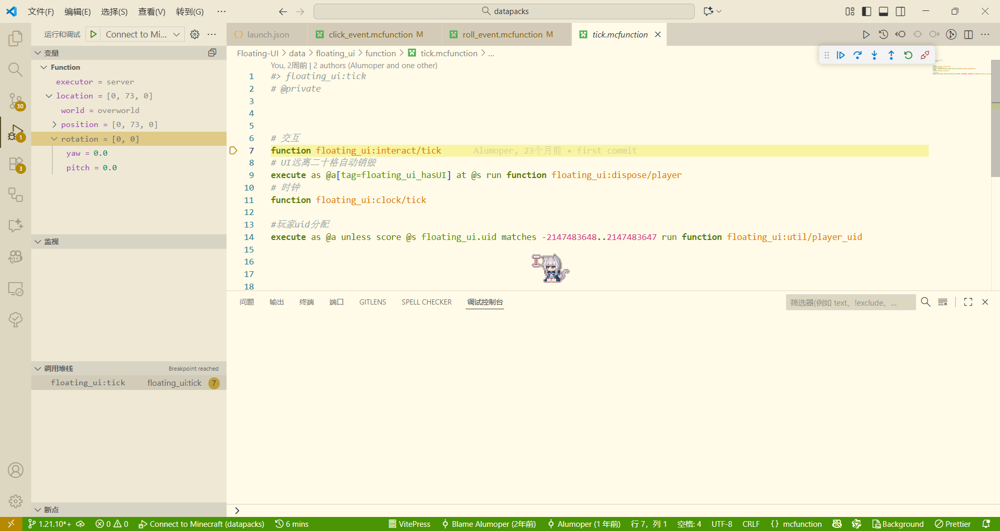
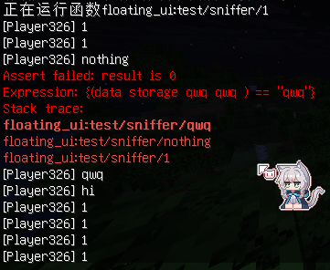
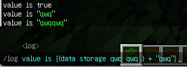
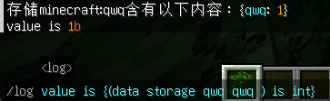
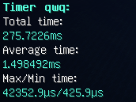
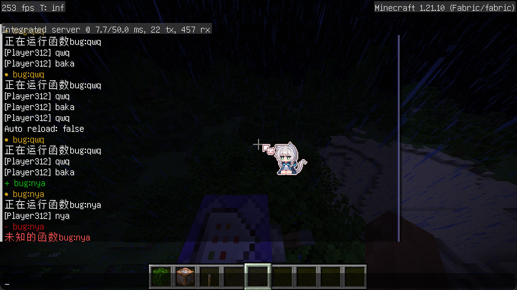
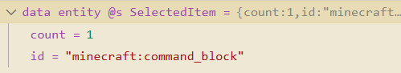

<FeatureHead
    title = "Sniffer: Data pack development support Mod from Fabric"
    authorName = "Alumopper"
    resourceLink = 'https://github.com/mcbookshelf/sniffer'
    cover = '../../../../../feature/archive/202512/_assets/6.png'
/>

What command is used most by data pack developers?`scoreboard`？ `execute`？`data`? still`function`? What is the most used`say`and`tellraw`?

Just imagine, suppose your data pack encounters a problem, for example, a certain command is not executed, for example, there may be a problem with a certain process quantity, what will you do?`say hi`or`say 123`Like this, most data pack authors must have done it. If you have ever written in Java, you will notice that breakpoints are more used to debug bugs in Java, rather than changing the content of the code every time and then constantly compiling and running - it is too inefficient.

So, why not let the development of data pack also enjoy the convenience of breakpoint debugging?

This is the predecessor of Sniffer, Datapack-Debugger. Datapack-Debugger provides basic in-game breakpoint debugging functions. Then theo from bookshelf took over the project and added vscode support to it, thus getting the current Sniffer. After my two patch and update contributions, Sniffer has become a feature-rich data pack debugging mod, directly addressing the pain points in the debugging process of data pack developers.

# Sniffer

Sniffer is a data pack development auxiliary mod based on Fabric. With the VSCode plug-in, in addition to realizing the most basic breakpoint debugging function, it also provides debugging command, hot reload, overflow warning and other functions.

Sniffer aims to add various convenient functions to data pack development to the greatest extent without destroying the original data pack.

Sniffer requires pre-modules: cloth-config and fabric-api.

Currently only 1.21.10 is supported, but it shouldn’t be difficult to adapt to other versions. (

## Breakpoint debugging

As the most basic and signature function of this Mod, breakpoint debugging is naturally introduced first.

There are two ways to enable breakpoints. One is to set it with the support of the VSCode plug-in, and the other is to manually write the breakpoint command in the function file.

However, no matter what, you must first open the game, enter the save file, and then have a data pack.

### VSCode support

The Sniffer plug-in is not directly released in the plug-in market, so you need to manually download it from here and install it to VSCode.

Subsequently, you need to`.vscode`Create one under the folder`launch.json`file with the following content:

```json
{
  "version": "0.2.0",
  "configurations": [
    {
      "type": "sniffer",
      "request": "attach",
      "name": "Connect to Minecraft",
      "address": "ws://localhost:25599/dap"
    }
  ]
}
```
Then click the Debug button or press`F5`key and VSCode will try to connect to Minecraft. If the connection is successful, information will be output in the game's chat bar, and you can see that VSCode has also entered the debugging state. Now, you can start breakpoint debugging! Click on the left side of the code area to set a breakpoint, just like you use breakpoints when developing in any other language. Then when the function runs to this place, the breakpoint will be triggered and the game will be frozen. At this time, you can execute the step and wait to execute the command line by line, and observe the execution process of the command and the value of the intermediate process.



### No plugins

If you don't want to use a plug-in, or are using a text editor other than VSCode, you can use the manual breakpoint command to set breakpoints in the data pack. Insert a line where you want the breakpoint to be triggered`#!breakpoint`, the breakpoint can be triggered when the function reaches this place. After that, you can execute the command provided by Sniffer in the game to control the execution of the command.

Sniffer provides the following commands related to breakpoint debugging:

*`breakpoint continue`: After triggering the breakpoint, unfreeze the state and continue execution.
*`breakpoint step`: After triggering the breakpoint, execute the next command and remain frozen (step by step)
*`breakpoint step_over`: After triggering the breakpoint, execute the next command of the current function and remain frozen (process by process)
*`breakpoint step_out`: After triggering the breakpoint, execute until the function returns and remain frozen (eviction)

When the game is in a breakpoint state, you can still execute any command through the chat bar and observe the return of the command, thereby obtaining any process quantities during the command execution.

## Debug command line

In the data pack,`#`The first line is recognized as a comment, and in Sniffer, a further debugging command line is added based on this.

use`#!`The first line of command will be recognized as **debug command line**. After Sniffer is installed, the debugging command line will be executed as a normal command. If Sniffer is not installed, it will be ignored by the game as a comment. Therefore, the debug command line provides a non-destructive way to use Sniffer-specific debug commands in a data pack. Remember how to use breakpoint debugging without plug-ins before? We inserted it in the command`#!breakpoint`, in fact, the debugging command line is used. This will only be considered a breakpoint if Sniffer is installed. The vanilla game will directly ignore it as a comment, so it will not have any impact on the use of the data pack after it is released, unless the user also installs Sniffer (

The debug command line can execute any command, so we can implement some interesting things, such as conditional breakpoints:

```mcfunction
say 1
#! execute if score @s test_score matches 0 run breakpoint
say 2
```
That's right, meow, since`breakpoint`It is a command in itself, of course it can be combined with`execute`Use to implement conditional breakpoints. Here, only when the executor`test_score`The breakpoint will only be triggered when the value is 0, otherwise the game will continue to execute.

## Assert

When you want to determine whether the function runs to a certain position and the value of the process value is as expected, you may need`assert`command。

`assert`The format of command is`assert &lt;condition>`. When the return value of the condition is not`true`or`0b`, the game will output an error message and the function's call stack.

chestnut:

```mcfunction
say 1
say 2
say 3

#!assert {(score @s test ) <= 10}
say 4
say 5
```
There is a lot of mystery in this conditional parameter. It is actually a`{}`Wrapped expression, and in this expression, you can get some data and perform some basic calculations on them. use`()`Wrapped calculations to obtain an NBT or scoreboard, etc., and the format in parentheses is`execute if`The format after the subcommand is very similar. Now, Sniffer supports obtaining the following data:

*`score &lt;score_holder&gt; &lt;objective&gt;`Get`holder`on the scoreboard`objective`value in . return`int`Type nbt.
*`data (entity &lt;selector&gt;/storage &lt;id&gt;/block &lt;pos&gt;) &lt;path&gt;`Get the specified NBT data. Returns the nbt value of the corresponding type.
*`name &lt;entity&gt;`Get the name of the specified entity. Returns a text component.

:::warning Defects
Due to technical reasons,`)`In the command system, it will be parsed as part of a legal NBT path, so such as`(data storage io test)`Such an expression will be affected by the final`)`is parsed as an NBT path, causing a parsing error. The current temporary solution is to add a space before the final bracket:`(data storage io test )`, although it looks ugly, it is indeed the simplest and most effective method at present (if you think it doesn’t look good, you can also add a space in front of it.`( data storage io test )`(x)
:::

After obtaining the data, Sniffer also supports some basic operations on the data. What operations are there?

The operators currently supported by Sniffer are:

*`+`, `-`, `*`, `/`, `%`: Basic mathematical operators
*`==`, `!=`, `&lt;`, `&lt;=`, `>`, `>=`: comparison operator
*`&&`, `||`, `!`: Logical operators for boolean values
*`is`: Checks whether a value is of the specified type. Returns a Boolean NBT. Available types are:`nbt`, `text`, `string`, `number`, `byte`, `short`, `int`, `long`, `float`, `double`, `int_array`, `long_array`,` byte_array`, `list`, `compound`



:::note note
There is no operation priority in Sniffer expressions - due to the limitations of the command system and to simplify the parsing process, Sniffer will always complete the expression calculation from left to right. If you want certain values ​​to be evaluated first, nest expressions within expressions, e.g.`{a + {b * c}}`this form
:::

## Log

Based on expressions, Logcommand provides`tellraw`Command is a simpler and richer debugging output method.

Its format is`log &lt;content>`. log can be text containing an expression or any plain text.

chestnut:

```mcfunction
say 1
say 2
say 3

#!log The score of @s in test objective is {(score @s test )}
say 4
say 5
```
For example, the command executor's`test`The value in the scoreboard is 10, then after this command is executed, it will be output in the chat bar:`The score of @s in test objective is 10`.

I believe everyone can understand this example at a glance, so I won’t go into details here.





## Jvmtimer

Sniffer provides a simple based on`System.nanoTime()`Method command performance testing tool. Its command format is as follows:

*`jvmtimer start &lt;id&gt;`: Start the timer with the specified id.
*`jvmtimer end &lt;id&gt;`: Stop the timer of the specified id. Results will be saved to the game and run multiple times for more accurate average results.
*`jvmtimer get &lt;id&gt;`: Get the result of the timer with the specified id.
*`jvmtimer reset &lt;id&gt;`: Clears the result of the timer with the specified id and resets its status.
*`jvmtimer disable &lt;id&gt;`: Disable the timer with the specified id.

For example, if we want to test the time it takes to execute a command, we can do this:

```mcfunction
#!jvmtimer start test
say 1
say 2
function test:test
#!jvmtimer end test
```
After running it many times (usually hundreds of times with tick), use`jvmtimer get test`command to get the result of the timer.



If the timer is not stopped after a tick ends, and the timer is started repeatedly on the next tick, Sniffer will consider the timer to be leaked and disable it. Need to confirm that the timer is terminated correctly, use`jvmtimer reset test`command to reset the timer.

## Hot reload

For any data pack developer, I believe that something that is indispensable every day is`reload`, non-stop`reload`. Found a bug, add one here`say hi`,Then`reload`, delete it after repairing`reload`, then found that there was still a problem, and added another`say hi`,Then`reload`. Let’s talk about the command that has been run the most times in the chat bar.`reload`It's probably possible to keep the two in contention.

For small projects, reloading data pack does not take much time, but for larger projects,`reload`The game may freeze for a second or two, or even several seconds. Having to wait for a few seconds every time is really a bit anxious. And every time`reload`After the execution is completed, with`load`The command of the tag will be executed again, which is sometimes annoying.

Therefore, Sniffer provides a way to hot reload the function files in the data pack. After turning on monitoring of the data pack folder, Sniffer can quickly apply changes to the game without reloading the data pack.

Use Watchercommand to control Sniffer's data pack monitor. Its format is as follows:

*`watch start &lt;data pack folder name>`: Start monitoring all valid commandfunction files in the specified folder (the path is correct and can be parsed into a valid namespace)
*`watch stop &lt;data pack folder name>`: Stop monitoring the specified folder
*`watch reload`: Perform a hot reload, immediately applying changes detected by all monitors
*`watch auto [true|false]`: Set whether to enable automatic hot reload. After turning it on, as long as the monitor detects file changes, it will immediately try to apply the changes, otherwise it will need to be executed manually.`watch reload`command.

Every time hot reload is completed, a prompt message will be output in the chat bar. If a problem is encountered when trying to apply hot reload, such as an error in parsing the command format of the function file, Sniffer will output an error message in the log and give up applying the modification.



:::warning known issues
Currently, the monitor cannot monitor changes to function files in sub-packages, nor can it monitor changes to json files.

When in a breakpoint state and the execution position is in a macro function, changes to the macro function will not affect the parsed macro function currently being executed.
:::

<ColorLine/>

## Future features

:::tip Unreleased features
These features have been pushed, but have not yet been merged into the main branch, or are still under development
:::

### VSCode expression calculation

Sniffer's VSCode plug-in supports inputting a sum in the expression calculation interface of the VSCode debug bar.`assert`and`log`An expression with the same format as the expression in and returns a calculated result. During the step-by-step debugging process, this value is calculated and updated in real time. For simplicity, the expression entered in VSCode does not need to contain the first and last parentheses.



### Annotations

Use`#@`Leading comment lines are interpreted as comments. Annotations can mark a function file or a line of command. For example, marking a function as loadfunction means that it needs to be re-executed when hot reload updates the function. The existing/planned annotations include:

*`#@load`: Mark this function file as needing to be re-executed during hot reload execution.
*`#@throw &lt;type&gt;`: Capture exceptions that may be encountered during the execution of the command line below, such as the target selector not selecting the entity, the scoreboard being undefined, etc.

<ColorLine/>

Currently, Sniffer is still in the development stage. If you encounter any problems during use, you are welcome to raise an issue in the warehouse~

Happy debugging!