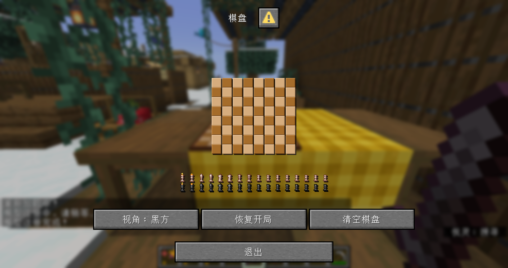
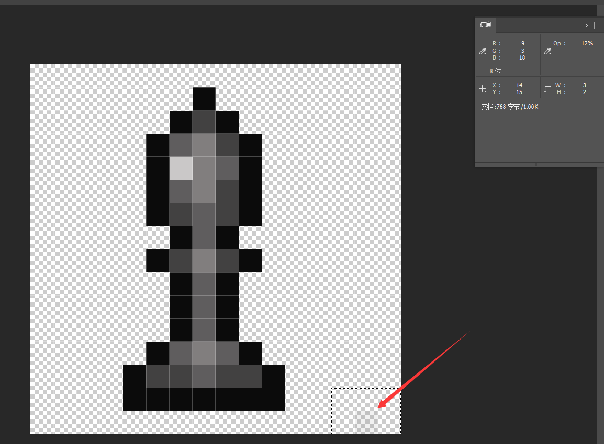

::: tip Translation notice
This page was translated with machine translation and may contain inaccuracies. If you can help improve it, please open an issue or submit a pull request.
:::


<FeatureHead
    title="How to use the latest and hottest MC features to create exciting chess pieces (Part 1)"
    authorName="CR_019"
    cover= '../../../../../feature/archive/202601/_assets/d.png'
/>

[Show video](https://www.bilibili.com/video/BV1YXbazMEpn)

As shown in the video, this is a chess game implemented in vanillaMC using data pack + resource pack. It can realize normal placement and capture of pieces, and provides two quick options to clear the chessboard and resume the start. In addition, the real-time position of the chess game can be displayed normally on the chessboard model.

The technology used in this work includes many new features updated in the past two years: dialog, item model mapping, function macros, and many technologies derived from them. Next, I will conduct a technical analysis of the project from three perspectives: chessboard model, chess game interface, and back-end system.

## Prerequisite content: chess game data structure
It is not difficult to save a chess game board. We only need to record the corresponding coordinates of each chess piece. \
Therefore, we can maintain a structure to store the corresponding chess pieces.$x$and$y$coordinate. In order to facilitate data pack write-time indexing, we maintain two levels:`black`and`white`, under which the coordinates of each chess piece of the corresponding camp are stored. Finally, the following structure is obtained:

```mcfunction
data modify entity @s data.chessboard set value {\
    chess_pieces:{\
        white:{\
            rook0:{x:0,y:0},\
            rook1:{x:7,y:0},\
            knight0:{x:1,y:0},\
            knight1:{x:6,y:0},\
            bishop0:{x:2,y:0},\
            bishop1:{x:5,y:0},\
            king:{x:3,y:0},\
            queen:{x:4,y:0},\
            pawn0:{x:0,y:1},\
            pawn1:{x:1,y:1},\
            pawn2:{x:2,y:1},\
            pawn3:{x:3,y:1},\
            pawn4:{x:4,y:1},\
            pawn5:{x:5,y:1},\
            pawn6:{x:6,y:1},\
            pawn7:{x:7,y:1}\
        },\
        black:{\
            rook0:{x:0,y:7},\
            rook1:{x:7,y:7},\
            knight0:{x:1,y:7},\
            knight1:{x:6,y:7},\
            bishop0:{x:2,y:7},\
            bishop1:{x:5,y:7},\
            king:{x:3,y:7},\
            queen:{x:4,y:7},\
            pawn0:{x:0,y:6},\
            pawn1:{x:1,y:6},\
            pawn2:{x:2,y:6},\
            pawn3:{x:3,y:6},\
            pawn4:{x:4,y:6},\
            pawn5:{x:5,y:6},\
            pawn6:{x:6,y:6},\
            pawn7:{x:7,y:6}\
        }\
    }\
}
```

Stored in the chessboard root entity`data.chessboard.chess_pieces`under the path.

In particular, if the piece is captured or not on the board, use`{x:-1,y:-1}`logo.

## Part1: chessboard model
In order to make the chessboard model placeable, I used the decoration model pre-library dc that I developed myself, so that it can be placed in the world and take over interaction events. \
In short, each placed model consists of a root entity, a display entity, and an interactive entity. We usually use the root entity to handle logical events and the display entity to handle model display.

More details are omitted here, and we go directly to the problem of how to display the chess game synchronously.

In order for the chess pieces to be displayed on each square of the chessboard, we need to build a model for each square of each chess piece. Therefore it is necessary$64\times16$model. \
This is the most important step in this part. Fortunately, the positions of the models are very regular. With the help of AI, we can write a script and use a program to generate them in batches. \
After getting these models, we can use "assemble the model" in item model mapping (`composite`Type mapping) combines these models.

We will model the`custom_model_data`of`string`A list is defined as a$64$A list of items, each item representing a square on the chessboard. \
For example`0`item representative`(1,1)`,`14`Item representation`(2,7)`. The value of the item represents the chess piece on this grid,`empty`It means there are no chess pieces, and when there are chess pieces, it means`(兵种)_(阵营)`Indicates the type of chess piece. \
for example:`king_black`Represents the Black King. \
We also use AI to generate scripts to complete the writing of this model mapping.

In this way, the task on the resource pack side is completed. You only need to modify the model on the data pack side`custom_model_data`The list allows the chess pieces to be displayed at the specified position.

Create a function to synchronize chess game data and model display:

::: details data\chess\function\events\sync\sync.mcfunction

```mcfunction
execute as @n[type=item_display,tag=pc_chess_sync_display] run data modify entity @s item.components.minecraft:custom_model_data.strings set value ["empty","empty","empty","empty","empty","empty","empty","empty","empty","empty","empty","empty","empty","empty","empty","empty","empty","empty","empty","empty","empty","empty","empty","empty","empty","empty","empty","empty","empty","empty","empty","empty","empty","empty","empty","empty","empty","empty","empty","empty","empty","empty","empty","empty","empty","empty","empty","empty","empty","empty","empty","empty","empty","empty","empty","empty","empty","empty","empty","empty","empty","empty","empty","empty"]

data modify storage pc:chess temp.sync.piece set value "pawn_white"
function chess:events/sync/_utils/calculate with entity @s data.chessboard.chess_pieces.white.pawn0
function chess:events/sync/_utils/sync_ with storage pc:chess temp.sync
function chess:events/sync/_utils/calculate with entity @s data.chessboard.chess_pieces.white.pawn1
function chess:events/sync/_utils/sync_ with storage pc:chess temp.sync
function chess:events/sync/_utils/calculate with entity @s data.chessboard.chess_pieces.white.pawn2
function chess:events/sync/_utils/sync_ with storage pc:chess temp.sync
function chess:events/sync/_utils/calculate with entity @s data.chessboard.chess_pieces.white.pawn3
function chess:events/sync/_utils/sync_ with storage pc:chess temp.sync
function chess:events/sync/_utils/calculate with entity @s data.chessboard.chess_pieces.white.pawn4
function chess:events/sync/_utils/sync_ with storage pc:chess temp.sync
function chess:events/sync/_utils/calculate with entity @s data.chessboard.chess_pieces.white.pawn5
function chess:events/sync/_utils/sync_ with storage pc:chess temp.sync
function chess:events/sync/_utils/calculate with entity @s data.chessboard.chess_pieces.white.pawn6
function chess:events/sync/_utils/sync_ with storage pc:chess temp.sync
function chess:events/sync/_utils/calculate with entity @s data.chessboard.chess_pieces.white.pawn7
function chess:events/sync/_utils/sync_ with storage pc:chess temp.sync

data modify storage pc:chess temp.sync.piece set value "rook_white"
function chess:events/sync/_utils/calculate with entity @s data.chessboard.chess_pieces.white.rook0
function chess:events/sync/_utils/sync_ with storage pc:chess temp.sync
function chess:events/sync/_utils/calculate with entity @s data.chessboard.chess_pieces.white.rook1
function chess:events/sync/_utils/sync_ with storage pc:chess temp.sync

data modify storage pc:chess temp.sync.piece set value "knight_white"
function chess:events/sync/_utils/calculate with entity @s data.chessboard.chess_pieces.white.knight0
function chess:events/sync/_utils/sync_ with storage pc:chess temp.sync
function chess:events/sync/_utils/calculate with entity @s data.chessboard.chess_pieces.white.knight1
function chess:events/sync/_utils/sync_ with storage pc:chess temp.sync

data modify storage pc:chess temp.sync.piece set value "bishop_white"
function chess:events/sync/_utils/calculate with entity @s data.chessboard.chess_pieces.white.bishop0
function chess:events/sync/_utils/sync_ with storage pc:chess temp.sync
function chess:events/sync/_utils/calculate with entity @s data.chessboard.chess_pieces.white.bishop1
function chess:events/sync/_utils/sync_ with storage pc:chess temp.sync

data modify storage pc:chess temp.sync.piece set value "king_white"
function chess:events/sync/_utils/calculate with entity @s data.chessboard.chess_pieces.white.king
function chess:events/sync/_utils/sync_ with storage pc:chess temp.sync

data modify storage pc:chess temp.sync.piece set value "queen_white"
function chess:events/sync/_utils/calculate with entity @s data.chessboard.chess_pieces.white.queen
function chess:events/sync/_utils/sync_ with storage pc:chess temp.sync


data modify storage pc:chess temp.sync.piece set value "pawn_black"
function chess:events/sync/_utils/calculate with entity @s data.chessboard.chess_pieces.black.pawn0
function chess:events/sync/_utils/sync_ with storage pc:chess temp.sync
function chess:events/sync/_utils/calculate with entity @s data.chessboard.chess_pieces.black.pawn1
function chess:events/sync/_utils/sync_ with storage pc:chess temp.sync
function chess:events/sync/_utils/calculate with entity @s data.chessboard.chess_pieces.black.pawn2
function chess:events/sync/_utils/sync_ with storage pc:chess temp.sync
function chess:events/sync/_utils/calculate with entity @s data.chessboard.chess_pieces.black.pawn3
function chess:events/sync/_utils/sync_ with storage pc:chess temp.sync
function chess:events/sync/_utils/calculate with entity @s data.chessboard.chess_pieces.black.pawn4
function chess:events/sync/_utils/sync_ with storage pc:chess temp.sync
function chess:events/sync/_utils/calculate with entity @s data.chessboard.chess_pieces.black.pawn5
function chess:events/sync/_utils/sync_ with storage pc:chess temp.sync
function chess:events/sync/_utils/calculate with entity @s data.chessboard.chess_pieces.black.pawn6
function chess:events/sync/_utils/sync_ with storage pc:chess temp.sync
function chess:events/sync/_utils/calculate with entity @s data.chessboard.chess_pieces.black.pawn7
function chess:events/sync/_utils/sync_ with storage pc:chess temp.sync

data modify storage pc:chess temp.sync.piece set value "rook_black"
function chess:events/sync/_utils/calculate with entity @s data.chessboard.chess_pieces.black.rook0
function chess:events/sync/_utils/sync_ with storage pc:chess temp.sync
function chess:events/sync/_utils/calculate with entity @s data.chessboard.chess_pieces.black.rook1
function chess:events/sync/_utils/sync_ with storage pc:chess temp.sync

data modify storage pc:chess temp.sync.piece set value "knight_black"
function chess:events/sync/_utils/calculate with entity @s data.chessboard.chess_pieces.black.knight0
function chess:events/sync/_utils/sync_ with storage pc:chess temp.sync
function chess:events/sync/_utils/calculate with entity @s data.chessboard.chess_pieces.black.knight1
function chess:events/sync/_utils/sync_ with storage pc:chess temp.sync

data modify storage pc:chess temp.sync.piece set value "bishop_black"
function chess:events/sync/_utils/calculate with entity @s data.chessboard.chess_pieces.black.bishop0
function chess:events/sync/_utils/sync_ with storage pc:chess temp.sync
function chess:events/sync/_utils/calculate with entity @s data.chessboard.chess_pieces.black.bishop1
function chess:events/sync/_utils/sync_ with storage pc:chess temp.sync

data modify storage pc:chess temp.sync.piece set value "king_black"
function chess:events/sync/_utils/calculate with entity @s data.chessboard.chess_pieces.black.king
function chess:events/sync/_utils/sync_ with storage pc:chess temp.sync

data modify storage pc:chess temp.sync.piece set value "queen_black"
function chess:events/sync/_utils/calculate with entity @s data.chessboard.chess_pieces.black.queen
function chess:events/sync/_utils/sync_ with storage pc:chess temp.sync
```

:::

::: details data\chess\function\events\sync\\\_utils\calculate.mcfunction
```mcfunction
#计算棋子坐标
$scoreboard players set $x pc_chess_position $(x)
$scoreboard players set $y pc_chess_position $(y)

execute if score $x pc_chess_position matches -1 run return run data modify storage pc:chess temp.sync.position set value -1

scoreboard players operation $result pc_chess_position = $y pc_chess_position
scoreboard players operation $result pc_chess_position *= $8 pc_chess_position
scoreboard players operation $result pc_chess_position += $x pc_chess_position

execute store result storage pc:chess temp.sync.position int 1 run scoreboard players get $result pc_chess_position
```

:::

::: details data\chess\function\events\sync\\\_utils\sync\_.mcfunction

```mcfunction
execute if score $x pc_chess_position matches -1 run return 0
$data modify entity @n[type=item_display,tag=pc_chess_sync_display] item.components."minecraft:custom_model_data".strings[$(position)] set value "$(piece)"
```


:::

You can see that this function first passes in a completely empty`custom_model_data`list, and then exhaustively read the position of each chess piece, through$xy$coordinate calculation`custom_model_data`The corresponding number of items in the list, and finally set the corresponding item to the string corresponding to the chess piece, and then push the entire list to the data of the item model.

In this way, we can synchronize the chess game situation through this function at any time, and it can be called after updating the chess game status data under any circumstances.

## Part2: Chess game interface

After placing the model, right-click the chessboard with your bare hands to open the chess game interface. The interface is made using dialog. \
Dialog is an itch for data pack authors. It provides a very convenient UI interface, but it is not easy to use. Fortunately, Mojang did not block the click event of the text component, allowing us to use font black technology to perform some limited typesetting on it.

As a dialog that displays the chess game in real time, we naturally need to use the inline macro dialog to achieve dynamics. For the specific implementation method, see [Chapter of the previous issue of "Picking Dust"](/en/resources/dust/8/对话框小游戏.md), which will not be described again here. \
The main body of the chess game interface consists of three groups of text, the text of the chessboard, the text of the chess pieces, and the text of the selection box. \
We are in the resource pack`dialog`The textures corresponding to these texts are registered in the font, and positive and negative space fonts of different lengths are registered, which will be used later.

The first step is to assemble the board. Alternately place black and white fonts to create a chessboard. However, it should be noted that because the default font needs to render shadows, there is a 1-pixel gap between words. We need to use a 1-pixel negative space to eliminate this gap. \
Vertical line breaks are used for splicing. Since the number of pixels downwards of the line breaks is fixed, we need to set an appropriate height in the font settings so that the top and bottom can be seamlessly spliced.

> The effect of direct splicing is as follows:
> 

The second step is to render the chess pieces. The positions of the pieces, as mentioned above, are easy to read. But how to put the fonts corresponding to the chess pieces on the chessboard? \
Inserting into the specified coordinate will definitely not work. It will be displayed in the middle of the two chessboards, and will destroy the text list and cause errors in the positioning of subsequent chess pieces. Therefore, we choose to append the text corresponding to the chess piece to the end of this line of text. First, use a negative space of a specified length to move the cursor to the specified grid position, and then use a corresponding positive space to move the cursor back to the end of the line, so as not to affect the rendering of subsequent chess pieces. \
Here, our font width and height are$9$pixels, so every time we move forward$n$grid, you need$9 \times n$negative spaces in pixels, and$9 \times (n-1)$Positive spacing in pixels.

::: warning Some little ideas for font textures
In fact, when MC renders custom fonts, it directly cuts off the blank texture on the right side, causing the chess piece fonts to be unequal width. And when the font is rendered, it will directly discard the opacity less than$10\%$of pixels. Therefore, we need to click on the lower right corner of the font texture with an opacity slightly larger than$10\%$pixels to prevent truncation and try not to be noticed by the player.

:::

The rendering of the selection box is similar to that of chess pieces, so I won’t go into details here. The coordinates are also read and offset to the specified number of grids with negative spaces.

Of course, you can also see the locations outside the chessboard where captured chess pieces are stored. The corresponding position of each chess piece is fixed and will be placed specifically when rendering the chess pieces. The specific implementation method is direct and exhaustive.

All the above texts have click events, and will be set after clicking`trigger`The scoreboard is a specified value. By processing this value, the data pack can learn the number and type of cells clicked by the player and proceed to the next step. The specific implementation of this system will be explained in detail in the back-end system module.

## summary
So we have basically finished talking about the appearance part. In the next issue, we will explain in detail the back-end system of chess, how to read the player's input, modify the game status, and synchronize it to the model and dialog.
