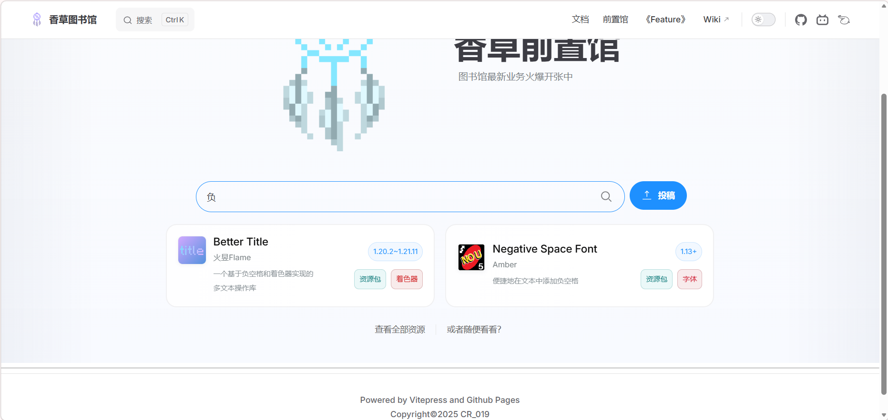

<FeaturedHead
    title = "The latest masterpiece of the library: vanilla pre-library is now online!"
    authorName = "Alumopper"
    resourceLink = 'https://vanillalibrary.mcfpp.top/datapack-index/wheel/'
    cover= '../../../../../feature/archive/202601/_assets/g.png'
/>

Every month, when sorting out the manuscripts received by the library's "Feature", we will receive at least one or two pre-related articles. Over the past few months, there have been a considerable number of preambles included in Vanilla Library articles alone. What's more, in major group chats and websites, you can also see a variety of front-end tools, such as controlling player momentum, such as math libraries, such as UI libraries, and some tools to help data pack development, such as misode performance analysis tools, etc. It is a pity that although these front-end devices are excellent and useful, they are often little known, and there are countless cases of reinventing the wheel. You can often see people asking in various group chats how to do xxx. If there is a pre-search tool and you can find it directly when you need it, you can save a lot of time in the development process.

Therefore, the vanilla front-end library was born.

## Introduction

**Vanilla Wheel Repository** (Vanilla Wheel Repository) is developed and maintained by the Vanilla Library team. It aims to collect various front-end information and provide a search function to facilitate data pack developers to quickly find the front-end they need.

The vanilla front-end library can now be accessed through the **front-end index** button on the homepage, or through the **front-end library** button on the navigation bar. Of course, you can also directly access the address: [https://vanillalibrary.mcfpp.top/datapack-index/wheel](https://vanillalibrary.mcfpp.top/datapack-index/wheel)。

At the bottom of the front-end library search page, you can see a "View all resources" link and a "Or just take a look" link. The former will take you to the page of all resources, where all the pre-processors currently included in the pre-processor library are displayed in pagination, sorted by first alphabetical order. The latter will randomly display six prepositions. When you have no inspiration, it may not be a bad idea to try your luck randomly.

## Submit

Want to add your pre-processor to the pre-processor library? Or do you see any useful tools that you would like to recommend to the front-end library? Anyone can contribute!

Click the **Submit** button on the search page, or directly visit Github's Issue page to fill out the form. (&lt;https://github.com/CR-019/datapack-index/issues/new?template=new_wheel.yaml&gt;).

---

During the use process, if you have any questions or suggestions, you are welcome to submit an Issue or PR, contribute more, support the library, and support the front-end library. Thank you!