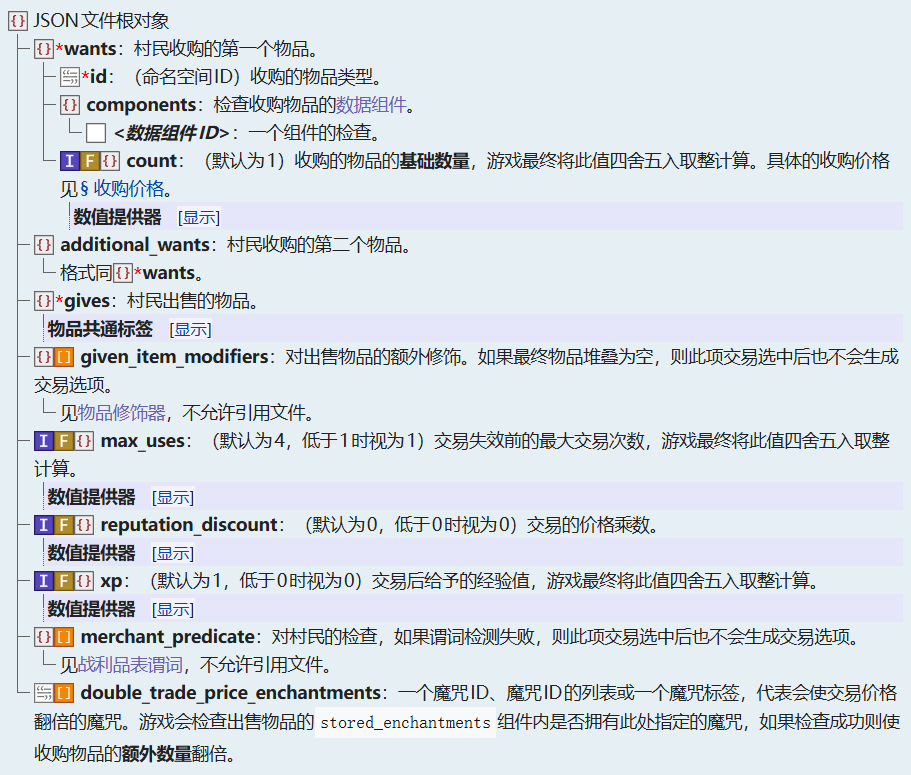
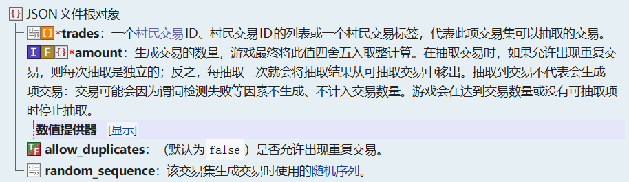

::: tip Translation notice
This page was translated with machine translation and may contain inaccuracies. If you can help improve it, please open an issue or submit a pull request.
:::

<SpotlightHead
    title = "Vanilla News - Mojang Spotlight - January 2026"
    authorName = "Alumopper"
    cover='../../../../../feature/archive/202601/_assets/spotlight.png'
    type=0
/>

Here is ***Vanilla*** news, the most ***Vanilla*** technical snapshot news in Minecraft. Our reporter *Vanilla Fox* reports the latest snapshot news for you~

Mojang released a total of three snapshots this month, namely snapshots 1-3 of 26.1. 26.1 is also the first version of Minecraft to use the new version number rules. Currently, the data pack version has reached **97.0**, and the resource pack version has reached **78.0**.

A lot of interesting content has been updated this month, including data-driven villager transactions, new lighting-related environmental attributes, and new world clock functions, etc.

Let’s talk about the conclusion first. This month’s update is less destructive and more practical. It is generally at the **Super Large Cup** level.

## Villager transaction data driven

In 26.1-snapshot-1, trade options for villagers and wandering traders were data driven. Villagers' transactions are now mainly controlled by two registration items, namely the transaction blueprint`villager_trade`and transaction set`trade_set`。

`villager_trade`Registration item, that is`data/命名空间/villager_trade`Each json file in represents a transaction blueprint. Villagers and wandering traders generate trades based on trade blueprints. Its definition structure is as follows:

`trade_set`defines the transaction combinations provided by villagers. However, this definition is currently hard-coded and can only cover the existing vanilla transaction set. The current transaction set defined by vanilla includes transactions for villagers of corresponding levels in corresponding professions.`&lt;profession&gt;/level_&lt;level&gt;`, and for wandering traders`wandering_trader/buying`，`wandering_trader/uncommon`and`wandering_trader/common`. Its definition structure is as follows:

use`reload`These two registration items cannot be reloaded, and the server must be restarted (exit the world and re-enter in single-player mode).

## Lighting environment properties

In 26.1-snapshot-1, environmental attributes related to lighting were added, which means that changes in environmental lighting can be controlled in different mob groups or different time periods.

The current lighting environment attributes are:

* `minecraft:visual/block_light_tint`

The RGB value controls the hue of the block lighting. The block lighting color is gray in low light, tinted by this property in medium light, and white in high light. By default, it takes on the yellow hue of a torch. All light sources on the current screen will be affected by this property, and the color cannot be specified for each light source. If different block lighting tones are defined in different mob groups, the color of the light source seen by the player will only be related to the mob group where the player is located, and will not be related to the mob group where the light source is located. The following attributes are the same.

* `minecraft:visual/ambient_light_color`

RGB value. Control the color of ambient lighting.

* `minecraft:visual/night_vision_color`

RGB value. When the player has night vision effects, use`minecraft:visual/night_vision_color`and`minecraft:visual/ambient_light_color`The maximum value in the three RGB channels is used as the final color.

## world clock

The world clock (World Clock, the translation has not yet been determined) is a newly added mechanism in 26.1-snapshot-3. Previously, there was actually a built-in world clock, which was used to control the day and night cycle, the behavior of the timeline, etc., which could be used`time`command control, but now, the world clock is completely data driven, in the namespace folder`world_clock`The json file defined in the directory is a world clock. The definition structure of world clock does not contain any fields, which means you only need to write one in your json file`{}`That’s it.

With the addition of the world clock, many changes and enhancements have been made.

For timelines, it is now possible to use`clock`field specifies which world clock the timeline is using, use`minecraft:overworld`Indicates using the vanilla built-in default world clock, which is consistent with the default behavior of the previous timeline. In the definition of dimension type, a new`default_clock`Optional field to specify which world clock this dimension will use, that is`time`The clock controlled by command.

`time`Command also underwent a round of enhancements following the world clock. original`time`The behavior of the command will control the default world clock of the current dimension (`default_vlock`field specifies the world clock). At the same time, you can also use`time of &lt;clock&gt;`Control a specific world clock. also,`time`command can now control the pausing and resuming of the world clock. use`time [of &lt;clock&gt;] pause`To pause the world clock, use`time [of &lt;clock&gt;] resume`Continue the paused world clock.`time add`and`time set`The return value of the command also becomes the total number of ticks passed by the world clock being operated on, rather than the current time.

## `swing`command

`swing`Command is a newly added command in 26.1-snapshot-1. As a small toy, it can control the arm swing animation of entities that support this animation, such as player models and zombies.

command format:`/swing [&lt;targets&gt;] [mainhand|offhand]`

## Miscellaneous

Added item modifier:

* `minecraft:set_random_dyes`: If item is in`#dyeable`tag, set the item's`minecraft:dyed_color`Data component.
* `minecraft:set_random_potion`: Randomly set items from the given list`minecraft:potion_contents`Data component.

Modified item decorator:

* `minecraft:enchant_with_levels`and`minecraft:enchant_randomly`Added Boolean field`include_additional_cost_component`, indicating whether to increase the item according to the cost of the spell`minecraft:additional_trade_cost`components.

Added to entitypredicate's player subpredicate`food`Fields used to check the player's hunger and saturation levels.

`lightmap.fsh`been significantly modified.

Please check the update log for more details~

* 26.1-snapshot-1：&lt;https://zh.minecraft.wiki/w/Java%E7%89%8826.1-snapshot-1&gt;
* 26.1-snapshot-2：&lt;https://zh.minecraft.wiki/w/Java%E7%89%8826.1-snapshot-2&gt;
* 26.1-snapshot-3：&lt;https://zh.minecraft.wiki/w/Java%E7%89%8826.1-snapshot-3&gt;

