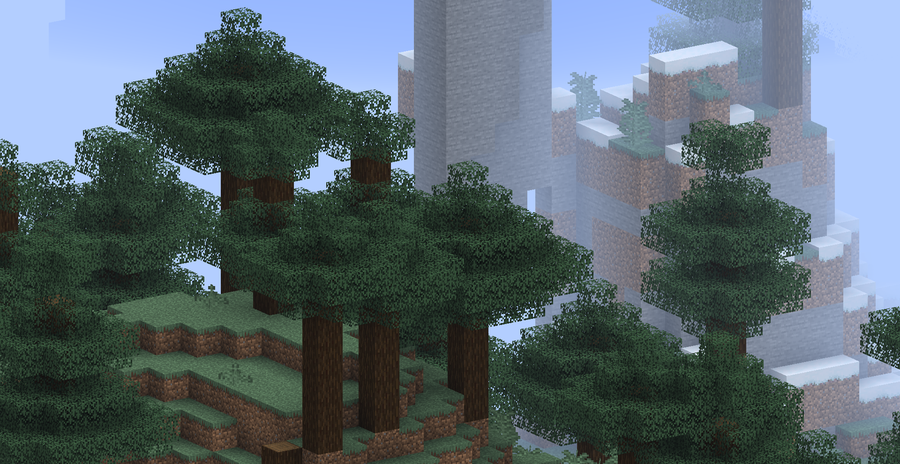
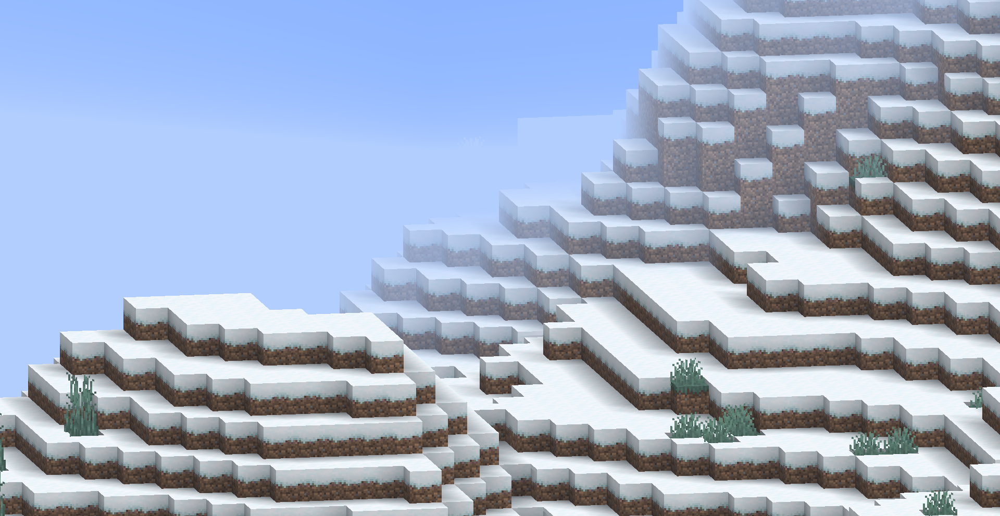
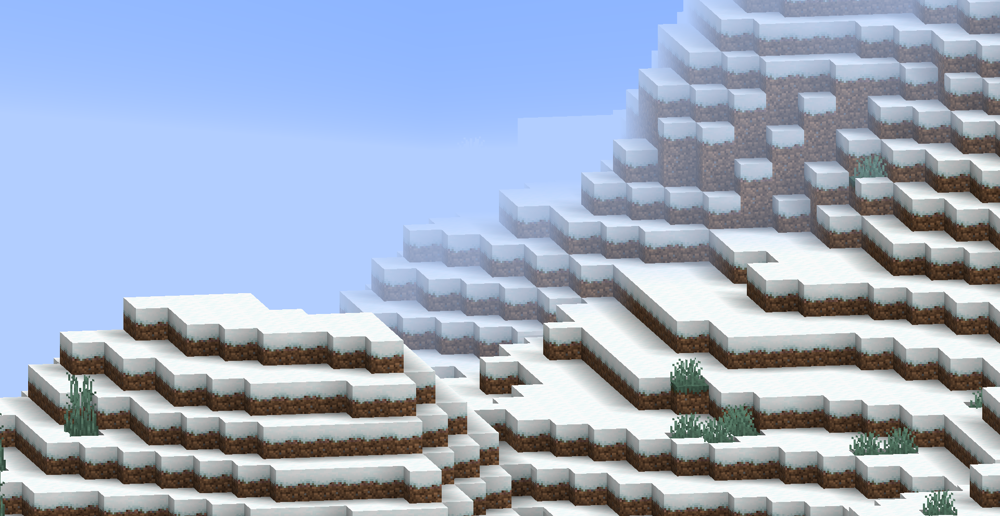

<FeaturedHead
    title="Shader Practice: Construction of a Simple 2D Scene"
    authorName="Xuanyu 1725"
    cover = '../../../../../feature/archive/202602/_assets/1.png'
/>

> [Those who make 2Dvanillablock maps are all fashionable men](https://www.bilibili.com/video/BV1L44y1L7wD/)
> —— Qingluka

## Summary

Many maps in Minecraft are controlled from a native 3D perspective, and there are also some maps with a fixed-angle third-person perspective, but few maps are designed and played from a pure 2D perspective. This document will introduce how to use Minecraft's resource pack and data pack functions, combined with some common atomic operations, to implement a simple 2D scene.

The content described in this article uses 1.21.10 vanillaclient and resource pack and data pack for demonstration. Mainly using shader-based rendering control, particles, display entities and other means to achieve the visual effects of 2D scenes. The data pack part is used to implement some interactive logic.

## Preface

This tutorial assumes that readers already have a certain foundation in making Minecraft resource packs and data packs, are familiar with GLSL shader programming, and understand Minecraft's rendering pipeline and related concepts. If you are not familiar with these contents, it is recommended to refer to the relevant basic tutorials first. (Or read it first, then go back and look up the relevant information when you encounter something you don’t understand)

MVP transformation related (principles and derivation of ModelViewMat, ProjMat):
- [shader02 core shader workflow (Part 1), Feature, 2025, 09](/en/feature/archive/202509/3/content)

Lighting and fog related (intensity calculation process):
- [shader03 core shader workflow (Part 2), Feature, 2025, 11](/en/feature/archive/202511/2/content)


## resource pack preparation

### Orthographic projection

The core of 2D scenes lies in the control of perspective. Minecraft uses perspective projection by default, which causes distant objects to appear smaller. In order to achieve a 2D effect, we need to change the projection method to orthogonal projection (not necessary in all 2D scenes).

In order to achieve this goal, we need to modify the process of MVP transformation and replace the projection matrix with an orthogonal projection matrix.

The projection matrix is ​​in`ProjMat`Defined in , the format stored in the video memory is a 4x4 matrix in column-major order:

```glsl
mat4 ProjMat = mat4(
    1/(tan(FOV/2)*Aspect)  ,        0      ,       0      , 0,
                0          , 1/(tan(FOV/2)),       0      , 0,
                0          ,        0      ,  (n+f)/(n-f) , -1,
                0          ,        0      , (2*n*f)/(n-f), 0
);
```
Orthographic projection only cares about the aspect ratio of the near plane, far plane and view frustum, so we can replace it with the following form:

```glsl
mat4 OrthoProjMat = mat4(
    1/(n*tan(FOV/2)*Aspect) ,        0        ,       0     , 0,
               0            , 1/(n*tan(FOV/2)),       0     , 0,
               0            ,        0        ,   -2/(f-n)  , 0,
               0            ,        0        , -(f+n)/(f-n), 1
);
```
The necessary information can be obtained directly from`ProjMat`obtained from.

```glsl
float tan_half_FOV = 1.0 / ProjMat[1][1];
float aspect = ProjMat[1][1] / ProjMat[0][0];
float n = (ProjMat[3][2] + 1.0) / ProjMat[2][2];
float f = (ProjMat[3][2] - 1.0) / ProjMat[2][2];

mat4 OrthoProjMat = mat4(
    1.0 / (n * tan_half_FOV * aspect), 0.0, 0.0, 0.0,
    0.0, 1.0 / (n * tan_half_FOV), 0.0, 0.0,
    0.0, 0.0, -2.0 / (f - n), 0.0,
    0.0, 0.0, -(f + n) / (f - n), 1.0
);
```
> This is only a demonstration of the principle. In actual use, we can use [vsh_util.glsl]( provided by Onnowherehttps://github.com/onnowhere/core_shaders/blob/master/.shader_utils/vsh_util.glsl) includes shader tool functionality to simplify operations.
> The method provided by Onnowhere uses a fixed near plane and a ZOOM parameter to control the left, right, top and bottom margins, which is more practical in engineering.

In the vertex shader, we replace the original one with the constructed orthogonal projection matrix`ProjMat`Variables (note, please be sure to completely replace all shaders used in the map) to get the following effect:



Note that since the near plane distance is fixed, the FOV is only used to confirm the near plane size when calculating orthogonal projection. Therefore, adjusting the FOV will not affect the perspective effect of the viewing angle, but will affect the size of the field of view, which has the same control effect as the ZOOM parameter provided by Onnowhere.

> Editor's suggestion: First adjust the ZOOM parameter when the FOV is the largest, so that the field of view covers the entire scene, and at the same time allow the player to adjust the FOV to zoom the field of view. (If the player is not allowed to adjust the FOV, you can directly fix the FOV obtained in the shader to a constant value)

### Reset the fog

Due to changes in projection methods, it is no longer appropriate to use the distance between the camera position and the vertex position to calculate the fog effect. We need to reset the way the fog is calculated so that it is relative to the Z coordinate.

We first remove the environment fog (spherical fog) by setting the sphericalVertexDistance parameter to 0, and retain the rendering distance fog, because they themselves are used to cover distant objects, regardless of the viewing angle.

```glsl
    fragColor = apply_fog(color, 0.0, cylindricalVertexDistance, FogEnvironmentalStart, FogEnvironmentalEnd, FogRenderDistanceStart, FogRenderDistanceEnd, FogColor);
```




If you do not use the fog effect in your scene, then this step is over (or you can delete all the fog directly)

Our next example will not use fog, but here is a fog calculation method based on Z-axis coordinate for reference by readers who need it. Readers who do not need fog calculation can skip to the next section.

After perspective projection, the depth value of the vertex is stored in`gl_Position.z`, we can use it to calculate the fog effect, but before that we need to do a perspective division manually:

```glsl
//Calculate in vsh
float z_ndc = gl_Position.z / gl_Position.w; //The z value in the normalized device coordinate system, range [-1, 1]
```
Here, the points where z_ndc is -1 all fall on the near plane, and the points where z_ndc is 1 all fall on the far plane. We can linearly map it to the [near, far] range (use vsh_utils to obtain the far plane position, and the near plane takes a constant value of 0.05):

```glsl
//Calculate in vsh
float far = getFarClippingPlane(ProjMat);
float near = 0.05;
float z_view = ((z_ndc + 1.0) / 2.0) * (far - near) + near; //z value in view space, range [near, far]
```
Finally, we modify the fog calculation call,`sphericalVertexDistance`Using our calculated`z_view`, `FogEnvironmentalStart`and`FogEnvironmentalEnd`Then set it according to actual needs (the original value is used in the sample code):

```glsl
//Calculate in vsh
sphericalVertexDistance = z_view;
```


```glsl
//Compute in fsh
    fragColor = apply_fog(color, sphericalVertexDistance, cylindricalVertexDistance, FogEnvironmentalStart, FogEnvironmentalEnd, FogRenderDistanceStart, FogRenderDistanceEnd, FogColor);
```
After the modification, the fog is no longer a spherical fog with the camera as the origin, but a parallel fog with the isosurface always parallel to the camera's viewing plane.

### Lock perspective

Likewise, if you need to dynamically adjust the viewing angle, you can skip this step.

We modify`ModelViewMat`to control the perspective,`ModelViewMat`The format stored in video memory is a 4x4 matrix in column-major order:

```glsl
mat4 ModelViewMat = mat4(
    -cos(yaw),  sin(yaw)*sin(pitch), -sin(yaw)*cos(pitch),  0,
        0    ,       cos(pitch)    ,       sin(pitch)    ,  0,
     sin(yaw), -cos(yaw)*sin(pitch), -cos(yaw)*cos(pitch),  0,
        0    ,          0          ,         0           ,  1
);
```
The form here differs slightly from a standard rotation matrix because the perspective viewed in F3 is 180 degrees off from the actual camera perspective. Here yaw and pitch represent the horizontal and vertical rotation angles displayed in the F3 information respectively.

In order to lock the perspective, we need to fix yaw and pitch to constant values. For example, if we want the viewing angle to be facing diagonally downward, we can set yaw to 45 degrees and pitch to -30 degrees (note that the angle needs to be converted to radians):

```glsl
float yaw = radians(45.0);
float pitch = radians(-30.0);
mat4 FixedModelViewMat = mat4(
    -cos(yaw),  sin(yaw)*sin(pitch), -sin(yaw)*cos(pitch),  0,
        0    ,       cos(pitch)    ,       sin(pitch)    ,  0,
     sin(yaw), -cos(yaw)*sin(pitch), -cos(yaw)*cos(pitch),  0,
        0    ,          0          ,         0           ,  1
);
```
::: tip
You can also directly use a pre-calculated matrix constant to replace`ModelViewMat`Variables:
:::

In this way, the perspective is locked from the client level. No matter how the player moves and rotates the camera, the rendered picture will always remain unchanged. However, when the player's offset is too high, some faces will still be eliminated, so the data pack layer still needs to reset the player's orientation after detection.

### Surface transmission

Since we are from God's perspective, sometimes we want to observe the objects inside the block through it. To do this we need to achieve a surface transmission effect.

The core idea of ​​surface transmission is to use depth and the angle with the line of sight to achieve a translucent effect. That is, for each fragment, if it is close enough to the center of the picture and the depth is smaller than the target we observe, the transparency is calculated based on the angle with the line of sight. Following the calculation method of linear fog value, within a certain range, the opacity is the lowest, and then gradually increases until the original opacity is reached outside a certain range.

We have already introduced how to get the z value in view space`z_view`, but this value is not convenient for us to perform surface projection calculations, so we directly use the z value under the normalized device coordinate system`z_ndc`To compare:

```glsl
//Calculate in vsh
out float z_ndc;
float z_ndc = gl_Position.z / gl_Position.w; //The z value in the normalized device coordinate system, range [-1, 1]
```
We use the distance relative to the middle of the screen to measure the distance between the fragment and the center of the screen:

```glsl
//in fsh
#moj_import <minecraft:globals.glsl>

float max_component = max(gl_FragCoord.x, gl_FragCoord.y);
float dist = distance(gl_FragCoord.xy/max_component, ScreenSize / (2.0 * max_component));
```
here,`gl_FragCoord`It is the coordinate of the fragment on the screen, in screen pixels.`ScreenSize`is the screen resolution size (width and height), a uniform global quantity (from the Globals block).

By calculating max_component, we normalize the screen coordinates to the range [0, 1] while preserving the aspect ratio.`dist`The value represents the relative distance of the fragment from the center of the screen, and the range is approximately between [0, 0.5]. That is to say`gl_FragCoord.xy`and`ScreenSize / 2.0`Divide the distance by max_component.

Finally we based on`z_view`and`dist`To calculate transparency:

```
glsl
//in fsh
    float target_z = -0.941; //The z_view value of the target object. This item is passed to the shader at the data pack level and will be introduced later.
    float distance_min = 0.05; //distance threshold below which full transmission occurs
    float distance_max = 0.15; //Distance attenuation range, above which no projection occurs at all
```
The target_z here is the depth value of the target object described in NDC, and the value is between [-1, 1]. When the camera is 32 blocks away from the target and the FOV is 110, this value is approximately 0.941.

Note that translucent output is not supported in many shaders, so we need an algorithm to simulate the translucency effect. A simple way is to randomly discard fragments with a certain probability to achieve a visual effect similar to translucency. The basic code structure is as follows:

```
glsl
if (depth < target_z) {
    float alpha_factor = getAlphaFactor(dist, distance_min, distance_max);
    if (random_chance(alpha_factor)) {
        discard;
    }
}
```
Here's`getAlphaFactor`The function calculates a transparency factor based on the fragment distance, ranging from [0, 1]:

```glsl
float getAlphaFactor(float dist, float distance_min, float distance_max) {
    if (dist >= distance_max) {
        return 0.0; //completely transparent
    } else if (dist <= distance_min) {
        return 1.0; //completely opaque
    } else {
        //Linear interpolation to calculate transparency factor
        return (distance_max - dist) / (distance_max - distance_min);
    }
}
```


`random_chance`The function randomly decides whether to discard fragments based on the transparency factor:

```glsl
bool random_chance(float alpha_factor) {
    //A simple pseudo-random number generation method is used here
    float rand_value = fract(sin(dot(gl_FragCoord.xy ,vec2(12.9898,78.233))) * 43758.5453);
    return rand_value < alpha_factor;
}
```
In this way, when the observation point is blocked by the target object, the fragments that are close to the center of the picture and have a small angle with the line of sight will have a higher probability of being discarded, thereby achieving the surface transmission effect.


At the same time, if we want a specific surface not to transmit, we can control it by adding an additional detection condition. There are many methods, such as detecting the decimal place of the model position, detecting specific channels of the texture, etc. The techniques for detecting specific objects will be mentioned in other shader practice articles.

## User video settings

Many of the above contents require users to make some adjustments in the video settings to obtain the best results. The main parameters to be adjusted are:

1. ZOOM parameters for orthographic projection

2. Transmissive z_view target value

We can only obtain these parameters through the passed in global variables, but fortunately, Minecraft provides some global variables that we can use. The global variables that are convenient for users to modify are listed below. Readers can choose at their own discretion:

```glsl
//Globals block from globals.glsl
int MenuBlurRadius;
int UseRgss;
```


- `MenuBlurRadius`:correspond`Options -> Video Settings -> Menu Background Blur`, an integer with a value ranging from 0-10.
-`UseRgss`:when`Options -> Video Settings -> Texture Filtering`When set to **RGSS** mode, this global quantity is 1, otherwise it is 0.

```
//Fog block from fog.glsl
float FogRenderDistanceEnd;
```


- `FogRenderDistanceEnd`:correspond`Options -> Video Settings -> Render Distance`, the value range is (2-32)*16.0, that is, the value is the result of multiplying the set value by 16.0. 16.0 is the size of a chunk.

```
//From the Projection block in projection.glsl
mat4 ProjMat;
```


- `ProjMat`: Projection matrix, we can use it to calculate FOV, corresponding to`Options -> FOV`, the range is 30-110 degrees. The specific calculation method is`float FOV = atan(1.0 / ProjMat[1][1]) * 2.0 * (180.0 / 3.1415926);`Based on the preset default parameters, we can allow users to fine-tune the final effect by changing the values ​​of these global quantities to adapt to different screen resolutions and personal preferences.

## data pack preparation

### Camera Lock

In order to ensure that the player's perspective is consistent, we need to reset the player's orientation at the data pack level. We can achieve this through a simple loop function. If you need to let the player control the perspective, you can skip this step.

::: warning
Cyclically changing the player's orientation will occupy a lot of bandwidth in multiplayer games. During communication, it may also cause the client to move the perspective but the server is not updated during detection. The server's perspective is updated before the perspective is reset, resulting in the loss of this detection. Therefore, in multiplayer games, it is recommended to reset the player's perspective when the offset reaches a certain level.
:::

```mcfunction
#Called cyclically in #tick function
execute at 观察目标 rotated -135.0 -30.0 positioned ^ ^ ^32 run tp 摄像机标记点 ~ ~ ~ ~ ~
data merge entity 摄像机标记点 {teleport_duration:5}
ride 摄像机 mount 摄像机标记点
rotate 摄像机 45 30
execute as 摄像机 at @s run rotate @s 45 30
```
here,`观察目标`Indicates the entity to be observed. In the example where the camera is controlled by the data pack, half is not the player (because the player must act as the camera entity).`摄像机标记点`is a presentation entity, because presentation entities allow controlled interpolation,`摄像机`Is the actual camera entity, that is, player. Each rotation angle and distance in the instruction can be adjusted according to actual needs. Here is just an example.

Since we previously locked the perspective in the shader, resetting the player's orientation cyclically here will not cause the jitter of the traditional solution.

## Summary

At this point, we have built a God's perspective scene from a rendering perspective by modifying the projection matrix, resetting fog calculations, locking the perspective, implementing surface transmission, and establishing a camera tracking system. Next, we also need to use data pack to implement some interactive logic, such as target control, UI implementation, etc., but this is not the focus of this article. Readers can design and implement it according to actual needs.