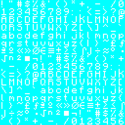

::: tip Translation notice
This page was translated with machine translation and may contain inaccuracies. If you can help improve it, please open an issue or submit a pull request.
:::


<FeaturedHead
    title="Shader Practice: Code Rain Production"
    authorName="Xuanyu 1725"
    cover = '../../../../../feature/archive/202602/_assets/2.png'
/>

## Preface

This is a relatively short tutorial, which is part of the shader practice chapter. It mainly uses code rain as an example to introduce the following skills and technologies:

1. Marking models (faces) by textures, the idea of ​​storing more data in color channels

2. Use of coordinate sampling from screen

3. Calculate the mapping relationship from the submap coordinate to the sprite map coordinate, thereby accessing and only accessing the entire texture on the surface.

4. Programmatic drawing code rain effect

## Effect display


## 1. Mark the model (surface) by texture

In this example, we only modified a specific model to display the code rain effect on its surface. In order to achieve this, we need to store more data in the color channel so that these models can be recognized in the fragment shader.

The texture we read is RGBA four-channel data, and only one channel is used to store the shape of the character. The other three channels are free to use, so we can use one of the color channels (or three together) for marking. For example, in this example, the opacity is set to$254/255$To mark the model that needs to display the code rain effect.

> Although solid render objects cannot output transparency channels, they can still be opaque.

When detecting, we use`textureLod()`function to read the color channel data and determine whether the opacity is equal to$254/255$to identify the model that needs to display the code rain effect. For instructions on this function, please refer to previous tutorials [Core shader workflow (Part 2)](feature/archive/202511/2/content) or official documentation.

```glsl
bool roughly_equals(float a, float b) { // 由于浮点数精度问题，不适合直接使用等号判断
    return abs(a - b) < 0.000001;
}

vec4 color = textureLod(Sampler0, texCoord0, 0.0); // 将Lod等级设为0，避免Mipmap带来的误差
if (roughly_equals(color.a, 254.0 / 255.0)) {
    // 这里是代码雨效果的实现
}
```


## 2. Use of coordinate sampling from the screen

We want the code rain effect to be sampled directly with screen coordinates like the end portal, so we need to use`projection_from_position()`function gets the screen coordinate.

```glsl
// 该函数在 projection.glsl 中定义
vec4 projection_from_position(vec4 position) {
    vec4 projection = position * 0.5; // [-w, w] -> [-w/2, w/2]
    projection.xy = vec2(projection.x + projection.w, projection.y + projection.w); // for xy: [-w/2, w/2] -> [0, w]
    projection.zw = position.zw; // for zw: no change
    return projection;
}
```


The input to this function is the position of the fragment in clipping space (i.e.`gl_Position`), in previous tutorials we have mentioned the position of the clipping space many times, and the coordinate of the final retained vertex in the clipping space is$[-w,w]^3$within, through`projection_from_position()`After function, the xy component is mapped to$[0,w]$Within the interval, the z and w components remain unchanged. Therefore, after perspective division, the xy components are mapped to$[0,1]$Within the interval, the z component is mapped to$[0,1]$Within the interval (near clipping plane is 0, far clipping plane is 1), the w component becomes 1. The mapped xy component is the screen coordinate. We don’t need to do perspective division, GLSL provides it`textureProj()`function to automatically complete perspective division and sampling.

This function accepts two parameters, the first parameter is the sampler and the second parameter is a`vec4`coordinate vector of type. This function automatically performs perspective division on the first three components of the coordinate vector, and then uses the first two components as texture coordinates for sampling.

```glsl
vec4 ndc = projection_from_position(gl_Position);
vec4 screenColor = textureProj(Sampler0, ndc);
```


but! This is the logic used by Mojang in end door rendering, but we can actually directly use GLSL's built-in special variables and global variables to obtain the normalized screen coordinates, that is

```glsl
vec2 ScreenPos = gl_FragCoord.xy / ScreenSize;
vec4 screenColor = texture(Sampler0, ScreenPos);
```


The advantage of the former method is that you can directly use the z component after perspective division for depth testing (such as the end door block), while the latter method is more concise and efficient (but you need to obtain the screen size from globals`ScreenSize`, check whether the version you are using supports this global variable). We use the latter approach in the code below.


## 3. Calculate the mapping relationship from subgraph coordinates to sprite map coordinates

Since Minecraft's baked models are composed of voxels, Minecraft renders each quadrilateral face (2 triangles, sharing 4 vertices) in order. So, GLSL’s built-in variables`gl_VertexID % 4`The result is that it cycles from 0 to 3 as each quad face is rendered.

So we can use`gl_VertexID % 4`To calculate the subgraph coordinate (NormalizedUV) of each vertex within the quadrilateral surface, that is:

```glsl
if (gl_VertexID % 4 == 0) {
        NormalizedUV = vec2(0.0, 1.0);
    } else if (gl_VertexID % 4 == 1) {
        NormalizedUV = vec2(0.0, 0.0);
    } else if (gl_VertexID % 4 == 2) {
        NormalizedUV = vec2(1.0, 0.0);
    } else {
        NormalizedUV = vec2(1.0, 1.0);
    }
```


Now we hope to find the mapping relationship from sub-picture coordinates to sprite map coordinates. Assuming there is no rotation or inversion between the sub-picture area and the sprite map area, then we have the following relationship:

$$\begin{pmatrix}\text{texCoord0.x} \\ \text{texCoord0.y}\end{pmatrix} = \underbrace{\begin{pmatrix}k_1 \\ k_2\end{pmatrix} \odot \begin{pmatrix}\text{NormalizedUV.x} \\ \text{NormalizedUV.y}\end{pmatrix}}_{\text{component-wise multiplication}}  + \begin{pmatrix}b_1 \\ b_2\end{pmatrix}$$

Then we need to find the vector$\begin{pmatrix}k_1 \\ k_2\end{pmatrix},\begin{pmatrix}b_1 \\ b_2\end{pmatrix}$

Obviously, under the pipeline limitations of Minecraft, we cannot obtain enough information in vsh. Therefore, we need to use the partial derivative function in fsh to solve, that is, use the rate of change of the known variable on the screen coordinate to solve the unknown quantity in the above equation.

$$\begin{pmatrix}k_1 \\ k_2\end{pmatrix} = \frac{\mathrm{d}\text{texCoord0}}{\mathrm{d}\text{NormalizedUV}}$$

In fact,$\text{texCoord0}$and$\text{NormalizedUV}$It’s about screen coordinate$(x,y)$function, then we can write two independent component equations:

To avoid notational confusion, we will$\text{texCoord0}$and$\text{NormalizedUV}$respectively recorded as$T$and$S$. The two components are$T_1,T_2$and$S_1,S_2$. Then the above formula can be written as.
$$T_1(x,y) = k_1 \cdot S_1(x,y) + b_1 \\
T_2(x,y) = k_2 \cdot S_2(x,y) + b_2$$

Correct the above two equations respectively$x$Finding the partial derivative, we get:

$$\frac{\partial T_1}{\partial x} = k_1 \cdot \frac{\partial S_1}{\partial x}$$

$$\frac{\partial T_2}{\partial x} = k_2 \cdot \frac{\partial S_2}{\partial x}$$

Similarly, for the above two equations, respectively$y$Finding the partial derivative, we get:

$$\frac{\partial T_1}{\partial y} = k_1 \cdot \frac{\partial S_1}{\partial y}$$

$$\frac{\partial T_2}{\partial y} = k_2 \cdot \frac{\partial S_2}{\partial y}$$

You can choose either of the two expression methods. Here we choose$x$way to find partial derivatives. Then we can solve:

$$k_1 = \frac{\partial T_1 / \partial x}{\partial S_1 / \partial x}$$

$$k_2 = \frac{\partial T_2 / \partial x}{\partial S_2 / \partial x}$$

Since the partial derivative function and division in GLSL are component-wise operations, we can directly write:

$$\begin{pmatrix}k_1 \\ k_2\end{pmatrix} = \frac{\partial T / \partial x}{\partial S / \partial x}$$

> Note: operator$\frac{\partial}{\partial x}$i.e. function`dFdx()`, represents the screen coordinate$x$Find the partial derivative. In the same way, we have$\frac{\partial}{\partial y}$i.e. function`dFdy()`.

Next we find the vector$\begin{pmatrix}b_1 \\ b_2\end{pmatrix}$. From the above component equations, we can solve:

$$b_1 = T_1 - k_1 \cdot S_1$$

$$b_2 = T_2 - k_2 \cdot S_2$$

Therefore we can directly write:

$$\begin{pmatrix}b_1 \\ b_2\end{pmatrix} = T - \begin{pmatrix}k_1 \\ k_2\end{pmatrix} \odot S$$

The following is the code implementation:

```glsl
vec2 k = dFdx(texCoord0) / dFdx(NormalizedUV);
vec2 b = texCoord0 - k * NormalizedUV;
vec2 SpriteUV = k * SpriteNormalizedUV + b; // 这一行在最终采样时使用，绘制代码中我们假设在子图内采样即可
```


> Note that the correctness of the above formula depends on there being no rotation or inversion between the submap area and the sprite area. If there is rotation or inversion, the above method will not be able to calculate the mapping relationship correctly. Therefore, the code for setting subgraph coordinates in vsh must ensure a specific order, **and Mojang has a precedent of modifying the vertex order between different versions**, so please be sure to test and verify it in actual use.

## 4. Draw code rain

Borrowed here [Shadertoy, Matrix Code (by _polymath)](https://www.shadertoy.com/view/lsVBWy) code implementation, with some modifications to adapt to the Minecraft shader environment.

```glsl
#define CELLS vec2(128.0,60.0)
#define FALLERS 7.0
#define FALLERHEIGHT 12.0

vec2 rand(vec2 uv) {
    vec2 r = floor(abs(mod(cos(
        uv * 652.6345 + uv.yx * 534.375 +
        GameTime * 1200 * 0.0000005 * dot(uv, vec2(0.364, 0.934))),
     0.001)) * 16000.0);
    return mod(r, 16.0);
}

float fallerSpeed(float col, float faller) {
    return mod(cos(col * 363.435 + faller * 234.323), 0.1) * 1.0 + 0.3;
}
```


```glsl
// 在我们的 if 分支中
vec2 k = dFdx(texCoord0) / dFdx(NormalizedUV);
vec2 b = texCoord0 - k * NormalizedUV;

vec2 uv = gl_FragCoord.xy / ScreenSize;

vec2 pix = mod(uv, 1.0/CELLS);
vec2 cell = (uv - pix) * CELLS;
pix *= CELLS * vec2(0.8, 1.0) + vec2(0.1, 0.0);

float c = texture(Sampler0, k * (rand(cell) + pix) / 16.0 + b).x;

float brightness = 0.0;
for (float i = 0.0; i < FALLERS; ++i) {
    float f = 3.0 - cell.y * 0.05 -
        mod((GameTime * 1200 + i * 3534.34) * fallerSpeed(cell.x, i), FALLERHEIGHT);
    if (f > 0.0 && f < 1.0)
        brightness += f;
}

fragColor = vec4(0.0, c * brightness, 0.0, 1.0);
```


Let’s analyze the drawing principle line by line:

First for`rand`function, which accepts a`vec2`type`uv`coordinate, and returns a`vec2`Type of pseudo-random number, since cell takes a series of integers, so`rand(cell)`will return a$[0,15]$The integer coordinate between is used to select characters from the subgraph.

Next is`fallerSpeed`function, which accepts two floating point parameters`col`and`faller`, and returns a speed value of floating point type. This function also uses the periodicity of the trigonometric function to generate the speed value, so that the falling speed of the code rain in each column is slightly different.

In the main drawing code, CELLS defines the number of columns and rows of the code rain.`pix`The calculation result is the offset coordinate of the current fragment within a cell,`cell`The calculation result is the coordinate of the cell where the current fragment is located.

`pix *= CELLS * vec2(0.8, 1.0) + vec2(0.1, 0.0);`What this line of code does is`pix`Zoom and pan so that the characters of Code Rain have a certain margin within the cell, thereby preventing the characters from sticking to the edge of the cell. ultimately a$[0.1,0.9)$numbers between.

The coordinates for sampling below are`(rand(cell) + pix) / 16.0`,in`rand(cell)`A pseudo-random offset based on the cell coordinate is generated. This offset is used to select random characters in the subgraph, and`pix`It is the offset of the current fragment within the cell. Add the two and divide by 16.0 because the characters in the subgraph are arranged in a 16x16 grid.

Combined with the transformation formula mentioned above, we will`(rand(cell) + pix) / 16.0`Substitute into`SpriteNormalizedUV`, the final sampling coordinate is`k * (rand(cell) + pix) / 16.0 + b`。

Sample from there, take the first channel to get the character shape`c`Finally, we need to calculate the brightness of the fragment`brightness`. The calculation of brightness is implemented through a loop, and the number of loops is`FALLERS`, that is, the number of drop columns of code rain. This achieves the effect of the tail becoming darker and the head becoming brighter during the falling process.

## 5. Final procedures

Finally, we combine the various parts and get the complete fragment shader code as follows:

```glsl
// terrain.vsh
#version 330

#moj_import <minecraft:fog.glsl>
#moj_import <minecraft:globals.glsl>
#moj_import <minecraft:chunksection.glsl>
#moj_import <minecraft:projection.glsl>

in vec3 Position;
in vec4 Color;
in vec2 UV0;
in ivec2 UV2;
in vec3 Normal;

uniform sampler2D Sampler2;

out float sphericalVertexDistance;
out float cylindricalVertexDistance;
out vec4 vertexColor;
out vec2 texCoord0;
out vec2 NormalizedUV; // 这里增加了一个输出变量

vec4 minecraft_sample_lightmap(sampler2D lightMap, ivec2 uv) {
    return texture(lightMap, clamp((uv / 256.0) + 0.5 / 16.0, vec2(0.5 / 16.0), vec2(15.5 / 16.0)));
}

void main() {
    vec3 pos = Position + (ChunkPosition - CameraBlockPos) + CameraOffset;
    gl_Position = ProjMat * ModelViewMat * vec4(pos, 1.0);

    sphericalVertexDistance = fog_spherical_distance(pos);
    cylindricalVertexDistance = fog_cylindrical_distance(pos);
    vertexColor = Color * minecraft_sample_lightmap(Sampler2, UV2);
    texCoord0 = UV0;
    if (gl_VertexID % 4 == 0) { // 通过顶点ID计算子图坐标，注意顺序
        NormalizedUV = vec2(0.0, 1.0);
    } else if (gl_VertexID % 4 == 1) {
        NormalizedUV = vec2(0.0, 0.0);
    } else if (gl_VertexID % 4 == 2) {
        NormalizedUV = vec2(1.0, 0.0);
    } else {
        NormalizedUV = vec2(1.0, 1.0);
    }
}
```


```glsl
// terrain.fsh
#version 330

#moj_import <minecraft:fog.glsl>
#moj_import <minecraft:globals.glsl>
#moj_import <minecraft:chunksection.glsl>

uniform sampler2D Sampler0;

in float sphericalVertexDistance;
in float cylindricalVertexDistance;
in vec4 vertexColor;
in vec2 texCoord0;
in vec2 NormalizedUV; // 这里增加了一个输入变量

out vec4 fragColor;

// 这里的代码是新版原本渲染增加的采样函数，可能看起来比较陌生，我们不需要深入理解它的实现细节

vec4 sampleNearest(sampler2D sampler, vec2 uv, vec2 pixelSize, vec2 du, vec2 dv, vec2 texelScreenSize) {
    ...
}

vec4 sampleNearest(sampler2D source, vec2 uv, vec2 pixelSize) {
    ...
}

// Rotated Grid Super-Sampling
vec4 sampleRGSS(sampler2D source, vec2 uv, vec2 pixelSize) {
    ...
}

bool roughly_equals(float a, float b) { // 由于浮点数精度问题，不适合直接使用等号判断
    return abs(a - b) < 0.000001;
}

#define CELLS vec2(128.0,60.0) // 这一项配置了代码雨的列数和行数
#define FALLERS 4.0 // 决定在同一列上同时模拟的下落雨滴数量。值越大，同一列上同时出现的雨滴流越多，显得越密集
#define FALLERHEIGHT 16.0 // 控制单个雨滴的视觉长度和下落循环的周期。值越大，雨滴越长，且两次重置之间的时间间隔也越长

vec2 rand(vec2 uv) { // 基于三角函数的伪随机数生成函数
    vec2 r = floor(abs(mod(cos(
        uv * 652.6345 + uv.yx * 534.375 +
        GameTime * 1200 * 0.0000005 * dot(uv, vec2(0.364, 0.934))),
     0.001)) * 16000.0);
    return mod(r, 16.0);
}

float fallerSpeed(float col, float faller) { // 基于三角函数的速度生成函数
    return mod(cos(col * 363.435 + faller * 234.323), 0.1) * 1.0 + 0.3;
}

void main() {
    vec4 raw_color = textureLod(Sampler0, texCoord0, 0.0);
    if (roughly_equals(raw_color.a, 254.0 / 255.0)) {        
        vec2 k = dFdx(texCoord0) / dFdx(NormalizedUV);
        vec2 b = texCoord0 - k * NormalizedUV;
        
        vec2 uv = gl_FragCoord.xy / ScreenSize;

        vec2 pix = mod(uv, 1.0/CELLS);
        vec2 cell = (uv - pix) * CELLS;
        pix *= CELLS * vec2(0.8, 1.0) + vec2(0.1, 0.0);
    
        float c = texture(Sampler0, k * (rand(cell) + pix) / 16.0 + b).x;
        
        float brightness = 0.0;
        for (float i = 0.0; i < FALLERS; ++i) {
            float f = 6.0 - cell.y * 0.05 -
                mod((GameTime * 1200 + i * 3534.34) * fallerSpeed(cell.x, i), FALLERHEIGHT);
            if (f > 0.0 && f < 1.0)
                brightness += f;
        }
        
        fragColor = vec4(0.0, c * brightness, 0.0, 1.0);
    }else{
        // 原版渲染分支
        vec4 color = (UseRgss == 1 ? sampleRGSS(Sampler0, texCoord0, 1.0f / TextureSize) : sampleNearest(Sampler0, texCoord0, 1.0f / TextureSize)) * vertexColor;
        color = mix(FogColor * vec4(1, 1, 1, color.a), color, ChunkVisibility);
        #ifdef ALPHA_CUTOUT
        if (color.a < ALPHA_CUTOUT) {
            discard;
        }
        #endif
        fragColor = apply_fog(color, sphericalVertexDistance, cylindricalVertexDistance, FogEnvironmentalStart, FogEnvironmentalEnd, FogRenderDistanceStart, FogRenderDistanceEnd, FogColor);
    }
}

```


The texture is through vanillaresource pack`textures/font/ascii`Modified, here we use the r channel as the shape channel, and the g and b channels are set to$1.0$, channel a is set to$254/255$as a mark.



Apply the texture to the block to get the final effect:


> What is modified here is the terrainshader, so the effect only applies to blocks placed in the world (non-entity types). If you want the code rain effect to be applied to entity type models, you can transplant the corresponding code to`entity.vsh`and`entity.fsh`middle. Special note is that if you want to apply particle effects, you need to pay attention to the problem of z-flighting. The particles may have 24 vertices, but the rendering logic of Minecraft is to render all the faces in one direction, and then render all the faces in the next direction, so it cannot pass`gl_VertexID % 24`To adapt, readers are welcome to propose better solutions. (However, it is very convenient to use display entities to simulate particles)
