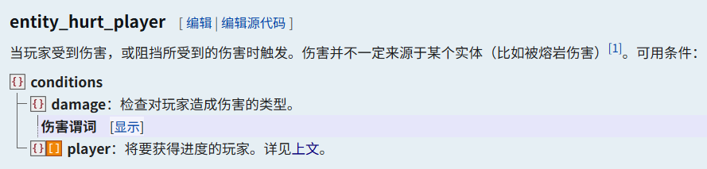
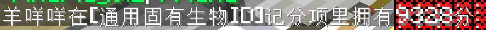

::: tip Translation notice
This page was translated with machine translation and may contain inaccuracies. If you can help improve it, please open an issue or submit a pull request.
:::


<FeatureHead
    title="TheSkyBlessing analyzes the third one - detecting mob attacks"
    authorName="Ling"
    cover = '../../../../../feature/archive/202602/_assets/5.png'
/>

## Preface

Game assets are an important part of game development, and this is also true in large-scale MC projects. From all mobs, whether friendly or hostile, to every piece of equipment that can be collected in the game, how to implement unified management and efficient reuse of these contents is an unavoidable problem in expansion projects. This time I want to mention mobs in game assets.

The mob has its own attack function in the asset library, which records various parameters to be passed into the damage calculation module. To trigger this attack function, you need to obtain the mob's asset library ID when the mob attacks the player, or you must be able to execute a function with the mob as the executor, so we have the need to detect mob attacks.

In the vanilla game, there is such an advancement criterion trigger entity_hurt_player. The purpose of vanilla is to give the player an achievement when the player is hurt. Therefore, it is natural to think of using this trigger to detect when the mob hurts the player or launches an attack. When the player gets the advantage, it removes the advancement and performs the required functions.



But there is a new problem, that is, the executor of the reward function of the entity_hurt_player trigger is the injured player instead of the mob that caused the damage. Therefore, in order to solve this problem, the solution in the TSB map below is introduced. On the premise of still using entity_hurt_player to detect the damage caused by the mob, the problem idea is changed to obtain the mob that has just caused damage to the player near the player when the reward function is triggered, thereby achieving the purpose of redoing the vanilla attack damage mechanism.

Compared with the previous analysis, the content to be introduced this time will be shorter. I only selected the parts that are closer to vanilla. If you have the production needs of custom mobs and the need to redo the damage system, the solution to be introduced below may be an option. Still singing quickly, TSB is a map work with high playability and technical content. Interested readers are recommended to play it on their own. The relevant content of the data pack can also be found in the official project warehouse. Related links can be found at the end of the article.

Let’s get to the point.

## Convert UUID to mobtag

Such an add_flag function is used in the initialization step when mob is created.

```
scoreboard players add $FlagIndex Global 1
scoreboard players operation $FlagIndex Global %= $2^15 Const
execute if score $FlagIndex Global matches 0 run scoreboard players add $FlagIndex Global 1
scoreboard players operation @s MobUUID = $FlagIndex Global

scoreboard players operation $CloneFlagIndex Temporary = $FlagIndex Global
scoreboard players operation $CloneFlagIndex Temporary *= $2^16 Const
execute if score $CloneFlagIndex Temporary matches 00.. run tag @s add FindFlag0.0
execute if score $CloneFlagIndex Temporary matches ..-1 run tag @s add FindFlag0.1
scoreboard players operation $CloneFlagIndex Temporary *= $2 Const
execute if score $CloneFlagIndex Temporary matches 00.. run tag @s add FindFlag1.0
execute if score $CloneFlagIndex Temporary matches ..-1 run tag @s add FindFlag1.1
scoreboard players operation $CloneFlagIndex Temporary *= $2 Const
execute if score $CloneFlagIndex Temporary matches 00.. run tag @s add FindFlag2.0
execute if score $CloneFlagIndex Temporary matches ..-1 run tag @s add FindFlag2.1
scoreboard players operation $CloneFlagIndex Temporary *= $2 Const
execute if score $CloneFlagIndex Temporary matches 00.. run tag @s add FindFlag3.0
execute if score $CloneFlagIndex Temporary matches ..-1 run tag @s add FindFlag3.1
scoreboard players operation $CloneFlagIndex Temporary *= $2 Const
execute if score $CloneFlagIndex Temporary matches 00.. run tag @s add FindFlag4.0
execute if score $CloneFlagIndex Temporary matches ..-1 run tag @s add FindFlag4.1
scoreboard players operation $CloneFlagIndex Temporary *= $2 Const
execute if score $CloneFlagIndex Temporary matches 00.. run tag @s add FindFlag5.0
execute if score $CloneFlagIndex Temporary matches ..-1 run tag @s add FindFlag5.1
scoreboard players operation $CloneFlagIndex Temporary *= $2 Const
execute if score $CloneFlagIndex Temporary matches 00.. run tag @s add FindFlag6.0
execute if score $CloneFlagIndex Temporary matches ..-1 run tag @s add FindFlag6.1
scoreboard players operation $CloneFlagIndex Temporary *= $2 Const
execute if score $CloneFlagIndex Temporary matches 00.. run tag @s add FindFlag7.0
execute if score $CloneFlagIndex Temporary matches ..-1 run tag @s add FindFlag7.1
scoreboard players operation $CloneFlagIndex Temporary *= $2 Const
execute if score $CloneFlagIndex Temporary matches 00.. run tag @s add FindFlag8.0
execute if score $CloneFlagIndex Temporary matches ..-1 run tag @s add FindFlag8.1
scoreboard players operation $CloneFlagIndex Temporary *= $2 Const
execute if score $CloneFlagIndex Temporary matches 00.. run tag @s add FindFlag9.0
execute if score $CloneFlagIndex Temporary matches ..-1 run tag @s add FindFlag9.1
scoreboard players operation $CloneFlagIndex Temporary *= $2 Const
execute if score $CloneFlagIndex Temporary matches 00.. run tag @s add FindFlag10.0
execute if score $CloneFlagIndex Temporary matches ..-1 run tag @s add FindFlag10.1
scoreboard players operation $CloneFlagIndex Temporary *= $2 Const
execute if score $CloneFlagIndex Temporary matches 00.. run tag @s add FindFlag11.0
execute if score $CloneFlagIndex Temporary matches ..-1 run tag @s add FindFlag11.1
scoreboard players operation $CloneFlagIndex Temporary *= $2 Const
execute if score $CloneFlagIndex Temporary matches 00.. run tag @s add FindFlag12.0
execute if score $CloneFlagIndex Temporary matches ..-1 run tag @s add FindFlag12.1
scoreboard players operation $CloneFlagIndex Temporary *= $2 Const
execute if score $CloneFlagIndex Temporary matches 00.. run tag @s add FindFlag13.0
execute if score $CloneFlagIndex Temporary matches ..-1 run tag @s add FindFlag13.1
scoreboard players operation $CloneFlagIndex Temporary *= $2 Const
execute if score $CloneFlagIndex Temporary matches 00.. run tag @s add FindFlag14.0
execute if score $CloneFlagIndex Temporary matches ..-1 run tag @s add FindFlag14.1
scoreboard players operation $CloneFlagIndex Temporary *= $2 Const
execute if score $CloneFlagIndex Temporary matches 00.. run tag @s add FindFlag15.0
execute if score $CloneFlagIndex Temporary matches ..-1 run tag @s add FindFlag15.1
scoreboard players reset $CloneFlagIndex Temporary
```


Putting aside the long list of adding tags below, the first step of the function is actually easy to understand - under the global scoreboard there is an index number that will increase every time a mob is created. The maximum value of this index number is 2^16 and is reset when it is reached. This ID is the UUID of the mob.

```
scoreboard players add $FlagIndex Global 1
scoreboard players operation $FlagIndex Global %= $2^15 Const
execute if score $FlagIndex Global matches 0 run scoreboard players add $FlagIndex Global 1
scoreboard players operation @s MobUUID = $FlagIndex Global
```


The following part seems very complicated, but in fact it has been used many times in the previous TSB analysis. The method of converting decimal to other bases and then obtaining the digit is used very frequently in the map. The idea here is - **After converting the UUID into a binary number, continuously shift left to detect whether the current digit is 0 or 1 and add a tag with the corresponding digit to the mob**. The tag format is FindFlag (digits) / (0 or 1). Note that the number of digits is calculated from 0 (the number of digits in the nth number is n-1)

```
scoreboard players operation $CloneFlagIndex Temporary = $FlagIndex Global
scoreboard players operation $CloneFlagIndex Temporary *= $2^16 Const
execute if score $CloneFlagIndex Temporary matches 00.. run tag @s add FindFlag0.0
execute if score $CloneFlagIndex Temporary matches ..-1 run tag @s add FindFlag0.1
scoreboard players operation $CloneFlagIndex Temporary *= $2 Const

# 不断左移....
```


In order to see the effect of this function more intuitively, we find the lamb near the birth point on the map and directly query its MobUUID score value



Taking the above mob UUID as 9328 as an example, the function process when generating this mob can be summarized as follows

1. Get the current global index number 9328 and save it as the mob's MobUUID
2. Convert the value of the decimal index number to binary, padding to sixteen digits (0010 0100 0111 0000)
3. Start moving left
    1. Bit 0 is 0, add tag FindFlag0.0
    2. Bit 1 is 0, add tag FindFlag1.0
    3. Bit 2 is 1, add tag FindFlag2.1
    4. Bit 3 is 0, add tag FindFlag3.0
    5. …
    6. Bit 15 is 0, add tag FindFlag15.0
4. The 16-digit number check is completed and ends here

So the tags owned by a mobentity in the game will become like this. Except for the three simple and easy-to-understand tags AlreadyInitMob, AssetMob, and Friend, the other tags starting with FindFlag all serve to mark the mob UUID.


Through this operation of adding a tag to a mob when it is created, we have been able to know its UUID through the tag attached to the mob. The UUID is unique for each mob, so the UUID tag attached to the mob will also be unique. Then the idea of ​​inferring the mob through the tag is available, and the specific method will be completed in the advancement definition section below.

## advancement detects mobs causing damage

There is check_entity_hurt_player advancement in the advancements directory. The file is as follows. The content is long and some comments have been made.

```
{
  "criteria": {

	  #依次检测16位的标签，共32个准则，此处省略后面的部分

    "0-0": {
      "conditions": {
        "damage": { "source_entity": { "nbt": "{Tags:[\"FindFlag0.0\"]}" } }
      },
      "trigger": "entity_hurt_player"
    },
    "0-1": {
      "conditions": {
        "damage": { "source_entity": { "nbt": "{Tags:[\"FindFlag0.1\"]}" } }
      },
      "trigger": "entity_hurt_player"
    },
    "1-0": {
      "conditions": {
        "damage": { "source_entity": { "nbt": "{Tags:[\"FindFlag1.0\"]}" } }
      },
      "trigger": "entity_hurt_player"
    },
    "1-1": {
      "conditions": {
        "damage": { "source_entity": { "nbt": "{Tags:[\"FindFlag1.1\"]}" } }
      },
      "trigger": "entity_hurt_player"
    },

    # ...

    # 伤害是否被格挡

    "blocked": {
      "conditions": { "damage": { "blocked": true, "source_entity": {} } },
      "trigger": "entity_hurt_player"
    },
    "blocked-false": {
      "conditions": { "damage": { "blocked": false, "source_entity": {} } },
      "trigger": "entity_hurt_player"
    },

    # 伤害类型-爆炸

    "type-explosion": {
      "conditions": {
        "damage": {
          "source_entity": {},
          "type": { "tags": [{ "expected": true, "id": "is_explosion" }] }
        }
      },
      "trigger": "entity_hurt_player"
    },

    # 伤害类型-近战

    "type-melee": {
      "conditions": {
        "damage": {
          "source_entity": {},
          "type": { "tags": [{ "expected": true, "id": "is_melee" }] }
        }
      },
      "trigger": "entity_hurt_player"
    },

    # 伤害类型-弹射物

    "type-projectile": {
      "conditions": {
        "damage": {
          "source_entity": {},
          "type": { "tags": [{ "expected": true, "id": "is_projectile" }] }
        }
      },
      "trigger": "entity_hurt_player"
    }

    # 近战、爆炸、弹射物之外的伤害类型

    "type-other": {
      "conditions": {
        "damage": {
          "type": {
            "tags": [
              { "expected": false, "id": "is_melee" },
              { "expected": false, "id": "is_projectile" },
              { "expected": false, "id": "is_explosion" }
            ]
          }
        }
      },
      "trigger": "player_hurt_entity"
    },
  },
  "requirements": [
    ["0-0", "0-1"],
    ["1-0", "1-1"],
    ["2-0", "2-1"],
    ["3-0", "3-1"],
    ["4-0", "4-1"],
    ["5-0", "5-1"],
    ["6-0", "6-1"],
    ["7-0", "7-1"],
    ["8-0", "8-1"],
    ["9-0", "9-1"],
    ["10-0", "10-1"],
    ["11-0", "11-1"],
    ["12-0", "12-1"],
    ["13-0", "13-1"],
    ["14-0", "14-1"],
    ["15-0", "15-1"],
    ["type-melee", "type-projectile", "type-explosion", "type-other"],
    ["blocked", "blocked-false"]
  ],
  "rewards": {
    "function": "mob_manager:entity_finder/entity_hurt_player/on_hurt"
  }
}
```


Referring to the advancement definition format on the wiki, we can divide the content of this advancement file as follows

1. 32 criteria related to the UUID tag carried by the mob are defined, corresponding to the sixteen bits of the UUID and the two situations of 0 and 1 for each bit. In addition, there are two criteria for whether damage is blocked and three criteria for damage type. These criteria will be checked after the mobentity damages the player.
2. The requirement to achieve advancement is that the 16-digit UUID test passes. At this time, the injured player will meet the corresponding criteria based on the tag of the mob that caused the damage. For example, if the mob has tag 5-1 (the fifth digit of the UUID is 1), the injured player will meet criteria 5-1 when it causes damage to the player.
3. Execute reward function on_hurt when player achieves achievement


At this point, we have obtained relevant information about the player's injury event through various predicates in the advancement criterion trigger, such as damage type and whether it was blocked. More importantly, we have converted the UUID tag of the mob that caused the damage into the advancement criterion reached by the player.

The reward function on_hurt uses the injured player as the executor, calls a filters function, and removes the advantage at the end of execution. The player's combat status is also reset here (the map determines whether the player is in combat status based on the period of time the player has been damaged)

```
# on_hurt

function mob_manager:entity_finder/entity_hurt_player/filters/
scoreboard players set @s InBattleTick 160
advancement revoke @s only mob_manager:entity_finder/check_entity_hurt_player
```


The filters function will select all mobentities within 150 blocks around the injured player, and use these mobentities as executors to execute the filtering function.

```
# filters

execute as @e[type=#lib:living,type=!player,distance=..150] run function mob_manager:entity_finder/entity_hurt_player/filters/15
```


There are a total of sixteen filtering functions, each of which detects one bit of the mob UUID tag, and determines whether it can enter the next level of filtering based on the advancement criteria reached by the injured player. In this way, it is called sixteen times layer by layer. The mobs that can all pass are the mobs that just caused damage to the player. There are many layers of files, only some examples are posted below for reference.

```
# filters/15

execute if entity @p[tag=DamagedPlayer,advancements={mob_manager:entity_finder/check_entity_hurt_player={15-0=true}}] if entity @s[tag=FindFlag15.0] run function mob_manager:entity_finder/entity_hurt_player/filters/14
execute if entity @p[tag=DamagedPlayer,advancements={mob_manager:entity_finder/check_entity_hurt_player={15-1=true}}] if entity @s[tag=FindFlag15.1] run function mob_manager:entity_finder/entity_hurt_player/filters/14
```


```
# filters/14

execute if entity @p[tag=DamagedPlayer,advancements={mob_manager:entity_finder/check_entity_hurt_player={14-0=true}}] if entity @s[tag=FindFlag14.0] run function mob_manager:entity_finder/entity_hurt_player/filters/13
execute if entity @p[tag=DamagedPlayer,advancements={mob_manager:entity_finder/check_entity_hurt_player={14-1=true}}] if entity @s[tag=FindFlag14.1] run function mob_manager:entity_finder/entity_hurt_player/filters/13
```


```
# filters/0

execute if entity @p[tag=DamagedPlayer,advancements={mob_manager:entity_finder/check_entity_hurt_player={0-0=true}}] if entity @s[tag=FindFlag0.0] run function mob_manager:entity_finder/entity_hurt_player/fetch_entity
execute if entity @p[tag=DamagedPlayer,advancements={mob_manager:entity_finder/check_entity_hurt_player={0-1=true}}] if entity @s[tag=FindFlag0.1] run function mob_manager:entity_finder/entity_hurt_player/fetch_entity
```


Still taking the above mob with UUID number 9328 as an example, assuming it causes damage to the player, the workflow of this advancement is as follows

1. advancement trigger
    1. The mob has tag FindFlag0.0, and the player reaches the criterion 0-0
    2. The mob has tag FindFlag1.0, and the player reaches the criterion 1-0
    3. mob has tag FindFlag2.1, player reaches criterion 2-1
    4. (and so on)
    5. mob has tag FindFlag15.0, player reaches criterion 15-0
2. filters function is triggered, and the execution subject is the player
3. Select all mobs within 150 blocks around the player to perform the filtering function
    1. The player reaches the criterion 0-0. If the mob has the tag FindFlag0.0, continue to the next step of filtering.
    2. The player reaches the criterion 1-0. If the mob has the tag FindFlag1.0, continue to the next step of filtering.
    3. The player reaches criterion 2-1. If the mob has tag FindFlag2.1, continue to the next step of filtering.
    4. (and so on)
    5. The player reaches the criterion 15-0. If the mob has the tag FindFlag15.0, it means that this is the mob that causes damage to the player in the first step and uses it as the executor to execute the fetch_entity function.
4. Remove player's advancement

## What to do after finding the target mob

At this point, the subsequent steps are already very clear, because we have found the mob that caused damage to the player near it, and can also use the target selector to execute a function on it as the executor. It is very simple to detect the mob type through other methods and achieve effects such as debuff attached to the attack. As a conclusion, here is part of the fetch_entity function as a functional reference. It doesn’t matter if you don’t understand it, because I don’t know how many analyzes are needed to fully explain these contents (

1. **Send information such as the player's current injury and the UUID of the mob that caused the damage to the damage calculation module. Through the UUID, you can find the mob's attack damage and attack attributes in the asset library, calculate the final value of the damage and set the player's health (score_to_health is a wheel data pack that supports modifying the player's health through scores. Damage calculations in the map are all implemented by modifying the player's health). This bypasses the vanilla damage mechanism and no longer requires setting the mob attack power through vanillacommand**

    ```
    scoreboard players set $Damage Temporary 0
    scoreboard players operation $Damage Temporary += @p[tag=DamagedPlayer] TakenDamage
    scoreboard players operation $Damage Temporary += @p[tag=DamagedPlayer] AbsorbedDamage
    scoreboard players operation $Damage Temporary *= $10 Const
    execute store result storage api: Argument.Fluctuation double -0.1 run scoreboard players get @p[tag=DamagedPlayer] AbsorbedDamage
    execute store result storage api: Argument.Attacker int 1 run scoreboard players get @s MobUUID
    data modify storage api: Argument.DeathMessage set value ['{"translate":"%1$s被%2$s击败","with":[{"selector":"@s"},{"nbt":"Return.AttackerName","storage":"lib:","interpret":true}]}']
    data modify storage api: Argument.DisableLog set value true
    execute as @p[tag=DamagedPlayer] at @s run function lib:score_to_health_wrapper/fluctuation
    ```


2. **Storage the event information of the player's current injury (such as whether it is melee and whether it is blocked) into the artifact events (ArtifactEvents) of the player's OhMyDat data space, so that the player's artifact with the corresponding effect can receive the event and trigger its effect (such as an artifact with a rebound effect when injured)**

    ```
    data modify storage oh_my_dat: _[-4][-4][-4][-4][-4][-4][-4][-4].ArtifactEvents.Damage append value {IsVanilla:true}
    data modify storage oh_my_dat: _[-4][-4][-4][-4][-4][-4][-4][-4].ArtifactEvents.Damage[-1].Type set from storage mob_manager:entity_finder DamageType
    data modify storage oh_my_dat: _[-4][-4][-4][-4][-4][-4][-4][-4].ArtifactEvents.Damage[-1].Blocked set from storage mob_manager:entity_finder Blocked
    execute store result storage oh_my_dat: _[-4][-4][-4][-4][-4][-4][-4][-4].ArtifactEvents.Damage[-1].From int 1 run scoreboard players get @s MobUUID
    execute store result storage oh_my_dat: _[-4][-4][-4][-4][-4][-4][-4][-4].ArtifactEvents.Damage[-1].Amount double 0.01 run scoreboard players get $Damage Temporary
    ```


3. **Save the mob's attack event information into the mob's data space (such as whether it was blocked and the damage value caused), so that the attack event information can be called in other locations (such as the mob's tick function or attack function)**

    ```
    function oh_my_dat:please
    data modify storage oh_my_dat: _[-4][-4][-4][-4][-4][-4][-4][-4].MobEvents.Attack append value {IsVanilla:true}
    data modify storage oh_my_dat: _[-4][-4][-4][-4][-4][-4][-4][-4].MobEvents.Attack[-1].Type set from storage mob_manager:entity_finder DamageType
    data modify storage oh_my_dat: _[-4][-4][-4][-4][-4][-4][-4][-4].MobEvents.Attack[-1].Blocked set from storage mob_manager:entity_finder Blocked
    data modify storage oh_my_dat: _[-4][-4][-4][-4][-4][-4][-4][-4].MobEvents.Attack[-1].To append value -1
    execute store result storage oh_my_dat: _[-4][-4][-4][-4][-4][-4][-4][-4].MobEvents.Attack[-1].To[-1] int 1 run scoreboard players get @p[tag=DamagedPlayer] UserID
    data modify storage oh_my_dat: _[-4][-4][-4][-4][-4][-4][-4][-4].MobEvents.Attack[-1].Amounts append value -1d
    execute store result storage oh_my_dat: _[-4][-4][-4][-4][-4][-4][-4][-4].MobEvents.Attack[-1].Amounts[-1] double 0.01 run scoreboard players get $Damage Temporary
    ```


## appendix

TheSkyBlessing project official website

[https://project-tsb.org/](https://project-tsb.org/)

TheSkyBlessing project data pack repository

[GitHub - ProjectTSB/TheSkyBlessing: TheSkyBlessing のベース Datapack のリポジトリ](https://github.com/ProjectTSB/TheSkyBlessing)
