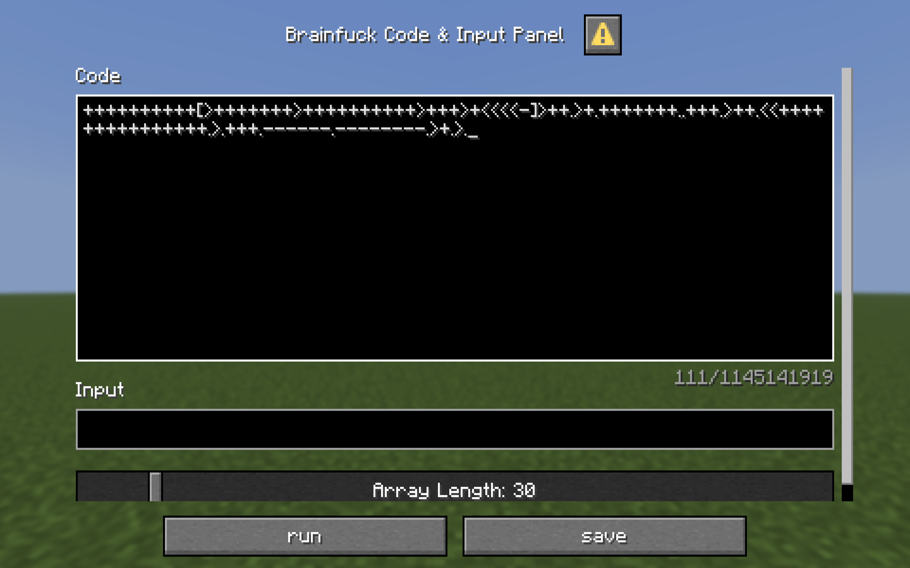

<FeatureHead
    title="On the implementation and performance optimization of the Brainduck interpreter in the Minecraft environment"
    authorName="Madarami awa"
    cover = '../../../../../feature/archive/202602/_assets/6.png'
/>

:::warning Editor's Note
Some nouns in this article have been harmonized due to censorship factors.
:::

## Summary

The purpose of this article is to explore how to build a complete Brainduck interpreter in a Minecraft data pack (Datapack) environment. By introducing the "Jump Table" preprocessing mechanism, asynchronous execution queue and 8-bit simulated memory management, we successfully implemented the operation of Turing-complete language in mcfunction, solving vanilla development pain points such as excessive recursion and the upper limit of command execution, and also studied more compilation optimization strategies.

---

## 1. Introduction

Brainduck is a minimalist programming language consisting only of$8$composed of characters. Although its syntax is simple, its requirements for memory operations and jump logic make it an excellent case to explore the feasibility of writing a programming language interpreter with data pack. This article will describe the entire process from lexical analysis to instruction execution.

Since the author of this article is not a computer major, there are inevitably omissions in the article. The ideas are for reference only. I believe that all readers will be able to implement a complete C language compiler with better algorithms through data pack.

### Introduction to Brainduck

This language is based on a simple machine model. In addition to instructions, this machine also includes: a byte (`byte`), an array initialized to zero, and a pointer to the array (initially pointing to the$0$bytes), and two byte streams for input and output.

### command

| Character | Meaning |
| ----------- | ----------- |
|`>`| Add one to the pointer |
|`&lt;`| Decrement the pointer by one |
|`+`| Add one to the value of the byte pointed to by the pointer |
|`-`| Decrease the value of the byte pointed to by the pointer by one |
|`.`| Output the byte content pointed to by the pointer (ASCII code) |
|`,`| Input content (ASCII code) into the byte pointed to by the pointer |
|`[`| If the value of the byte pointed to by the pointer is zero, jump backward to its corresponding`]`The next command of |
|`]`| If the value of the byte pointed to by the pointer is not zero, jump forward to its corresponding`[`The next command of |

## 2. Data structure design (Storage & Scoreboard)

In the case, the data is stored in **Storage** (persistent, structured) and **Scoreboard** (operational).

### 2.1 Storage layer (Storage)

we use`Brainduck:re`namespace as runtime environment:

<div class="nbttree">

<node type="compound" name="Brainduck:re"/>Root tag.
- <node type="compound" name="code"/> stores runtime code.
  - <node type="string" name="string"/>String code before preprocessing.
  - <node type="list" name="list"/>Preprocessed instruction sequence.
- <node type="int_list" name="array"/>Simulate paper tape.
- <node type="int_list" name="jump_table"/> stores the index of the corresponding bracket jump position.
- <node type="int_list" name="stack"/> Auxiliary stack for bracket matching in the preprocessing phase.
- <node type="compound" name="output"/>output
  - <node type="list" name="list"/> stores the output.

</div>

### 2.2 Computing layer (Scoreboard)

Use the scoreboard to calculate pointers and temporary values:

*`#ip`: Program Counter (Instruction Pointer).
*`#ptr`: Data Pointer.
*`#tmp_value`: Calculate intermediate variables.

---

## 3. Score board and command storage conversion

Since in Minecraft, only the integration board can perform the most intuitive calculation operations, and Brainduck also has the need to perform calculations, there are some functions in the implementation of this article's case specifically for conversion between the two, such as`ascii_to_score`and`score_to_ascii`, will not be described in detail here, if relevant functions are called, they will be mentioned.


## 4. Initialization and preprocessing

### 4.1 Initialization list

Set all items in the list to 0ub.
::: tip performance optimization
The dichotomy method can be used to reduce the number of recursive command executions.
~~Of course you can set the list directly instead of dynamically generating it~~
:::

### 4.2 Code processing

The case in this article converts the input code string into a list to facilitate jumps. This logic refers to the November 2025 issue, written by the leather sword boss [Using data pack to make a compiler or interpreter: taking the C language subset C-Minus as an example] (https://cr-019.github.io/datapack-index/feature/archive/202511/1/content.html) in implementation. In practice, this part can be combined with the following [Jump Logic](#_4-3-jump-logic) written together.

```mcfunction
data remove storage Brainduck:re code.tmp_char
data modify storage Brainduck:re code.tmp_char set string storage Brainduck:re code.string 0 1
data modify storage Brainduck:re code.string set string storage Brainduck:re code.string 1

data modify storage Brainduck:re code.list append from storage Brainduck:re code.tmp_char
```
### 4.3 Jump logic

preprocessing`[]`The jump corresponding logic can significantly reduce runtime overhead.

#### Jump table creation algorithm

in`string_to_list`stage, we walk through the code and maintain an index count`#ip`:

1. **Encounter`[`**: Change the current`#ip`Press in`stack`.
2. **Encounter`]`**:
* like`stack`is empty, throws`syntax/close_bracket`error and terminate the program.
* If it is not empty, establish a bidirectional mapping and perform a pop-up operation. set up`jump_table[open_idx] = close_idx`and`jump_table[close_idx] = open_idx`.
3. **End**: After the traversal is completed, if`stack`Not empty, throw`syntax/open_bracket`mistake.

The following is a pseudocode logic reference:

```cpp
//code is an array storing code
stack<int> s;
for (int i = 0; i < code.size(); i++) {
    switch (code[i]) {
        case '[':
            s.push(i); //Push the position of '[' onto the stack
            break;
        case ']': {
                if (s.empty()) throw SyntaxError("Unmatched ']'");
                int match_pos = s.top();
                s.pop();
                jump_table[i] = match_pos; //']' jumps to matching '['
                jump_table[match_pos] = i; //'[' Jump to matching ']'
                break;
            }
        default:
            break;
    }
}
if (!s.empty()) {
    throw SyntaxError("Unmatched '['");
}
```
exist`mcfunction`, since access list members can only use numbers as subscripts, this case uses **Macros** to approximate dynamic access list members.

* meet`[`Time push stack:

```mcfunction
#Convert the program pointer to Storage for pushing onto the stack
function Brainduck:compile/convert/score_to_storage/ip
data modify storage Brainduck:re stack append from storage Brainduck:re ip
```
* meet`]`Create a bidirectional mapping and pop the stack:

```mcfunction
execute if data storage Brainduck:re {stack:[]} run return fail
#]The matched [must be the last one in the stack
#Convert program pointer to Storage for calling macro function
function Brainduck:compile/convert/score_to_storage/ip
data modify storage Brainduck:re match_pos set from storage Brainduck:re stack[-1]
data remove storage Brainduck:re stack[-1]
function Brainduck:compile/preprocess/match/stack_pop/set_jump_table with storage Brainduck:re
return 1
```
Contents in compile/preprocess/match/stack_pop/set_jump_table.mcfunction:

```mcfunction
#Create mapping
$data modify storage Brainduck:re jump_table[$(ip)] set from storage Brainduck:re match_pos
$data modify storage Brainduck:re jump_table[$(match_pos)] set from storage Brainduck:re ip
```
## 5. Functional implementation of core instructions

Since mcfunction does not support dynamic array subscripts (such as`array[#ptr]`), we must use Macros or recursive divide and conquer to bridge Storage and Scoreboard. The case in this article is handled directly using macros.

### 5.1 Instruction distribution logic

1. **Value increase or decrease (`+`, `-`)**:
* will Storage`array[#ptr]`Save to Scoreboard`#tmp_value`middle.
* right`#tmp_value`Perform addition and subtraction operations.
* For overflow processing, you can use execute if score to judge and ensure that the value is within$0$ ~ $255$between.
* Will`#tmp_value`Save back to Storage.

2. **Move left and move right (`&lt;`, `>`)**:
* right`#ptr`Perform addition and subtraction operations.
* For overflow processing, you can use execute if score to judge and ensure that the value is within$0$~Tape length-$1$between.

Implementation example of left shift

```mcfunction
scoreboard players remove #ptr Brainduck.re 1
execute if score #ptr Brainduck.re matches 0.. run return 1
#Overflow handling
scoreboard players operation #ptr Brainduck.re = #array_length Brainduck.re
#minus one because subscripts start at 0
scoreboard players remove #ptr Brainduck.re 1
```
3. **Input and output (`,`, `.`)**:
* Append the value to the output list when outputting.
* Intercept when inputting`input`The first part of the string, execute`ascii_to_score`Conversion, if the input cannot be intercepted, output and terminate the program.

::: tip tip
For input interception implementation, you can also refer to [mentioned above](#_4-2-code-processing).
:::

4. **Jump loop (`[`, `]`)**:
* Read the current`array[#ptr]`And store it in the scoreboard to determine whether it is$0$, use macro to read`jump_table[#ip]`Jump.

### 5.2 End of program

* call`score_to_ascii`, convert the output to JSON text.
* Output the contents of the output list.
* Clear the output list.
* Will`#running`set to`0`.

---

## 6. Runtime protection and parallel restrictions

Minecraft's single-threaded and other ~~bug~~ features require us to strike a balance between performance and stability.

### 6.1 Asynchronous suspension mechanism (Schedule)

In order to prevent the game from freezing or exceeding the command execution limit due to excessive execution of instructions on a single Tick, we have introduced double counting:

* **Single Execution Protection**: Settings`#count_c`Counter, when a single Tick execution instruction exceeds`#max_single_command_count`(like$100$times), execute`schedule`and resumes operation after 1 Tick.
* **Total Run Protection**: Settings`#max_total_command_count`, to prevent the code from running out of resources in an infinite loop.

### 6.2 Single-thread lock

When the program starts, the`#running`set to`1`, execution completed or manually aborted (`#cmd_stop = 1`).

---

## 7. Other compilation optimizations
In order to overcome the performance overhead of NBT access and just-in-time compilation of macro functions in the Minecraft environment, this article studies **Lexical Folding** technology.
By performing semantic extraction of arithmetic instruction strings during the preprocessing stage, the interpreter is able to$O(1)$The scoreboard operation replaces the original$O(n)$recursive execution.

### 7.1 Arithmetic Folding
Brainduck programs often have consecutive`+` `-` `>` `&lt;`.

* **Intermediate Representation (IR)**: Change code.list from an array of strings to an array of objects, e.g. {"cmd":"+","val":5}.

### 7.2 Clear Loop Optimization
An extremely common pattern in Brainduck programs is`[-]`or`[+]`, its function is to clear the current cell to zero. The most extreme cases may run over$500$Second-rate.

* Mark it as a unique instruction and directly set the current cell to$0$and jump to`]`.

### 7.3 Scanline Optimization
The Brainduck program is often used`[>]`or`[&lt;]`to find the next one for$0$of cells.

* Mark it as a unique instruction and locate it directly with the value$0$cell, update`#ptr`.

### 7.4 Static Jump Table

* The command format is set to {"cmd":"[", "target": 25}, read directly`target`, eliminating the need for`jump_table`The cost of secondary querying the list.

### 7.5 Multiplication loop/data movement optimization (Copy/Multiply Loop)
Common Brainduck program structures are as follows`[->+++&lt;]`, its intention is to multiply the value of the current cell by 3, add it to the next cell, and clear the original cell to zero.

* Convert it into a "multiplication move" instruction and execute it formulaically$target\_cell = target\_cell + (source\_cell \times n)$
$source\_cell = 0$,in$n$for`+`or`-`quantity.

## 8. Run display
We need a code editing box for entering Brainduck source code.



## 9. Conclusion

Through the optimization of mcfunction, this article once again proves that it is feasible to implement a compiler in Minecraft. The introduction of jump tables optimizes the execution efficiency of nested loops, the asynchronous scheduling mechanism ensures program operation, and the introduction of lexical folding greatly optimizes operating efficiency.

## 10. References
[1] Leather Sword. Use data pack to make a compiler or interpreter: taking the C language subset C-Minus as an example [EB/OL]. Feature, (2025-11)[2026-02-02].https://cr-019.github.io/datapack-index/feature/archive/202511/1/content.html.[2] Wikipedia editor. Brainduck[EB/OL]. (2025-08-15)[2026-02-02].https://zh.wikipedia.org/wiki/Brainduck.[3] Minecraft Wiki Editor. command/data[EB/OL]. (2025-12-26)[20206-02-02].https://zh.minecraft.wiki/w/%E5%91%BD%E4%BB%A4/data.[4] Minecraft Wiki Editor. Java version function[EB/OL]. (2026-01-16)[20206-02-02].https://zh.minecraft.wiki/w/Java%E7%89%88%E5%87%BD%E6%95%B0.[5] Minecraft Wiki Editor. command/execute[EB/OL]. (2026-01-24)[20206-02-02].https://zh.minecraft.wiki/w/%E5%91%BD%E4%BB%A4/data.[6] Minecraft Wiki Editor. command/scoreboard[EB/OL]. (2026-01-22)[20206-02-02]. [3] Minecraft Wiki Editor. command/data[EB/OL]. (2025-12-26)[20206-02-02].https://zh.minecraft.wiki/w/%E5%91%BD%E4%BB%A4/data.

[7] Panu Kalliokoski. Index of /Brainduck/impl/interp[EB/OL]. (2002)[2026-01-25]. https://esoteric.sange.fi/Brainduck/impl/interp/.---

### Appendix: Error code reference table

::: details Click to expand the error code definition
* **SyntaxError (Preprocess)**
*`close_bracket`- redundant`]`
* `open_bracket`- Lack`]`match

* **RuntimeError**
*`already_running`- There is already a program running
*`too_many_executions`- The total number of command executions exceeds the upper limit
:::

### Postscript

* Did you know that to make Brainduck completely Turing-complete, the simulated paper tape needs to be infinitely long; but if we look at it according to this standard, humans have not yet built a truly Turing-complete machine.

---