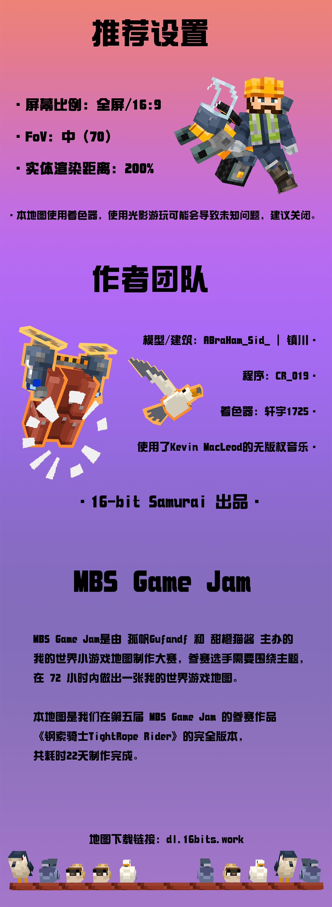
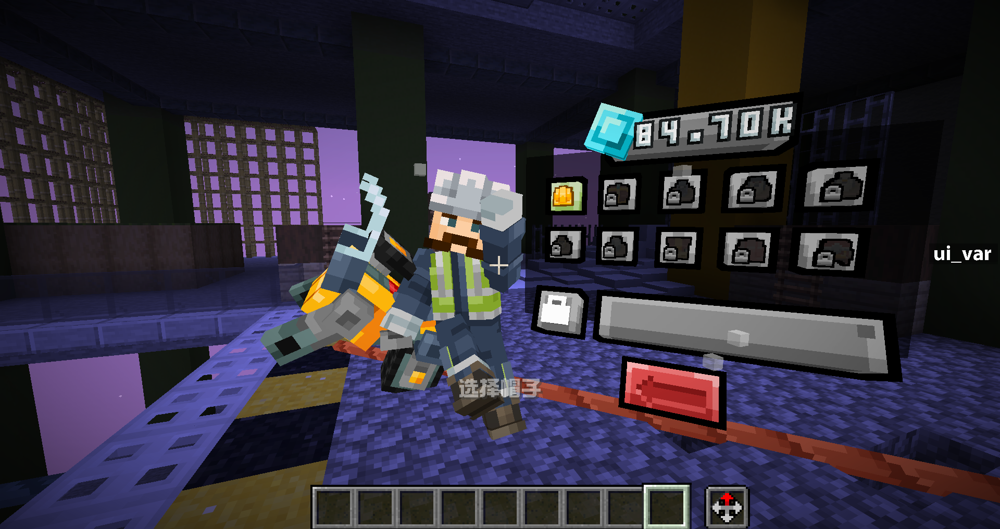
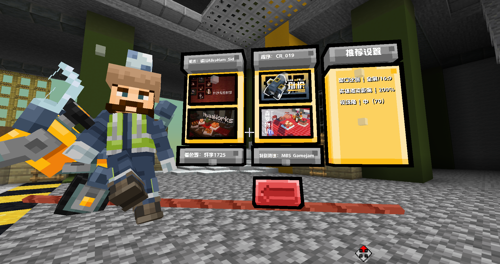
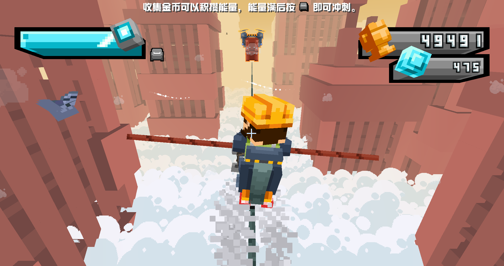
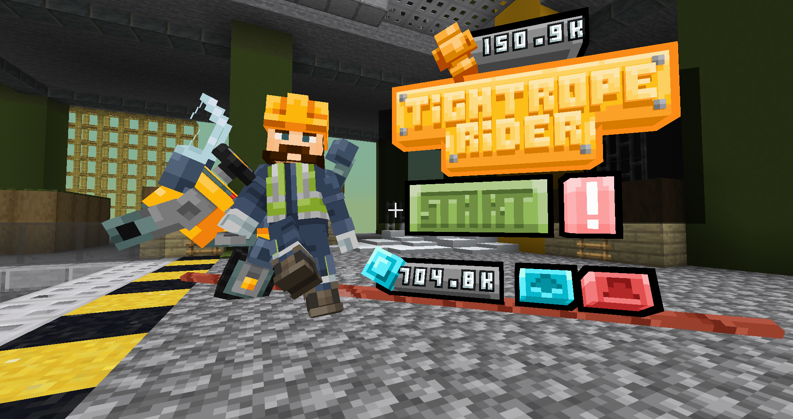
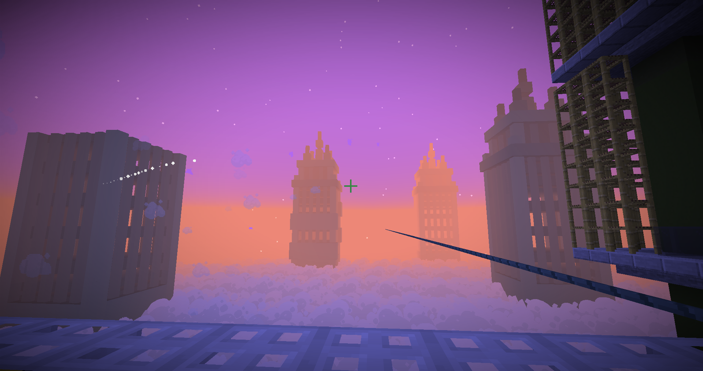

::: tip Translation notice
This page was translated with machine translation and may contain inaccuracies. If you can help improve it, please open an issue or submit a pull request.
:::

<FeaturedHead
    title="A solo-level MC mini-game? &quot;Tightrope Rider&quot;"
    authorName="CR_019"
    cover = '../../../../../feature/archive/202603/_assets/1.png'
    :extraAuthors="['镇川', '轩宇1725']"
/>

> You are right, but "TightRope Rider" is a new stand-alone parkour game independently developed by 16-bit Samurai. The game takes place on a steel cable high in the city. You will play a mysterious character riding a balancing motorcycle. You will meet various birds on the endless steel cable. Together with them, you can collect props and avoid obstacles. At the same time, you will gradually discover the truth about "breakfast stolen by seagulls".

## Introduction
This is a parkour mini-game map where you will balance on an endless tightrope, collect props, avoid obstacles, and encounter various birds.  \
This map contains features:
- Opening CG and smooth standby animation
- Exquisite models and scenes
- 4 types of birds, 3 types of obstacles and 3 types of props
- Upgrade and hat selection system
- achievement system

## Picture display

## Promotional video

https://www.bilibili.com/video/BV1MENPzsExT

## Map download

Map download: dl.16bits.work
Alternate link (Baidu Netdisk):https://pan.baidu.com/s/17bb0h82_KnJFaVW8yJ1Sow?pwd=5688
The map supports single player play.
Only supports Minecraft version Java 1.21.11

--- 

16-bit Samurai communication group: 964165648

---

(The map provides three versions. There is no essential difference in the map content of each version, only the definition of the opening cg is different. Lite is 480p, Standard is 720p, and HD is 1080p.)
