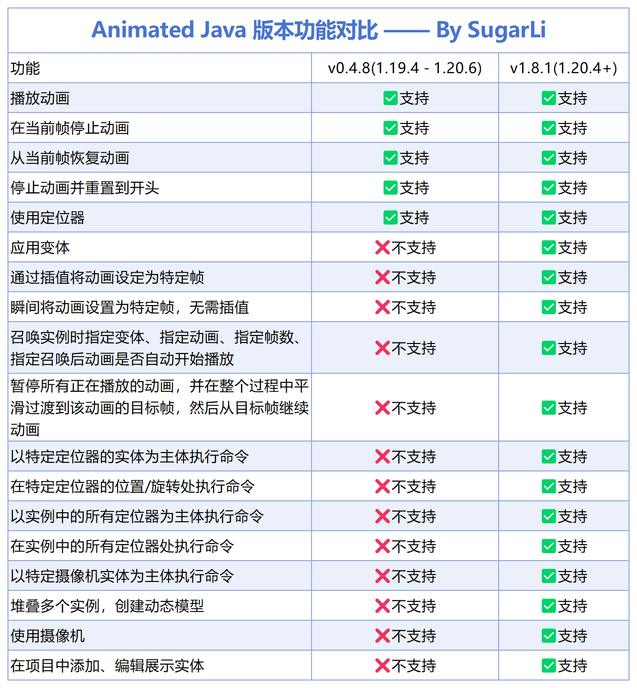

::: tip Translation notice
This page was translated with machine translation and may contain inaccuracies. If you can help improve it, please open an issue or submit a pull request.
:::


<FeatureHead
    title="Animated Java vanilla model animation production series tutorials"
    authorName="Sugar_Li"
    cover = '../../../../../feature/archive/202603/_assets/4.png'
/>

## Project background

Animated Java is a plug-in based on Blockbench that allows creators to implement complex model animation effects in the Minecraft vanilla environment without relying on any mods. However, when I was making the map, I found that there is currently a lack of systematic AJ Chinese tutorials on the Internet, and the official documents only have English versions, which brings learning obstacles to many Chinese users.

The reason was that my friend Kevin needed to make a boss battle system when making Yaqi Story 2, but he didn't know how to use AJ. When I went to station B to look for tutorials, I found that there was no relatively systematic and comprehensive AJ tutorial. So, I decided to record such a set of tutorials myself, and at the same time produce supporting Chinese documents and Chinese plug-ins.

## Tutorial series introduction

### Basic tutorial (completed)

The basic tutorial takes version 1.20.1 as an example and uses the v0.4.8 version plug-in for explanation. This set of tutorials covers the complete process of making AJ animation from scratch:

**Issue 1: Preparation and plug-in installation**

In the first issue, I introduced the prerequisites for using AJ, including downloading and installing Blockbench 4, and preparing the basic knowledge of data pack and resource pack. It explains in detail how to select the corresponding AJ plug-in version according to the game version, and how to download and install the plug-in through the plug-in center or URL. At the same time, I also introduced the construction of the project-specific resource pack and data pack file directory structures.

**Phase 2: Project Creation and Animation Production**

The second issue is the core part of the practical operation. I demonstrated how to create an AJ project in Blockbench, set project parameters, import models and create animations. The tutorial explains in detail:

- Animation keyframe operations (three transformations: position, rotation, and scaling)
- Selection of interpolation type (linear, smooth, Bezier, step)
- The difference between loop modes (single, hold, loop)
- Methods for project export and in-game testing
- Use of common commands (summoning instances, playing animations, removing instances, etc.)

In addition, I also introduced the extended functions, including the use of animation effect tracks (sound, variant, command), positioners, and the production method of IK chain animation - which is very practical for creating animations of continuous structures such as tails, chains, and cloaks.

**Video link:**
- Basic tutorial ①: [BV16zfHBGEi2](https://www.bilibili.com/video/BV16zfHBGEi2)
- Basic tutorial ②: [BV1mFfrB6EeA](https://www.bilibili.com/video/BV1mFfrB6EeA)

### Advanced tutorial

The advanced tutorial explains the new version of the plug-in (v1.8.1, supports 1.20.4+) and introduces the new features and improvements of the new version.

**Issue 1: Chinese version acquisition and new version features**

In the first issue of the advanced tutorial, I first introduced how to obtain the Chinese documents and Chinese plug-ins I made. The new version of the AJ plug-in does not have a Chinese interface by default. Through research, I found that the official language file name was written incorrectly, and the new version did not have a Chinese translation at all. So I spent time making a Chinese version to make it easier for everyone to learn and use.

At the same time, I explained the project setting method of the new version of the plug-in. The main difference from the old version is that when selecting resource pack/data pack, you need to select the folder instead of the mcmeta file. The new version also adds an easing type setting, which can control the motion curve of the animation and achieve a more natural animation effect.

**Second Issue: To be updated**

The second phase of the advanced tutorial is in production and will introduce the following content:

**Macro functions and optional parameters**

The function API of the new version of AJ has been significantly updated. Summoning functions and other control functions now support the use of macro parameters instead of scoreboard parameters. This means you can pass parameters in a more concise way:

```mcfunction
function animated_java:<项目名>/summon {args:{variant:'angry', animation:'walk', frame: 20}}
```


Compared with the old version that required setting multiple scoreboard values, the new version's macro function method is more intuitive and convenient, and it is also easier to embed variables in the command.

**Variation System**

Variants are variations of a model that can be applied to bone instances to change their appearance and NBT. Through the variant panel, you can create different model variants (such as different expressions, different equipment, etc.) and switch them dynamically in the game. Variants support advanced configuration such as texture mapping, inclusion/exclusion of nodes, and more.

**Camera System**

The camera is used to control the player's perspective during animation, by forcing the player to view the animated item display entity. The camera requires additional installation of the camera plug-in. After creation, it can be animated by adding position/rotation keyframes to achieve cinematic lens movement effects.

**Legacy Migration Guide**

For those who are already using older versions of AJ to create projects, I will explain how to`.ajmodel`File upgraded to new version`.ajblueprint`format, and how to clean up outdated export files, update function API calls, and other migration steps.

**Stacking Bones**

Stacking is a technique for attaching multiple bones to each other and can be used to create dynamic models. Through the "use entity" and "command when summoned" properties of the locator, multiple bones can be stacked together, such as mounting the head bone to the body bone to achieve a more flexible model combination.

::: tip Stay tuned
The second phase of the advanced tutorial is in production, and the entire AJ series of tutorials will be completed after the update.
:::

**Video link:**
- Advanced tutorial ①: [BV1swNGzMEvK](https://www.bilibili.com/video/BV1swNGzMEvK)

## version compatibility

Select the corresponding AJ plug-in version according to the game version:

| Plug-in version | Supported game version |
|---------|--------------|
| v1.8.1 (latest version) | 1.20.4+ |
| v0.4.8 | 1.19.4 - 1.20.6 |
| v0.2.4 | 1.16.4 - 1.19.3 |

### Comparison of functions between old and new versions



The new version of the plug-in (v1.8.1) adds many practical functions compared to the old version:

- Easing type settings
- Set animation to specific frame
- Smooth transition animation switching
- Pause all animations
- More animation control options

## Chinese documentation

In order to promote learning exchanges and lower the learning threshold of Animated Java, I translated and produced Chinese documents.

### Document features

- Translated based on Animated Java v1.8.1 version
- Most content is translated by AI and fine-tuned by humans
- Provide online version and local version
- The whole site production takes about one night (about 19:43 - 5:00 the next day)

### Access method

**Online Documentation**: Visit`aj.sugarli.cn`to view

**Local document**: After downloading from the network disk, run`start_server.bat`You can view it locally, it loads quickly and you don’t have to worry about the website hanging down.

::: warning illustrate
This document may not contain content updated after March 2026. Although it has been proofread repeatedly, there may still be undiscovered omissions or errors. If any problems are found, feedback is welcome.
:::

## Chinese plug-in

The new version of the AJ plug-in does not have a Chinese interface by default. I made a Chinese version by studying and modifying the language files.

### How to use

1. Download the Chinese plug-in file from the network disk
2. Replace the corresponding files in the Blockbench plugin directory
3. Restart Blockbench to see the Chinese interface

::: warning versionnote
The Chinese plug-in is based on v1.8.1 version, and subsequent versions may not be compatible.
:::

## Data download

### Network disk link

**Baidu Netdisk:**
- Link:https://pan.baidu.com/s/1hRxfVTx8c1e6v_cuqTjvaw
- Extraction code: tcbl

**Quark Network Disk:**
- Link:https://pan.quark.cn/s/0e512d263e51
- Extraction code: vgv1

### Information content

The network disk contains the following resources:

- Teaching PPT (basic version, advanced version)
- Animated Java Chinese documentation (local version)
- Lizi Chinese plug-in v1.8.1
- Other supporting information

## Reference resources

In the process of creating tutorials and documentation, I consulted the following resources:

### official resources

- Blockbench official website:https://www.blockbench.net
- Blockbench Wiki：https://www.blockbench.net/wiki/
- Animated Java official documentation:https://animated-java.dev/docs
- Animated Java version description:https://animated-java.dev/docs/legacy-releases/versions

### Chinese resources

- Animated Java Chinese documentation:https://aj.sugarli.cn/docs
- Chinese Minecraft Wiki:https://zh.minecraft.wiki/

## About the author

Hello, hello, this is Lizi, a pigeon-type map maker, an UP owner who is trying to do live broadcasts and some practical tutorials.

- **Bilibili homepage**:https://space.bilibili.com/20703672
- **Fans communication group**: 925118607

Welcome friends to join the discussion group!

## Disclaimer

- This tutorial and supporting resources are only for learning and communication purposes. Non-professional systematic teaching may contain certain flaws.
- All content is subject to official documents
- This site is an unofficial Chinese resource and has nothing to do with Animated Java official and Mojang Studios

---

Thank you all for your support! If you have any questions, please leave a message in the comment area or join the discussion group. If you have any mistakes, please raise them and I will actively correct them!

