<FeaturedHead
    title="Have you ever played infinite randomly generated parkour maps? &quot;Leaping into the Crystal World 2&quot;"
    authorName="Xu Muxian"
    cover = '../../../../../feature/archive/202604/_assets/0.jpg'
/>

## Introduction
When we were kids, there was a game on iOS that embraced us: Smash hit. Now, we've ported its ideas to Minecraft's parkour maps. In this map, we have limited the number of jumps the player can make. They can only increase the number of jumps through supply crystals in the game. If you fall, 10 jump points will be deducted. The game ends when the number of jumps reaches zero.

This map is a randomly generated infinite map, containing:
- 1 preliminary level
- 11 official levels
- 1 endless level

How to play this map:
- Yellow supply crystals only increase the number of jumps by 3 points, blue ones by 5 points, and green ones by 10 points.
- Each obstacle will only give you one chance to jump. If you fall, you will not be resurrected on the spot, but will be teleported forward. So, you don’t have to worry about getting stuck at a difficult point!
- We have also added three difficulties to the game: Easy, Classic, and Hell. If you feel that you can't pass a certain level, you can switch to a simpler mode to experience the scenery of subsequent levels~

This map is not currently suitable for multiplayer games and can only be enjoyed by one person~

version Java 1.21.10, happy playing!

## Promotional videohttps://www.bilibili.com/video/BV1GNZpBhEAc
## Map downloadhttps://www.minebbs.com/resources/15266/
## Map screenshot
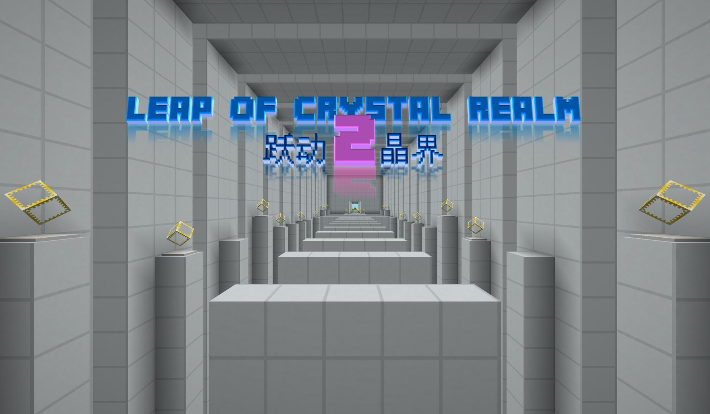  
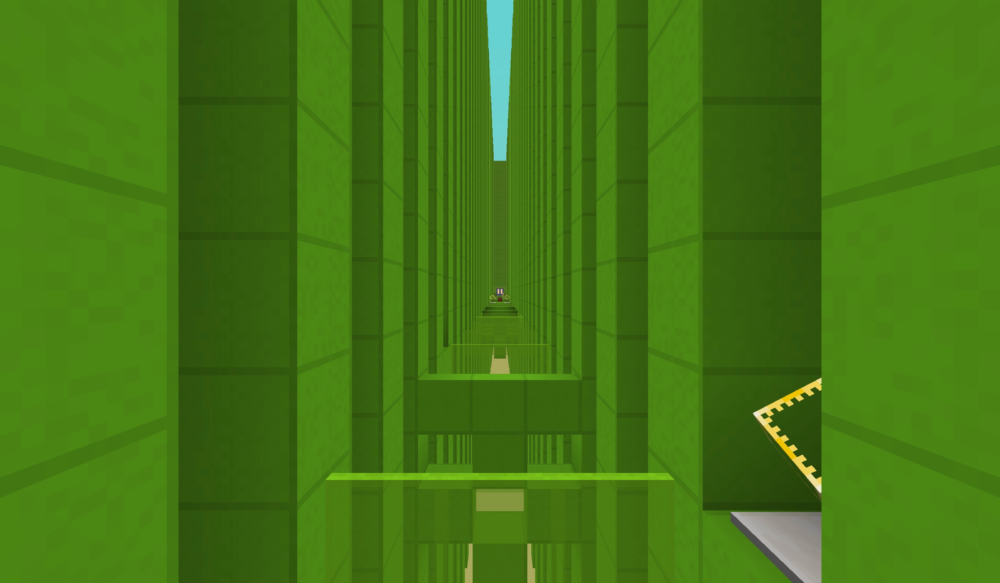  
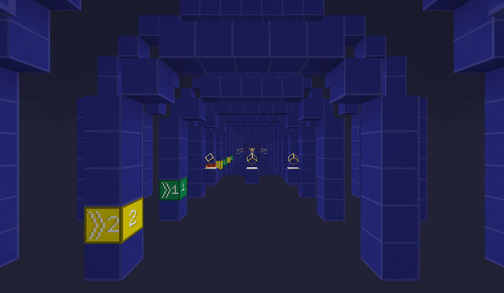  
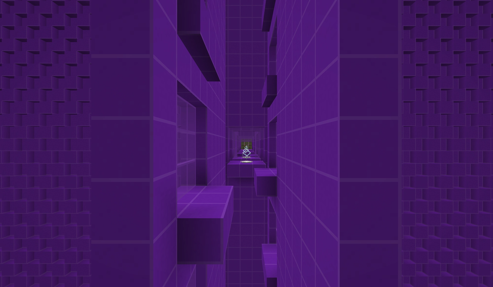  
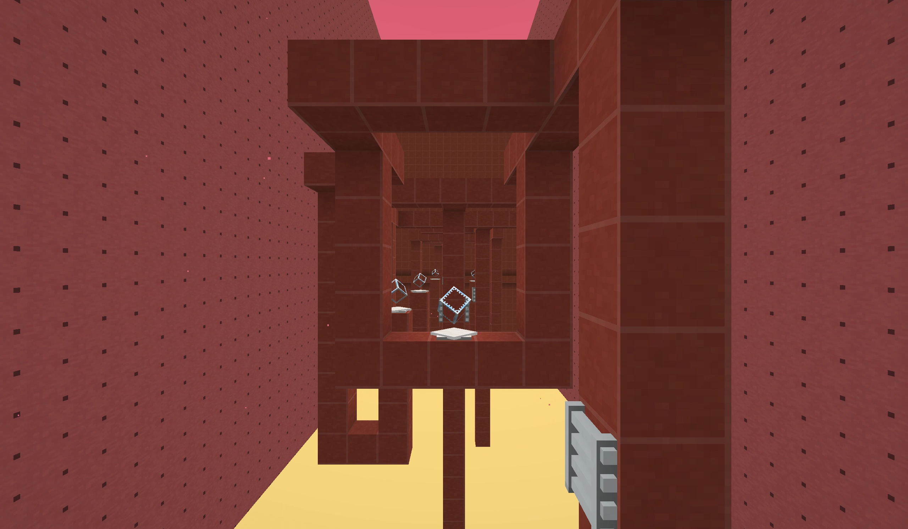  
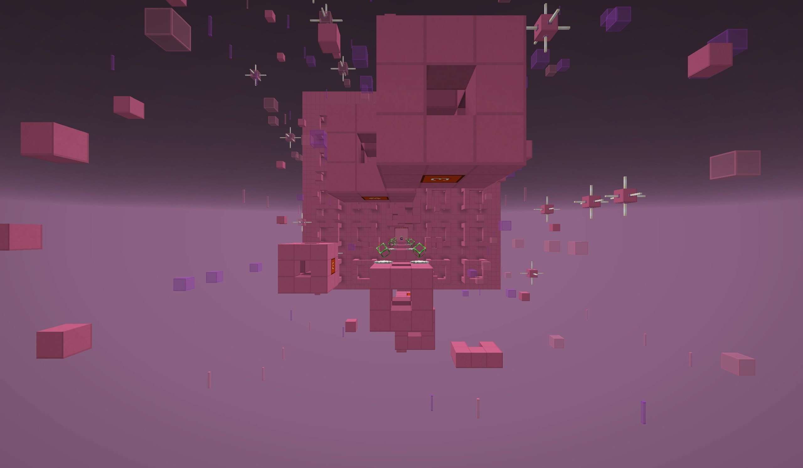  
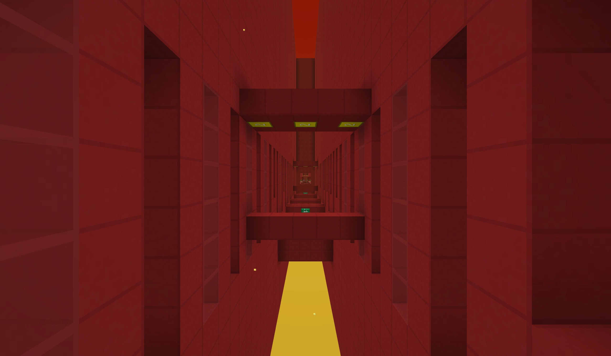  
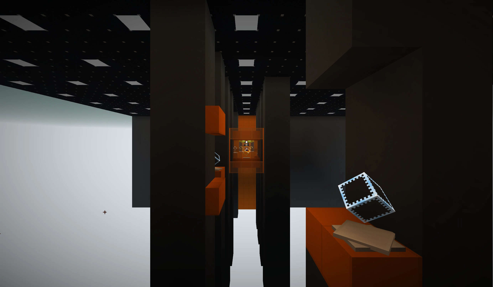  
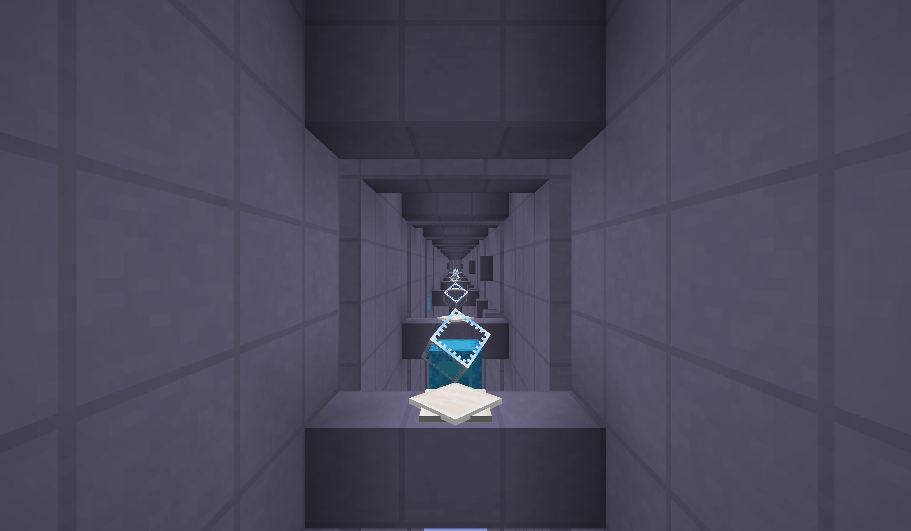  
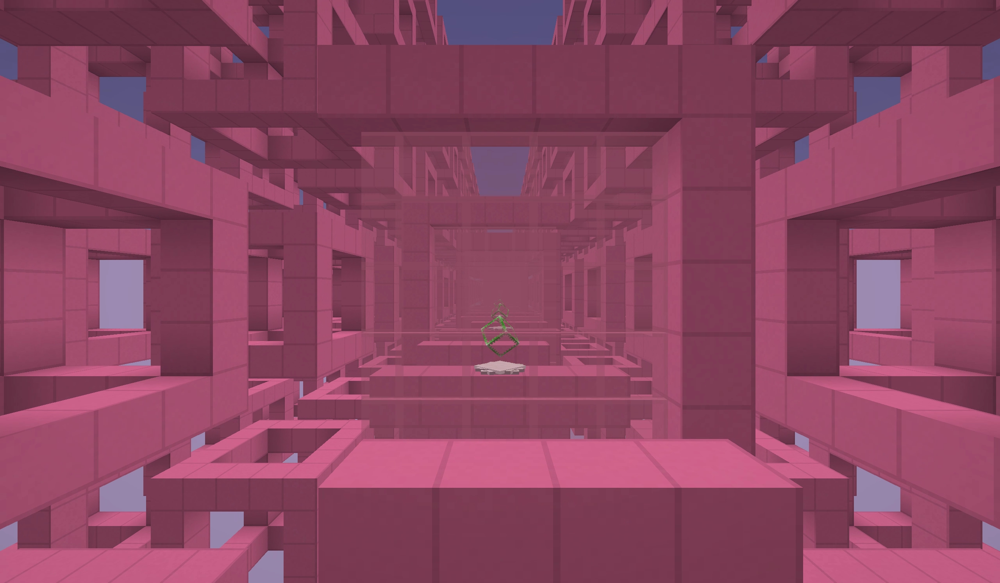  
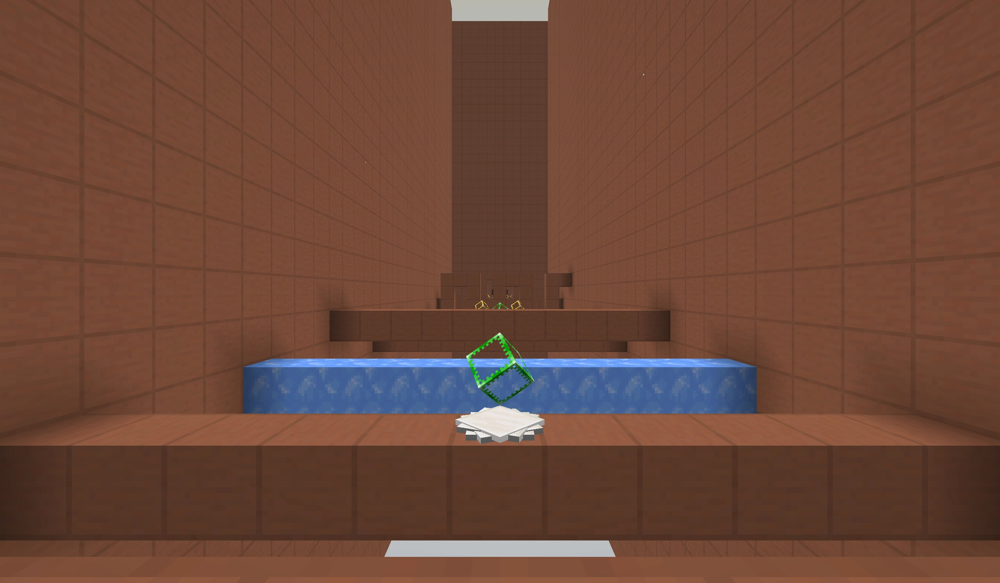  
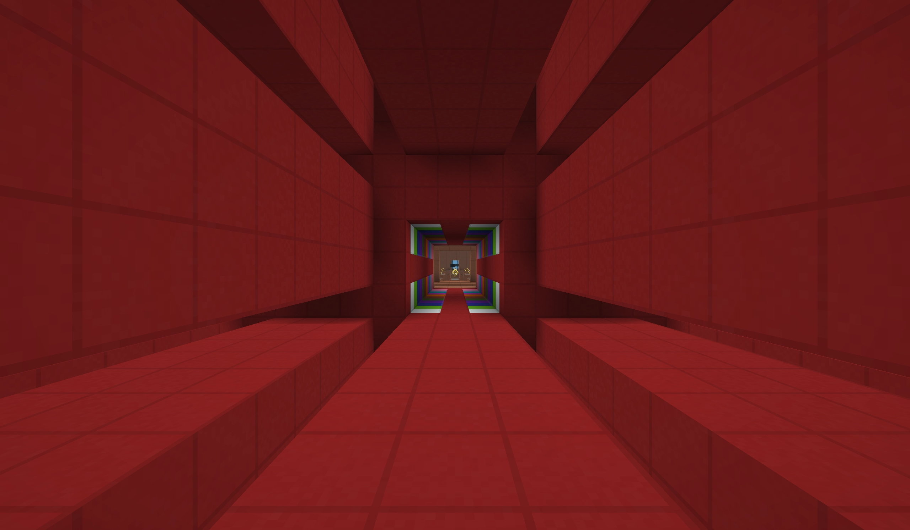  
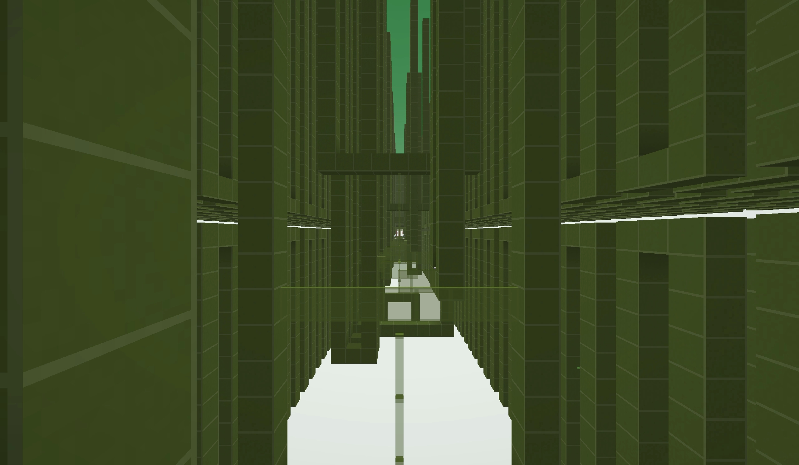  
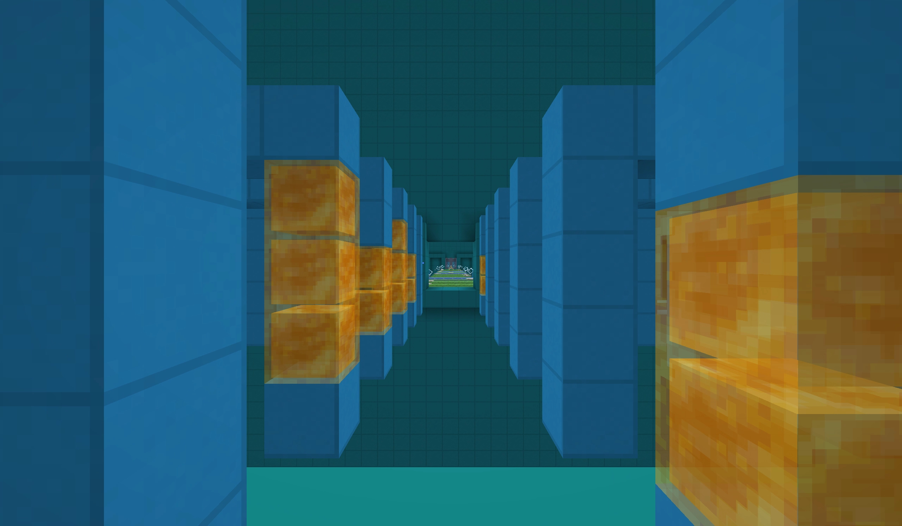

## Awards
This map won the third place in the Creative Art Ocean Track of MineBBS's first block creation competition.​

## About Us
Xu Muxian’s personal studio: g.t.studio

Xu Muxian QQ group: 1060595795
