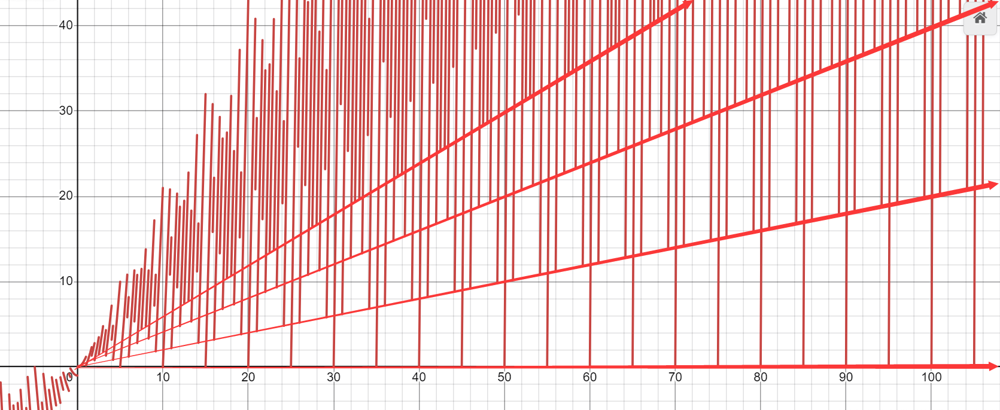

::: tip Translation notice
This page was translated with machine translation and may contain inaccuracies. If you can help improve it, please open an issue or submit a pull request.
:::


<FeatureHead
title='Lightweight and low-loss algorithm and program implementation for converting OBJ model to voxel model'
authorName='Xuanyu1725'
/>

## introduction

### background

Minecraft model artists generally use the software Blockbench to create and edit models. A considerable number of artists also use OBJ format models as materials or design models by themselves in other more powerful 3D software, and then manually create voxel versions of these models in Blockbench.

At the same time, although there are a large number of tools for converting OBJ models into voxel models on the market, most of them simply discretize the OBJ models into grids with fixed side lengths for voxel processing. This method not only loses the original art style and model details, but also creates a large number of redundant voxels. It brings a lot of performance overhead during rendering, and is very unfavorable for artists to perform subsequent processing and optimization of the model.

This article will discuss the program implementation and optimization strategies of this framework based on the basic framework mentioned in the author's article "A Feasible Method for Converting OBJ Models to JSON Models" published in Feature 2025.12. During the implementation process, we will deeply explore the application of mathematical tools such as graph theory, number theory, and linear algebra in the model voxelization process.

## Algorithm framework

### Algorithm process

Combined with the author's observation and analysis of the process of artists using OBJ models to create voxel models, the conversion algorithm proposed in this article mainly goes through the following steps:

- Constructed surfaces: The visual feature of the OBJ model is a complex mesh composed of flat surfaces, so we treat each flat surface as an object and express it with voxels.

- Find the optimal rectangle: use several larger rectangles to cover every flat surface as much as possible, thereby expressing the entire surface with very few voxels.

- Fitting triangles: After covering each flat surface with the optimal rectangle, the remaining uncovered areas are further fitted with triangles to express the geometry of the original OBJ model as accurately as possible.

- Describing voxel blocks: After basically expressing the entire model with voxels, we will describe the position, color and other information of each voxel block in different formats to generate a final voxel model file that can be used in Minecraft or Blockbench.

### Main questions

In the process of implementing the above algorithm, several main problems need to be solved:

- The format of the OBJ model has different conventions and parsing methods, and it is necessary to correctly handle the reading and organization of vertices, normals, texture coordinates, and surface information in the program.

- Flat surfaces may be concave polygons and may have holes. These situations require special attention.

- The art style of Minecraft generally requires that the side length of a voxel be an integer multiple of a certain minimum unit. For example, the default precision in Blockbench is$1$units, fine adjustments are respectively$0.1, 0.25, 0.05$and other units.

## Algorithm implementation

### constructed surface

Assuming that we have read the vertices, normals and surface information of the OBJ model (we don't care about other data), record the vertex set as$V_0$, the face set is recorded as$F_0$.each side$f \in F_0$Composed of several vertex indices, we regard each face as a flat surface, and record its corresponding vertex set as$V_f \subseteq V_0$. Memorize faces$f$The normal line is$\mathbf{n}_f$.

In order to construct the surface, we propose two conditions:

noodle$f_1, f_2 \in F_0$Belong to the same surface if and only if:

1. Two faces share at least one edge$\left|V_{f_1} \cap V_{f_2}\right| \ge 2$

2. The normal vectors of the two faces are the same, that is$\mathbf{n}_{f_1} = \mathbf{n}_{f_2}$

we will$F_0$The surfaces that meet the above conditions in are divided into several surface collections, and the surfaces in each surface collection belong to the same flat surface, thus obtaining the surface division results of the model. These surface collections are denoted as$\{S_i\}_{i=1}^m$, in$S_i \subseteq F_0$and$\bigcup_{i=1}^m S_i = F_0$, each$S_i$The faces in all belong to the same flat surface. Since we do not particularly discuss the order of flat surfaces, we also use$S$A collection of faces representing any surface.

During implementation, since only faces sharing the same normal will be divided into the same set, you can first$F_0$Group by normals (or approximate normals), pair normals$\mathbf{n}$The grouping is recorded as$F_{\mathbf{n}}$, and then perform connectivity analysis based on the conditions of shared edges within each normal group to obtain the final surface division result. Construct a set$S$The preferred method is connected component detection based on union-find set, the core steps of which are:

1. When reading the program, if two normals$\mathbf{n}_{f_1}, \mathbf{n}_{f_2}$If they are the same (or approximately the same), they will be recorded as the same normal, and index mapping will be provided.

2. Traverse all faces$f_i \in F_0$, if its normal index corresponds to the same normal in the mapping$\mathbf{n_i}$, then add it to the set$F_{\mathbf{n_i}}$, and finally get multiple normal groups$F_{\mathbf{n}}$

3. Maintain a hash table recording which faces each edge is shared by$f(x): \bar{e} \mapsto \{f_i \mid \bar{e} \subseteq V^2_{f_i}\}, V^2_{f_i}$Representation surface$f_i$The set of edges formed by pairwise combinations of vertices is expressed by$\bar{e}$Represents an edge$e$The undirected representation of .

4. in each normal group$F_{\mathbf{n_i}}$Within, initialize a union search set, each face belongs to an independent set

5. Traverse all faces within this normal group$f_i \in F_{\mathbf{n_i}}$Query each edge of it in the hash table$\bar{e} \subseteq V^2_{f_i}$Which faces are shared, if an edge is shared by another face$f_j \in F_{\mathbf{n_i}}$shared, then in the merge set the$f_i$and$f_j$Merge into the same set to obtain the connected components within the normal group, each connected component corresponds to a flat surface$S$

6. When the union-find sets in each normal group are processed, these union-find sets constitute the division results of all flat surfaces in the model, and each union-find set corresponds to a flat surface.$S$

The following is a short code implementation:

```python

class UnionFind:
    def __init__(self, n):
        self.parent = list(range(n))
        self.rank = [0] * n

    def find(self, x):
        if self.parent[x] != x:
            self.parent[x] = self.find(self.parent[x])
        return self.parent[x]

    def union(self, x, y):
        xroot = self.find(x)
        yroot = self.find(y)
        if xroot == yroot:
            return
        if self.rank[xroot] < self.rank[yroot]:
            self.parent[xroot] = yroot
        else:
            self.parent[yroot] = xroot
            if self.rank[xroot] == self.rank[yroot]:
                self.rank[xroot] += 1

# 假设 faces 是面列表, 每个面是顶点索引的列表
# normals 是每个面的法线向量
from collections import defaultdict

def construct_surfaces(faces, normals):
    normal_map = {}
    normal_groups = defaultdict(list)
    for i, n in enumerate(normals):
        key = tuple(round(c, 6) for c in n)  # 使用近似法线作为键
        if key not in normal_map:
            normal_map[key] = len(normal_map)
        normal_groups[normal_map[key]].append(i)

    edge_map = defaultdict(list)
    for i, f in enumerate(faces):
        for j in range(len(f)):
            e = tuple(sorted((f[j], f[(j + 1) % len(f)])))
            edge_map[e].append(i)

    surfaces = []
    for group in normal_groups.values():
        uf = UnionFind(len(faces))
        for i in group:
            f = faces[i]
            for j in range(len(f)):
                e = tuple(sorted((f[j], f[(j + 1) % len(f)])))
                for other in edge_map[e]:
                    if other in group:
                        uf.union(i, other)
        components = defaultdict(list)
        for i in group:
            root = uf.find(i)
            components[root].append(i)
        surfaces.extend(components.values())
    return surfaces

```


### Find the optimal rectangle

This step will basically cover the general model surface, by finding several rectangles with larger areas on each flat surface to cover the entire surface as much as possible, thereby expressing the surface with the fewest voxels.

Our task is on the surface$S$Find the rectangular sequence with the largest area within$\{r_i\}$, so that these rectangles cover the entire surface as much as possible$S$, thereby expressing the surface with the fewest rectangles (corresponding to the fewest voxel blocks).

These rectangles$\{r_i\}$The selection needs to meet two conditions:

1. The side length of the rectangle is$\delta$an integer multiple of,$\delta$is a normal constant.
2. The rectangle must lie entirely on the surface$S - r_{i-1} - \cdots - r_{1}$Inside, that is, each vertex of the rectangle is on the surface$S$boundaries or interiors and do not overlap each other.
3. Under the condition that the first two conditions are met,$r_{i}$yes$S - r_{i-1} - \cdots - r_{1}$The rectangle with the largest area.

Since we need to loop each time to find the remaining surface$S - r_{i-1} - \cdots - r_{1}$The rectangle with the largest area in , so this is a greedy algorithm, each time the rectangle with the largest area in the current remaining surface is selected as$r_i$, until no more qualified rectangles can be placed on the remaining surface. The basic process is as follows:

1. calculate$S$In the tangent space, we use the covariance matrix to obtain two numerically stable tangents:

remember$V_S$for the surface$S$The set of all vertices on, calculate$S$The center of mass of all vertices on$c$:

   $$c = \frac{1}{|V_S|} \sum_{v \in V_S} v$$

Calculate the covariance matrix:

   $$\Sigma = \frac{1}{|V_S|} \sum_{v \in V_S} (v - c)(v - c)^T$$

Perform eigendecomposition on the covariance matrix, and take the eigenvectors corresponding to the first two largest eigenvalues ​​as the tangent direction, recorded as$\mathbf{T}, \mathbf{B}$, and calculate reliable normals$\mathbf{N} = \mathbf{T} \times \mathbf{B},$to get the surface$S$tangent space basis of$\{\mathbf{T}, \mathbf{B}, \mathbf{N}\}$,

2. place the surface$S$The vertices of are projected into tangent space$\{\mathbf{T}, \mathbf{B}, \mathbf{N}\}$above, the third component of coordinate is close to$0$, discard and get the two-dimensional coordinate$(u, v)$, thereby converting the three-dimensional surface problem into a rectangular coverage problem on a two-dimensional plane. Since we need to restore the three-dimensional coordinates later, we cannot omit it$\mathbf{N}$calculation.

    $$\begin{pmatrix}u \\ v\end{pmatrix} = \begin{pmatrix}\mathbf{T}^T \\ \mathbf{B}^T\end{pmatrix}_{2 \times 3} \mathbf{v}, \space \mathbf{v} \in \mathbb{R}^3$$

in$\mathbf{T}, \mathbf{B}, \mathbf{v}$is a column vector.

3. Traverse the surface$S$All faces within, extract all directed edge indices$(i, j)$and join the collection$E_0$in, there are rules$E \cup \{-(i,j)\} = E \setminus \{(i,j)\},$in$-(i,j) = (j,i),$Finally get the boundary set$E_0.$

4. for each boundary edge$e=(p,q) \in E_0$, construct a local plane coordinate system, let$\mathbf{\hat u} = (q-p)/\|q-p\|$for$u$direction,$\mathbf{\hat v} = \mathbf{N} \times \mathbf{\hat u}$for$v$direction, and then transform all the boundary segments of the current surface into the local coordinate system. Different from the previous article, in the current implementation, this edge is only used to determine the orientation of the rectangle search. It does not force the final rectangle to be attached to this edge, but allows the rectangle to freely translate within the search area of ​​the local coordinate system.

5. In the local coordinate system, take the axis-aligned bounding box of all boundary vertices.$[u_{\min}, u_{\max}] \times [v_{\min}, v_{\max}]$as the search area, and use$\delta$is the step size and is discretized into a grid. Sampling positions for each column$u_i = u_{\min} + (i + \tfrac{1}{2})\delta$, calculate its intersection points with all boundary line segments, and then press the intersection point$v$The coordinates are sorted and paired to obtain several valid intervals of the column located inside the surface. The grids falling in these intervals are marked as available, and the remaining grids are marked as unavailable.

6. Convert the available interval of each column into the height of the histogram, and use the monotonic stack dynamic programming of "maximum rectangle in the histogram" to online find the largest axis-aligned rectangle composed only of available grids, whose width and height are both$\delta$An integer multiple of . Repeat this process for all candidate boundary directions, and after passing the legality check of "the rectangle is completely located inside the outer ring and does not overlap with existing holes", the rectangle with the largest area is taken as the optimal rectangle of the current surface. If no legal rectangle can be found for each surface, the current surface is directly merged into the triangular surface set$S_\Delta.$And in short this surface search.

7. Note down the optimal rectangle currently found$r_i$The two-dimensional coordinate of$(u_{\min}, v_{\min}, u_{\max}, v_{\max})$Restore its three-dimensional coordinates through the matrix and add the optimal rectangle set$R$middle

8. Get the reconstruction boundary$E_1 = E_0 + E_r,$E_r is the current optimal rectangle$r_i$The set of boundary line segments of , and from$E_0$Remove the quilt$r_i$Cover the boundary line segments to get a new boundary set$E_1$

9. right$E_1$Triangulate and discard areas smaller than$\delta^2$of triangles, merged into the triangular surface collection$S_\Delta.$

10. Perform surface reconstruction on the triangular mesh to obtain the remaining surface$S - r_i$, and repeat steps 4-7 on the remaining surfaces until no more qualified rectangles can be placed on the remaining surfaces, or the allowed number of iterations is exceeded.

### fit triangle

Fitting a triangle is a definite mathematical process, that is, given the coordinates of the three vertices of the triangle$(v_0, v_1, v_2),$An explicit solution can be given to minimize the fitting error of the triangle. At this stage, the optimal solution we pursue is to minimize the error. We have the following solutions for triangles of different sizes:

For triangular surfaces, since there is a minimum element$\delta$, we first discuss its size. If the length and width of the smallest circumscribed rectangle of the triangle are less than$\delta$, then the triangle is called small; if the length and width of the largest inscribed rectangle of the triangle are greater than or equal to$\delta$, the triangle is called large; otherwise it is called medium.

1. For small triangles, we try two fitting methods:

    1. Fit the triangle using two bounding rectangles. For the vertex corresponding to the largest angle, place two rectangles parallel to the adjacent sides of the vertex inside the triangle so that the inner sides of the two rectangles intersect at a point on the opposite side of the vertex. By taking different intersection points, different fits can be obtained, and the method with the smallest error can be selected. The dimensions of the bounding rectangle need not be$\delta$An integer multiple of , but if the solution can be obtained$\delta$is an integer multiple of , then select$\delta$can minimize the error in integer multiples$e_S$solution.

    2. Calculate the center of gravity of the triangle, and then use the center of gravity as the center directly using a$\delta \times \delta$The rectangle fits the triangle, one side coincides with the side of the triangle, and the error is calculated$e_S$。

error here$e_S$defined as a set$\{S: S \in S_{voxel}, S \notin S_{triangle}\}$of measure$\frac{1}{4}$, that is, the area of ​​the rectangle beyond the triangle:

    $$e_S = \frac{1}{4} \sum_{S \in S_{voxel} - S_{triangle}} Area(S)$$

Choose the one with the smaller error among the two methods as the fitting method for the small triangle.

2. For medium triangles, we use double wrapping:

    1. Select the maximum angle, recorded as$A$, the adjacent angle is recorded as$B$and$C$, the opposite sides of the three angles are written as$a, b, c$。

    2. exist$a$Take a little bit$D$, Pass$D$do$b，c$perpendicular to , respectively from the ray$BA, CA$intersection point$E, F$。

    3. by$E$For example, if$E$exist$b$above, then the rectangle$R_1$An edge of$AB$, the length of the adjacent side perpendicular to it is$d_1$Its value is equal to$D$and$b$distance; if$E$exist$b$along$BA$On the extension line of the direction, the rectangle$R_1$An edge of$BE$, the length of its perpendicular adjacent side is also$d_1$。

To simplify calculations, we assume$d_1,d_2$Can't even get it$\delta$integer multiples of , so that they are continuous values. After calculating the best value, try to adjust it to$\delta$an integer multiple of.

Satisfy the following optimization constraints:

    $$ S(R_1) = \frac{1}{2} \left( d_1^2 \tan B + (\max(0, \cot C d_1 - b))^2 \tan(B+C) \right) $$

    $$ S = S(R_1) + S(R_2) $$

    $$ e_S = \frac{S}{4} = \frac{S(R_1) + S(R_2)}{4} $$

    $$\phi (d_1, d_2) = d_1 \sin B + d_2 \sin C - a = 0$$

Using the Lagrange multiplier method, we construct the Lagrange function:

    $$ \mathcal{L}(d_1, d_2, \lambda) = e_S(d_1, d_2) + \lambda \phi(d_1, d_2) $$

right$d_1, d_2, \lambda$Taking the partial derivative and setting it to zero, we get the system of equations:

    $$
    \frac{\partial \mathcal{L}}{\partial d_1} = 0, \quad \frac{\partial \mathcal{L}}{\partial d_2} = 0, \quad \frac{\partial \mathcal{L}}{\partial \lambda} = 0
    $$

3. For large triangles, we use the wraparound method:

    1. We use different LODs to divide the internal area, that is, divide the internal area into$\xi\delta \times \xi\delta$grid,$\xi$Pick$1, 2, \dots, k$,in$k$is the side length of the largest inscribed rectangle of a triangle and$\delta$The integer part of the ratio. For the "large triangle" in our definition,$k \ge 1$。

    2. Under different LODs, pixelate the internal area (inscribed fitting), that is, within the divided grid, select the grid completely contained within the triangle as the pixel block.

    3. Select three vertices of the triangle$A, B, C$, place three rectangles along the adjacent sides.$R_1, R_2, R_3$, whose thicknesses are respectively$d_1, d_2, d_3$. Choose the smallest$d_1, d_2, d_3$Cover the area that cannot be covered by inscribed fitting, and calculate the distortion area caused by wrapping$S$。

For this step, we need to first select the direction, that is, select one side as the bottom edge. At this time, the determined pixels will generate the left, right, and top borders. For the hypotenuse on the left, we calculate the distance between each grid point of the left boundary and the upper boundary from the hypotenuse, and take the minimum value as$d_1$, similarly the hypotenuse on the right takes the minimum value as$d_2$, obviously the bottom$d_3$is 0.

Calculate different sides as bases separately$d_1, d_2, d_3$, and then calculate the distortion area$S$, the choice makes$S$minimal solution.

    $$ S = \frac{1}{2} \left((d_1^2 + d_2^2)\max(0, \cot A) + (d_1^2 + d_3^2) \max(0, \cot B) + (d_2^2 + d_3^2) \max(0, \cot C)\right) $$

    4. Calculate the error value at each LOD$e_S = \frac{S}{4}$and number of voxels$M$, choose such that the cost index$\mathcal{J} = \alpha e_S + \beta M$The smallest solution is taken as the final solution.

here,$\mathcal{J}$is approximated as a unimodal function and can therefore be calculated at different LODs$\mathcal{J}$And choose the minimum value to get the approximate optimal solution.

Likewise, we can find a good fit inside based on the histogram maximum rectangle algorithm.

### Describe voxel blocks

Voxel blocks (elements) in Minecraft are defined by the following fields:

<div class="nbttree">

<node type="compound" name=""/> This is a model element.
- <node type="list" name="from" required=true />Specifies the starting point of the model element cuboid.
  - <node type="float" name=""/>(not less than`
- 16`and not greater than`32`) The coordinate of the cuboid on the X axis`x1`。
  - <node type="float" name=""/>(not less than`
- 16`and not greater than`32`) The coordinate of the cuboid on the Y axis`y1`。
  - <node type="float" name=""/>(not less than`
- 16`and not greater than`32`) The coordinate of the cuboid on the Z axis`z1`。
- <node type="list" name="to" required=true />Specifies the end point of the model element cuboid.
  - <node type="float" name=""/>(not less than`
- 16`and not greater than`32`) The coordinate of the cuboid on the X axis`x2`。
  - <node type="float" name=""/>(not less than`
- 16`and not greater than`32`) The coordinate of the cuboid on the Y axis`y2`。
  - <node type="float" name=""/>(not less than`
- 16`and not greater than`32`) The coordinate of the cuboid on the Z axis`z2`。
- <node type="compound" name="rotation"/> (default no rotation) sets the rotation of the element.
  - <node type="list" name="origin" required=true />Set the center of rotation.
    - <node type="float" name=""/>The coordinate of the rotation center on the X axis.
    - <node type="float" name=""/>The coordinate of the rotation center on the Y axis.
    - <node type="float" name=""/>The coordinate of the rotation center on the Z axis.
  - <node type="bool" name="rescale"/> (default is`false`) whether to rescale the rotated model elements.
  - Both single-axis rotation and multi-axis rotation can be used. At least one rotation must be specified, and the game will try to use single-axis rotations first.
  - Single axis rotation format:
    - <node type="float" name="angle" required=true />Rotation angle.
    - <node type="string" name="axis" required=true />Rotation axis. can be`x`、`y`or`z`。
  - Multi-axis rotation format:
    - <node type="float" name="x" required=true />The rotation angle on the X axis.
    - <node type="float" name="y" required=true />The rotation angle on the Y axis.
    - <node type="float" name="z" required=true />The rotation angle on the Z axis.
- <node type="bool" name="shade"/> (default is`true`) whether to render shadows.
- <node type="int" name="light_emission"/>（`0`arrive`15`) specifies the luminescence level to render this model element.
- <node type="compound" name="faces" required=true />All faces of the model element.
  - <node type="compound" name="<face>"/>Specifies the attributes of a certain face.

</div>

If this definition is regarded as a transformation of the unit cube, then it can be written as

$$\mathscr{A}(x) = \mathbf{T_0 R T_0^{-1} S T}x$$

The decomposition is related to a`json`Fields correspond one to one, so we only need to solve each matrix to write the corresponding`json`field.

in$\mathbf{T}$express`from`Field is a translation matrix.$\mathbf{S}$is a scaling matrix,$\mathbf{R}$is the rotation matrix, corresponding to`rotation.x`, `rotation.y`, `rotation.z`，$\mathbf{T_0}$Represents the center of rotation, corresponding to`rotation.origin`field.

The decomposition of this transformation matrix is ​​not uniquely determined by the final vertex position of the voxel.$\mathbf{T_0, T}$, so we introduce two different preferences:

1. The first preference is due to$\mathbf{T}$has limitations,`from`and`to`Fields are restricted to$[-16,32]^3$Within the range, we define it as the identity matrix$I$All translations are contributed by rotation transformations about the vertices.

Under this preference, the transformation degenerates into
    
    $$\mathscr{A}(x) = \mathbf{T_0 R T_0^{-1} S}x$$

Then one corner of the voxel and its four vertices adjacent to the corner$v_0, v_x, v_y, v_z$To determine this voxel, four equations can be written:

    $$
    \begin{cases}
    \mathbf{T_0 R T_0^{-1} S}[0, 0, 0, 1]^T = v_0 \\
    \mathbf{T_0 R T_0^{-1} S}[1, 0, 0, 1]^T = v_x \\
    \mathbf{T_0 R T_0^{-1} S}[0, 1, 0, 1]^T = v_y \\
    \mathbf{T_0 R T_0^{-1} S}[0, 0, 1, 1]^T = v_z
    \end{cases}
    $$

Can be solved:

    $$\mathbf{S} = \begin{pmatrix}
    \|v_x - v_0\| & 0 & 0 & 0 \\
    0 & \|v_y - v_0\| & 0 & 0 \\
    0 & 0 & \|v_z - v_0\| & 0 \\
    0 & 0 & 0 & 1
    \end{pmatrix}$$

    $$\mathbf{R} = \begin{pmatrix}
    v_x - v_0 & v_y - v_0 & v_z - v_0 & \mathbf{\varepsilon_4} \\
    \end{pmatrix}_{4 \times 4}
    $$

in$\mathbf{\varepsilon_4} = [0, 0, 0, 1]^T$

    $T_0$A center of rotation can be given using geometric methods, given by$\mathbf{R}$Find the axis of rotation$\mathbf{u} = [u_1, u_2, u_3]^T$and rotation angle$\theta$, and there is$\mathbf{u}$for$\mathbf{R}$upper left$3 \times 3$The matrix eigenvalues ​​are$1$eigenvector.

Then the center of rotation is the point passing through the origin and$\mathbf{u}$vertical plane$\mathbf{u_1}x + \mathbf{u_2}y + \mathbf{u_3}z = 0$on, such that the directed arc$\overset{\frown}{Ov_0}$The corresponding central angle is$\theta$center of the circle. recorded as$C = (x_0,y_0,z_0)$

That is to say, satisfy
    $$
    \mathbf{u_1}x_0 + \mathbf{u_2}y_0 + \mathbf{u_3}z_0 = 0, \quad \angle (\overrightarrow{CO}, \overrightarrow{Cv_0}) = \theta
    , \quad \|\overrightarrow{OC}\| = \| \overrightarrow{Ov_0} \| $$

If you remember$\displaystyle \mathbf{v_\bot} = \mathbf{v_0} - \frac{\mathbf{v_0} \cdot \mathbf{u}}{\|\mathbf{u}\|^2}\mathbf{u}$

Then the solution can be written as

    $$C = \frac{\|\mathbf{v}_0\|^2}{2 \|\mathbf{v}_\bot \|^2}\mathbf{v_\bot} + \frac{\|\mathbf{v}_0\|\sqrt{\|\mathbf{v}_\bot\|^2-\|\mathbf{v}_0\|^2\sin^2\frac{\theta}{2}}}{2\|\mathbf{u}\|\|\mathbf{v}_\bot\|^2\sin\frac{\theta}{2}}$$

but

    $$\mathbf{T_0} = \begin{pmatrix} 0 & 0 & 0 & x_0 \\ 0 & 0 & 0 & y_0 \\ 0 & 0 & 0 & z_0 \\ 0 & 0 & 0 & 1 \end{pmatrix}, \quad \mathbf{T_0}^{-1} = \begin{pmatrix} 0 & 0 & 0 & -x_0 \\ 0 & 0 & 0 & -y_0 \\ 0 & 0 & 0 & -z_0 \\ 0 & 0 & 0 & 1 \end{pmatrix}$$

2. The second preference, in order to facilitate artists to adjust the model, we will$T$The offset represented is set to be aligned with the center of the voxel. Same as above, here$T$The amount of translation should align the center of the voxel with the center of the unit cube. Just let the above derivation$O$Replace with$\mathbf{T}\mathbf{v}_0$, in

    $$\mathbf{T}[0, 0, 0, 1]^T = \frac{1}{2} (\mathbf{v}_x + \mathbf{v}_y + \mathbf{v}_z - \mathbf{v}_0)$$

## Optimization space

All voxels generated by this method are patches, and the lower bound of the generated result is 6 times the minimum voxel. In the future, the number of voxels may be reduced by checking the internal space and merging upper and lower surfaces. If the error caused by triangle wrapping can be hidden in the internal space of the voxel, the final error can be further reduced.

Sometimes the connected components generated by the original model are not optimal, and fitting may be assisted by adding vertices and faces without destroying the visual effect. This also requires determining whether a certain position is inside the model.

At the same time, sometimes the model may need a scaling transformation to minimize the residual error generated by the optimal rectangular stage. In this case, a global optimal scaling ratio needs to be approximated by the aspect ratio within each connected component. See the appendix for details.

## in conclusion

This article optimizes its complexity based on original research, and proposes several possible approximation solutions and improvement ideas to reduce the number and errors of generated voxels while ensuring visual effects. At the same time, a specific program implementation idea is given, which can ensure that the method runs within a certain complexity.

## Acknowledgments and citations

We would like to thank Boanci for the financial support and Blade for discussions and suggestions on reducing the error of the optimal rectangle.

Thanks to Numio and Boanci for providing models to test and verify the effect of the algorithm.

Thanks to Blender for providing modeling tool support.

Original research: "A feasible method to convert OBJ model to json model" Xuanyu1725 flybridOuO Feature 202512
[https://vanillalibrary.mcfpp.top/datapack-index/feature/archive/202512/1/content.html](https://vanillalibrary.mcfpp.top/datapack-index/feature/archive/202512/1/content.html)

## Appendix - Approximate calculation of global optimal scaling ratio (optimizing optimal rectangle)

It has been found in practice that even`8cube`Examples of$12$optimal rectangles are completely covered because$\delta$The integer multiple of may not match the original size. For such a model, if we directly use$\delta$If divided into integer multiples, incomplete coverage may occur.

In order to optimize the performance of the best rectangle, we need to find a way to get the best rectangle from the model and$\delta$Determine a scaling ratio$k,$Make the model scale$k$After multiple times, only the coverage of the best rectangle has reached the minimum error that can be achieved at this stage.

In the following discussion, we refer to the optimal rectangle with unrestricted side length as the theoretical optimal rectangle, with the side length as$\delta$The optimal rectangle is an integer multiple of$\delta-$Optimum rectangle.

How to define error:

 - in each connected component$i$Each candidate edge of$e$, we can find a theoretical optimal rectangle T and the corresponding$\delta-$best rectangle$T_\delta$

 - At this time the error is defined as$\varepsilon_{e,i}(k) = S(T)
- S(T_\delta)$

Note that scaling does not affect the determination of the best edge, so the best rectangle always appears on the same edge, and although the derivatives on the continuous interval may be different, for all$e, \varepsilon_{e,i}(k)$The discontinuity points of are always the same, and they take the minimum value at the same time, so we directly study the error function on the best edge, abbreviated as$\varepsilon_{i}(k)$。

Obviously for each connected component$i$, as long as it is found such that$\varepsilon_i(k)$Take the minimum value$k$, we can get the connected component scaling$k$The minimum error of the optimal rectangular coverage after multiple times. We record the corresponding optimal scaling ratio as$k_i^*$, our theory below is at best irrelevant to this, but may be used to some approximation.

We scale the entire model$k$The error after doubling is defined as

$$
\varepsilon(k) = \sum_i \varepsilon_i(k)
$$

obviously$\varepsilon(k)$The discontinuities are all$\varepsilon_i(k)$The union of discontinuities. It can be proved that any continuous interval of it must be any$\varepsilon_i(k)$continuous interval. And also strictly increases on each consecutive interval. therefore$\varepsilon(k)$The minimum value of must appear at the right limit of a certain discontinuity point (in fact, monotonic intervals are all closed on the left and open on the right, so this right limit is the minimum value of the interval).

So we just need to verify all candidate scaling$k$, and choose to let$\varepsilon(k)$Take the minimum value$k$That’s it.

At present, although we need to run through all connected components to determine the candidate$k$, but since the scaling transformation guarantees:

 - $\delta-$The best rectangle always appears on the same side
 - The position of the theoretical optimal rectangle does not change with scaling, only the value of the area is changed.
 - therefore$\delta-$The optimal rectangle can directly take the position of the known theoretical optimal rectangle, and only need to adjust its side length according to the scaling ratio.$\delta$can be an integer multiple of (simply use rounding down)

Candidate scaling ratios are discussed below$k$The method of seeking.

Assuming no scaling initially, we find at this time that the length and width of the theoretical optimal rectangle are respectively$l$and$w$. At this time when$l$or$w$Exactly$\delta$When it is an integer multiple of , a jump point will occur, which is a candidate scaling ratio.$k$, we record the scaling ratio of these candidates as$\{k\}$then you can directly write

$$
k = \frac{m \delta}{l} \quad \text{or} \quad k = \frac{n \delta}{w}, \quad m,n \in \mathbb{Z}^+
$$

Note that k is infinite, and there is obviously a lower bound$0,$And when$k$The larger it is, it will directly lead to an increase in the error that cannot be avoided in the triangle processing stage in the original paper, so in fact we only need to consider a limited$k$Upper bound. because$k$Related to the model volume, we can determine$k$The upper bound of is such that the maximum AABB scaling component of the model is within 48 units, that is$\sup k = \frac{48}{\max(\text{AABB})}.$then within the upper and lower bounds$k$The quantity is limited.

### an approximation

when$k$Many times, you can choose to only consider$k_i^*$as a candidate scaling factor. obviously$\{k_i^*\} \subseteq \{k\}$

The analysis found that when$\epsilon(k) = 0$When it can be satisfied within the range, there must be a$k_i^*$make

$$\varepsilon_i(k_i^*) = 0.$$

In fact, the first such$\displaystyle k = \operatorname{lcm}\left(\left\{\frac{1}{q_i}\right\}\right)/\delta,$in$\displaystyle \left\{\frac{1}{q_i}\right\}$Indicates the first$i$The denominator set of the aspect ratio of the optimal rectangle in theory of connected components. And this value must be in$\{k_i^*\}$Inside.

### mathematical premise based on

 - $\varepsilon_i(k)$is a shape like$ax^2 - \lfloor(x)\rfloor \cdot \lfloor(ax)\rfloor$function,$a$When it is a rational number, the distribution of discontinuous points is regular, and these discontinuous points can be written explicitly using number theory methods.

 

 - Scaling does not affect the determination of the best edge: after scaling, the theoretical optimal rectangle sum$\delta-$The edges of the local space where the optimal rectangle is located remain unchanged.

 - Functional properties of total error:
    
    - $\varepsilon(k) = \sum_i \varepsilon_i(k)$The discontinuities are all$\varepsilon_i(k)$The union of discontinuities
    - $\varepsilon(k) = \sum_i \varepsilon_i(k)$on the continuous interval of$\varepsilon_i(k)$All are continuous
    - $\varepsilon(k) = \sum_i \varepsilon_i(k)$Strictly increasing on each continuous interval

 - Eliminating the trivial solution of k = 0, in rational precision, the smallest k first appears in`k = q`at

 - Using a rational approximation of aspect ratio$a^\prime$replace$a$Calculation, discontinuity points will deviate, but a smaller error can still be obtained.

 > Note, in actual implementation$\varepsilon_{e,i}$Obtained from several substitutions, the actual shape may be as follows$$ax^2 \|e_i\|^2 - \delta^2 \lfloor(\frac{kx}{\delta})\rfloor \cdot \lfloor(\frac{akx}{\delta})\rfloor$$
