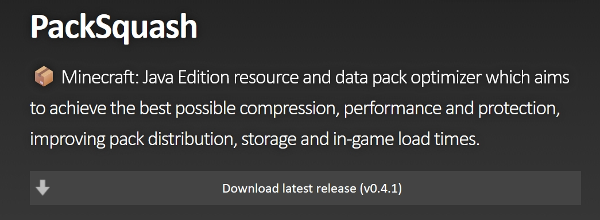
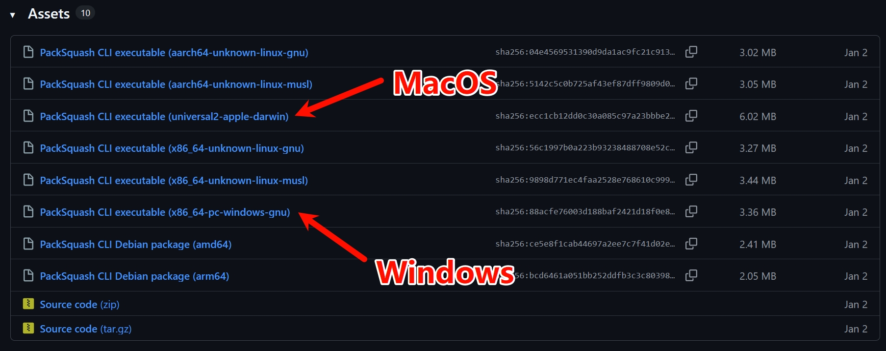
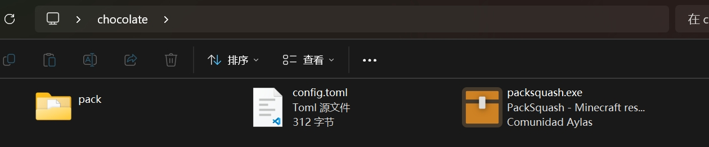
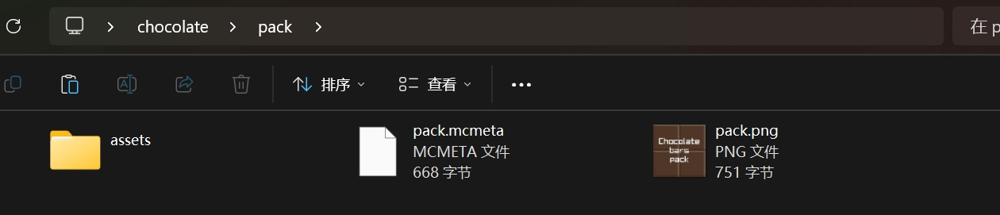
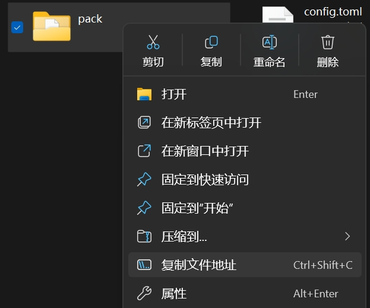

::: tip Translation notice
This page was translated with machine translation and may contain inaccuracies. If you can help improve it, please open an issue or submit a pull request.
:::


<FeatureHead
title='Use PackSquash to compress and obfuscate resource pack'
    authorName="bread"
/>

PackSquash is a resource pack compression and obfuscation tool that can help reduce the size of resource packs and easily obfuscate them.

The use of the tool is not complicated, but after all, it is a command tool. It is still a bit troublesome for those who are not familiar with it. This article will briefly introduce how to use it.

## download
Go to [Project Home Page](https://packsquash.aylas.org/)find button`Download latest release`, will be directed to the project's GitHub Release page, or directly through the project's [Release page](https://github.com/ComunidadAylas/PackSquash/releases) download



For Windows users, look for`windows`Options for words such as

For MacOS users, look for the`apple`，`darwin`or`macOS`Options for words such as

For Linux users, if you need teaching, please stop using Linux

The illustration shows the Release page of version 0.4.1. Different versions have different names.



Taking Windows as an example, decompress the downloaded compressed package and you should get a box icon named`packsquash.exe`executable file

## Prepare
Three documents need to be prepared:



- `packsquash.exe`:PackSquash executable file
- Resource pack directory: The decompressed resource pack is placed in a directory.`pack.mcmeta`It should be in the root directory of this directory
  -  
- Configuration file: a format of`toml`text file, the name is not limited, but here I named it`config.toml`

Theoretically they can be placed anywhere, but for convenience, they are placed in the same directory here

## Configuration
Open`config.toml`, enter the following:

```toml
pack_directory = '资源包目录的路径'
```


Will`资源包目录的路径`Replace with the actual path to your resource pack directory

As for how to obtain the resource pack path, a simpler solution is to right-click your directory and select`复制文件地址`


If it is another version of Windows, it may not be available.`复制文件地址`options, you can choose`属性`, found in the pop-up window`位置`, copy its contents

Note that the default copied path is wrapped in double quotes, and`toml`It is recommended to use single quotes to wrap the string, so you need to replace the double quotes with single quotes. It will look like this in the end (please replace the author's path with your own path):

```toml
pack_directory = 'C:\Users\bread\Desktop\chocolate\pack'
```


## run

Open the terminal in the working directory. Generally, you can right-click in a blank space of the working directory and select`在终端中打开`, if this option is not available, you can copy the path of the working directory, start the terminal separately, and enter`cd "路径"`Enter working directory

Enter the following command:

```sh
.\packsquash.exe .\config.toml
```


If you don’t understand the relationship between directories, you can also directly copy`packsquash.exe`path and`config.toml`path, enter the following command:

```sh
"packsquash.exe 的路径" "config.toml 的路径"
```


Press Enter to execute. If everything goes well, a file named`pack.zip`The compressed package, this is the compressed and obfuscated resource pack.

## More configuration parameters

The configuration file just mentioned is just the simplest configuration, using the default scheme. If you want to customize the effect, you can refer to [PackSquash's documentation](https://github.com/ComunidadAylas/PackSquash/wiki/Options-files) to modify the configuration file

If you are too lazy to bother, the author has written a set based on compression effects. Generally speaking, it is reliable. If there are problems with use, please check the documentation and modify it yourself.

```toml
pack_directory = 'C:\Users\bread\Desktop\chocolate\pack'

recompress_compressed_files = true
zip_compression_iterations = 255
zip_spec_conformance_level = 'disregard'
never_store_squash_times = true

['**/*?.png']
image_data_compression_iterations = 255
downsize_if_single_color = true
png_obfuscation = true
```


Features of several additional options:
- `recompress_compressed_files`:Recompress
- `zip_compression_iterations`: Number of compression iterations. The larger the value, the higher the compression rate, but also the slower it is. 0-255, default 20
- `zip_spec_conformance_level`: Special packaging scheme that does not comply with the standard zip specification. The default is 'pedantic' which complies with the specification. Although it can be read by the game if it does not comply with the specification, some distribution platforms may refuse to upload it.
- `never_store_squash_times`: Actually, I don’t understand it. I guess it has something to do with compression and reuse, but according to the documentation, turning it on will have no side effects.
- `image_data_compression_iterations`: Number of image data compression iterations, equivalent to image version`zip_compression_iterations`, 0-255, default 15
- `downsize_if_single_color`: If the picture has only one color, it will be directly converted into a solid color picture.
- `png_obfuscation`: PNG obfuscation, when turned on, PNG files will be obfuscated.

Take the author’s [Chocolate Texture Pack](https://modrinth.com/resourcepack/chocolate-bars-pack) 3.9 For example, the original package passes [PNGGauntlet](https://pnggauntlet.com/) Compression, packaging selection [7-Zip](https://www.7-zip.org/) of`Level 9`Compression, the final product is 1.8 MB; after using this configuration to compress, the product is 0.8 MB, the compression rate is very good

## Things to note

Obfuscation is not encryption. Although the obfuscated resource pack can no longer be opened directly through decompression tools, its content is essentially readable. Don't think that if it is obfuscated, there will be no piracy or secret sales.

What's more, even if it is encrypted, as long as the end user can decrypt it and use it, it is no different than not adding it.
