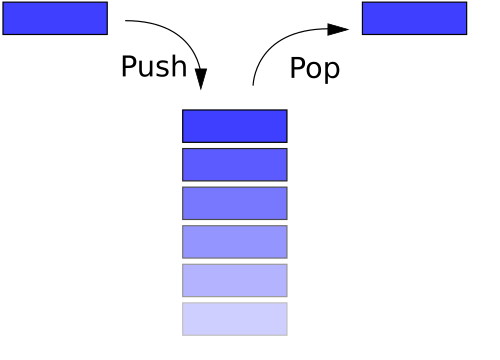

::: tip Translation notice
This page was translated with machine translation and may contain inaccuracies. If you can help improve it, please open an issue or submit a pull request.
:::


<FeatureHead
title='Command Storage Advanced: Use stack management function context'
authorName='Qibai'
:extraAuthors="['Xu Muxian']"
/>

## summary
This article discusses how to optimize the data management and logic design of Minecraft function (mcfunction, hereafter referred to as mcf) through the simulation stack structure. In view of the pain points of native mcf scope limitations, process data residue and inefficient cross-function communication, variable isolation and context transfer are achieved through manual management of the "push/pop" mechanism, and recursive calls and dynamic scope nesting are supported. This solution uses the command storage system (storage) to replace macro parsing, improves performance and reduces resource redundancy, provides clear scope control and maintainability for complex data pack development, especially in scenarios such as multi-layer nesting and algorithm implementation, significantly enhances logic clarity and execution efficiency, and provides a standardized development model for mcf.


## 1. Introduction

mcf does not have native scope management. Once a large number of variable operations are involved, it is often easy to have variables pile up. Secondly, since variables are usually global, loopholes such as timing issues or out-of-bounds access often occur when functions are executed. These situations usually introduce some unexpected bugs, which slow down development advancement and significantly reduce the development experience. In addition, where cross-functional information exchange is required, it becomes extremely difficult to write complex algorithms due to the lack of context. ~~So much so that the community often hears the joke (bushi) that developing data packs is like going to jail. ~~There is therefore an urgent need to introduce a new mechanism to solve the above problems to achieve cross-function context calls and variable isolation. The management solution based on the stack structure proposed in this article was born out of this.

<div style="text-align:center">
	


<p style="color: gray;">Figure 1: Current status of data pack development</p>
</div>


## 2. Theoretical background and tools

### 2.1 Stack

> From Wikipedia

**Stack** (stack), also known as **Stack** or **Stack**, is [Computer Science](https://zh.wikipedia.org/wiki/計算機科學) one of the [abstract data types](https://zh.wikipedia.org/wiki/抽象資料型別), operations of adding data (push) and removing data (pop) are only allowed at one end of the ordered linear data collection (called the top of the stack). Therefore, according to [last in, first out] (https://zh.wikipedia.org/wiki/後進先出演算法) (LIFO, Last In First Out) operates on the principle, and stacks commonly use one-dimensional [array](https://zh.wikipedia.org/wiki/陣列) or [link list](https://zh.wikipedia.org/wiki/連結串列) to achieve. Often associated with another ordered linear data collection [queue](https://zh.wikipedia.org/wiki/佇列) are compared with each other.

#### 2.1.1 Stack operations

There are two basic operations on the stack, called push and pop.

**Push:** Stack the stack frame to the top of the stack and update the top of the stack pointer to the new stack frame;

**Pop:** Remove the top frame from the stack and update the top pointer to the upper stack frame;

<div style="text-align:center">
	


<p style="color: gray;">Figure 2: Stack operation</p>
</div>

#### 2.1.2 List stack

The linear nature of the list structure is naturally suitable for building a stack structure. The orderliness and dynamic expandability of its elements provide an ideal basis for simulating the "last in, first out" principle of the stack. Each list element corresponds to a Stack Frame, and the top of the stack is always at the end of the list (indexed by`
- 1`location).

The following is a simple demonstration in Python:

```python
#定义一个空 list 当做栈
stack = []
stack.append(1)
stack.append(2)
stack.append("hello")
print(stack)
print("取一个元素：",stack.pop())
print("取一个元素：",stack.pop())
print("取一个元素：",stack.pop())
```


The output result is

```python
[1, 2, 'hello']
取一个元素： hello
取一个元素： 2
取一个元素： 1
```


### 2.2 command storage

> from mcwiki

Command storage is a convenient way to store data. Command and data pack can use [namespaceID](https://zh.minecraft.wiki/w/命名空间ID) saves data without requiring item, blockentity, or entity to save data indirectly.

Command storage uses NBT to store game data and supports multiple data types such as strings, lists, and dictionaries. Naturally adapts to the structural requirements of stack frames.

## 3. Implementation plan

Combining stack and command storage, developers can try`/data`Operate command storage to build a simple stack structure in mcf. In subsequent demonstrations, this article will use`example:0`This command is stored as a discussion object.

### 3.1 Build the stack in function

Combined with the nature of the stack structure, a list can be used to simulate it. Obviously you can use the append method to push a stack frame to the top of the stack, and because`stack`is a list, so you can use`stack[-1]`As a path to access the top of the stack, use`remove stack[-1]`You can pop the stack frame, making it easy to implement push and pop in stack operations:

```mcfunction
# stack.push()
data modify storage example:0 stack append value {}
# stack.pop()
data remove storage example:0 stack[-1]
```


> [!TIP]
>
> Since calling append when the path does not exist in storage will automatically create a new list and push elements in, there is no need to initialize the stack here.

### 3.2 Execution environment and return value

Now that there is an empty stack frame inside the function, you can try to write some data into it and use it as a parameter for the function logic call. Here is a simple`max`function as an example to discuss how to manage functions in mcf.

::: details Python
```python
'''
输出最大值
'''
def max(input):
    size  = len(input)
    if not size > 1:
        print('error：缺少输入数据！')
        return
    a = input[0]
    while True:
        size -= 1
        if size <= 0:
            return a
        b = input.pop(0)
        if a < b:
            a = b

input = [1, 1, 4, 5, 1, 4, 1, 9, 1, 9 ,8 ,1 ,0, 100, 450, 0, 332]
m = max(input = input)

print('input =', input )
print('m =', m)
```

:::

> [!WARNING]
>
> For ease of display, mcf here uses the form of inline function, and actual function writing requires cross-file access.

::: details mcfunction
```mcfunction
# ---------- #max(input : array) ----------
# stack.push()
data modify storage example:0 stack append value {}

# 读取形参
data modify storage example:0 stack[-1].CONTEXT.input set from storage example:0 stack[-2].CONTEXT.input

# 打擂
scoreboard players reset #size var
execute store result score #size var run data get storage example:0 stack[-1].CONTEXT.input
execute unless score #size var matches 1.. run return run function THIS.parent/errors/unknown_data:
	tellraw @s {"text": "error：缺少输入数据！"}
execute store result score #a var run data get storage example:0 stack[-1].CONTEXT.input[0]
execute store result storage example:0 return int 1 run function THIS.parent/_:
    scoreboard players remove #size var 1
    data remove storage example:0 stack[-1].CONTEXT.input[0]
    execute if score #size var matches ..0 run return run scoreboard players get #a var
	execute store result score #b var run data get storage example:0 stack[-1].CONTEXT.input[0]
	execute if score #a var < #b var run scoreboard players operation #a var = #b var
    function THIS

# stack.pop()
data remove storage example:0 stack[-1]
# ---------- #max(input : array) ----------#

# ---------- main ---------- #
# 调用 max 函数
# stack.push()
data modify storage example:0 stack append value {}

data modify storage example:0 stack[-1].CONTEXT merge value {"input": [1, 1, 4, 5, 1, 4, 1, 9, 1, 9 ,8 ,1 ,0, 100, 450, 0, 332]}
excute store result score #m var run function #max
# 格式化输出
tellraw @s {"translate": "input = %s", with: [{"type": "nbt", "storage": "example:0", nbt: "stack[-1].CONTEXT.input"}]}
tellraw @s {"translate": "m = %s", "with": [{"score": {"name": "#m", "objective": "var"}}]}

# stack.pop()
data remove storage example:0 stack[-1]
# ---------- main ---------- #
```

:::

above`max`The example of function successfully transplanted Python code logic into mcf. In the process of writing mcf, use stack to create a stack frame for each level of function to isolate the variable environment in which it is located.

exist`max`The function needs to input a name named`input`list parameters. Faced with this cross-function variable interaction scenario, the author recommends opening up a context variable space in the stack frame.`CONTEXT`, one is to improve readability, and the other is to use in multi-level nesting situations`data stack[-1] merge stack[-2]`Compared with the mixed transfer scope, the transfer method is clearer and the access is safer.

For function return value, vanilla`return`The return value provided by function is relatively simple. For complex structure returns, the author agrees to store them under command`return`within the key.

## 4. Conclusion

**Scope**

Create independent stack frames for each function and use them uniformly`stack[-1]`Accessing variables makes the variable pool managed by functions at each level clear and intuitive, which not only improves the readability of the function, but also prevents operations such as out-of-bounds access that can easily cause bugs.

**Execution Environment**

Declare a dictionary in each stack frame`CONTEXT`Used to store the custom context when a function is executed, thereby achieving controllable cross-function variable communication while limiting the scope of the variable. Compared with the function macro (macro) form, this contextual interaction mode is **non-traversal**`execute store`and`data`The impact on performance during operation is generally small.

**Data Redundancy**

Under the structure of the function stack that can be cleared as needed, it avoids the accumulation of a large amount of useless data in storage, improves access speed to a certain extent and makes the storage structure clearer.

## References

[1] [Purple sweet potato is so delicious. Python list implements stack and queue [EB/OL]. (2021-02-26)[2026-04-02].](https://blog.csdn.net/ftfy123/article/details/114121434)

[2] [Wikipedia. Stack[DB/OL]. (2025-06-19)[2026-04-02].](https://zh.wikipedia.org/wiki/堆栈)

[3] [Chinese Minecraft Wiki. command storage format [DB/OL]. (2026-03-24)[2026-04-02].](https://zh.minecraft.wiki/w/命令存储格式)

[4] [Nervonrnent. [Sleep aid for personal use] How to use Minecraft command to simulate the stack [Z/OL]. (2025-04-26)[2026-04-02].](https://b23.tv/VcRQyPc)

[5] [Chuang Xiaoye. I actually wrote the sorting algorithm using data pack? [Z/OL]. (2023-08-06)[2026-04-02].](https://b23.tv/zEkwyQ7)

[6] [Madara Awa. On the implementation and performance optimization of the Brainduck interpreter in the Minecraft environment [J/OL]. Feature, 2026, 2(2).](https://vanillalibrary.mcfpp.top/datapack-index/feature/archive/202602/6/content.html)

[7] [Leather Sword. Using data pack to make a compiler or interpreter: taking the C language subset C-Minus as an example [J/OL]. Feature, 2025, 1(11).](https://vanillalibrary.mcfpp.top/datapack-index/feature/archive/202511/1/content.html)

