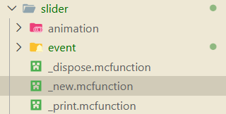

::: tip Translation notice
This page was translated with machine translation and may contain inaccuracies. If you can help improve it, please open an issue or submit a pull request.
:::

<FeatureHead
    title="Floating UI practice - custom controls"
    authorName="Alumopper"
    cover = '../../../../../feature/archive/202604/_assets/5.png'
/>

:::tip ？！FUI ！？
Floating UI is a ~~probably the most~~powerful heavyweight UI framework in vanilla, allowing you to define a complex and beautiful floating interactive UI in a simple NBT format.
:::

<RepoCard repo="Alumopper/Floating-UI"/>

## Effect preview

Let’s see what we’re going to do in this article! is a super cool (not, but at least it looks easy to use) slider control:

<div style="display: flex; justify-content: center;" >
<iframe src="//player.bilibili.com/player.html?isOutside=true&aid=116364119441510&bvid=BV1mHDiBrE18&cid=37319477305&p=1" scrolling="no" border="0" frameborder="no" framespacing="0" allowfullscreen="true" style="width: 80%; height: 300px"></iframe></div>

What needs to be done?

1. We need one element at each end to represent the two ends of the slider.
2. We need a long thing in the middle to represent the slider
3. We also need something movable to represent the slider
4. You may also need some tick marks on the slider to represent the values.
5. Finally, we need to listen to the user's mouse scroll input to change the position of the slider, and may also need to do some processing to align the slider with the scale.

## Define properties

First, we need to clarify what properties this control requires. Since it is a draggable slider, it needs to have a maximum value, a minimum value, and a current value, which are all integers. A step size is also needed, because we allow the user to control it with the mouse wheel, and scrolling once is a step size. In addition, a scale value is required to represent the scale. Another Boolean property indicates whether to display tick marks, and a Boolean property controls whether to align to the ticks. We also need a series of string properties that point to an item model in order to customize the appearance of the slider. Finally, we need an event for developers to listen for value changes.

To sum up, it goes something like this:

```js
min: 最小值 = 0
max: 最大值 = 100
step: 步长 = 1
tick: 刻度 = step
value: 当前值 = 0
tickVisible: 是否显示刻度 = false
snapToTicks: 是否自动调整到最近的刻度 = false
left_icon: 左侧图标 = "floating_ui:slider/left"
right_icon: 右侧图标 = "floating_ui:slider/right"
thumb_icon: 输入用的图标 = "floating_ui:slider/thumb"
bar_texture: 滑动条纹理 = "floating_ui:slider/bar"
tick_texture: 刻度材纹理 = "floating_ui:slider/tick"
left_padding: 左侧图标和滑动条最左端之间的距离（倍率10000） = 0
我们定义这个变量，用来适配不同大小的图标，因为我们不能自动获取图标的实际大小
right_padding: 右侧图标和滑动条最右端之间的距离（倍率10000） = 0
value_change: 数值改变时的回调函数 = null
```


For integer attributes, we need to create a new corresponding scoreboard. The value of the item display entity corresponding to each UI control on this scoreboard is its attribute value. For other types, we will store it in the NBT of the entity displayed by this item.

I have drawn some icons and set up models in advance. If the user does not pass in these properties, the icons and models I drew will be used by default.

:::details scoreboard definition
```mcfunction
# slider最小值
scoreboard objectives add floating_ui.slider.min dummy
# slider最大值
scoreboard objectives add floating_ui.slider.max dummy
# slider长度
scoreboard objectives add floating_ui.slider.length dummy
# slider最大值和刻度之间的差距
scoreboard objectives add floating_ui.slider.max_tick_gap dummy
# slider步长
scoreboard objectives add floating_ui.slider.step dummy
# slider刻度
scoreboard objectives add floating_ui.slider.tick dummy
# slider当前值
scoreboard objectives add floating_ui.slider.value dummy
# slider当前值
scoreboard objectives add floating_ui.slider.shadow_value dummy
# slider是否自动调整到最近的刻度
scoreboard objectives add floating_ui.slider.snapToTicks dummy
# slider是否显示刻度
scoreboard objectives add floating_ui.slider.tickVisible dummy
# slider左侧图标
scoreboard objectives add floating_ui.slider.left_padding dummy
# slider右侧图标
scoreboard objectives add floating_ui.slider.right_padding dummy
```

:::

## File structure

When we need to define a new control, we need to`floating_ui:element/&lt;控件名>`Create a series of files in the directory. For this slider control, we need to first create these files and folders:



`animation`folder for animation definitions of controls,`event`Used for event handling.`_dispose`function is used to define the behavior when the control is destroyed.`_new`function defines how the control is created,`_print`It is a debugging function and we will not introduce it here.

## Control creation

### property

let us look towards`_new`function！

All controls inherit`control`control, which means our`_new`function needs to call the parent control`_new`function. In addition, we also need to handle the control's own properties, which are not handled by the parent control's functions. exist`_new`function, we can pass`storage floating_ui:input temp`Access the property value passed in when creating the control. For example, we use the following code to determine whether the user has passed in`min`attribute and assign it to the scoreboard:

```mcfunction
execute unless data storage floating_ui:input temp.min run data modify storage floating_ui:input temp.min set value 0
execute store result score @s floating_ui.slider.min run data get storage floating_ui:input temp.min
```


The same is true for other attributes.

### child control

Next comes the more complicated part. Our control is composed of multiple sub-elements, including icons at the left and right ends, a slider in the middle, a slider, and possible tick marks. We regard these child elements as child controls of this slider, in`_new`function to create them. If all are written in`_new`, the code would be quite lengthy (although not shorter now), so we will create a new function`set_content`to specifically handle the creation of child controls.

In FUI, it is also very simple to create sub-controls for a control. Just need to`floating_ui:input temp`Modify the content in to the layout data of the subspace we need to generate, and then call`function floating_ui:_new_control`Just generate this child control. No, I seem to have made it too simple (

The code actually looks like this:

```mcfunction
# 生成一个物品展示实体。它的朝向和位置都和当前UI一致
# 这都是模板代码，就算你看不懂也可以直接复制
data modify storage floating_ui:input summon.arg.type set value "item_display"
function floating_ui:macro/summon_with_rot with storage floating_ui:input summon.arg
# 生成一个新的控件，类型为sprite，大小为[0,0]，指定tag
data modify storage floating_ui:input temp set value {type: "sprite", size: [0,0], tag:"floating_ui_slider_left_icon"}
# 以刚刚生成的物品展示实体为执行者，调用控件的生成函数
execute as @n[tag=just,distance=..1] run function floating_ui:_new_control
data modify entity 1bf52-0-0-0-2 Thrower set from entity @s UUID
```


Here, I need to explain how the relationship between child controls and parent controls is bound.

A control pointer will be stored in 1bf52-0-0-0-2worldentity. Generally speaking, after we call the _new function of the control, the UUID of the control will be stored in the itemity, and we can access the control through on origin. When we generate child controls,`control/_new`The execution has been completed, so 1bf52-0-0-0-2 will point to the current control, that is, to the parent control of the child control. When the child control is generated, it will also be called`control/_new`, in this function, the control being generated will be ridden to the entity pointed to by 1bf52-0-0-0-2, which is the parent control. In this way, we can establish the relationship between parent and child controls through riding.

This is why, in the last line, we need to reset the Thrower of 1bf52-0-0-0-2. Because when generating a child control, the Thrower of 1bf52-0-0-0-2 will be modified to the UUID of the child control, so when the next child control is generated, the previous child control will actually be recognized as the parent control! This is not good, our UI tree will be messed up, so we need to reset the Thrower of 1bf52-0-0-0-2 to the UUID of the current control every time after generating the child control.

Okay meow! Now that we know how to create a sub-control, there is still a question, where should this sub-control be located?

For the icon on the left, we want it to be on the left side of the entire control area and aligned with the left edge; for the icon on the right, we want it to be on the right side of the entire control area and aligned with the right edge. The slider only needs to be in the center of the entire control and range from the right edge of the left icon to the left edge of the right icon (of course we don't know the specific size of the icon, which is why we need`right_padding`and`left_padding`). The x of the slider needs to be dynamically calculated based on the positions of the left and right icons. As for size, all heights are consistent with the height of the control. For the sake of simplicity, the width of the slider and the width and height of the icons on the left and right sides are the same, that is, they are all square (of course, we are just saying here that their textures remain square, and the texture may be a rectangular or triangular pattern).

Taking the icon on the left as an example, let’s see how this icon is actually created.

```mcfunction
scoreboard players add @s floating_ui.child_z 10

# 生成左侧图标
data modify storage floating_ui:input summon.arg.type set value "item_display"
function floating_ui:macro/summon_with_rot with storage floating_ui:input summon.arg

data modify storage floating_ui:input temp set value {type: "sprite", size: [0,0], tag:"floating_ui_slider_left_icon"}
# 你当然可以分多次修改temp来设置更多的属性喵
data modify storage floating_ui:input temp.model set from entity @s item.components."minecraft:custom_data".data.left_icon、

# 计算宽度和高度
# 图标的高度，宽度均和slider的高度相同
data modify storage floating_ui:input temp.size[] set from entity @s item.components."minecraft:custom_data".data.size[1]
# 图标的左端位置和slider的左端对齐
# 认为图标的默认大小总是16px，也就是1
# 通过floating_ui.size0_without_scale访问到当前控件的大小（size0就是宽度）
# 这些计分板的数值为了保持小数精度，都是放大了10000倍的整数（定点数）
scoreboard players operation x floating_ui.temp = @s floating_ui.size0_without_scale
scoreboard players operation x floating_ui.temp /= 2 int
scoreboard players operation x floating_ui.temp *= -1 int
execute store result storage floating_ui:input temp.x float 0.0001 run scoreboard players add x floating_ui.temp 5000
execute store result storage floating_ui:input temp.z float 0.0001 run scoreboard players get @s floating_ui.child_z
execute as @n[tag=just,distance=..1] run function floating_ui:_new_control
scoreboard players add @s floating_ui.child_z 10
data modify entity 1bf52-0-0-0-2 Thrower set from entity @s UUID
```


You may notice a detail in the code, which is`scoreboard players add @s floating_ui.child_z 10`。`x`and`y`It means up, down, left and right,`z`What it means is the order of sub-controls. If the child control's`z`They are all the same, they will overlap, and Z-fighting may even occur (that is, when two faces overlap, the game does not know which one to display, and it will flicker). Therefore, every time we generate a sub-control, we need to`z`Add a little more so they don't overlap.

The same is true for several other controls. You can check the source code of FUI for details.

Next is the more troublesome thing, which is the slider. The slider is a dynamically moving control, so we cannot write it directly in the layout element`x`property. After being generated, its`transformation`It is relative to the UI root entity, so it seems to be a little troublesome. But it’s okay, FUI has taken care of it for us. We just need to call`_set_offset`function, input xyz, FUI will automatically handle relative coordinate, scaling and other issues. Therefore, we would write:

```mcfunction

# 生成thumb图标
data modify storage floating_ui:input summon.arg.type set value "item_display"
function floating_ui:macro/summon_with_rot with storage floating_ui:input summon.arg
data modify storage floating_ui:input temp set value {type: "sprite", size: [0,0], tag:"floating_ui_slider_thumb_icon"}
data modify storage floating_ui:input temp.model set from entity @s item.components."minecraft:custom_data".data.thumb_icon
# 计算宽度和高度
# 图标的高度和宽度和slider的高度相同
data modify storage floating_ui:input temp.size[] set from entity @s item.components."minecraft:custom_data".data.size[1]
execute store result storage floating_ui:input temp.z float 0.0001 run scoreboard players get @s floating_ui.child_z
execute as @n[tag=just,distance=..1] run function floating_ui:_new_control
scoreboard players remove @s floating_ui.child_z 20
# 根据value更新thumb的位置
function floating_ui:element/slider/update_thumb
```


Because the logic of updating the slider position is not only in the generation, every time the user changes the value, the slider position needs to be updated, so we write it as a separate function`update_thumb`, just call it whenever you need to update the slider position.

With the functions provided by FUI, the update logic is not complicated. Calculate the current value as a percentage of the entire slider range, and then multiply it by the length of the slider to get the offset of the slider relative to the start point of the slider. last call`_set_offset`Just function to set this offset.

```mcfunction
data modify storage floating_ui:input temp set value {x:0.0f}

scoreboard players operation percent floating_ui.temp = @s floating_ui.slider.value
scoreboard players operation percent floating_ui.temp *= 10000 int
scoreboard players operation percent floating_ui.temp /= @s floating_ui.slider.length
scoreboard players operation percent floating_ui.temp -= 5000 int
scoreboard players operation percent floating_ui.temp *= @s floating_ui.size0_without_scale
execute store result storage floating_ui:input temp.x float 0.0001 run scoreboard players operation percent floating_ui.temp /= 10000 int

# 注意我们这里使用on passengers找到滑块控件，因为当前执行者仍然是slider控件
execute on passengers if entity @s[tag=floating_ui_slider_thumb_icon] run function floating_ui:element/control/_set_offset
```


The logic of scales is similar, but although the positions of scales are also calculated based on values, their number and position are fixed. At the same time, we need a loop logic to calculate how many ticks need to be generated and their positions based on the maximum and minimum values ​​and tick intervals. Therefore, we need to create a new function`create_tick`, in which this loop is processed.

```mcfunction
scoreboard players operation curr_value floating_ui.temp += @s floating_ui.slider.tick
execute if score curr_value floating_ui.temp > @s floating_ui.slider.max run return 0

# 生成刻度

data modify entity 1bf52-0-0-0-2 Thrower set from entity @s UUID
data modify storage floating_ui:input summon.arg.type set value "item_display"
function floating_ui:macro/summon_with_rot with storage floating_ui:input summon.arg
data modify storage floating_ui:input temp set value {type: "sprite", size: [0,0], tag:"floating_ui_slider_tick_icon"}
data modify storage floating_ui:input temp.model set from entity @s item.components."minecraft:custom_data".data.tick_texture
# 计算宽度和高度
# 图标的高度和宽度和slider的高度相同
data modify storage floating_ui:input temp.size[] set from entity @s item.components."minecraft:custom_data".data.size[1]
execute store result storage floating_ui:input temp.z float 0.0001 run scoreboard players get @s floating_ui.child_z
execute as @n[tag=just,distance=..1] run function floating_ui:_new_control

data modify storage floating_ui:input temp set value {x: 0.0f}


scoreboard players operation percent floating_ui.temp = curr_value floating_ui.temp
scoreboard players operation percent floating_ui.temp *= 10000 int
scoreboard players operation percent floating_ui.temp /= @s floating_ui.slider.length
scoreboard players operation percent floating_ui.temp -= 5000 int
scoreboard players operation percent floating_ui.temp *= @s floating_ui.size0_without_scale
execute store result storage floating_ui:input temp.x float 0.0001 run scoreboard players operation percent floating_ui.temp /= 10000 int

execute as 1bf52-0-0-0-2 on origin run function floating_ui:element/control/_set_offset

function floating_ui:element/slider/create_tick
```


With the previous foreshadowing, this logic should not be very complicated, so I won’t go into details.

Finally, in`floating_ui:load`Register the id of this control in function:

```mcfunction
#region 控件注册
data modify storage floating_ui:data std set value {\
    "button":0b,\
    "list":0b, \
    "panel":0b, \
    "textblock":0b, \
    "stackpanel": 0b,\
    "numberbox": 0b,\
    "sprite": 0b,\
    "slider": 0b,\  #[!code ++]
}

```


So now, our control can be rendered normally. Write a simple test layout:

```mcfunction
data modify storage floating_ui:input data set value {\
    "type": "panel",\
    "size":[5f,5f],\
    "child": [\
        {\
            "type": "slider",\
            "size": [3.0f,1.0f],\
            "value": 1,\
            "max": 9,\
            "min": 0,\
            "tickVisible": true,\
        }\
    ]\
}
```


and then call`floating_ui:.player_new_ui`function, you can see the effect w.

## Monitor input

We will control the`event`Event handling functions are defined in the folder. To avoid trouble, FUI provides a template that is placed in`element/custom_control_template`, we put its`event`Just copy the folder and it will be fine.

For this slider control, we need to monitor two inputs - one is the user's wheel input, that is`roll`event, corresponding`roll_event`function; the other is the user's click input, that is`click`event, corresponding`click_event`function。

### wheel event

:::tip
In the scroll wheel event, we can pass the variable`score slot floating_ui.temp`Gets how many shortcut bars the player's mouse wheel has rolled over in this event. If the player mouse wheel scrolls down, this value is positive; if it scrolls up, this value is negative.
:::

Remember we previously defined a property called`snapToTicks`? when it is`true`When , it means that the slider is always aligned with the scale, so when inputting with the mouse wheel, you only need to change the current value by a distance of one scale; otherwise, we let the value change by a distance in steps. So we can quickly write this logic——

But wait! Consider a special case, for example, when the range of the slider is not an integer multiple of the scale, when we scroll the slider from left to right, since our value must be an integer multiple of the step size, this means that our last scroll will exceed the maximum value. You may say, well, when we detect that it exceeds the maximum value, wouldn't it be better to clamp it at the maximum value? But if we do this, when the slider reaches the maximum value and scrolls to the left again, the value will become a value that is not aligned with the scale, which is very embarrassing.

So, adopting a clever bit of logic, we use a`shadow_value`To record the value of the current value before it is aligned to the scale. When the user scrolls to the right, we first let`shadow_value`Add one step to the distance and then align it to the scale as the final`value`. And when we scroll to the left again, we directly let`shadow_value`Decrease the distance by one step instead of starting from`value`Reduce the distance by one step.

So, in the end, our logic is this:

```mcfunction
#update the value
#如果snapToTicks为true，则按照刻度调整，否则按照步长
execute if score @s floating_ui.slider.snapToTicks matches 1 run scoreboard players operation delta floating_ui.temp = @s floating_ui.slider.tick
execute if score @s floating_ui.slider.snapToTicks matches 0 run scoreboard players operation delta floating_ui.temp = @s floating_ui.slider.step
scoreboard players operation change floating_ui.temp = delta floating_ui.temp
scoreboard players operation change floating_ui.temp *= slot floating_ui.temp
execute if score change floating_ui.temp matches ..0 if score @s floating_ui.slider.value = @s floating_ui.slider.max run scoreboard players operation @s floating_ui.slider.value = @s floating_ui.slider.shadow_value
execute if score change floating_ui.temp matches 1.. run scoreboard players operation @s floating_ui.slider.shadow_value = @s floating_ui.slider.value
scoreboard players operation @s floating_ui.slider.value += change floating_ui.temp
# 钳制
execute if score @s floating_ui.slider.value < @s floating_ui.slider.min run scoreboard players operation @s floating_ui.slider.value = @s floating_ui.slider.min
execute if score @s floating_ui.slider.value > @s floating_ui.slider.max run scoreboard players operation @s floating_ui.slider.shadow_value += delta floating_ui.temp
execute if score @s floating_ui.slider.value > @s floating_ui.slider.max run scoreboard players operation @s floating_ui.slider.value = @s floating_ui.slider.max
function floating_ui:element/slider/update_thumb
```


### click event

:::tip
In the click event, we can pass`score this.u/this.v floating_ui.temp`To get the relative position of the click position in the current control, the unit is the block length, and the origin is at the upper left corner of the control.
:::

In the click event, we need to obtain the xcoordinate of the user's click, and calculate the value corresponding to the location where the user clicked. This logic is actually very simple to implement. First, considering that the control may be scaled, we need to convert this coordinate to the unscaled coordinate:

```mcfunction
scoreboard players operation x floating_ui.temp = this.u floating_ui.temp
scoreboard players operation x floating_ui.temp *= @s floating_ui.scale
scoreboard players operation x floating_ui.temp /= 100 int
```


Then, we need to handle what happens when the user clicks on the icons at the left and right ends of the slider. In this case, the value should be set to the maximum or minimum value:

```mcfunction
# 最小值
execute if score x floating_ui.temp <= @s floating_ui.slider.left_padding run return run scoreboard players operation @s floating_ui.slider.value = @s floating_ui.slider.min
# 最大值
scoreboard players operation to_right floating_ui.temp = @s floating_ui.size0_without_scale
scoreboard players operation to_right floating_ui.temp -= x floating_ui.temp
execute if score to_right floating_ui.temp <= @s floating_ui.slider.right_padding run return run scoreboard players operation to_right floating_ui.temp *= @s floating_ui.slider.max
```


Then, calculate the distance from the click point to the left side of the slider as a percentage of the entire length of the slider, and multiply it by the range to get the value corresponding to the click position:

```mcfunction
# 在中间，计算
scoreboard players operation bar_length floating_ui.temp = @s floating_ui.size0_without_scale
scoreboard players operation bar_length floating_ui.temp -= @s floating_ui.slider.left_padding
scoreboard players operation bar_length floating_ui.temp -= @s floating_ui.slider.right_padding
scoreboard players operation x floating_ui.temp *= 10000 int
scoreboard players operation x floating_ui.temp /= bar_length floating_ui.temp
scoreboard players operation x floating_ui.temp *= @s floating_ui.slider.length
scoreboard players operation x floating_ui.temp += 5000 int
scoreboard players operation x floating_ui.temp /= 10000 int
scoreboard players operation x floating_ui.temp += @s floating_ui.slider.min
scoreboard players operation @s floating_ui.slider.value = x floating_ui.temp
```


Finally, we align this value to the scale using simple rounding:

```mcfunction
# 对齐到刻度
# 步长只对滚动事件生效，点击事件不受步长限制
execute if score @s floating_ui.slider.snapToTicks matches 0 run return 0
scoreboard players operation to_tick floating_ui.temp = @s floating_ui.slider.value
scoreboard players operation to_tick floating_ui.temp -= @s floating_ui.slider.min
# 四舍五入
scoreboard players operation to_tick floating_ui.temp += 5000 int
scoreboard players operation to_tick floating_ui.temp /= @s floating_ui.slider.tick
scoreboard players operation to_tick floating_ui.temp *= @s floating_ui.slider.tick
scoreboard players operation to_tick floating_ui.temp += @s floating_ui.slider.min
scoreboard players operation @s floating_ui.slider.value = to_tick floating_ui.temp
```


In this way, we successfully updated the slider value based on the user's input. Don't forget to update the slider's position!

```mcfunction
# 更新
function floating_ui:element/slider/update_thumb
```


## trigger event

As a control that can obtain user input, developers definitely want to monitor user input through an event-like method instead of detecting value changes every tick. In FUI, it is very simple to customize an event.

Remember a property we defined before?

```js
value_change: 数值改变时的回调函数 = null
```


exist`_new`function, it is stored as a string attribute in the NBT of the item display entity of the control. This event should be triggered when the value is changed, that is, when the user clicks or scrolls the mouse wheel.

:::warning Notice
We have not judged whether the values ​​before and after modification have actually changed. That is to say, even if the user scroll wheel inputs a value, but because it is clamped, the final value has not changed, and this event will be triggered. If you don't want this behavior, you can determine whether the current value is the same as the previous value in the event function, and return directly if they are the same.
:::

`value_change`It is the namespaceID of a function, so we have to call the corresponding function through a macro. In FUI, you should write the calling procedure like this:

```mcfunction
# 触发事件
data modify storage floating_ui:temp arg.function set from entity @s item.components.minecraft:custom_data.data.value_change
function floating_ui:util/function
```


Add this code to your`click_event`and`roll_event`function, this event can be triggered w

## Summarize

Although it is said to be a tutorial, it is actually a personal summary of my development process (?

Because although FUI is already a mature framework, due to performance requirements and flexibility, there are some unpleasant little details in the possible design of FUI. This article also helps developers using FUI avoid some possible problems.

Due to space limitations, there are still many things that have not been introduced in this article, such as the animation mechanism. I will write a more usage-oriented article later on how to use the existing controls of FUI to create a beautiful form. Please look forward to it~
