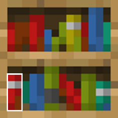

<script setup>
import { useData } from 'vitepress'
import ColorLine from '/.vitepress/vue/ColorLine.vue'
const { isDark } = useData()
</script>

# Second cover
<ColorLine :height="4"/>

## What's New in the Library?
- [**Tools that use AI to generate instructions**](https://wowomc.com/tools/ai-commander)
- [MCvanilla Video Player](https://github.com/WindWavesSea/Minecraft-Vanilla-Video-Player)

<ColorLine :height="2"/>

## command flashlight Command Flashlight

### Detect whether a specific coordinate is powered by redstone within the context

Places a funnel at the specified location, checks its enabledblock status, and then clears it. This state will be set within the context.

## I ask you to answer Quizs

:::warning This column is not a "you ask and I answer"!
In this column, we will ask several questions, and readers can give their own answers in the comment area (indicate the question number).  
The answer will be announced in the next issue of Feature.  

The questioner of this issue: Xu Muxian
:::

:::tip
The questions in this issue are based on`26.1`version.
:::

---

1. Command question: Output the chat text to all players who own dogs: "[Tip] You can judge the health of a dog by the angle of its tail."

---

2. Fill in the blanks: During the process of making the map, you need to design a bookshelf trigger event. Click the white box position as shown in the picture to trigger the mechanism. The mechanism is an interactive entity, and its size completely fits the pixels of the texture book on the bookshelf. What should the value of the interactive entity data height field be written as?



---

3. Analysis question: Custom world generation is a module that is prone to errors. Without using any external plug-ins or Mods,
A "safe mode" error occurred in an archive that used a custom world generation, causing the player to be unable to enter the archive.
Check the game log and get the following part:

``` 
[16:15:18] [Render thread/ERROR]: Registry loading errors: 
> Errors in registry minecraft:worldgen/biome: 
>> Errors in element backrooms:level0_normal: 
java.lang.IllegalStateException: Failed to parse backrooms:worldgen/biome/l
evel0_normal.json from pack file/Tape of M.E.G.CN 
...
at net.minecraft.client.main.Main.main(SourceFile:276) 
Caused by: java.lang.IllegalStateException: Failed to get element ResourceKe
y[minecraft:sound_event / backrooms:ambient.level0] 
...
```
Try to analyze the cause of the "Safe Mode" error.


---

4. Comprehensive question: "Color Blind Party" is a common server mini-game: there will be blocks of different colors on a platform, and blocks of one color will be given in each round. When the countdown ends, the blocks that are not of that color will disappear, and the player on it will fall into the void. If the game platform is located in$(0,0,0)$and$(31,0,31)$During the period, concrete colors of brown, red, orange, yellow, yellow-green, green, cyan, light blue, blue, purple, magenta, and pink will appear on the platform. If the blocks that are not red concrete will disappear in a round of the game, try to achieve this effect.


<ClientOnly>
  <GiscusComment
    repo="CR-019/datapack-index"
    repoId="R_kgDONRhuqw"
    category="Chats"
    categoryId="DIC_kwDONRhuq84CkchW"
    mapping="number"
    term="64"
    :strict="false"
    :reactionsEnabled="true"
    emitMetadata="0"
    inputPosition="top"
    :theme="isDark ? 'dark' : 'light'"
    lang="zh-CN"
    loading="lazy"
    class="giscus-wrapper"
  />
</ClientOnly>