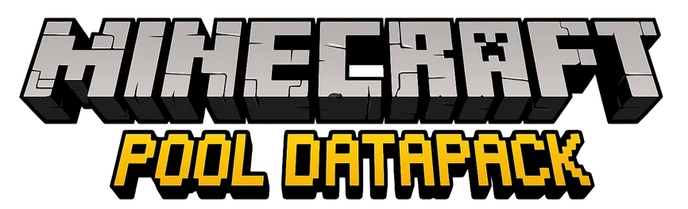
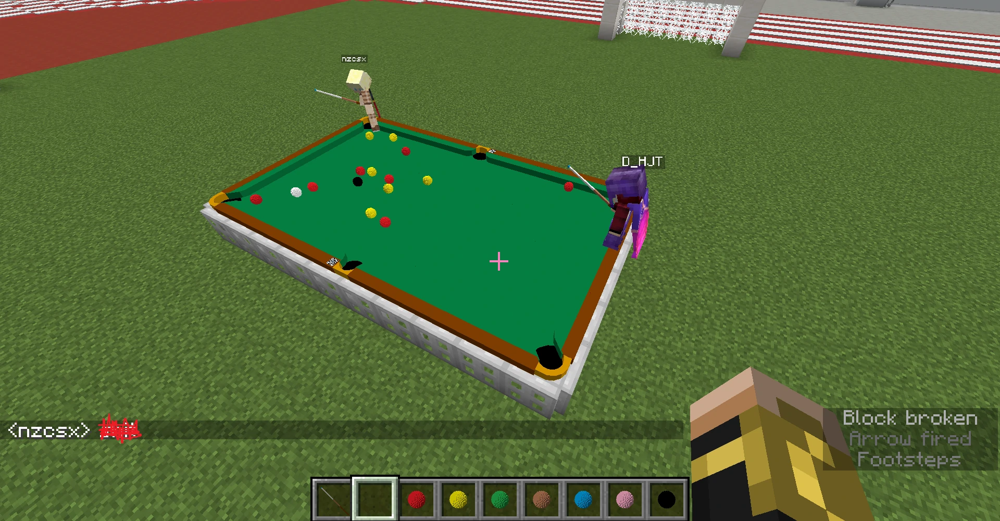
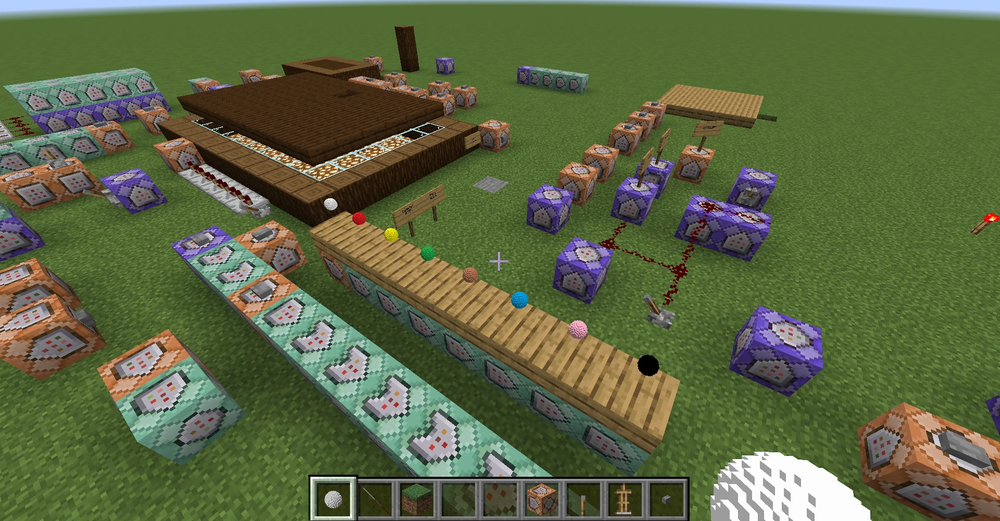
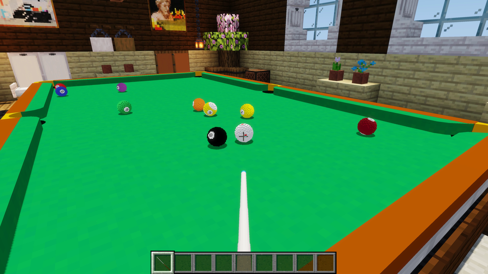
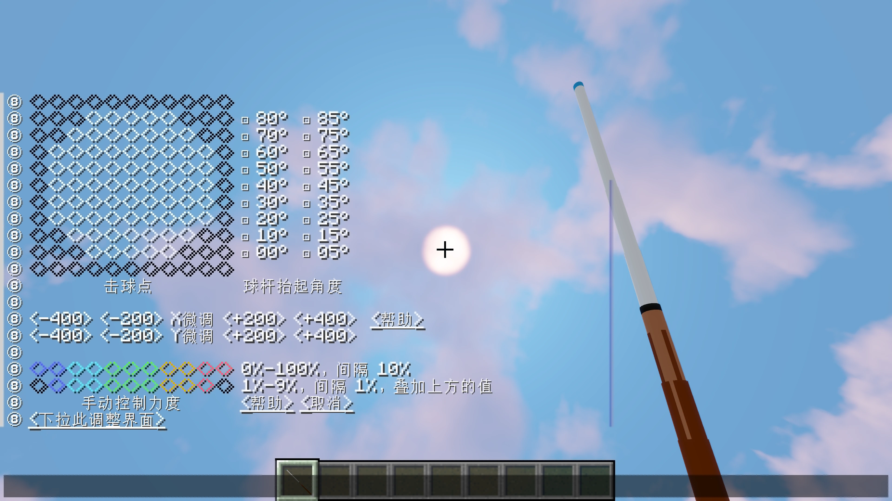
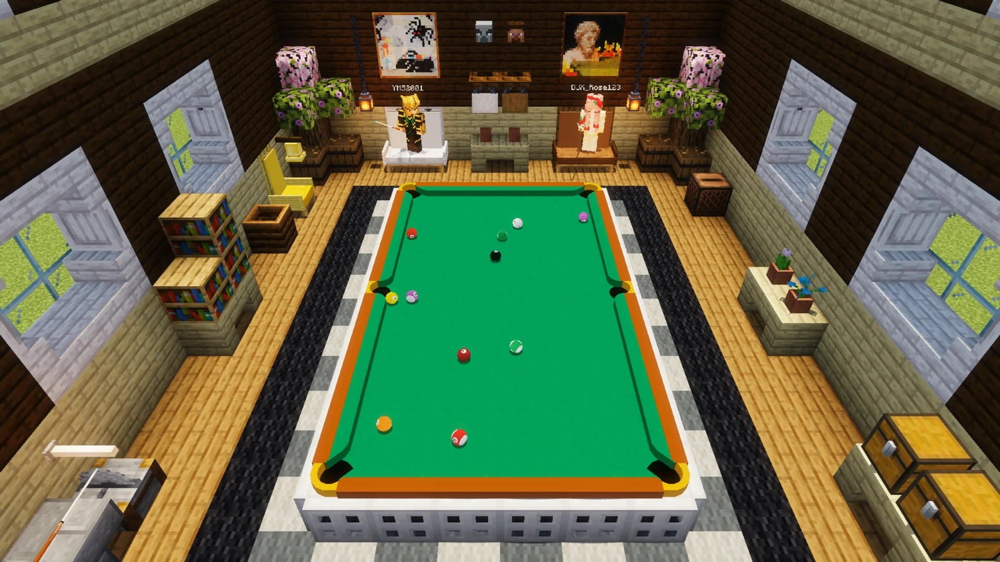
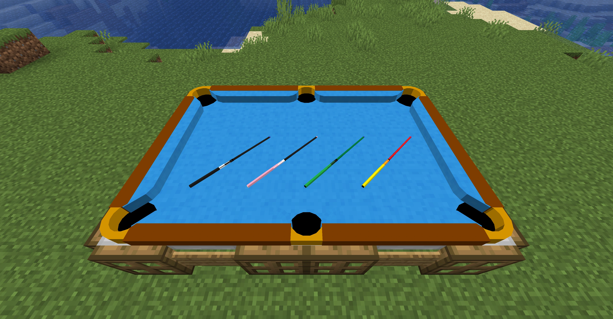

::: tip Translation notice
This page was translated with machine translation and may contain inaccuracies. If you can help improve it, please open an issue or submit a pull request.
:::

<FeaturedHead
    title="Implement a real and fun billiards game in vanilla Minecraft"
    authorName="YMS2001"
    cover = '../../../../../feature/archive/202605/_assets/0_cover.webp'
/>

This is a vanilla billiards data pack for **Minecraft Java Edition**. It supports snooker, eight-ball, nine-ball and custom practice modes. It also supports single-player games and double-player battles. The goal of the project is to realize a real billiards game with physical simulation, rule determination, batting method control and online game experience through data pack, resource pack and vanilla command system without using Mods. The data pack supports all versions since 1.16 and provides bilingual support in Chinese and English.

  

   

> Project homepage: [GitHub Page](https://github.com/MingshiYangUIUC/Pool-Minecraft-Squid-Workshop-Project)
> Official version promotional video: [Bilibili](https://www.bilibili.com/video/BV1md9TBiEGu)

---

### Billiards in blockworld?

My initial demand was actually very simple: I wanted to use Minecraft to play billiards by myself when I couldn't go out, and I also wanted to connect with friends in the server and beat them. But none of us play mods, and we hope that this project can follow the game version updates for a long time, so I chose a **vanilla** route from the beginning. In addition, I am not sure where the limits of Minecraft and I are: Can we really achieve this goal by relying only on the commands and resource packs that come with the game?

Making **Billiard Balls** in Minecraft may not sound unusual. Many players have tried to simulate billiards using colorful blocks, boats, chickens, or in the new version, sulfur slimes. Entities are attacked, pushed, collided, and bounced away. If you just want to make a short video that "looks like", this kind of intuitive and interesting gameplay is very popular. But the ship has its own collision logic, the mob will be affected by the game mechanism, and the block cannot show the natural rolling effect. If you want to play a **realistic* game of pool, the problem becomes completely different.

  

   
<em>Figure 2: An early two-person English eight-ball game. Initially the ball model does not rotate, so there are only solid colored billiard balls. </em>

---

### A vanilla physics system starting from low-level modeling

In Minecraft, a spherical model is made to move in a straight line, collide with each other, have its speed attenuated, and bounce when it hits the boundary. In recent years, many related demonstrations and tutorials can be found online. But from the beginning, what I wanted to do was not just a demonstration of "balls moving", but a game as close to real billiards as possible. Real-life billiard balls include friction, rotation, collision, movement, and even the subtle "ball spitting" effect near the mouth of the bag.

  

   
<em>Figure 3: Test site when developing with 1.16. Physics, display and rule systems all require repeated debugging in a vanilla environment. </em>

Therefore, this project started from a basic physical model of momentum and energy conservation, and used operations such as addition, subtraction, multiplication, and division in the Minecraft scoreboard to simulate various physical effects of billiard balls. Behind every shot, collision, or pocket the player sees is a large number of instructions tracking the position of each ball, calculating their speed, spin, and various interactions. The visual effects have also been updated along with the physics system. The early display method (such as Figure 2) was relatively basic. Later, the armor stand posture and rendering entity conversion data for efficient calculation of the scoreboard were added to more realistically present the rotation effect and support balls with numbers.

In order to bring the simulation in Minecraft closer to real billiards, the project did not settle for ordinary elastic collision models. For example, when kicking off the ball, the ball pile will be squeezed in a very short time and cause continuous force transmission. This process is difficult to express naturally by relying on simple collision formulas, and microsecond-level force transmission is almost impossible to calculate step by step at a reasonable speed in Minecraft. Therefore, the system has added AI kick-off simulation: a lightweight neural network is trained through offline high-precision physical simulation data, and then the model calculation is converted into Minecraft scoreboard logic to instantly predict the result of the moment when the ball pile is exploded. So, in vanilla Minecraft, you can really clear the table with one shot just like in reality.

  

   
<em>Figure 4: First-person batting perspective in nine-ball mode. </em>

---

### From simulation effects to actual games

When hitting the ball, the player can control the intensity, and can also adjust the cue ball hitting point and the shaft angle to achieve effects such as high shot, low shot, plugging, and tying. In order to verify the physical performance, I also used it to reproduce famous scenes in real golf games and conduct some physical experiment simulations, such as comparing the separation angle and ball path changes in real experiments, as well as the difference in low-shot effects under different table frictions. Experimental results show that the data pack performance is quite close to that of real billiards.

  

   
<em>Figure 5: The adjustment interface for the cue ball hitting point (plugging), cue lift angle (sticking) and stroke strength. </em>

On the basis of the physical system, continue to add processes such as ball placement, rules, and scoring, and this data pack becomes a collection of playable billiards mini-games. Players can practice alone or play against each other online; they can experience 8-ball, 9-ball, and snooker modes; they can also freely swing the ball, study stick techniques, and move in the practice mode. Among them, the snooker mode can already be used to demonstrate the continuous attack process of a single shot of 147 (see the link at the end of the article for details).

  

   
<em>Figure 6: Later scene of a two-person Chinese eight-ball match. </em>

---

### Features that are still being expanded

This project has achieved a relatively complete set of vanilla billiards games, but it is far from the end. The recent version update continues to add more customization content, such as customized table side styles, club models, tablecloth textures and more flexible rule settings. In the future, we will continue to expand to more ways to play, such as better survival/adventure mode compatibility, more types of games, and even player versus computer mode.

  

   
<em>Figure 7: The appearance of the customized table and cues in the new version. </em>

---

### postscript

The world of Minecraft is composed of blocks, and there is no real circle, but billiard balls should be exactly round. Because of this, implementing a billiard ball that looks, moves, and plays like it in vanilla Minecraft is an interesting challenge in itself.

From the initial elastic collision to a complete system that simulates physics, reproduces the game, and supports online battles, this project has always revolved around a simple idea:

**_Enables players to play a decent round of billiards in vanilla Minecraft. _**

---

### More links

- [Snooker 147 Video](https://www.bilibili.com/video/BV1u7VdzxEpS)
- [GitHub Page](https://github.com/MingshiYangUIUC/Pool-Minecraft-Squid-Workshop-Project): Project homepage and complete open source code
- [Modrinth page](https://modrinth.com/datapack/pool-and-billiards): Recommended download channels, which can automatically install dependent components
- [CurseForge page](https://www.curseforge.com/minecraft/data-packs/pool-and-billiards): Alternate download channel
