<FeatureHead
    title="Miscellaneous Talk - Application and Abuse of Shaders"
    authorName="Xuanyu1725"
/>

I have published a lot of shader tutorials on the site. Although new chapters will still be published, most of the basic content has been covered so far (except for post-processing shaders). Readers should be able to design and write shaders by themselves.

Because people repeatedly come to me to consult about some shaders that complicate the problem, and also as a reminder to readers at this stage, it is necessary to write an article to discuss the timing of using shaders.

This article is intended for readers who already have a shader foundation, but if you are interested in the use or customization of shaders, you can also try reading this article. We won’t get too technical and talk more about design issues.

## Restate the function of shader

A shader is a program. Before this happens, the game has already decided what to render and what not to render. The game will only send some necessary data to the shader to run.

The **vertex shader** calculates the final position of the vertex through the already calculated MVP transformation matrix, and the **fragment shader** calculates the final color of each pixel through some texture sampling and mathematical operations. (The functions of most shaders are these, some shaders will achieve special effects, but they do not exceed this framework)

The files of each shader program are the part that we can change. We can only write a piece of code and implement a process to process various unknown input data. The shader program cannot foresee or determine the overall situation of the data before it is distributed to different shaders. To put it more intuitively, we can only see each vertex and each pixel itself (if we consider the partial derivative function, we can only see this pixel and the surrounding 3 pixels), but cannot see the entire scene.

Although shaders are often called the "final solution" by me, that's because there are very few projects that use shaders in practice. Everyone uses a lot of other parts of the resource pack to achieve the desired effects, and there are even a lot of "tricks and tricks" to achieve functions that don't seem to be related to Mojang's open API.

However, after shaders are used more and more frequently, many people begin to rely on shaders to implement some very simple functions, and even some functions that are not suitable for use with shaders.

## Why not overuse shaders

The function of shader is very powerful, and its C-like syntax is more flexible than mcfunction, and it can control most screen details. According to common sense, we should use more such advanced and flexible tools to achieve the effects we want, but this is based on the fact that **shader is a stable API**. But **this is not true**.

[Mojang has made it clear long ago](https://www.minecraft.net/en-us/article/minecraft-snapshot-25w31a#:~:text=Shaders%20%26%20Post%2Dprocess%20Effects)**Although the shader is now open for modification, it is not officially supported to use resource packs to overwrite vanilla shaders**. Judging from Mojang's recent announcement of plans to switch from **OpenGL** to **Vulkan**, the rendering pipeline will usher in a series of changes, large and small, and each change may invalidate the part you focus on **Minecraft rendering pipeline features**. But the other parts of the resource pack are just scattered asset files. They do not need to rely on the characteristics of the entire rendering pipeline to implement functions like the shader, so their stability is much higher.

In addition, not all players can accept the game experience without lighting and shadowing. Most maps or servers that use shaders do not have pictures that can convince players to turn off lighting and shadowing. The vanillashader-based resource pack we developed is almost unusable under **Optifine** and **Sodium**, and **Iris** (as a custom shader loader for **Sodium**) is also incompatible with vanilla's shader API. Either require the player to install additional mods, or develop a shader specifically suitable for these APIs. These are not very Vanilla.

## What are the functions of other components of the resource pack?

Before discussing when to use shaders, it is necessary to understand the functions of other components of the resource pack. Now the resource pack is very powerful except for the shader. Here we give some examples to illustrate which functions that once required the use of shaders have now been replaced by more stable and supported solutions. If you are not interested in these solutions, you can skip directly to the next section

### Rotation angle

The current model is no longer limited to rotation angles, and baked model production is more flexible (I did design some shaders to extend the rotation restrictions, but with the addition of display entities and the subsequent relaxation of rotation restrictions, these shaders are completely meaningless).

### Affine transformation

In the latest snapshot (belonging to`26.1`) allows adding a new model to the itemmodel mapping`transformation`Field, the format is the same as the display entity, which means that in addition to a rigid body transformation, the current model transformation can also have an arbitrary affine transformation (that is, allowed to be sheared), which means that each element of the baked model can now be a parallelepiped, and in this way, the baked model can be used to represent the triangular surface without the need to use a series of elements to approximate the triangular surface as in the past, so [objmc](https://github.com/Godlander/objmc) shader project may no longer be useful in the future (but when the model is more complex, **objmc** performs better, because using the model solution will introduce dozens of times the number of vertices).

The image below shows how to represent a triangle with 3 parallelograms. Since each parallelogram is actually a baked model element, it has$24 \times 3$vertices and$12 \times 3$A triangular surface.

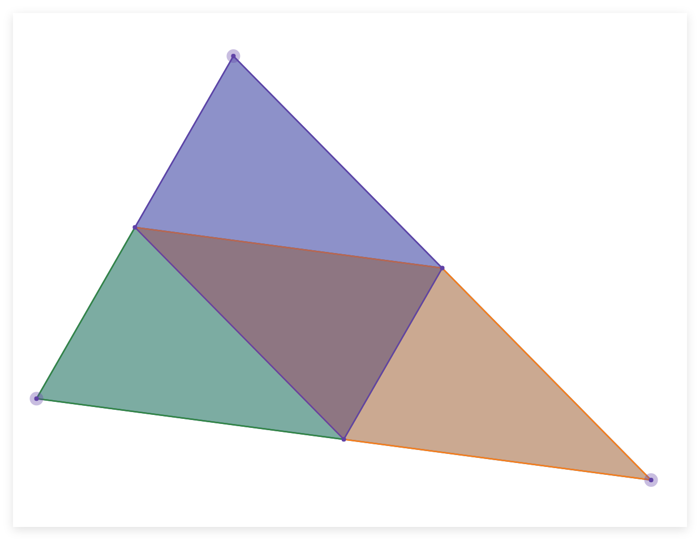
### Condition checks related to client

itemmodel mapping allows baking models to be mapped through item stack properties.

One of the application scenarios of shaders is to replace the client condition check that vanilla does not have to control model changes. However, itemmodel mapping has added a large number of allowed conditions, and more will be added in the future. In addition to checking the status of the **item Stack** on the server side, itemmodel mapping also allows checking:

- extended_view: Check whether the current client is pressed`⇧ Shift`and the item is rendered within the GUI
- keybind_down: Check whether the key binding is pressed
- selected: Check whether the player has selected this item stack in the shortcut bar
- view_entity: Check whether the camera is on this entity (such as yourself in normal mode and the entity watching in spectator mode)
-...

::: details Tucao
> Tucao view_entity's introduction on the wiki is really inhumane, the Chinese wiki is
>
>Check whether the mob holding this item stack is the entity currently serving as the camera, that is, whether it is the current player in non-spectator mode, and whether it is the corresponding entity currently entering the perspective in spectator mode."`(editor's note: no longer)`>
>English wiki is
>
> - When not spectating, return true if context entity is the local > player entity, i.e. the one controlled by client.
>
> - When spectating, return true if context entity is the spectated entity.
>
> - If context entity is not present, will return false.

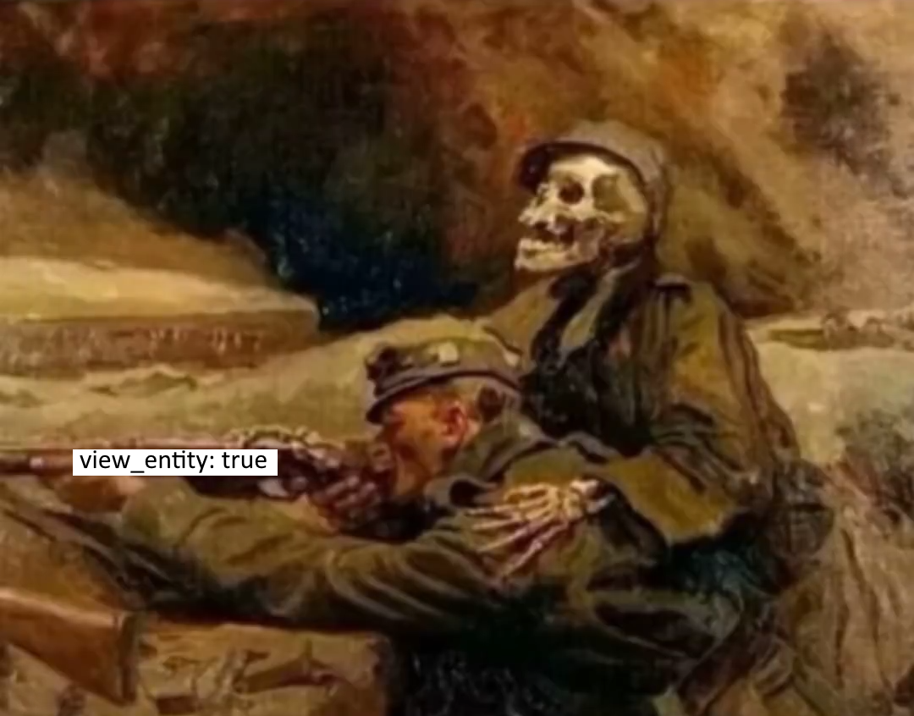:::

### Negative size model

Negative dimension modeling is a modeling technique. Since Minecraft's rendering pipeline accepts elements with negative side lengths, each directed face will be inverted during rendering, so that the player can only see the back of the model in the usual sense instead of the front. This technique can achieve a stroke-like effect. (Can also be used to achieve hollowing out)

The following is from [夜LOY_ALoyi](https://space.bilibili.com/352879603) 、[numio](https://space.bilibili.com/420920060) and [Jinchuan](https://space.bilibili.com/10016652) for three examples of negative size models:

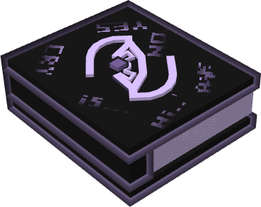

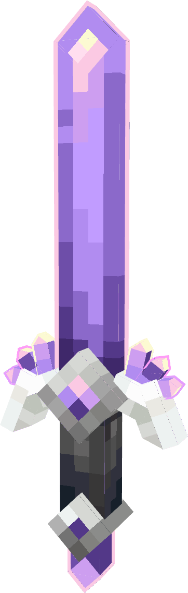

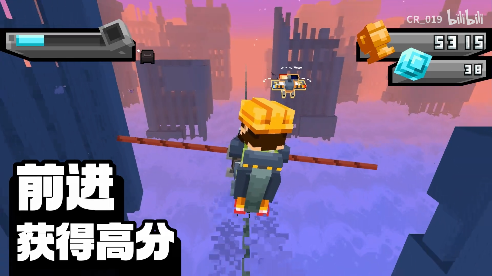
### Negative spaces

Negative space refers to an invisible character with a negative width introduced in a custom font. Normally, the font needs to rely on a width to determine where its next character should start rendering. If this width is negative, then our pointer will move forward, creating some overlap when rendering. This eliminates the trouble of using a shader to translate text left and right. At the same time, the native font system can eliminate a lot of work of marking the shader.

(If you need a lot of up and down movement, you may still need a shader. You can refer to the front [BetterTitle - Huoyu](https://vanillalibrary.mcfpp.top/datapack-index/wheel/resources/Better_Title.html))

### Connect texture (face culling)

This is a slightly special example that uses the optimization mechanism of face culling to achieve optfine's connected texture effect. The main principle is to put different differences into the same model, and use face elimination to determine the faces to eliminate other differences, leaving only one. In this way, the block can decide to use different models based on the connection status of the blocks around it.

This technique can even almost completely replace the shader, because the shader can only see each vertex or pixel itself, but cannot see what the surrounding blocks look like. This technique is in [this article](../2_texture/content).

## Main application scenarios of shader

This paragraph may look like it is written in a textbook, but we must be clear about what work the shader was originally introduced to accomplish.

In terms of purpose, the job of the vertex shader is to obtain the final screen position by performing efficient matrix operations on the vertex positions defined in the program, while the job of the fragment shader is to obtain the final color of each pixel through some texture sampling and mathematical operations. However, their functions can be summarized as: determining the position of any vertex and determining the color of any pixel.

Since Minecraft is not a highly free game engine (although many people have used it as an engine), many functions cannot be well implemented by the interface provided by Mojang (or are very troublesome to implement). These tasks ultimately fall on the shoulders of the shader, so the shader will be my "final solution". Obviously, the premise is that other solutions have been tried.

So what are the typical applications that can only be realized by shaders? We can summarize it into the following categories:

- Fine-tuning the lighting model: Minecraft's lighting model is fixed. The only operable space is the ambient occlusion of the block model (can be turned off), the light level of the display entity, and the self-illumination of the baked model. However, elements such as dynamic models are not allowed to be modified at all, so you need to rely on the shader to make custom adjustments to these contents.

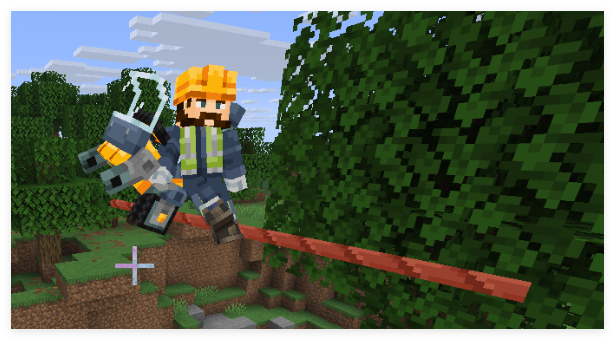- Skybox: Minecraft’s skybox is fixed, but Optfine has introduced the function of customizing the skybox very early, which is a highly requested feature. However, Minecraft's skybox is a solid color map rendered through a special shader. The color is only related to the position, so we can only use the shader to programmatically generate the sky. (Image from [Wolf King](https://space.bilibili.com/508626439) )

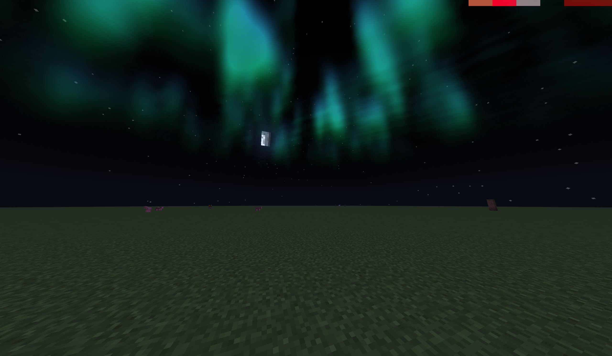- Camera control: Although the data pack can control the player's coordinates and orientation, there is a jitter problem. In order to solve the jitter problem, client-level camera control (such as Bedrock Edition's`/camera`command, but not in the Java version), which requires a shader to control the position and orientation of the camera by modifying the MVP matrix.

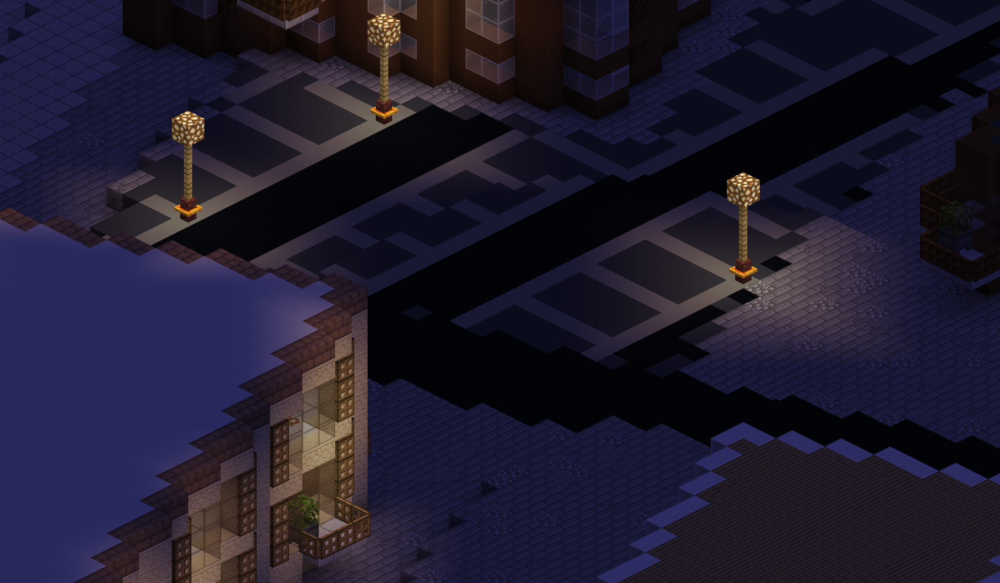- Forced translucency: Some shaders in Minecraft do not support translucent rendering (such as solid blocks before 26.1), and the type of shader rendering of elements is hard-coded, so we can only force the translucency effect through the shader (randomly discarding fragments).

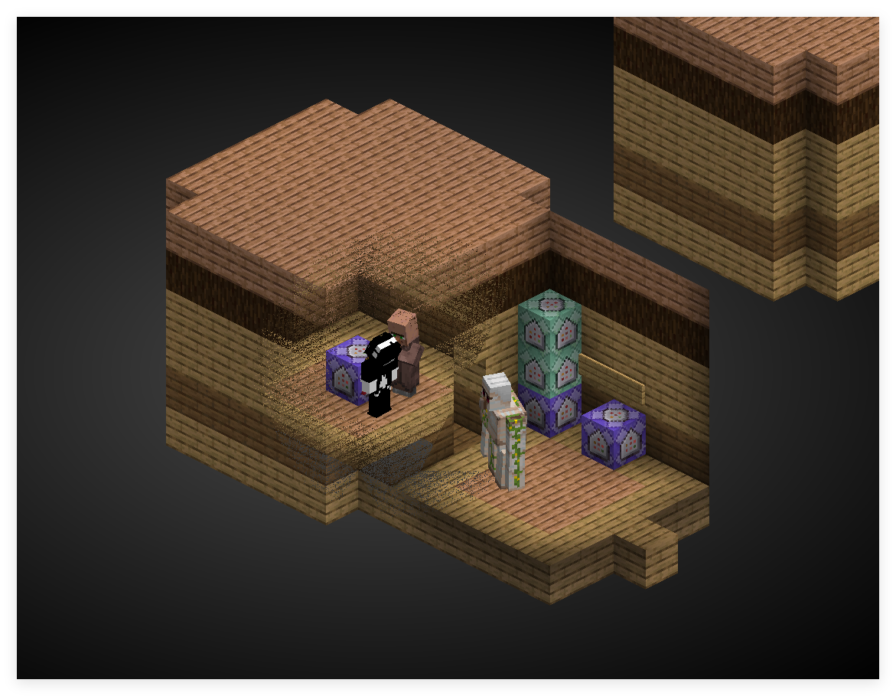- Completely remove certain elements: Minecraft has a large amount of content that does not allow texture modification, or is not rendered through textures at all (such as the old version of tooltip), so we can only completely remove these elements through the shader.

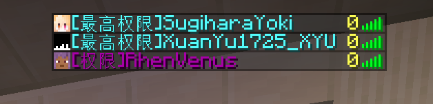 

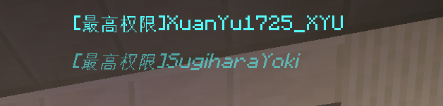- Generate texture: Similar to the above, for elements that cannot be changed by modifying the texture, we can only generate new textures through the shader. (Algorithm from [_polymath](https://www.shadertoy.com/view/lsVBWy) ）

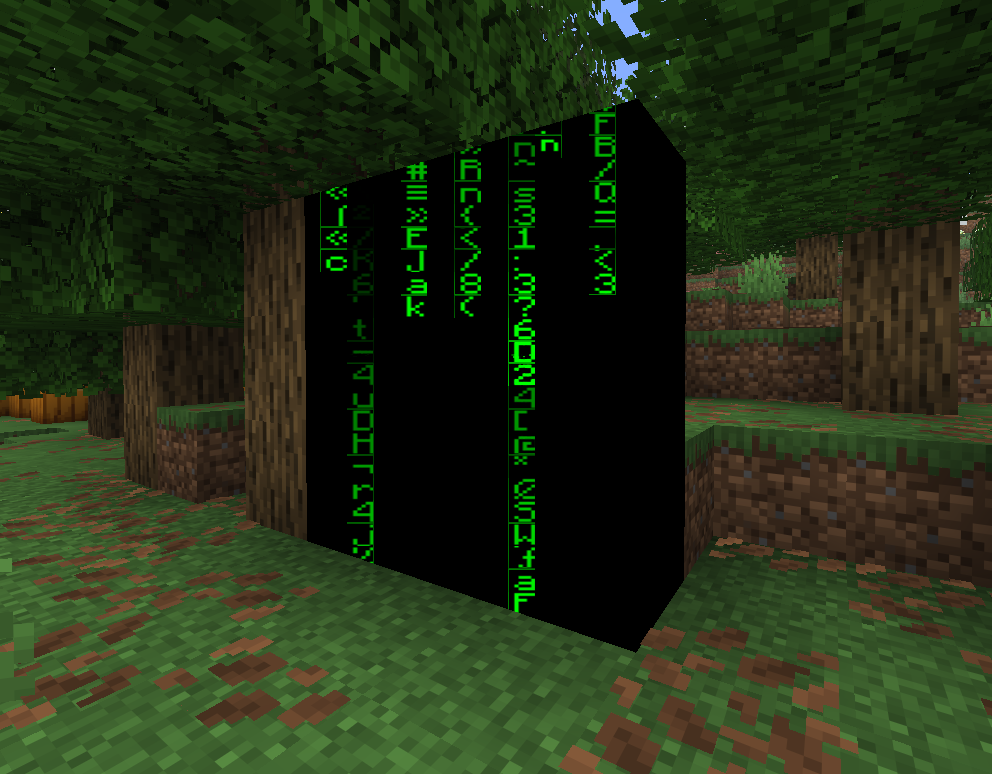- Rendering different models in different contexts: Although itemmodel mapping already allows us to render different models based on some conditions, these conditions are still very limited, so we can only implement more complex condition checks through shaders. (Mainly by rendering multiple models at the same time, and then using the shader to decide which models to discard) (Model from [Not Zeli](https://space.bilibili.com/1236612296) )

> When this article is published, this function can already be implemented using itemmodel mapping.

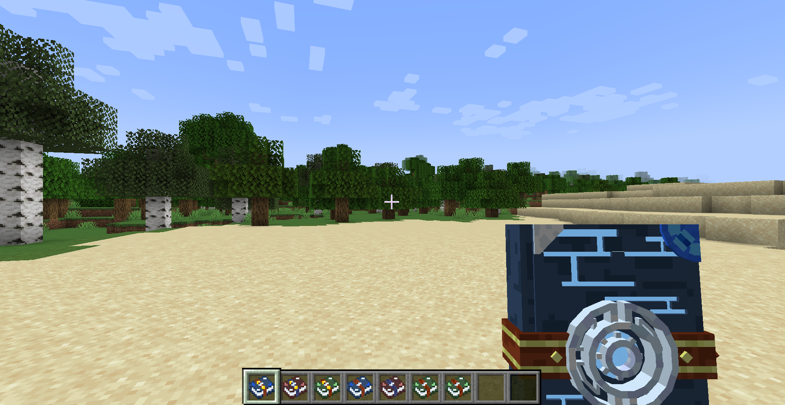The above contents are all possible solutions as Mojang opens new interfaces, and the following functions must be implemented through the shader (that is, the shader's job) even if Mojang joins:

- Water surface ripples: Without considering physical interaction, simple water surface ripples are very suitable to be implemented with a shader. You only need to ensure that the results calculated by the shader have an integer number of periods within the range of the data and are continuous everywhere to create a good ripple effect.

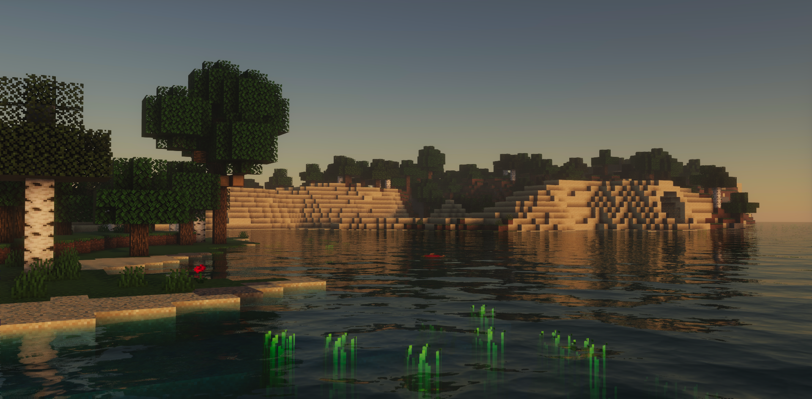- Lighting model: Minecraft uses a very simplified lighting model (similar to Lambert diffuse reflection), and the shader allows us to implement more complex lighting models (such as Blinn-Phong, Cook-Torrance, etc.).

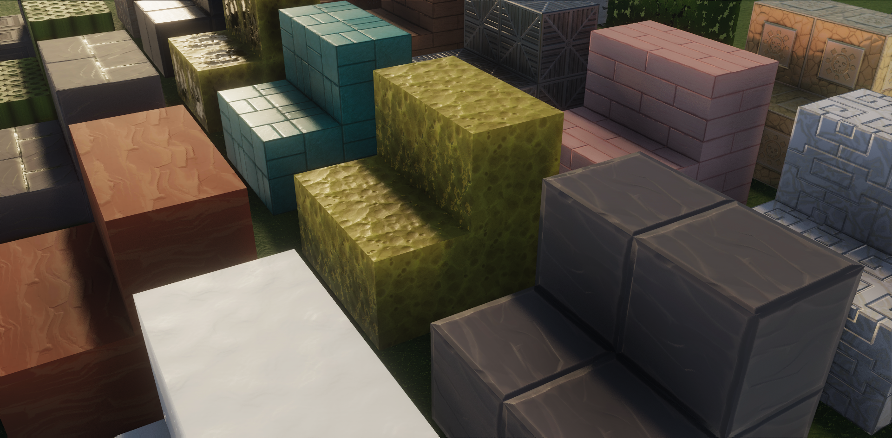- Stylized rendering: Through shaders we can achieve some special rendering effects, such as cartoon rendering, pixelation, edge detection, etc. These are typical application scenarios of shaders.

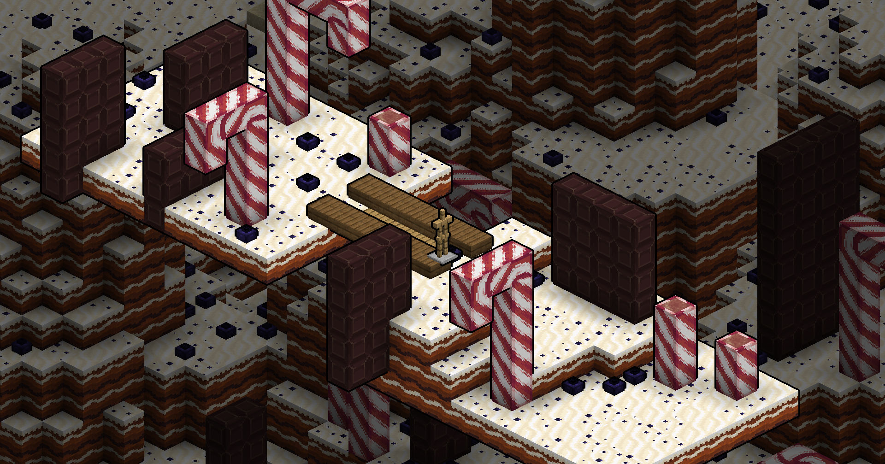- Post-processing effects: Through shaders we can achieve some global post-processing effects, such as blur, tone mapping, depth of field, etc. These are also typical application scenarios of shaders. (Image from [Qingluka](https://space.bilibili.com/33229178) )

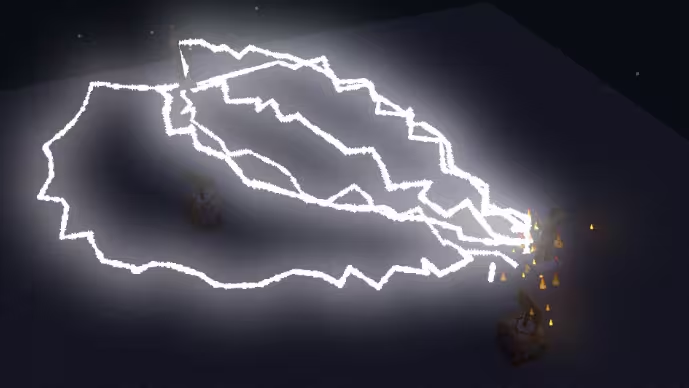
## Summary

Before adopting a shader, first determine whether these features can be easily implemented with a more stable API. If you know enough about shaders, or continue to study in depth, you will be able to naturally judge which functions are suitable to be implemented with shaders, and which functions are not suitable to be implemented with shaders.

## References and Resources

- objmc - GodLander: [Bypass Java Edition model limitations by baking vertex data into textures](/en/wheel/resources/objmc)
- BetterTitle - Huoyu: [Multiple text operation library based on negative spaces and shader](/en/wheel/resources/Better_Title)
- CEM-S - DartCat25: [CEM-Sentity model modification support library](/en/wheel/resources/CEM-S)
- vanilla-shaderpack - JNNGL: [https://github.com/JNNGL/vanilla-shaderpack](https://github.com/JNNGL/vanilla-shaderpack)
- Shadertoy - _polymath: [https://www.shadertoy.com/view/lsVBWy](https://www.shadertoy.com/view/lsVBWy)
- Particle Bloom - Qingluka: www.mcbbs.net/thread-1210511-1-1.html (Expired)