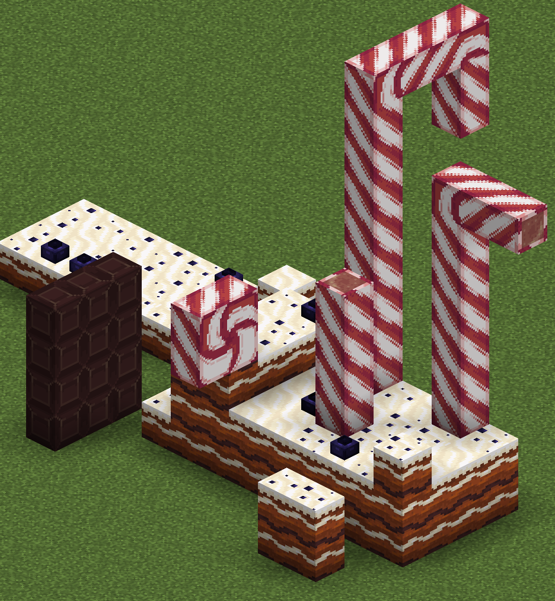
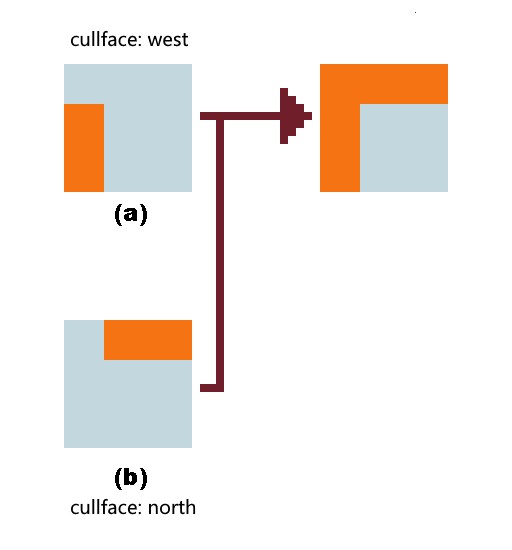
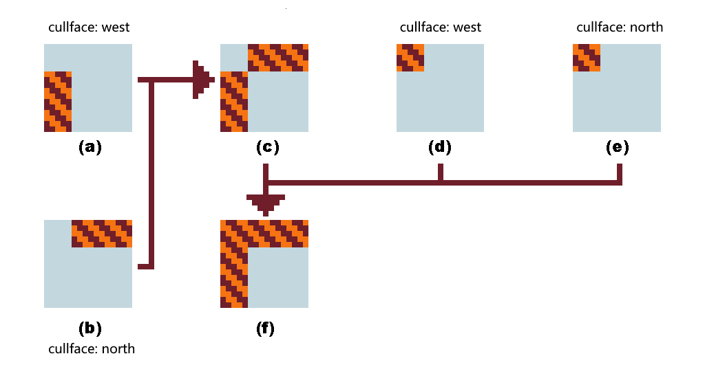
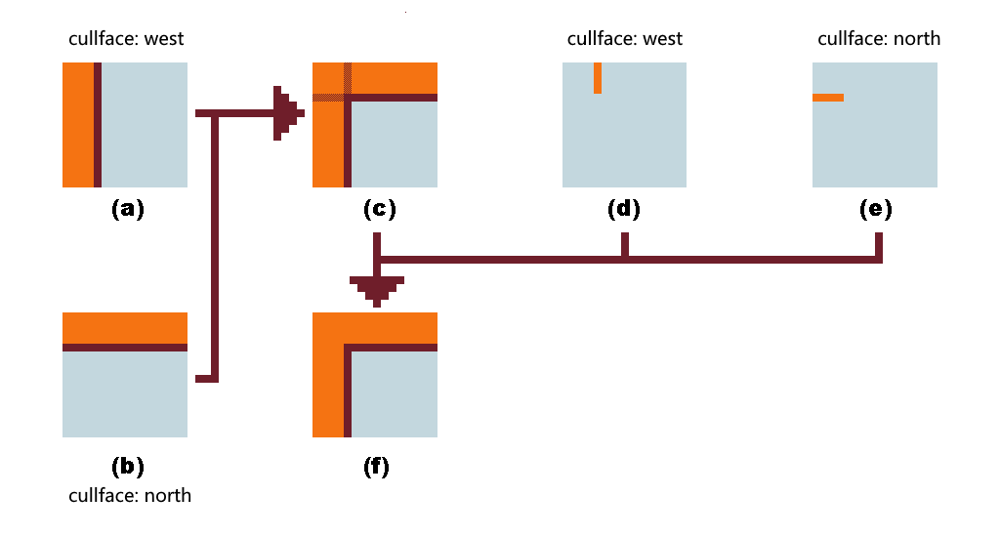
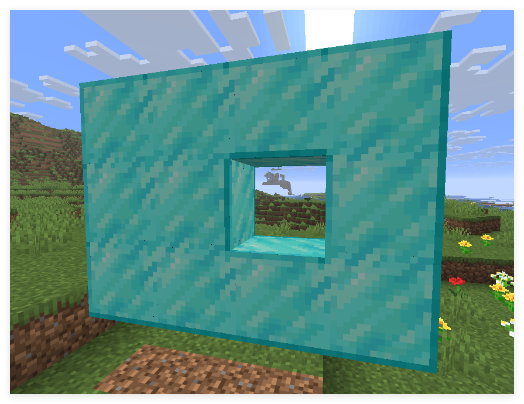

::: tip Translation notice
This page was translated with machine translation and may contain inaccuracies. If you can help improve it, please open an issue or submit a pull request.
:::


<FeatureHead
title='Vanilla connected texture based on face culling'
authorName='Xuanyu1725'
/>

## Preface

Connected textures are a mechanism that automatically changes the appearance of a block based on its surrounding environment. In the past, this work relied mainly on [Optifine](https://optifine.net/home) and other third-party modules to implement. In this article, we will provide a vanilla approximation solution that can also achieve similar connected texture effects. (More suitable for custom maps, compatibility with vanilla survival is still limited)

## Brief description of principle

Our basic idea is to use`面剔除 (Culling)`To determine whether there are complete faces around the block, by selectively removing faces, we can let the block hide the corresponding faces when adjacent blocks exist, thereby achieving a visual effect similar to connected textures.

This also directly determines the compatibility range of this solution: it is impossible to connect textures to non-all blocks, and it is impossible to distinguish whether the surrounding blocks are of the same type as itself, which cannot be fully realized.$64$a completely unrelated model. Still, this solution works very well on custom maps.



The cake floor, chocolate blocks and candy canes in the picture are all constructed using only one type of block.

## Introduction to face culling

In the baking model, each voxel (elements) can define the attributes of its six faces. The data format of the faces is as follows:

<div class="nbttree">

<node type="compound" name="face"/> This is the definition of a model face.
- <node type="string" name="texture" required=true />Specifies the texture variable used (starting with`#`beginning).
- <node type="list" name="uv"/>Set texture mapping.
  - <node type="float" name=""/>The texture horizontal coordinate bound to the starting point of the texture`u1`。
  - <node type="float" name=""/>The texture coordinate bound to the starting point of the texture`v1`。
  - <node type="float" name=""/>The texture horizontal coordinate bound to the texture end point`u2`。
  - <node type="float" name=""/>The texture coordinate bound to the texture end point`v2`。
- <node type="int" name="rotation"/> (default is`0`) to rotate the texture according to a specific angle, which can be`0`、`90`、`180`or`270`。
- <node type="int" name="tintindex"/> (default is`
- 1`) recolors the texture using a hardcoded shading index. If it is an item model, it can be specified as itemmodel mapping`tints`subscript to refer to non-hardcoded coloring.
- <node type="string" name="cullface"/>Specifies the occlusion direction used to cull this model face.

</div>

in`cullface`The field is an enumeration that specifies in which direction this face will be removed when there is a complete face. Optional values ​​include`"up"`、`"down"`、`"north"`、`"south"`、`"west"`and`"east"`。

## Implementation method

Based on this feature, we can achieve any connected texture effect. Suppose we want the model to use model A when it has a complete face on the north side, and model B otherwise, then we can set each face of B to`cullface`for`"north"`, so that when the north face has a complete face, the north face of B is culled, revealing model A. And A can set a very small scaling, so that when B is not culled, B will block A.

Note that the B model does not have to be a complete model, it may be enough to cover only part of A. For example, B is only used to cover edges in a specific direction.

When there is a complete surface in a boundary direction, we trigger culling and let this edge be culled, so each boundary should be an independent voxel.

Depending on the texture, there are the following processing processes:





Figure 1 is suitable for borders that are a solid color, have no rotation on the border texture, or are only one pixel wide. (a) and (b) are directly superimposed at the same height. In vanilla, generally pure color z-flighting will not produce obvious flickering, so it can be directly superimposed. If flickering occurs under specific light and shadow, the boundary filling method shown in Figure 2 can be used. (a) and (b) are superimposed on the same height to get (c), and (d) and (e) are superimposed on (c) at slightly different heights.



This process is suitable for general corner processing, and the overlay method is the same as above. The purpose is to cover the z-flighting part. When the north direction is eliminated, only (a) and (d) remain, thus leaving a complete boundary in the west direction. Similarly, when the west direction is eliminated, only (b) and (e) are retained, leaving a complete boundary in the north direction.

## Example: Diamond block connection texture

We first analyze the connection texture requirements of diamond blocks: diamond blocks will eliminate each other, and the processing on each surface is similar, so we only study the processing in the four directions of one surface, up, down, left, and right.

Here is an example of a complete diamond block corner treatment model definition:

::: details Model definition format
```json
{
	"format_version": "1.21.11",
	"credit": "Made with Blockbench",
	"parent": "minecraft:block/cube_all",
	"textures": {
		"0": "block/diamond_block_down",
		"1": "block/diamond_block_left",
		"2": "block/diamond_block_right",
		"3": "block/diamond_block_surface",
		"4": "block/diamond_block_up",
		"particle": "block/diamond_block_down"
	},
	"elements": [
		{
			"name": "surface",
			"from": [0, 0, 0],
			"to": [16, 16, 16],
			"faces": {
				"north": {"uv": [0, 0, 16, 16], "texture": "#3"},
				"east": {"uv": [0, 0, 16, 16], "texture": "#3"},
				"south": {"uv": [0, 0, 16, 16], "texture": "#3"},
				"west": {"uv": [0, 0, 16, 16], "texture": "#3"},
				"up": {"uv": [0, 0, 16, 16], "texture": "#3"},
				"down": {"uv": [0, 0, 16, 16], "texture": "#3"}
			}
		},
		{
			"name": "cull_up",
			"from": [-0.003, 14.99998, -0.003],
			"to": [16.003, 15.99898, 16.003],
			"rotation": {"angle": 0, "axis": "y", "origin": [8, 8, 8]},
			"faces": {
				"north": {"uv": [0, 0, 16, 1], "texture": "#4","cullface": "up"},
				"east": {"uv": [0, 0, 16, 1], "texture": "#4","cullface": "up"},
				"south": {"uv": [0, 0, 16, 1], "texture": "#4","cullface": "up"},
				"west": {"uv": [0, 0, 16, 1], "texture": "#4","cullface": "up"},
				"up": {"uv": [0, 0, 16, 16], "texture": "#missing"},
				"down": {"uv": [0, 0, 16, 16], "texture": "#missing"}
			}
		},
		{
			"name": "cull_down",
			"from": [-0.003, 0.003, -0.003],
			"to": [16.003, 1.002, 16.003],
			"rotation": {"angle": 0, "axis": "y", "origin": [8, 8, 8]},
			"faces": {
				"north": {"uv": [0, 16, 16, 15], "texture": "#0","cullface": "down"},
				"east": {"uv": [0, 16, 16, 15], "texture": "#0","cullface": "down"},
				"south": {"uv": [0, 16, 16, 15], "texture": "#0","cullface": "down"},
				"west": {"uv": [0, 16, 16, 15], "texture": "#0","cullface": "down"},
				"up": {"uv": [0, 16, 16, 0], "texture": "#missing"},
				"down": {"uv": [0, 16, 16, 0], "texture": "#missing"}
			}
		},
		{
			"name": "cull_north",
			"from": [-0.002, 0.00102, -0.002],
			"to": [16.002, 1.00002, 16.002],
			"rotation": {"x": 90, "y": 0, "z": 0, "origin": [8, 8, 8]},
			"faces": {
				"north": {"uv": [0, 1, 16, 0], "texture": "#4","cullface": "north"},
				"east": {"uv": [16, 0, 15, 16], "rotation": 90, "texture": "#2","cullface": "north"},
				"south": {"uv": [0, 16, 16, 15], "texture": "#0","cullface": "north"},
				"west": {"uv": [1, 0, 0, 16], "rotation": 90, "texture": "#1","cullface": "north"},
				"up": {"uv": [0, 16, 16, 0], "texture": "#missing"},
				"down": {"uv": [0, 16, 16, 0], "texture": "#missing"}
			}
		},
		{
			"name": "cull_south",
			"from": [-0.002, 0.00102, -0.002],
			"to": [16.002, 1.00002, 16.002],
			"rotation": {"x": -90, "y": 0, "z": 0, "origin": [8, 8, 8]},
			"faces": {
				"north": {"uv": [0, 1, 16, 0], "texture": "#4","cullface": "south"},
				"east": {"uv": [1, 0, 0, 16], "rotation": 90, "texture": "#1","cullface": "south"},
				"south": {"uv": [0, 16, 16, 15], "texture": "#0","cullface": "south"},
				"west": {"uv": [16, 0, 15, 16], "rotation": 90, "texture": "#2","cullface": "south"},
				"up": {"uv": [0, 16, 16, 0], "texture": "#missing"},
				"down": {"uv": [0, 16, 16, 0], "texture": "#missing"}
			}
		},
		{
			"name": "cull_west",
			"from": [-0.001, 0.00102, -0.001],
			"to": [16.001, 1.00002, 16.001],
			"rotation": {"x": 0, "y": -90, "z": -90, "origin": [8, 8, 8]},
			"faces": {
				"north": {"uv": [16, 0, 15, 16], "rotation": 90, "texture": "#2","cullface": "west"},
				"east": {"uv": [1, 0, 0, 16], "rotation": 90, "texture": "#1","cullface": "west"},
				"south": {"uv": [1, 0, 0, 16], "rotation": 90, "texture": "#1","cullface": "west"},
				"west": {"uv": [16, 0, 15, 16], "rotation": 90, "texture": "#2","cullface": "west"},
				"up": {"uv": [0, 16, 16, 0], "texture": "#missing"},
				"down": {"uv": [0, 16, 16, 0], "texture": "#missing"}
			}
		},
		{
			"name": "cull_east",
			"from": [-0.001, 0.00102, -0.001],
			"to": [16.001, 1.00002, 16.001],
			"rotation": {"x": 0, "y": 90, "z": 90, "origin": [8, 8, 8]},
			"faces": {
				"north": {"uv": [1, 0, 0, 16], "rotation": 90, "texture": "#1","cullface": "east"},
				"east": {"uv": [1, 0, 0, 16], "rotation": 90, "texture": "#1","cullface": "east"},
				"south": {"uv": [16, 0, 15, 16], "rotation": 90, "texture": "#2","cullface": "east"},
				"west": {"uv": [16, 0, 15, 16], "rotation": 90, "texture": "#2","cullface": "east"},
				"up": {"uv": [0, 16, 16, 0], "texture": "#missing"},
				"down": {"uv": [0, 16, 16, 0], "texture": "#missing"}
			}
		}
	]
}
```

:::



> [Download resource pack](https://github.com/CR-019/datapack-index/raw/refs/heads/lib-hosting/prod/feature_2026.05.diamond_resources.zip)\
> [Mirror link](https://gitee.com/Dahesor/server_resourcepacks/raw/lib/prod/feature_2026.05.diamond_resources.zip)

## Quote

The diamond block's connected textures are borrowed from the Connected Textures (CTM) Overhaul, a resource pack that relies on Continuity or OptiFine.

[https://modrinth.com/resourcepack/ctm-overhaul](https://modrinth.com/resourcepack/ctm-overhaul)
