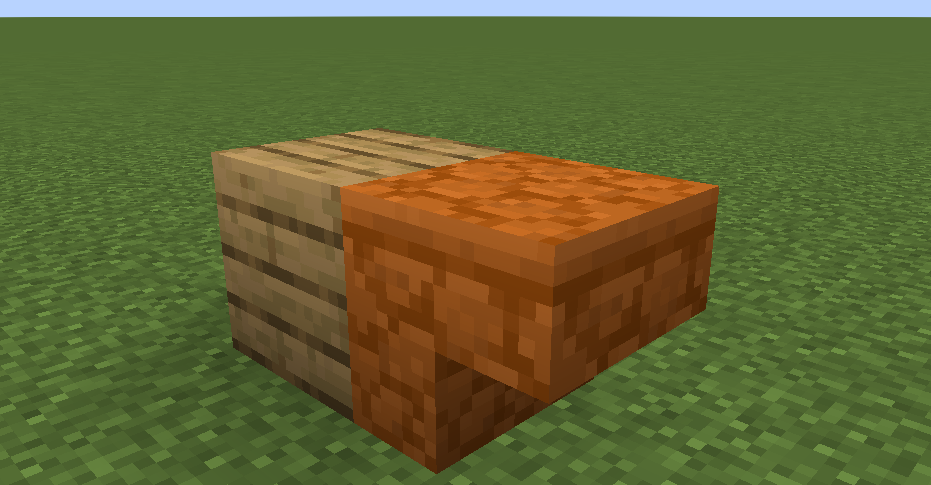
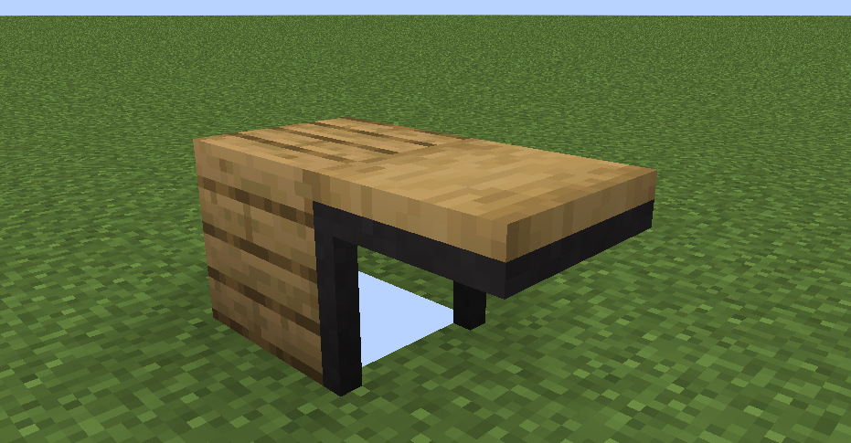

<script setup>
import { useData } from 'vitepress'
import ColorLine from '/.vitepress/vue/ColorLine.vue'
const { isDark } = useData()
</script>

# Second cover
<ColorLine :height="4"/>

## command flashlight Command Flashlight
> The editor-in-chief only remembered at 23:37 on the evening of May 14th that the cover page was not done, so it was too late to find some tidbits. Pigeon 1 issue (


## I ask you to answer Quizs

:::warning This column is not a "you ask and I answer"!
In this column, we will ask several questions, and readers can give their own answers in the comment area (indicate the question number).  
The answer will be announced in the next issue of Feature.  

The questioner of this issue: Xu Muxian
:::

:::tip
The questions in this issue are based on`26.1`version.
:::

---

1. When making a special resource pack for an adventure map, the model of the red sandstone staircase was made into a table. After it was built with oak planks into the structure shown on the left, the resource pack was applied, and the resulting rendering was as shown on the right. Briefly describe the reasons for this phenomenon.

  

---

2. Count the number of players in the current server and store the results in the scoring field.

---

3. The running result of the following function is

```mcfunction
tellraw @a "\\"\
\\"
\"
```
<ColorLine :height="2"/>

### Reference answer from previous issue

> Note: The answer is not unique. Just solve the problem.

Question 1:

```mcfunction
execute as @e[type=wolf] on owner run tellraw @s "[提示] 你可以通过狗尾巴的角度判断它的生命值"
```
---

Question 2:`0.3125f`---

Question 3:

sound event`backrooms:ambient.level0`The mob definition file cannot directly reference unregistered sound events using namespaceIDs in the form of strings that are not in the registry.

---

Question 4:

> data > easecation > tags > block > not_red_concrete.json

```json
{
  "values": [
    "minecraft:brown_concrete",
    "minecraft:orange_concrete",
    "minecraft:yellow_concrete",
    "minecraft:lime_concrete",
    "minecraft:green_concrete",
    "minecraft:cyan_concrete",
    "minecraft:light_blue_concrete",
    "minecraft:blue_concrete",
    "minecraft:purple_concrete",
    "minecraft:magenta_concrete",
    "minecraft:pink_concrete"
  ]
}
```


```mcfunction
fill 0 0 0 31 0 31 air replace #easecation:not_red_concrete
```
<ClientOnly>
  <GiscusComment
    repo="CR-019/datapack-index"
    repoId="R_kgDONRhuqw"
    category="Chats"
    categoryId="DIC_kwDONRhuq84CkchW"
    mapping="number"
    term="69"
    :strict="false"
    :reactionsEnabled="true"
    emitMetadata="0"
    inputPosition="top"
    :theme="isDark ? 'dark' : 'light'"
    lang="zh-CN"
    loading="lazy"
    class="giscus-wrapper"
  />
</ClientOnly>