::: tip Translation notice
This page was translated with machine translation and may contain inaccuracies. If you can help improve it, please open an issue or submit a pull request.
:::


<FeaturedHead
    title="Use Minecraft to restore the water pipe game: random tree generation based on Prim algorithm and loop search based on Tarjan algorithm"
    authorName="Xu Muxian"
    :extraAuthors="['洪旗']"
    cover = '../../../../../feature/archive/202606/_assets/0.png'
    resourceLink = 'https://github.com/xu-mu-xian/Pipes-Mini-game-for-Minecraft'
/>


## 1. Introduction
Pipes (or Freenet) is a puzzle game. The gameplay is:$w \times h$There are pipes of different shapes distributed in a large and small grid, and the goal is to connect all the pipes into a loop-free structure by rotating these pipes.
<div style="text-align:center">
  <div style="display:flex; justify-content:center; align-items:center; gap:8px;">
    

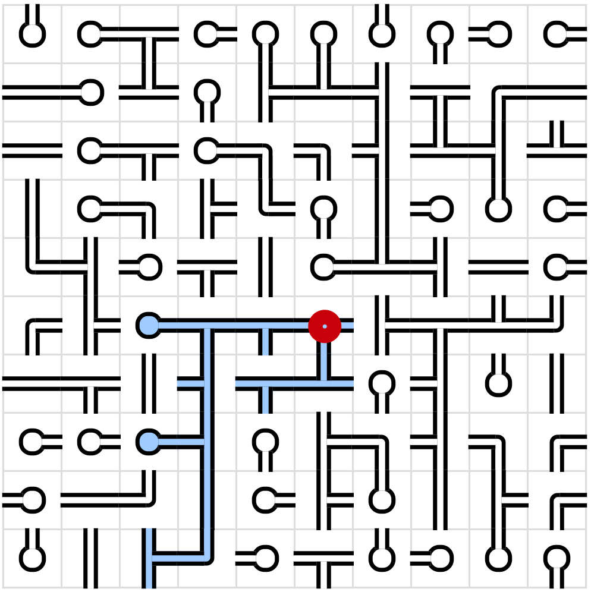
    

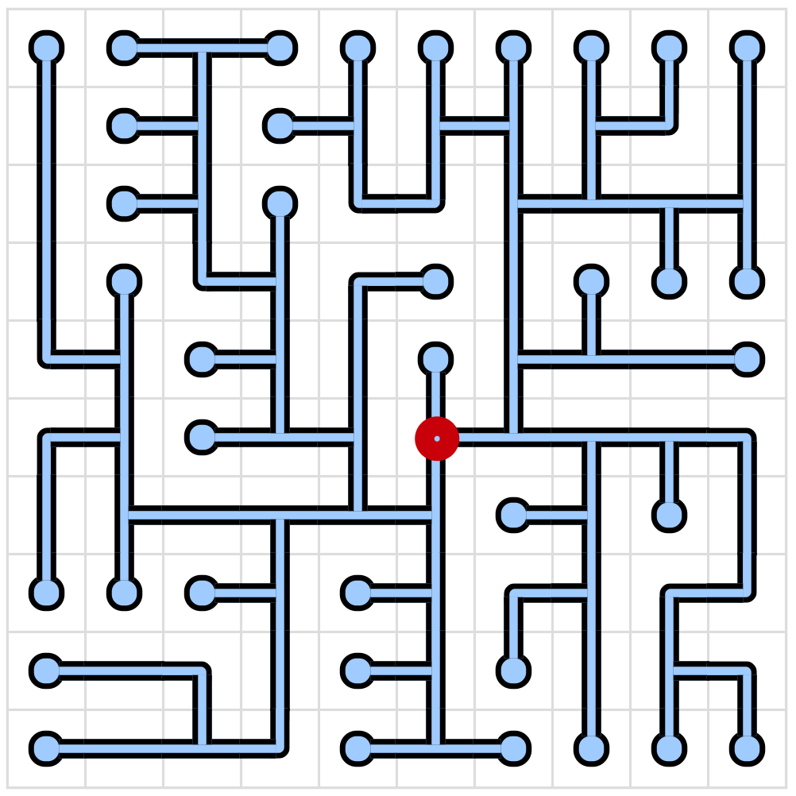
  </div>
<p style="color: gray;">Figure 1: Example of the water pipe game, the left picture is the question and the right picture is the answer</p>
</div>

In order to ensure that the game must have a solution, the general approach is to first generate a map and then randomly disrupt the pipes in it. These randomly generated maps are actually trees, and each square is regarded as a node, where the water source (that is, the location marked by the red circle in Figure 1) is the root node of the tree. It has the following properties:
- There are no cycles in the graph.
- There is only one tree in the graph, and all positions on the grid can be reached along the tree.
- The tree only contains pipes of the following shapes, **cross-shaped pipes are not allowed to be generated**.
  - Endpoint (dead end), containing four directions.
  - Straight pipe has two directions: ━ and ┃.
  - L-shaped elbows come in four shapes: ┏, ┓, ┗, and ┛.
  - T-shaped tubes come in four shapes: ┣, ┳, ┫, and ┻.

There are many methods for generating random trees, including but not limited to depth-first algorithm, Prim algorithm, Kruskal algorithm, Wilson algorithm, etc. Each of these algorithms has its own characteristics, and the generated graphs have different preferences. For example, the depth-first algorithm is more inclined to generate long straight paths and produces fewer branches than other algorithms, which makes the generated map more rigid and the difficulty of the game will be reduced accordingly. The Kruskal and Wilson algorithms are more suitable for generating natural, uniform random trees. The Kruskal algorithm treats each square as an independent set during initialization. Every time it randomly connects edges, it must perform a complex union check to see whether the two squares belong to the same set. Wilson's algorithm uses a loop-elimination random walk. Each time it selects a position where the graph has not been generated, and walks randomly until it encounters an existing tree. This process requires confirming the path trajectory and connecting the newly generated branch to the existing tree. The map paths generated by Prim are usually short, fragmented, and scattered, and the puzzles generated are theoretically more difficult. Different from the Wilson algorithm's "walking from the unknown to the known" generation mode, the Prim algorithm is a relatively pure outward growth generation mode. In theory, this method will be slightly easier to implement for mcf. Therefore, this article adopts Prim's algorithm as a first exploration of generating water pipe puzzles in Minecraft.

However, just generating random trees is not enough for the water pipe game. It also needs to be determined whether the player has completed the water pipe puzzle. One possible way is to directly compare the game situation and the final solution. If they are completely consistent, it means that the player has completed the puzzle. But this method is only suitable for the case of unique solution. Existing research has made statistics on the frequency of unique puzzle solutions generated by the Prim algorithm. When the grid area becomes larger, the unique puzzle solutions of the Prim algorithm decline significantly.$5 \times 5$In a grid of size , the probability of generating a unique solution is about 70%;$20 \times 20$, this probability drops to just 0.02%. Therefore, we cannot directly judge whether the player has completed the puzzle through comparison.

Since the final solution is a tree, you can start from the root node and traverse all the nodes on the tree to see if it covers the entire grid. There are many methods for traversing trees, such as breadth-first search (hereinafter referred to as BFS) and depth-first search (hereinafter referred to as DFS). The key point is that loops will inevitably occur when the player attempts to connect, and loops are regarded as illegal connections in the tree, as shown in Figure 2. Both BFS and DFS can identify loops. When the program traverses forward from one node, if the next node has been visited, it can think that a loop has occurred here, but it will not know where the loop is bypassed.
<div style="text-align:center">
  

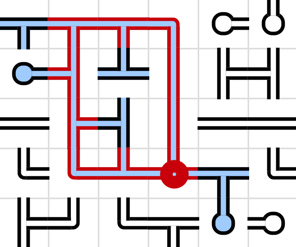
<p style="color: gray;">Figure 2: The official website of the water pipe game marks the places where loops occur</p>
</div>

In order to better restore this mini-game, especially to mark all the nodes on the loop along the graph, it is necessary to consider whether the graph is a directed graph or an undirected graph. The two will differ in the storage of node data. Each node in the directed graph needs to record the following: the position of the current node and the **pointed neighbor node; the undirected graph needs to record the position of the current node and the **connected neighbor nodes. This means that the direction of each edge needs to be checked during the generation process of a directed graph. If an edge is pointed to it by a neighbor node, then this edge cannot be counted as the neighbor node pointed by the node. There is one more judgment statement here compared to the undirected graph. In addition, during the game, the directed graph will greatly cause confusion in the flow of water.
<div style="text-align:center">
  

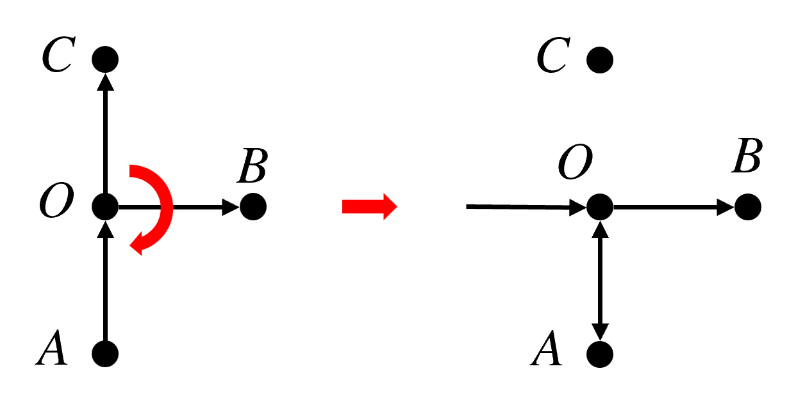
<p style="color: gray;">Figure 3: Problems with directed graphs in water pipe rotation</p>
</div>

As shown in Figure 3, a normal directed graph is shown on the left. However, when the player tries to$O$When rotated 90° clockwise, the spatial physical geometry of the pipe opening changes, resulting in$OA$The connection becomes bidirectional, forming a binary interlocking loop. This is because the rotation of each node can only change its own inflow and outflow directions, and it cannot actively modify the original flow direction across nodes. To correct this phenomenon, the algorithm must start from the water source root node and redefine the only legal water flow direction network in the current entire graph. Each grid has 4 rotation directions, and the entire graph has a total of$4^{mn}$This combination of states will cause huge losses. The nodes facing the player should not store the entry and exit directions in advance. The flow direction of the entire graph is flexible and variable, so the water pipe game is more suitable to be constructed with an undirected graph.

In an undirected graph, if DFS is performed, the passing edges can be divided into tree edges and reverse edges, where the reverse edge is the edge pointing to the ancestor node already in the DFS stack. The figure below shows two forms of loops, the one on the left is$AB$and$AC$are two independent subtrees. However, this form of loop cannot exist on DFS, because DFS will explore one branch before proceeding to the next branch, so there cannot be two subtrees being traversed at the same time. Any non-tree edge must connect a node and its upstream node, as shown in the figure on the right.
<div style="text-align:center">
  

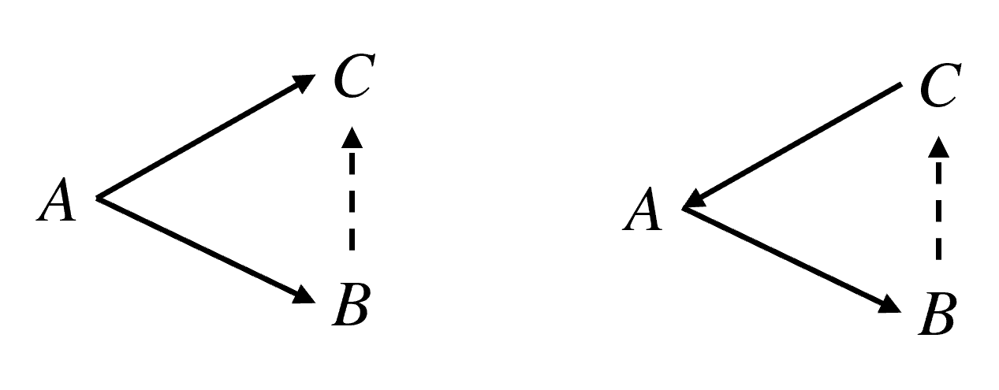
<p style="color: gray;">Figure 4: Two forms of loops</p>
</div>

Tarjan's algorithm takes advantage of this property by maintaining`dfn`and`low`With two arrays, only one DFS can identify all loops during the backtracking process. This project will use the Tarjan algorithm as a solution to the water pipe puzzle.

## 2. Ideas and processes
Next, we need to determine the specific algorithms and ideas. Since the algorithms involved in this article are relatively complex, we first use pseudocode to make a preliminary plan for these algorithms to facilitate subsequent writing. The algorithms involved in this article mainly include two types: the random Prim algorithm for **generating maps** and the DFS for **judging problem solving**. In order to enable DFS to traverse the loop, this algorithm also adds loop backtracking.

### 2.1 Random Prim algorithm
**Prim's algorithm** is an algorithm for building minimum spanning trees in weighted connected graphs. It starts from a root node, includes the node's edges into the candidate edge list, and then selects the edge with the smallest weight in the candidate edge list at each step, and adds the unselected nodes connected to the edge to the tree. This process is repeated until all nodes are included in the spanning tree, resulting in a tree containing all nodes with the smallest total weight.

Under this condition, if the weight of each edge is equal, and any edge is extracted equally likely every time, it becomes the **randomized Prim algorithm** used in this article. The complete pseudocode used for the randomized Prim algorithm is as follows:

::: details Prim algorithm pseudocode

```
t = t_source  // t：节点，t_source：根节点
visit t
for n ∈ N do
  push (t, t_n) to list  // t_n：t的邻居节点
end for
while list is not empty do
  x = random(1, size of list)
  (t_c, t_cn) = list[x]  // t_cn：t_c的邻居节点
  if t_cn unvisited & t_c not t_shape then
    connect(t_c, t_cn)
    visit t_cn
    for n ∈ N do
      if t_cnn unvisited then  // t_cnn：t_cn的邻居节点
        push (t_cn, t_cnn) to list
      end if
    end for
  end if
  erase t_c from list
```

:::
<div style="text-align:center">
  

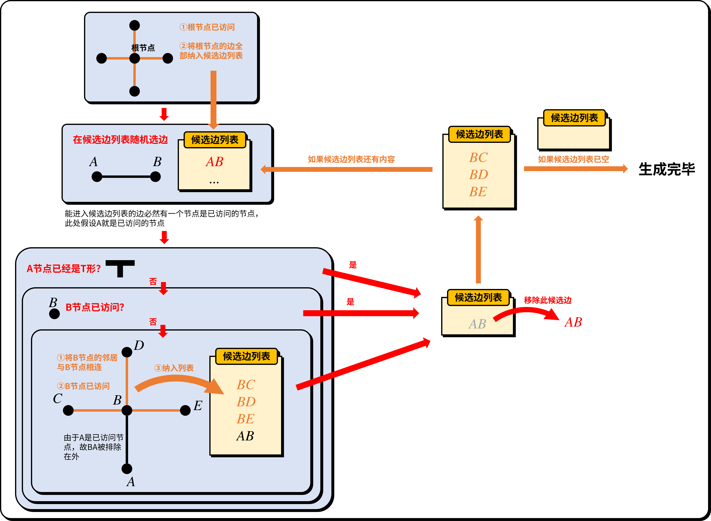
<p style="color: gray;">Figure 5: Prim algorithm flow chart</p>
</div>

### 2.2 Tarjan algorithm
To find a loop, you essentially need to find a cut point. Tarjan proposed an extremely classic local decision condition. For a parent node in the DFS tree$u$and its child nodes$v$,have:

$$\text{low}(v) \ge \text{dfn}(u)$$

in`dfn`is the traversal count of the node. Whenever an unvisited node is encountered,`dfn`will increase by 1, so it is always increasing, recording the order in which each node is traversed.`low`Refers to: slave node$A$Start and continue traversing forward. Under the premise of directly backtracking, follow other paths to traverse all the nodes you can reach.`dfn`The smallest, that is, the earliest traversed node`dfn`value.

The meaning of this formula is: subtree$v$All nodes in , no matter how you traverse forward through reverse edges, you can only traverse at most$u$, cannot be crossed$u$Reach a node further upstream. Therefore, once the$u$Delete, subtree$v$will be completely isolated. therefore,$u$It is a cutting point. In DFS back to$u$At that moment, the program only needs to check the child node's$\text{low}(v)$Whether this condition is met, it can be determined that the$u$The part of the subgraph that is the dividing line is an independent loop.

When searching deeper, all traversed nodes and edges (neighbor nodes) are pushed onto the stack in sequence. Since DFS guarantees the continuity of search, when backtracking to a certain node$u$satisfy$\text{low}(v) \ge \text{dfn}(u)$When, at this time, the top of the stack reaches the child node$v$All the elements in between are exactly all the members in this loop. At this time, the algorithm only needs to continuously pop elements from the stack until the$v$Also pops up. The complete Tarjan algorithm looks like this:

::: details Tarjan algorithm

```python
class Tile:
  def __init__(self, x, y):
    self.dfn = 0
    self.low = 0
    self.pos = (x, y)
    self.side = bytearray([0, 0, 0, 0])
    self.state = "none"

def neighbours(current_tile: Tile):
  neighbour_tiles = []
  x, y = current_tile.pos
  directions = [
    (-1, 0, 0, 2),
    (0, -1, 1, 3),
    (1, 0, 2, 0),
    (0, 1, 3, 1)
  ]
  for dx, dy, current_side, neighbour_side in directions:
    if (x + dx, y + dy) in grid:
      neighbour_tile = grid[(x + dx, y + dy)]
      if current_tile.side[current_side] == 1 and neighbour_tile.side[neighbour_side] == 1:
        neighbour_tiles.append(neighbour_tile)
  return neighbour_tiles

stack = []
dfn_counter = 0
warn_tiles_count = 0

def dfs(current_tile: Tile, parent: Tile):
  global dfn_counter, stack, warn_tiles_count
  dfn_counter += 1
  current_tile.low = dfn_counter
  current_tile.dfn = dfn_counter
  current_tile.state = "flood"
  stack.append(current_tile)
  for neighbour_tile in neighbours(current_tile):
    if neighbour_tile == parent:
      continue
    if neighbour_tile.state == "none":
      dfs(neighbour_tile, current_tile)
      current_tile.low = min(current_tile.low, neighbour_tile.low)
      if neighbour_tile.low >= current_tile.dfn:
        pop_tiles = []
        while True:
          pop_tile = stack.pop()
          pop_tiles.append(pop_tile)
          if pop_tile == neighbour_tile:
            break
        pop_tiles.append(current_tile)
        if len(pop_tiles) >= 3:
          for t in pop_tiles:
            warn_tiles_count += 1
            t.state = "warn"
    elif neighbour_tile.state == "flood":
      current_tile.low = min(current_tile.low, neighbour_tile.dfn)
```

:::

### 2.3 Specific process
The entire game can be divided into two major modules: generation and problem solving. The generation process can be divided into the following stages:
1. Initialize the disk and draw the grid according to the required length and width.
2. Maps were generated using randomized Prim's algorithm.
3. Shuffle the entire board randomly.
4. Display the panel to the player.

When the player is solving a puzzle, the Tarjan algorithm must be run every time any water pipe on the disk is rotated to detect whether the player has completed the puzzle at any time. After this program is executed, the disk is displayed to the player.

## 3. Code implementation
The specific game process has been fully explained in Section 2.3. Refer to the pseudocode given in Chapter 2, and then you can use mcf to write the specific code.

### 3.1 Grid
The first thing you need to determine is the size of the entire disk. This project is configured with a scoring item`[pipes.var]`, the grid width of a game is given by`#width`Storage, height by`#height`storage. All data of the grid is stored in command storage`pipes:grid`Within, use a two-dimensional list`grid`, where the first-level list stores data in the width direction of the grid, and the second-level list stores data in the height direction of the grid.`grid`The data in corresponds to the nodes in the actual grid in rows and columns. The node in the upper left corner of the grid is`grid[0][0]`, coordinate in width direction$x$Increase to the right, coordinate in height direction$y$Increasing downward, the node in the lower right corner is`grid[&lt;width-1&gt;][&lt;height-1&gt;]`。
<div style="text-align:center">
  

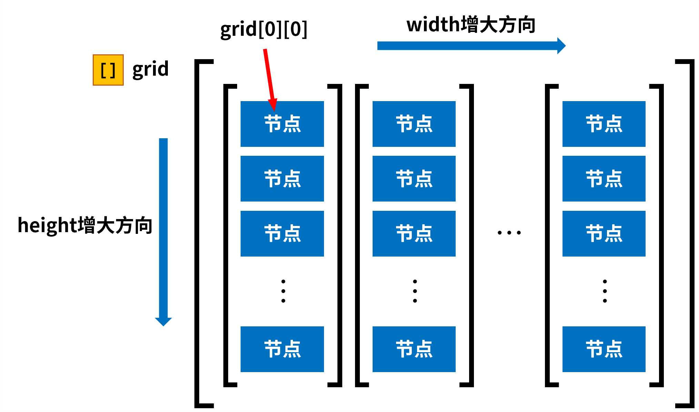
<p style="color: gray;">Figure 6: Grid data diagram</p>
</div>

each of them`grid[x][y]`All have the following data:
<div class="nbttree">

<node type="compound" name=""/> Node root tag
- <node type="int" name="index"/>The index of the node, counting from 1, calculated as`&lt;index&gt;=&lt;x&gt;+&lt;y&gt;*&lt;width&gt;+1`。
- <node type="int" name="parent_x"/>The parent node of this node$x$ coordinate。
- <node type="int" name="parent_y"/>The parent node of this node$y$ coordinate。
- <node type="byte_list" name="side"/>The connection status of the node in the four directions. There are 4 elements in the array, representing the four directions of left, up, right, and down in turn, among which`0b`is not connected,`1b`for connection.
- <node type="bool" name="source"/>Whether the node is the root node.
- <node type="byte" name="state"/>The status of the node,`0b`For nothing,`1b`For irrigation,`2b`as a warning,`3b`To be visited.
- <node type="bool" name="visited"/>Whether the node has been visited during the generation phase has no practical effect during the game phase.
- <node type="int" name="x"/>The node's$x$ coordinate。
- <node type="int" name="y"/>The node's$y$ coordinate。
</div>

Next generate the initialized entire mesh:

::: details data\pipes\function\grid\.mcfunction

```mcfunction
data modify storage pipes:grid grid set value []
scoreboard players set #x pipes.var 0
function pipes:grid/width
scoreboard players reset #tile_index pipes.var
```

:::

::: details data\pipes\function\grid\width.mcfunction

```mcfunction
scoreboard players set #y pipes.var 0
data modify storage pipes:grid grid append value []
function pipes:grid/height
scoreboard players add #x pipes.var 1
execute if score #x pipes.var < #width pipes.var run function pipes:grid/width
```

:::

::: details data\pipes\function\grid\height.mcfunction

```mcfunction
data modify storage pipes:grid grid[-1] append value {side:[B;0b,0b,0b,0b],visited:false}
execute store result storage pipes:grid grid[-1][-1].x int 1.0 run scoreboard players get #x pipes.var
execute store result storage pipes:grid grid[-1][-1].y int 1.0 run scoreboard players get #y pipes.var
scoreboard players operation #tile_index pipes.var = #y pipes.var
scoreboard players operation #tile_index pipes.var *= #height pipes.var
scoreboard players operation #tile_index pipes.var += #x pipes.var
scoreboard players add #tile_index pipes.var 1
execute store result storage pipes:grid grid[-1][-1].index int 1.0 run scoreboard players get #tile_index pipes.var
scoreboard players add #y pipes.var 1
execute if score #y pipes.var < #height pipes.var run function pipes:grid/height
```

:::

### 3.2 Generate map
Use the following command to set the width and height of the grid to be generated:
```
scoreboard players set #width pipes.var <width>
scoreboard players set #height pipes.var <height>
```


The following function can then be executed:

::: details data\pipes\function\prim\process.mcfunction

```mcfunction
scoreboard players enable @s pipes.operation

#生成特定大小的方格
function pipes:grid/

#创建候选边列表
data modify storage pipes:prim alternative_side set value []

#确定起始生成的格子
scoreboard players operation #starting_tile_x pipes.var = #width pipes.var
scoreboard players operation #starting_tile_x pipes.var /= #2 pipes.constant
scoreboard players operation #starting_tile_y pipes.var = #height pipes.var
scoreboard players operation #starting_tile_y pipes.var /= #2 pipes.constant
data modify storage pipes:prim cache.current.tile set value [I;0,0]
execute store result storage pipes:prim cache.current.tile[0] int 1.0 run scoreboard players get #starting_tile_x pipes.var
execute store result storage pipes:prim cache.current.tile[1] int 1.0 run scoreboard players get #starting_tile_y pipes.var

#把当前的格子标记为已访问
execute store result storage pipes:prim macro.x int 1.0 run scoreboard players get #starting_tile_x pipes.var
execute store result storage pipes:prim macro.y int 1.0 run scoreboard players get #starting_tile_y pipes.var
function pipes:prim/visit_source with storage pipes:prim macro

#创建起始格子的候选边
data modify storage pipes:prim cache.current.side set value [B;-1b,0b]
data modify storage pipes:prim alternative_side append from storage pipes:prim cache.current
data modify storage pipes:prim cache.current.side set value [B;0b,-1b]
data modify storage pipes:prim alternative_side append from storage pipes:prim cache.current
data modify storage pipes:prim cache.current.side set value [B;1b,0b]
data modify storage pipes:prim alternative_side append from storage pipes:prim cache.current
data modify storage pipes:prim cache.current.side set value [B;0b,1b]
data modify storage pipes:prim alternative_side append from storage pipes:prim cache.current

#主函数：生成地图
function pipes:prim/main/

#打乱管道
function pipes:upset/

#显示生成结果
function pipes:operation/tarjan/
function pipes:display/

#删除候选边列表
data remove storage pipes:prim alternative_side
```

:::

This function actually covers the entire random Prim algorithm generation process. Here the root node is forced to be located within the entire$w \times h$The node at the center of the grid. Due to the characteristics of the quotient operation itself, when the width and height are even numbers, the coordinate of the central node is actually$(\cfrac{w}{2} + 1, \cfrac{h}{2} + 1)$. In the previous pseudocode, the root node needs to be accessed, and the function used to access the root node is as follows:

::: details data\pipes\function\prim\visit_source.mcfunction

```mcfunction
$data modify storage pipes:grid grid[$(x)][$(y)] merge value {source:true,state:3b,visited:true}
```

:::

#### 3.2.1 Candidate edge list
storage`pipes:prim`is a dedicated storage for the stochastic Prim algorithm, and the candidate edge list is one of its fields`alternative_side`. Since it actually stores edge data rather than node data, the contents of the elements in the list are different from the node data. Hereinafter, the node to which the candidate edge belongs is called "**current node**", and the node in the direction in which the candidate edge extends is called "**neighbor node**". Each candidate edge has the following data:
<div class="nbttree">

<node type="compound" name=""/> Candidate edge root tag
- <node type="byte_list" name="index"/>The direction of the candidate edge has a total of 2 elements. The previous element is`
- 1b`When , it means that this side extends to the left; for`1b`When , this edge extends to the right. The next element is`
- 1b`When , it means that this side extends upward; it is`1b`, this edge extends downward, and there are actually only 4 valid values: left`[B;-1b,0b]`,superior`[B;0b,-1b]`,right`[B;1b,0b]`,Down`[B;0b,1b]`。
- <node type="int_list" name="parent_x"/>The coordinate of the current node, there are 2 elements in total, in order$x$、$y$ coordinate。
</div>

For the loop part in the pseudocode, it is completed by the following function:

::: details data\pipes\function\prim\main\.mcfunction

```mcfunction
#从候选边列表抽取
execute store result storage pipes:prim macro.length_of_alternative_side int 1.0 run data get storage pipes:prim alternative_side
function pipes:prim/main/random with storage pipes:prim macro

#删除这一项
function pipes:prim/main/remove with storage pipes:prim macro

#递归
execute if data storage pipes:prim alternative_side[0] run function pipes:prim/main/
```

:::

This function is used to extract edges from a list of candidate edges:

::: details data\pipes\function\prim\main\random.mcfunction

```mcfunction
$execute store result score #random_in_alternative_side pipes.var run random value 1..$(length_of_alternative_side) pipes:prim
execute store result storage pipes:prim macro.random int 1.0 run scoreboard players remove #random_in_alternative_side pipes.var 1
function pipes:prim/main/check_connection_conditions with storage pipes:prim macro
```

:::

::: details data\pipes\function\prim\main\check_connection_conditions.mcfunction

```mcfunction
$data modify storage pipes:prim cache.current set from storage pipes:prim alternative_side[$(random)]
execute store result score #current_x pipes.var run data get storage pipes:prim cache.current.tile[0]
execute store result score #current_y pipes.var run data get storage pipes:prim cache.current.tile[1]
execute store result score #neighbour_x pipes.var run data get storage pipes:prim cache.current.side[0]
execute store result score #neighbour_y pipes.var run data get storage pipes:prim cache.current.side[1]
scoreboard players operation #neighbour_x pipes.var += #current_x pipes.var
scoreboard players operation #neighbour_y pipes.var += #current_y pipes.var
execute store result storage pipes:prim macro.x int 1.0 run scoreboard players get #current_x pipes.var
execute store result storage pipes:prim macro.y int 1.0 run scoreboard players get #current_y pipes.var
execute store result storage pipes:prim macro.neighbour_x int 1.0 run scoreboard players get #neighbour_x pipes.var
execute store result storage pipes:prim macro.neighbour_y int 1.0 run scoreboard players get #neighbour_y pipes.var
function pipes:prim/main/get_current_and_neighbour with storage pipes:prim macro

#检查邻居节点是否未访问
execute if data storage pipes:prim cache.tile_check.neighbour{visited:true} run return fail

#检查本节点是否已是T形管
execute if data storage pipes:prim cache.tile_check.current{side:[B;1b,1b,1b,0b]} run return fail
execute if data storage pipes:prim cache.tile_check.current{side:[B;1b,1b,0b,1b]} run return fail
execute if data storage pipes:prim cache.tile_check.current{side:[B;1b,0b,1b,1b]} run return fail
execute if data storage pipes:prim cache.tile_check.current{side:[B;0b,1b,1b,1b]} run return fail

#如果上面的检查都通过了，就进行下面的内容
#连接邻居节点和当前节点
execute if data storage pipes:prim cache.current{side:[B;-1b,0b]} run function pipes:prim/main/connect/left with storage pipes:prim macro
execute if data storage pipes:prim cache.current{side:[B;0b,-1b]} run function pipes:prim/main/connect/up with storage pipes:prim macro
execute if data storage pipes:prim cache.current{side:[B;1b,0b]} run function pipes:prim/main/connect/right with storage pipes:prim macro
execute if data storage pipes:prim cache.current{side:[B;0b,1b]} run function pipes:prim/main/connect/down with storage pipes:prim macro

#将邻居节点标记为已访问
function pipes:prim/visit_neighbour with storage pipes:prim macro

#将邻居节点纳入候选边列表
scoreboard players operation #left_tile pipes.var = #neighbour_x pipes.var
scoreboard players remove #left_tile pipes.var 1
execute store result storage pipes:prim macro.left int 1.0 run scoreboard players get #left_tile pipes.var
scoreboard players operation #up_tile pipes.var = #neighbour_y pipes.var
scoreboard players remove #up_tile pipes.var 1
execute store result storage pipes:prim macro.up int 1.0 run scoreboard players get #up_tile pipes.var
scoreboard players operation #right_tile pipes.var = #neighbour_x pipes.var
scoreboard players add #right_tile pipes.var 1
execute store result storage pipes:prim macro.right int 1.0 run scoreboard players get #right_tile pipes.var
scoreboard players operation #down_tile pipes.var = #neighbour_y pipes.var
scoreboard players add #down_tile pipes.var 1
execute store result storage pipes:prim macro.down int 1.0 run scoreboard players get #down_tile pipes.var
function pipes:prim/main/neighbour_alternative_tiles with storage pipes:prim macro
```

:::

::: details data\pipes\function\prim\main\get_current_and_neighbour.mcfunction

```mcfunction
$data modify storage pipes:prim cache.tile_check.current set from storage pipes:grid grid[$(x)][$(y)]
$data modify storage pipes:prim cache.tile_check.neighbour set from storage pipes:grid grid[$(neighbour_x)][$(neighbour_y)]
```

:::

#### 3.2.2 Processing of neighbor nodes
When the neighbor node is not visited and the current node is not a T-tube, it is necessary to connect the neighbor node and the current node, taking the left side as an example:

::: details data\pipes\function\prim\main\connect\left.mcfunction

```mcfunction
$data modify storage pipes:grid grid[$(x)][$(y)].side[0] set value 1b
$data modify storage pipes:grid grid[$(neighbour_x)][$(neighbour_y)].side[2] set value 1b
```

:::

This actually puts the current node`side`The 0th element of (representing the left) is set to`1b`, put the neighbor nodes`side`The 2nd element of (representing the right) is set to`1b`. The same applies to other directions.

Neighbor nodes are then marked as visited:

::: details pipes-minigame\data\pipes\function\prim\visit_neighbour.mcfunction

```mcfunction
$data modify storage pipes:grid grid[$(neighbour_x)][$(neighbour_y)].visited set value true
```

:::

The final step is to include all available edges of neighbor nodes into the candidate edge list:

::: details data\pipes\function\prim\main\neighbour_alternative_tiles.mcfunction

```mcfunction
data modify storage pipes:prim cache.neighbour.tile set value [I;0,0]
data modify storage pipes:prim cache.neighbour.tile[0] set from storage pipes:prim macro.neighbour_x
data modify storage pipes:prim cache.neighbour.tile[1] set from storage pipes:prim macro.neighbour_y
#左
$execute store result score #visited pipes.var run data get storage pipes:grid grid[$(left)][$(neighbour_y)].visited
execute unless score #left_tile pipes.var matches ..-1 unless score #visited pipes.var matches 1 run function pipes:prim/main/neighbour/left
scoreboard players reset #visited pipes.var
#上
$execute store result score #visited pipes.var run data get storage pipes:grid grid[$(neighbour_x)][$(up)].visited
execute unless score #up_tile pipes.var matches ..-1 unless score #visited pipes.var matches 1 run function pipes:prim/main/neighbour/up
scoreboard players reset #visited pipes.var
#右
$execute store result score #visited pipes.var run data get storage pipes:grid grid[$(right)][$(neighbour_y)].visited
execute unless score #right_tile pipes.var >= #width pipes.var unless score #visited pipes.var matches 1 run function pipes:prim/main/neighbour/right
scoreboard players reset #visited pipes.var
#下
$execute store result score #visited pipes.var run data get storage pipes:grid grid[$(neighbour_x)][$(down)].visited
execute unless score #down_tile pipes.var >= #height pipes.var unless score #visited pipes.var matches 1 run function pipes:prim/main/neighbour/down
scoreboard players reset #visited pipes.var
```

:::

Still taking the left side of the neighbor node as an example, and so on in other directions:

::: details data\pipes\function\prim\main\neighbour\left.mcfunction

```mcfunction
data modify storage pipes:prim cache.neighbour.side set value [B;-1b,0b]
data modify storage pipes:prim alternative_side append from storage pipes:prim cache.neighbour
```

:::

#### 3.2.3 Delete candidate edges
After the operation on a candidate edge is completed, the candidate edge needs to be deleted from the candidate edge list because it has been processed and the part of the graph related to it has been determined.

::: details data\pipes\function\prim\main\remove.mcfunction

```mcfunction
$data remove storage pipes:prim alternative_side[$(random)]
execute store result score #test pipes.var run data get storage pipes:prim alternative_side
```

:::

### 3.3 Disrupt the pipeline
After executing the complete stochastic Prim algorithm program, the developer obtained a perfect tree. but`grid`The data stored is still in the form of a tree and does not have the characteristics of a water pipe puzzle. So the next step is to disrupt the pipeline. Here you need to traverse the complete grid and randomly rotate each node:

::: details data\pipes\function\upset\.mcfunction

```mcfunction
data modify storage pipes:grid cache.processing_data set from storage pipes:grid grid
data modify storage pipes:grid cache.processing_data_cache set value []
function pipes:upset/width
data modify storage pipes:grid grid set from storage pipes:grid cache.processing_data_cache
data remove storage pipes:grid cache.processing_data
data remove storage pipes:grid cache.processing_data_cache
```

:::

::: details data\pipes\function\upset\width.mcfunction

```mcfunction
data modify storage pipes:grid cache.processing_data_cache append value []
function pipes:upset/height
data remove storage pipes:grid cache.processing_data[0]
execute if data storage pipes:grid cache.processing_data[0] run function pipes:upset/width
```

:::

::: details data\pipes\function\upset\height.mcfunction

```mcfunction
data modify storage pipes:grid cache.upset set from storage pipes:grid cache.processing_data[0][0]
function pipes:upset/random
data modify storage pipes:grid cache.processing_data_cache[-1] append from storage pipes:grid cache.upset
data remove storage pipes:grid cache.processing_data[0][0]
execute if data storage pipes:grid cache.processing_data[0][0] run function pipes:upset/height
```

:::

::: details data\pipes\function\upset\random.mcfunction

```mcfunction
execute store result score #upset pipes.var run random value 1..4 pipes:prim
execute if score #upset pipes.var matches 1 run return run function pipes:upset/1
execute if score #upset pipes.var matches 2 run return run function pipes:upset/2
execute if score #upset pipes.var matches 3 run function pipes:upset/3
```

:::

This function is used to randomly rotate a single node, and the random value is specified as`1`rotate clockwise once, it is`2`rotate clockwise 2 times, it is`3`rotate clockwise 3 times, it is`4`No rotation occurs. Nodal`side`is an array containing 4 elements. Move the last element of the array to position 0, that is, the original connection information on the lower side is moved to the left, and other directions change in sequence, which is to complete a clockwise rotation.
<div style="text-align:center">
  

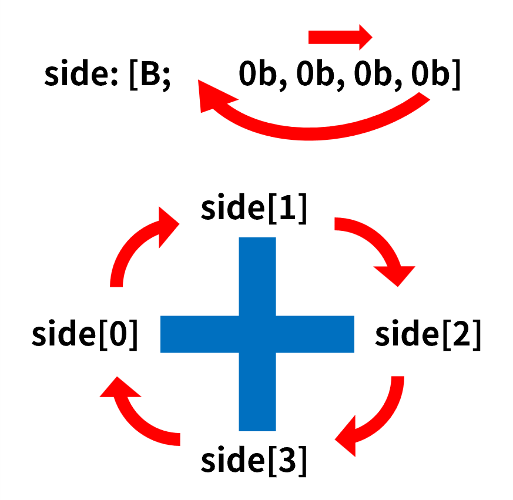
<p style="color: gray;">Figure 7: Rotation of nodes</p>
</div>

Therefore, the function used to rotate once is

::: details data\pipes\function\upset\1.mcfunction

```mcfunction
data modify storage pipes:grid cache.upset.side prepend from storage pipes:grid cache.upset.side[-1]
data remove storage pipes:grid cache.upset.side[-1]
```

:::

Rotating multiple times can repeatedly execute these two commands within the function.

### 3.4 Game process
The player's operations need to be monitored.`pipes.operation`It is a trigger-type scoring item. When the player rotates any node, the player's score on the scoring item is set to the corresponding node's score.`index`, so as to identify which node the player rotates. See Chapter 4 for the specific implementation method. The advancement used by the listening operation is as follows:

::: details data\pipes\advancement\operation.json

```json
{
  "criteria": {
    "rotate": {
      "conditions": {
        "player": [
          {
            "condition": "minecraft:any_of",
            "terms": [
              {
                "condition": "minecraft:entity_scores",
                "entity": "this",
                "scores": {
                  "pipes.operation": {
                    "min": 1
                  }
                }
              },
              {
                "condition": "minecraft:entity_scores",
                "entity": "this",
                "scores": {
                  "pipes.operation": -1
                }
              }
            ]
          }
        ]
      },
      "trigger": "minecraft:tick"
    }
  },
  "rewards": {
    "function": "pipes:operation/trigger/"
  }
}
```

:::

::: details data\pipes\function\operation\trigger\.mcfunction

```mcfunction
#旋转管道
advancement revoke @s only pipes:operation
execute store result storage pipes:grid macro.tile_index int 1.0 run scoreboard players get @s pipes.operation
function pipes:operation/trigger/tile with storage pipes:grid macro
scoreboard players reset @s pipes.operation
scoreboard players enable @s pipes.operation

#解题判定
function pipes:operation/tarjan/

#显示操作后的图
function pipes:display/

#音效
playsound item.book.page_turn player @s
```

:::

The following function is used to rotate nodes:

::: details data\pipes\function\operation\trigger\tile.mcfunction

```mcfunction
$data modify storage pipes:grid cache.processing_tile set from storage pipes:grid grid[][{index:$(tile_index)}]
data modify storage pipes:grid cache.processing_tile.side prepend from storage pipes:grid cache.processing_tile.side[-1]
data remove storage pipes:grid cache.processing_tile.side[-1]
$data modify storage pipes:grid grid[][{index:$(tile_index)}] set from storage pipes:grid cache.processing_tile
data remove storage pipes:grid cache.display
```

:::

Note that a problem-solving judgment needs to be run after each operation of the player. According to the Python code in Section 2.2, the function of this part is as follows:

::: details data\pipes\function\operation\tarjan\.mcfunction

```mcfunction
#重置计数器
scoreboard players reset #flood_tiles_count pipes.var

#重置状态
function pipes:operation/reset/
data modify storage pipes:grid stack set value []
data modify storage pipes:grid DFS set value []
scoreboard players set #dfn_counter pipes.var 0
scoreboard players set #warn_tiles_count pipes.var 0

#进入深度优先搜索
data modify storage pipes:grid DFS append value {}
data modify storage pipes:grid DFS[-1].current_tile set from storage pipes:grid grid[][{source:true}]
execute store result score #max_x pipes.var run data get storage pipes:grid grid
execute store result score #max_y pipes.var run data get storage pipes:grid grid[0]
scoreboard players remove #max_x pipes.var 1
scoreboard players remove #max_y pipes.var 1
scoreboard players reset #parent_x pipes.var
scoreboard players reset #parent_y pipes.var
function pipes:operation/tarjan/dfs/
data remove storage pipes:grid stack
data remove storage pipes:grid DFS

#判断是否全部灌水
scoreboard players operation #total pipes.var = #width pipes.var
scoreboard players operation #total pipes.var *= #height pipes.var
scoreboard players operation #flood_tiles_count pipes.var = #dfn_counter pipes.var
scoreboard players operation #flood_tiles_count pipes.var -= #warn_tiles_count pipes.var
execute unless score #total pipes.var = #flood_tiles_count pipes.var run return run tag @s remove pipes.win
tag @s add pipes.win
```

:::

#### 3.4.1 Reset status
Each problem-solving judgment needs to clear the data left in the grid nodes from the previous judgment.`state`, otherwise it will cause confusion in this judgment process:

::: details data\pipes\function\operation\reset\.mcfunction

```mcfunction
data modify storage pipes:grid cache.processing_data set from storage pipes:grid grid
function pipes:operation/reset/width
data modify storage pipes:grid grid set from storage pipes:grid cache.processing_data_cache
data remove storage pipes:grid cache.processing_data
data remove storage pipes:grid cache.processing_data_cache
```

:::

::: details data\pipes\function\operation\reset\width.mcfunction

```mcfunction
data modify storage pipes:grid cache.processing_data_cache append value []
function pipes:operation/reset/height
data remove storage pipes:grid cache.processing_data[0]
execute if data storage pipes:grid cache.processing_data[0] run function pipes:operation/reset/width
```

:::

::: details data\pipes\function\operation\reset\height.mcfunction

```mcfunction
data modify storage pipes:grid cache.processing_data_cache[-1] append from storage pipes:grid cache.processing_data[0][0]
data modify storage pipes:grid cache.processing_data_cache[-1][-1].state set value 0b
data remove storage pipes:grid cache.processing_data_cache[-1][-1].dfn
data remove storage pipes:grid cache.processing_data_cache[-1][-1].low
data remove storage pipes:grid cache.processing_data_cache[-1][-1].parent
data remove storage pipes:grid cache.processing_data[0][0]
execute if data storage pipes:grid cache.processing_data[0][0] run function pipes:operation/reset/height
```

:::

#### 3.4.2 Tarjan main loop
Below is the function that Tarjan's algorithm needs to run recursively. Since Minecraft's scoreboard and command storage are global variables, an explicit stack is needed to coordinate recursive operations.

::: details data\pipes\function\operation\tarjan\dfs\.mcfunction

```mcfunction
execute store result storage pipes:grid DFS[-1].current_tile.low int 1.0 store result storage pipes:grid DFS[-1].current_tile.dfn int 1.0 run scoreboard players add #dfn_counter pipes.var 1
data modify storage pipes:grid DFS[-1].current_tile.state set value 1b
function pipes:operation/tarjan/dfs/set_current with storage pipes:grid DFS[-1].current_tile
data modify storage pipes:grid stack append from storage pipes:grid DFS[-1].current_tile

#检查邻居
function pipes:operation/tarjan/dfs/neighbour/
execute if data storage pipes:grid DFS[-1].neighbour_tile[0] run function pipes:operation/tarjan/dfs/neighbours
```

:::

::: details data\pipes\function\operation\tarjan\dfs\set_current.mcfunction

```mcfunction
$data modify storage pipes:grid grid[$(x)][$(y)] merge from storage pipes:grid DFS[-1].current_tile
```

:::

in`DFS`is the explicit stack required for recursive functions,`stack`is the stack required by Tarjan's algorithm. It should also be noted here that`DFS`The internal storage is`grid`Snapshot data of the actual data at a certain moment. When the actual data changes,`DFS`The data inside will not change accordingly. Therefore, you need to use the snapshot data in the stack with caution. It is best to use the address saved by the stack, such as`index`、`x`、`y`, use the address to access the actual data.

#### 3.4.3 Create neighbor list
This part is the corresponding part in the Python code`neighbours`function, converting it into a mcf function as shown below:

::: details data\pipes\function\operation\tarjan\dfs\neighbour\.mcfunction

```mcfunction
execute store result score #current_x pipes.var run data get storage pipes:grid DFS[-1].current_tile.x
execute store result score #current_y pipes.var run data get storage pipes:grid DFS[-1].current_tile.y

#左侧邻居
scoreboard players operation #neighbour_x pipes.var = #current_x pipes.var
scoreboard players remove #neighbour_x pipes.var 1
execute store result storage pipes:grid macro.neighbour_x int 1.0 run scoreboard players get #neighbour_x pipes.var
execute store result storage pipes:grid macro.neighbour_y int 1.0 run scoreboard players get #current_y pipes.var
execute if score #neighbour_x pipes.var matches 0.. run function pipes:operation/tarjan/dfs/neighbour/left with storage pipes:grid macro

#上侧邻居
scoreboard players operation #neighbour_y pipes.var = #current_y pipes.var
scoreboard players remove #neighbour_y pipes.var 1
execute store result storage pipes:grid macro.neighbour_x int 1.0 run scoreboard players get #current_x pipes.var
execute store result storage pipes:grid macro.neighbour_y int 1.0 run scoreboard players get #neighbour_y pipes.var
execute if score #neighbour_y pipes.var matches 0.. run function pipes:operation/tarjan/dfs/neighbour/up with storage pipes:grid macro

#右侧邻居
scoreboard players operation #neighbour_x pipes.var = #current_x pipes.var
scoreboard players add #neighbour_x pipes.var 1
execute store result storage pipes:grid macro.neighbour_x int 1.0 run scoreboard players get #neighbour_x pipes.var
execute store result storage pipes:grid macro.neighbour_y int 1.0 run scoreboard players get #current_y pipes.var
execute if score #neighbour_x pipes.var <= #max_x pipes.var run function pipes:operation/tarjan/dfs/neighbour/right with storage pipes:grid macro

#下侧邻居
scoreboard players operation #neighbour_y pipes.var = #current_y pipes.var
scoreboard players add #neighbour_y pipes.var 1
execute store result storage pipes:grid macro.neighbour_x int 1.0 run scoreboard players get #current_x pipes.var
execute store result storage pipes:grid macro.neighbour_y int 1.0 run scoreboard players get #neighbour_y pipes.var
execute if score #neighbour_y pipes.var <= #max_y pipes.var run function pipes:operation/tarjan/dfs/neighbour/down with storage pipes:grid macro
```

:::

Take the neighbor on the left as an example:

::: details data\pipes\function\operation\tarjan\dfs\neighbour\left.mcfunction

```mcfunction
execute store result score #connect pipes.var run data get storage pipes:grid DFS[-1].current_tile.side[0]
execute unless score #connect pipes.var matches 1 run return fail
$execute store result score #connect pipes.var run data get storage pipes:grid grid[$(neighbour_x)][$(neighbour_y)].side[2]
execute unless score #connect pipes.var matches 1 run return fail

$data modify storage pipes:grid DFS[-1].neighbour_tile append from storage pipes:grid grid[$(neighbour_x)][$(neighbour_y)]
```

:::

Determining whether the neighbor node is connected to the current node is to determine the current node`side`The 0th element and neighbor nodes of`side`Is the 2nd element of`1b`. The writing method for other directions can be deduced in the same way.

#### 3.4.4 Traversing neighbor nodes
After establishing the neighbor node list, traverse the neighbor nodes in the list:

::: details data\pipes\function\operation\tarjan\dfs\neighbours.mcfunction

```mcfunction
function pipes:operation/tarjan/dfs/check_neighbours
data remove storage pipes:grid DFS[-1].neighbour_tile[0]
execute if data storage pipes:grid DFS[-1].neighbour_tile[0] run function pipes:operation/tarjan/dfs/neighbours
```

:::

::: details data\pipes\function\operation\tarjan\dfs\check_neighbours.mcfunction

```mcfunction
execute store result score #parent_tile_index pipes.var run data get storage pipes:grid DFS[-1].current_tile.parent
function pipes:operation/tarjan/dfs/get_neighbour with storage pipes:grid DFS[-1].neighbour_tile[0]
execute store result score #neighbour_tile_index pipes.var run data get storage pipes:grid DFS[-1].neighbour_tile[0].index

#邻居节点是否不是当前节点的父节点
execute if score #parent_tile_index pipes.var = #neighbour_tile_index pipes.var run return fail

#判断邻居节点的状态
#无
execute store result score #neighbour_tile_state pipes.var run data get storage pipes:grid DFS[-1].neighbour_tile[0].state
execute if score #neighbour_tile_state pipes.var matches 0 run function pipes:operation/tarjan/dfs/none/

#灌水
execute store result score #neighbour_tile_state pipes.var run data get storage pipes:grid DFS[-1].neighbour_tile[0].state
execute if score #neighbour_tile_state pipes.var matches 1 run function pipes:operation/tarjan/dfs/flood
```

:::

::: details data\pipes\function\operation\tarjan\dfs\get_neighbour.mcfunction

```mcfunction
$data modify storage pipes:grid DFS[-1].neighbour_tile[0] set from storage pipes:grid grid[][{index:$(index)}]
```

:::

#### 3.4.5 Function executed when the neighbor node’s status is not visited
When the status of the neighbor node is unvisited, DFS recursion needs to be performed to set the neighbor node as the current node to search the tree depth-first. When the sub-layer recursion ends and returns to this layer (that is, the sub-tree is fully traversed and returned to this node), the current node's`low`, and in$\text{low}(n) \ge \text{dfn}(c)$When popping all loops in the stack.

::: details data\pipes\function\operation\tarjan\dfs\none\.mcfunction

```mcfunction
#DFS递归
function pipes:operation/tarjan/dfs/none/dfs with storage pipes:grid DFS[-1].neighbour_tile[0]

#当前节点和邻居节点的low取较小值
execute store result score #current_tile_low pipes.var run data get storage pipes:grid DFS[-1].current_tile.low
function pipes:operation/tarjan/dfs/none/get_neighbour_low with storage pipes:grid DFS[-1].neighbour_tile[0]
scoreboard players operation #current_tile_low pipes.var < #neighbour_tile_low pipes.var
execute store result storage pipes:grid DFS[-1].current_tile.low int 1.0 run scoreboard players get #current_tile_low pipes.var
function pipes:operation/tarjan/dfs/set_current with storage pipes:grid DFS[-1].current_tile

#如果邻居节点的low大于等于当前节点的dfn
execute store result score #current_tile_dfn pipes.var run data get storage pipes:grid DFS[-1].current_tile.dfn
execute if score #neighbour_tile_low pipes.var >= #current_tile_dfn pipes.var run function pipes:operation/tarjan/dfs/neighbour_low
```

:::

::: details data\pipes\function\operation\tarjan\dfs\none\dfs.mcfunction

```mcfunction
execute store result score #current_tile_index pipes.var run data get storage pipes:grid DFS[-1].current_tile.index
data modify storage pipes:grid DFS append value {}
$data modify storage pipes:grid DFS[-1].current_tile set from storage pipes:grid grid[$(x)][$(y)]
execute store result storage pipes:grid DFS[-1].current_tile.parent int 1.0 run scoreboard players get #current_tile_index pipes.var
function pipes:operation/tarjan/dfs/
data remove storage pipes:grid DFS[-1]
```

:::

::: details data\pipes\function\operation\tarjan\dfs\none\get_neighbour_low.mcfunction

```mcfunction
$execute store result score #neighbour_tile_low pipes.var run data get storage pipes:grid grid[][{index:$(index)}].low
```

:::

::: details data\pipes\function\operation\tarjan\dfs\neighbour_low.mcfunction

```mcfunction
data modify storage pipes:grid pop_tiles set value []
function pipes:operation/tarjan/dfs/none/pop_tiles
data modify storage pipes:grid pop_tiles append from storage pipes:grid DFS[-1].current_tile
scoreboard players reset #length_of_pop_tiles pipes.var
execute store result score #length_of_pop_tiles pipes.var run data get storage pipes:grid pop_tiles
execute if score #length_of_pop_tiles pipes.var matches 3.. run function pipes:operation/tarjan/dfs/none/warn/
```

:::

::: details data\pipes\function\operation\tarjan\dfs\none\pop_tiles.mcfunction

```mcfunction
data modify storage pipes:grid pop_tiles append from storage pipes:grid stack[-1]
data remove storage pipes:grid stack[-1]
execute store result score #pop_tile_index pipes.var run data get storage pipes:grid pop_tiles[-1].index
execute store result score #neighbour_tile_index pipes.var run data get storage pipes:grid DFS[-1].neighbour_tile[0].index
execute unless score #pop_tile_index pipes.var = #neighbour_tile_index pipes.var run function pipes:operation/tarjan/dfs/none/pop_tiles
```

:::

::: details data\pipes\function\operation\tarjan\dfs\none\warn\.mcfunction

```mcfunction
scoreboard players add #warn_tiles_count pipes.var 1
function pipes:operation/tarjan/dfs/none/warn/macro with storage pipes:grid pop_tiles[-1]
data remove storage pipes:grid pop_tiles[-1]
execute if data storage pipes:grid pop_tiles[0] run function pipes:operation/tarjan/dfs/none/warn/
```

:::

::: details data\pipes\function\operation\tarjan\dfs\none\warn\macro.mcfunction

```mcfunction
$data modify storage pipes:grid grid[$(x)][$(y)].state set value 2b
```

:::

#### 3.4.6 Function executed when the status of the neighbor node is flooded
When the status of the neighbor node is flooded, the current node needs to be updated.`low`, making$\text{low}(c) = \text{dfn}(n)$, to prepare for the underlying recursive loop stack popping.

::: details data\pipes\function\operation\tarjan\dfs\flood.mcfunction

```mcfunction
execute store result score #current_tile_low pipes.var run data get storage pipes:grid DFS[-1].current_tile.low
execute store result score #neighbour_tile_dfn pipes.var run data get storage pipes:grid DFS[-1].neighbour_tile[0].dfn
scoreboard players operation #current_tile_low pipes.var < #neighbour_tile_dfn pipes.var
execute store result storage pipes:grid DFS[-1].current_tile.low int 1.0 run scoreboard players get #current_tile_low pipes.var
function pipes:operation/tarjan/dfs/set_current with storage pipes:grid DFS[-1].current_tile
```

:::

## 4. Visualization
So far, the core data of the game has been basically written, and now it needs to be visualized. At present, dialog has been used in the production of many mini-games, and the research on dialog UI has also matured. Therefore, this project will use dialog to display the water pipe mini-game. Generally speaking, the UI can be produced using native dialog buttons or in`body`Use font splicing with click events, and choose the latter for this project.

Each type of water pipe is given a code point and displayed as a specific bitmap font. Since the transparent part on the right side of the bitmap font will be removed, in order to align the grid as a whole, the bitmaps corresponding to all characters are designed to be unified.$16 \times 16$size. At the same time, since water pipes are divided into normal, filling, and warning states, as well as water pipes serving as water sources, multiple sets of different fonts need to be designed. When the status of the water pipe changes, changing the font used for the characters can change the appearance of the water pipe. The following table lists the code bits corresponding to all types of water pipes and the fonts used in different status water pipes.

**Table 1: Fonts used for water pipe characters, their namespaces are all pipes**
| | Corresponding characters | Ordinary water pipes | Water pipes for filling | Water pipes that generate warnings | Water sources |
| --- | --- | --- | --- | --- | --- |
| Font | - |`tube`|`tube_flooded`|`tube_warning`|`tube_source` |
| endpoint (left) | a |  |  | - |  |
| Endpoint (upper) | b |  |  | - |  |
| endpoint (right) | c |  |  | - |  |
| Endpoint (bottom) | d |  |  | - |  |
| Straight pipe ━ | e | |  |  |  |
| Straight pipe ┃ | f | |  |  |  |
| L-shaped elbow ┛ | g |  |  |  |  |
| L-shaped elbow ┗ | h |  |  |  |  |
| L-shaped elbow ┏ | i |  |  |  |  |
| L-shaped elbow ┓ | j |  |  |  |  |
| T-tube ┫ | k |  |  |  |  |
| T-tube ┻ | l |  |  |  |  |
| T-tube ┣ | m |  |  |  |  |
| T-tube ┳ | n |  |  |  |  |

in font`pipes:tube`For example, its configuration file looks roughly like this:

::: details assets\pipes\font\tube.json

```json
{
  "providers": [
    {
      "type": "bitmap",
      "file": "pipes:font/none/source/1.png",
      "height": 19,
      "ascent": 13,
      "chars": [
        "a"
      ]
    },
    {
      "type": "bitmap",
      "file": "pipes:font/none/source/2.png",
      "height": 19,
      "ascent": 13,
      "chars": [
        "b"
      ]
    },
    {
      "type": "bitmap",
      "file": "pipes:font/none/source/3.png",
      "height": 19,
      "ascent": 13,
      "chars": [
        "c"
      ]
    },
    {
      "type": "bitmap",
      "file": "pipes:font/none/source/4.png",
      "height": 19,
      "ascent": 13,
      "chars": [
        "d"
      ]
    },
    {
      "type": "bitmap",
      "file": "pipes:font/none/straight/1.png",
      "height": 19,
      "ascent": 13,
      "chars": [
        "e"
      ]
    },
    {
      "type": "bitmap",
      "file": "pipes:font/none/straight/2.png",
      "height": 19,
      "ascent": 13,
      "chars": [
        "f"
      ]
    },
    {
      "type": "bitmap",
      "file": "pipes:font/none/turn/12.png",
      "height": 19,
      "ascent": 13,
      "chars": [
        "g"
      ]
    },
    {
      "type": "bitmap",
      "file": "pipes:font/none/turn/23.png",
      "height": 19,
      "ascent": 13,
      "chars": [
        "h"
      ]
    },
    {
      "type": "bitmap",
      "file": "pipes:font/none/turn/34.png",
      "height": 19,
      "ascent": 13,
      "chars": [
        "i"
      ]
    },
    {
      "type": "bitmap",
      "file": "pipes:font/none/turn/41.png",
      "height": 19,
      "ascent": 13,
      "chars": [
        "j"
      ]
    },
    {
      "type": "bitmap",
      "file": "pipes:font/none/trible/1.png",
      "height": 19,
      "ascent": 13,
      "chars": [
        "k"
      ]
    },
    {
      "type": "bitmap",
      "file": "pipes:font/none/trible/2.png",
      "height": 19,
      "ascent": 13,
      "chars": [
        "l"
      ]
    },
    {
      "type": "bitmap",
      "file": "pipes:font/none/trible/3.png",
      "height": 19,
      "ascent": 13,
      "chars": [
        "m"
      ]
    },
    {
      "type": "bitmap",
      "file": "pipes:font/none/trible/4.png",
      "height": 19,
      "ascent": 13,
      "chars": [
        "n"
      ]
    },
    {
      "type": "bitmap",
      "file": "pipes:font/empty.png",
      "height": 19,
      "ascent": 13,
      "chars": [
        "o"
      ]
    }
  ]
}
```

:::

The nodes in the same row will be arranged in order from left to right, and then 2 newline characters will be added consecutively to continue to arrange the nodes in the next row. Adjacent characters within the line are added with a width of -2 spaces to ensure that the grid appears square as a whole. At the same time, each character should be a clickable text component for the player to rotate the specific pipe. Each click event should be equipped with the identification of the corresponding node so that the monitoring system can identify which node the player is rotating, such as:

::: details data\pipes\function\display\trigger.mcfunction

```mcfunction
$data modify storage pipes:grid cache.display.click_event.command set value "trigger pipes.operation set $(tile_index)"
```

:::

<div style="text-align:center">
  

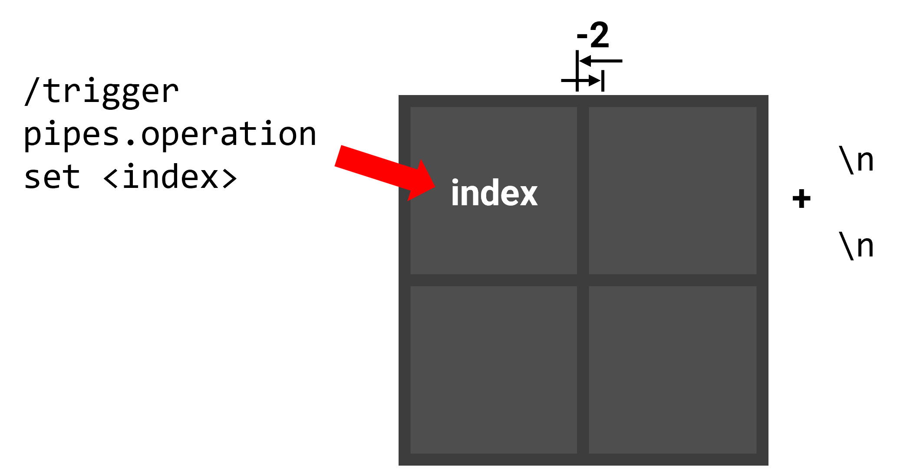
<p style="color: gray;">Figure 8: Visual layout plan</p>
</div>

Negative space fonts use the following definition:
::: details assets\pipes\font\tube_space.json

```json
{
  "providers": [
    {
      "type": "space",
      "advances": {
        "%": -2
      }
    }
  ]
}
```

:::

The following functions serve as entry points for visualization:

::: details data\pipes\function\display\.mcfunction (part)

```mcfunction
data remove storage pipes:grid display
data modify storage pipes:grid cache.processing_data set from storage pipes:grid grid
data modify storage pipes:grid display set value ["\n\n"]
data modify storage pipes:grid cache.processing_data_cache set value []
function pipes:display/height
function pipes:display/show with storage pipes:grid
data remove storage pipes:grid cache.processing_data
```

:::

Notice that the disk data is located in`grid`It is a two-dimensional list. According to Figure 6, its secondary list actually stores an entire column of nodes instead of an entire row of nodes, which is the so-called "column major order". But the displayed part obviously requires "row major order", so it can only be traversed`grid`, extract the 0th element of each list in turn, then extract the 1st element of each list, and so on.
<div style="text-align:center">
  

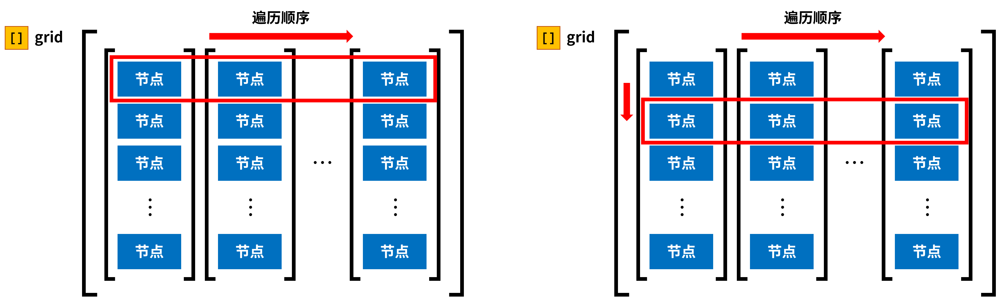
<p style="color: gray;">Figure 9: Traversal sequence of the visualization process</p>
</div>

This process uses the following functions:

::: details data\pipes\function\display\height.mcfunction

```mcfunction
function pipes:display/width
data modify storage pipes:grid display append value "\n\n"
data modify storage pipes:grid cache.processing_data set from storage pipes:grid cache.processing_data_cache
data remove storage pipes:grid cache.processing_data_cache
execute if data storage pipes:grid cache.processing_data[0][0] run function pipes:display/height
```

:::

::: details data\pipes\function\display\width.mcfunction

```mcfunction
data modify storage pipes:grid cache.processing_tile set from storage pipes:grid cache.processing_data[0][0]
function pipes:display/shapes
data modify storage pipes:grid macro.tile_index set from storage pipes:grid cache.processing_data[0][0].index
function pipes:display/trigger with storage pipes:grid macro
data modify storage pipes:grid display append from storage pipes:grid cache.display
execute if data storage pipes:grid cache.processing_tile{state:1b} run data modify storage pipes:grid display[-1].font set value "pipes:tube_flooded"
execute if data storage pipes:grid cache.processing_tile{state:2b} run data modify storage pipes:grid display[-1].font set value "pipes:tube_warning"
execute if data storage pipes:grid cache.processing_tile.source run data modify storage pipes:grid display[-1].font set value "pipes:tube_source"
data modify storage pipes:grid display append value {font:"pipes:tube_space",text:"%"}
data remove storage pipes:grid cache.processing_data[0][0]
data modify storage pipes:grid cache.processing_data_cache append from storage pipes:grid cache.processing_data[0]
data remove storage pipes:grid cache.processing_data[0]
execute if data storage pipes:grid cache.processing_data[0] run function pipes:display/width
```

:::

::: details data\pipes\function\display\shapes.mcfunction

```mcfunction
execute if data storage pipes:grid cache.processing_tile{side:[B;1b,0b,0b,0b]} run return run data modify storage pipes:grid cache.display set value {click_event:{action:"run_command",command:"trigger pipes.operation set -1"},font:"pipes:tube",text:"a"}
execute if data storage pipes:grid cache.processing_tile{side:[B;0b,1b,0b,0b]} run return run data modify storage pipes:grid cache.display set value {click_event:{action:"run_command",command:"trigger pipes.operation set -1"},font:"pipes:tube",text:"b"}
execute if data storage pipes:grid cache.processing_tile{side:[B;0b,0b,1b,0b]} run return run data modify storage pipes:grid cache.display set value {click_event:{action:"run_command",command:"trigger pipes.operation set -1"},font:"pipes:tube",text:"c"}
execute if data storage pipes:grid cache.processing_tile{side:[B;0b,0b,0b,1b]} run return run data modify storage pipes:grid cache.display set value {click_event:{action:"run_command",command:"trigger pipes.operation set -1"},font:"pipes:tube",text:"d"}
execute if data storage pipes:grid cache.processing_tile{side:[B;1b,0b,1b,0b]} run return run data modify storage pipes:grid cache.display set value {click_event:{action:"run_command",command:"trigger pipes.operation set -1"},font:"pipes:tube",text:"e"}
execute if data storage pipes:grid cache.processing_tile{side:[B;0b,1b,0b,1b]} run return run data modify storage pipes:grid cache.display set value {click_event:{action:"run_command",command:"trigger pipes.operation set -1"},font:"pipes:tube",text:"f"}
execute if data storage pipes:grid cache.processing_tile{side:[B;1b,1b,0b,0b]} run return run data modify storage pipes:grid cache.display set value {click_event:{action:"run_command",command:"trigger pipes.operation set -1"},font:"pipes:tube",text:"g"}
execute if data storage pipes:grid cache.processing_tile{side:[B;0b,1b,1b,0b]} run return run data modify storage pipes:grid cache.display set value {click_event:{action:"run_command",command:"trigger pipes.operation set -1"},font:"pipes:tube",text:"h"}
execute if data storage pipes:grid cache.processing_tile{side:[B;0b,0b,1b,1b]} run return run data modify storage pipes:grid cache.display set value {click_event:{action:"run_command",command:"trigger pipes.operation set -1"},font:"pipes:tube",text:"i"}
execute if data storage pipes:grid cache.processing_tile{side:[B;1b,0b,0b,1b]} run return run data modify storage pipes:grid cache.display set value {click_event:{action:"run_command",command:"trigger pipes.operation set -1"},font:"pipes:tube",text:"j"}
execute if data storage pipes:grid cache.processing_tile{side:[B;1b,1b,0b,1b]} run return run data modify storage pipes:grid cache.display set value {click_event:{action:"run_command",command:"trigger pipes.operation set -1"},font:"pipes:tube",text:"k"}
execute if data storage pipes:grid cache.processing_tile{side:[B;1b,1b,1b,0b]} run return run data modify storage pipes:grid cache.display set value {click_event:{action:"run_command",command:"trigger pipes.operation set -1"},font:"pipes:tube",text:"l"}
execute if data storage pipes:grid cache.processing_tile{side:[B;0b,1b,1b,1b]} run return run data modify storage pipes:grid cache.display set value {click_event:{action:"run_command",command:"trigger pipes.operation set -1"},font:"pipes:tube",text:"m"}
execute if data storage pipes:grid cache.processing_tile{side:[B;1b,0b,1b,1b]} run return run data modify storage pipes:grid cache.display set value {click_event:{action:"run_command",command:"trigger pipes.operation set -1"},font:"pipes:tube",text:"n"}
data modify storage pipes:grid cache.display set value {font:"pipes:tube",text:"o"}
```

:::

Finally, the dialog is displayed directly:

::: details data\pipes\function\display\show.mcfunction

```mcfunction
$dialog show @s {after_action:"none",body:{contents:$(display),type:"minecraft:plain_message",width:500},pause:false,title:"",type:"notice"}
```

:::

The displayed results are shown below. At this point, the water pipe mini game has been created.
<div style="text-align:center">
  

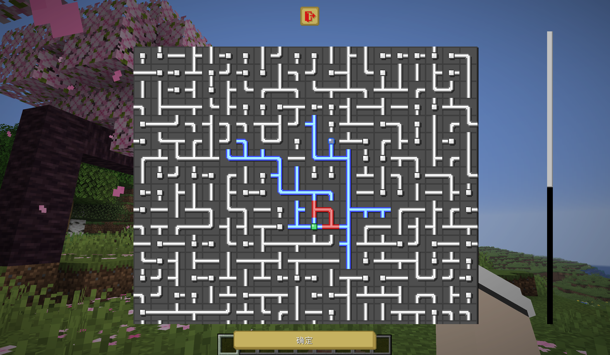
<p style="color: gray;">Figure 10: Final result</p>
</div>

## 5. Discussion
This project is completely data-driven, that is, only scoreboard and command are used to store and process all data. Therefore, function macros will inevitably be used in some places, which has a significant impact on performance. Observing the entire project, we can find that the vast majority of function macros are used for indexing list elements, especially`grid`The selection of internal nodes is usually accompanied by the traversal of the entire list or even the entire grid. for$5 \times 5$The performance of such a small water pipe is acceptable, but as the disk becomes larger, the command chain length and consumption time will also increase.

### 5.1 command chain length
Since the graph is randomly generated, the number and length of branches are inconsistent each time it is generated, so the length of the command chain run to complete a generation and make a problem-solving decision is not consistent. For example, the game rules`max_command_sequence_length`When set to 5000, try to generate$5 \times 5$The size of the graph was successfully generated only 393 times out of 1000 times, which means that the other 607 times were truncated because the command chain was too long.

In normal game flow, this midway truncation is obviously unacceptable. Therefore, it is necessary to explore how to`max_command_sequence_length`How high should it be set to ensure a 100% successful generation rate? The entire process of generating a water pipe map here includes initializing the grid, generating the map, disrupting the pipes, first trying to solve the problem and visualizing these operations. by$10 \times 10$size for example, different for each`max_command_sequence_length`Try to generate it 1000 times, and the result is as shown below:
<div style="text-align:center">
  

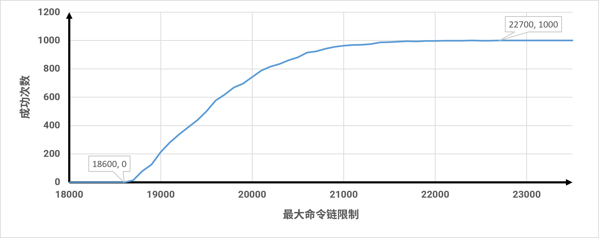
<p style="color: gray;">Figure 11: Curve chart of the number of successful generation times for 10x10 grid after 1000 attempts</p>
</div>

The data shows that the computational cost of the algorithm does not show a wide disordered burr distribution, but shows strong local cohesion and probabilistic long tail. There is an explosive jump in success rates between 18,700 and 21,000. The success rate plateaued from 21100 to 22600. This is essentially the probabilistic long tail caused by the algorithm's high-frequency triggering of idling pruning when generating cross-shaped nodes. Finally, the algorithm achieves absolute closed convergence at 22700 for thousands of samples. Due to the long tail of probability, the command chain length limit required to successfully generate a graph for a specific size grid needs to be increased. In this study, different side lengths ($N$) The absolute convergence threshold of the maximum command chain was measured on the square grid,`max_command_sequence_length`Taking thousands as the step length, the results obtained are as shown in the following table:

**Table 2: Critical threshold statistical table of algorithm command chain consumption at each grid scale**
| Grid side length ($N$) | Total number of nodes ($N^2$) | Absolute convergence threshold |
| --- | --- | --- |
| 4 | 16 | 5000 |
| 5 | 25 | 7000 |
| 6 | 36 | 10000 |
| 7 | 49 | 12000 |
| 8 | 64 | 15000 |
| 9 | 81 | 19000 |
| 10 | 100 | 23000 |
| 11 | 121 | 28000 |
| 12 | 144 | 32000 |
| 13 | 169 | 36000 |
| 14 | 196 | 42000 |
| 15 | 225 | 48000 |
| 16 | 256 | 55000 |
| 17 | 289 | 61000 |
| 18 | 324 | 67000 |
| 19 | 361 | 75000 |
| 20 | 400 | 82000 |

**The data in column 3 is required for grids of different sizes`max_command_sequence_length`The reference value can be adjusted according to the grid size during the actual running of the game. ** Based on the data in column 3, the grid changes from$4 \times 4$expand to$20 \times 20$, the total number of nodes has expanded to 25 times the original, but the command chain length has only expanded to about 16.4 times the original. This shows that the algorithm does not have any serious nested loops or logic out of control. The architectural design is relatively healthy on a macro scale. The upper bound of the time complexity under the worst working condition is$O(N^2)$. Vertical comparison of the command allocation rate of a single node shows that in$4\times4$At the scale, the average single node calculation density is 313 items/grid, while at$20\times20$At scale, the indicator converges to 205 items/grid. This marginal diminishing effect of computing power shows that the algorithm's global initialization redundant overhead is quickly diluted as the topology scale increases, and the execution efficiency of the loop body remains highly flat, demonstrating the excellent adaptability of the algorithm architecture for long-term giant level generation.

### 5.2 Time consumed
This study also tested the time it took to generate water pipes with meshes of different sizes. The device used was an i7-14650HX CPU and a GeForce RTX 4060 GPU. The study only tested square grids with side lengths of 5, 10, 15, and 20, each set was tested 1,000 times. The test uses Minecraft’s native stopwatch, which is only used for rough testing. The specific method is as follows:
```mcfunction
stopwatch restart pipes:debug
execute store result score #time1 pipes.var run stopwatch query pipes:debug 1000
#程序
execute store result score #time pipes.var run stopwatch query pipes:debug 1000
scoreboard players operation #time pipes.var -= #time1 pipes.var
```


The measured data is plotted into a box plot as shown below, in milliseconds:
<div style="text-align:center">
  

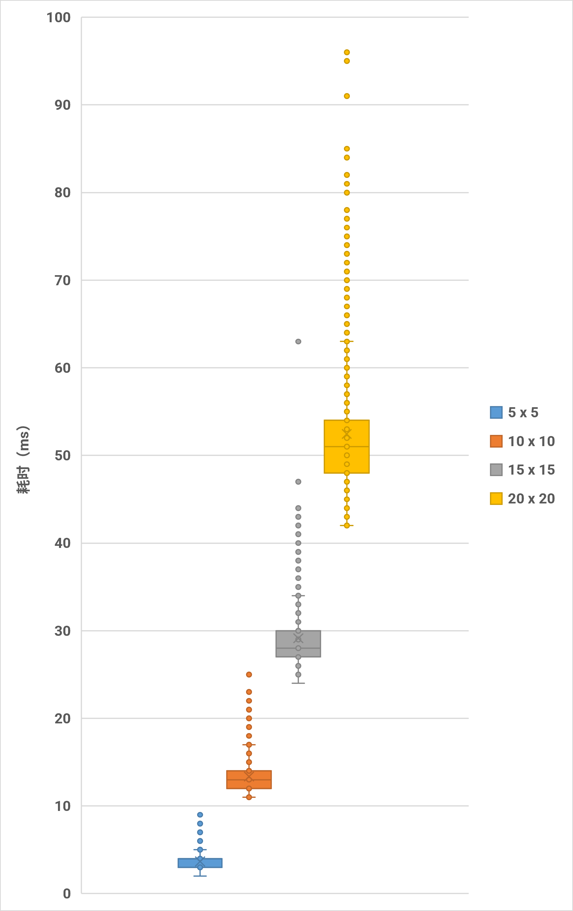
<p style="color: gray;">Figure 12: Box plot of time consuming for generating water connection pipes with grids of different sizes (unit: ms)</p>
</div>

**Table 3: Time-consuming statistics table for generating water pipes with different grid sizes**
| side length | 5 | 10 | 15 | 20 |
| --- | --- | --- | --- | --- |
| Average (ms) | 3.657 | 13.366 | 29.147 | 52.45 |
| Median (ms) | 4 | 13 | 28 | 51 |

Since Minecraft's default game tick rate is 20, the first three can all be completed within 1 tick. In addition, the average calculation time of a single node is between 0.130 ~ 0.146 milliseconds/grid, and the expansion factor of real hardware time consumption is synchronized with the expansion factor of area.

In addition, this study took$10 \times 10$In a grid of different sizes, 5 games are randomly played, and the number of steps in these 5 games is different. The test method is the same as above, the test object is function`pipes:operation/trigger/`. The results are plotted as a boxplot as shown below:
<div style="text-align:center">
  

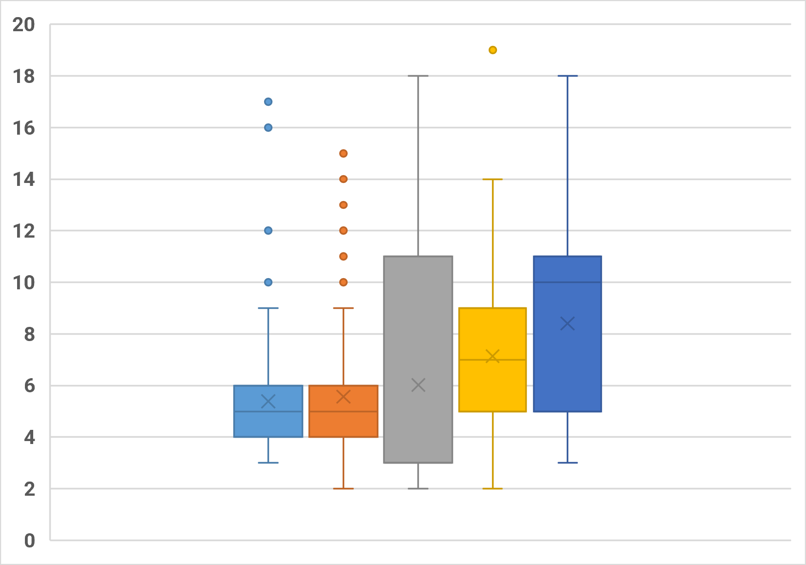
<p style="color: gray;">Figure 13: Box plot of time-consuming determination of 10 x 10 grid water pipe problem solving (unit: ms)</p>
</div>

The average problem-solving decision time caused by each operation is about 6.64 milliseconds, which is less than$10 \times 10$The time it takes to create the water pipe itself.

## 6. Summary
This project successfully designed and implemented a water pipe puzzle game generation and operation control system in the Minecraft vanilla game environment. The former is based on the random tree generation of the Prim algorithm, and the latter is based on the loop search of the Tarjan algorithm.

During the writing process of the core module, this project adhered to the "pure data-driven" architectural design, fully decoupling the grid topology and edge set status and storing them in the in-game scoreboard and command memory. With the corresponding pseudocode and Python code written in advance, the random Prim algorithm and Tarjan algorithm were successfully restored using vanilla command, and the algorithm time complexity under the worst working condition was strictly controlled.$O(N^2)$polynomial level.

Although this project ensures the system's excellent cross-version migration and logical purity through pure data drive, it faces$20\times20$and above, the data shows that the system still has performance bottlenecks that cannot be ignored. Since the list is naturally lacking$O(1)$Constant-level random addressing capability, the system frequently relies on function macros when selecting nodes. In view of this, future research can be based on other random maze generation algorithms or Minecraft-specific entity algorithms.

## References
[1] Meili Hegeman. Generating Pipes puzzles using maze-generating algorithms[D]. Leiden University, 2022.

[2] [Qibai, Xu Muxian. Advanced command storage: using stack management function context [J/OL]. Feature, 2026, 4(2).](https://cr-019.github.io/datapack-index/feature/archive/202604/4/content.html)

[3] [CR_019. Use dialog to create 2D mini-games[J/OL]. Feature, 2025, 6(1).](https://cr-019.github.io/datapack-index/feature/archive/202506/5/content.html)

[4] [Xu Muxian. Dialog multi-input control design based on bitwise operations and multi-base coding[J/OL]. Feature, 2025, 11(1).](https://cr-019.github.io/datapack-index/feature/archive/202511/4/content.html)

[5] [CR_019. How to use the latest and hottest MC features to create exciting chess (Part 1) [J/OL]. Feature, 2026, 1(2).](https://cr-019.github.io/datapack-index/feature/archive/202601/d/content.html)

[6] [CR_019. How to use the latest and hottest MC features to make vanilla chess (Part 2) [J/OL]. Feature, 2026, 2(2).](https://cr-019.github.io/datapack-index/feature/archive/202602/4/content.html)

[7] [Dahesor. Brief description of data pack optimization principles and analysis methods[J/OL]. Feature, 2025, 4(1).](https://cr-019.github.io/datapack-index/feature/archive/202504/3/content.html)

[8] [Leather Sword. Starting from /stopwatch: Some random thoughts related to time detection[J/OL]. Feature, 2025, 10(1).](https://cr-019.github.io/datapack-index/feature/archive/202510/5/content.html)
