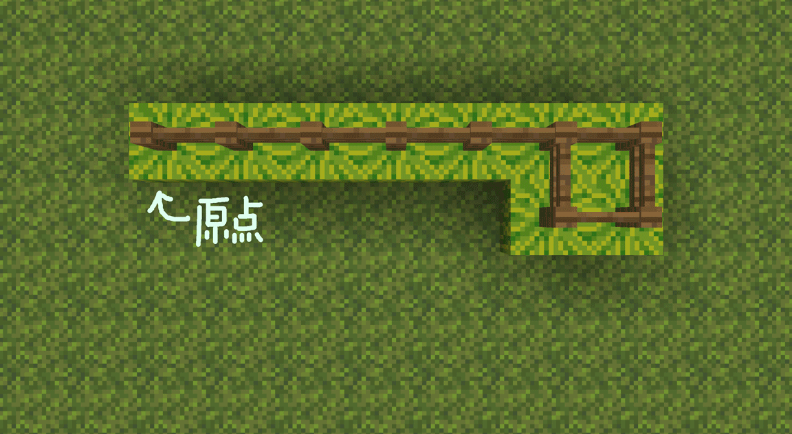
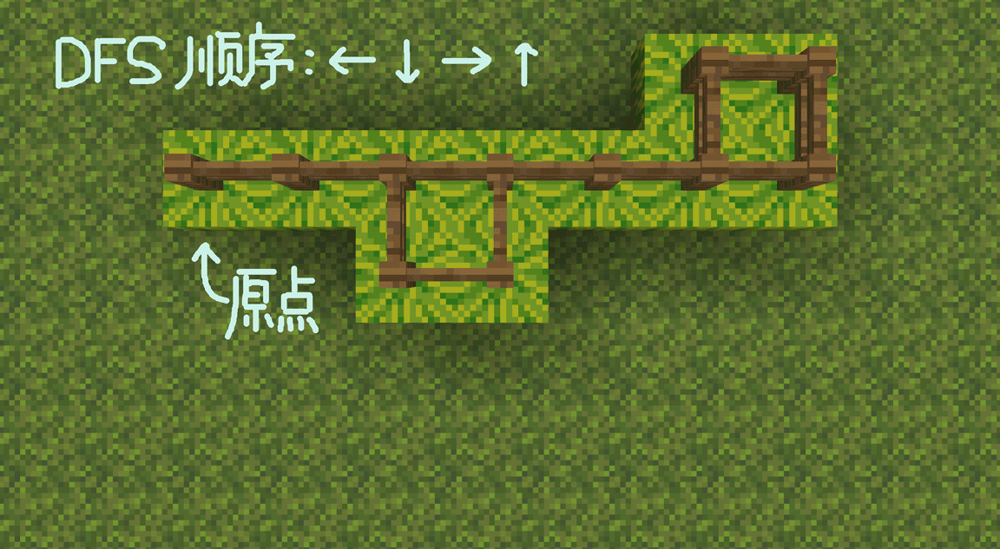
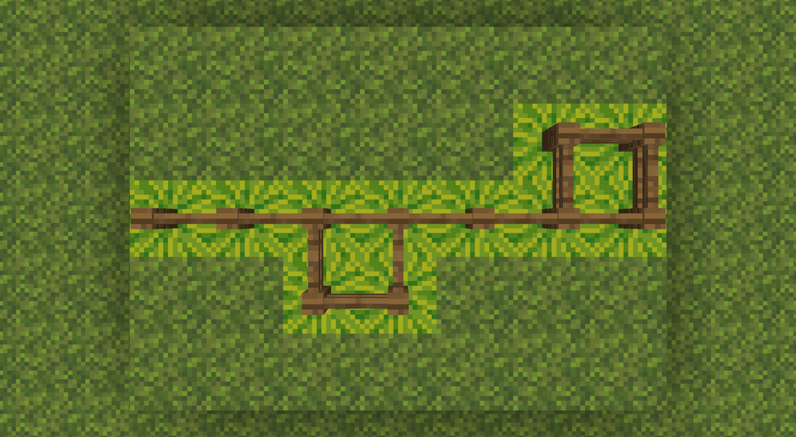
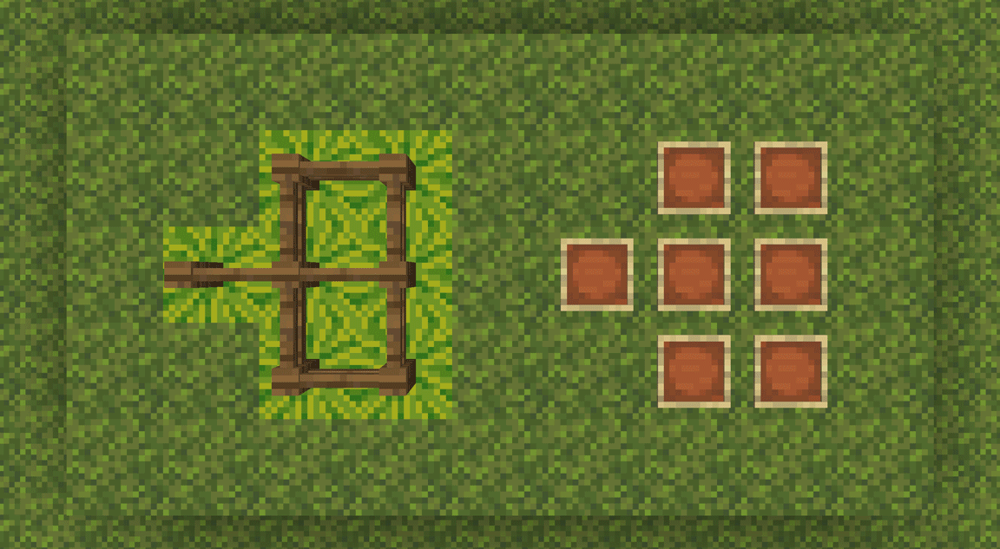
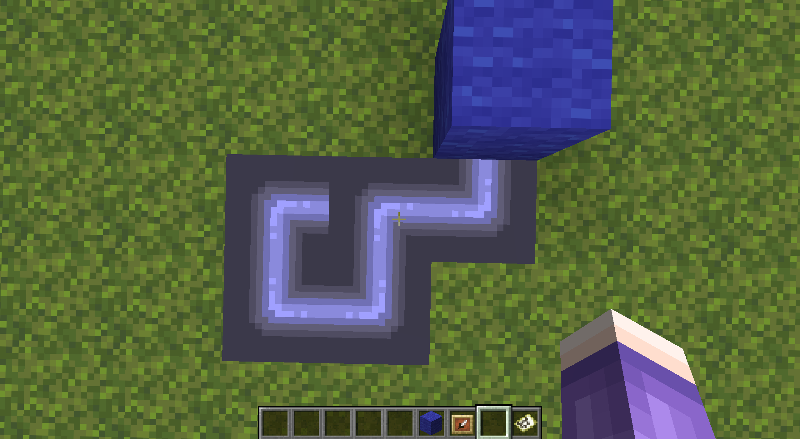
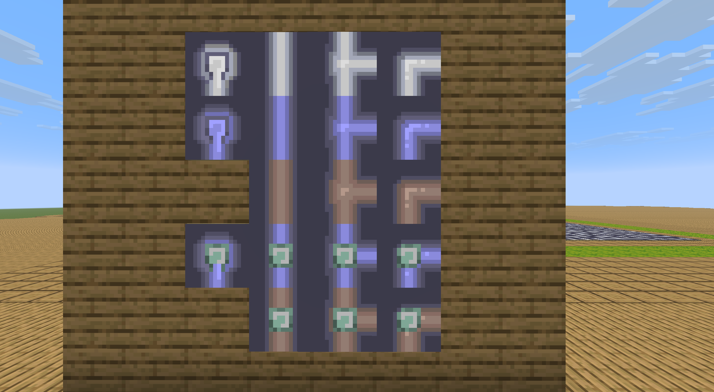

<FeaturedHead
    title="Implementation of water pipe map generation and verification (entity solution)"
    authorName="leather sword"
    cover = '../../../../../feature/archive/202606/_assets/1.png'
/>

:::tip Author's note
This article provides another solution for generating and testing the water pipe game map based on Prim and DFS algorithms.  
The book follows the [joint draft] of this month's issue by Hong Seyu and Xu Muxian (/feature/archive/202606/0/content.md) (hereinafter referred to as the first part).  
The original Prim implementation ideas provided by Hong Seyu are quite different from mine, but after modifications by Xu Muxian, the algorithms of the two sides are almost the same. Therefore, this article will not reintroduce the problem and algorithm. Readers in need are please read the previous article.

In order to facilitate readers' correspondence, the chapter numbers of this article will also be aligned with the previous part, which can be regarded as some kind of expansion of the previous part.
:::


The entity-based solution may be slightly worse than the data-based solution in terms of generation and processing (because it requires a lot of interaction with blocks and entities, but in fact it is not much worse, and the 30x30 range can be generated in 250~300ms).
But the advantage is that the structure is clear and concise, almost completely corresponding to the text description of the algorithm. There is no need to use macros repeatedly, making it easy for beginners to quickly create and understand.

At the same time, the entityization solution also facilitates the generation of more content under the same command chain length.
The scheme used in this article can generate a maximum map of 33x33 under the default command chain length (including disruption and initial inspection coloring).
## 2. Ideas and processes
### 2.2b Implementation of DFS inspection in the entityization solution
Since all data in the entityization solution runs in an actual block area, the DFS process does not involve establishing an actual stack or calling another entity.
In this solution, DFS is completed directly using the function stack. All participating entities are map display frames, and no artificial stack is created.  
Therefore, unlike the previous article, this solution cannot perform active backtracking and can only rely on the backtracking work of the function stack itself.

This solution uses the following node types:
-`dry`: The node has not been visited, and the corresponding block is Watermelon.
-`wet`: The node has been filled with water, and the corresponding block is a pumpkin lantern (which also plays the role of`parent`The function of the sign, which points to its direct water source in a non-loop, will be used later. )
    -`source`: This node is the water source, and the corresponding block is the bacterial light body. (Shared tag with Jack-O-Lantern`pipes:wet`。）
- `visiting`: The path DFS is currently taking, the corresponding block is a yellow frog light.`ochre_froglight`。
    - `conflict_n`: The number of conflicts at a location, that is, the number of attempts to access the location after having already passed the location once. This item is not recorded as a block but in the display box entity.`pipes_conflict`In the scoreboard, that is, it can exist simultaneously with the previous items.
    -`ring_n`: The node is in`n`on a ring. Same as above, recorded in the display box entity`pipes_ring`on the scoreboard.

It can be noted that compared with the previous part, this solution adds the "ongoing path" status in the DFS process. This directly prevents the loop type 1 in Figure 5 of the previous article from appearing (you can think about why), and the conflict will only be caused by "walking to the place where you have already walked again".  
Therefore, we use counting to process loop annotations during passive backtracking.

We provide the following examples to fully illustrate how such a scheme might be developed.  
In these examples, the original`ring`(equivalent to the current`ring_1`) status is displayed with a green frog light. The original`conflict`(equivalent to the current`conflict_1`) status is displayed with a purple frog light, but these two are different from`visiting`States are actually independent of each other.
#### 2.2b.1 Start with a ring
Assume that during the DFS process, one of the branches goes to a place that has already been traveled, forming a loop.
To simplify it a bit, the whole picture is one`q`shape. How to mark the ring?

We can find that if we encounter an area that we have already walked through, we will mark it as`conflict`state, the areas inside and outside the ring are separated by this.

The recursive backtracking process of DFS is the opposite of the search path, so when backtracking, we encounter`conflict`The place passed before the state is a loop, and the place passed after encountering it (that is, the area traveled before the loop was searched) is not part of the loop.

Since the entityization solution is not recorded like the previous part,`parent`chain (at least the global DFS part does not use this part of the data), we cannot use active backtracking for status annotation. However, the better thing about the entity solution is that it can easily select the entire image. Therefore, our plan is as follows:



At every step of DFS:
1. If the point is at`ring`status, it is returned. (Otherwise, a loop will be traveled twice, and the cost is exponential when there are multiple loops on the same road.)
2. If the point is already at`visiting`Status:
    - for all`visiting`The point of state (if it is a non-entity solution, active backtracking is required here) is added`ring`status, becomes`visiting_ring`state.
    - Add to this point`conflict`status, becomes`visiting_conflict_ring`state.
    - return.
3. Search in all non-source directions.
4. When backtracking, if the point has`conflict`Status:
    - for all simultaneous`visiting_ring`status point (excluding itself), clear it`ring`state.

In this way, we can mark the rings on the picture. The pseudo code is as follows:

```python
function dfs(now_tile,from_direction)
    if now_tile.RING do
        return
    if now_tile.state == VISITING do
        for tile in visiting_list do
            tile.RING = True
        now_tile.CONFLICT = True
        return
    
    now_tile.state = VISITING
    for direction in directions if has_edge(now_tile,direction) and not direction == from_direction do
        neighbor_tile = now_tile.neighbor(direction)
        if neighbor_tile.state == DRY do
            dfs(neighbor_tile,direction)
    
    now_tile.state = WET
    if now_tile.CONFLICT do
        for tile in visiting_list if tile.RING do
            tile.RING = False
        now_tile.CONFLICT = False
```
#### 2.2b.2 Multiple Ring Solution
However, this solution quickly became buggy.

In the picture below there are two rings in a row. The DFS process that was supposed to backtrack and complete the ring marking after finding the ring on the left left the range of the ring and searched for a new ring (right side) after marking but before backtracking.
Therefore, the tags in the left ring are cleared as out-of-ring areas after the DFS process backtracks from the right ring.



The solution is simple too. Since "covering" will cause conflicts, change "covering" to "overlay".
Specifically, put`ring`The status is changed to a numerical value. If a conflict is encountered, all nodes being visited will`ring`Add 1 to the value and subtract 1 if there is a backtracking conflict. The pseudo code is as follows:

```python
function dfs(now_tile,from_direction)
    if now_tile.RING >= 1 do
        return
    if now_tile.state == VISITING do
        for tile in visiting_list do
            tile.RING += 1
        now_tile.CONFLICT = True
        return
    
    now_tile.state = VISITING
    for direction in directions if has_edge(now_tile,direction) and not direction == from_direction do
        neighbor_tile = now_tile.neighbor(direction)
        if neighbor_tile.state == DRY do
            dfs(neighbor_tile,direction)
    
    now_tile.state = WET
    if now_tile.CONFLICT do
        for tile in visiting_list if tile.RING >= 1 do
            tile.RING -= 1
        now_tile.CONFLICT = False
```




Of course, at this point, the algorithm still has problems.

The two rings in the picture below (actually three rings in a sense) will conflict at the same position, that is, the "conflicts" also cover each other. This coverage will cause the DFS process to leave the ring in the area outside the ring.`ring`The value still does not return to 0, resulting in a line from the starting point to the ring being also marked as part of the ring.



But since we know that they cover each other, the solution is also obvious, which is to`conflict`The status is also changed to numerical record. The final pseudocode is as follows.

```python
function dfs(now_tile,from_direction)
    if now_tile.RING >= 1 do
        return
    if now_tile.state == VISITING do
        for tile in visiting_list do
            tile.RING += 1
        now_tile.CONFLICT += 1
        return
    
    now_tile.state = VISITING
    for direction in directions if has_edge(now_tile,direction) and not direction == from_direction do
        neighbor_tile = now_tile.neighbor(direction)
        if neighbor_tile.state == DRY do
            dfs(neighbor_tile,direction)
    
    now_tile.state = WET
    if now_tile.CONFLICT >= 1 do
        for tile in visiting_list if tile.RING >= 1 do
            tile.RING -= now_tile.CONFLICT
        now_tile.CONFLICT = 0
```
This forms the final algorithm for this part.
### 2.4 Partial Inspection
The test in the previous article is to clear all the markers on the map and re-run a complete DFS every time you click, which is actually quite a waste of performance for larger maps.

Considering that each click actually only changes the state of one grid, we can actually update only the map area that the grid changes with each click.

Unless directly interacting with a ring, the irrigation status of multiple directions connected by a grid is always independent of each other.  
We can divide a grid's update of the map into two categories: irrigation and drying.

These two types of changes are still completed by DFS, and the watering part completely shares the code with the full-map DFS (that is, the full-map update is equivalent to resetting all grids to a dry state and then starting watering from the water source);
The drying part is also very short, and only the filling part needs to be slightly modified. The pseudo code is as follows.

```python
function dfs_dry(now_tile,from_direction)
    if now_tile.state == VISITING do
        return
    
    now_tile.state = VISITING
    for direction in directions if not direction == from_direction do
        neighbor_tile = now_tile.neighbor(direction)
        if connected(now_tile,neighbor_tile) and neighbor_tile.state == WET do
            dfs(neighbor_tile,direction)
    
    now_tile.state = DRY
    now_tile.RING = 0
```
So, the key is how we determine what modifications to make.

If a grid was originally`dry`status, then you only need to check whether there is any lattice successfully connected to after modification.`wet`status. If so, just perform watering at the current location.
But if a grid was originally`wet`status, things are not easy to handle, because it is difficult for us to judge whether the grid will become dry only through the static information of the grid itself (even if the dependency relationship has been stored).

As for why, take a look at the example below.



Pay attention to the cell pointed by the pointer. Clicking on this cell will change it to connect the left and bottom.

Assuming that we can only obtain information about the grid and its surrounding 4 grid neighbors (including its dependency relationships), intuitively we may come up with this solution: check whether the connected neighbors around the grid have`wet`The status and attached water source are not the grid itself. If there is, it will continue to have water.

Unfortunately, this solution in this case would result in the loop still self-irrigating without drying out after being disconnected from the grid. Because of the possibility of loops (although no grid should be marked as being on a loop before or after the change in this example), grids that are not directly attached to the grid may still depend on the grid through another path. And if you consider looking for dependencies, then this is no longer a decision using only static information.

Therefore, this solution is handled as follows:
1. If a grid is`wet`status, update it dry first (as per the connection before rotation).
2. In this way, the grid is transformed into`dry`status, you can use the previous function to perform water updates.

This is not necessarily the most efficient solution, but it is certainly simpler.
### 2.4.1 Choices of partial inspections
The previous part of the inspection process actually did not consider loops at all. If the operated lattice is on the loop (the operation on the lattice outside the loop does not have this problem even if it affects the loop), then the irrigation states in multiple directions are not independent of each other, and the recorded dependencies will become confusing.

For example, the self-irrigation phenomenon mentioned above is very common when some tests encounter loops. Instead, the water source is often marked as a grid that depends on the loop, causing the entire map to dry up once the loop is disconnected.

In fact, this solution does not solve this problem well. In order to avoid introducing more troubles, the partial inspection of this plan will be downgraded to the full image inspection in the following three situations:
1. If the pipe formed in one operation connects more than 2 wet grids (that is, a ring is about to be formed)
2. If you operate on a grid on a ring
3. If the water source is operated (mainly to prevent the occurrence of bugs related to the water source loop)

However, we actually believe that there is a solution that can perfectly handle loops in part of the inspection process. Readers can also think about it. It would definitely be very good if it could be done.
## 3. Code implementation
Different from the previous article, we plan to use the game world (rather than dialog interaction) to place the map of the water pipe game.
we will$31*31$Take the map (with the water source in the center) as an example. Readers who need a smaller or larger map can change it themselves.
### 3.1b Grid
The field area is in the shape of a pool, but hose play is not played inside the field but on the surface of the field (called the "board"). The venue is used to store the data required for map generation.

The site range is$31*3*31$range, where the third layer stores whether each cell has been accessed, and the`1~2`The layers store the connecting edges in the x-axis direction and the z-axis direction respectively.
We agreed on watermelon`melon`Represents 0, pumpkin`pumpkin`represents 1. Under normal circumstances, the third layer must be filled with pumpkins after the run ends.

Specifically, with reference to the above requirements, we agree as follows.
- Only candidate edges (directed edges) use entity tags. In the generation phase, all marking entities that mark candidate edges are always active in the fourth layer (that is, all block surfaces), and block mark access is placed in the third layer.
    - The entity marking a candidate edge is always located at the starting point of the edge and faces the end point of the edge. All such entities contain tag`pipes_vec`and`pipes_(direction)`.
        - For example, the candidate edge entity facing the positive direction of the x-axis (east) also has a tag`pipes_vec`and`pipes_east`.
    - target selector`@e[type=marker,sort=random,tag=pipes_vec,limit=1]`It is equivalent to the above operation of randomly selecting an edge in the container V (candidate list).
    - if`execute if block ~ ~-1 ~ pumpkin`Success, for the candidate edge label entity, means that its starting point has been visited.
    - if`execute if block ^ ^-1 ^1 pumpkin`Success, for the candidate edge label entity, means that its end point has been visited.
- The 1st and 2nd layers store the edges (undirected edges) connecting the grids, forming a "block map". Generation and verification mainly rely on the "block map", but the disruption and visual interaction are handled by the "entity map".
    - In the generation phase, after the map is generated in the "block map" area, the corresponding display frame is placed and converted to the "entity map";
    - In the initial inspection stage, after the corresponding "block map" is regenerated from the disrupted "entity map", DFS traversal is performed according to the edges of the "block map";
    - Each subsequent operation on a grid will only update the edges connected to that grid in the "block map".
    - The second layer stores the connecting edges in the x-axis direction (relative to the player)`execute if block ~1 ~-2 ~1 pumpkin`It means whether there is a connecting edge between the points of coordinate (1,1) and (1,2).
    - The first layer stores the connecting edges in the z-axis direction (relative to the player)`execute if block ~1 ~-3 ~1 pumpkin`It means whether there is a connecting edge between the points of coordinate (1,1) and (2,1).
        - if`execute if block ~ ~-2 ~ pumpkin`Success means that the point has a connecting edge in the positive direction of the x-axis (east).
        - if`execute if block ~-1 ~-2 ~ pumpkin`Success means that the point has a connecting edge in the negative direction of the x-axis (west).
        - if`execute if block ~ ~-3 ~ pumpkin`Success means that the point has a connecting edge in the positive direction of the z-axis (south).
        - if`execute if block ~ ~-3 ~-1 pkmpkin`Success means that the point has a connecting edge in the negative direction of the z-axis (north).
- In addition to the map display frame of the "Water Source" grid of the map,`pipes_source`tag also owns`pipes_checkerboard`tag.
    - In other words, the display frame entity is the starting entity for all actions of the chessboard including generation and testing. See below for details.
### 3.2b Map generation and disruption
Readers are asked to refer to the pseudocode in Section 2.1 of the previous article before reading the generated code below.

function`pipes:generate/`(If there is a chessboard nearby, it will be executed by the water source entity, otherwise it will be executed by the player.)

```mcfunction
#If there is already a water source entity nearby, it will be executed instead, which is equivalent to regenerating the existing chessboard.
execute unless entity @s[tag=pipes_checkerboard] as @e[distance=..100,type=item_frame,tag=pipes_checkerboard] at @s run return run function pipes:generate/

#Venue initialization (31x31)
fill ~-16 ~-3 ~-16 ~16 ~-1 ~16 oak_log
fill ~-15 ~-3 ~-15 ~15 ~-1 ~15 melon

#Note: This item will also clear the water source entity of the existing chessboard.
kill @e[type=item_frame,tag=pipes]

#Visit the starting point and create initial candidate edges, which is basically the same as function pipes:generate/visit.
summon marker ~ ~ ~ {Rotation:[-90f,0f],Tags:["pipes_vec","pipes_east"]}
summon marker ~ ~ ~ {Rotation:[90f,0f],Tags:["pipes_vec","pipes_west"]}
summon marker ~ ~ ~ {Rotation:[0f,0f],Tags:["pipes_vec","pipes_south"]}
summon marker ~ ~ ~ {Rotation:[-180f,0f],Tags:["pipes_vec","pipes_north"]}
setblock ~ ~-1 ~ pumpkin

#Regenerate the water source display frame entity. Note that the entity cannot be selected via @s selector now.
summon item_frame ~ ~ ~ {Tags:["pipes","pipes_source","pipes_checkerboard"],Facing:1b,Invulnerable:1b,Item:{id:"filled_map"}}

#Prim algorithm generates game maps.
execute as @e[distance=..30,type=marker,tag=pipes_vec,sort=random,limit=1] at @s run function pipes:generate/prim

#For each grid, check its connected edges, and then visualize it using a map display box, that is, converting the "block map" into an "entity map".
execute as @e[distance=..30,type=item_frame,tag=pipes] at @s store result entity @s Item.components."minecraft:map_id" int 1 store result score @s pipes_tile_id_colored store result score @s pipes_tile_id run function pipes:generate/set_map/

#Disrupt the pipe in the "entity map" and immediately record the scrambled connection direction.
execute as @e[distance=..30,type=item_frame,tag=pipes] run function pipes:generate/after/shuffle

#Reset the site (that is, delete the original "block map"), recheck the connections on all sides after the disruption, and convert the new "entity map" back to the "block map". Note that if the site size is modified, the fill parameters later here need to be modified manually.
fill ~-15 ~-3 ~-15 ~15 ~-1 ~15 melon

#Reconnect the available edges in the x-axis direction. Only two adjacent grids that provide half edges can be connected. Clear the edges connected to the boundary to avoid some false positives.
execute at @e[distance=..30,type=item_frame,tag=pipes,tag=pipes_east] run setblock ~ ~-2 ~ pumpkin
fill ~15 ~-2 ~-15 ~15 ~-2 ~15 melon
execute at @e[distance=..30,type=item_frame,tag=pipes,tag=!pipes_west] run setblock ~-1 ~-2 ~ melon

#Reconnect in the z-axis direction, same as above.
execute at @e[distance=..30,type=item_frame,tag=pipes,tag=pipes_south] run setblock ~ ~-3 ~ pumpkin
fill ~-15 ~-3 ~15 ~15 ~-3 ~15 melon
execute at @e[distance=..30,type=item_frame,tag=pipes,tag=!pipes_north] run setblock ~ ~-3 ~-1 melon

#DFS performs initial watering and loop determination.
execute as @e[distance=..0,type=item_frame,tag=pipes_source] run function pipes:validate/dfs/wet/source
```
#### 3.2b.1 Main functions of Prim algorithm
function`pipes:generate/prim`
```mcfunction
#As soon as this candidate edge is checked, it will be deleted from the list. The preposition of kill here will not affect the subsequent @s selector determination.
kill @s

#If the condition does not pass, no connection will be made and the next candidate edge will be entered directly. Note that return must be preceded here, otherwise if the candidate edge list is empty, the edge will still be incorrectly connected.
execute if function pipes:generate/check run return run execute as @e[distance=..60,type=marker,tag=pipes_vec,sort=random,limit=1] at @s run function pipes:generate/prim

#connect this edge
execute if entity @s[tag=pipes_east] run setblock ~ ~-2 ~ pumpkin
execute if entity @s[tag=pipes_west] run setblock ~-1 ~-2 ~ pumpkin
execute if entity @s[tag=pipes_south] run setblock ~ ~-3 ~ pumpkin
execute if entity @s[tag=pipes_north] run setblock ~ ~-3 ~-1 pumpkin

#Visit the end point of this edge and create a new candidate edge
execute positioned ^ ^ ^1 run function pipes:generate/visit

#Randomly select the next candidate edge, and exit directly if it cannot be selected.
execute as @e[distance=..60,type=marker,tag=pipes_vec,sort=random,limit=1] at @s run function pipes:generate/prim
```

function `pipes:generate/check`(Returning 1 is a fail.)

```mcfunction
#If the end point is already occupied (think why not check the start point.)
execute unless block ^ ^-1 ^1 melon run return 1

#or if the starting point is already connected to 3 edges (think why not check the end point.)
execute unless block ~-1 ~-2 ~ pumpkin run return run execute if block ~ ~-3 ~-1 pumpkin if block ~ ~-2 ~ pumpkin if block ~ ~-3 ~ pumpkin
execute unless block ~ ~-3 ~-1 pumpkin run return run execute if block ~ ~-2 ~ pumpkin if block ~ ~-3 ~ pumpkin
execute unless block ~ ~-2 ~ pumpkin run return run execute if block ~ ~-3 ~ pumpkin
return run execute unless block ~ ~-3 ~ pumpkin
```

function `pipes:generate/visit`
```mcfunction
#Generate new candidate edges
execute if block ~1 ~-1 ~ melon run summon marker ~ ~ ~ {Rotation:[-90f,0f],Tags:["pipes_vec","pipes_east"]}
execute if block ~-1 ~-1 ~ melon run summon marker ~ ~ ~ {Rotation:[90f,0f],Tags:["pipes_vec","pipes_west"]}
execute if block ~ ~-1 ~1 melon run summon marker ~ ~ ~ {Rotation:[0f,0f],Tags:["pipes_vec","pipes_south"]}
execute if block ~ ~-1 ~-1 melon run summon marker ~ ~ ~ {Rotation:[-180f,0f],Tags:["pipes_vec","pipes_north"]}

#Mark the current location as visited
setblock ~ ~-1 ~ pumpkin

#Place map display frame
summon item_frame ~ ~ ~ {Tags:["pipes"],Facing:1b,Invulnerable:1b,Item:{id:"filled_map"}}
```
#### 3.2b.2 Disrupt and re-record related functions
function`pipes:generate/shuffle`(Performed by all map frames.)

```mcfunction
#Randomly disrupt water pipes
execute store result entity @s ItemRotation int 1 store result score @s pipes_tile_rot_new store result score @s pipes_tile_rot run random value 0..3

#Re-record the scrambled connection direction. This part involves the coordination of material preparation (see Chapter 4). In actual use, the content in the function can also be inlined.
function pipes:tile_update/
```
::: details non-general functions
This part of the function has nothing to do with the algorithm and is only related to material preparation.
If you reproduce according to the article, you can copy it directly, but if the prepared materials are not consistent with the article, only these parts need to be modified.

function`pipes:generate/set_map/`(written together)

```mcfunction
execute if block ~ ~-2 ~ pumpkin run return run function .../e:
    execute if block ~-1 ~-2 ~ pumpkin run return run function .../ew:
        execute unless block ~ ~-3 ~ pumpkin unless block ~ ~-3 ~-1 pumpkin run return 1
        return 2
    execute unless block ~ ~-3 ~ pumpkin unless block ~ ~-3 ~-1 pumpkin run return 0
    execute if block ~ ~-3 ~ pumpkin if block ~ ~-3 ~-1 pumpkin run return 2
    return 3
execute if block ~-1 ~-2 ~ pumpkin run return run function .../w:
    execute unless block ~ ~-3 ~ pumpkin unless block ~ ~-3 ~-1 pumpkin run return 0
    execute if block ~ ~-3 ~ pumpkin if block ~ ~-3 ~-1 pumpkin run return 2
    return 3
execute if block ~ ~-3 ~ pumpkin if block ~ ~-3 ~-1 pumpkin run return 1
return 0
```

function `pipes:tile_update/`(Not an independent function, see above)

```mcfunction
function .../01:
    execute if score @s pipes_tile_rot matches 0 run tag @s add pipes_south
    execute if score @s pipes_tile_rot matches 1 run tag @s add pipes_west
    execute if score @s pipes_tile_rot matches 2 run tag @s add pipes_north
    execute if score @s pipes_tile_rot matches 3 run tag @s add pipes_east
execute if score @s pipes_tile_id matches 1..2 run function .../02:
    execute if score @s pipes_tile_rot matches 0 run tag @s add pipes_north
    execute if score @s pipes_tile_rot matches 1 run tag @s add pipes_east
    execute if score @s pipes_tile_rot matches 2 run tag @s add pipes_south
    execute if score @s pipes_tile_rot matches 3 run tag @s add pipes_west
execute if score @s pipes_tile_id matches 2..3 run function .../03:
    execute if score @s pipes_tile_rot matches 0 run tag @s add pipes_east
    execute if score @s pipes_tile_rot matches 1 run tag @s add pipes_south
    execute if score @s pipes_tile_rot matches 2 run tag @s add pipes_west
    execute if score @s pipes_tile_rot matches 3 run tag @s add pipes_north
```
:::

#### 3.2b.3 Initial DFS related functions of the whole graph (will be used later)
function`pipes:validate/dfs/wet/source`(executed by water source)
and function`pipes:validate/dfs/wet/(four cardinal directions)`
```mcfunction
#Check for conflicts. You can comment out the following paragraph in the source function.
execute if block ~ ~-1 ~ ochre_froglight run return run function pipes:validate/dfs/wet/conflict/create
execute if entity @e[distance=..0.5,type=item_frame,tag=pipes,scores={pipes_ring=1..}] run return 0

#The status of the labeled grid is VISITING.
setblock ~ ~-1 ~ ochre_froglight

#DFS recursion. Comment out the line in the opposite direction of each direction function to avoid finding a 2-node loop all the time.
execute if block ~-1 ~-2 ~ pumpkin positioned ~-1 ~ ~ run function pipes:validate/dfs/wet/west
execute if block ~ ~-2 ~ pumpkin positioned ~1 ~ ~ run function pipes:validate/dfs/wet/east
execute if block ~ ~-3 ~-1 pumpkin positioned ~ ~ ~-1 run function pipes:validate/dfs/wet/north
execute if block ~ ~-3 ~ pumpkin positioned ~ ~ ~1 run function pipes:validate/dfs/wet/south

#The following content is unique to each direction function.
setblock ~ ~-1 ~ jack_o_lantern[facing=(opposite direction)]
execute as @e[distance=..0.5,type=item_frame,tag=pipes] run function pipes:validate/dfs/wet/after

#Since the source function is executed directly by itself, it can be directly @s selected. The following are the unique contents of the source function, replacing the afterfunction called in each direction.
setblock ~ ~-1 ~ shroomlight
execute if score @s pipes_conflict matches 1.. run function pipes:validate/dfs/wet/conflict/solve
scoreboard players operation @s pipes_tile_id_colored = @s pipes_tile_id
execute unless score @s pipes_ring matches 1.. store result entity @s Item.components."minecraft:map_id" int 1 run return run scoreboard players add @s pipes_tile_id_colored 12
execute store result entity @s Item.components."minecraft:map_id" int 1 run return run scoreboard players add @s pipes_tile_id_colored 16
```

function `pipes:validate/dfs/wet/after`
```mcfunction
execute if score @s pipes_conflict matches 1.. run function pipes:validate/dfs/wet/conflict/solve

scoreboard players operation @s pipes_tile_id_colored = @s pipes_tile_id
execute unless score @s pipes_ring matches 1.. store result entity @s Item.components."minecraft:map_id" int 1 run return run scoreboard players add @s pipes_tile_id_colored 4
execute store result entity @s Item.components."minecraft:map_id" int 1 run return run scoreboard players add @s pipes_tile_id_colored 8
```

function `pipes:validate/dfs/wet/conflict/create`
```mcfunction
execute as @e[distance=..60,type=item_frame,tag=pipes] at @s if block ~ ~-1 ~ ochre_froglight run scoreboard players add @s pipes_ring 1
scoreboard players add @e[distance=..0.5,type=item_frame,tag=pipes] pipes_conflict 1
```

function `pipes:validate/dfs/wet/conflict/solve`
```mcfunction
scoreboard players operation #conflict pipes = @s pipes_conflict
execute as @e[distance=..60,type=item_frame,tag=pipes,scores={pipes_ring=1..}] at @s if block ~ ~-1 ~ ochre_froglight run scoreboard players operation @s pipes_ring -= #conflict pipes
scoreboard players reset @s pipes_conflict
```
### 3.4b Game Process
Similar to the previous article, this solution also uses advancement to check player operations.

Unfortunately, it seems that it is not easy to select the clicked map display frame. Therefore, in order to select the display frame, the solution here requires one more step to check the number of rotations of all display frames.

advancement`pipes:click_frame`(The format is only applicable to versions after 26.2.)

```json
{"criteria":{"_":{"trigger":"player_interacted_with_entity",
"conditions":{"entity":{"entity_type":"item_frame","entity_tags":{"all_of":["pipes"]}}}}},"rewards":{"function":"pipes:trigger/"}}
```

function `pipes:trigger/`
```mcfunction
advancement revoke @s only pipes:frame
execute as @e[distance=..40,type=item_frame,tag=pipes_checkerboard,sort=nearest,limit=1] at @s run function pipes:trigger/checkerboard
```
See Section 2.2b for the basic idea. Since one version of the "block map" has been saved during generation, the second inspection can save a lot even if it is a full map inspection.

function`pipes:trigger/checkerboard`
```mcfunction
#Raise the item rotation angle to the scoreboard for future reference
execute as @e[distance=..30,type=item_frame,tag=pipes] store result score @s pipes_tile_rot_new run data get entity @s ItemRotation

#Find the changed grid. There will only be one grid where the function will run.
execute as @e[distance=..30,type=item_frame,tag=pipes] unless score @s pipes_tile_rot = @s pipes_tile_rot_new at @s run function pipes:trigger/tile/

#If the tag pipes_reloading is returned, it means that part of the inspection cannot be processed, and it will fall back to the full-graph DFS inspection.
execute unless entity @s[tag=pipes_reloading] run return run execute unless entity @e[distance=..30,type=item_frame,tag=pipes,scores={pipes_tile_id_colored=0..3}] run function pipes:goal
tag @s remove pipes_reloading

#Still facing a 31x31 map, if other sizes are needed this will need to be modified. Only fill the third layer and keep the "block map".
fill ~-15 ~-1 ~-15 ~15 ~-1 ~15 melon

#The main DFS process, calling the previous function
scoreboard players reset * pipes_ring
function pipes:validate/dfs/wet/source

#The dried grid should be stained
execute as @e[distance=..30,type=item_frame,tag=pipes,scores={pipes_tile_id_colored=4..}] at @s if block ~ ~-1 ~ melon store result entity @s Item.components."minecraft:map_id" int 1 run scoreboard players operation @s pipes_tile_id_colored = @s pipes_tile_id

#Test successful. Readers can define the effect of goalfunction by themselves.
execute unless entity @e[distance=..30,type=item_frame,tag=pipes,scores={pipes_tile_id_colored=0..3}] run function pipes:goal
```


function `pipes:trigger/tile/`
```mcfunction
#Refresh own rotation scoreboard value
execute store result entity @s ItemRotation int 1 store result score @s pipes_tile_rot run scoreboard players operation @s pipes_tile_rot_new %= #4 pipes

#Relabel connection direction
tag @s remove pipes_west
tag @s remove pipes_east
tag @s remove pipes_north
tag @s remove pipes_south
function pipes:tile_update/

#Get pre_(direction): which directions the grid is connected to after clicking
execute store success score #pre_east pipes if block ~ ~-2 ~ pumpkin
execute store success score #pre_west pipes if block ~-1 ~-2 ~ pumpkin
execute store success score #pre_south pipes if block ~ ~-3 ~ pumpkin
execute store success score #pre_north pipes if block ~ ~-3 ~-1 pumpkin

#According to the changes in the "entity map", update the connecting edges of the grid in the "block map".
execute positioned ~1 ~ ~ if entity @e[distance=..0.5,type=item_frame,tag=pipes_west] run setblock ~-1 ~-2 ~ pumpkin
execute positioned ~-1 ~ ~ if entity @e[distance=..0.5,type=item_frame,tag=pipes_east] run setblock ~ ~-2 ~ pumpkin
execute positioned ~ ~ ~1 if entity @e[distance=..0.5,type=item_frame,tag=pipes_north] run setblock ~ ~-3 ~-1 pumpkin
execute positioned ~ ~ ~-1 if entity @e[distance=..0.5,type=item_frame,tag=pipes_south] run setblock ~ ~-3 ~ pumpkin

execute at @s[tag=!pipes_east] run setblock ~ ~-2 ~ melon
execute at @s[tag=!pipes_west] run setblock ~-1 ~-2 ~ melon
execute at @s[tag=!pipes_south] run setblock ~ ~-3 ~ melon
execute at @s[tag=!pipes_north] run setblock ~ ~-3 ~-1 melon

#Get post_(direction): which directions the grid is connected to after clicking
execute store success score #post_east pipes if block ~ ~-2 ~ pumpkin
execute store success score #post_west pipes if block ~-1 ~-2 ~ pumpkin
execute store success score #post_south pipes if block ~ ~-3 ~ pumpkin
execute store success score #post_north pipes if block ~ ~-3 ~-1 pumpkin

#The previous "block map" update is necessary. Even if you want to roll back to the full map update, the previous steps still need to be done. After finishing, some grids can be returned directly.
execute if entity @s[tag=pipes_source] run return run tag @s add pipes_reloading
execute if score @s pipes_ring matches 1.. run return run tag @e[distance=..30,type=item_frame,tag=pipes_checkerboard] add pipes_reloading

#If it's dry, just look for water.
execute if block ~ ~-1 ~ melon run return run function pipes:trigger/tile/dry

#If it is wet, the function below will use the previous connection of the cell to make it dry.
setblock ~ ~-1 ~ ochre_froglight

execute if score #pre_west pipes matches 1 if block ~-1 ~-1 ~ #pipes:wet[facing=east] positioned ~-1 ~ ~ run function pipes:validate/dfs/dry/west
execute if score #pre_east pipes matches 1 if block ~1 ~-1 ~ #pipes:wet[facing=west] positioned ~1 ~ ~ run function pipes:validate/dfs/dry/east
execute if score #pre_north pipes matches 1 if block ~ ~-1 ~-1 #pipes:wet[facing=south] positioned ~ ~ ~-1 run function pipes:validate/dfs/dry/north
execute if score #pre_south pipes matches 1 if block ~ ~-1 ~1 #pipes:wet[facing=north] positioned ~ ~ ~1 run function pipes:validate/dfs/dry/south

setblock ~ ~-1 ~ melon
function pipes:trigger/tile/dry
```

function `pipes:trigger/tile/dry`
```mcfunction
#Count the number of water sources this grid will connect to
scoreboard players set #src_tot pipes 0
execute if score #post_west pipes matches 1 if block ~-1 ~-1 ~ #pipes:wet unless block ~-1 ~-1 ~ #pipes:wet[facing=east] run scoreboard players add #src_tot pipes 1
execute if score #post_east pipes matches 1 if block ~1 ~-1 ~ #pipes:wet unless block ~1 ~-1 ~ #pipes:wet[facing=west] run scoreboard players add #src_tot pipes 1
execute if score #post_north pipes matches 1 if block ~ ~-1 ~-1 #pipes:wet unless block ~ ~-1 ~-1 #pipes:wet[facing=south] run scoreboard players add #src_tot pipes 1
execute if score #post_south pipes matches 1 if block ~ ~-1 ~1 #pipes:wet unless block ~ ~-1 ~1 #pipes:wet[facing=north] run scoreboard players add #src_tot pipes 1

#If it is 0 it will still be dry, if it is 2 it will form a loop and downgrade to full graph DFS.
execute if score #src_tot pipes matches 0 run return run execute store result entity @s Item.components."minecraft:map_id" int 1 run scoreboard players operation @s pipes_tile_id_colored = @s pipes_tile_id
execute if score #src_tot pipes matches 2.. run return run tag @e[distance=..30,type=item_frame,tag=pipes_checkerboard] add pipes_reloading

#If it is 1, then find the direction that can be connected to connect.
execute if score #post_west pipes matches 1 if block ~-1 ~-1 ~ #pipes:wet run return run function pipes:validate/dfs/wet/east
execute if score #post_east pipes matches 1 if block ~1 ~-1 ~ #pipes:wet run return run function pipes:validate/dfs/wet/west
execute if score #post_north pipes matches 1 if block ~ ~-1 ~-1 #pipes:wet run return run function pipes:validate/dfs/wet/south
execute if score #post_south pipes matches 1 if block ~ ~-1 ~1 #pipes:wet run return run function pipes:validate/dfs/wet/north
```

function `pipes:validate/dfs/dry/(direction)`
```mcfunction
#No need to mark the loop, just return directly.
execute if block ~ ~-1 ~ ochre_froglight run return 0

#Also need to comment out the reverse direction. (Although it will actually return itself without commenting here)
setblock ~ ~-1 ~ ochre_froglight
execute if block ~-1 ~-2 ~ pumpkin positioned ~-1 ~ ~ run function pipes:validate/dfs/dry/west
execute if block ~ ~-2 ~ pumpkin positioned ~1 ~ ~ run function pipes:validate/dfs/dry/east
execute if block ~ ~-3 ~-1 pumpkin positioned ~ ~ ~-1 run function pipes:validate/dfs/dry/north
#execute if block ~ ~-3 ~ pumpkin positioned ~ ~ ~1 run function pipes:validate/dfs/dry/south

execute as @e[distance=..0.5,type=item_frame,tag=pipes] run function pipes:validate/dfs/dry/after
```

function `pipes:validate/dfs/dry/after`
```mcfunction
setblock ~ ~-1 ~ melon
execute store result entity @s Item.components."minecraft:map_id" int 1 store result score @s pipes_tile_id_colored run scoreboard players get @s pipes_tile_id
scoreboard players reset @s pipes_ring
```
## 4 Visualization
Different from the previous article that used dialog to build the game environment, this version uses a map display frame (rotated once to 90°) to display materials. For this purpose, material will be produced in the form of map drawings. (This also means that compared to being released as a data pack+resource pack, this version of the data pack is relatively more suitable for playing on fixed maps.)

We need to use the map website to create the following 18 materials and export them to dat format.`archive folder/data/minecraft/maps`Replace the ID with`0~19`(with jump numbers) map. (You may need to draw 20 maps first.)



Among them, map`0~3`It's dry,`4~7`It's moist,`9~11`It is a cycle (obviously a grid connected to only one edge cannot be part of a cycle, so 8 is skipped);`12~15`It's a water source,`17~19`It's the water source loop. The map material numbers are in the following order.

If the materials produced by readers have different directions or occupy different map IDs, the ID and display direction may need to be additionally corrected in Section 4.3.
- Map 0, one point. (The one made here is downward)
- Map 1, a straight line. (The upper-lower connection is made here)
- Map 2, a T-shaped turn. (The ones produced here are top, bottom and right)
- Map 3, a polyline. (The bottom-right connection is made here)
## References
[1] Meili Hegeman. Generating Pipes puzzles using maze-generating algorithms[D]. Leiden University, 2022.
[2] Xu Muxian, Hong Seyu. Using Minecraft to restore the pipe game: random tree generation based on Prim algorithm and loop backtracking based on undirected graph. [J/OL]. Feature, 2026, 6(1).