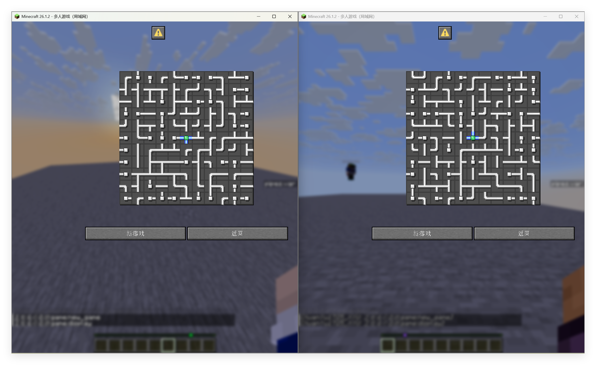
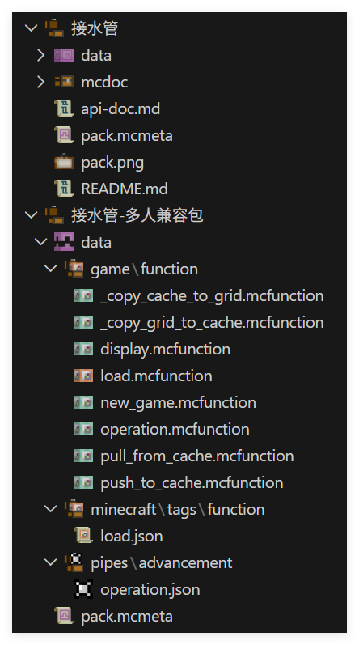
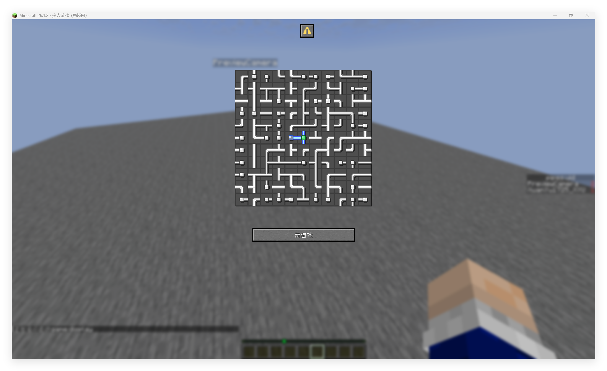
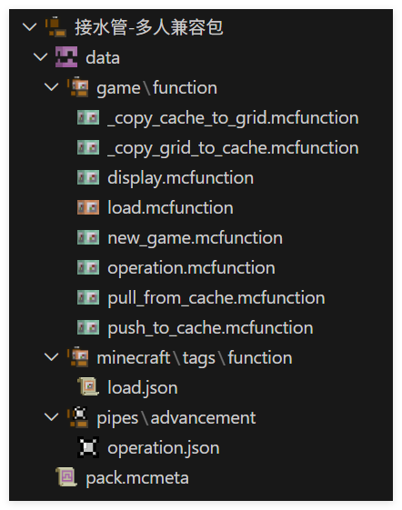

<FeaturedHead
    title="How to adapt single-player games to multiplayer - taking Xu Muxian's Pipes as an example"
    authorName="Xuanyu1725"
/>


This article will be based on Xu Muxian's version of Pipes data pack for multi-player adaptation. As a general example, the function of this data pack is only used as a background and is not a core factor for multi-player compatibility. This article is mainly based on idea analysis and simple modifications to the original data pack for multi-person adaptation. The content is relatively simple.

## Game introduction

There should be quite a few Pipes articles in this issue of Feature, so I won’t go into details about the functions and gameplay of data pack here. Simply put, we need to adapt the generation-display-interaction-decision process to a multi-player environment.

## Analysis

### Front-end interaction

The dialog-based interaction solution designed by Xu Muxian is naturally suitable for compatibility with multiple people, because the dialog is only displayed to a single player. Similar solutions include display solutions based on the chat bar or title. If you use a display entity, you need to pay attention to the visibility and interaction permissions of the display entity. We will continue to use the dialog solution here.

### Instance storage

The game being played by each player should be abstracted into an independent game instance, and the dialog itself is only used as a rendering and interaction tool, so we need to maintain a game instance for each player. The game instance contains information such as the current level, player position, game status, etc.

## data pack status

This version of Pipes is not suitable for multiple people mainly because there is only one global variable slot, and all operations of the player are based on this global variable. So we have two options:

1. Major changes to the data pack to implement an independent variable slot for each player and operate within the slot.

2. Fine-tune the data pack, each player stores its own game instance separately, and clones its own instance to the global variable slot before responding to player operations.

Let’s choose the latter solution first.

## Implementation

### Data structure

Let’s first check the data structure. The original article uses a column-major two-dimensional array.`grid`to store the map,

each of them`grid[x][y]`All have the following data:
<div class="nbttree">

<node type="compound" name=""/> Node root tag
- <node type="int" name="index"/>The index of the node, counting from 1, calculated as`&lt;index&gt;=&lt;x&gt;+&lt;y&gt;*&lt;width&gt;+1`.
- <node type="int" name="parent_x"/>The parent node of this node$x$coordinate.
- <node type="int" name="parent_y"/>The parent node of this node$y$coordinate.
- <node type="byte_list" name="side"/>The connection status of the node in four directions. There are a total of 4 elements in the array, representing the four directions of left, up, right, and down. Among them`0b`is not connected,`1b`for connection.
- <node type="bool" name="source"/>Whether the node is the root node.
- <node type="byte" name="state"/>The status of the node,`0b`For nothing,`1b`For irrigation,`2b`as a warning,`3b`To be visited.
- <node type="bool" name="visited"/>Whether the node has been visited during the generation phase has no practical effect during the game phase.
- <node type="int" name="x"/>The node's$x$coordinate.
- <node type="int" name="y"/>The node's$y$coordinate.
</div>

stored in`storage pipes:grid grid`Within, this is the core variable of the game instance, and there are`storage pipes:grid dialog`Used to store custom text for the frontend

(score_holder)`#record pipes.var`Used to store play time

These three data will form a game instance. But for convenience, we only consider the compatibility of the first data.

### Independent storage

In order to achieve multi-player compatibility, we only need to use

```mcfunction
function pipes:prim/
```
Create a map and add`storage pipes:grid grid`Copy the contents into your own cache.

We can allocate storage space to the player according to the player uid and use macros to access it. Since we only access it once when the player operates, this macro does not bring much consumption.

When each player creates a game instance, we use the following command to automatically assign consecutive uids to the players. Players that have obtained uids will not be assigned repeatedly.

```mcfunction
# game:new_game.mcfunction
execute unless score @s pipes.uid matches -2147483648..2147483647 store result score @s pipes.uid run scoreboard players add #Pointer pipes.uid 1
```
Then we create the map and copy it to cache

```mcfunction
# game:new_game.mcfunction
$scoreboard players set #width pipes.var $(w)
$scoreboard players set #height pipes.var $(h)

function pipes:prim/
function pipes:upset/

execute store result storage pipes:cache uid int 1.0 run scoreboard players get @s pipes.uid
function game:_copy_grid_to_cache with storage pipes:cache
```


```
mcfunction
# game:_copy_grid_to_cache
$execute unless data storage pipes:cache players[{uid:$(uid)}] run data modify storage pipes:cache players append value {uid:$(uid)}
$data modify storage pipes:cache players[{uid:$(uid)}].grid set from storage pipes:grid grid
```
Use the built-in renderer to render puzzles in the cache

```mcfunction
# game:display
execute store result storage pipes:cache uid int 1.0 run scoreboard players get @s pipes.uid
function game:_copy_cache_to_grid with storage pipes:cache

function pipes:display/

scoreboard players enable @s pipes.trigger
scoreboard players enable @s pipes.operation
```


```mcfunction
# game:_copy_cache_to_grid
$data modify storage pipes:grid grid set from storage pipes:cache players[{uid:$(uid)}].grid
```
Now a basic function of creating a new game example is ready. Different players can pass

```mcfunction
function game:new_game {w:11,h:11}
function game:display
```
to create and display your own games without interfering with each other



Further package pull and upload as functions to facilitate later calls.

```
mcfunction
# game:pull_from_cahce
execute store result storage pipes:cache uid int 1.0 run scoreboard players get @s pipes.uid
function game:_copy_cache_to_grid with storage pipes:cache
```


```
mcfunction
# game:push_to_cache
execute store result storage pipes:cache uid int 1.0 run scoreboard players get @s pipes.uid
function game:_copy_grid_to_cache with storage pipes:cache
```
### Response operation

Every time the player clicks on the tile, we need

1. Pull player cache

2. Perform the original operation

3. Upload player cache

This means we need to simply modify the rotation trigger link

enter`pipes:operation/trigger/`

```
mcfunction
# pipes:operation/trigger/
#rotating pipe
advancement revoke @s only pipes:operation
execute store result storage pipes:grid macro.tile_index int 1.0 run scoreboard players get @s pipes.operation
function pipes:operation/trigger/tile with storage pipes:grid macro
scoreboard players reset @s pipes.operation
scoreboard players enable @s pipes.operation

#Problem solving judgment
function pipes:operation/tarjan/

#Show the picture after operation
function pipes:display/

#Sound effects
playsound item.book.page_turn player @s
```
We can just add the pull and upload operations before the entire file.

```mcfunction
# pipes:operation/trigger/
function game:pull_from_cache

#rotating pipe
advancement revoke @s only pipes:operation
execute store result storage pipes:grid macro.tile_index int 1.0 run scoreboard players get @s pipes.operation
function pipes:operation/trigger/tile with storage pipes:grid macro
scoreboard players reset @s pipes.operation
scoreboard players enable @s pipes.operation

#Problem solving judgment
function pipes:operation/tarjan/

#Show the picture after operation
function pipes:display/

#Sound effects
playsound item.book.page_turn player @s

function game:push_to_cache
```
A more robust approach is to override advancement`pipes:operation`, redirect it to function`game:operation`

```json
# pipes:operation
{
  "criteria": {
    "rotate": {
      "conditions": {
        "player": [
          {
            "condition": "minecraft:any_of",
            "terms": [
              {
                "condition": "minecraft:entity_scores",
                "entity": "this",
                "scores": {
                  "pipes.operation": {
                    "min": 1
                  }
                }
              },
              {
                "condition": "minecraft:entity_scores",
                "entity": "this",
                "scores": {
                  "pipes.operation": -1
                }
              }
            ]
          }
        ]
      },
      "trigger": "minecraft:tick"
    }
  },
  "rewards": {
    "function": "game:operation"
  }
}
```


```mcfunction
# game:operation
function game:pull_from_cache

function pipes:operation/trigger/

function game:push_to_cache
```
### Custom front end

We have not directly modified the original code, which means that what we provide is only an independent compatibility layer, and we can customize our dialog front end later.



just now`game:display`The original rendering method is called in`function pipes:display/`You only need to modify this method to your own rendering function and matching dialog interface to create a custom front end.

The custom front end provided below cuts off the multi-level menu of the original package and only retains the game itself.

```
# game:display
function game:pull_from_cache

# template from original pack
data modify storage pipes:grid cache.processing_data set from storage pipes:grid grid
data modify storage pipes:grid dialog.body.contents[2] set value [""]
data modify storage pipes:grid cache.processing_data_cache set value []
function pipes:display/height
data modify storage pipes:grid dialog.body.contents[2][-1] set value "\n\n\n\n"
execute unless entity @s[tag=pipes.win] run data modify storage pipes:grid dialog.body.contents[3] set value ""
execute if entity @s[tag=pipes.win] run function pipes:display/win
    # injection: remove buttons
    data modify storage pipes:grid dialog.actions set value [\
        {action: {type: "minecraft:run_command", command: "function game:new_game {w:5, h:5}"}, label:{"translate":"dialog.pipes.game.new_game"}}\
    ]
function pipes:display/show with storage pipes:grid
data remove storage pipes:grid cache.processing_data

scoreboard players enable @s pipes.trigger
scoreboard players enable @s pipes.operation
```
To fully customize the frontend, you need to override it in the same way`pipes:tirgger`advancement. Here are just simple examples.



## Summary

This article does not modify the original data pack, but implements a minimally intrusive compatibility layer by overwriting only one advancement file, thereby modifying a game that was originally only compatible with a single player into a version that is compatible with multiple players.



On the one hand, this is due to the good data management of the original data pack, that is, a clear global variable slot, which has nothing to do with the player, allowing us to use the existing architecture to the greatest extent to develop the compatibility layer. On the other hand, thanks to the clear interactive response architecture, we can inject the upload and pull operations of the player cache with minimal coverage.