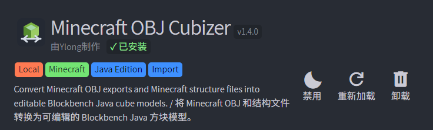
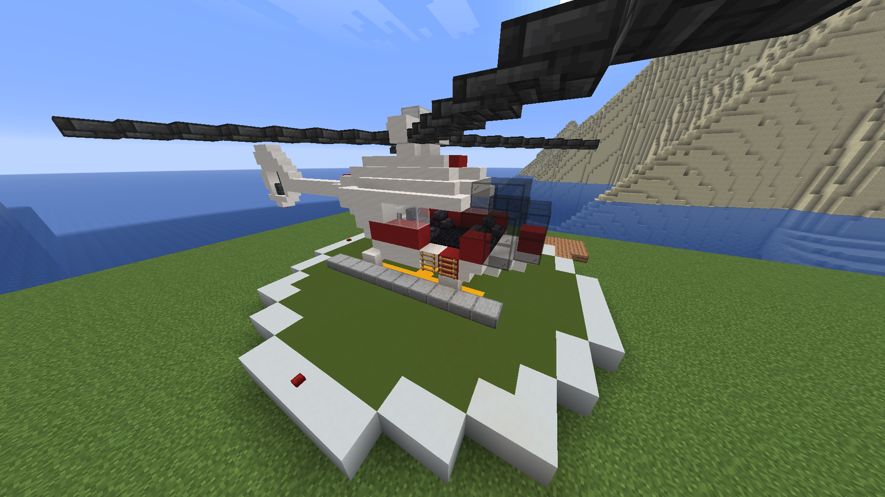
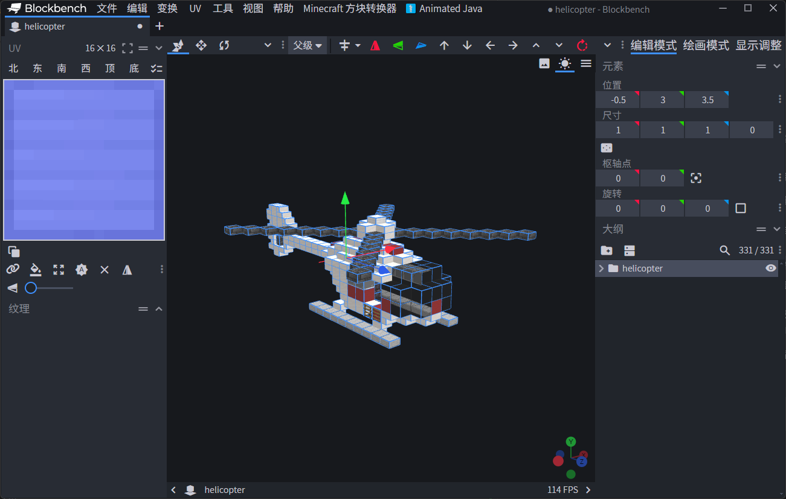
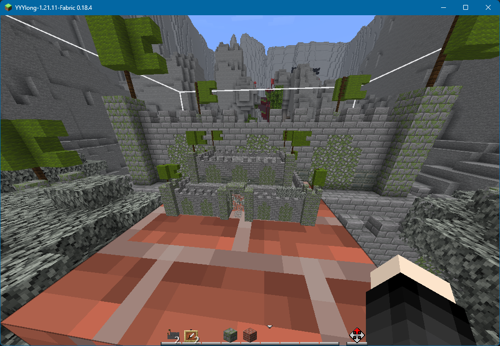

<FeatureHead
    title="Bringing Minecraft buildings to Blockbench: Minecraft OBJ Cubizer plugin"
    authorName="Wai Lang Ylong"
    cover = '../../../../../feature/archive/202606/_assets/6.png'
/>

Minecraft OBJ Cubizer is an auxiliary plug-in for the desktop version of Blockbench. It is mainly used to convert buildings, structure files or block OBJ models in Minecraft into Java block models that can be edited and exported in Blockbench, and can be used by tools such as Animated Java. This article aims to introduce the principles of the plug-in, supported input formats, texture processing methods, and a basic usage process.

<p align="center">

</p>

## Why do we need this plug-in?

First, please look at a case like this: I have built a helicopter in the game, and now I want to turn its propellers and make the helicopter move and fly. At this time, it will be very troublesome if we continue to use blocks to display entities. I know that the Animated Java plug-in in Blockbench can assist in making vanilla animations, but only if I have the model in Blockbench first. Manually rebuilding is obviously unhealthy, so is there a more convenient way?
<p align="center">

</p>
In the creation of vanilla maps, we often encounter needs similar to the above examples: I have built a building in Minecraft, or got a`.schem`、`.litematic`,structure`.nbt`file, now I want to put it into Blockbench for further processing, and finally make it into a resource pack model, display entity model, or hand it to Animated Java for animation.

This thing should sound simple. After all, Minecraft buildings are mostly composed of blocks, and Blockbench’s Java Block/Item Model also has cubes. Turning a block into a cube seems to be just a coordinate conversion.

But in practice, you will find that there is more than one problem:

- vanilla nbt files cannot be read directly and converted to cube.
- OBJ model is a universal 3D model format and Blockbench's Java model is Minecraft resource pack json.
- Minecraft blocks not only have complete cubes, but also special shapes such as half bricks, stairs, fences, walls, buttons, torches, and redstone lines.
- The texture path, parent model, UV, rotation and block state of the vanillablock model need to be parsed correctly.
- Blocks such as boxes, beds, notice boards, etc. are not ordinary block models, but blockentity models that are processed separately by the game renderer.
- Java Block/Item Model itself has real limitations in size and performance.

So I made such a plug-in to convert Minecraft buildings into a cube structure that Blockbench can understand as much as possible, so that creators can continue to edit, split, adjust the axis, animate or export resource pack json, instead of manually building it from scratch.

## What does the plug-in support?

Currently there are two main import routes for plug-ins.

The first one is OBJ import.

Suitable for exporting Minecraft buildings using tools such as Mineways`.obj + .mtl + png`situation. The plug-in will read the OBJ geometry, MTL material and texture files, and reorganize the parts that can be recognized as axis-aligned block surfaces into Blockbench cubes.

The second one is direct structure import.

Suitable for direct import of Minecraft structure files, including:

-`.schematic`
- `.schem`
- `.litematic`- Structure`.nbt`- single`.mca`zone file

Direct structure import will read blockcoordinate, block ID and block state from NBT or zone file, and then generate Blockbench cube based on blockstate/model json in Minecraft vanilla or resource pack.

These two routes target slightly different scenarios:

- If you already have an OBJ exported from Mineways, it's more straightforward to import via OBJ.
- If you have a structure file in hand, direct structure import can preserve more block status information.

> [!TIP] Plug-in requirements
> Blockbench minimum version: 4.8.0
> Minecraft Java minimum version: 1.8
> Recommended Minecraft Java version: 1.13 and above, it is best to choose the same game version jar as the imported building
> When importing structures, it is recommended to select a Minecraft jar that is consistent with the version of the building source. When the versions are inconsistent, some new blocks or special blocks may not be able to find the corresponding blockstate/model JSON, so they will be returned to complete blocks.
## Idea: from block to cube

Blockbench's Java model essentially consists of many cubes. Each cube has`from`、`to`、`faces`、`uv`、`rotation`and other information. What the plugin does is translate Minecraft blocks or OBJ patches into these fields.

### OBJ import

OBJ is a mesh model. When the plug-in imports an OBJ, it first reads the vertices, faces, material names, and map references, and then looks for axis-aligned rectangular faces.

The OBJ exported by Minecraft buildings usually has a characteristic: although the format is OBJ, the actual geometry comes from the block mesh. As long as these faces are not beveled or complicated, they can be reassembled into a cube according to the coordinate relationship.

The plug-in will organize the identifiable block faces into cubes and bind corresponding textures to each face. For inclined planes, triangular planes or abnormal planes that cannot form a cube, the plug-in will skip them and prompt the quantity in the import result.

Therefore, OBJ import is suitable for "architectural OBJ composed of Minecraft blocks" and is not suitable for ordinary triangular mesh models, surface models or sculpture-type models, which is also consistent with the name of this plug-in.

### Structure import

The structure import does not start from the triangle surface, but directly from the block data.

The plug-in will parse the NBT data and obtain information similar to the following:

```text
方块 ID：minecraft:oak_stairs
方块状态：facing=north, half=bottom, shape=straight
坐标：x, y, z
```
Next, the plug-in will look for the Minecraft model file in the texture source:

```text
assets/minecraft/blockstates/oak_stairs.json
assets/minecraft/models/block/oak_stairs.json
assets/minecraft/textures/block/oak_planks.png
```
The "texture source" here can be:

- Unpacked resource pack directory
-`assets`folder
-`assets/minecraft`folder
- Minecraft`.jar`or`.zip`When blockstate is found, the plug-in will select the corresponding model based on the current block state; then parse the model json`elements`, convert each element into a Blockbench cube.

If the model has a parent model, the plugin will continue to parse the parent model and merge the map variables. For example, some models only write:

```
json
{
  "parent": "minecraft:block/cube_all",
  "textures": {
    "all": "minecraft:block/stone"
  }
}
```
Plugins need to know`cube_all`How to use the six sides of`#all`, again`#all`parsed into`minecraft:block/stone`. Otherwise, there will be a problem in Blockbench that the "texture file provided by the parent model" cannot be displayed correctly.


> [!TIP] Special block
> For special blocks such as boxes, beds, notice boards, and clay pots. They are not ordinary block models, but are handled by independent rendering logic in the game. The plug-in currently uses a built-in editable model: after identifying the corresponding block, it directly generates the preset cube structure, and then applies the corresponding entity map.
> This approach does not read blockentity data such as box items, billboard text, flag patterns, custom head owners, etc.
> Minecraft:water block cannot be imported at this time.

## Texture processing

The textures in the plug-in can be understood more clearly if they are divided into two categories.

The first category is the preview map.

When you select Minecraft jar or resource pack as the texture source, the plug-in will read the PNG inside and use it to display the model effect in Blockbench. For the vanilla textures read in the jar, the plug-in will treat them as "preview resources only" and will not force all vanilla PNGs to be saved when saving the model.

The reason for this is simple: if you are already using vanilla textures, there is no need to copy a bunch of Minecraft textures when saving the model.

The second category is the export path.

When exporting Java model json, the texture path needs to be written in a format that Minecraft can recognize, for example:

```
json
{
  "textures": {
    "stone": "minecraft:block/stone"
  }
}
```
If you use your own resource packnamespace, you can also fill it in the plugin settings. For example namespace is`fo`, the texture folder is`block`, the export path will become:

```json
"fo:block/stone"
```
This is why there are two items in the plug-in settings: "texture namespace" and "texture folder".

## Install plugin

The plug-in directory structure is as follows:

```text
minecraft_obj_cubizer/
├─ minecraft_obj_cubizer.js
├─ about.md
├─ changelog.json
├─ icon.svg
└─ members.yml
```
When installing, open the Blockbench desktop version, enter the plug-in interface, select Load plug-in from file, and then select:

```text
minecraft_obj_cubizer/minecraft_obj_cubizer.js
```
After successful loading, the top menu bar of Blockbench will appear:

```text
Minecraft Cubizer / Minecraft 方块转换器
```
The plug-in's OBJ import, structure import, two sets of settings and texture export functions are all in this menu.

## Usage process one: Import buildings from OBJ

If your building has passed [Mineways](http://mineways.com/) or similar tool to export to OBJ, you can use this process.

Let's go back to the example at the beginning and use the tool to export the helicopter building from the archive as an OBJ model.
Make sure the file structure is not corrupted. OBJ, MTL and textures should maintain their original relative paths:

```text
helicopter_obj/
├─ helicopter.obj
├─ helicopter.mtl
└─ textures/
   ├─ iron_block.png
   ├─ red_concrete.png
   └─ ...
```
Then open it in Blockbench:

```text
Minecraft 方块转换器 > 将 Minecraft OBJ 导入为方块
```
Commonly used settings are recommended as follows:

| Setting items | Recommended values | Description |
| --- | --- | --- |
| OBJ block scaling |`1`| The buildings exported by Mineways usually have 1 Minecraft block corresponding to 1 OBJ unit |
| Default block thickness |`1`| Used when ordinary block faces are reorganized into a complete cube |
| Texture size |`16`| vanillablock textures are usually 16x16 |
| texture namespace |`minecraft`Or customized | For example, resource packnamespace is`fo`Just fill in`fo`|
| Texture folder |`block`| Corresponds to the resource pack`textures/block`|
| Center to origin | Enable on demand | May be more convenient when doing animation |

The most common error here is "OBJ block scaling". Don't see that the Minecraft texture is 16x16 and just fill in the scale to 16. The scaling value of 16 will enlarge the coordinates together, which may cause the exported json coordinate to exceed the common range of Java Block/Item Model.

<p align="center">

</p>

After the import is successful and checked, you can use the Java Block/Item Model that comes with Blockbench to export the json file to the models/item directory of the resource pack. After defining the corresponding itemmodel mapping file, the model can be used in the game.

<p align="center">

</p>

If OBJ uses its own textures (not vanilla), you can also use:

```
text
Minecraft 方块转换器 > 导出 OBJ 贴图到资源包
```
Copy the imported PNG texture to the textures/block directory of the resource pack.

Of course, you can also convert the project to the Animated Java format to animate the helicopter's propeller rotation.
After the production is completed, it is imported into the data pack and resource pack through the function of the Animated Java plug-in.


## Usage process two: Directly import the structure file

If you have it in your hand`.schem`、`.litematic`,structure`.nbt`or`.mca`, you can use structure import directly.

> [!TIP] Tip
> It should be noted that`.schem`、`.litematic`,structure`.nbt`and`.mca`The storage limits are not the same.
>vanilla structure`.nbt`In the game, the structure is usually blocked at most once`48 x 48 x 48`Limitation of storage scope;
>`.mca`The world data is stored according to regional files, a`.mca`correspond`32 x 32`A chunk.
> In contrast,`.schem`and`.litematic`Generally there is no such a small fixed block upper limit. In fact, it is more often limited by the editor implementation, memory usage and file size.

Take a castle saved with a structure block in the game as an example, open:

```
text
Minecraft 方块转换器 > 导入 Minecraft 结构
```
Select located in`archive root\generated\minecraft\structures\`nbt structure file under the pop-up window, focus on setting "texture source folder or Minecraft jar". It is recommended to directly select the Minecraft jar file corresponding to the version, or select an unpacked resource pack directory.

Then confirm the following settings:

| Setting items | Description |
| --- | --- |
| Read Minecraft block model | When turned on, blockstate/model json will be read, which is used to generate special blocks such as stairs, fences, and walls |
| Maximum number of blocks created | Limit the number of generated Blockbench cubes, default 5000 |
| Move to origin | Move the imported structure as a whole to near the origin |
| Center to origin | More suitable for models that need to be animated around the center |
| Set up Java cullface | Write cullface information for the face and enable it as required |

After the import is completed, the plug-in will display statistical information, including:

-Number of non-air blocks
- Number of Blockbench cubes generated
- Number of hidden blocks skipped
- Quantity truncated due to quantity limit
- Number of blocks using model json
- The block ID and reason for returning the complete block
  

If some blocks return to complete blocks, it is usually because the plug-in does not find the corresponding blockstate/model json, or the model cannot generate displayable surfaces. At this time, the priority is to check whether the texture source is the correct version and whether the path contains`assets/minecraft/blockstates`and`assets/minecraft/models`。

<p align="center">
  

</p>

The model is then imported into the resource pack.

<p align="center">

</p>

## Regarding quantity and size restrictions

The "Maximum number of blocks created" in the plug-in settings counts the generated Blockbench cube, not the number of original Minecraft blocks.

For example, a normal stone block may only generate 1 cube, but a fence, wall, staircase, box or bed may generate multiple cubes. So "5000 cubes" does not equal "5000 Minecraft blocks".

The default limit of the plug-in is 5000 cubes. After exceeding this number, Blockbench may still be able to be opened, but editing, selection, saving and verification will be slower. Please use your own judgment. For more than 10,000 cubes, it is usually recommended to split the import and then put multiple models together through itemmodel mapping.

In addition, the Java Block/Item Model is not prepared for very large buildings. The common range of Blockbench's Java block model can be understood as about 3x3x3 block, that is, the coordinate is roughly`-16`arrive`32`between. Converted according to the default proportion of the plug-in, it is recommended that the final model should be controlled to approximately:

```
text
48 x 48 x 48 格
```
The larger it is the more likely it is to encounter export, display, performance or in-game usage issues. Large buildings are more suitable to be broken down into multiple components and then processed separately according to project needs.

> [!TIP] Tip
> If you don’t insist on using the item model, converting the project to Animated Java format and then importing it into the game can get a good performance improvement, and it is not limited to the size limit of the Java Block/Item Model.

## Update direction

At present, the most obvious problem when importing large buildings with this plug-in is that once too many Blockbench cubes are generated, serious lags will occur in editing, selection, saving and even view operations. Therefore, the focus of subsequent updates will not be to simply continue to increase the upper limit, but to minimize meaningless cubes and make the import process lighter.

There will be three update directions in the future.

- Reduce the content to be processed before importing, and filter the import by selection, height range, and block type.

- Try to reduce the number of final generated cubes as much as possible and merge continuous complete blocks.

- Continue to optimize the import and finishing process itself.

## FAQ

### There is no special block model after importing

First check whether the "texture source folder or Minecraft jar" is correct.

If vanilla blockstate/model json is not read, the plug-in can only return many special blocks to complete blocks. It is recommended to choose the current Minecraft version`.jar`, or choose to include`assets/minecraft`resource pack directory.

### The texture is displayed as "Texture file provided by the parent model"

This usually means that the model references a parent model or texture variable, but the texture chain is not fully resolved. Please confirm that the texture source also exists`models`、`blockstates`and`textures`. If using resource pack, also make sure that the parent model in the resource pack is not missing.

### The coordinate is too large after exporting json

The most common cause when importing OBJ is that the scale setting is too large. Minecraft Building OBJ Generally Recommended`OBJ block scale = 1`. If filled in to 16, each block will be enlarged 16 times, and the exported coordinates can easily exceed the common range of Java models.

### Don’t want to export a bunch of vanilla textures when saving

When the texture source is a Minecraft jar or zip, the plug-in will treat these textures as preview resources and will not force a vanilla PNG to be saved when saving the model. When you need to copy the OBJ's own texture, use "Export OBJ texture to resource pack" in the plug-in menu.

### Is it possible to read skull texture, sign text or flag pattern?

Not reading at the moment. The plug-in mainly converts model shapes and textures, and does not process blockentity internal data. Boxes, notice boards, beds, etc. will try to generate editable models, but the data such as items, text, patterns, and player header owners do not belong to the current target.

## What kind of workflow is suitable?

This plugin is best suited for the following situations:

- Want to quickly move Minecraft buildings into Blockbench for secondary editing.
- want to`.schem`or`.litematic`A small section of the structure is made into a display model.
- I want to dismantle the building into parts and then use Animated Java to create vanilla animations.
- I want to study the block model composition of a certain structure and adjust UV, axis and grouping in Blockbench.

It is not suitable for turning a complete world, very large map or complex terrain into a single Java model at one time. That kind of demand is more suitable for specialized map rendering, entity display system, or splitting into multiple model modules.

## Conclusion

The core idea of Minecraft OBJ Cubizer is not complicated. It tries to translate Minecraft blocks, block status and model json into cubes that can be edited by Blockbench. The trouble is with texture chains, parent models, UVs, rotations, special blocks and volume control.

For vanilla creators, its value lies in reducing duplication of work. When you want to animate some buildings, you don't need to manually create a block display entity for each block in the building or rebuild a series of cubes in Blockbench, nor do you need to reproduce the shape of each staircase, fence, and wall from scratch. The plug-in completes most of the mechanical conversion first, and the creator can then focus on other areas.

## Plug-in link
- [Recommended download link](https://treehey.github.io/Fimel/#/works/tools)
- [Alternate Lanzouyun download link](https://ylong4004.lanzn.com/iVFNA3obc03e)
- [Github repository](https://github.com/Ylong4004/minecraft_obj_cubizer)

