::: tip Translation notice
This page was translated with machine translation and may contain inaccuracies. If you can help improve it, please open an issue or submit a pull request.
:::


<FeatureHead
title='Shader Practice - Grayscale and Dither'
authorName='Xuanyu1725'
/>

# Shader Practice - Grayscale and Dithering

## summary

This article introduces the concept of grayscale and a common binarization method-dithering. Common noise types, the use of procedural generation and precomputed textures, and methods to fix NEAREST sampling failures are introduced.

## Preface

Gray Scale is an attribute that describes color depth with 8-bit (0-255) precision. Or called 256 levels of grayscale. Dithering is a very common binary technology. The basic idea is to use only two colors to achieve a transition effect.

Due to hardware limitations, early printers and monitors could only display binary colors and could not meet the 256-level grayscale requirements. Therefore, specific spatial (or temporal) noise was often used to trick the human eye into perceiving a similar grayscale effect. This is jitter.

Many scenes now also use dithering as stylized rendering to simulate retro images.

Jitter is not necessarily binary, there are also higher-order jitters, but binary jitter is the most typical and common mode.

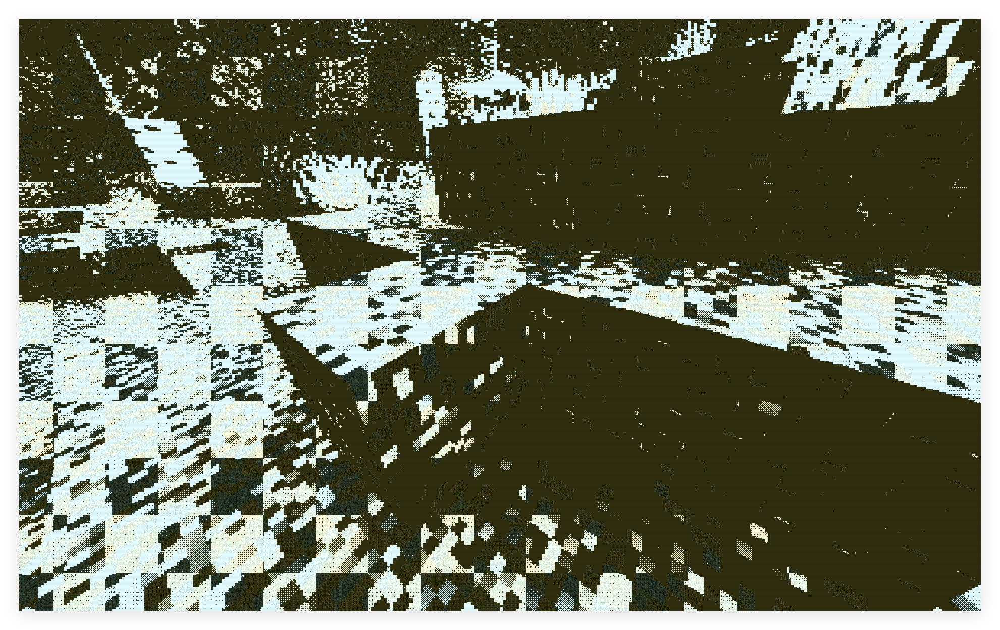

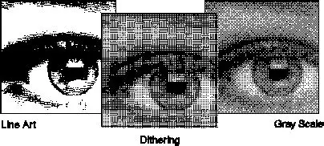

In this tutorial, we encourage readers to use [shadertoy](https://www.shadertoy.com/new) implement and modify the algorithm, and then put it into the minecraft shader. There are also dither noise generation algorithms shared by many users on shadertoy.

## Types of jitter

When we discuss types of jitter, we are actually discussing types of noise.

1. White Noise

```glsl
float whiteNoise(vec2 p){
    return fract(sin(dot(p, vec2(12.9898,78.233))) * 43758.5453);
}
```


This is the simplest kind of noise, characterized by uniform energy at each frequency, completely random in space/time, and without any structure. Because white light is a uniform mixture of visible light of all frequencies, it is named "white noise."

However, the human eye is sensitive to low-frequency noise. Although white noise is simple to implement, it makes the image "dirtier". White noise dithering tends to produce sharp flickers and spots.

2. Blue Noise

The energy of blue noise increases with frequency - low energy at low frequencies and high energy at high frequencies. Visually more pure and natural. It is also named from its optical properties, that is, blue light has a higher frequency.

Blue noise is more difficult to generate than white noise. Generally, pre-generated images are downloaded and used.


3. "color noise"

From the first two examples, we can predict that there is some other color noise, and in fact there is.

We define the spectral power density function (Spectral Power Density Function, SPD or PSD) as$S(f)$,in$f$is the frequency. Various noise types can be defined separately:

| Noise type | SPD |
| -------------- | ------------------- |
| Brown noise (red noise) |$S(f) \propto 1/f^2$ |
| pink noise |$S(f) \propto 1/f$   |
| white noise |$C$                 |
| blue noise |$S(f) \propto f$     |
| Purple Noise |$S(f) \propto f^2$   |

4. Orderly dithering

In fact, Minecraft already has a built-in dither, which we can call "Notch dither". This texture is stored in`textures/effect/dither.png`

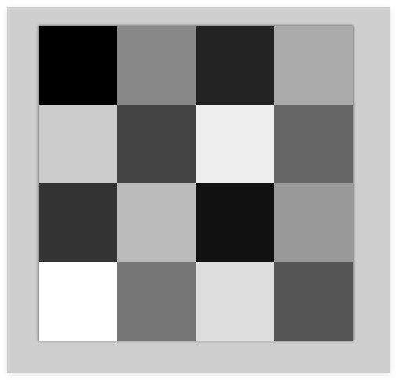

This texture has 16 different gray levels (evenly divided from the original 256 gray levels) and is used in a post-processing pipeline called notch.

```json
// 1.17 中的 post/notch.json
{
    "targets": [
        "swap"
    ],
    "passes": [
        {
            "name": "notch",
            "intarget": "minecraft:main",
            "outtarget": "swap",
            "auxtargets": [
                {
                    "name": "DitherSampler",
                    "id": "dither",
                    "width": 4,
                    "height": 4,
                    "bilinear": false
                }
            ]
        },
        {
            "name": "blit",
            "intarget": "swap",
            "outtarget": "minecraft:main"
        }
    ]
}
```


```glsl
// notch.fsh
#version 150

uniform sampler2D DiffuseSampler;
uniform sampler2D DitherSampler;

in vec2 texCoord;

uniform vec2 InSize;

out vec4 fragColor;

void main() {
    vec2 halfSize = InSize * 0.5;

    vec2 steppedCoord = texCoord;
    steppedCoord.x = float(int(steppedCoord.x*halfSize.x)) / halfSize.x;
    steppedCoord.y = float(int(steppedCoord.y*halfSize.y)) / halfSize.y;

    vec4 noise = texture(DitherSampler, steppedCoord * halfSize / 4.0);
    vec4 col = texture(DiffuseSampler, steppedCoord) + noise * vec4(1.0/12.0, 1.0/12.0, 1.0/6.0, 1.0);
    float r = float(int(col.r*8.0))/8.0;
    float g = float(int(col.g*8.0))/8.0;
    float b = float(int(col.b*4.0))/4.0;
    fragColor = vec4(r, g, b, 1.0);
}
```


In fact, this image is a 4x4 Bayer matrix. The Bayer matrix is ​​the most common ordered dither matrix.

Bayer matrices of different orders can be generated recursively:

$$
B_2 = \begin{pmatrix} 0 & 2 \\ 3 & 1 \end{pmatrix}, \quad
B_{2n} = \begin{pmatrix} 4B_n & 4B_n + 2 \\ 4B_n + 3 & 4B_n + 1 \end{pmatrix}
$$

It is easy to verify that Notch jitter is a 4th order Bayer matrix.

5. error diffusion

Error diffusion is a serial dithering method that is not suitable for real-time rendering shader implementation. This concept is only proposed here. Interested readers can search for Floyd–Steinberg dithering.

## Implementation of jitter

1. additive jitter

No matter what kind of noise we use, the operation is to add noise to the pixels and then quantize them (here we quantize them into two colors, pure black and pure white) to achieve the effect of dithering.

Here's an example of a simple dither implementation on shadertoy:

```glsl
void mainImage( out vec4 fragColor, in vec2 fragCoord )
{
    // Normalized pixel coordinates (from 0 to 1)
    vec2 uv = fragCoord/iResolution.xy;

    // sample color and noise
    vec3 col = texture(iChannel0, uv).rgb;
    float gray = dot(col, vec3(0.299, 0.587, 0.114));
    float noise = texture(iChannel1, uv).r - 0.5;
    
    // mix noise with color
    float dithered = gray + 0.5 * noise;
    
    // quantize
    float quantized = step(0.5, dithered);

    // Output to screen
    fragColor = vec4(vec3(quantized),1.0);
}
```


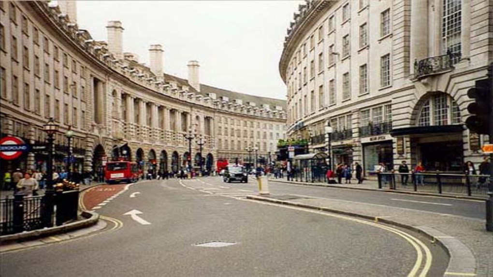

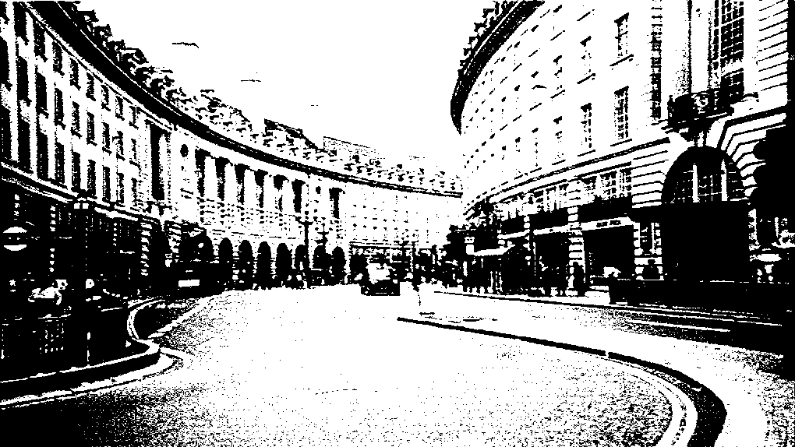

You can also dither the three RGB channels separately

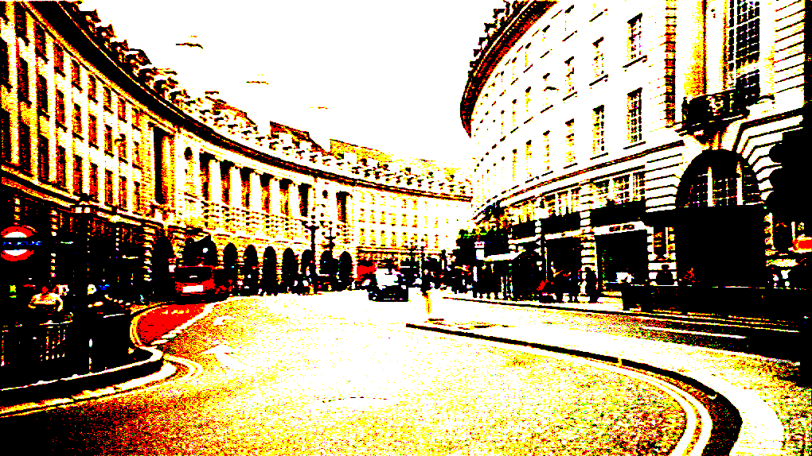

The amplitude of the superimposed noise is usually$0.5 * (1 / 2^n)$, where n is the number of quantization bits. Here we quantize to 1 bit, so the amplitude is 0.5.

Used here`step`function, its function is to compare the input value with the threshold, if it is greater than the threshold, it will output 1, otherwise it will output 0.

We can also use it to implement a multi-order quantization function

```glsl
float quantize(float value, float levels) {
    return floor(value * (levels - 1.0)) / (levels - 1.0);
}
```


The picture below is the effect of using blue noise 4th order color quantization:

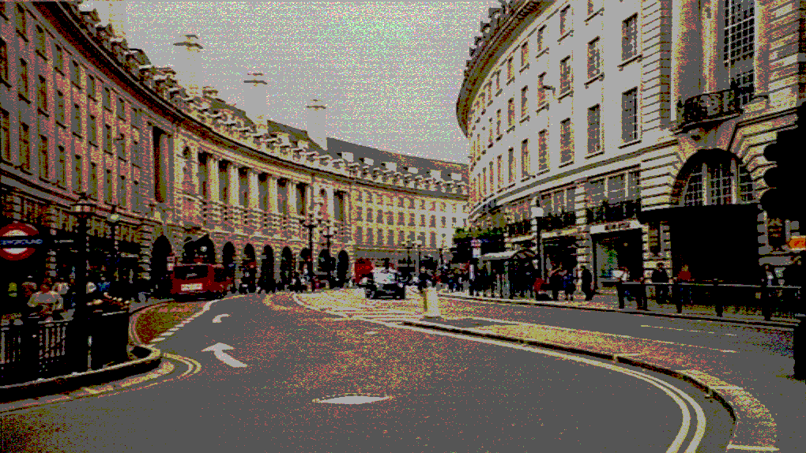

2. noise threshold jitter

The above noise can also be used directly as a threshold, and the actual effect is similar to additive jitter. Readers can implement it by themselves. For threshold jitter, we introduce the threshold jitter based on Bayer matrix in detail below.

3. Bayer matrix jitter

Bayer matrix dithering does not use addition, but uses the value of the Bayer matrix as a threshold to directly compare whether the pixel value is greater than the threshold, thereby deciding whether to output black or white.

```glsl
const mat4 BAYER = mat4(
    vec4( 0.0/16.0,  8.0/16.0,  2.0/16.0, 10.0/16.0),
    vec4(12.0/16.0,  4.0/16.0, 14.0/16.0,  6.0/16.0),
    vec4( 3.0/16.0, 11.0/16.0,  1.0/16.0,  9.0/16.0),
    vec4(15.0/16.0,  7.0/16.0, 13.0/16.0,  5.0/16.0)
);

float bayerThreshold(ivec2 p) {
    int x = p.x & 3;   // mod 4
    int y = p.y & 3;
    return BAYER[x][y];
}

void mainImage(out vec4 fragColor, in vec2 fragCoord) {
    vec2 uv = fragCoord / iResolution.xy;
    vec3 col = texture(iChannel0, uv).rgb;

    float gray = dot(col, vec3(0.299, 0.587, 0.114));
    float t = bayerThreshold(ivec2(fragCoord));
    float dithered = step(t, gray);

    fragColor = vec4(vec3(dithered), 1.0);
}
```


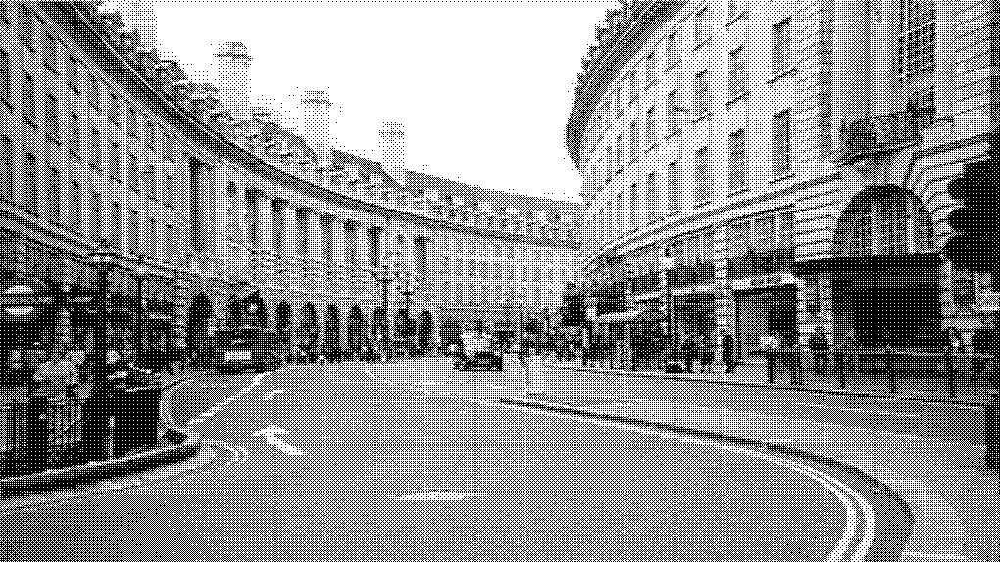

The modular operation here is equivalent to repeatedly spreading the Bayer matrix over the entire screen, and then comparing the gray value of each pixel with the corresponding threshold to achieve the dithering effect.

You can also dither the three RGB channels separately.

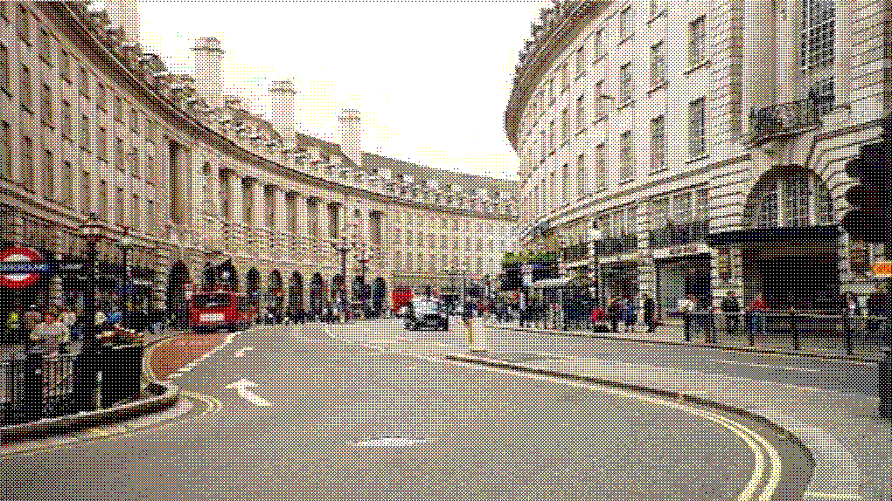

## application

The above dithering method can be applied in many scenarios, such as optimizing the transmission effect in the previous "Shader Practice - Construction of a Simple 2D Scene".

```glsl
bool random_chance(float alpha_factor) {
    float rand_value = fract(sin(dot(gl_FragCoord.xy ,vec2(12.9898,78.233))) * 43758.5453);
    return rand_value < alpha_factor;
}
```


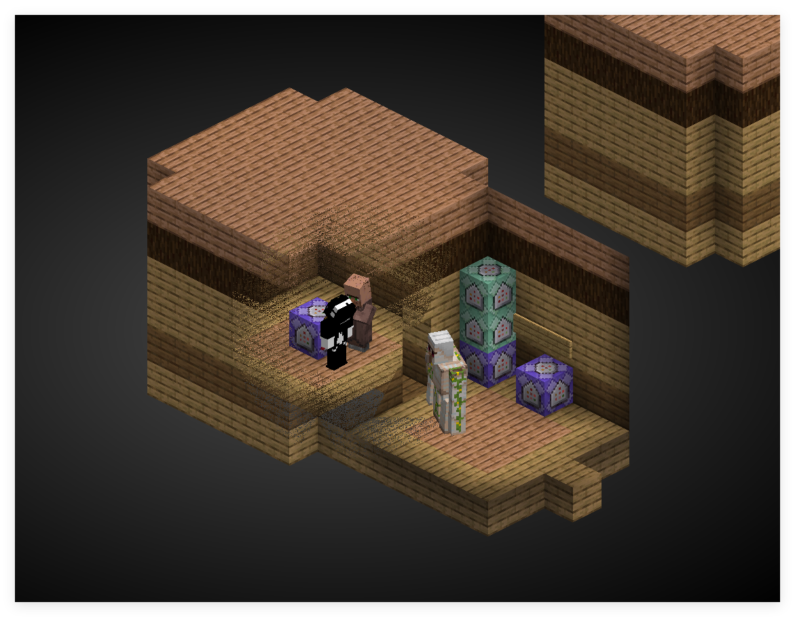

What is implemented here is actually the white noise threshold dither mentioned above. Due to the existence of low-frequency noise, the transmission effect is relatively dirty. We can change it to Bayer matrix dither or blue noise dither to improve the effect. (However, the Notch jitter texture cannot be accessed in the core shader, so you have to write a Bayer matrix yourself)

```glsl
const mat4 BAYER = mat4(
    vec4( 0.0/16.0,  8.0/16.0,  2.0/16.0, 10.0/16.0),
    vec4(12.0/16.0,  4.0/16.0, 14.0/16.0,  6.0/16.0),
    vec4( 3.0/16.0, 11.0/16.0,  1.0/16.0,  9.0/16.0),
    vec4(15.0/16.0,  7.0/16.0, 13.0/16.0,  5.0/16.0)
);

float bayerThreshold(ivec2 p) {
    int x = p.x & 3;   // mod 4
    int y = p.y & 3;
    return BAYER[x][y];
}

void main() {
    vec4 color = texture(Sampler0, texCoord0) * vertexColor * ColorModulator;
    float max_component = max(gl_FragCoord.x, gl_FragCoord.y);
    float dist = distance(gl_FragCoord.xy/max_component, ScreenSize / (2.0 * max_component));
    float target_z = -0.97; // 目标物体的 z_view 值, 此项由数据包层面传递给着色器，后文介绍
    float distance_min = 0.03; // 距离阈值，低于该距离完全透射
    float distance_max = 0.50; // 距离衰减范围，高于该距离完全不透射
    if (depth < target_z) {
        float t = bayerThreshold(ivec2(gl_FragCoord.xy));
        float normalized_dist = (dist - distance_min) / (distance_max - distance_min);
        float dithered = step(t, normalized_dist);
        if(dithered == 0.0){
            discard;
        }
    }

#ifdef ALPHA_CUTOUT
    if (color.a < ALPHA_CUTOUT) {
        discard;
    }
#endif
    fragColor = apply_fog(color, sphericalVertexDistance, cylindricalVertexDistance, FogEnvironmentalStart, FogEnvironmentalEnd, FogRenderDistanceStart, FogRenderDistanceEnd, FogColor);
}

```


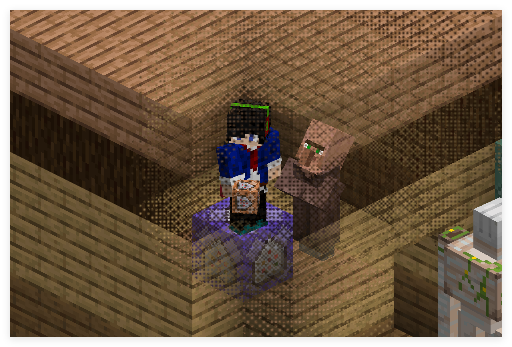

The effect is significantly better. This is because Bayer dither is an ordered dither. Although it has low-frequency components, the human eye's tolerance for periods is higher than the random cluster structure of white noise, so it is visually cleaner.

The core structure here is

```glsl
float t = bayerThreshold(ivec2(gl_FragCoord.xy));
float normalized_dist = (dist - distance_min) / (distance_max - distance_min);
float dithered = step(t, normalized_dist);
```


Similar to the previous dithering implementation.

> In fact, dealing with the problem of transmission naturally returns to the essence of the jitter problem. Solid type objects (although now merged into the terrainshader) do not output semi-transparent pixels. So there are only two cases of retaining pixels and discarding them. Using dithering to approximate translucency is a natural choice. In fact, here`normalized_dist`It's the alpha value of solid.

## precomputed noise

In some scenes we will still choose color noise, but the cost of calculating blue noise or other color noise in each fragment shader is relatively high, so we can choose the pre-computation method to embed the noise into the texture.

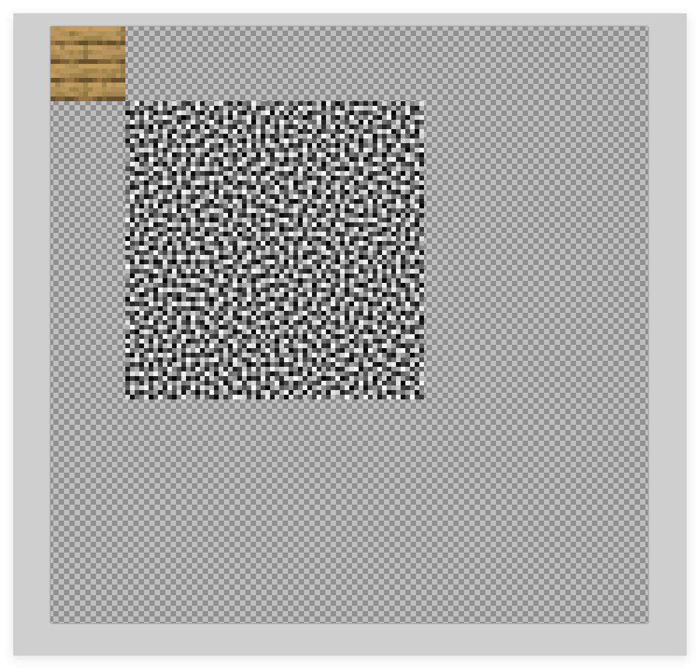

Here we have packed one$16*16$texture and a$64*64$noise in a$128*128$in the image. When sampling, the normalized texture coordinates correspond to:

`[0, 0]`arrive`[1/8, 1/8]`for$16*16$texture

`[1/8, 1/8]`arrive`[5/8, 5/8]`for$64*64$noise

In "Shader Basics - Accurate Sampling of Textures" we introduced how to accurately sample textures in the shader. Here we can use the same method to sample noise.

```glsl
vec2 imgSize = vec2(128.0, 128.0);
vec2 atlasSize = textureSize(Sampler0, 0);

vec2 scale = imgSize / atlasSize;
vec2 sampleCoord = texCoord0 + (imgCoord - normalizedUV) * scale;
```


Here we can define an additional one on the vertex data`vec2 noiseCoord`, its range is`[1/8, 1/8]`arrive`[5/8, 5/8]`, and then use it in the fragment shader`noiseCoord`to sample noise.

```glsl
if(gl_VertexID % 4 == 0){
    normalizedUV = vec2(0.0, 0.0);
    colorCoord = vec2(0.0, 0.0);
    noiseCoord = vec2(1.0/8.0, 1.0/8.0);
}else if(gl_VertexID % 4 == 1){
    normalizedUV = vec2(0.0, 1.0);
    colorCoord = vec2(0.0, 1.0/8.0);
    noiseCoord = vec2(1.0/8.0, 5.0/8.0);
}else if(gl_VertexID % 4 == 2){
    normalizedUV = vec2(1.0, 1.0);
    colorCoord = vec2(1.0/8.0, 1.0/8.0);
    noiseCoord = vec2(5.0/8.0, 5.0/8.0);
}else if(gl_VertexID % 4 == 3){
    normalizedUV = vec2(1.0, 0.0);
    colorCoord = vec2(1.0/8.0, 0.0);
    noiseCoord = vec2(5.0/8.0, 1.0/8.0);
}
```


Let’s encapsulate the function

```glsl
vec4 textureImg(sampler2D sampler, vec2 imgCoord, float definition) { // 注意这里的 definition 是整张纹理的分辨率.
    vec2 atlasSize = textureSize(sampler, 0);
    vec2 scale = vec2(definition) / atlasSize;
    vec2 sampleCoord = texCoord0 + (imgCoord - normalizedUV) * scale;
    ivec2 correctedCoord = ivec2(floor(sampleCoord * atlasSize)); // 缩放坐标后可能有精度问题，使用整数坐标直接采样纹素以强制 NEAREST.
    return texelFetch(sampler, correctedCoord, 0);
}
```


This allows you to directly sample color and noise

```glsl
vec4 color = textureImg(Sampler0, colorCoord, 128.0);
vec4 noise = textureImg(Sampler0, noiseCoord, 128.0);
```


If only the upper left corner texture is attached to the model, then a texture coordinate greater than 1 must be used when sampling noise, that is, the coordinate of the color part is`[0, 0]`arrive`[1, 1]`, the noise part is`[1, 1]`arrive`[5, 5]`, if the sizes of the two textures are not divisible, aliasing problems may occur. So we choose to paste the entire picture here (actually just replace the file).

In addition, we add to the four corners`alpha`Pixels with channel 254 are used as criteria for special surfaces. Passed in the core shader`flat`keyword outgoing`bool isTargetFace`

```glsl
flat out int isTargetFace;

void main() {
    ...
    float rawAlpha = textureLod(Sampler0, UV0, 0).a;
    isTargetFace = (abs(rawAlpha - 254.0/255.0) < 0.001) ? 1 : 0;
}
```


> There is no need to use semi-texel correction here, because Minecraft's texture filtering is of the NEAREST type.

`flat`The purpose of the keyword here is to use only the value of the first vertex, thus making the non-interpolable`int`Types are passed around and remain consistent across fragment shaders.

Verify that both color and noise can be sampled independently

```glsl
if(isTargetFace == 1) {
    vec4 color = textureImg(Sampler0, colorCoord, 128.0);
    vec4 noise = textureImg(Sampler0, noiseCoord, 128.0);
    fragColor = color;
    return;
}
```


```glsl
if(isTargetFace == 1) {
    vec4 color = textureImg(Sampler0, colorCoord, 128.0);
    vec4 noise = textureImg(Sampler0, noiseCoord, 128.0);
    fragColor = noise;
    return;
}
```


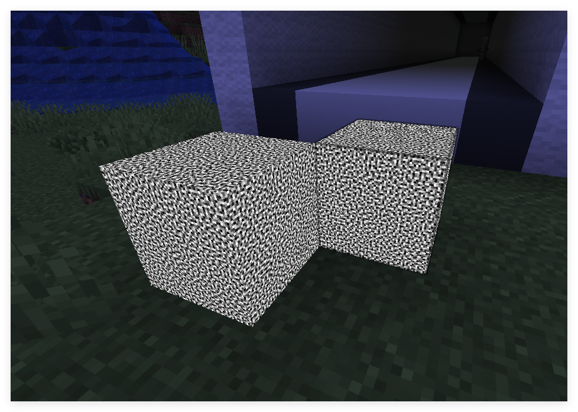

Complete light and shadow calculations and dithering are added below

```glsl
if(isTargetFace == 1) {
    vec4 color = textureImg(Sampler0, colorCoord, 128.0);
#ifdef ALPHA_CUTOUT
    if (color.a < ALPHA_CUTOUT) {
        discard;
    }
#endif
    vec4 noise = textureImg(Sampler0, noiseCoord, 128.0) - vec4(0.5, 0.5, 0.5, 0.0);        
    vec3 dithered = color.rgb + 0.5 * noise.rgb;
    vec4 quantized = vec4(step(0.5, dithered), color.a) * vertexColor;

    quantized = mix(FogColor * vec4(1, 1, 1, color.a), quantized, ChunkVisibility);
    fragColor = apply_fog(quantized, sphericalVertexDistance, cylindricalVertexDistance, FogEnvironmentalStart, FogEnvironmentalEnd, FogRenderDistanceStart, FogRenderDistanceEnd, FogColor);
    return;
}
```


Or dither the brightness

```glsl
if(isTargetFace == 1) {
    vec4 color = textureImg(Sampler0, colorCoord, 128.0);
#ifdef ALPHA_CUTOUT
    if (color.a < ALPHA_CUTOUT) {
        discard;
    }
#endif
    float noise = textureImg(Sampler0, noiseCoord, 128.0).r - 0.5;
    float gray_scale = dot(vertexColor.rgb, vec3(0.299, 0.587, 0.114));
    float dithered = gray_scale + 0.5 * noise;
    float quantized = step(0.5, dithered);

    color *= quantized;

    color = mix(FogColor * vec4(1, 1, 1, color.a), color, ChunkVisibility);
    fragColor = apply_fog(color, sphericalVertexDistance, cylindricalVertexDistance, FogEnvironmentalStart, FogEnvironmentalEnd, FogRenderDistanceStart, FogRenderDistanceEnd, FogColor);
    return;
}
```


