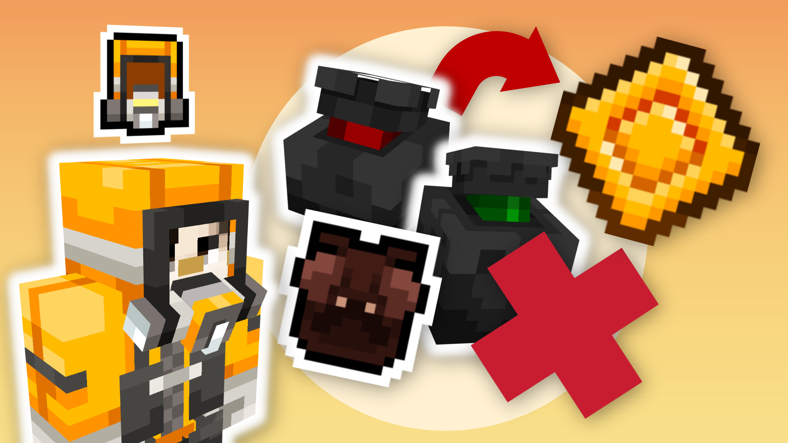
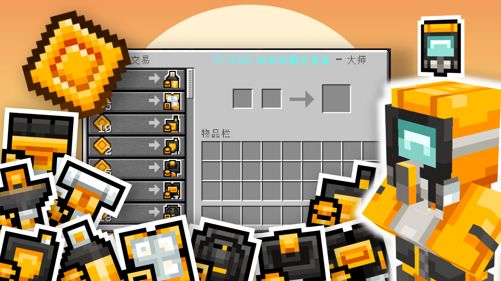
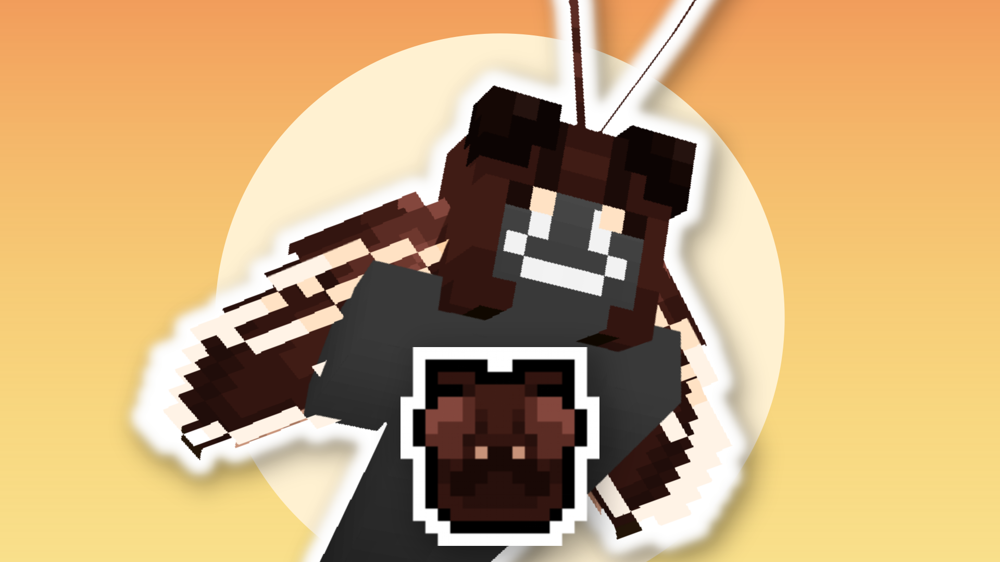
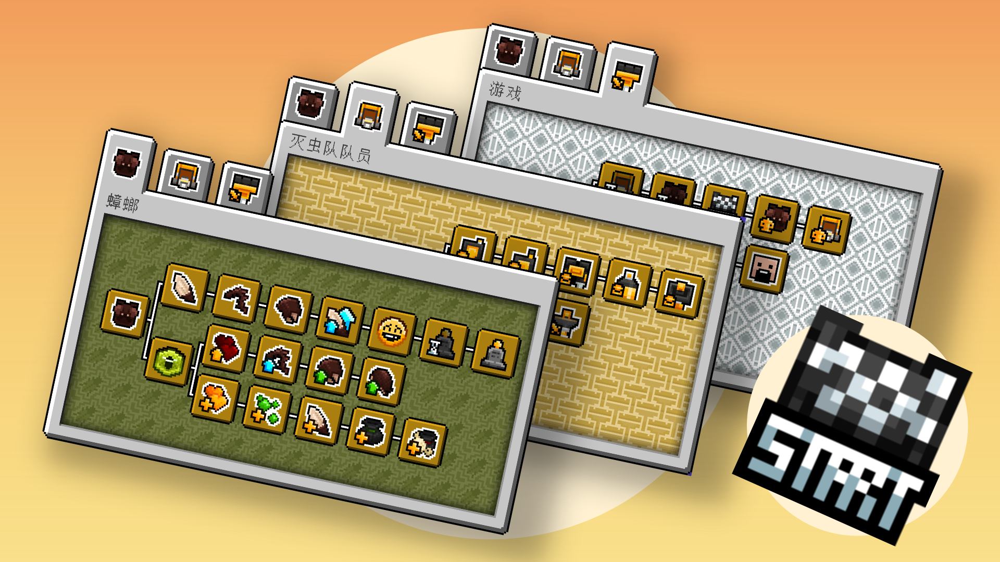
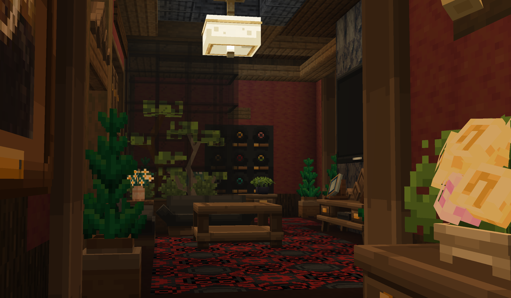
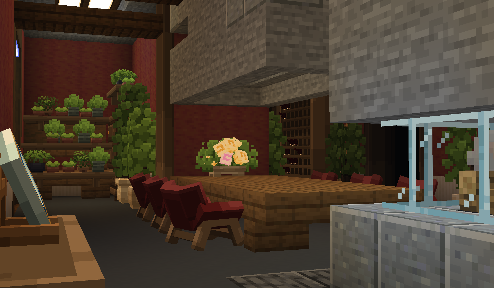
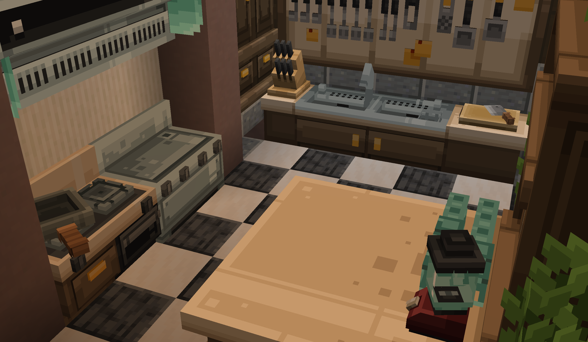

::: tip Translation notice
This page was translated with machine translation and may contain inaccuracies. If you can help improve it, please open an issue or submit a pull request.
:::

<FeatureHead
    title="The cockroach must die! Pest Cant Pass!"
    authorName="CR_019"
    :extraAuthors="['镇川','轩宇1725']"
    cover = '../../../../../feature/archive/202607/_assets/5.png'
    resourceLink = 'https://www.bilibili.com/video/BV175Ta6BE3k'
/>

> When you find one cockroach in your home, it means there are already a thousand cockroaches hiding in the dark...
> Having said that, who can resist turning into a Cantonese twin ponytail!

## **【 NEW MAP | Brand new map 】**

The latest 1.21.11version multiplayer mini-game map **[Cockroaches Must Die Pest Can't Pass]** is now released

Players can choose to play as **[Pest Exterminator]** or **[Cockroach]** and start a chase in the mansion. Before the time limit is reached, as long as there are **[Cockroaches]** alive, **[Pest Exterminator]** will fail.

***

## **【INTRODUCTION | Game details】**

### **[Pest Control Team]**.png)

> Professional harmful mob elimination team, if this job is not completed, they will all be fired

In the game, by attacking **[cockroaches]** and cleaning up the **[garbage]** left behind by [cockroaches], the exterminator team can obtain **[Performance]**

**[Performance]** Used to purchase various powerful props in the game. Each prop has a powerful ability to assist in exterminating pests.

### **【Cockroach】**.png)

> A little mob that crawled out of the sewer and likes to eat cakes

**[Cockroach]** has the ability to fly and climb walls, can taunt **[Pest Exterminator]**, and can also evolve by eating food in the scene

Evolve to gain more powerful abilities and upgrades to escape increasingly powerful **[Pest Exterminator]**

### **[Others]**.png)

### There is a [Help Menu] built into the game. You can view it by pressing the [L] key to open the achievement menu.

There is a **[Administrator]** team in the game. After joining the administrator team, you can adjust the values ​​of various rules in the game.

***

### **【 NOTICE | Note】**

* The mini-game map uses a specially made texture pack. Please play it after installing the texture pack correctly.

* The game supports more than 2 people, and the optimal number of players is 5-10 people.

* The game supports random team division by the system. The ratio of players is that one out of every five players will play the role of [Pest Exterminator Team].

### **【 SCENCE | Game screenshots 】**

***

### **【 CREDIT | Production Team 】**

Art | Jincheon ABraHam\_Sid\_

Program | CR\_019

Program | Ran\_nano

shader | Xuanyu1725 XuanYu1725\_XYU

Construction Assistance ｜ Fishing Cat Yumaooo\_

Special thanks | Utility knife Knife\_MGD

