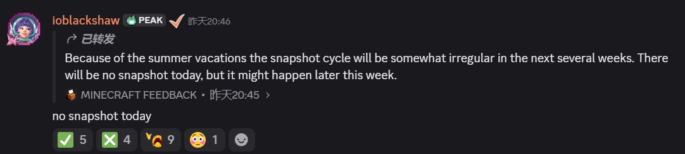

<SpotlightHead
    title = "Vanilla News - Mojang Spotlight - July 2026"
    authorName = "Alumopper"
    cover='../../../../../feature/archive/202607/_assets/spotlight.png'
    type=0
/>

>Hello? Hello? Microphone test

Ahem, although it’s a bit late, here is the ***Vanilla*** news, the most ***Vanilla*** technical snapshot news in Minecraft, our reporter *Vanilla Fox* reports the latest snapshot news for you~

This month is the first month of snapshots for version 26.3, and a lot of new content has been released. Of course, snapshot-4, which was supposed to be released yesterday, was delayed because Mojang employees were on summer vacation (yes), but the three snapshots in this round are still plenty!

> I waited until midnight and found out that there were no snapshots. I went to DC and found out that Mojang was on holiday.
> 

Currently, the data packversion has reached **110.0**, and the resource packversion has reached **91.0**.

Let me talk about the conclusion first. This round of updates is extremely practical and moderately destructive. Overall, it is at the level of **Super Large Cup**.

Since this column mainly summarizes technical snapshot content, it will not involve gameplay changes.

## world generation

Mojang has made significant changes to world generation related content. Although these changes have added many more general data-driven capabilities, they have also significantly changed the names or formats of many fields and feature types.

### Surface rules (old)

in noise settings`surface_rule`The field is renamed to`material_rule`. At the same time, the game has added`worldgen/material_rule`and`worldgen/material_condition`Two registries are used to define the original surface rules and surface rule tests respectively.

The JSON format of the new rules and tests is basically the same as the original surface rules. In addition to inline definitions, it is now possible to reference namespaceIDs in the registry. This move greatly improved the reusability and readability of surface rules (Mojang was finally willing to take this thing apart). For old data packs, the original surface rules are still valid, only the field names need to be changed.

In addition, the surface rule test has a new`height_match`、`all_of`、`any_of`and`not`, you can combine height and logical conditions.

### Structures, features and carvers

Feature registry configured`worldgen/configured_feature`was renamed to`worldgen/feature`, all features were originally located in`config`The configuration fields in have also been moved to the root tag. Engraver registry configured`worldgen/configured_carver`is renamed to`worldgen/carver`，`cave`and`canyon`The engraver was originally located in`config`The fields in have also been moved to the root tag.

Changes to the carver also include:

*`cave`Joined`count`、`start_vertical_radius_multiplier`、`thickness`and`weird_thickness_bias`fields, and replace`yScale`Rename to`room_vertical_radius_multiplier`。
* `canyon`of`yScale`was renamed to`shape.y_scale`.
* Both engravers have been removed`replaceable`、`lava_level`and`debug_settings`field.
* Removed`nether_cave`Engraver type whose function consists of`cave`substitute.

Some feature types that originally had fixed uses have also been transformed into more general versions:

*`basalt_columns`was renamed to`stepped_column_cluster`。
* `basalt_pillar`was renamed to`single_block_pillar`。
* `glowstone_blob`was renamed to`random_neighbor_spread`.
* Joined`overlay`Ground object type, regardless of whether a single ground object is placed successfully or not, a given set of ground objects will be tried to be placed at the same location in sequence.
* Joined`projected_random_patch_square`The type of ground object determines the placement probability of blocks based on the distance from the center of the square, and supports downward projection of blocks.
* Joined`end_podium`The tile type used to place active or inactive return portals.
* Removed`coral_mushroom`、`kelp`、`seagrass`and`sea_pickle`Feature type;`coral_claw`and`coral_tree`then joined`feature`Field to generate the actual block using the given placed features.

Joined`dimension_origin`Structure placement type, placing a structure instance at the dimension origin. For dimensions using the noise setting, this origin is given by`spawn_target`Determine, otherwise chunk(0,0).

In addition, this round of snapshots also adds or changes other world generation-related content:

* Joined`height_range`blockpredicate, the vertical anchor point has also been added relative to the dimension sea level.`relative_to_sea_level`options.
* Joined`copy_properties_provider`The block state provider copies the block state attributes shared by the current block and the output block to the output result. Its fields were finally named in snapshot-3`source`.
* Joined`random_block_provider`Block state provider, randomly selects a block from a block, block list or blocktag and returns its default state.
* Place modifier`random_offset`was renamed to`offset`, the original`xz_spread`and`y_spread`independent`x`、`y`、`z`Integer provider override.
* Joined`cuboid`and`random_chance`Placement modifiers are used to repeatedly place objects within the cuboid and to place objects based on probability.
* in noise settings`spawn_target`It is now possible to use arbitrary density functions and describe candidate spawn points by target ranges on multiple density function axes.
*`place feature`command can now directly accept configured objects defined inline.

## Slot source

The slot source that was originally only used for the loot table system was officially connected to the command system in this round of snapshots. The data pack is now available in`slot_source`Define the slot source in the folder and use the new`reference`Slot source types refer to them by namespaceID.`slot_range`of`source`Field added`container`Get the value and set it as the default value;`contents`The slot source can also select empty slots.`execute`Joined`if|unless slots`Condition, used to detect whether the block or entity has a slot that matches the given slot source. original`if|unless items`Also changed from accepting slots to accepting slot sources. They will all use new`command_slot_source`Loot context is parsed.`item`The positions in the command that originally accepted slots now also accept slot sources, so multiple slots can be processed at one time, or even slots from multiple source entities can be connected in series.`item`You can either modify a series of slots or pass the original`from`Select an ordered sequence of items from a series of slots. Now in addition to the semantically adjusted`replace`In addition, two new subcommands have been added:

*`item fill`: Repeat the source item sequence until all target slots are filled.
*`item override`: Use the source item to cover the target slot, and clear the redundant target slots that do not have corresponding source items.

original`hotbar.4`、`armor.chest`and`container.*`Slotted strings are still valid, they are treated as`slot_range`Short for slot source. (Mojang’s rare compatibility consideration)

## Data components and data drivers

Joined`block_transformer`Data component. When an item with this component interacts with a block, it can convert the block into the result given by the block state provider according to a series of rules. Each rule can also control sounds, particles, non-interactive surfaces, loot tables, drop locations, whether to consume items or durability, and whether to link the other half of a large copper box.

Joined`number_provider`Registry, the value provider.

Joined`compostable`Data component.`compostable`use`layers`The field refers to a value provider that describes the number of layers added each time the item is used for composting.

### Brewing recipe

Joined`brewing`Recipe type, potion brewing can now be defined via data pack. Each brewing recipe contains`input`、`reagent`and`output`Three main fields; when entering items and brewing materials, you can specify the item, item list or itemtag, and you can also attach`potion_contents`Component predicate, the output uses the item template format, and can have components.

### Other component changes

* Joined`provides_pottery_pattern`Data component, use namespaceID to specify the pottery pattern provided by the item.
*`pot_decorations`Data components and blockentity of decorative clay pots`sherds`Field changed from list to include`back`、`left`、`right`and`front`An object with optional fields.
*`potion_contents`The data component predicate now uses`potions`Match potion ID, ID list or tag and use`effects`Collection of matching status effects.

## resource pack and rendering

Joined`posteffect`command, you can use`add`、`remove`、`clear`and`list`The subcommand manages the player's post-processing effects. Post-processing effects only exist on the client, and the server does not know whether the effects were actually successfully applied.

resource pack can also be defined`minecraft:end_of_frame`Post-processing pipeline. As long as the resource pack is loaded, this effect will be enabled before other effects and cannot be passed`posteffect`command is closed; when multiple resource packs are defined at the same time, the definition loaded last shall prevail.

The "Improve Transparency Display" option uses the new Order-Independent Transparency (OIT) algorithm, adds corresponding shader files and definitions, and removes the old transparency post-processing chain. Some core shaders at the boundary between cloud and world have also been removed.`rendertype_`prefix.

Elements of the baking model have been added`shade_direction_override`Field that specifies the orientation used when calculating shadows. Subsequently, the original`shade`Field is removed; to keep`shade: false`The effect needs to be changed to`shade_direction_override: "up"`.

## Miscellaneous

* Equipment assets added`trim_palette_replacements`field; armor ornamental material`asset_name`quilt`palette_id`alternative,`override_armor_assets`was removed. Armor crest palette textures have also been moved to a new path.
* Goat horn instrument definition added`durability_damage`fields,`use_duration`Can now be 0.
* In server configuration`white-list`The default value was changed to`true`。
* `give`and part`tick`The subcommand will directly return an error when it fails;`team join`and`team leave`Now returns the number of entities that actually changed the team.
*blocktag`#convertable_to_mud`was corrected to`#convertible_to_mud`，itemtag`#dowses_campfires`was corrected to`#douses_campfires`.

Please check the update log for more details~

*26.3-snapshot-1:&lt;https://zh.minecraft.wiki/w/Java%E7%89%8826.3-snapshot-1&gt;
* 26.3-snapshot-2：&lt;https://zh.minecraft.wiki/w/Java%E7%89%8826.3-snapshot-2&gt;
* 26.3-snapshot-3：&lt;https://zh.minecraft.wiki/w/Java%E7%89%8826.3-snapshot-3&gt;
