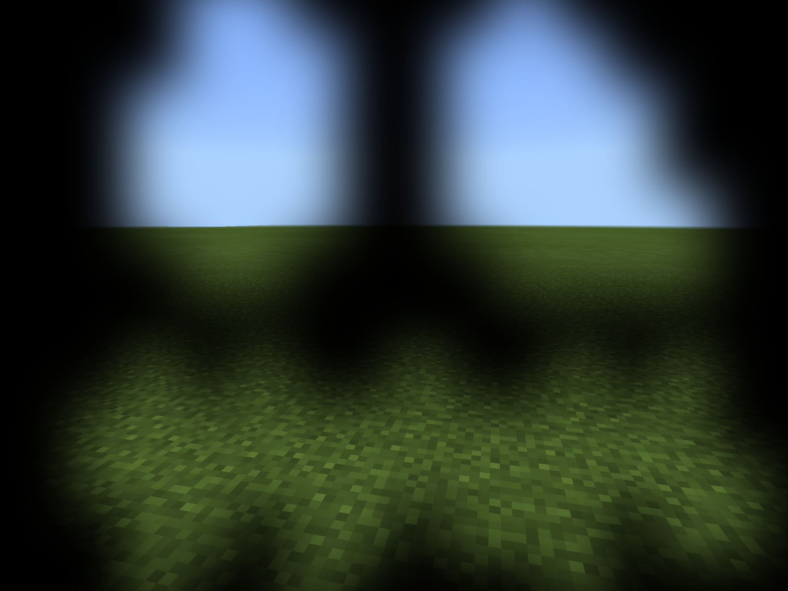
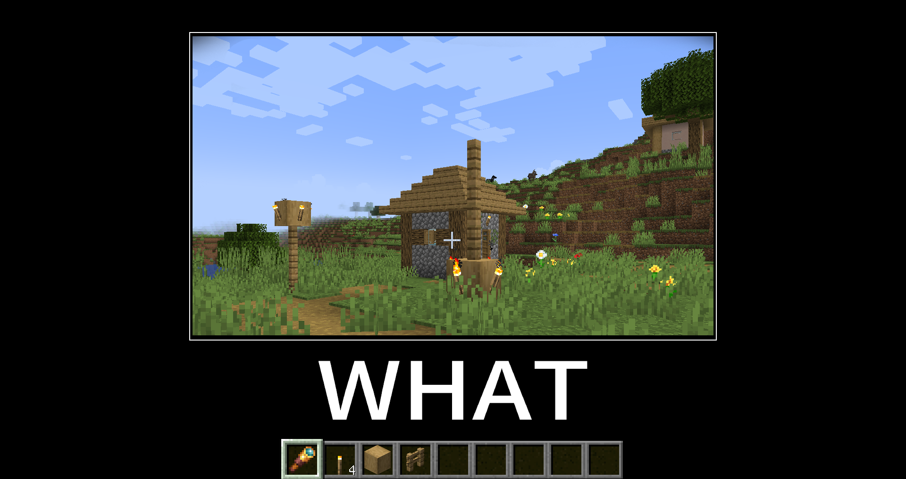
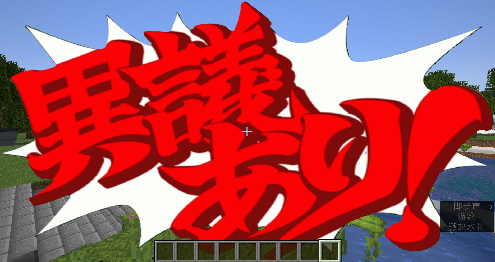
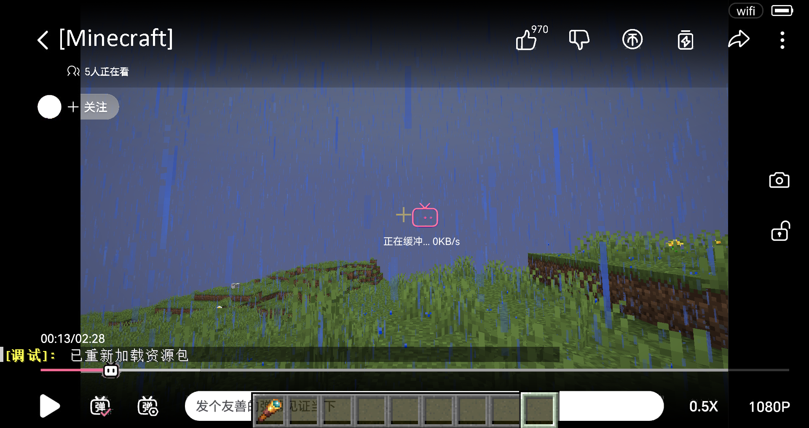
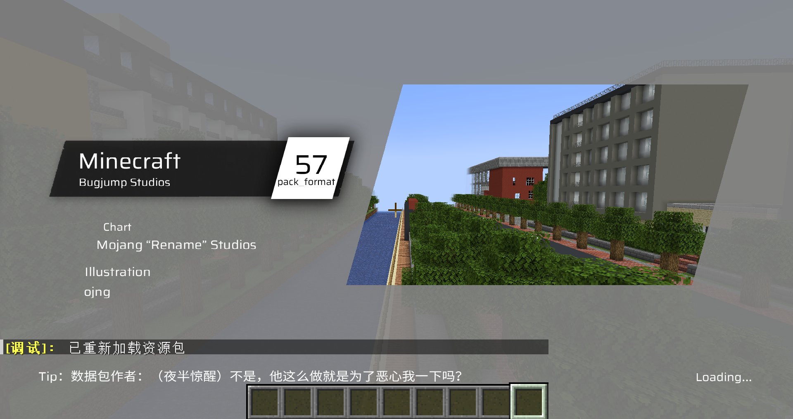
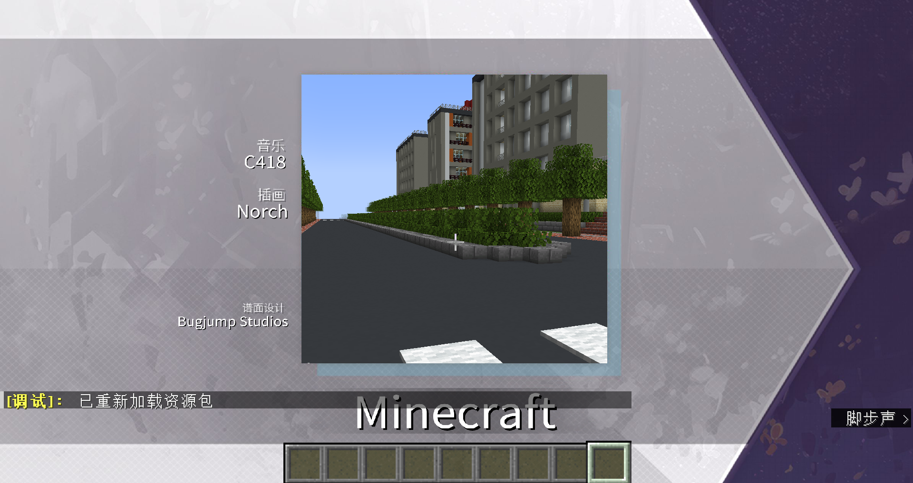
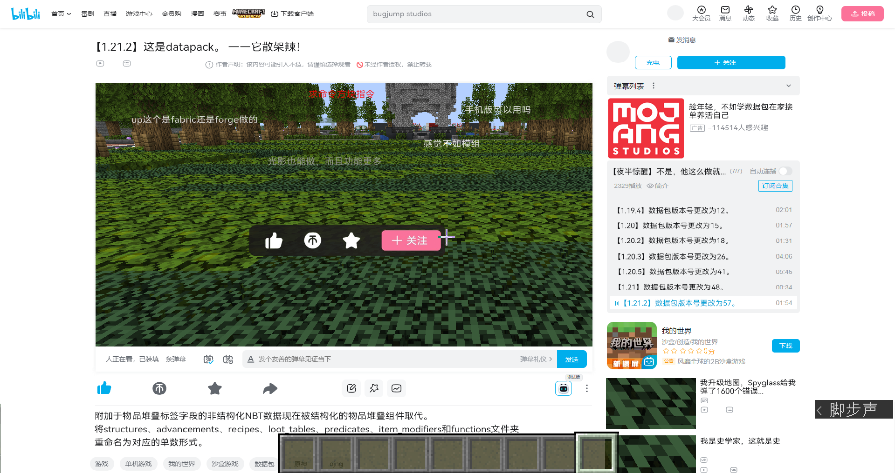
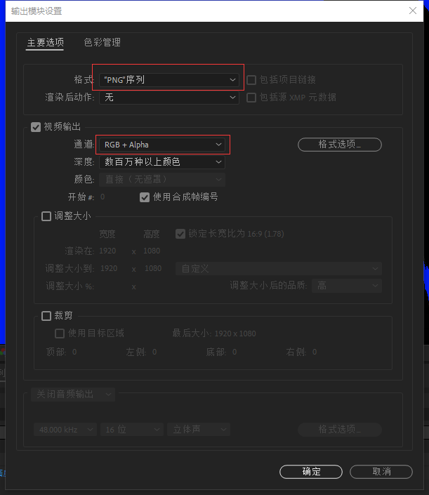
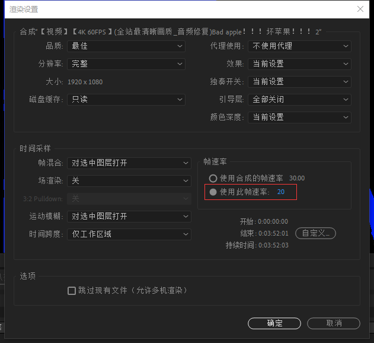
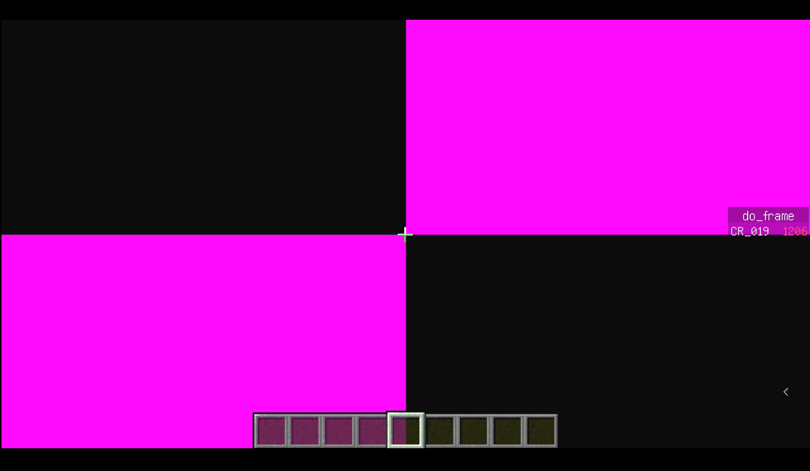

::: tip Translation notice
This page was translated with machine translation and may contain inaccuracies. If you can help improve it, please open an issue or submit a pull request.
:::

# A little research on equipment mask (camera_overlay)
> by [CR_019](https://space.bilibili.com/85292644)  
> This article was also published in [Void Spirit Forum](https://etis.vcsofficial.site/d/25) and [BiliBili column](https://www.bilibili.com/read/cv39806935/?spm_id_from=333.1387.0.0&opus_fallback=1)

version：1.21.2-pre1
camera_overlay is a field in the equippable component. It can reference the path of any picture in the resource pack, so that when the player wears the item at the specified position, the mask will be displayed on the screen. Applied to the carved pumpkin head in vanilla.



But unfortunately, it is not very suitable for making playerui. On the one hand, it is because it will automatically adapt to the resolution of the player window and will stretch very much in extreme cases; on the other hand, it does not support animations and can only stack up to 6 layers. If you need to make some value type UI components, it is recommended to use other methods, such as title, etc., such as this [Library for displaying title at any position](https://www.bilibili.com/video/BV1AcvyeyECH)。

## Edible Tutorial
For example: in`assets\what\textures\item`There is this picture in the folder:

what.png

We use the following command to obtain an item that uses the image as a mask:
```mcfunction
give @s minecraft:firework_star[minecraft:equippable={camera_overlay:"what:item/what",slot:"mainhand"}]
```


Here we set the slot to the main hand, so that when the player holds this item, he will————


Coupled with the equipment_sound field for playing sounds when equipped, many humorous effects can be produced:

https://www.bilibili.com/video/BV1rf2wYPEg9

Of course, there are also these:


> Thank you, I'm already pressing esc.


> A pound of pear!


> That's right, you're stuck



> Aiyinyouchi


> A little bit resentful

Collection version:
https://www.bilibili.com/video/BV1WVCSY8ENW
https://www.bilibili.com/video/BV1PV2PYCE6B


## Make the mask move!
Of course, we are certainly not satisfied with doing all this work.
It’s natural to have an idea: Can you put animated pictures?
But as we said at the beginning, the mask does not support vanilla dynamic textures and can only be a static picture.

But what if it is combined with data pack?

We know that video is essentially a series of pictures played in sequence. If we disassemble the video into a series of pictures and use data pack to control the frame sequence to play in sequence, we can achieve a dynamic effect.

Just do it, let's find a video and try it out.
How about... putting a bad apple?

### Simply put a bad apple

#### Generate frame sequence using ae
First we need to get the frame sequence of the video. Can be generated using after effects.
Find the video and download it, import it into ae, in order to reflect the mask, we deduct the white part of the video (the process is omitted), click File->Export->Export to Rendering Queue

First click on the output module, change "Format" to "PNG Queue", and set "Channel" to "RGB+Alpha";

Since the default ticking rate of MC is 20 frames per second, in the rendering settings, set the frame rate to 20;

To facilitate calling, we need to output simple and regular file names;
In the output options, set the file name to [#].png, so that an increasing sequence of numbers can be output for easy calling.
#### Put into resource pack
I first put the generated frame sequence pictures into the textures/item path, and then... the resource pack exploded ∑(;°Д°)
Not only is the texture wrong, but it also takes several seconds to load one frame;
The reason is that in order to speed up access, the pictures in the item and block folders will be merged into atlases by the game and preloaded into the memory. However, due to the large size and excessive number of frame sequence pictures, the game is overwhelmed.

In fact, the mask does not need to be preloaded when loading the resource pack. It can be placed in other paths under the textures folder, such as misc or whatever, any path will do.

#### data pack sequence control
On the data pack side, we use a field`dynamic_overlay`To identify the dynamic mask name;

data/do/function/tick.mcfunction:
```mcfunction
execute as @a[tag=do] unless data entity @s Inventory[{Slot:103b}].components."minecraft:custom_data".dynamic_overlay at @s run function do:end
execute as @a[tag=do] if data entity @s Inventory[{Slot:103b}].components."minecraft:custom_data".dynamic_overlay at @s run function do:play
execute as @a[tag=!do] if data entity @s Inventory[{Slot:103b}].components."minecraft:custom_data".dynamic_overlay at @s run function do:start
```


The dynamic mask name corresponding to this field is stored in the storage path stored in minecraft:do, such as:
```mcfunction
data modify storage do storage.ba_480 set value {path:"ba:480",frames:4642,music:"ba:bad_apple",loop:0b}
```

Among them, "path" is the mask frame sequence path of the resource pack; "frames" represents the length of the frame sequence, "music" (optional) represents the music played at the same time as the playback sequence; "loop" is a Boolean value, representing whether to loop;

When a player headband is detected`dynamic_overlay`When the item of the field is selected, start the start function.
data/do/function/start.mcfunction:
```mcfunction
tag @s add do

data modify storage do temp set value {}
data modify storage do temp.key set from entity @s Inventory[{Slot:103b}].components."minecraft:custom_data".dynamic_overlay
function do:init with storage do temp
```

data/do/function/init.mcfunction:
```mcfunction
$data modify storage do temp.data set from storage do storage.$(key)
execute if data storage do temp.data run function do:init_
```

data/do/function/init_.mcfunction:
```mcfunction
execute if data storage do temp.data.music run function do:music with storage do temp.data
scoreboard players set @s do_frame 0
execute store result score @s do_frame_max run data get storage do temp.data.frames
```


Give the player a tag and add`dynamic_overlay`Extract the value of the field, search for the corresponding data in the storage, complete the initialization, and play the music;

Then detect the player with the tag and execute the playfunction:

data/do/function/play.mcfunction:
```mcfunction
data modify storage do temp set value {}
data modify storage do temp.key set from entity @s Inventory[{Slot:103b}].components."minecraft:custom_data".dynamic_overlay
function do:play_ with storage do temp
```

data/do/function/play_.mcfunction:
```mcfunction
$data modify storage do temp.data set from storage do storage.$(key)
execute if data storage do temp.data run function do:play__
```

data/do/function/play__.mcfunction:
```mcfunction
execute store result storage do temp.data.cur_frame int 1 run scoreboard players get @s do_frame
execute unless data storage do temp.data.slot run data modify storage do temp.data.slot set value "head"
function do:item with storage do temp.data


execute if score @s do_frame < @s do_frame_max run scoreboard players add @s do_frame 1
execute if data storage do {temp:{data:{loop:1b}}} if score @s do_frame >= @s do_frame_max run function do:start
```

data/do/function/item.mcfunction:
```mcfunction
$item modify entity @s armor.$(slot) [\
    {\
        "function": "set_components",\
        "components": {\
            "equippable":{\
                "camera_overlay": "$(path)/$(cur_frame)",\
                "slot": "$(slot)",\
                "equip_sound":{sound_id:"do:empty"}\
            }\
        }\
    }\
]
```


Since temp is not a persistent storage, its value needs to be obtained every moment;
This part of the instructions is actually very similar to start and initfunction. The difference is that it is used to set the item component and does not require initialization.
Add the current frame information by +1 every moment;

itemfunction sets an inline item decorator, path is the path of the dynamic mask; cur_frame is the current frame.

When the frame sequence is played, check whether loop is true. If so, execute the initialization function again and play from the beginning.

Of course, if it is detected that the player has taken off the equipment, the current frame control needs to be stopped and the music stopped.

data/do/function/end.mcfunction:
```mcfunction
tag @s remove do
stopsound @s
scoreboard players set @s do_frame_max 0
scoreboard players set @s do_frame 0
```


#### You're done! ...?
Load the data pack and resource pack into the game, put on the monitor, and you can actually see it playing.

But I encountered a problem: about halfway through, the mask suddenly turned into a purple and black block, and the game crashed after a while.



After some troubleshooting, I found that when playing dynamic masks, the previously loaded images were not unloaded in time, causing memory overflow.

I have no choice but to reduce the resolution to 480p and re-export it. This way, there will be no obvious increase in memory after playing, and it can be used.

That's why this video was created.
## summary
Masking does not seem to have many applications in map development, but it is still very interesting in itself and worth playing. It is a relatively simple thing that can produce better effects.
