# How to make an Aqiao (model) - also talk about the itemmodel mapping system of 1.21.4
> by [CR_019](https://space.bilibili.com/85292644)
> This article was also published in [Void Spirit Forum](https://etis.vcsofficial.site/d/97) and [BiliBili column](https://www.bilibili.com/opus/1024906920604991522?spm_id_from=333.1387.0.0)

I posted [this video] the other day (https://www.bilibili.com/video/BV1Cok1YSER1/), made Aqiao from Genshin Impact into MC. It can be found that it will take on different shapes when held in the main hand, deputy hand, and in use. This is completely implemented using resource pack, using the itemmodel mapping system newly added in 1.21.4.  

What is itemmodel mapping, you ask? This has to start with the item_model component...

# Item_model component and item model binding

Students who are slightly familiar with resource pack know that MC’s item model consists of several parts:
- First is the texture map;
- Then there is the model file, which combines the texture maps into the specified model;
- Finally, the item in the game calls the model file of the resource pack and renders it.
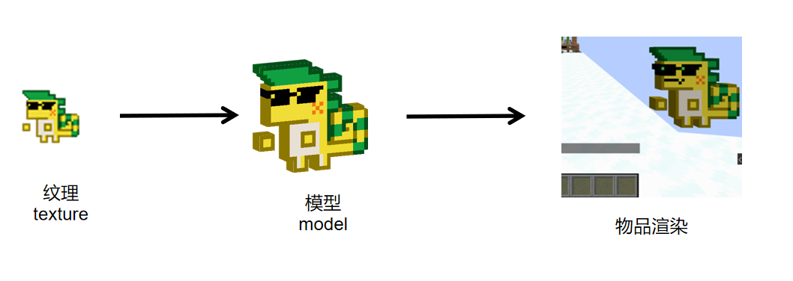

In the old version, the item model and itemID had a one-to-one correspondence, the model used by each item was fixed, and the resource pack could not be changed.  
If we want to change the model, we can only add the **overrides** field below the item model used by vanilla, reference the path of the custom model to the bottom of the vanilla model file, and change the applied model based on the item data.

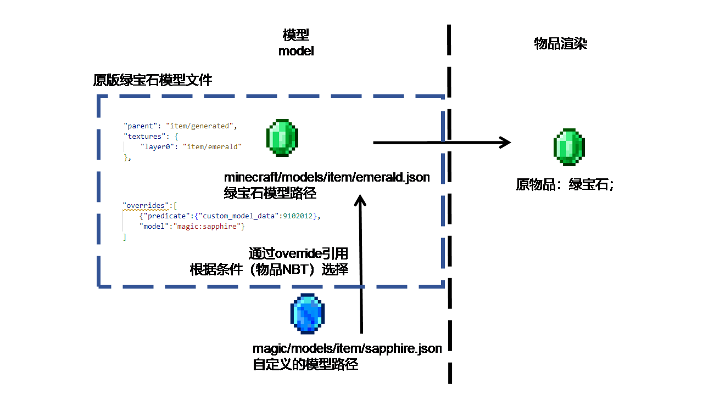
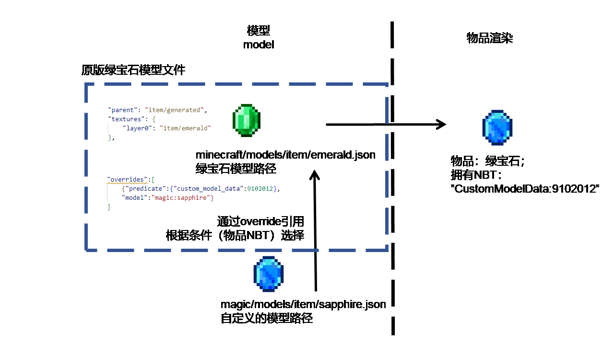

In this way, we have basically solved the problem of adding textures to custom items in the data pack. However, this approach also has some disadvantages. Because the overrides fields will cover each other, and this field is only valid in the model file directly referenced by the item (here it is only valid in the vanilla item model).
For example, two resource packs modify the same item.`overrides`, then only the upper one will take effect.

In version 1.21.2, mj introduced`item_model`item component, specify the path of the model in this component, and you can directly use this model to render the item.

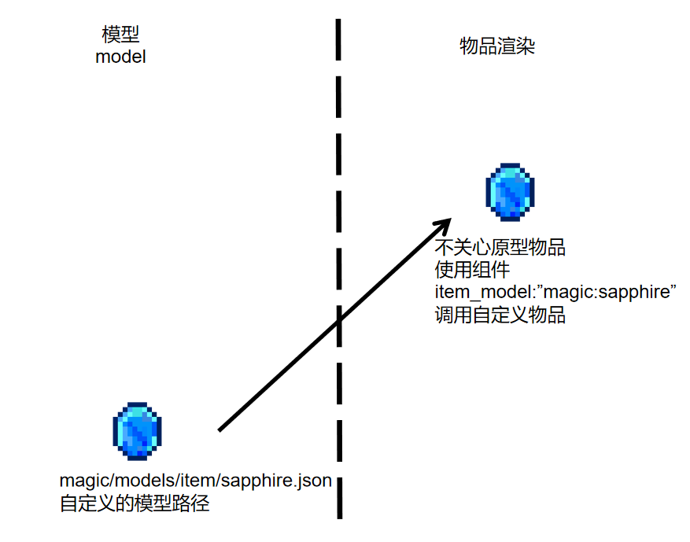

Now, we can think that the binding of the item model has changed from hard-coding in itemID to binding to`item_model`item component (vanillaitem can be considered to have a default`item_model`components). In this way, we can use custom models more freely without caring about prototype items.

Of course, the overrides field written in the custom model can also take effect.

Therefore, an item rendering process becomes like this:
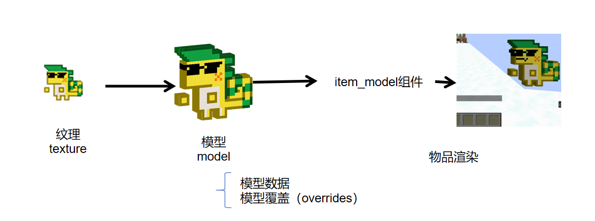

# itemmodel mapping

Now, let's focus on this override.  

This field is part of the model file, but does not provide any model information by itself. Its function is to select a model that meets the conditions based on the **data/status** of the item. In addition, only the overrides in the model file directly referenced by the item take effect, and the field in the lower model does not take effect.

It can be found that this field is very suitable to be separated from the model file, made into a conditional control structure, and placed between the model and item rendering.

So that's what mojang did. This is **itemmodel mapping**.
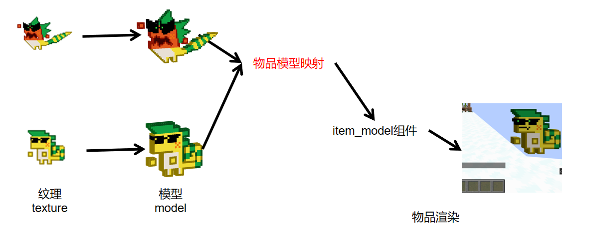
In the new mode, the model file returns to the positioning of describing the model data, and the work of selecting the model is left to the independent itemmodel mapping.

itemmodel mapping is a separate file located in the same file as the model (`model`), texture(`texture`) level`items`folder. Now`item_model`The component's path points to the path of this file. In the mapping file, point to the specific model path according to the specified conditions.

Taking the magic:sapphire above as an example, now point to`assets/magic/items/sapphire.json`document.

# Write a mapping file

## model mapping
> Anchor anchor, the model mapping you talked about is very advanced, but too convoluted. Is there any simpler teaching?  
> Some brothers, some, this kind of teaching, and two more...
> (silencing)

When getting started, the easiest way is to unpack the vanilla resource pack and see how Mojang writes it.  

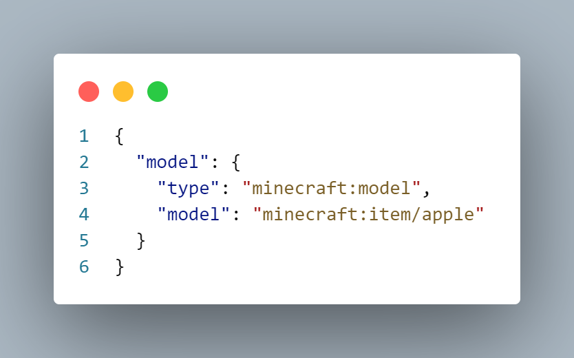

The above is the simplest item mapping file, taken from the vanilla Apple item.  
The model under the root tag is a fixed key name, and a compound tag followed by it is an **item mapping**.  
**Notice** the type key, which is the type of model mapping. The value of this key determines other fields in the tag.  
In the example, the value of type is model, which is the most basic item mapping, indicating that an item model is specified for rendering.  
The model key below is used to specify the path of the model.  
Then we follow the same example and define our own model mapping file:
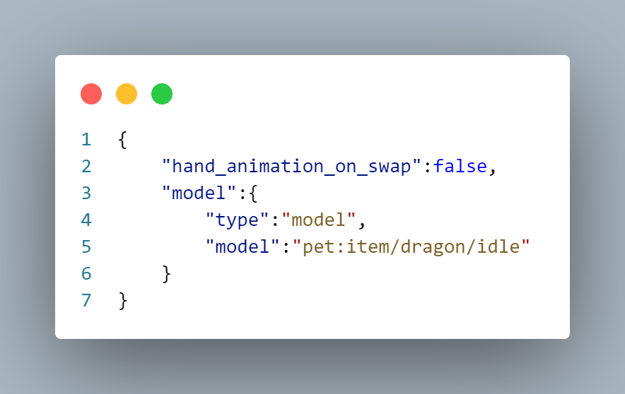

In this way, we have completed the writing of the simplest itemmodel mapping file: without any conditional selection, the same model is selected in various states. In fact, most vanilla items and custom items only need this.

## Composite itemmodel mapping

But the "Great Holy Dragon" Kuhule Acho is not the "majority". Holding it in the main hand, off-hand, holding it on the mouse cursor, Acho's model has some changes. This involves conditional selection, which is the real role of the itemmodel mapping system.  
Open the wiki and go to the itemmodel mapping page (you can search it directly). We can find this picture:
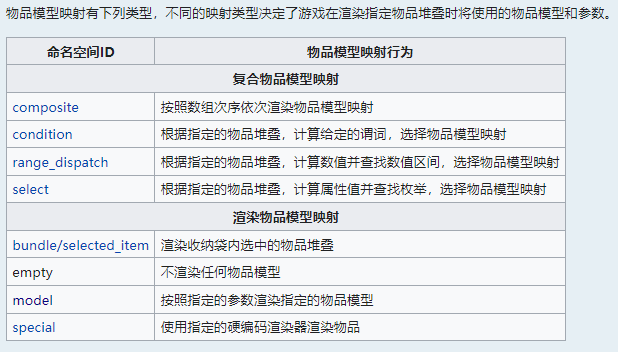

The items given here are the types of all available item mappings, that is, the values filled in "type".  
The wiki divides the mapping types provided into composite itemmodel mapping and rendered item mapping. The former contains one or more nested fields, in which other item mappings can be defined; while the latter, such as the model type discussed above, does not contain such fields and is the end of a branch.

> As we can see below, item model mapping is actually a tree structure, rendering model mapping can be regarded as leaf nodes, and composite model mapping is non-leaf node.  
> In addition, composite model mapping actually assumes the function of overrides in the past, but this time mj gives more predicates and can do more things.

The condition selection we are going to discuss next is related to the composite item mapping in the first half.
Mojang provides a series of mapping predicates for detecting item status, which are divided into three categories: Boolean conditional type (condition), enumeration type (select), and numerical range type (range_dispatch).  
There are some differences in the syntax of these three types. Let's take the several conditions required to make Aqiao as an example and explain them respectively.  
### condition type mapping
I want our Acho to show a surprised expression when he is selected by the mouse:

mj provides related predicate:carried, which belongs to condition type.

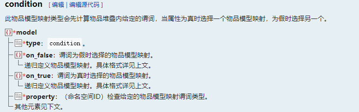

The predicate of this type of mapping is of Boolean type and has two optional values: true or false;

Property is the predicate that needs to be detected. The carried mentioned above belongs to a Boolean predicate, so fill it in here:

on_true and on_false are models that are applied respectively when predicate is detected as true or false. The value of these two keys is a nested itemmodel mapping, which can be a model directly. Of course, you can also write other composite model mappings in it to further select the model;

After adding this condition, our model mapping file now looks like this:

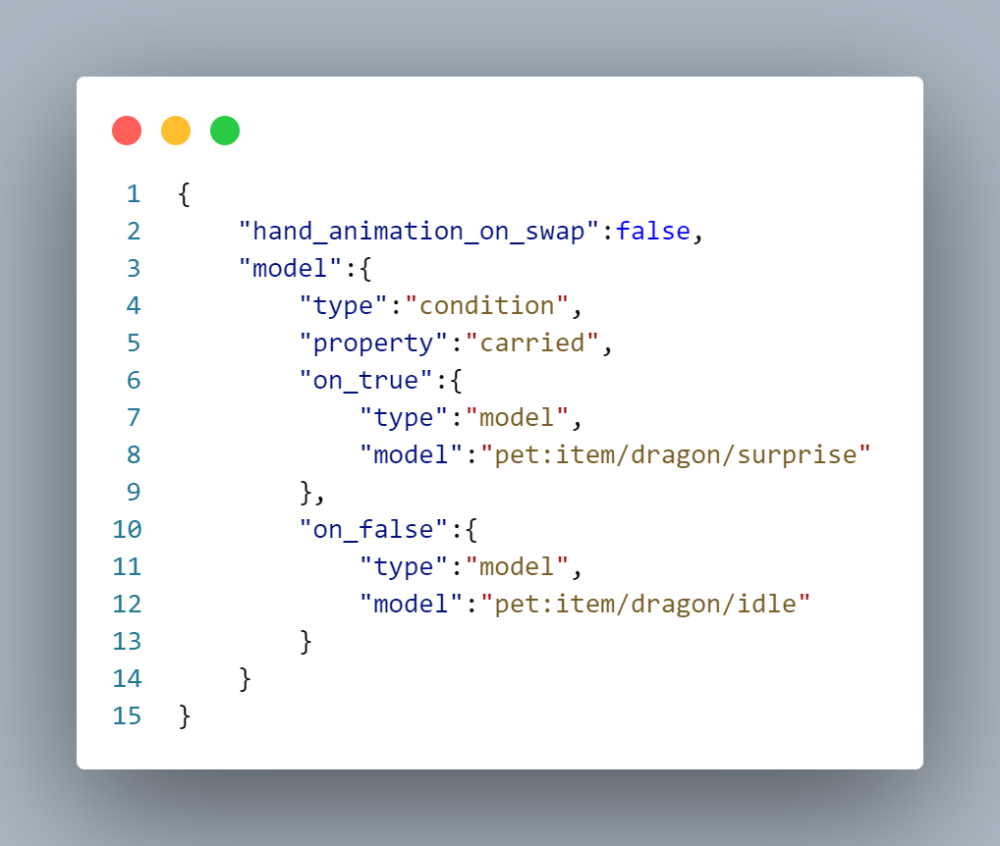

### select type mapping
We hope that Aqiao can talk when he is in the main hand and dance when he is in the off-hand position, and we have made corresponding models.

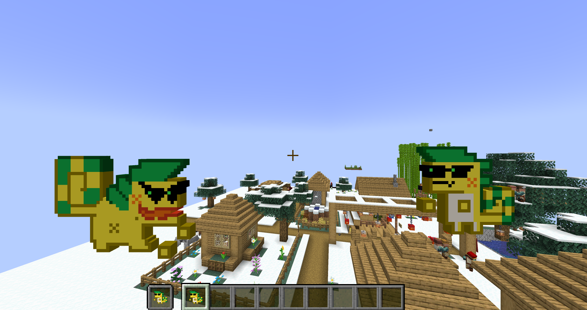

This time, the mapping predicate we need is display_context, which is of type select.

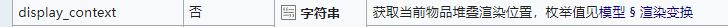
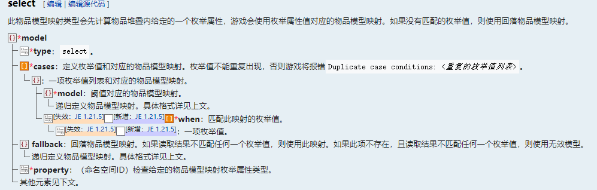

This type is slightly more complicated and can be seen with the examples below.

The value of this predicate is an enumeration type, which has a limited number of values;
Property is still a predicate that needs to be detected, we fill in display_context here;
cases is a list, each item of which represents an enumeration value selection;
An item in the list has two keys:
- when is the matching enumeration value, which can be a value or a list;
- model is the model applied when it matches the above enumeration value, and is a nested model mapping.

In addition, there is a fallback key, which is also a nested model mapping. This mapping is used when none of the above enumeration values ​​match.

The optional values for the rendering position are the same as the display in the model file, so they are not listed here. See the example below;

After adding this condition, our mapping file becomes like this:

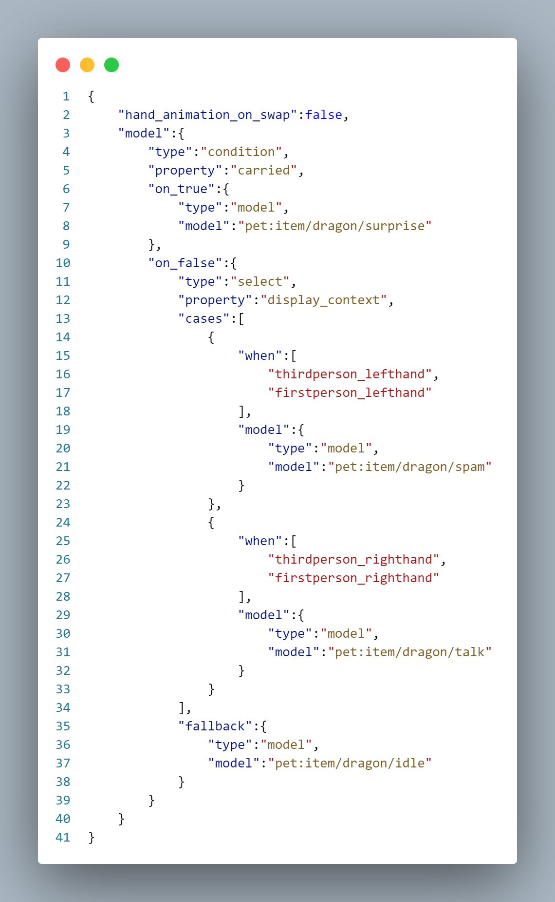

### range_dispatch type mapping
Aqiao's model design does not require the use of this type of predicate, but it is still introduced.

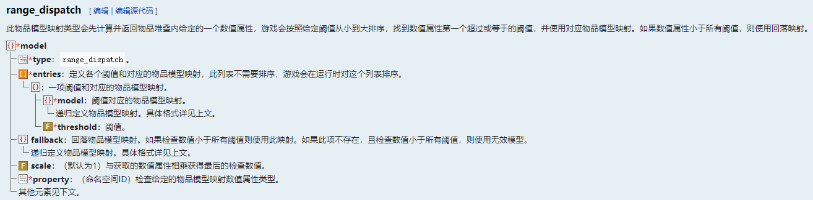

This type of format is similar to select, except that its value is a continuous numeric value.  
We can see the same property and fallback.  
There is an additional scale attribute, which represents the magnification by which the obtained value needs to be scaled. If there are no special needs, just write 1.  
The cases in the select type are replaced by entries, and when is replaced by threshold, the effect is similar. A small difference is that threshold represents a threshold, that is, all values ​​greater than or equal to this value and less than or equal to the next threshold will use the model in this item.  

Here is an example of model mapping that selects the orientation based on the compass pointing value (the magnification is multiplied by 360 to facilitate angle calculation):

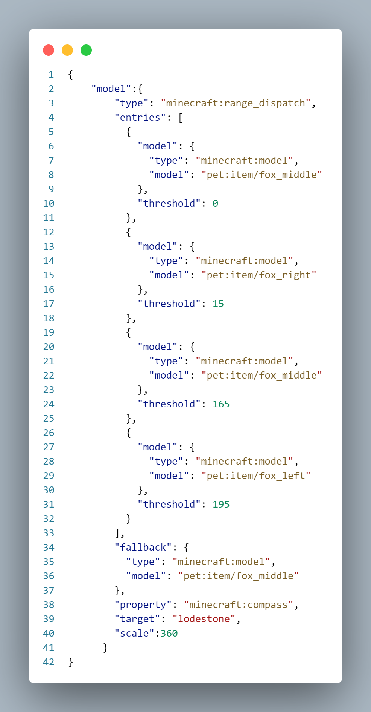

## composite mapping

At this point, we are close to making a complete Acho. But how can it be without the signature tail pulling? :)

Pay attention, this pixel dragon is called Aqiao, and its tail and body are deflected at an angle.  
This kind of model cannot be realized using one texture. So what should be done?  
Return to the wiki image above:

We still need a composite itemmodel mapping of **composite type** that we haven't mentioned yet. And this type is here to solve the problem we raised above.  
Composite is a special composite itemmodel mapping. It does not select a specified model based on criteria like the other three, but merges all models below it together.  
Of course, it's still very simple to use.
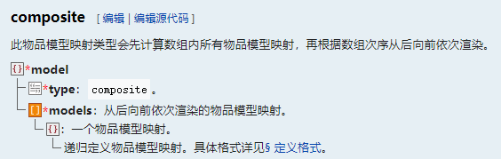

For this Acho, its model is divided into two parts, the hanging tail and the struggling body.

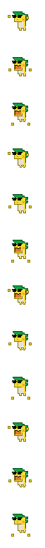  

In the display of the model, we rotated the body part by an angle;
Then in the itemmodel mapping file, we only need to write these two models into the items of the model list.  

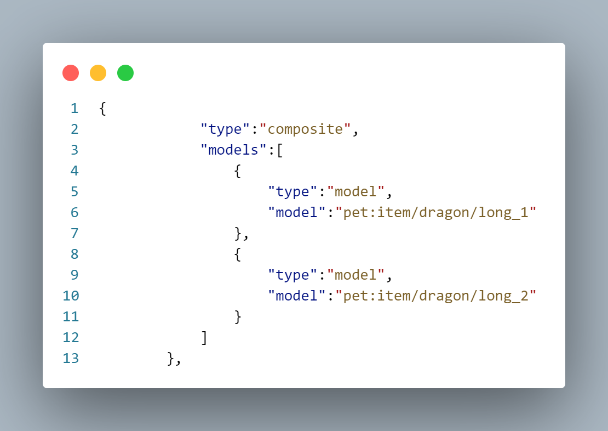

We hope to call this model when using it (that is, pressing the right button). Then, in the outermost layer of our mapping file, set a condition type mapping discussed above, and then put this tail-pulling composite mapping into on_true. So, we got the final file:`assets/pet/items/dragon.json`：
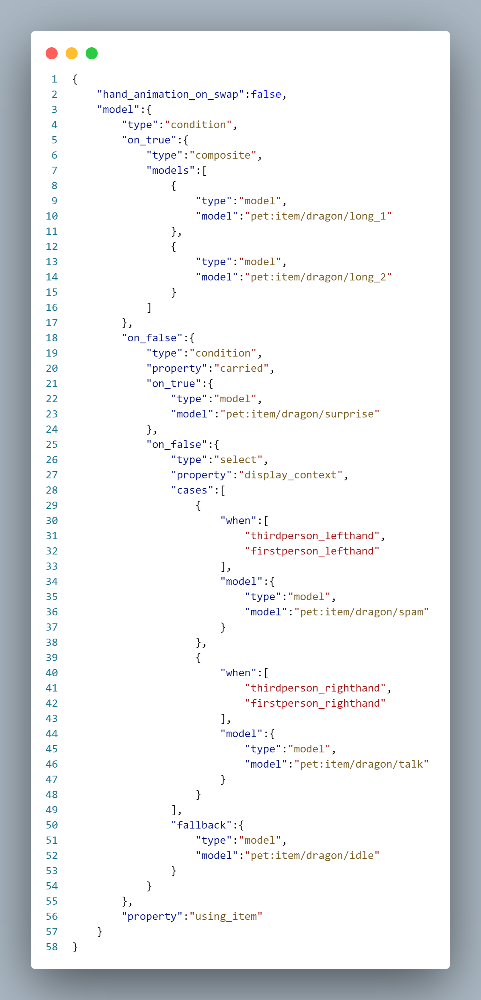

It seems a bit complicated at first glance, but after we break it down, it turns out it’s actually quite simple?  
After we install this resource pack, use the path pet:dragon to call and change the model mapping, and then we can see what our great holy dragon looks like in the MC game.  
With the help of dynamic textures and conditional mapping, the Acho implemented in this way is flexible enough even without installing the data pack. 

# Summary

> At this point, we have introduced the commonly used types of model mapping. It can be found that the composite itemmodel mapping has one or more mapping type keys, in which itemmodel mapping can be further nested. After the layer conditions are selected, this branch ends by rendering the itemmodel mapping type. We write this selection relationship in the form of a graph, which is actually very close to the structure of a tree.  
> 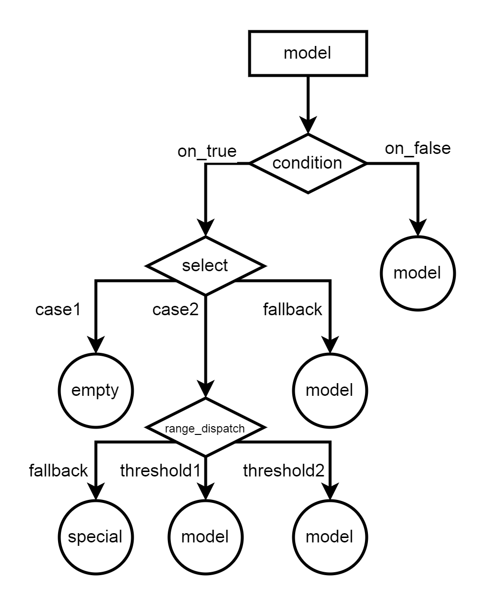

Reference links:
- [itemmodel mapping - Minecraft Wiki](https://zh.minecraft.wiki/w/%E6%A8%A1%E5%9E%8B#%E7%89%A9%E5%93%81%E6%A8%A1%E5%9E%8B%E6%98%A0%E5%B0%84)