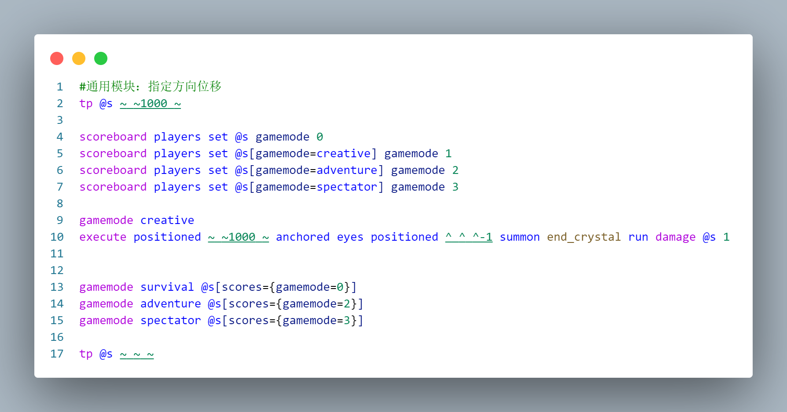
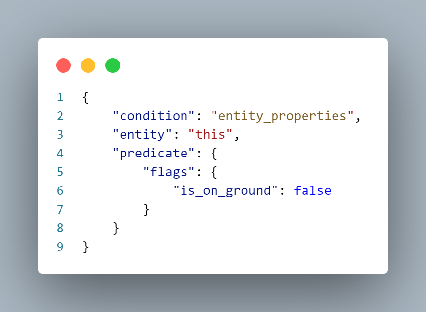
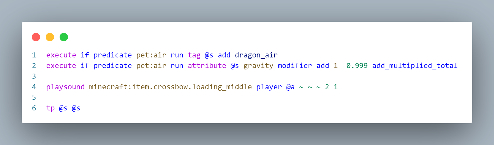

# How to make an acho (Hook Lock)
> by [CR_019](https://space.bilibili.com/85292644)
> This article was also published in [Void Spirit Forum](https://etis.vcsofficial.site/d/98) and [BiliBili column](https://www.bilibili.com/opus/1025312318276239363?spm_id_from=333.1387.0.0)

Compared to the model part, the hook lock is a relatively simple part.  
Of course, this content requires a certain data pack foundation. I won’t go into detail like the previous article.  

# feature film
## Module division
The hook lock function can be simply divided into several modules: use and aiming (right-click trigger), trigger launch (pushing the player), two-stage aiming in the air, and cooling processing. The next step is to implement these modules separately.  

## Aim

I look for a ready-made solution. I actually used this method in the third issue, ["Commonly used right-click detection"](/en/resources/dust/3/常用右键检测.md).  
It is to use the consumable component to give the item the ability to use, and combine the long press to release the hair and the long press to accumulate power, both of which are linked to the function of triggering the push.  
It won’t be introduced in detail here.

## Push player
There are actually ready-made solutions for promoting players.  
Let's describe our needs in detail: **When triggered, the player needs to be given a period of momentum in the direction of the viewing angle. **

We know that the player cannot modify nbt. Therefore, we cannot move the player by modifying motion.  
TP takes effect immediately and cannot be used.  
So we thought that we could use the impact of the explosion to give the player momentum.  

Once the idea is determined, the next thing is to deal with the problems encountered one by one.  
- How to create an explosion?
  - There are several alternatives: creepers, tnt (entity), and end crystals, all of which can provide instant explosions;
- How to prevent explosions from destroying the terrain and damaging surrounding entities?
  - Move the player and the entity that provides the explosion to a high altitude, and then return instantly after the explosion.
  - However, since the creeper and tnt are controlled by nbt, they will not explode until all 1tick commands are executed, so the player will return to the ground, and the creeper will explode in the sky, and nothing will happen.
  - So, we determined the entity to use: End Crystal. Just give it a little damage and it will explode immediately.
- How to prevent the player from getting hurt?
  - Switch to creative mode before exploding, then switch back.
  - Therefore it is necessary to create a scoreboard to record the current game mode.
- How to explode in a specified direction?
  - Use local coordinate(^ ^ ^-1) to generate explosives behind the player's perspective to push the player in the direction of the perspective.

Then we can write this module:`pet/function/misc/motion.mcfunction`

Of course, you can generate a few more ender crystals to push it further.

## Second stage aiming in the air

As we all know, in the Natta area, Kinic can use Acho to perform a two-stage hook lock in the air. Although mcworld is not the Nata region, I still want to achieve this effect, so let's try it.  

In this case, if the player triggers the hook lock on the ground, it will not immediately enter the cooldown to facilitate the second stage ejection in the air; but if the player triggers it in the air, it will directly enter the cooldown.  
Therefore we need a predicate to distinguish whether the player is on the ground:`pet/predicate/air.json`

In addition, there is another problem that needs to be solved for air ejection: when pulling Acho, the player should be hovering in the air.  
There is currently no particularly good solution to this problem. The following is a method that I have achieved that is relatively close to the effect, for your reference:

First, in 1.21.4, the player's gravity can be modified using the /attribute command;
Then, paging the player to its own position resets the player's momentum;
So in theory, using these two commands at the moment the player grabs Acho can make the player hover in the air.  

However, the actual effect is that the player will fall slowly, but it does not affect the aiming very much, so I will make do with it.`pet/function/dragon/effects/check_.mcfunction`

The above command will be triggered once when holding Aqiao in the air.

## Cooling process

Acho will enter cooldown under the following circumstances:
- After launching on the ground, land;
- Two stage launch in the air.

### Cooling calculation
We use a scoreboard to handle cooling.  
First write a command that decreases the score;
When it is time to enter cooling, the scoreboard is set to the number of ticks that need to be cooled.  
Add a judgment to the tickfunction: when the scoreboard is not 0 and the player is on the ground, it will enter cooling;
Add a judgment to the function that triggers the ejection: if it is released on the ground, set a certain cooling value; if it is released in the air, set more cooling values and enter cooling directly.  
Finally, if the scoreboard reaches zero and the player's Acho is still disabled, it returns to its normal state.

### item switching
The method of entering the cooldown is very simple. Replace "Aqiao" with "Angry Aqiao". "Angry Aqiao" does not have consumable components, so it cannot be used. At the same time, the angry expression also fits the dragon design inexplicably (
Therefore, entering cooling and recovery is essentially switching back and forth between the two items.  
It is easier to deal with when entering the cooldown, because Aqiao must be in hand; but when recovering, the player may not necessarily hold the item in his hand. Here are two ways to deal with this problem:
- A more stable method is to traverse the backpack or use macros to accurately find the item we need to replace and replace it: Because I previously wrote a macro method to find the prefix of the backpack item, I used this method directly;
- A method that is easier and more effective is to only determine the cooling condition when the player is holding Aqiao in his hand, so that it does not affect the use. However, it is necessary to ensure that the tag marking Aqiao's status is synchronized with the item, or to directly detect the item data.

## Other processing
At this point, our Acho has been basically perfected. The rest is some icing on the cake.

### Drop Protection
This Acho can take the player to a very high place, so we definitely don’t want to fall to death when landing. ~~(Aqiao: Not necessarily)~~

I used a lazy method here and gave the player full resistance for 5 seconds. Let's make do with it. :)

### Aiming effect

In the video, we can see that a mask is layered when aiming. This is achieved through equipment masking, you can see [this tutorial](/en/resources/dust/2/2-装备遮罩.md);

We prepared the mask picture in advance, and here I imitated the mask painting when Kinic used the hook lock;
When it is detected that the player is using Aqiao, a mask is added to Aqiao's equipment data; when it is detected that the player is no longer using it, it is removed.

---

So that’s all the ideas for making Acho’s hook lock function. As for the specific function implementation, just unpack it and look at it. It will definitely be easier to understand than me posting a large section of code here.