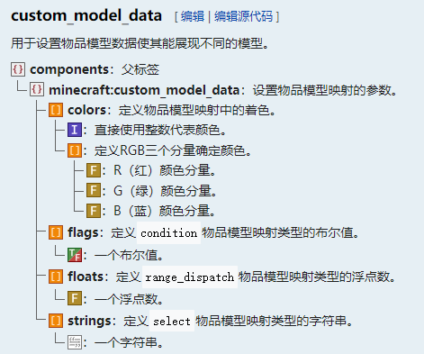

::: tip Translation notice
This page was translated with machine translation and may contain inaccuracies. If you can help improve it, please open an issue or submit a pull request.
:::

# Use composite item model mapping to make the status bar easier
> by [CR_019](https://space.bilibili.com/85292644)
> This article was also published in [Redstone Relay Station](https://forum.mczwlt.net/topic/427/%E4%BD%BF%E7%94%A8%E5%A4%8D%E5%90%88%E7%89%A9%E5%93%81%E6%A8%A1%E5%9E%8B%E6%98%A0%E5%B0%84%E6%9B%B4%E7%AE%80%E4%BE%BF%E7%9A%84%E5%88%B6%E4%BD%9C%E7%8A%B6%E6%80%81%E6%A0%8F-%E6%8B%BE%E5%B0%98-%E4%B8%83) and [BiliBili column](https://www.bilibili.com/opus/1047506183808614407)


## introduce
When we design custom items, we often design mechanisms that need to display status, such as charging. At this time, visually displaying charging advancement is very important for player decision-making and gaming experience.
Of course we can display charging advancement in the actionbar, but this can only display text, which is relatively monotonous. Shared actionbars may also cause conflicts;
Next we will think of occupying an off-hand slot to display status, or displaying it directly on the main hand. In this way, an item model with a high degree of freedom can be used to display the status, and the visual effect will be much better.

### question
So let’s first look at this question:
The following is the skill module of the blade of Star Dome Railway that I tried to restore (see [this video](https://www.bilibili.com/video/BV1JbXeYiEPA)), reflected on this sword, which has three states: hit count, energy, and accumulated lost health (blood pool), which are stored by three scoreboards. Now we need to display these three values ​​​​on the item of the off-hand when the player holds the sword in the main hand.


## In the old version…
In the past, we were able to achieve an item status bar with acceptable results:
The value of the status is generally maintained using the scoreboard. Therefore, we can pre-draw the item model corresponding to each status value, register it in cmd, calculate the corresponding cmd based on the value of the scoreboard, and then reflect it to the deputy.
### shortcoming?
- In the previous version, due to the need to prevent cmd conflicts, a cmd interval needed to be defined, and the value in it probably could not directly correspond to the value of the status, which required additional computing overhead;
- Every time the off-hand item is updated, an item-changing animation will be triggered, which sometimes affects player observation;
- Sometimes we need to make bars with multiple states (such as this question), but there is only one item slot available. Even if the cmd value of each state can be calculated through some algorithms, exhausting every possible state permutation and combination on the resource pack side is an astronomical workload.

## How to solve these problems in 1.21.4?
Fortunately, the item model mapping of version 1.21.4 can solve the above problems.

### Re-acquaint yourself with the new versioncmd

Remember the custom_model_data that we threw away in the third issue? It's time to pick it back up. Different from the previous integer type, the current cmd is a composite tag.



We don't care about the color field for now. The remaining three fields, flags, floats, and string, receive Boolean values, floating point numbers, and strings, which respectively correspond to the condition, range_dispatch, and select modes of item model mapping. We can choose the appropriate type to display based on the different characteristics of the status.

These fields are all list types, that is to say, multiple values ​​can be filled in them, and we can make each value correspond to a state respectively, without the need to merge them into one value through complex algorithms.

Moreover, since item_model is now used to select the model, cmd no longer needs to reserve an interval, and the use will be more free. So we can directly attach the scoreboard value to the corresponding item of cmd.

In this way, the first and third problems are solved. Regarding the second question, in the item model mapping root tag`hand_animation_on_swap`Fields can be resolved.
Now let’s get into the practical stuff.

### Write item model mapping: cmd and composite

The following is the item model mapping written. Because it is too long, part of the content has been omitted:

```json
{
    "model":{
        "type": "composite",
        "models": [
            {
                "type":"range_dispatch",
                "property": "custom_model_data",
                "index": 0,
                "entries": [
                    {
                        "model": {
                            "type": "model",
                            "model": "shard:item/energy/1"
                        },
                        "threshold": 5
                    },
                    ...,
                    {
                        "model": {
                            "type": "model",
                            "model": "shard:item/energy/activate"
                        },
                        "threshold": 160
                    }

                ],
                "fallback":  {
                    "type": "model",
                    "model": "shard:item/energy/0"
                }
            },
            {
                "type":"range_dispatch",
                "property": "custom_model_data",
                "index": 2,
                "entries": [
                    {
                        "model": {
                            "type": "model",
                            "model": "shard:item/rage/1"
                        },
                        "threshold": 2.5
                    },
                    ...,
                    {
                        "model": {
                            "type": "model",
                            "model": "shard:item/rage/16"
                        },
                        "threshold": 40
                    }
                ],
                "fallback":  {
                    "type": "model",
                    "model": "shard:item/rage/0"
                }
            },
            {
                "type":"range_dispatch",
                "property": "custom_model_data",
                "index": 1,
                "entries": [
                    {
                        "model": {
                            "type": "model",
                            "model": "shard:item/score/1"
                        },
                        "threshold": 1
                    },
                    ...,
                    {
                        "model": {
                            "type": "model",
                            "model": "shard:item/score/5"
                        },
                        "threshold": 5
                    }
                ],
                "fallback":  {
                    "type": "model",
                    "model": "shard:item/score/0"
                }
            }
        ]
    }
}
```


Three range_dispatch type mappings are used here, and composite is used to combine the three sub-models together. In this way, we only need to draw the respective states of the three status bars, which can greatly save the model workload.

> Other:`custom_model_data`Usage of attributes
> The cmd attribute exists in all three item model mapping types,`condition`、`select`、`range_dispatch`The cmd attributes in respectively correspond to the itemcmd component.`flags`、`strings`、`floats`list. When using this attribute, a predicate is required below`index`, indicating the number corresponding to the cmd component list, counting from 0.

### Data pack part: There is no need to use function calculations now

Since we can directly attach the scoreboard value to the item's cmd component, we don't even need function calculations and directly attach the value using the item modification of the loot table. Just call the loot table directly when needed.

```json
{
    "pools": [
        {
            "rolls": 1,
            "entries": [
                {
                    "type": "item",
                    "name": "firework_star",
                    "functions": [
                        {
                            "function": "set_components",
                            "components": {
                                "item_model": "shard:energy",
                                "item_name":"{\"text\":\"状态\",\"color\":\"green\"}",
                                "lore":[
                                    ...
                                ],
                                "custom_data": "{shard_offhand:1b}"
                            }
                        },
                        {
                            "function": "set_custom_model_data",
                            "floats": {
                                "mode": "replace_all",
                                "values": [
                                    {
                                        "type": "score",
                                        "target": "this",
                                        "score": "CAM_shard_energy"
                                    },
                                    {
                                        "type": "score",
                                        "target": "this",
                                        "score": "CAM_shard_hurt"
                                    },
                                    {
                                        "type": "score",
                                        "target": "this",
                                        "score": "shard_bloodpool"
                                    }
                                ]
                            }
                        }
                    ]
                }
            ]
        }
    ]
}
```


## summary

Since 1.21.4, we can use this method to easily create an item status bar with good effects. This was difficult to do in the past.
Because of this, I now prefer to put my status on my side more and more.
