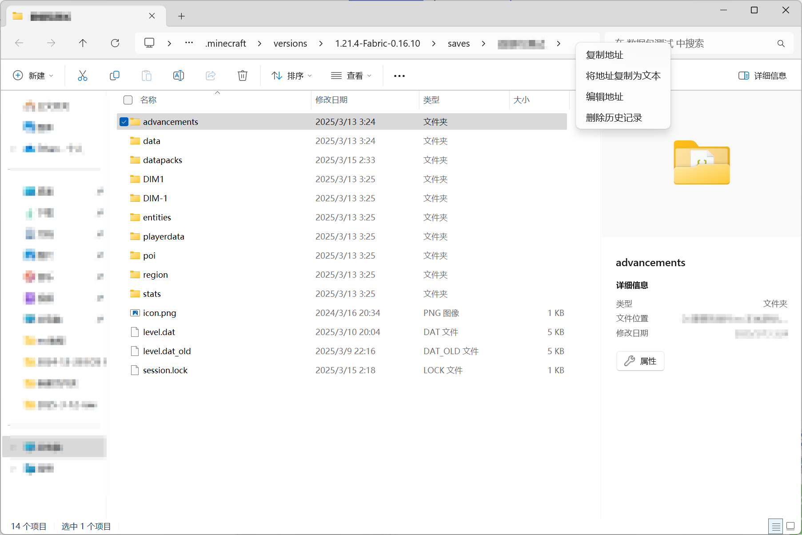
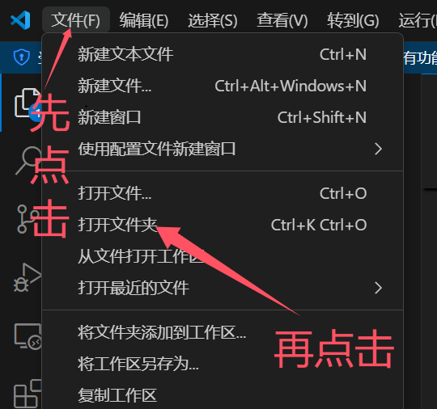
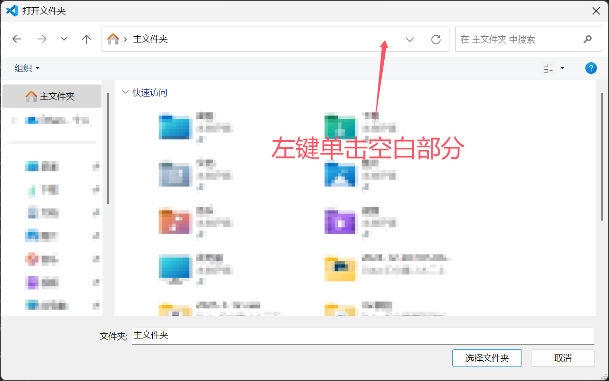
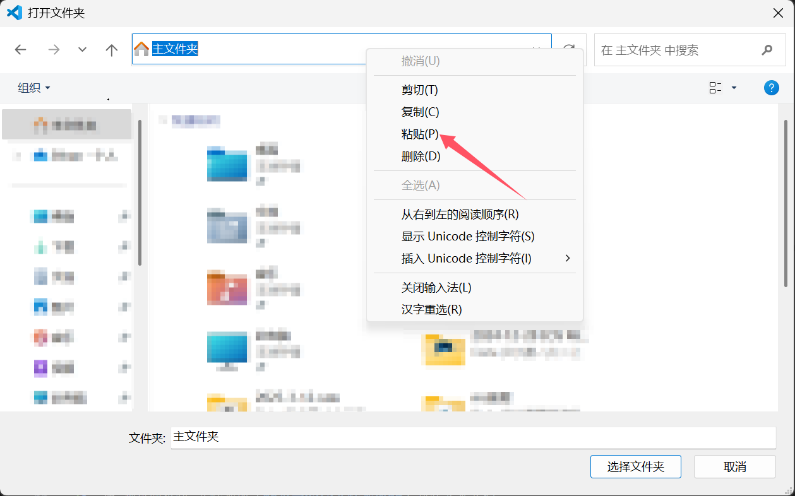
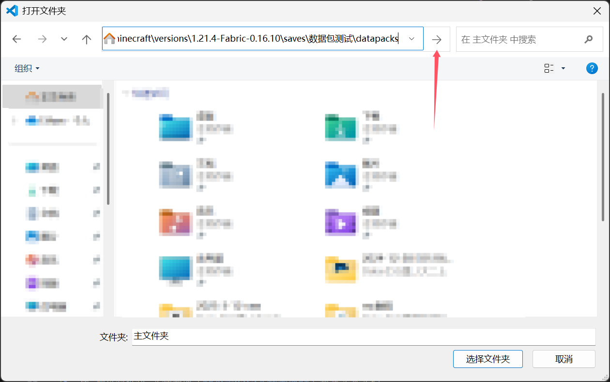
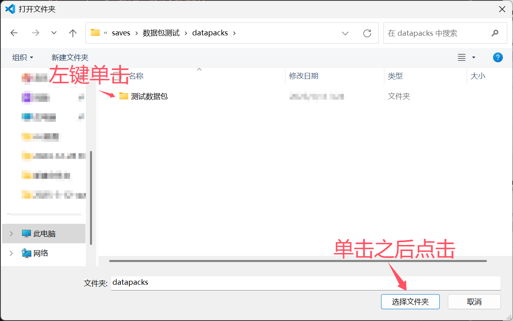
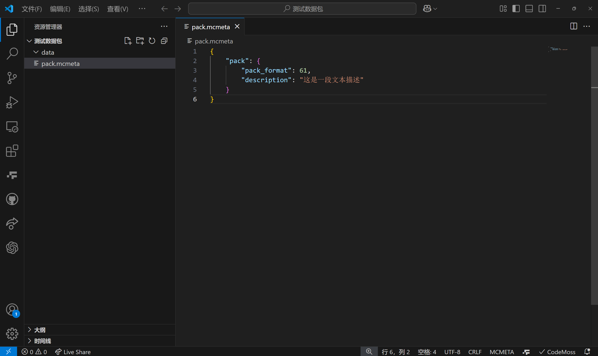

# 数据包快速入门
>  by [伊桑桑桑桑桑](https://space.bilibili.com/397069113)  
>  [原文地址](http://underline.icu/mcfunction-guide/%E6%95%B0%E6%8D%AE%E5%8C%85%E5%BF%AB%E9%80%9F%E5%85%A5%E9%97%A8/1/main.html?i=1)

## 提示

本教程会尽量让零基础或有一点代码基础的读者快速上手数据包。
通过实际的案例讲解，让读者逐渐了解并熟练编写数据包。

如果只是读完本教程，不动手，你很难学到东西。请务必跟着教程一步一步动手去做！

## 创建数据包

在开始之前，请在自己的文件资源管理器中打开显示后缀名，并创建一个空数据包。
你可以提前安装vscode，editplus，或者codeblock等代码编辑器来编写数据包。推荐使用vscode。

如果使用vscode，推荐安装简体中文插件和Datapack Helper Plus插件。

安装好之后，打开你游戏存档中的datapacks文件夹，并在里面新建一个“测试数据包”文件夹，按如下结构创建文件和文件夹：

```
测试数据包
    data（文件夹）
    pack.mcmeta
```

`pack.mcmeta`的内容为：

```json
{
    "pack": {
        "pack_format": 61,
        "description": "这是一段文本描述"
    }
}
```


<details>
<summary>创建数据包的详细步骤（使用vscode）</summary>

> ---
> vscode安装步骤如下：
> 1. 安装vscode，完成后打开。
> 2. 按住<kbd>Ctrl</kbd>+<kbd>Shit</kbd>+<kbd>X</kbd>，打开插件界面。
> 3. 在左侧“EXTENSIONS: MARKETPLACE”正下方的搜索栏搜索“简体中文”，找到地球仪图标插件的“Install”按钮，再搜索“spyglass”，找到蓝色望远镜图标插件的“Install”按钮。
> 4. 重启vscode，可以看到语言已经设置为中文，一切准备就绪。
> 
> 创建数据包步骤如下：
> 1. 在游戏页面点击“单人游戏”。
> 2. **单击**选中你要创建数据包的存档。
> 3. 点击下方的“编辑”。
> 4. 点击“打开世界文件夹”。
> 5. 此时会跳出一个文件夹页面，在里面双击“datapacks”文件夹，进入后这个文件夹应该是空的。
> 6. 在“datapacks”文件夹里新建文件夹，命名为“测试数据包”。
> 7. 完成后，右键上方路径栏后，点击“将地址复制为文本”。如图：
> 8. 打开vscode，点击左上角“文件”按钮，再点击“打开文件夹”按钮，此时会弹出一个文件夹，将之前复制的地址粘贴到地址框内，点击“→”。之后左键单击“测试数据包”文件夹，点击“选择文件夹”。如图：
> 10. 按结构创建文件和文件夹，如图：
> ---

</details>

<details>
<summary>创建数据包的详细步骤（不使用vscode）</summary>

> ---
> 步骤如下：
> 
> 1. 在游戏页面点击“单人游戏”。
> 2. **单击**选中你要创建数据包的存档。
> 3. 点击下方的“编辑”。
> 4. 点击“打开世界文件夹”。
> 5. 此时会跳出一个文件夹页面，在里面双击“datapacks”文件夹，进入后这个文件夹应该是空的。
> 6. 在“datapacks”文件夹里新建文件夹，命名为“测试数据包”。
> 7. 双击进入“测试数据包”文件夹并新建文件夹，命名为“data”。
> 8. 在“测试数据包”文件夹内（**不是data文件夹内**）新建文本文档。
> 9. 重命名“新建文本文档.txt”为“pack.mcmeta”（修改后，如果没有看到警告：“如果改变文件扩展名，可能会导致文件不可用……”，说明你没打开显示文件后缀名，请先打开后再进行操作，否则操作无效）。
> 10. 使用代码编辑器或记事本（不推荐记事本，可能自带BOM头，会让文件失效）打开“pack.mcmeta”文件，输入以下内容：`{"pack": {"pack_format": 61,"description": "这是一段文本描述"}}`
> ---

</details>

## 创建函数

函数可以理解为自定义命令。函数内可以编写多条指令，按顺序从上到下运行。

现在我们编写一个函数，功能是：在自己位置瞬间爆炸并发送“嘭！”的消息。

在data下创建abc文件夹，在abc文件夹内创建function文件夹，在function文件夹内创建boom.mcfunction文件，文件结构如下：
```
测试数据包
    data
        abc/function            #abc文件夹里面有个function文件夹
            boom.mcfunction     #function文件夹里面有个boom.mcfunction文件
    pack.mcmeta
```


在“boom.mcfunction”中，输入以下内容：
```
summon tnt
say 嘭！
```

你也可以在其他文件夹创建函数，比如：
```
测试数据包
    data
        abc/function
            boom.mcfunction
        hahahaha/function
            6666.mcfunction
        minecraft/function
            lalala.mcfunction
    pack.mcmeta
```


## 运行函数

当你进入存档后，mc并不会实时读取你修改的数据包，需要手动运行`/reload`命令来重新载入数据包。

运行`/reload`命令，让游戏读取你刚刚写的“boom.mcfunction”。

在聊天框运行`/function abc:boom`，如果你脚下发生爆炸，并且聊天框输出“嘭！”，说明你的函数运行成功了。

<details>
<summary>为什么是“abc:boom”？</summary>

> ---
> “abc:boom”实际上读取的是“abc/function/boom.mcfunction”，但每次这么写会显得很长，很麻烦，于是就把中间的“/function/”换成“:”，去掉末尾的“.mcfunction”后缀名，写成“abc:boom”。
> 
> 注意，这里只有“/function/”会被替换成冒号，更往后的斜杠不会变。比如“abc:boom/test”读取的是“abc/function/boom/test.mcfunction”
> 
> ---

</details>


## 自动重复执行函数

有时候我们希望一些命令持续重复执行，类似紫色循环命令方块（一般情况下每0.05秒运行一次）。
在数据包中，我们并不能直接把命令注册到循环里，需要把命令放到函数里，再让**函数**重复执行。

**一定要注意，看看文件后面是“.json”还是“.mcfunction”，别搞混了！**

这可以通过注册原版函数标签实现。在data文件夹中创建minecraft文件夹，在minecraft文件夹中创建tags文件夹，在tags文件夹中创建function文件夹，在function文件夹中创建tick.json文件。结构如下：
```
测试数据包
    data
        minecraft/tags/function
            tick.json
        abc/function
                boom.mcfunction
    pack.mcmeta
```

我们可以放入我们希望循环运行的函数。建议新建一个tick函数，专门处理所有的循环逻辑。步骤如下：

1. 在abc文件的function文件夹中创建一个函数“tick.mcfunction”，和boom.mcfunction并列。结构如下：
```
测试数据包
    data
        minecraft/tags/function
            tick.json
        abc
            function
                boom.mcfunction
                tick.mcfunction
    pack.mcmeta
```
2. 在“tick.json”中，输入以下内容（别忘了“abc:tick”表示“abc/function/tick.mcfunction”）：
```
{
    "values": [
        "abc:tick"
    ]
}

```

<details>
<summary>“tick.json”为什么要放在“minecraft/tags/function”文件夹里？</summary>

> ---
> 
>  原版mc内部代码里就有一个自带的数据包，里面就有“minecraft/tags/function/tick.json”这个文件。
>  你做的事就是用你自己数据包里的“minecraft/tags/function/tick.json”去覆盖原版自带的数据包里的“minecraft/tags/function/tick.json”。我们可以类比画材质包的时候，我想用自己画的草方块贴图去覆盖原版的草方块贴图，只要把文件夹和文件名做的和原版里的完全一样，就会自动覆盖。
>  
>  这里的“覆盖”实际上并不是完全覆盖原版的“tick.json”，而是合并你的“tick.json”和原版自带的数据包的“tick.json”，说“覆盖”只是方便理解。
> 
> ---

</details>

之后，我们就可以在“tick.mcfunction”中加入循环命令了。试一试让世界说“你好，我的世界！”

在“tick.mcfunction”中，输入以下内容：
```
say 你好，我的世界！
```
回到游戏，在聊天框输入命令`/reload`。

如果你看到聊天框在刷屏“你好，我的世界！”，说明运行成功了。


## 自动初始化函数

你也可以让函数在刚进入游戏的时候或运行`/reload`之后执行，作为初始化命令。

注册步骤和[自动重复执行函数](#tick)几乎完全相同。步骤如下：

1. 在data文件夹中创建minecraft文件夹，在minecraft文件夹中创建tags文件夹，在tags文件夹中创建function文件夹，在function文件夹中创建tick.json文件。结构如下：
```
测试数据包
    data
        minecraft/tags/function
            load.json（新加的）
            tick.json
        abc
            function
                boom.mcfunction
                tick.mcfunction
    pack.mcmeta
```
2. 在abc文件的function文件夹中创建一个函数“load.mcfunction”，和boom.mcfunction并列。结构如下：
```
测试数据包
    data
        minecraft/tags/function
            load.json（新加的）
            tick.json
        abc
            function
                boom.mcfunction
                load.mcfunction（新加的）
                tick.mcfunction      
    pack.mcmeta
```
3. 在“load.json”中，输入以下内容：
```
{
    "values": [
        "abc:load"
    ]
}
```
之后，我们就可以在“load.mcfunction”中加入初始化命令了。