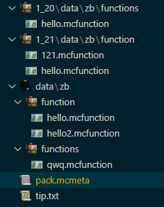

<FeatureHead
    title = 如何合并多个版本的数据包？
    authorName = Dreamy_Blaze
    avatarUrl = '../../_authors/dreamy_blaze.jpg'
    :socialLinks="[
        { name: 'BiliBili', url: 'https://space.bilibili.com/1017007290' }
    ]"
/>

## 数据包的强耦合

众所周知，Minecraft的数据包(Datapack)和游戏版本是**强耦合**的(数据包加载到非指定版本的Minecraft大概率会废掉)，在1.20.2正式版更新之前，数据包作者们通常是这样来实现分版本加载的：

- 如果这两个版本之间的语法改动较大：将数据包拷贝多份，根据版本的格式差异(json或mcfunction)做出修改，分别发布，直接高效，不方便的是要拷贝修改多次多个文件
- 如果这两个版本之间的语法改动较小：都加载到同一个数据包，根据命令语法差异或[数据版本DataVersion](https://zh.minecraft.wiki/w/%E6%95%B0%E6%8D%AE%E7%89%88%E6%9C%AC "[中文wiki] 数据版本")来加载不同函数等等(数据包语法检查是以文件为单位的，出错的文件会被忽略)，好处是兼容的版本更多，然而在多人服务器中`/reload`重载时或重启时，服务器后台会对非该版本的文件逐一报错

在Minecraft正式更新1.20.2版本后，数据包作者现在可以用官方提供的“不同版本加载不同子数据包”的设定，这一设定可以编辑数据包元数据文件**pack.mcmeta**实现，这一简单有效的方法当今并不为人所熟知(Wiki也只讲了语法但没有示例(尤其是文件夹结构)，难以理解子包功能的具体操作)。

## 根据版本覆盖子包

这里给出一个数据包**pack.mcmeta**文件的示例格式：

```json
{
    "pack": {
        "pack_format": 61,
        "description": "子包测试"
    },
    "overlays": {
        "entries": [
            {
                "directory": "1_21",
                "formats": 48
            },
            {
                "directory": "1_20",
                "formats": {
                    "min_inclusive": 15,
                    "max_inclusive": 26
                }
            }
        ]
    }
}
```

解释：

数据包版本为61，对应1.21.4，若数据包安装到1.21-1.21.1(数据包版本48)的存档中，则会启用`1_21`子包，若安装到1.20.2-1.20.4(数据包版本18-26)的存档中，则会启用`1_20`的子包(15对应的MC版本是1.20，但是子包`overlays`是从1.20.2开始支持的，因此最低版本也要1.20.2，低于18也不会导致数据包加载失败，仅仅只能像旧版一样加载主包内容)；

`pack_format: 61`即主要版本为1.21.4，在`pack`标签外，定义一个`overlays`标签，该标签仅包括一个`entries`列表，列表里每个复合标签都是对应版本要覆盖在原数据包上的子包，在每个复合标签里要包括`directory`(子包目录)和`formats`(将覆盖的版本&版本区间)这两个标签。

那么数据包的文件目录结构应该是这样的：



图中和`pack.mcmeta`同级的`data`文件夹就是主包内容，`1_20`和`1_21`文件夹内都有`data`文件夹，是两个子包部分；
子包如果和主包有相同路径的文件(例如上图有3个同`zb`命名空间的`hello.mcfunction`)，加载子包对应版本时，会覆盖掉主包的文件(也就是只执行子包函数，忽略主包函数，毕竟都叫`overlays`了优先级肯定是大于主包的)
注意：1.21开始，数据包多数文件夹被命名为原来的单数形式(functions->function)；

- 在1.21.4中，会加载主包data/zb中的function文件夹的`hello.mcfunction`和`hello2.mcfunction`文件，子包不加载；
- 在1.21中，会加载主包data/zb中的function文件夹的`hello2.mcfunction`和子包`1_21`/data/zb中的`hello.mcfunction`和`121.mcfunction`文件，主包的`hello`函数被子包里的`hello`覆盖掉；
- 在1.20.2中，会加载主包data/zb中的functions文件夹的`qwq.mcfunction`和子包`1_20`/data/zb中的`hello.mcfunction`文件(1.21以前文件夹都是复数形式)。

**嗯，也就是说，被激活的子包中，若有和主包路径相同的`json`或`mcfunction`文件，会以文件为单位覆盖掉。(子包优先)**

在创作1.20.2+的数据包时，采用**分版本加载子包**这个方法是个不错的选择。
当然，在跨1.21的作品中，同一个数据包同时维护function和functions文件夹还是比较别扭的，子包也可以以1.21为界分为两个包，例如：
1.20.2-1.20.4是物品堆叠组件更新之前的版本，1.20.5-1.20.6是物品堆叠组件更新后的版本，这几个版本之间采用同一个数据包，并根据不同版本加载不同子包的策略(文件夹都是复数)；
1.21之后，对于官方每次对Minecraft搞的语法更新小动作，都可以用子包的方式覆盖，从而不需复制多份数据包修改(文件夹都是单数)。
