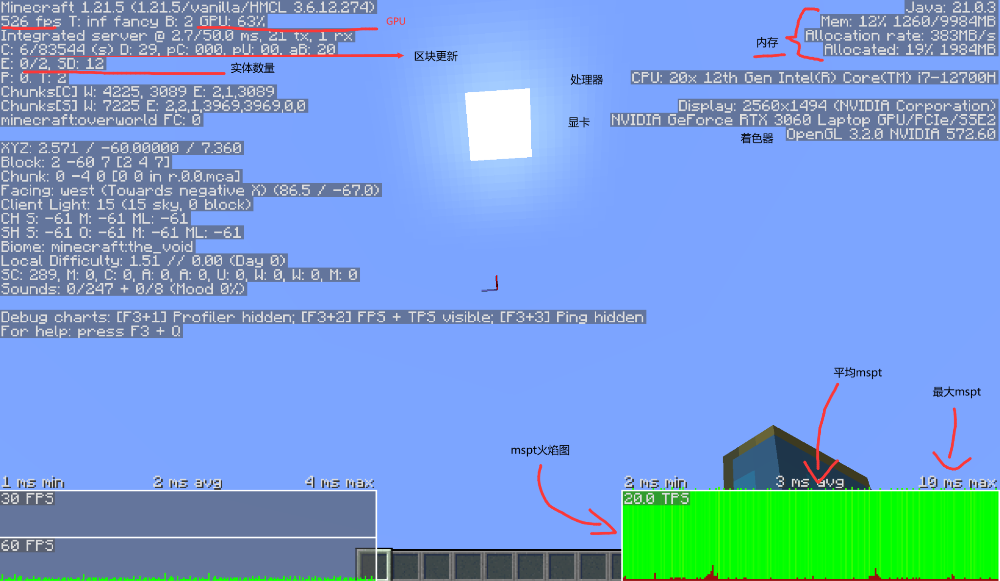
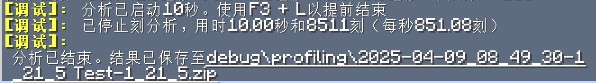
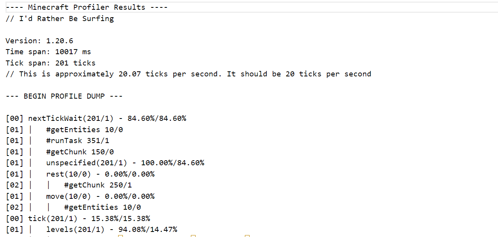
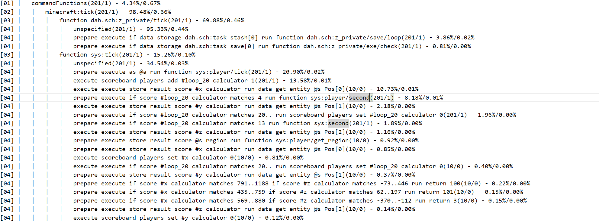
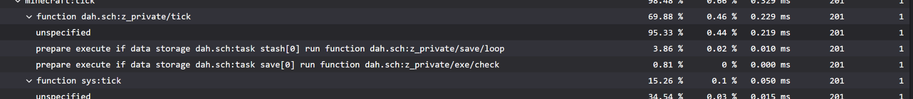

<script setup>
    import FeatureHead from '/.vitepress/vue/FeatureHead.vue'
</script>

<FeatureHead
    title = 数据包优化原则以及分析方式简述
    authorName = Dahesor
    avatarUrl = '../../_authors/dahesor.jpg'
    :socialLinks="[
        { name: 'BiliBili', url: 'https://space.bilibili.com/436796403' }
    ]"
    resourceLink = '数据包优化原则以及分析方式简述.pdf'
/>


## 什么是数据包优化？
众所周知，mcfunction是一种运行效率非常低的语言。使用常规语言可以很轻松实现的内容mcfunction却需要使用大量的电脑资源。并且有不少看似简短的命令实际上需要花费不少的性能来处理。当你的数据包体量越来越大，游戏运行它的压力就会逐渐增加。为了保证给玩家丝滑的体验（根据优化难度，或许是’给玩家不糟糕的体验‘），我们就应当尽可能地减小数据包造成的运行负担。通过调整命令与函数的结构，频率，改善部分命令的写法等来降低实现同一个功能所要消耗的资源，这就是优化了。


##  何时应当优化数据包？
虽然优化很重要，但是盲目地追求极致的优化不一定就是好的开发思维。在考虑优化之前，首先考虑的是如何效率地实现想要的内容，只要保证运行压力不要大的受不了就好了。实际开发内容前要做的考虑也应该是结构性上的，而非是一些细枝末节。细致的优化是可以之后慢慢分析的事情。简而言之，不要被优化束缚了手脚。


## 优化目标
数据包由不同部分构成。不同部分的运行频率和情况都有差别，因此对优化的需求也是不一样的。

显而易见，最需要尽可能地优化的就是#tick下的函数了。这些函数时时刻刻都在运行，直接关系到了数据包整体的优化情况。反之，那些只有被特殊条件触发后才会运行的部分，就没有必要进行相同程度的优化。比如，玩家释放技能后，或者点击某个按钮后执行的某种瞬时的行为。这些事情哪怕浪费一点，其影响也很难叠加到可观的程度。


## 性能原则与开发习惯
在意识到数据包需要优化后回过头来优化会让你走不少弯路，所以很重要的一点是在第一次写的时候就把一些常见优化点做好，或者至少不要做错。本章节主要负责介绍这部分内容。


### `/fill`与`/clone`
毫无疑问，只要影响的范围足够大，这二位是最消耗性能的命令。只要涉及范围有上百个方块，我就建议你尽一切可能避免高频地使用。一个例子是早些年的一张类似格子跑酷的地图中，有一个格子里用到了珊瑚方块，然而无法阻止珊瑚方块死去变灰，于是制作组决定用十几条高频的`/fill`命令将这个格子内所有死珊瑚每tick替换为他们活着的版本。尽管这个格子没多大，游戏每tick还是花了50%的时间在这几条`/fill`命令上，电脑风扇呼呼响。

实际上，完全可以使用资源包更改纹理，把死珊瑚涂成彩色的，或者用其他的方块代替。

更高数量级的方块，比如一次性填充几万个或几十万个，游戏将可能需要数秒的时间来响应。更加致命的是光照更新。当被命令影响的方块改变了大范围的光照时（比如生成一块天花板挡住大范围的阳光），更新消耗会被成倍地增加。


### 其他高消耗命令
这里列举了其他一些”危险”的命令。这之中有些命令只要一条就可能导致可感受的卡顿：
 - `/fillbiome`：大范围更改生物群系时
 - `/forceload`：常加载区块太多，或者一次性添加太多区块时
 - `/gamerule randomTickSpeed`：将随机刻设置的太高时
 - `/locate`：游戏将需要不停地搜索目标。部分稀少结构甚至可能花费数秒时间
 - `/particle`：粒子命令太多或太大时，会挑战客户端渲染性能，还会导致服务端大量发包占用宽带等。
 - `/place`：放置大量方块时
 - `/spreadplayers`：尝试将玩家散布到很大的范围时可能会导致一次高达数秒的卡顿
 - `/tick`：增加运算的频率是最简单的向游戏施压的方法


### NBT操作
除去上面列举的稀有和极端命令外，NBT操作大概就是在所有常用行为中对电脑压力最大的。无论是使用`/data get`，`nbt=`等手段读取或匹配NBT，还是使用`/data`或`/execute store`等手段写入NBT，都是极大的性能。根据情况的不同，性能压力是`/scoreboard`这种命令的几十到上百倍。

最慢的NBT操作是针对玩家的操作。读取一个玩家的NBT所需的时间是读取其他来源的数倍。

在此之下是针对实体与方块实体的操作。这要比玩家快上不少（接近40%），但是可以避免仍应当避免。

性能最快的是读取命令存储。对比起记分板来，storage虽然还是慢上不少，但是性能已经到了可以接受的程度。


### NBT缓存
因此，结合上面几点，我们发现，当需要对一个目标的NBT进行复数的读取与操作时，与其直接在目标上操作，不如先将数据复制进一个存储中，在所有操作结束时再将其覆盖会原位置：

比如，我们想要使用NBT匹配来判断玩家的手持物品时：

若每次都检测SelectedItem：
```mcfunction
# 拿着石头时说1
execute if data entity @s SelectedItem{id:"minecraft:stone"} run say 1
# 拿着泥土时说2
execute if data entity @s SelectedItem{id:"minecraft:dirt"} run say 2
# 拿着玻璃时说3
execute if data entity @s SelectedItem{id:"minecraft:glass"} run say 3
```

这会访问玩家的NBT三次，不如这样：
```mcfunction
# 这个命令会将玩家手中物品的信息存储到test:ram的temp中
data modify storage test:ram temp set from entity @s SelectedItem
# 拿着石头时说1
execute if data storage test:ram temp{id:"minecraft:stone"} run say 1
# 拿着泥土时说2
execute if data storage test:ram temp{id:"minecraft:dirt"} run say 2
# 拿着玻璃时说3
execute if data storage test:ram temp{id:"minecraft:glass"} run say 3
```

虽然多出了一个先将NBT复制进缓存的步骤，但是总体下来要节省不少性能。（虽然在实际操作中上例可以使用`/execute if items`）

这种先把NBT复制进入缓存再操作的方法，我们称之为NBT缓存。只要NBT操作需要大于两条命令，就总是应该使用NBT缓存。

### 选择器浅析

另一个消耗性能的大头是选择器，尤其是@e选择器。

从一个世界（可能拥有的）大量实体中选择一个符合条件的实体，这也是需要消耗性能的行为。

选择一个实体最快的方法就是@s选择器。这个选择器可以直接选择当前运行环境下的“自己”，速度最快。除此以外，使用UUID直接选择一个实体时，有哈希表的加持，游戏可以快速找到对应的实体。在这之后就是负责选择玩家的@a，@p，和@r选择器了。

最消耗性能的选择器就是@e。然而我们可以通过一些手段降低这个选择器的消耗。
1. 只要可能，总是包含type=

假设你想要选择有target这个标签的僵尸。你可能觉得，写@e[tag=target]是个好方法，因为只提供了一个条件，游戏也只需要检查一个条件。然而实际上@e[type=zombie,tag=target]要好上很多（只要世界中的实体不只有僵尸一种），因为检查实体的类型要比检查实体的标签要快得多得多。游戏总会先检查type=，因此虽然多了一个步骤，但是type=可以先刷掉大量实体，只有少部分需要再进行tag=这个较慢的检测。

2. 只要维度确定，总是包含distance=

@e默认会检查所有维度中的实体，然而大部分时候我们都只需要检查当前维度的实体。这时，只需要包含任意的范围参数，比如distance=或dxdydz，就会使得游戏只检查当前维度的实体。因此在上面僵尸的例子中，若只需要寻找当前维度的目标，可以进一步地优化为@e[type=zombie,tag=target,distance=0..]。其中distance=0..看似是无效的条件，实际上起到了限制维度的作用。

3. 只要范围确定，总是限制范围

MC中实体的存储是以区块为单位的。尽可能减少实体检索时所涉及的区块可以大幅度改善选择器的性能。因此当你需要选择的实体位置确定时，总是包含一个限制了范围的distance=来减少涉及的区块：
```mcfunction
summon item ~ ~ ~ {Item:{id:"stone",count:1},Tags:["target"]}
execute as @e[type=item,tag=target,distance=..1] run say 我是石头物品
```
上例的函数中，我们尝试使用选择器找到刚刚生成的实体。虽然distance=..1看似增加了一个条件，变得更繁琐了，然而实际上起到了限制区块的作用，降低了性能负担。

4. 额外说明
我们刚刚讨论过，NBT操作和读取是非常缓慢的。因此@e[nbt={...}]大概就是你能写出的最差的选择器了。你应当尽可能地避免使用nbt=，在有可能时，总是使用scores=或tag=等来代替。

顺便一提，scores=要比tag=稍慢。因此在判断布尔值时使用标签是个更好的选择。

选择器的参数是以一个特定的顺序进行判断的，和你写下的顺序无关。type总是最先被执行的，然后是经验值，游戏模式，队伍，分数，标签等。nbt=永远是最后被判断的。


### 实体数量
游戏性能开销的很大一部分是实体。这些能动的家伙每刻都需要游戏追踪更新。尽可能地减少实体的数量是你能做的最好的优化方式。也不要再使用盔甲架或药水效果云来做标记实体了。专业的标记实体要比它们好上数百倍。需要注意，一些看似是方块的东西实际上是实体，比如画和物品展示框。

部分方块也需要游戏进行追踪更新。这些方块也可以像实体一样存储自己的NBT数据。它们被称作方块实体。降低方块实体的数量也可以降低游戏开销。


### `/execute`浅析
接下来我们把目光放在`/execute`命令上。一条`/execute`由数个子命令组合而成。子命令越多，性能消耗越大。此外，当一条子命令无法继续执行时，其后面还未涉及的部分将直接被丢弃，不再消耗性能。

——那是不是说`/execute`命令应该越短越好？

理论上是的。`/execute as @a[scores={scb=1..}]`理论上要比`/execute as @a if score @s scb matches 1..`快一点。然而这种差距非常小。特地去追求前者是没有必要的。过度追求性能而牺牲了效率和可读性是得不偿失的行为。

本节真正的重点是后半段，即’一条子命令无法继续执行时，其后面还未涉及的部分将直接被丢弃’。

这意味着当你使用复数的条件判断时（比如并列的if或unless），应当把最容易失败的子命令放在最前面，把性能消耗最大的子命令放在最后面。

把最容易失败的部分放在最前面，那么大概率在一开始就停住了不会往后走。把性能消耗最大的子命令——比如`/execute if data`这种NBT检查——放在最后面，可以尽可能减低进行到这一步的频率。


### 宏浅析
1.20.2版本新增了函数宏。在提供了强大功能的同时，宏每次运行时都要临时解析，很吃资源（正常的函数是在加载的时候就全部解析完毕的）。

宏解析的主要性能来源是这条命令长度。也就是说，包含宏的命令越长就越需要资源。使用宏的命令应当尽可能地简短。

然而不要太过畏惧宏。只要使用得当并不会造成什么影响。


### 函数
函数最强大的功能是其可以使复数命令共用同一套环境。活用函数也可以大幅度降低使用`/execute`与选择器的频率：
```mcfunction
execute as @e[type=item,tag=target,distance=..1] run say 我是石头物品
execute as @e[type=item,tag=target,distance=..1] run say 哇卡哇卡哇卡
execute as @e[type=item,tag=target,distance=..1] run say Features~!
```
这样写我们需要使用三次`/execute`配合选择器来调整运行环境。

```mcfunction
execute as @e[type=item,tag=target,distance=..1] run function foo:bar
#函数foo:bar
say 我是石头物品
say 哇卡哇卡哇卡
say Features~!
```
而这样创建一个函数虽然麻烦了一点，但可以大幅节省性能。在诸如`#tick`这类高频运行的，最需要优化的地方，千万不要怕麻烦！


### `/return`
这条命令可以提前结束一个函数的运行。活用它不仅可以在结构上减少使用的行数，也可以节省不少性能！比如你需要根据一个分数的不同来执行不同的功能，那么可以这么写：
```mcfunction
execute if score @s foo matches 1 run return run say 情况1
execute if score @s foo matches 2 run return run say 情况2
execute if score @s foo matches 3 run return run say 情况3
```
我们使用return run来掐断函数的执行，这样若情况为1，那么后两条命令就根本不会执行了。


### 执行频率
除了优化命令本身，你也可以从一个函数运行的频率入手。并非所有的函数都需要是每刻执行的。一些视觉上的内容，或是对时间不敏感的内容，可以适当地降低其频率。

比如你想使用实体的显示名称在其头顶显示它的生命值。每刻都更新大量实体的NBT是及其耗费性能的事情。然而这种视觉内容并不需要保持如此高精度的更新——只要逻辑上的生命值计算保持高频率就好，至于生命值的显示，把更新频率降低到每秒1次或2次，玩家或许根本意识不到。


## 如何分析数据包
上节中介绍了如何在开发中优化数据包。然而很多时候我们会在一切已经完成后发现某部分内容仍需优化。本章节我们来探讨一下该如何高效地找到这些需要优化的点。

`F3`屏会给你提供大量的有用信息。按下`F3+2`还会显示一张很有用的mspt火焰图。



右下角的这个火焰图就是mspt火焰图了（应该是1.20.4加入的）。

**MSPT，每刻所需毫秒 (Milliseconds Per Tick)** 指的是游戏执行一游戏刻的操作所花费的时间。这个数字越大，性能负担就越大。一旦这个数值超过了50ms，那么就将导致游戏的服务端卡顿（假设是常规的20刻每秒）。开发数据包时应当关注这个图标在各种情况下的变动。如果出现mspt过大的情况，那么就要考虑这是不是由你的数据包所导致的了。

注意mspt与设备性能有关。请考虑那些设备性能不如你的玩家。你的mspt达到25可能不会卡顿，但是用着较旧机器的玩家就不一定了。

除了查看火焰图，你也可以使用`/tick query`命令来得到mspt信息。

另一种更加全面的分析方式是`/perf`命令，或在单人中，`F3+L`。按下`F3+L`，游戏会启动10秒钟的调试分析，并在分析结束后，在`.minecraft/debug/profiling`文件夹下生成一份包含了本次分析结果的zip文件。这个文件中包含有所有函数命令的运行情况以及其所消耗的时间：


将zip文件解压，找到其中`server`文件夹下的`profiling.txt`文件，可以看到类似这样的树状结构：


按`Ctrl+F`，查找`commandFunctions`，这下面展示了所有由`#tick`执行的命令的消耗：


我们单独拎出一行来看：

```mcfunction
function dah.sch:z_private/tick(201/1) - 69.88%/0.46%
```

这是我数据包中的一个函数。最后面跟着一串数据：(201/1) - 69.88%/0.46%。其中的201代表了在分析调试的这十秒中该命令执行了201次，后面的1代表平均每刻执行1次。后半是两个百分比：后面的0.46%代表游戏每刻中有多少时间用在了这个项目上。也就是说，每一刻游戏都将大约0.5%或两百分之一的时间用来运行我这个函数了。前面的69.88%代表着执行该项目占了它的母项时间的百分之多少。这里它的母项是`minecraft:tick`，也就是说每刻运行的函数中这个函数占用了大约三分之二的时间。

将目光移向
```
commandFunctions(201/1) - 4.34%/0.67%。
```
根据上面所述，这代表着每刻游戏使用了0.67%的时间用来处理数据包的函数命令。这是个相当健康的数字，意味着数据包至少这部分基本上不影响游戏性能。然而若你的百分比太大可能就要到细则中看看具体是哪个函数，或者哪些个命令在不合理地占用资源了。

文件中会自动把占用时间较多的项目排在上面。因此在上图中最消耗性能的命令就是`execute if data storage dah.sch:task stash[0] run function dah.sch:z_private/save/loop`。怎么样，NBT检查是不是很恐怖？

值得一提的是，国外的misode在他的生成器网站上也包含了一个报告文件的分析器：https://misode.github.io/report/ 。你可以直接将得到的zip文件丢进去。这个分析器不仅会将数据排版地更美观，甚至根据其他数据自动计算出每个命令的耗时：


关于报告的其他细节：
* 由命令方块执行的命令也会包含，你可以在blockTicks下找到。
* zip文件中还包含了大量其他数据，比如所有加载的实体，区块，比如使用的游戏规则等等。具体请查看wiki的相关页面（https://zh.minecraft.wiki/w/?curid=125799）


## 结语
本文简单探讨了性能优化的基础原则及工具。虽然数据包的优化非常重要，但也切莫本末倒置。对优化过分地担忧很多时候只会束手束脚。笔者希望读者能够把握住这其中的一个平衡，体验原版模组与地图创作的无尽魅力（大雾）`(编者注：并非魅力)`。