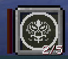
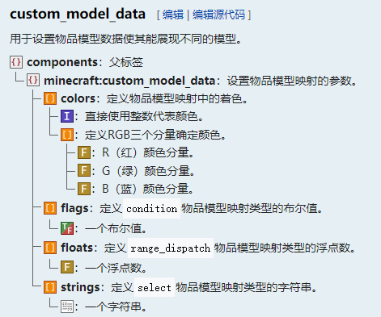

<FeatureHead
    title = 使用复合物品模型映射更简便的制作状态栏
    authorName = CR_019
    avatarUrl = '../../_authors/cr_019.jpg'
    :socialLinks="[
        { name: 'BiliBili', url: 'https://space.bilibili.com/85292644' }
    ]"
    cover='../_assets/dust_7.png'
/>


## 引入
我们在设计自定义物品的时候经常会设计到需要显示状态的机制，如充能，这时候在视觉上显示充能进度，对于玩家决策和游玩体验是很重要的。  
我们当然可以在actionbar显示充能进度，不过这样只能显示文本，相对单调一些，共用的actionbar也可能造成冲突；  
我们接下来会想到占用一个副手栏位用来显示状态，或者直接显示在主手上。这样可以使用自由度很高的物品模型来显示状态，视觉效果会好很多。  

### 问题
那我们先来看这样一个问题：  
如下是我尝试还原的星穹铁道的刃的技能模组（可参见[该视频](https://www.bilibili.com/video/BV1JbXeYiEPA)），反映在这把剑上，它有三个状态：受击计数，能量，累计损失生命值（血池），分别由三个计分板存储，现在我们需要在玩家主手持有剑的时候，将这三个值显示在副手的物品上。


## 在旧版本…… 
在过去，我们也能做到效果尚可的物品状态栏：  
状态的值一般会用计分板维护，因此，我们可以预先绘制好各个状态数值对应的物品模型，注册在cmd中，根据计分板的值计算出对应的cmd，然后反映到副手上。
### 缺点？
- 在以前的版本，由于需要预防cmd冲突，需要划定一个cmd区间，而其中的值大概和状态的数值无法直接对应，需要额外的计算开销；
- 每次更新副手物品的时候，都会触发一次换物品的动画，有时会影响玩家观察；
- 有时我们需要制作多个状态的条（比如这一题），但可用的物品槽位只有一处，即使可以通过一些算法算出每一个状态的cmd值，资源包侧穷举每一种可能状态的排列组合也是天文数字级别的工作量。

## 在1.21.4怎么解决这些问题？
好在1.21.4版本的物品模型映射，能够解决上述的问题。  

### 重新认识一下，新版本cmd

还记得那个在第三期被我们扔掉的custom_model_data吗？是时候把它捡回来了。不同于以前的整数型，现在的cmd是一个复合标签。



color字段我们暂时不管，剩余的三个字段，flags,floats,string，接收布尔值、浮点数和字符串，分别对应物品模型映射的condition，range_dispatch，和select模式。我们可以根据状态的不同特性，选择适合的类型来显示。

这些字段都是列表类型，也就是说，其中可以填入多个值，我们可以让每一个值分别对应一个状态，而不需要去通过复杂的算法合并到一个值上。

并且，由于现在使用item_model来选择模型，cmd不再需要预留区间，使用也会更加的自由。于是我们就可以直接把计分板的值附给cmd的对应项上即可。

这样一来，第一个和第三个问题就解决了。而关于第二个问题，物品模型映射根标签里的`hand_animation_on_swap`字段可以解决。  
接下来就让我们进入实操吧。

### 编写物品模型映射：cmd和composite

如下是编写的物品模型映射，由于过长，省略了一部分内容：

```json
{
    "model":{
        "type": "composite",
        "models": [
            {
                "type":"range_dispatch",
                "property": "custom_model_data",
                "index": 0,
                "entries": [
                    {
                        "model": {
                            "type": "model",
                            "model": "shard:item/energy/1"
                        },
                        "threshold": 5
                    },
                    ...,
                    {
                        "model": {
                            "type": "model",
                            "model": "shard:item/energy/activate"
                        },
                        "threshold": 160
                    }
                    
                ],
                "fallback":  {
                    "type": "model",
                    "model": "shard:item/energy/0"
                }
            },
            {
                "type":"range_dispatch",
                "property": "custom_model_data",
                "index": 2,
                "entries": [
                    {
                        "model": {
                            "type": "model",
                            "model": "shard:item/rage/1"
                        },
                        "threshold": 2.5
                    },
                    ...,
                    {
                        "model": {
                            "type": "model",
                            "model": "shard:item/rage/16"
                        },
                        "threshold": 40
                    }                 
                ],
                "fallback":  {
                    "type": "model",
                    "model": "shard:item/rage/0"
                }
            },
            {
                "type":"range_dispatch",
                "property": "custom_model_data",
                "index": 1,
                "entries": [
                    {
                        "model": {
                            "type": "model",
                            "model": "shard:item/score/1"
                        },
                        "threshold": 1
                    },
                    ...,
                    {
                        "model": {
                            "type": "model",
                            "model": "shard:item/score/5"
                        },
                        "threshold": 5
                    }
                ],
                "fallback":  {
                    "type": "model",
                    "model": "shard:item/score/0"
                }
            }
        ]
    }
}
```

这里使用了三个range_dispatch类型的映射，使用composite将三个子模型复合在一起。这样，我们只需要分别绘制三个状态条各自的状态即可，能够极大的节省模型工作量。

> 另：`custom_model_data`属性的用法  
> cmd属性在三个物品模型映射类型中均存在，`condition`、`select`、`range_dispatch`中的cmd属性分别对应到物品cmd组件的`flags`、`strings`、`floats`列表。使用该属性时，下面需要一个谓词`index`，表示对应到cmd组件列表的第几项，从0开始计数。

### 数据包部分：这下不需要使用函数计算了

由于我们可以直接把计分板的值附给物品的cmd组件，因此我们甚至不需要函数计算，直接用战利品表的物品修饰把数值附上。需要时直接调用该战利品表即可。

```json
{
    "pools": [
        {
            "rolls": 1,
            "entries": [
                {
                    "type": "item",
                    "name": "firework_star",
                    "functions": [
                        {
                            "function": "set_components",
                            "components": {
                                "item_model": "shard:energy",
                                "item_name":"{\"text\":\"状态\",\"color\":\"green\"}",
                                "lore":[
                                    ...
                                ],
                                "custom_data": "{shard_offhand:1b}"
                            }
                        },
                        {
                            "function": "set_custom_model_data",
                            "floats": {
                                "mode": "replace_all",
                                "values": [
                                    {
                                        "type": "score",
                                        "target": "this",
                                        "score": "CAM_shard_energy"
                                    },
                                    {
                                        "type": "score",
                                        "target": "this",
                                        "score": "CAM_shard_hurt"
                                    },
                                    {
                                        "type": "score",
                                        "target": "this",
                                        "score": "shard_bloodpool"
                                    }
                                ]
                            }
                        }
                    ]
                }
            ]
        }
    ]
}
```

## 小结

1.21.4以来，我们可以使用这种方法很简便的制作效果很好的物品状态栏。这是过去难以做到的。  
也正因为此，我现在越来越喜欢把状态放在副手了。  