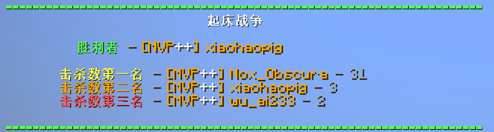

<FeatureHead
    title = 根据记分板分数排名
    authorName = Nox_Obscura
    avatarUrl = '../../_authors/nox_obscura.jpg'
    :socialLinks="[
        { name: 'BiliBili', url: 'https://b23.tv/IMmhdiM' }
    ]"
    resourceLink = 'https://b23.tv/gBF3viI'
/>

## 引言：
服务器小游戏总是会有一个展示排名的环节，而计分板没有提供输出排序的接口，因此我们必须自己实现。本文章提供了一种效果很好的排序方法，对小游戏作者或有帮助。

## 特点：
1：支持人数不限、分数大小不限、计算速度快。  
2：思路方法简单，适合初学者。  
3：算是全网首发，发布前尚未找到相似内容【只有基岩版且为有实体的计算方法】  

## 思路解析：
（所需记分板：score、temp、ranked）  
（计算使用的虚拟玩家通常会在前面加上“.”用以区分真实的玩家【重要】，如下文出现的“.Ranked”，“.Result”）  

1. 首先当然需要一个目标计分板，我们记作“score”，并让它储存玩家的分数。
2. 其次，我们为了不破坏score计分板的数据，需要一个缓存计分板来操作，记作"temp"，把score的分数复制到temp。  
3. 使用递归给所有玩家的temp计分板减分，最先到0的就是排名最低的，把他储存到统计排名用的计分板"ranked"。  
4. 以此类推，当所有玩家temp计分板都归零后，ranked计分板分数最多的就是排名最高的。  
5. 使虚拟玩家. Ranked的分数=排名最高的玩家的分数，添加.Result统计参与排名的玩家数量，和一个.Opposite虚拟玩家来进行反选。  
6. 当有玩家分数=.Ranked分数时，输出.Opposite的分数（因为是反选，所以会从1开始），并使.Opposite分数＋1，.Ranked分数-1，来寻找排名第二的玩家，以此类推。  
7. 当.Opposite的分数与.Result分数一致时，代  表所有玩家都已排名，清除除score计分板外其他全部计分板的数据即可。

## 实装事例
此数据包只是一个“轮子”，可以自行更改添加到自己的小游戏中。我也在做出这个数据包后添加到了自己的起床战争数据包，并且效果显著！

