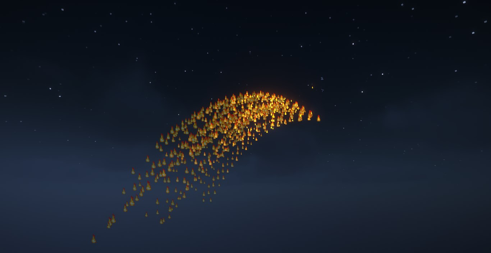
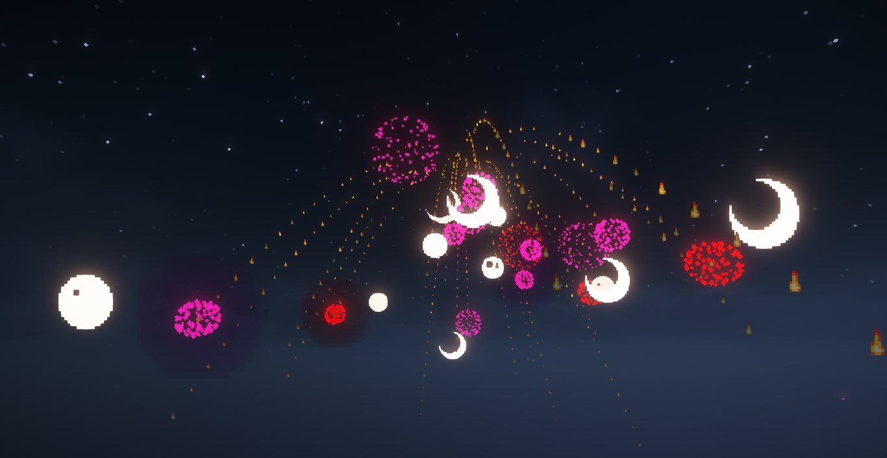
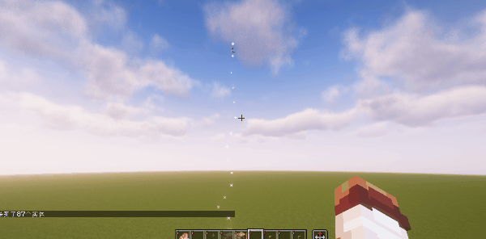

# 宵宫：烟花来咯！

今年的海灯节没有烟花，比较遗憾，于是计划在MC中做一个烟花数据包，结果拖到了四月份（

## 演示

使用数据包提供的API函数，可以很方便地制作烟花，数据包提供多项可选参数以丰富烟花效果\
详细参数说明见文章末尾

首先，通过设置不同的物理属性和条件限制，可以做出不同的抛物线扩散效果\
这样做将会生成数条抛物线，数量由参数`n`控制\
参数`t`控制每条抛物线的存在时间
```
function sklibs:skfirework/fx/spread {
　 config:{
　　　yaw:[-50,-10],
　　　pitch:[30, 80],
　　　t: [20,60],
　　　n:60,
　　　v:0.5,
　　　g:0.04,
　　　tick_cmdv:[{cmd:"particle flame ~ ~ ~ 0 0 0 0 1 force"}]
　　　cmdv:[]
　 }
}
```
v=0.5 g=0.01\


v=0.5 g=0.04\


v=0.5 g=0.04 yaw∈[-50,-10] pitch∈[30,80]\


然后，让每一条抛物线在已存在时间减为0时生成firework
```
function sklibs:skfirework/fx/spread {
　 config:{
　　　yaw:[-50,-10],
　　　pitch:[30, 80],
　　　t: [20,60],
　　　n:60,
　　　v:0.5,
　　　g:0.04,
　　　tick_cmdv:[{cmd:"particle flame ~ ~ ~ 0 0 0 0 1 force"}],
　　　cmdv:[{
　　　　cmd:"function sklibs:skfirework/fx/firework",
　　　　args:{
　　　　　 config:{
　　　　　　　shape:0,
　　　　　　　colors:[{from:[I;13047173],to:[I;16761035]},{from:[I;16711680],to:[I;10824234]}],
　　　　　　　n:1
　　　　　 }
　　　　}
　　　}]
　 }
}
```

可以观察到上述命令添加了如下的参数
当抛物线已存在时间减为0时，将执行参数`cmdv`中的函数事件，调用`sklibs:skfirework/fx/firework`函数生成烟花，其中`args`是函数的参数
```
cmdv:[{
　 cmd:"function sklibs:skfirework/fx/firework",
　 args:{
　　　config:{
　　　　shape:0,
　　　　colors:[{from:[I;13047173],to:[I;16761035]},{from:[I;16711680],to:[I;10824234]}],
　　　　n:1
　　　}
　 }
}]
```
效果如图所示\


此时，我们的烟花会在命令执行瞬间爆炸，但是烟花应该上升一段距离才会爆炸，使用launch函数控制烟花的延时
```
function sklibs:skfirework/fx/launch {
　 config:{
　　　life:50,
　　　cmdv:[
　　　　{
　　　　　 cmd:"function sklibs:skfirework/fx/spread",
　　　　　 args:{
　　　　　　　config:{
　　　　　　　n:30,
　　　　　　　　v:0.5,
　　　　　　　　g:0.04,
　　　　　　　　tick_cmdv:[{cmd:"particle flame ~ ~ ~ 0 0 0 0 1 force"}],
　　　　　　　　cmdv:[
　　　　　　　　　 {
　　　　　　　　　 cmd:"function sklibs:skfirework/fx/firework",
　　　　　　　　　 args:{
　　　　　　　　　　　config:{
　　　　　　　　　　　　shape:0,
　　　　　　　　　　　　colors:[
　　　　　　　　　　　　　 {from:[I;13047173],to:[I;16761035]},
　　　　　　　　　　　　　 {from:[I;16711680],to:[I;10824234]}
　　　　　　　　　　　　],
　　　　　　　　　　　　n:1
　　　　　　　　　　　}
　　　　　　　　　 }
　　　　　　　　}]
　　　　　　　}
　　　　　 }
　　　　}]
　　　}
　 }
```
示例：给烟花增加TNT爆炸效果和音效\

```
function sklibs:skfirework/fx/launch {
　 config:{
　　　life:50,
　　　cmdv:[
　　　　{cmd:"playsound minecraft:entity.firework_rocket.large_blast ambient @a ~ ~ ~ 1000"},
　　　　{cmd:"summon tnt ~ ~ ~"},
　　　　{cmd:"summon tnt ~ ~ ~"},
　　　　{cmd:"summon tnt ~ ~ ~"},
　　　　{cmd:"summon tnt ~ ~ ~"},
　　　　{cmd:"function sklibs:skfirework/fx/spread",
　　　　args:{config:{
　　　　　 n:30,
　　　　　 v:0.5,
　　　　　 g:0.04,
　　　　　 tick_cmdv:[{cmd:"particle flame ~ ~ ~ 0 0 0 0 1 force"}],
　　　　　 cmdv:[
　　　　　　　{cmd:"summon tnt ~ ~ ~"},
　　　　　　　{cmd:"function sklibs:skfirework/fx/firework",
　　　　　　　args:{config:{
　　　　　　　shape:0,
　　　　　　　colors:[{from:[I;13047173],to:[I;16761035]},{from:[I;16711680],to:[I;10824234]}],
　　　　　　　n:1
　　　　　 }}}]
　　　}}}]
　 }
}
```

示例：可以二次扩散的烟花
```
function sklibs:skfirework/fx/launch {
　 config:{
　　　life:30,
　　　cmdv:[
　　　　{cmd:"playsound minecraft:entity.firework_rocket.large_blast ambient @a ~ ~ ~ 1000"},
　　　　{cmd:"function sklibs:skfirework/fx/spread",
　　　　args:{config:{
　　　　　 t:[40,70],
　　　　　 n:6,
　　　　　 v:1,
　　　　　 g:0.02,
　　　　　 tick_cmdv:[{cmd:"particle dragon_breath ~ ~ ~ 0 0 0 0 1 force"}],
　　　　　 cmdv:[
　　　　　　　{cmd:"playsound minecraft:entity.firework_rocket.large_blast ambient @a ~ ~ ~ 1000"},
　　　　　　　{cmd:"summon tnt ~ ~ ~"},
　　　　　　　{cmd:"function sklibs:skfirework/fx/spread",
　　　　　　　args:{config:{
　　　　　　　　n:30,
　　　　　　　　v:0.5,
　　　　　　　　g:0.01,
　　　　　　　　tick_cmdv:[{cmd:"particle flame ~ ~ ~ 0 0 0 0 1 force"}],
　　　　　　　　cmdv:[
　　　　　　　　　 {cmd:"function sklibs:skfirework/fx/firework",
　　　　　　　　　 args:{config:{
　　　　　　　　　 shape:0,
　　　　　　　　　 twinkle: 1,
　　　　　　　　　 colors:[{from:[I;13047173],to:[I;16761035]},{from:[I;16766720],to:[I;16777184]}],
　　　　　　　　　 n:1
　　　　　　　　}}}]
　　　　　 }}}]
　　　}}}]
　 }
}
```

示例：猪烟花（喜闻乐见\

```
function sklibs:skfirework/fx/launch {
　 config:{
　　　life:30,
　　　cmdv:[
　　　　{cmd:"playsound minecraft:entity.firework_rocket.large_blast ambient @a ~ ~ ~ 1000"},
　　　　{cmd:"function sklibs:skfirework/fx/spread",
　　　　args:{config:{
　　　　　 n:30,
　　　　　 v:0.5,
　　　　　 g:0.01,
　　　　　 tick_cmdv:[{cmd:"particle end_rod ~ ~ ~ 0 0 0 0 1 force"}],
　　　　　 cmdv:[
　　　　　　　{cmd:"summon pig ~ ~ ~ {CustomName:\"猪猪\",CustomNameVisible:true}"},
　　　　　　　{cmd:"function sklibs:skfirework/fx/firework",
　　　　　　　args:{config:{
　　　　　　　shape:0,
　　　　　　　colors:[{from:[I;13047173],to:[I;16761035]},{from:[I;16766720],to:[I;16777184]}],
　　　　　　　n:1
　　　　　 }}}]
　　　}}}]
　 }
}
```

## 数据包下载

游戏版本: 1.21.4\
数据包版本 1.0

[1.21.4_SK_Firework_1.0.zip](https://ymqlgthbsakuradream.github.io/posts/minecraft/Archive.20250416/1.21.4_SK_Firework_1.0.zip)\
[1.21.4_SK前置包_Alpha.zip](https://ymqlgthbsakuradream.github.io/posts/minecraft/Archive.20250416/1.21.4_SK%E5%89%8D%E7%BD%AE%E5%8C%85_Alpha.zip)\
（关于前置包，目前处于开发状态，基本完成后会写文章介绍）

## API函数
`sklibs:skfirework/fx/launch`\
烟花启动函数，用于制做烟花升空阶段\
 <strong>config</strong>：根标签\
├─ <strong>life</strong>：升空时间tick\
├─ <strong>cmdv</strong>：升空时间延迟结束后执行的命令\
　 ├─ (一个命令事件)\
　　　├─ <strong>cmd</strong>：需要执行的函数\
　　　├─ <strong>args</strong>：(可选)函数的参数\

`sklibs:skfirework/fx/spread`\
烟花扩散函数\
 <strong>config</strong>：根标签\
├─ <strong>n</strong>：数量\
├─ <strong>pitch</strong>：(可省缺，默认`[-180,180]`) 偏航角随机区间\
├─ <strong>yaw</strong>：(可省缺，默认`[-90,-20]`) 俯仰角随机区间\
├─ <strong>t</strong>：(可省缺，默认`[20,60]`) 延迟随机区间\
├─ <strong>v</strong>：(可省缺，默认`0.4d`) 初速度，单位 格/tick\
├─ <strong>g</strong>：(可省缺，默认`0.01d`) 重力加速度，单位 格/tick\
├─ <strong>cmdv</strong>：延迟结束后执行的命令\
　 ├─ (一个命令事件)\
　　　├─ <strong>cmd</strong>：需要执行的函数\
　　　├─ <strong>args</strong>：(可省缺)函数的参数\
├─ <strong>tick_cmdv</strong>：(可省缺)延迟期间每刻执行的命令\
　 ├─ (一个命令事件)\
　　　├─ <strong>cmd</strong>：需要执行的函数\
　　　├─ <strong>args</strong>：(可省缺)函数的参数\

`sklibs:skfirework/fx/firework`\
烟花生成函数，根据参数生成指定样式的原版烟花\
 <strong>config</strong>：根标签\
├─ <strong>life</strong>：（可省缺，默认为`0`）烟花燃放延迟\
├─ <strong>colors</strong>：随机颜色\
├─ (一个随机颜色项目)\
　 ├─ <strong>from</strong>：初始颜色值数组，数组中一个数字代表一个颜色\
　　　├─ <strong>to</strong>：渐变至颜色值数组，数组中一个数字代表一个颜色。这里的颜色值是十进制整数，例如红色(0xFF0000)的颜色值为16711680\
├─ <strong>shape</strong>：烟花形状(0:小球，1:大球，2:星状，3:苦力怕，4:爆发状)\
├─ <strong>trail</strong>：(可省缺,默认为0)是否显示踪迹\
├─ <strong>twinkle</strong>：(可省缺,默认为0)是否闪烁\
├─ <strong>n</strong>：烟花叠加数量\
├─ <strong>tags</strong>：(可省缺)给烟花添加的标签\
　 ├─ (一个标签)
