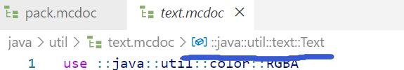

<!-- markdownlint-disable MD033 MD041 -->
<script setup>
    import FeatureHead from '/.vitepress/vue/FeatureHead.vue'
</script>

<FeatureHead
    title = Spyglass(大憨批)进阶使用说明
    authorName = Dahesor
    avatarUrl = '../../_authors/Dahesor.jpg'
    :socialLinks="[
        { name: 'BiliBili', url: 'https://space.bilibili.com/1017007290' },
        { name: 'GitHub', url: 'https://github.com/Dahesor/' }
    ]"
/>

## 什么是Spyglass

Spyglass（即Datapack Helper Plus，DHP或大憨批，以下简称`Spyglass`）是由Minecraft Java版社区成员开发的插件，主要支持Vscode，可以为原版模组编写者提供类似IntelliSense支持，比如代码补全，漏洞报告，语法高亮，链接跳转等功能。其创始人为SPGoding，现在由多名社区成员更新与维护。别跟我说你没有在使用该插件——马上去安装！

* 标识符：`spgoding.datapack-language-server`
* [Github页面](https://github.com/SpyglassMC/Spyglass)
* [Vscode Marketplace](https://marketplace.visualstudio.com/items?itemName=SPGoding.datapack-language-server)
* [官方文档](https://spyglassmc.com/)

## Spyglass.json文件

`spyglass.json`是Spyglass的配置文件。你可以在根目录下创建这个JSON文件以自定义Spyglass在当前工作区的行为，比如NBT内是否留空格之类的玩意，有兴趣可以去看文档说明。

我们今天主要聚焦于环境`env`下的两个参数：游戏版本`gameVersion`与依赖文件路径`dependencies`。

先来看看`gameVersion`。例：

```json
{
	"env": {
		"gameVersion": "1.21.5"
	}
}
```
默认情况下，Spyglass会检查`pack.mcmeta`文件，在里面的`pack_format`和`supported_formats`中找出最高的一个版本号，当成游戏版本。Spyglass提供的所有语法纠错与补全都会基于这个版本。

但只要你在根目录下创建了`spyglass.json`文件，并把上例中的JSON写进去，那么无论你怎么填`pack_format`，Spyglass都会使用`1.21.5`作为版本。

这里插上一点题外话。在更改了配置文件后想要让它生效需要重载Vscode。这需要你按下`Ctrl+P` (Mac上`Cmd+P`)在上方弹出窗口，输入`>Developer: Reload Window`，找到`Developer: Reload Window`这个命令，回车执行。有时，Spyglass会出现bug，比如死活无法读取正确版本。这个时候可以用同样的方式查找命令`>Spyglass: Reset Project Cache`尝试执行。

——不过比起`gameVersion`更有用的是`dependencies`。这个列表允许你列出一系列的文件路径，Spyglass会尝试读取这些路径下的内容作为运行环境提供给你正在编写的数据包。

比如，有时你可能决定使用别人写好的库，并把这些库一股脑塞进了datapacks文件夹，然而Spyglass并不知道这些库给你提供了不少额外的函数，所以每次你尝试调用这些库里的函数时，都会看到难看的黄色波浪线提示你本函数不存在。怎么办呢？这么办：

```json
{
	"env": {
		"dependencies": [
			"file:///C:/path/.minecraft/saves/WorldName/datapacks/library.zip",
			"@vanilla-mcdoc"
		],
		"gameVersion": "1.21.5"
	}
}
```
只需要把指向目标库的路径写进`dependencies`，Spyglass就会读取这个包内的所有函数，进度，战利品表，计分板，Storage，队伍……等任何你能想到的东西，并把它们喂给当前环境。也就是说你将可以在当前数据包内获得所有库里提供的内容的补全，纠错，等等，甚至还可以Ctrl+点击链接跳转去看看每个文件里写了啥，就像是这个库被塞到了当前数据包里一样。

顺带一提，下面的`@vanilla-mcdoc`是默认的数据，包括所有的原版标签，战利品表，物品，实体，巴拉巴拉……

再顺带提示，上面的路径是Windows的，Linux一般就是没有盘符，类似`file:///path/to/libs.zip`。

再再多说一下，路径中允许中文字符与空格。

当然，这个被当做依赖环境的数据包数据包不一定要是zip打包好的；你也可以直接指向一个文件夹。

——还有更多！在不久之前Spyglass的更新后，正式加入了对绝大部分资源包内容的支持，且现在数据包可以吃到资源包内容的补全了！如果你习惯将`assets`和`data`放在一个文件夹里，可能已经发现了，现在数据包中类似文本组件的`translate`或者物品堆叠组件的`item_model`已经可以获取资源包内语言文件以及物品模型映射的补全了！

但是我更习惯把资源包放在`resourcepacks`下面，有没有不把`assets`和`data`放一次也能让数据包获取这些补全的方式呢？当然有！只要把资源包的路径写进`dependencies`里面就好了：

```json
{
	"env": {
		"dependencies": [
			"file:///C:/path/.minecraft/saves/WorldName/datapacks/library.zip",
			"file:///C:/path/.minecraft/resourcepacks/my_pack/",
			"@vanilla-mcdoc"
		],
		"gameVersion": "1.21.5"
	}
}
```
这下你就可以在数据包内获取资源包的翻译键，字体，物品模型……等等帮助了！可惜这并不是实时的——运行环境只会在Spyglass初始化时更新一次。每当你修改了资源包时，想要让数据包的环境更新就需要`Developer: Reload Window`一下。

## 强大的mcdoc文件

`mcdoc`是一种描述了Minecraft原版数据包与资源包中，JSON或SNBT在不同的地方应该包括了什么的规范文件。比如mcdoc告诉Spyglass僵尸有个NBT叫做`DrownedConversionTime`，类型是`int`；物品修饰器`set_lore`有一个参数叫`entity`，是个字符串而且必须是特定的内容；亦或是字体文件中`providers`是个列表……

规定了原版内容的mcdoc文件合集被Spyglass的团队维护于[SpyglassMC/vanilla-mcdoc](https://github.com/SpyglassMC/vanilla-mcdoc)。Spyglass也会在你的电脑上存一份。Windows的默认位置是`%localappdata%/spyglassmc-nodejs/Cache/downloader/mc-je/vanilla-mcdoc.tar.gz`。其他操作系统可以执行命令`Spyglass: Open Cache Folder`后找到`./downloader/mc-je/vanilla-mcdoc.tar.gz`。

`mcdoc`是个强大的功能——通过创建自定义的mcdoc文件，我们可以为自己的Storage，物品自定义组件`custom_data`，标记的`data`下的自定义NBT结构等，提供补全与纠错。只要你肯花上一点点时间为自己的数据结构写一个mcdoc文档，那么当你在数据包中操作这些NBT的时候就能像操作原版NBT一样获得Spyglass提供的各种支持。

接下来本文就会简单介绍一下该如何实现：

首先，你需要安装Mcdoc Syntax Highlighting这个插件，标识符为`misodee.vscode-mcdoc`（[Marketplace](https://marketplace.visualstudio.com/items?itemName=Misodee.vscode-mcdoc)）。

其次，从上述的Github或本地文件中复制一份原版内容的mcdoc文件合集，解压准备好，用一个单独的Vscode窗口打开。这些文件会成为我们自定义文件的重要参照。

接下来，可以在自己的数据包根目录下创建文件夹`mcdoc`。一般来讲这个文件夹会和你的`data`文件夹同级（假如Vscode直接打开的数据包）。

接下来就可以在mcdoc文件夹下创建自定义的`.mcdoc`文件了，比如我们创建一个`test.mcdoc`。

## .mcdoc语法

因为篇幅限制，我们不会太过深入如何写mcdoc文件，只会简单介绍常用的部分；详细说明可以阅读[官方文档](https://spyglassmc.com/user/mcdoc/)或参考`vanilla-mcdoc`的内容。

定义复合标签：

```mcdoc
struct myStruct{
}
```
这定义了一个叫做`myStruct`的复合标签，里面啥也没有。

想要在复合标签添加键值对，可以写为`键名: 值类型`的形式。接受的基础类型包括`boolean`(布尔值)，`byte`(字节型)，`short`(短整形)，`int`(整形)，`long`(长整形)，`float`(单精度浮点)，`double`(双精度浮点)，`string`(字符串)。

不同的标签之间以逗号`,`隔开：

```mcdoc
struct myStruct{
	myInt: int,
	myShort: short,
	myString: string,
}
```
这个mcdoc会允许你写一个类似`{myInt:4, myShort: 7s, myString:"Dahesor"}`的NBT标签。
 * 所有标签都默认是必选的。想要让一个标签成为可选的，需要在键名后面加上`?`。
 * 想要限制数值的取值范围，可以加上`@ min..max`。
 * 在类型前面加入`#[]`可以规定该数值要符合的特定规则。比如`#[id="function"] string`规定了这个字符串必须是一个函数的命名空间ID。使用后Spyglass在提供补全时也会弹出所有函数的补全窗，就像写`function`命令时那样。诸如此类的特定规则有很多，可以自行在`vanilla-mcdoc`中寻找。
```mcdoc
struct myStruct{
	myInt: int @ 5..,
	myShort?: short,
	myFunction: #[id="function"] string,
}
```

这里`myShort`是可选标签，`myInt`的数值应该至少为5，`myFunction`必须为一个函数的命名空间ID。

若值为任意类型，可以写`any`。若值是列表，可以使用`[]`包围列表的单个元素。支持使用`@ min..max`限制列表长度。

若值为另一个`struct`可以引用它的名字，也可以直接写在里面且支持匿名。

若要把一个`struct`的内容嵌入进另一个`struct`里面，使用`...structName`的格式：

```mcdoc
struct myStruct{
	anyThing: any,
	ListOfInt: [int],
	struct_anonymous: struct{
		AnotherList: [short @ ..3] @ 4,
	},
	struct_reference: StructTwo,
	...StructThree
}

struct StructTwo{}
struct StructThree{
	myInt: int,
	myShort: short,
}
```

`type`类型允许你在多个值类型中选择一个。写在括号`()`内，以`|`隔开。也可以直接写在`struct`里面：
```mcdoc
type myType = (int|string)

struct myStruct{
	value: myType,
	children: (struct{} | boolean)
}
```

`enum`类型要求从多个给定的值中选择一个。要先在括号`()`内声明值的类型。每个选项都以`名称=值`的形式给出。其中`值`是真实键入的内容，`名称`只是类似代称的东西。
它可以在外面声明，也可以写在里面并匿名。

键名允许引用enum。格式为`[enum]`：

```mcdoc
enum(string) myFood{
	Apple = "apple",
	Bread = "bread",
	Dried_Kelp = "dried_kelp",
}

struct myStruct{
	favorite: myFood,
	[myFood]: struct{
		saturation: int
	}
}
```

想要引用其他文件中生命的内容，使用`use`，使用两个双引号`::`来进入文件夹或模块。你可以引用自己其他自定义文件中的内容，也可以引用`vanilla-mcdoc`中的内容。比如，想要引用我mcdoc文件夹下的`utils.mcdoc`中的`enum(string) ItemNames`，就要写`use::mcdoc::utils::ItemNames`。

你可以使用vscode打开`vanilla-mcdoc`。在安装了Mcdoc Syntax Highlighting插件的情况下，把光标放进一个模块中，上方应该会显示该模块的路径。



比如这里就是1.21.5+文本组件的mcdoc路径。
```mcdoc
use::java::util::text::Text

struct myStruct{
	CustomText: Text
}
```
这里`ItemName`的值就被定义为文本组件，也就是引用来的Text。

最后最重要的问题，该如何告诉Spyglass我们所规定的Struct是给什么东西用的呢？这里用到`dispatch`。语法为`dispatch 项目[子项目] to 类型`。

一个常用的项目（正式地叫`dispatcher key`但是这里不管那么多）是`minecraft:storage`，也就是自定义命令存储storage。这时`子项目`就是一个Storage的命名空间：

```mcdoc
use::java::util::text::Text

dispatch minecraft:storage["foo:bar"] to myStruct

struct myStruct{
	CustomText: Text
}
```
如果你都做对了，那么这时你在`foo:bar`下的`CustomText`工作时就能获得补全了。Spyglass会把`CustomText`的值作为文本组件来补全与纠错。（尝试一下`data modify storage foo:bar CustomText set value ...`！）

想要自定义物品的`custom_data`或是1.21.5后任意生物的`data`，使用的项目名称是`mcdoc:custom_data`。子项目是`custom_data`或`data`下第一级NBT的键名:

想要在1.21.5之前定义标记实体的`data`，使用`mcdoc:marker_data`。

```mcdoc
dispatch mcdoc:custom_data["weapon_type"] to string
dispatch mcdoc:custom_data["att_lock"] to byte
dispatch mcdoc:custom_data["crafted"] to byte
dispatch mcdoc:custom_data["data"] to struct{
	someting?: any
}
dispatch mcdoc:custom_data["why"] to MyStruct

struct MyStruct{}
```

mcdoc语法还有很多内容。比如根据一个特定键的值决定允许哪些键出现，比如给每个键值对提供注释说明等等……这些就请读者去阅读文档，或者翻阅`vanilla-mcdoc`了；笔者也是如此进行的经验总结。

## 结语

mcdoc文件夹可以随着数据包一起发布，也可以一次作为dependencies被当做环境读取。如果所有的库都提供mcdoc，也把他们的公开函数，计分板等，做成特制的dependency.zip文件供Spyglass高效读取，或许别是一番趣味。

至少现在笔者已经离不开mcdoc和dependencies提供的便利了，希望读者也能多少从本文中获利，让本就被Mojang~(愚人节音)搞得精疲力尽的数据包开发变得稍稍轻松一点。