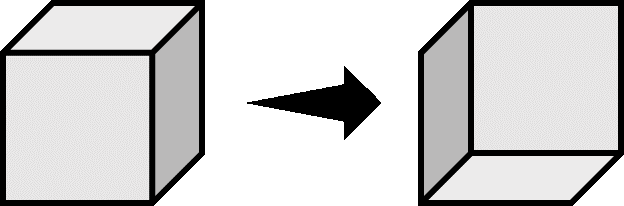

# 对展示实体渲染变换的研究
作者：[徐木弦](https://space.bilibili.com/449298404?spm_id_from=333.1007.0.0)

## 摘要
`transformation`是展示实体专门用于表示渲染变换的字段，其数据结构复杂。本文从数学角度对这个字段进行了研究，给出了矩阵、轴角式和四元数形式的推导过程，并对一系列常用的变换模式做出了总结。

## 关键词
展示实体、四元数、仿射矩阵、轴角式、实体格式

## 引言
展示实体作为Minecraft的技术性实体之一，它们的作用主要体现在视觉方面。这些实体没有碰撞箱，没有任何自主行为，只能通过技术手段生成。在生成时如果不指定NBT，则不会显示任何内容。原版技术开发者可以用展示实体的常规字段展示一些普通的内容，如正常形状的方块、物品、文字，但如果仅用展示实体展示这些常规内容，未免有些单调。\
展示实体的`transformation`字段是实体格式中较复杂的一个字段，它使用矩阵形式或分解形式来表示展示实体的渲染变换，从而制造一些特殊的效果。

## 矩阵形式
使用矩阵形式时，字段`transformation`的数据类型为列表，列表内一共有16个元素，这些元素均为单精度浮点数。这个列表用于表示一个$4×4$的行主序仿射变换矩阵。为了以矩阵形式表示三维空间中点的变换，将原空间映射至仿射空间，对于三维空间内每一个点$(x_0,y_0,z_0)$，在其尾部添加一个$1$以在仿射空间内表示一个点，即$(x_0,y_0,z_0,1)$。令该点经过一定仿射变换$\boldsymbol{A}$后位于$(x',y',z',1)$，则写成矩阵乘法的形式：
$$\left[\begin{matrix}
  x'\\y'\\z'\\1
\end{matrix}\right]=\left[\begin{matrix}
  a_{11}&a_{12}&a_{13}&a_{14}\\
  a_{21}&a_{22}&a_{23}&a_{24}\\
  a_{31}&a_{32}&a_{33}&a_{34}\\
  a_{41}&a_{42}&a_{43}&a_{44}\\
\end{matrix}\right]\left[\begin{matrix}
  x_0\\y_0\\z_0\\1
\end{matrix}\right]$$
基础变换形式有平移、旋转、缩放（镜像）、剪切，所有的变换均基于实体的实际坐标进行。
### 平移
设展示实体上任意一点$(x_0,y_0,z_0,1)$在$x$、$y$、$z$轴分别平移$a$、$b$、$c$后得到点$(x',y',z',1)$，则
$$\left\{\begin{matrix*}[l]
  x'&=&x_0&&&&&+&a\\
  y'&=&&&y_0&&&+&b\\
  z'&=&&&&&z_0&+&c\\
  1&=&&&&&&&1
\end{matrix*}\right.$$
则平移矩阵$\boldsymbol{T}$为
$$\boldsymbol{T}(a,b,c)=\left[\begin{matrix}
  1&0&0&a\\
  0&1&0&b\\
  0&0&1&c\\
  0&0&0&1
\end{matrix}\right]$$
### 旋转
一共有三种旋转方式，即绕$x$轴、绕$y$轴和绕$z$轴旋转。以绕$x$轴旋转$\alpha$为例，假设实体上一点$A$和实体锚点$O$所成直线与$z$轴的夹角为$\varphi$，令$\overrightarrow{OA}$的模为$l$，则有
$$\left\{\begin{array}{l}
  x=x\\
  y=l\cos{\varphi}\\
  z=l\sin{\varphi}
\end{array}\right.$$
$\overrightarrow{OA}$绕$x$轴旋转$\alpha$得到$\overrightarrow{OA'}$，此时有
$$\left\{\begin{array}{l}
  x'=x\\
  y'=l\cos(\varphi+\alpha)=l\cos\varphi\cos\alpha-l\sin\varphi\sin\alpha\\
  z'=l\sin(\varphi+\alpha)=l\sin\varphi\cos\alpha+l\cos\varphi\sin\alpha
\end{array}\right.$$
于是有
$$\left\{\begin{array}{l}
  x'=x\\
  y'=y\cos\alpha-z\sin\alpha\\
  z'=y\sin\alpha+z\cos\alpha
\end{array}\right.$$
将其转换为仿射矩阵，得到
$$\boldsymbol{R}_{x}(\alpha)=\left[\begin{matrix}
  1&0&0&0\\
  0&\cos{\alpha}&-\sin{\alpha}&0\\
  0&\sin{\alpha}&\cos{\alpha}&0\\
  0&0&0&1
\end{matrix}\right]$$
同理，绕$y$轴旋转$\beta$的矩阵形式为
$$\boldsymbol{R}_{y}(\beta)=\left[\begin{matrix}
  \cos{\beta}&0&\sin{\beta}&0\\
  0&1&0&0\\
  -\sin{\beta}&0&\cos{\beta}&0\\
  0&0&0&1
\end{matrix}\right]$$
绕$z$轴旋转$\gamma$的矩阵形式为
$$\boldsymbol{R}_{z}(\gamma)=\left[\begin{matrix}
  \cos{\gamma}&-\sin{\gamma}&0&0\\
  \sin{\gamma}&\cos{\gamma}&0&0\\
  0&0&1&0\\
  0&0&0&1
\end{matrix}\right]$$
### 缩放
设展示实体上任意一点$(x_0,y_0,z_0,1)$沿$x$、$y$、$z$轴分别缩放$m$、$n$、$p$倍后得到点$(x',y',z',1)$，则
$$\left\{\begin{matrix*}[l]
  x'&=&mx_0&&&&&&\\
  y'&=&&&ny_0&&&&\\
  z'&=&&&&&pz_0&&\\
  1&=&&&&&&&1
\end{matrix*}\right.$$
则缩放矩阵$\boldsymbol{S}$为
$$\boldsymbol{S}(m,n,p)=\left[\begin{matrix}
  m&0&0&0\\
  0&n&0&0\\
  0&0&p&0\\
  0&0&0&1
\end{matrix}\right]$$
若$m=n=p$，则是均匀缩放；不然则是非均匀缩放。
### 镜像
对于缩放矩阵而言，特别地，若$m$、$n$、$p$三者中至少有一个为负数，都会进行镜像变换。负缩放因子使坐标系在对应轴上反转，表面法线方向改变，从而造成内凹渲染。\
\
若展示实体上任意一点$(x_0,y_0,z_0,1)$沿$x$轴镜像，其他方向上不作变化，易得镜像矩阵
$$\boldsymbol{M}_{x}(m)=\left[\begin{matrix}
  m&0&0&0\\
  0&1&0&0\\
  0&0&1&0\\
  0&0&0&1
\end{matrix}\right]$$
其中$m<0$。同理可得沿$y$轴镜像、沿$z$轴镜像的矩阵$\boldsymbol{M}_{y}(n)$、$\boldsymbol{M}_{z}(p)$。在多个方向进行的镜像变换也很容易得出，例如在$x$轴、$y$轴、和$z$轴方向上同时应用镜像变换所需的矩阵（$m<0$，$n<0$，$p<0$）为
$$\boldsymbol{M}_{x,y,z}(m,n,p)=\left[\begin{matrix}
  m&0&0&0\\
  0&n&0&0\\
  0&0&p&0\\
  0&0&0&1
\end{matrix}\right]$$
### 剪切
剪切变换将实体上所有点沿某一方向做一定移动，通过原点的直线上任意一点沿该方向移动的距离随直线与原点的距离线性变化，这使得图像变得倾斜。一种剪切变换发生在两个正交坐标轴组成的平面内，在其中一个方向上做剪切，在另一个方向上不做变换。三维坐标系中坐标轴两两正交一共有六对正交关系，因此初等剪切变换一共有六种。\
\
如图，图像在一个方向发生剪切的过程中，实际上与另一个方向拥有一个剪切角度$\theta_{i,j}$，下标（$i,j$）代表在$i$方向内做剪切，并与$j$方向呈一定剪切角度。若图中横向为$x$轴，纵向为$y$轴，剪切角度记为$\theta_{x,y}$，显然有
$$\left\{\begin{matrix*}[l]
  x'&=&x_0+&y_{0}\tan{\theta_{x,y}}&&&&\\
  y'&=&&y_0&&&&\\
  z'&=&&&&z_0&&\\
  1&=&&&&&&&1
\end{matrix*}\right.$$
则$x$轴方向上做剪切、并与$y$轴方向呈一定剪切角度所需矩阵$\boldsymbol{H}$为
$$\boldsymbol{H}(\theta_{x,y})=\left[\begin{matrix}
  1&\tan{\theta_{x,y}}&0&0\\
  0&1&0&0\\
  0&0&1&0\\
  0&0&0&1
\end{matrix}\right]$$
同理可推导得到其他六种剪切变换所需的矩阵。当剪切变换的方向为$x$轴时，元素$\tan{\theta_{i,j}}$一定位于矩阵的第一行，$y$轴则为第二行，$z$轴则为第三行；与变换方向呈剪切角度的方向为$x$轴时，元素$\tan{\theta_{i,j}}$一定位于第一列，$y$轴则为第二列，$z$轴则为第三列。例如，某个剪切变换在$z$轴方向进行，与$x$轴方向呈剪切角度，则$\tan{\theta_{z,x}}$位于第三行第一列。\
以上描述的剪切矩阵均为仅在一个方向上做变换，并与另一个方向呈一定剪切角度的情况。若同时应用多个不同的剪切变换，使用上面的规律填入元素，则剪切矩阵可记为
$$\boldsymbol{H}(\theta_{x,y},\theta_{x,z},\theta_{y,x},\theta_{y,z},\theta_{z,x},\theta_{z,y})=\left[\begin{matrix}
  1&\tan{\theta_{x,y}}&\tan{\theta_{x,z}}&0\\
  \tan{\theta_{y,x}}&1&\tan{\theta_{y,z}}&0\\
  \tan{\theta_{z,x}}&\tan{\theta_{z,y}}&1&0\\
  0&0&0&1
\end{matrix}\right]$$
若某个方向的剪切变换不使用，将矩阵中对应位置的$\tan{\theta_{i,j}}$写为$0$即可。
### 组合变换
一种变换可能无法满足要求，有时需要同时应用多种以表示复杂的变换。对于有限个仿射变换$\boldsymbol{A}_1$、$\boldsymbol{A}_2$、……$\boldsymbol{A}_n$，依次将它们作用于一点$\boldsymbol{x}$，则变换后得到的点$\boldsymbol{x'}$为
$$\boldsymbol{x'}=\boldsymbol{A}_{n}\boldsymbol{A}_{n-1}\cdots\boldsymbol{A}_{2}\boldsymbol{A}_{1}\boldsymbol{x}$$
注意矩阵的乘法遵循从右向左的运算规则，且不支持交换律，但是支持结合律，因此有
$$\boldsymbol{x'}=(\boldsymbol{A}_{n}\boldsymbol{A}_{n-1}\cdots\boldsymbol{A}_{2}\boldsymbol{A}_{1})\boldsymbol{x}$$
令$\boldsymbol{A}=\boldsymbol{A}_{n}\boldsymbol{A}_{n-1}\cdots\boldsymbol{A}_{2}\boldsymbol{A}_{1}$，则$\boldsymbol{x}=\boldsymbol{A}\boldsymbol{x'}$，其中$\boldsymbol{A}$为组合变换矩阵。组合变换中各种变换的次序非常重要，上一个变换可能会影响下一个变换的结果。\
在标签`transformation`中使用的矩阵均为组合变换矩阵。
### 应用实例
修改一个方块展示实体的NBT数据，使之依次绕$y$轴旋转$30^{\circ}$、绕$x$轴旋转$45^{\circ}$、绕$z$轴旋转$90^{\circ}$。
求出组合变换矩阵，注意按从右向左的顺序计算：
$$\begin{align}
  \boldsymbol{A}&=\boldsymbol{R}_{z}(90^{\circ})\boldsymbol{R}_{x}(45^{\circ})\boldsymbol{R}_{y}(30^{\circ})\nonumber\\
  &=\left[\begin{matrix}\cos{90^{\circ}}&-\sin{90^{\circ}}&0&0\\\sin{90^{\circ}}&\cos{90^{\circ}}&0&0\\0&0&1&0\\0&0&0&1\end{matrix}\right]\left[\begin{matrix}1&0&0&0\\0&\cos{45^{\circ}}&-\sin{45^{\circ}}&0\\0&\sin{45^{\circ}}&\cos{45^{\circ}}&0\\0&0&0&1\end{matrix}\right]\left[\begin{matrix}\cos{30^{\circ}}&0&\sin{30^{\circ}}&0\\0&1&0&0\\-\sin{30^{\circ}}&0&\cos{30^{\circ}}&0\\0&0&0&1\end{matrix}\right]\nonumber\\
  &=\left[\begin{matrix}-\cfrac{\sqrt{2}}{4}&-\cfrac{\sqrt{2}}{2}&\cfrac{\sqrt{6}}{4}&0\\\cfrac{\sqrt{3}}{2}&0&\cfrac{1}{2}&0\\-\cfrac{\sqrt{2}}{4}&\cfrac{\sqrt{2}}{2}&\cfrac{\sqrt{6}}{4}&0\\0&0&0&1\end{matrix}\right]\approx\left[\begin{matrix}-0.35&-0.71&0.61&0\\0.87&0&0.5&0\\-0.35&0.71&0.61&0\\0&0&0&1\end{matrix}\right]\nonumber
\end{align}$$
故命令应为
```mcfunction
data merge entity @e[type=block_display,limit=1] {transformation:[-0.35f,-0.71f,0.61f,0.0f,0.87f,0.0f,0.5f,0.0f,-0.35f,0.71f,0.61f,0.0f,0.0f,0.0f,0.0f,1.0f]}
```

## 分解形式
对于这些$4\times 4$大小的仿射变换矩阵$\boldsymbol{A}$，其元素$a_{41}$、$a_{42}$、$a_{43}$总是为0，$a_{44}$总是为1，若不为1，则将整个矩阵按$\cfrac{1}{a_{44}}$的比例缩放，从而使$a_{44}$为1。可以将其分块写成如下的形式：
$$\boldsymbol{A}=\left[\begin{array}{ccc|c}
  a_{11}&a_{12}&a_{13}&a_{14}\\
  a_{21}&a_{22}&a_{23}&a_{24}\\
  a_{31}&a_{32}&a_{33}&a_{34}\\
  \hline
  a_{41}&a_{42}&a_{43}&a_{44}\\
\end{array}\right]=\left[\begin{matrix}
  \boldsymbol{B}_{3\times 3}&\boldsymbol{T}_{3\times 1}\\
  \boldsymbol{O}_{1\times 3}&\boldsymbol{E}_{1\times 1}\\
\end{matrix}\right]$$
式中分块阵$\boldsymbol{B}$是左上角$3\times 3$区域，这个区域代表模型的线性变换，存储了包括旋转、缩放、镜像和剪切在内的所有线性变换数据，注意，这个分块阵不适用于平移变换，因为平移变换不是线性变换。而分块阵$\boldsymbol{T}$的三个元素仅被平移变换所使用。\
分解形式的`transformation`字段是分块阵$\boldsymbol{B}$经奇异值分解后使用的数据。对于任意的3阶方阵$\boldsymbol{B}$，总存在3阶正交方阵$\boldsymbol{U}$和$\boldsymbol{V}$、3阶对角阵$\boldsymbol{\varSigma}$，有
$$\boldsymbol{B}=\boldsymbol{U\varSigma}\boldsymbol{V}^\mathrm{T}$$
式中：\
$\boldsymbol{V}^\mathrm{T}$——矩阵$\boldsymbol{V}$的转置矩阵。\
称$\boldsymbol{U}$为左奇异向量矩阵，$\boldsymbol{V}$为右奇异向量矩阵，对角阵$\boldsymbol{\varSigma}$中对角线上的三个元素被称为奇异值。下面介绍奇异值分解的计算方法。\
对上式等号左右两边取转置矩阵，得
$$\boldsymbol{B}^\mathrm{T}=\boldsymbol{V\varSigma}\boldsymbol{U}^\mathrm{T}$$
由于方阵$\boldsymbol{U}$和$\boldsymbol{V}$是正交的，因此$\boldsymbol{V}^\mathrm{T}\boldsymbol{V}=\boldsymbol{E}$、$\boldsymbol{U}^\mathrm{T}\boldsymbol{U}=\boldsymbol{E}$。则有
$$\boldsymbol{B}\boldsymbol{B}^\mathrm{T}=\boldsymbol{U\varSigma}\boldsymbol{V}^\mathrm{T}\boldsymbol{V\varSigma}\boldsymbol{U}^\mathrm{T}=\boldsymbol{U}\boldsymbol{\varSigma}^{2}\boldsymbol{U}^\mathrm{T}$$
对上式进行变形：
$$\boldsymbol{U}^\mathrm{T}(\boldsymbol{B}\boldsymbol{B}^\mathrm{T})\boldsymbol{U}=\boldsymbol{\varSigma}^{2}$$
方阵$\boldsymbol{B}\boldsymbol{B}^\mathrm{T}$是一个实对称阵，显然上式描述的是将$\boldsymbol{B}\boldsymbol{B}^\mathrm{T}$相似对角化的过程，其中$\boldsymbol{\varSigma}=\left[\begin{matrix}\sigma_1&&\\&\sigma_2&\\&&\sigma_3\end{matrix}\right]$，使用的正交阵便为左奇异向量矩阵$\boldsymbol{U}$。如果记$\lambda_1$、$\lambda_2$、$\lambda_3$是$\boldsymbol{B}\boldsymbol{B}^\mathrm{T}$的三个特征值，这些特征值是非负的，读者可自行证明，于是有
$$\boldsymbol{\varSigma}^{2}=\left[\begin{matrix}\lambda_1&&\\&\lambda_2&\\&&\lambda_3\end{matrix}\right]=\left[\begin{matrix}\sigma_1^2&&\\&\sigma_2^2&\\&&\sigma_3^2\end{matrix}\right]$$
求出$\boldsymbol{B}\boldsymbol{B}^\mathrm{T}$的三个特征值即可求出对角阵$\boldsymbol{\varSigma}$。因此，$\boldsymbol{\varSigma}$和$\boldsymbol{U}$的求解步骤如下——\
步骤一：\
由特征方程$\left\lvert\lambda\boldsymbol{E}-\boldsymbol{B}\boldsymbol{B}^\mathrm{T}\right\rvert=0$求$\boldsymbol{B}\boldsymbol{B}^\mathrm{T}$的全部特征值$\lambda_i$，然后求出对角阵$\boldsymbol{\varSigma}=\mathrm{diag}(\sigma_1,\sigma_2,\sigma_3)=\mathrm{diag}(\sqrt{\lambda_1},\sqrt{\lambda_2},\sqrt{\lambda_3})$。\
步骤二：\
对于每个特征值$\lambda_i$，由方程组$(\lambda_{i}\boldsymbol{E}-\boldsymbol{B}\boldsymbol{B}^\mathrm{T})\boldsymbol{x}=\boldsymbol{0}$求对应的特征向量$\boldsymbol{\alpha_i}$。\
步骤三：\
如果求得的特征向量相互不正交，则对特征向量$\boldsymbol{\alpha_i}$进行正交化，记正交化后的向量为$\boldsymbol{\beta_i}$。\
步骤四：\
如果求得的向量$\boldsymbol{\beta_i}$没有单位化，则将其单位化为$\boldsymbol{\gamma_i}$，令$\boldsymbol{U}=\left[\gamma_1,\gamma_2,\gamma_3\right]$。计算完毕。\
对于右奇异向量矩阵$\boldsymbol{V}$，有
$$\boldsymbol{B}^\mathrm{T}\boldsymbol{B}=\boldsymbol{V\varSigma}\boldsymbol{U}^\mathrm{T}\boldsymbol{U\varSigma}\boldsymbol{V}^\mathrm{T}=\boldsymbol{V}\boldsymbol{\varSigma}^{2}\boldsymbol{V}^\mathrm{T}$$
同理可求得右奇异向量矩阵，计算步骤与上述计算左奇异向量矩阵的步骤相同，其中$\boldsymbol{\varSigma}$和上文是同一个矩阵，可不必重复计算。若$\boldsymbol{B}$可逆，则
$$\boldsymbol{V}=\boldsymbol{B}^{-1}\boldsymbol{U\varSigma}$$
这样可以不进行对角化计算而直接求出右奇异向量矩阵$\boldsymbol{V}$。\
矩阵奇异值分解的结果具有几何意义，其中$\boldsymbol{U}$、$\boldsymbol{V}$是旋转变换矩阵，$\boldsymbol{\varSigma}$是缩放变换矩阵。任何变换都可以被分解成四个过程：初次旋转变换、缩放变换、再次旋转变换和平移变换。因此，用$\boldsymbol{V}$表示初次旋转变换，用$\boldsymbol{\varSigma}$表示缩放变换，用$\boldsymbol{U}$表示再次旋转变换，在此基础上再引入平移向量$\boldsymbol{T}$，则可以得到变换矩阵$\boldsymbol{A}$的分解形式，此时字段`transformation`是复合标签：

<div class="nbt-tree">
  <span>
    <span class="nbt-seg"></span>
    
    <strong>transformation</strong>：根标签
  </span>

  <span class="nbt-indent-1">
    <span class="nbt-seg">└─</span>
    
    
    <strong>right_rotation</strong>：模型进行缩放变换前的旋转变换，即初次旋转变换，
  </span>
  <span class="nbt-indent-2">
    <span class="nbt-seg">│</span> 与奇异值分解中的V相关。拥有两种可用数据形式：轴角式和四元数形式。
  </span>
  <span class="nbt-indent-2">
    <span class="nbt-seg">│</span> 编写时可以使用轴角式，但是在存储数据时一律转换成四元数形式。
  </span>
  <span class="nbt-indent-2">
    <span class="nbt-seg">└─</span>
    
    (初次旋转数据)
  </span>

  <span class="nbt-indent-1">
    <span class="nbt-seg">└─</span>
    
    <strong>scale</strong>：模型的缩放变换，与奇异值分解中的∑相关。使用三维向量。
  </span>
  <span class="nbt-indent-2">
    <span class="nbt-seg">└─</span>
    
    (向量的一个分量)
  </span>

  <span class="nbt-indent-1">
    <span class="nbt-seg">└─</span>
    
    
    <strong>left_rotation</strong>：模型进行缩放变换后的旋转变换，即再次旋转变换，
  </span>
  <span class="nbt-indent-2">
    <span class="nbt-seg">│</span> 与奇异值分解中的U相关。同样有轴角式和用四元数形式两种表示方式。
  </span>
  <span class="nbt-indent-2">
    <span class="nbt-seg">│</span> 编写时可以使用轴角式，但是在存储数据时一律转换成四元数形式。
  </span>
  <span class="nbt-indent-2">
    <span class="nbt-seg">└─</span>
    
    (再次旋转数据)
  </span>

  <span class="nbt-indent-1">
    <span class="nbt-seg">└─</span>
    
    <strong>translation</strong>：模型的平移变换 T。对应矩阵形式最后一列前三行元素。使用三维向量。
  </span>
  <span class="nbt-indent-2">
    <span class="nbt-seg">└─</span>
    
    (一个分量)
  </span>
</div>

对于`right_rotation`和`left_rotation`这两个字段，有轴角式和四元数形式两种数据形式表示旋转。下面分别介绍这两种数据形式：
### 轴角式
轴角式旋转可以理解为：一个向量$\boldsymbol{v}$绕一个通过原点（即实体实际位置）的长度为1的轴$\boldsymbol{u}$旋转角度$\theta$得到向量$\boldsymbol{v}'$。此时有$\left\lVert\boldsymbol{u}\right\rVert=1$。\
\
为了便于分析，将向量$\boldsymbol{v}$分解成平行于轴$\boldsymbol{u}$的向量$\boldsymbol{v}_{\parallel}$和正交于轴$\boldsymbol{u}$的向量$\boldsymbol{v}_{\perp}$，于是有
$$\boldsymbol{v}=\boldsymbol{v}_{\parallel}+\boldsymbol{v}_{\perp}$$
\
将$\boldsymbol{v}_{\parallel}$用含有$\boldsymbol{v}$和$\boldsymbol{u}$的式子表达，即计算$\boldsymbol{v}$在$\boldsymbol{u}$上的投影：
$$\boldsymbol{v}_{\parallel}=\left\lVert\boldsymbol{v}_{\parallel}\right\rVert\frac{\boldsymbol{u}}{\left\lVert\boldsymbol{u}\right\rVert}=\frac{(\boldsymbol{u}\cdot\boldsymbol{v})\boldsymbol{u}}{\left\lVert\boldsymbol{u}\right\rVert\left\lVert\boldsymbol{u}\right\rVert}=(\boldsymbol{u}\cdot\boldsymbol{v})\boldsymbol{u}$$
于是可得到$\boldsymbol{v}_{\perp}$的表达式
$$\boldsymbol{v}_{\perp}=\boldsymbol{v}-\boldsymbol{v}_{\parallel}=\boldsymbol{v}-(\boldsymbol{u}\cdot\boldsymbol{v})\boldsymbol{u}$$
对于向量$\boldsymbol{v}'$，同样可以将其分解得到
$$\boldsymbol{v}'=\boldsymbol{v}_{\parallel}'+\boldsymbol{v}_{\perp}'$$
实际上，在向量$\boldsymbol{v}$的旋转过程中，向量$\boldsymbol{v}_{\parallel}$没有发生变化，即
$$\boldsymbol{v}_{\parallel}'=\boldsymbol{v}_{\parallel}$$
\
现在考察向量$\boldsymbol{v}_{\perp}$的旋转。不难发现，向量的旋转实际上是发生在圆周上的。此时正交于$\boldsymbol{u}$轴的平面内没有其他可用轴，为此构建同时正交于$\boldsymbol{u}$和$\boldsymbol{v}_{\perp}$的轴$\boldsymbol{w}$，有
$$\boldsymbol{w}=\boldsymbol{u}\times\boldsymbol{v}_{\perp}$$
由
$$\left\lVert\boldsymbol{w}\right\rVert=\left\lVert\boldsymbol{u}\times\boldsymbol{v}_{\perp}\right\rVert=\left\lVert\boldsymbol{u}\right\rVert\cdot\left\lVert\boldsymbol{v}_{\perp}\right\rVert\cdot\sin{90^{\circ}}=\left\lVert\boldsymbol{v}_{\perp}\right\rVert$$
知$\boldsymbol{w}$和$\boldsymbol{v}_{\perp}$的模是相等的，故将向量$\boldsymbol{v}_{\perp}'$可被分解为平行于$\boldsymbol{w}$的$\boldsymbol{v}_{\boldsymbol{w}}'$和平行于$\boldsymbol{v}_{\perp}$的$\boldsymbol{v}_{\boldsymbol{v}}'$，有
$$\boldsymbol{v}_{\perp}'=\boldsymbol{v}_{\boldsymbol{w}}'+\boldsymbol{v}_{\boldsymbol{v}}'=\boldsymbol{w}\sin{\theta}+\boldsymbol{v}_{\perp}\cos{\theta}=(\boldsymbol{u}\times\boldsymbol{v}_{\perp})\sin{\theta}+\boldsymbol{v}_{\perp}\cos{\theta}$$
所以得到
$$\begin{align}
  \boldsymbol{v}'&=\boldsymbol{v}_{\parallel}'+\boldsymbol{v}_{\perp}'\nonumber\\
  &=\boldsymbol{v}_{\parallel}+(\boldsymbol{u}\times\boldsymbol{v}_{\perp})\sin{\theta}+\boldsymbol{v}_{\perp}\cos{\theta}\nonumber\\
  &=\boldsymbol{v}_{\parallel}+[\boldsymbol{u}\times(\boldsymbol{v}-\boldsymbol{v}_{\parallel})]\sin{\theta}+\boldsymbol{v}_{\perp}\cos{\theta}\nonumber\\
  &=\boldsymbol{v}_{\parallel}+(\boldsymbol{u}\times\boldsymbol{v})\sin{\theta}+\boldsymbol{v}_{\perp}\cos{\theta}\nonumber\\
  &=(\boldsymbol{u}\cdot\boldsymbol{v})\boldsymbol{u}+(\boldsymbol{u}\times\boldsymbol{v})\sin{\theta}+[\boldsymbol{v}-\boldsymbol{v}_{\parallel}=\boldsymbol{v}-(\boldsymbol{u}\cdot\boldsymbol{v})\boldsymbol{u}]\cos{\theta}\nonumber\\
  &=(\boldsymbol{u}\cdot\boldsymbol{v})\boldsymbol{u}(1-\cos{\theta})+(\boldsymbol{u}\times\boldsymbol{v})\sin{\theta}+\boldsymbol{v}\cos{\theta}\nonumber
\end{align}$$
使用轴角式表示旋转时字段`right_rotation`和`left_rotation`为复合标签：

<div class="nbt-tree">
  <span>
    <span class="nbt-seg"></span>
    
    <strong>left_rotation</strong> 或
    
    <strong>right_rotation</strong>
  </span>
  <span class="nbt-indent-1">
    <span class="nbt-seg">├─</span>
    
    <strong>angle</strong>：绕轴旋转的角度，即 θ 角，采用角度制。
  </span>
  <span class="nbt-indent-1">
    <span class="nbt-seg">└─</span>
    
    <strong>axis</strong>：含三个元素的有序数组，用于定义旋转轴向量 uu。一般可以写成单位向量。
  </span>
  <span class="nbt-indent-2">
    <span class="nbt-seg">└─</span>
    
    (向量的一个分量)
  </span>
</div>

### 四元数形式
使用四元数形式表示旋转时，字段`right_rotation`和`left_rotation`类型是列表，数据格式为：

<div class="nbt-tree">
  <span>
    <span class="nbt-seg"></span>
    
    <strong>left_rotation</strong> 或
    
    <strong>right_rotation</strong>：表示四元数的四个元素，顺序依次为 x、y、z、w。
  </span>
  <span class="nbt-indent-1">
    <span class="nbt-seg">└─</span>
    
    (四元数中的一个元素)
  </span>
</div>


一切四元数都可以写成如下的形式：
$$q=w+x\boldsymbol{i}+y\boldsymbol{j}+z\boldsymbol{k}$$
其中$w$、$x$、$y$、$z\in\mathbb{R}$，称$x\boldsymbol{i}+y\boldsymbol{j}+z\boldsymbol{k}$为四元数$q$的虚部，$w$为实部。一般可以使用向量$q=(w,x,y,z)$来表示四元数，或者将$(x,y,z)$视作一个向量$\boldsymbol{v}$，用标量和向量的形式表示四元数$q=(w,\boldsymbol{v})$。四元数的模为$\left\lVert q\right\rVert=\sqrt{w^2+x^2+y^2+z^2}$，规定：当$\left\lVert q\right\rVert=1$时，该四元数为单位四元数。同时又有规定：当$w=0$时，可以称该四元数为纯四元数。\
对于轴角式中的旋转轴和向量，可以将其写成纯四元数的形式，如$u=(0,\boldsymbol{u})$、$v=(0,\boldsymbol{v})$。因此有：
$$v=v_{\parallel}+v_{\perp}$$
$$v'=v_{\parallel}'+v_{\perp}'$$
$v_{\parallel}$的旋转可表示为
$$v_{\parallel}'=v_{\parallel}$$
如果将$(u\sin{\theta}+\cos{\theta})$视作一个四元数$q$，即$q=(\cos{\theta},\boldsymbol{u}\sin{\theta})$，则可得
$$v_{\perp}'=qv_{\perp}$$
注意到，上面的这个四元数q有如下性质：
$$\left\lVert q\right\rVert=\sqrt{\cos^2{\theta}+\boldsymbol{u}\sin{\theta}\cdot\boldsymbol{u}\sin{\theta}}=\sqrt{\cos^2{\theta}+\left\lVert\boldsymbol{u}\right\rVert^{2}\sin^2{\theta}}=1$$
这是一个单位四元数。一般应用于旋转变换的四元数都是单位四元数，\emphasize{非单位四元数会使得模型在旋转的同时进行缩放}。于是使用四元数形式表示的向量旋转为
$$v'=v_{\parallel}'+v_{\perp}'=v_{\parallel}+qv_{\perp}$$
令$q=p^2$，其中$p=\left(\cos{\cfrac{\theta}{2}},\boldsymbol{u}\sin{\cfrac{\theta}{2}}\right)$，则
$$\begin{align}
  v'&=v_{\parallel}+qv_{\perp}\nonumber\\
  &=pp^{*}v_{\parallel}+p^{2}v_{\perp}\nonumber\\
  &=pv_{\parallel}p^{*}+pv_{\perp}p^{*}\nonumber\\
  &=p(v_{\parallel}+v_{\perp})p^{*}\nonumber\\
  &=pvp^{*}\nonumber
\end{align}$$
式中：
$p^{*}$——四元数$p$的共轭，若$p=(w,\boldsymbol{v})$，则$p^{*}=(w,-\boldsymbol{v})$。\
于是得到了四元数形式表示的旋转公式：
$$v'=qvq^{*}$$
其中$q=\left(\cos{\cfrac{\theta}{2}},\boldsymbol{u}\sin{\cfrac{\theta}{2}}\right)$。这个四元数中各元素分别为$w=\cos{\cfrac{\theta}{2}}$，$x=u_{x}\sin{\cfrac{\theta}{2}}$，$y=u_{y}\sin{\cfrac{\theta}{2}}$，$z=u_{z}\sin{\cfrac{\theta}{2}}$\
式中：\
$\theta$——绕轴$\boldsymbol{u}$旋转的角度，方向为逆时针。\
$u_{i}$——旋转轴$\boldsymbol{u}$在该坐标轴$i$上的分量。\
对于一个渲染变换，设其初次旋转所用四元数为$q_r$，再次旋转所用四元数为$q_l$，令缩放数据$s=(s_x,s_y,s_z)$，平移数据$t=(t_x,t_y,t_z)$。对展示实体上任意一点$A(x_0,y_0,z_0)$构造四元数
$$q_{0}=x_0\boldsymbol{i}+y_0\boldsymbol{j}+z_0\boldsymbol{k}=(0,\overrightarrow{OA})$$
进行初次旋转，得到
$$q_{1}=q_{r}q_{0}q_{r}^{*}$$
随后应用缩放变换，得到
$$q_{2}=s_{x}q_{1x}\boldsymbol{i}+s_{y}q_{1y}\boldsymbol{j}+s_{z}q_{1z}\boldsymbol{k}$$
在初次旋转和放缩变换共同作用下，模型中各点的相对位置会发生改变。只有当初次旋转四元数$q_r=(1,\boldsymbol{0})$（不发生旋转）或缩放数据$s=(1,1,1)$（不进行缩放）时，模型才不会发生变形。模型在这之后会根据再次旋转变换确定最终的旋转角度，得到
$$q_{3}=q_{l}q_{2}q_{l}^{*}$$
最后应用平移变换，确定模型最终的位置，从而得到点$A$最终的位置：
$$q=q_{3}+t$$
### 应用实例
用方块展示实体展示一个玻璃。要求：生成这个展示实体，使玻璃的体对角线与$y$轴平行。使这个展示实体绕体对角线旋转，旋转一周用时4秒。\
模型中体对角线从$O(0,0,0)$到$A(1,1,1)$，现在需要使模型在不发生形变的前提下将$\overrightarrow{OA}$变换为与$(0,1,0)$（$y$轴方向向量）平行。现在可以直接确定再次旋转所用的四元数$q_l$，待确定的量有旋转角度$\theta$和旋转轴$\boldsymbol{u}$。\
计算旋转角度：将$\overrightarrow{OA}$单位化，得到$\left(\cfrac{1}{\sqrt{3}},\cfrac{1}{\sqrt{3}},\cfrac{1}{\sqrt{3}}\right)$，因此
$$\theta=\arccos{\left[\left(\frac{1}{\sqrt{3}},\frac{1}{\sqrt{3}},\frac{1}{\sqrt{3}}\right)\cdot(0,1,0)\right]}=\arccos{\frac{1}{\sqrt{3}}}\approx 54.74^{\circ}$$
旋转轴垂直于旋转前后的向量，有
$$\boldsymbol{u}=\left(\frac{1}{\sqrt{3}},\frac{1}{\sqrt{3}},\frac{1}{\sqrt{3}}\right)\times (0,1,0)=\left(-\frac{1}{\sqrt{3}},0,\frac{1}{\sqrt{3}}\right)$$
将其单位化得$\left(-\cfrac{1}{\sqrt{2}},0,\cfrac{1}{\sqrt{2}}\right)$。如果使用轴角式，`left_rotation`的数据为：
```
left_rotation:{angle: 54.74f, axis: [-0.71f, 0.0f, 0.71f]}
```
计算再次旋转四元数
$$q=\left(\cos{\cfrac{\theta}{2}},u_{x}\sin{\cfrac{\theta}{2}},u_{y}\sin{\cfrac{\theta}{2}},u_{z}\sin{\cfrac{\theta}{2}}\right)\approx (0.89,-0.33,0,0.33)$$
模型不需要进行初次旋转、缩放和平移，故$q_r=(1,0,0,0)$，$s=(1,1,1)$，$t=(0,0,0)$。分解形式的`transformation`字段为：
```
transformation:{right_rotation: [0.0f, 0.0f, 0.0f, 1.0f], scale: [1.0f, 1.0f, 1.0f], left_rotation: [-0.33f, 0.0f, 0.33f, 0.89f], translation: [1.0f, 1.0f, 1.0f]}
```
生成这个展示实体所需的命令为：
```mcfunction
summon block_display ~ ~ ~ {block_state:{Name:"minecraft:glass"},transformation:{right_rotation:[0.0f,0.0f,0.0f,1.0f],scale:[1.0f,1.0f,1.0f],left_rotation:[-0.33f,0.0f,0.33f,0.89f],translation:[1.0f,1.0f,1.0f]}}
```
字段`left_rotation`的值已定义，旋转动画由插值完成，可由`right_rotation`定义，待确定的量依然是旋转角度$\theta$和旋转轴$\boldsymbol{u}$。显然旋转轴为方块模型的体对角线，这时体对角线与$y$轴平行，但变换依旧基于模型的局部坐标，因此轴向量为$(1,1,1)$，单位化为$\left(\cfrac{1}{\sqrt{3}},\cfrac{1}{\sqrt{3}},\cfrac{1}{\sqrt{3}}\right)$。制作插值动画时，可以设定四个固定的旋转角度：$0^{\circ}$、$90^{\circ}$、$180^{\circ}$、$270^{\circ}$，使得模型依此顺序循环变换，每次插值的时长为$4\div 4=1$秒$=20$gt。\
以$\theta=90^{\circ}$为例，若使用轴角式，则`right_rotation`的数据为
```
right_rotation: {angle: 90, axis: [0.58f, 0.58f, 0.58f]}
```
转换为四元数形式$q\approx (0.71,0.41,0.41,0.41)$，即
```
right_rotation:[0.41f,0.41f,0.41f,0.71f]
```
同理$\theta=180^{\circ}$、$\theta=270^{\circ}$、$\theta=0^{\circ}$的数据分别为
```
right_rotation:[0.58f,0.58f,0.58f,0.0f]}
```
```
right_rotation:[0.41f,0.41f,0.41f,-0.71f]}
```
```
right_rotation:[0.0f,0.0f,0.0f,1.0f]}
```
为将模型的旋转角度平滑过渡至$\theta=90^{\circ}$，插值动画的命令为
```mcfunction
data merge entity @n[type=block_display] {transformation:{right_rotation:[0.41f,0.41f,0.41f,0.71f]},interpolation_duration:20}
```
该命令执行后，应用命令方块电路或函数计划使20gt后、定义的插值动画结束时模型的旋转角度开始平滑过渡至$\theta=180^{\circ}$：
```mcfunction
data merge entity @n[type=block_display] {transformation:{right_rotation:[0.58f,0.58f,0.58f,0.0f]},interpolation_duration:20}
```
20gt后开始平滑过渡至$\theta=270^{\circ}$：
```mcfunction
data merge entity @n[type=block_display] {transformation:{right_rotation:[0.41f,0.41f,0.41f,-0.71f]},interpolation_duration:20}
```
20gt后开始平滑过渡至$\theta=0^{\circ}$：
```mcfunction
data merge entity @n[type=block_display] {transformation:{right_rotation:[0.0f,0.0f,0.0f,1.0f]},interpolation_duration:20}
```
20gt后开始平滑过渡至$\theta=90^{\circ}$，形成循环。若在命令方块电路中执行命令，则可以制造一个周期为80gt的时钟电路，每个命令方块之间需要有20gt的延迟，至少需要使用5个中继器。若在函数中执行命令，则可以在目录`data\minecraft\function\animation`下创建`90.mcfunction`、`180.mcfunction`、`270.mcfunction`、`0.mcfunction`四个函数。例如，函数`90.mcfunction`的内容可以如下所示：
```mcfunction
data merge entity @n[type=block_display] {transformation:{right_rotation:[0.41f,0.41f,0.41f,0.71f]},interpolation_duration:20}
schedule function minecraft:animation/180 20t
```

## 参考文献
[1] [https://zh.minecraft.wiki/w/展示实体](https://zh.minecraft.wiki/w/?curid=101695)\
[2] [https://krasjet.github.io/quaternion/quaternion.pdf](https://krasjet.github.io/quaternion/quaternion.pdf)\
[3] [https://blog.csdn.net/YiYeZhiNian/article/details/106750302](https://blog.csdn.net/YiYeZhiNian/article/details/106750302)\
[4] [https://zhuanlan.zhihu.com/p/45404840](https://zhuanlan.zhihu.com/p/45404840)\
[5] [https://zhuanlan.zhihu.com/p/183973440](https://zhuanlan.zhihu.com/p/183973440)