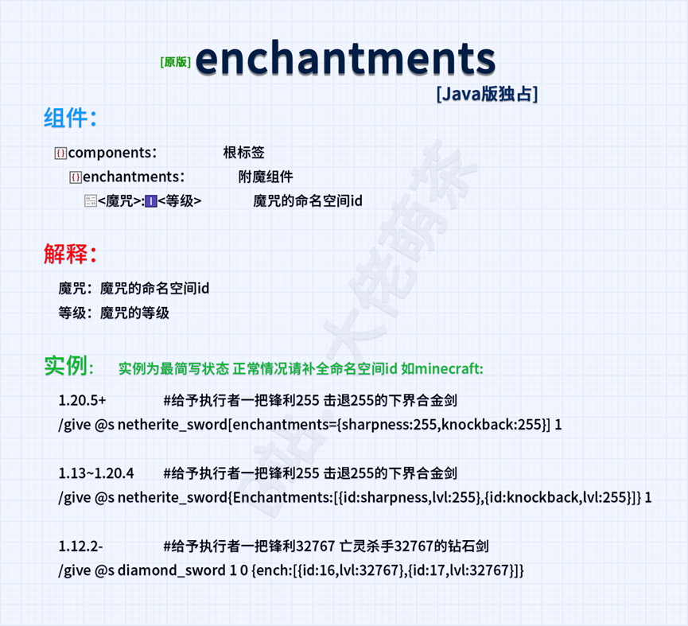
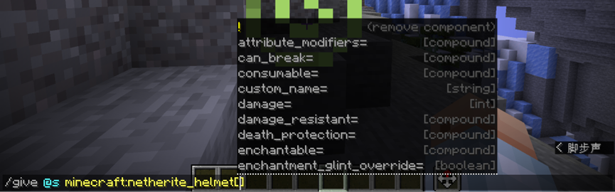
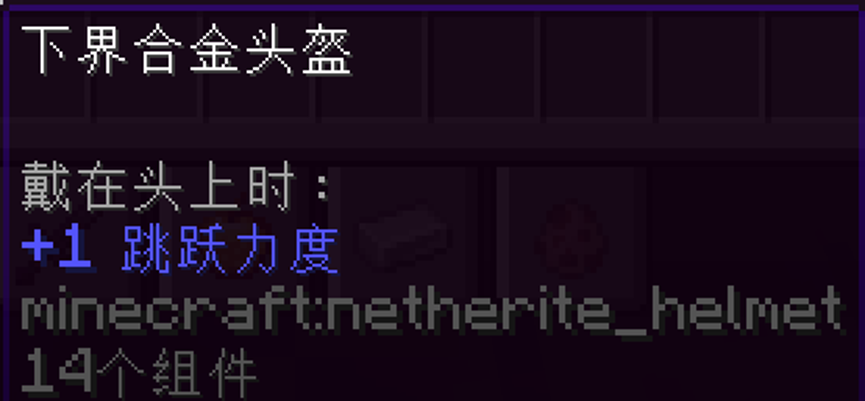
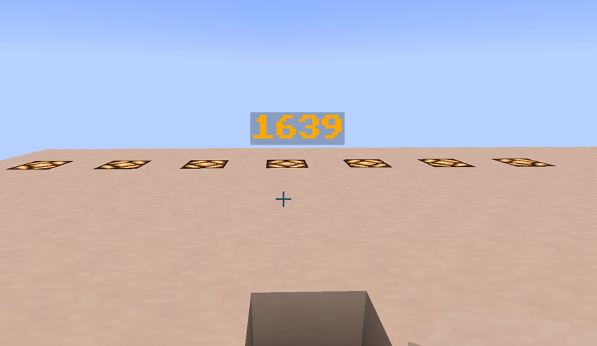
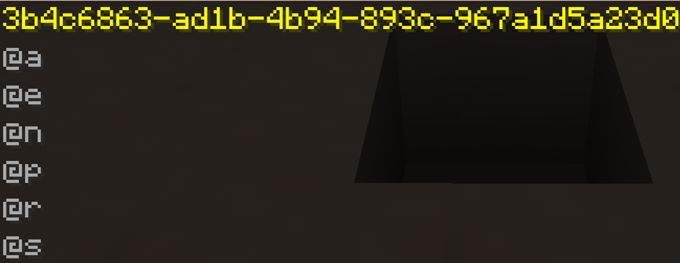
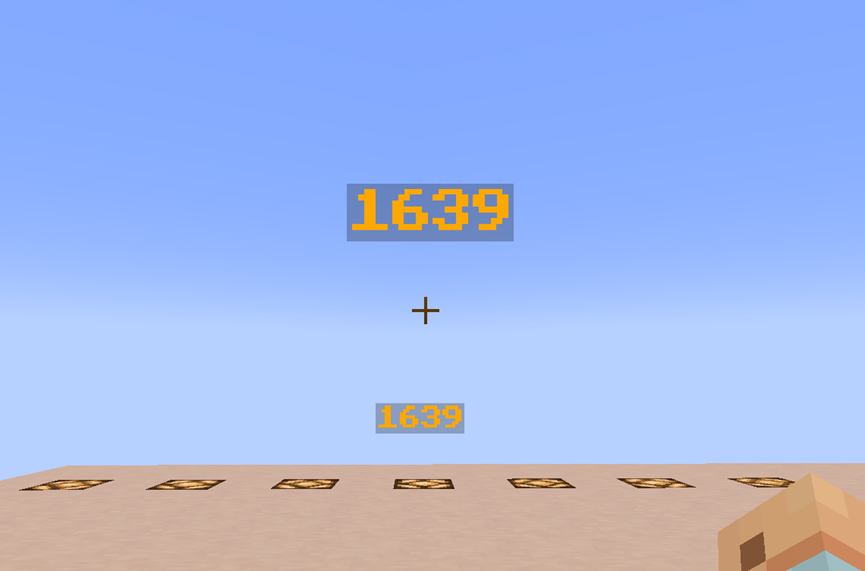
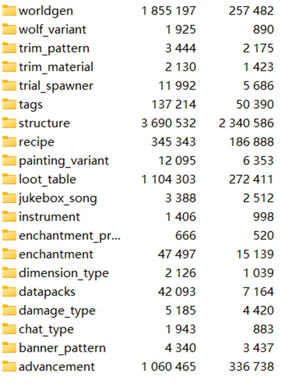

<!-- markdownlint-disable MD033 MD041 -->


<FeatureHead
    title = 数据包和命令入门学习-初学者如何快速适应
    authorName = doom_decapitator
    avatarUrl = '../../_authors/d_d.png'
    :socialLinks="[
        { name: 'BiliBili', url: 'https://space.bilibili.com/40077963' }
    ]"
/>

## 简介
对于Java版本数据包和命令的初学者来说，遇到实体数据格式或者数据组件不会写等问题情况是非常常见的现象，本文旨在为初学者找到学习和运用命令与数据包的方式。
## 通往智慧的宝库:Minecraft Wiki
[Minecraft Wiki](https://zh.minecraft.wiki/)提供的是相对权威的命令与数据包文档参考，含详细语法、案例及更新，是核心学习资源。在遇到有关问题时候，第一个就要想到Minecraft Wiki作为解答谜题的钥匙。

在QQ和贴吧水群**2小时**不如查Wiki**几分钟**，下面我来讲一个如何阅读Wiki，自己寻找答案的例子。
一日小明提问：

**“如何给自己一把时运114514的锄头”**

（实际上大多数版本时运到不了114514）

他抄了**百度搜索**给的命令然后不生效，小明仍未获得有效锄头，陷入“**改参数-报错-再提问**”的死循环，折腾了1个小时还是不会写（稍微夸张了一点），小明决定按照群友的意见去查阅Minecraft Wiki，搜索相关内容，这才发现了群友给他指令不能够生效的原因。

1.20.5之后**物品的NBT格式**被**物品堆叠组件**代替。通过实践小明在不同版本知晓了相应的附魔的写法。以上是一个关于适用wiki来学习的一个案例。不同版本格式多变，写法多变，wiki就是最权威的宝典。



**不同版本附魔写法参考**
 * **1.12-**:可支持类型为short
```mcfunction
give @p minecraft:diamond_hoe 1 0 {ench:[{id:35,lvl:32767}]}
```
 * **1.13-1.17.1**可支持类型为int(2147483647)
```mcfunction
give @s minecraft:diamond_hoe{Enchantments:[{id:"minecraft:fortune",lvl:114514}]}
```
 * **1.17.1-1.20.5**可支持类型为32767(Short)但是会限制在0~255之间
```mcfunction
give @s minecraft:diamond_hoe{Enchantments:[{id:"minecraft:fortune",lvl:32767}]}
```
（实际解析为255）
 * **1.20.5+** 1 ≤ 值 ≤ 255
```mcfunction
give @s diamond_hoe[enchantments={levels:{fortune:255}}] 1
```
对于数据包的学习Minecraft Wiki也给出了相关的指导和权威性内容-[数据包 - 中文 Minecraft Wiki](https://zh.minecraft.wiki/w/?curid=33058)，在[教程 - 中文 Minecraft Wiki](https://zh.minecraft.wiki/w/?curid=5792)中，设定了大量的已经由玩家们书写的教程，其中就包含了制作数据包的初始教程：[教程:制作数据包 - 中文 Minecraft Wiki](https://zh.minecraft.wiki/w/?curid=36294)和其他的教程案例。

## 配置Datapack Helper Plus
[教程:制作数据包#安装辅助插件](https://zh.minecraft.wiki/w/?curid=36294#%E5%AE%89%E8%A3%85%E8%BE%85%E5%8A%A9%E6%8F%92%E4%BB%B6)

**D**atapack **H**elper **P**lus, **DHP**是每个数据包制作者避不开的一部分，详细可以参考[Datapack Helper Plus by Spyglass - Visual Studio Marketplace](https://marketplace.visualstudio.com/items?itemName=SPGoding.datapack-language-server)，其中命令补全和命令提示的功能对于数据包玩家来说是真正不可或缺的；DHP有可能会遇到加载问题，可以参考萌茶的DHP修复视频[解决我的世界数据包工具报错问题-Datapack Helper Plus
](https://www.bilibili.com/video/BV1XM6UYAE4j)对于某些格式不清晰的玩家可以通过创造数据包文件，创建对应的文件捣鼓，不断调整；

### 项目特点
 * **多语言支持**：DHP支持多种语言，包括德语、英语、法语、意大利语、日语和简体中文，满足全球开发者的需求。
 * **语义高亮**：提供命令参数的语义着色，增强代码的可读性和可维护性。
 * **自动补全**：智能补全功能覆盖简单命令到复杂NBT标签，大幅减少输入错误。
 * **代码片段**：内置多种代码片段，加速常用代码结构的编写。
 * **诊断与代码操作**：实时检测代码错误，并提供快速修复选项。
 * **格式化和代码折叠**：自动格式化代码，支持代码块的折叠，优化代码布局。

## NBT Autocomplete等局内辅助工具
[NBT Autocomplete - Minecraft Mod](https://modrinth.com/mod/nbt-autocomplete)

NBT Autocomplete，简称nbtac，支持NBT补全功能，能帮助玩家在局内辅助补全NBT。当输入实体、方块、或物品的NBT标签时，游戏会显示可用标签及其类型的列表。示例：给予玩家一个**属性修饰符**为**在头部佩戴时增加<跳跃力度>1的数值**

参考Wiki：[attribute_modifiers](https://zh.minecraft.wiki/w/?curid=113905#attribute_modifiers)






可以看到自动帮玩家补全了NBT，简单高效，局内编辑大大缩短了时间。

## 获取数据和修改数据：data命令
data命令是Minecraft数据学习中不可缺失的一部分，相关教程：[MC命令教程"真"从零开始（十二）NBT数据读取与修改](https://www.bilibili.com/read/cv36068052/)。

`data get`命令可以用于查看实体、方块或者物品的数据。一个刚刚开始学习Minecraft命令和数据包的玩家，或者有一定基础的但是想要深入了解数据操作的人，可能会尝试创建自定义物品、调整实体行为，或者制作更为复杂的数据包。但是当遇到数据类型没有正确应用的问题，就需要工具来获取和检查数据。

对于新手玩家来说，`data get`命令可以帮助玩家透过现象看本质。让我们结合Wiki，以盔甲架为例子，如图是一个盔甲架:



乍一看是个悬浮的字，上书"1639"。然而这实际上是个实体，让我们`/data get entity`看一眼。注意/data get只能获取单一实体的数据，所以操作时选择器一定要做限制，比如要获取单一的最近的盔甲架：
```mcfunction
data get entity @e[type=minecraft:armor_stand,limit=1,sort=nearest]`
```
目标选择器在wiki专门的词条：[目标选择器](https://zh.minecraft.wiki/w/?curid=31547)


或者对于鼠标指针所指的实体可以直接Tab键位用实体特有的UUID指代。详细见[通用唯一识别码 - 中文 Minecraft Wiki](https://zh.minecraft.wiki/w/?curid=56543)。对于鼠标指针所所对准的物品也可以用`F3+I`的快捷键一键获取实体数据。




接下来对这个名为“1639”的盔甲架做分，当然我们的分析实际上是离不开Minecraft Wiki的，参考[盔甲架](https://zh.minecraft.wiki/w/?curid=13139)。比如：

* `CustomName`**指的是当前实体的自定义名称**;
* `CustomNameVisible`**表示实体是否一直渲染名称，通俗来说就是玩家能否看见**;
* `Invulnerable`**也是重要标签，决定实体是否能抵抗绝大多数伤害。如果为true，实体只会受到来自创造模式玩家的伤害和属于**`#bypasses_invulnerability`**标签的伤害**。

表面上感觉不像一个实体，实际上`data get`使它原形毕露，我们对于实体数据的学习也可以从这个角度入手：我们可以照抄！但是这里必须提一句，一定要去弄懂SNBT，对应[SNBT格式 - 中文 Minecraft Wiki](https://zh.minecraft.wiki/w/?curid=145849)。在这里举个例子就是`OnGround:1b`中的`b`是布尔值，`1`代表`true`，`0`代表`false`。

我们召唤一个盔甲架，以其中的几个标签作为例子：

**在原地召唤一个无敌的名字为1639的，显示名字但是本体隐身的盔甲架。**
```mcfunction
summon minecraft:armor_stand ~ ~ ~ {Invulnerable:1b,CustomName:'{"text":"1639","bold":true,"italic":false,"color":"gold"}',CustomNameVisible:true,Invisible:1b}
```


我们也可以通过data命令来修改盔甲架的实体数据，这里就展示data命令更为复杂的用法了，我们只修改简单的实体数据，举个例子：

**合并修改CustomName标签，使得”1639”的名字变成暗红色**
```mcfunction
data merge entity @e[type=minecraft:armor_stand,sort=nearest,limit=1] {CustomName:'{"text":"1639","bold":true,"italic":false,"color":"dark_red"}'}
```
对于新手玩家来说，很多其他疑问同样可以用`data get`来实现，而且具有普适性；比如上文提到的附魔的问题，我们对手上的附魔物品进行数据获取，例如说我们手上有一个**抢夺III**的金合欢船：

**获取主手物品的数据**
```mcfunction
data get entity @s SelectedItem
```


在该版本附魔的相关写法也就明晰了，转换到1.20.1还没有改动到物品堆叠组件（现并入数组组件），可以看到：


关于这部分的粗略讲解就先到这里。

## 拆解原版.jar文件进行模仿
新版 Minecraft（1.6+）已改用更模块化的文件结构（.minecraft/versions 文件夹）。我们找到对应版本的`.jar`文件进行解压(解压到其他地方，别原地)或者打开压缩包，依照路径\data\minecraft可以看到原版数据包的结构




正好对应Minecraft wiki数据包介绍。我们就可以模仿原版的数据包格式和数据包内容来创作。比如说我们创造一个**精准采集II**；通过修改**原版命名空间**下`silk_touch.json`和`spawner.json`我们就粗浅得显示了可以挖刷怪笼的精准采集II，且附魔台不会附魔出**精准采集II**。这是拆解原版.jar文件来做数据包的一个示例：

**Doom_CustomEnchantment/data/minecraft:silk_touch.json**

```json
{
  "anvil_cost": 8,
  "description": {
    "translate": "enchantment.minecraft.silk_touch"
  },
  "effects": {
    "minecraft:block_experience": [
      {
        "effect": {
          "type": "minecraft:set",
          "value": 0.0
        }
      }
    ]
  },
  "exclusive_set": "#minecraft:exclusive_set/mining",
  "max_cost": {
    "base": 65,
    "per_level_above_first": -50
  },
  "max_level": 2,
  "min_cost": {
    "base": 15,
    "per_level_above_first": 0
  },
  "slots": [
    "mainhand"
  ],
  "supported_items": "#minecraft:enchantable/mining_loot",
  "weight": 1
}

```

**Doom_CustomEnchantment/data/minecraft/loot_table/blocks/spawer.json**

```json
{
  "type": "minecraft:block",
  "random_sequence": "minecraft:blocks/spawner",
  "pools": [
    {
      "rolls": 1,
      "entries": [
        {
          "type": "item",
          "name": "spawner",
          "conditions": [
            {
              "condition": "match_tool",
              "predicate": {
                "components": {
                  "enchantments": {
                    "silk_touch": 2
                  }
                }
              }
            },
            {
              "condition": "random_chance",
              "chance": 0.25
            }
          ]
        }
      ]
    }
  ]
}
```

同样的示例还有很多，例如萌茶做的附魔兼容包:

[附魔不冲突/附魔互相兼容 - MC百科|最大的Minecraft中文MOD百科](https://www.mcmod.cn/class/17763.html)。

## 拆解数据包实例
在各种Minecraft地图中存在着玩家制作的数据包，例如suso参与制作的**Ragecraft 4 UnderWorld**相适配的数据包，还有各大平台论坛与平台上（比如[**Planet MC**](https://www.planetminecraft.com/)，[**Modrinth**](https://modrinth.com/)）也存在着大量的数据包。在Minecraft Wiki的教程模块中也有很多案例，例如[教程：自定义结构生成](https://zh.minecraft.wiki/w/?curid=113843)。

这些数据包是新手入门使用命令制作数据包的宝贵经验和参考。还有大量充当车轮子的数据包可以模仿，例如：[Bookshelf](https://github.com/Gunivers/Bookshelf/)，还有[Black Box Library](https://github.com/RockNRui/Black-Box-Library)。但是运用一定要**遵守开源协议**。

这里还推荐[Cartographer 2.0](https://github.com/pearuhdox/Cartographer-2.0) “大包”，其中自定义附魔的部分可以参考学习。对于函数计算等学习可以参考[小豆数据库3.0](https://github.com/xiaodou8593/math3.0)。

## 视频教学与香草图书馆
数据包的学习离不开数据包视频教学，在b站有很多up有做视频教学，例如[萌茶](https://space.bilibili.com/320500029/upload/video)，[天豹星雲](https://space.bilibili.com/19856853)、[创小业](https://space.bilibili.com/133430292?spm_id_from=333.337.0.0)、[Dahesor](https://space.bilibili.com/436796403?spm_id_from=333.337.0.0)、[CR_019](https://search.bilibili.com/all?keyword=cr019&from_source=webtop_search&spm_id_from=333.1387&search_source=5)等；另外，[香草图书馆](https://cr-019.github.io/datapack-index/)中有大量的数据包学习教程，这里是数据包创作者的天堂。

## 总结
掌握数据包和命令需要经历"**模仿-理解-创造**"的螺旋式上升过程。建议从改造现有数据包开始（如修改村民交易表等等），逐步过渡到独立创作。当遇到报错时，善用游戏内提示（F3调试屏幕）和日志文件定位问题。每个错误都是理解数据包运作机制的宝贵机会，持续实践将帮助你建立起对数据结构的直觉认知。