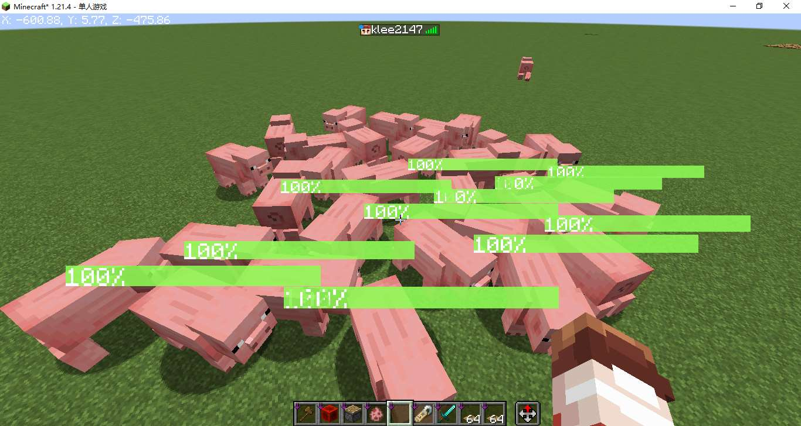
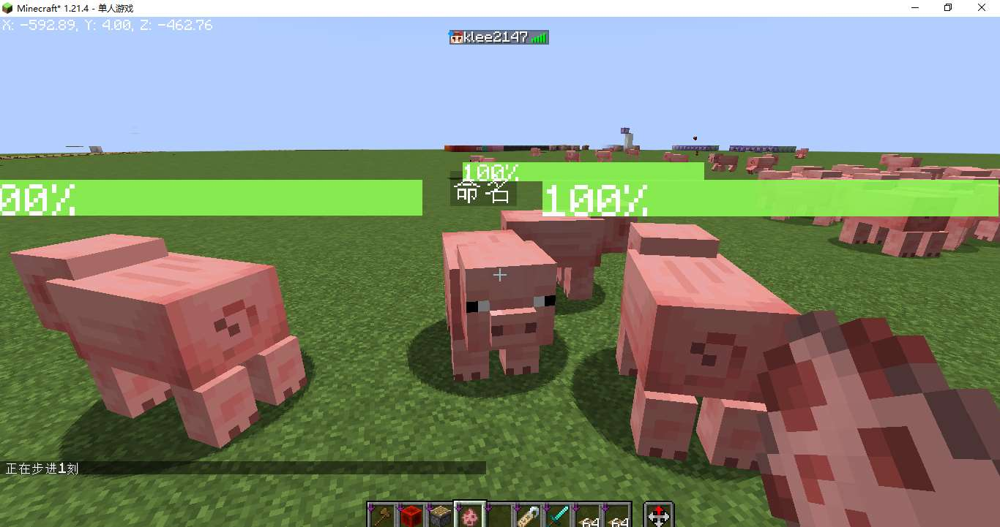

# 原版血条！

## 绪论

事情还等从上周说起，那天晚上我安安静静的用我的电脑玩〇神，突然意识到一件事情，在原版MC中无论是生物还是怪物都不给显示血条，这对原版玩家很不友好。

去b站搜索发现，已经有人制作了类似的命令，详见[BV1PZfzYCEXy](https://www.bilibili.com/video/BV1PZfzYCEXy/)，在原版中能制作出血条缓动确实惊艳到我了，遗憾的是这并不支持java版，于是我制作了适用于java版的血条显示数据包。

**它具有以下特性**

* 血条缓动效果\

* 多生物支持
* 良好的常态性能

* 血条不与生物名字冲突


## 思路概述

### 1.血条文本

堆叠“|”字符可以实现简易的血条
```mcfunction
tellraw @a [{"text":"||||||||"}]
```
\
然而我们并不希望血条中间带有空像素，可以在两两字符中间插入负空格解决
这里使用了[NegetiveSpaceFont](https://github.com/AmberWat/NegativeSpaceFont)资源包，可以很方便的插入负空格。
```mcfunction
tellraw @a [\
    {"text":"|"},{"translate":"space.-1"},\
    {"text":"|"},{"translate":"space.-1"},\
    {"text":"|"},{"translate":"space.-1"}\
]\
```
\
将血条文本写入语言文件，通过翻译键调用，每一行对应一个血量百分比，由于语言文件中不能写文本组件，则需要找到负空格`space.-1`对应的Unicode码位，并用转义字符`\uXXXX`表示，拆解NegetiveSpaceFont资源包的语言文件，发现了一些未知字符，这是因为这些字符已被解析过一次，使用十六进制文本转换器转换`space.-1`对应的未知字符，得到`daffdfff`，则它对应的转义字符应为`\udaff\udfff`。
```json
{
    "newlayer":"󀀀",
    "space.-infinity":"󀀁",
    "space.infinity":"󟿿",
    "space.-max":"󎀀",
    "space.-8192":"󎀀",
    "space.-8191":"󎀁",
    ...
    "space.-1":"󏿿",
    ...
}
```
最终写好的血条文本语言文件如下，`\udb00\udc01`表示$1$像素的正空格，`\udaff\udfff`表示$1$像素的负空格，`\udaff\udf9c`是$100$像素负空格，放在末尾用于光标回正。手写$100$行的语言文件不可能，于是使用了python程序。
```json
{
	"skapi.healthbar.0":"\udb00\udc01\udb00\udc01\udb00\udc01\udb00\udc01\udb00\udc01\udb00\udc01\udb00\udc01\udb00\udc01\udb00\udc01\udb00\udc01\udb00\udc01\udb00\udc01\udb00\udc01\udb00\udc01\udb00\udc01\udb00\udc01\udb00\udc01\udb00\udc01\udb00\udc01\udb00\udc01\udb00\udc01\udb00\udc01\udb00\udc01\udb00\udc01\udb00\udc01\udb00\udc01\udb00\udc01\udb00\udc01\udb00\udc01\udb00\udc01\udb00\udc01\udb00\udc01\udb00\udc01\udb00\udc01\udb00\udc01\udb00\udc01\udb00\udc01\udb00\udc01\udb00\udc01\udb00\udc01\udb00\udc01\udb00\udc01\udb00\udc01\udb00\udc01\udb00\udc01\udb00\udc01\udb00\udc01\udb00\udc01\udb00\udc01\udb00\udc01\udb00\udc01\udb00\udc01\udb00\udc01\udb00\udc01\udb00\udc01\udb00\udc01\udb00\udc01\udb00\udc01\udb00\udc01\udb00\udc01\udb00\udc01\udb00\udc01\udb00\udc01\udb00\udc01\udb00\udc01\udb00\udc01\udb00\udc01\udb00\udc01\udb00\udc01\udb00\udc01\udb00\udc01\udb00\udc01\udb00\udc01\udb00\udc01\udb00\udc01\udb00\udc01\udb00\udc01\udb00\udc01\udb00\udc01\udb00\udc01\udb00\udc01\udb00\udc01\udb00\udc01\udb00\udc01\udb00\udc01\udb00\udc01\udb00\udc01\udb00\udc01\udb00\udc01\udb00\udc01\udb00\udc01\udb00\udc01\udb00\udc01\udb00\udc01\udb00\udc01\udb00\udc01\udb00\udc01\udb00\udc01\udb00\udc01\udb00\udc01\udaff\udf9c",
	"skapi.healthbar.1":"|\udaff\udfff\udb00\udc01\udb00\udc01\udb00\udc01\udb00\udc01\udb00\udc01\udb00\udc01\udb00\udc01\udb00\udc01\udb00\udc01\udb00\udc01\udb00\udc01\udb00\udc01\udb00\udc01\udb00\udc01\udb00\udc01\udb00\udc01\udb00\udc01\udb00\udc01\udb00\udc01\udb00\udc01\udb00\udc01\udb00\udc01\udb00\udc01\udb00\udc01\udb00\udc01\udb00\udc01\udb00\udc01\udb00\udc01\udb00\udc01\udb00\udc01\udb00\udc01\udb00\udc01\udb00\udc01\udb00\udc01\udb00\udc01\udb00\udc01\udb00\udc01\udb00\udc01\udb00\udc01\udb00\udc01\udb00\udc01\udb00\udc01\udb00\udc01\udb00\udc01\udb00\udc01\udb00\udc01\udb00\udc01\udb00\udc01\udb00\udc01\udb00\udc01\udb00\udc01\udb00\udc01\udb00\udc01\udb00\udc01\udb00\udc01\udb00\udc01\udb00\udc01\udb00\udc01\udb00\udc01\udb00\udc01\udb00\udc01\udb00\udc01\udb00\udc01\udb00\udc01\udb00\udc01\udb00\udc01\udb00\udc01\udb00\udc01\udb00\udc01\udb00\udc01\udb00\udc01\udb00\udc01\udb00\udc01\udb00\udc01\udb00\udc01\udb00\udc01\udb00\udc01\udb00\udc01\udb00\udc01\udb00\udc01\udb00\udc01\udb00\udc01\udb00\udc01\udb00\udc01\udb00\udc01\udb00\udc01\udb00\udc01\udb00\udc01\udb00\udc01\udb00\udc01\udb00\udc01\udb00\udc01\udb00\udc01\udb00\udc01\udb00\udc01\udb00\udc01\udb00\udc01\udb00\udc01\udb00\udc01\udaff\udf9c",
	"skapi.healthbar.2":"|\udaff\udfff|\udaff\udfff\udb00\udc01\udb00\udc01\udb00\udc01\udb00\udc01\udb00\udc01\udb00\udc01\udb00\udc01\udb00\udc01\udb00\udc01\udb00\udc01\udb00\udc01\udb00\udc01\udb00\udc01\udb00\udc01\udb00\udc01\udb00\udc01\udb00\udc01\udb00\udc01\udb00\udc01\udb00\udc01\udb00\udc01\udb00\udc01\udb00\udc01\udb00\udc01\udb00\udc01\udb00\udc01\udb00\udc01\udb00\udc01\udb00\udc01\udb00\udc01\udb00\udc01\udb00\udc01\udb00\udc01\udb00\udc01\udb00\udc01\udb00\udc01\udb00\udc01\udb00\udc01\udb00\udc01\udb00\udc01\udb00\udc01\udb00\udc01\udb00\udc01\udb00\udc01\udb00\udc01\udb00\udc01\udb00\udc01\udb00\udc01\udb00\udc01\udb00\udc01\udb00\udc01\udb00\udc01\udb00\udc01\udb00\udc01\udb00\udc01\udb00\udc01\udb00\udc01\udb00\udc01\udb00\udc01\udb00\udc01\udb00\udc01\udb00\udc01\udb00\udc01\udb00\udc01\udb00\udc01\udb00\udc01\udb00\udc01\udb00\udc01\udb00\udc01\udb00\udc01\udb00\udc01\udb00\udc01\udb00\udc01\udb00\udc01\udb00\udc01\udb00\udc01\udb00\udc01\udb00\udc01\udb00\udc01\udb00\udc01\udb00\udc01\udb00\udc01\udb00\udc01\udb00\udc01\udb00\udc01\udb00\udc01\udb00\udc01\udb00\udc01\udb00\udc01\udb00\udc01\udb00\udc01\udb00\udc01\udb00\udc01\udb00\udc01\udb00\udc01\udb00\udc01\udb00\udc01\udb00\udc01\udaff\udf9c",
    ...
}
```
```python
with open("1.txt","w") as f:
    f.write("{\n")
    for i in range(0,101):
        f.write('\t"skapi.healthbar.%d":"%s%s\\udaff\\udf9c",\n'%(i,"|\\udaff\\udfff"*i,"\\udb00\\udc01"*(100-i)))
    f.write("}")
```
如此一来，通过翻译键可调用任意百分比的血条：
```mcfunction
tellraw @a [\
    {"translate":"skapi.healthbar.2"},{"text":"\n"},\
    {"translate":"skapi.healthbar.50"},{"text":"\n"},\
    {"translate":"skapi.healthbar.100"},{"text":"\n"}\
]
```
\
血条叠加也很好实现
```mcfunction
tellraw @a [\
    {"translate":"skapi.healthbar.70","color":"yellow"},\
    {"translate":"skapi.healthbar.40","color":"green"}\
]
```


### 2.血条及血条缓动计算

需要先将血量转为血量百分比，记录生物当前血量(/data, Health)和最大血量(/attribute, max_health)，计算比值获得百分比。
缓动效果也好实现，遵循以下规律：
1. 如果 **缓动血量百分比** 小于 **血量百分比** 则 **缓动血量百分比** 设为 **血量百分比**
2. 如果 **缓动血量百分比** 大于 **血量百分比** 则 **缓动血量百分比** 减少$3$
```mcfunction
# load.mcfunction

# 当前血量
scoreboard objectives add skapi.health dummy

# 最大血量
scoreboard objectives add skapi.health_max dummy

# 血量百分比
scoreboard objectives add skapi.health_percent dummy

# 缓动血量百分比
scoreboard objectives add skapi.health_temp dummy
```
```mcfunction
# tick/_2.mcfunction

# 计算血量百分比
execute store result score @s skapi.health run data get entity @s Health 100000
execute store result score @s skapi.health_max run attribute @s max_health base get 1000
execute store result score @s skapi.health_percent run scoreboard players operation @s skapi.health /= @s skapi.health_max

# 检测当前实体是否有skapi.health_temp计分板，没有则创建
execute unless function sklibs:health/tick/_2.test run scoreboard players operation @s skapi.health_temp = @s skapi.health_percent

# 刷新缓动血量百分比
execute if score @s skapi.health_temp > @s skapi.health_percent run scoreboard players remove @s skapi.health_temp 3
execute if score @s skapi.health_temp < @s skapi.health_percent run scoreboard players operation @s skapi.health_temp = @s skapi.health_percent
```
```mcfunction
# tick/_2.test.mcfunction

execute if score @s skapi.health_temp matches -2147483648..2147483647 run return 1
```

### 3.血量显示

使用`CustomName`在生物头上显示血量
```mcfunction
# tick/_2.mcfunction

# 显示血条
execute store result storage minecraft:skapi.health args.now int 1 run scoreboard players get @s skapi.health_percent
execute store result storage minecraft:skapi.health args.fade int 1 run scoreboard players get @s skapi.health_temp
function sklibs:health/tick/_3.display with storage minecraft:skapi.health args
```
```mcfunction
# tick/_3.display.mcfunction

# 四行文本分别为：负空格居中血条，缓动血条，实际血条，血量百分比文本
$data modify entity @s CustomName set value '[\
    {"translate":"space.-50"},\
    {"translate":"skapi.healthbar.$(fade)","color":"yellow"},\
    {"translate":"skapi.healthbar.$(now)","color":"green"},\
    {"text":"$(fade)%","color":"white"}\
]'
```
### 4.UUID分配
测试发现，濒死的生物无法正常刷新血条，换句话说就是生物播放死亡动画的时间段内无法正常刷新血条，这是因为濒死的生物无法通过`@e`选择器选中，濒死的生物只能通过`@s`，`UUID`，`on origin`等进行选择。

解决方案：把要显示血条的实体的UUID放到一个列表里，遍历这个列表，对每个UUID对应的实体进行操作，如果UUID对应的生物不存在则删除这个UUID

注：此处UUID数组转字符串方法来自于卡儿数学库large_number
```mcfunction
# tick.mcfunction

# 注册实体
# 标签sklibs:islive_1.21.4记录了所有活体生物，不包括盔甲架，矿车等
execute as @e[type=#sklibs:islive_1.21.4,tag=!skhealth] run function sklibs:health/tick/_0.register

# 遍历已注册实体列表
# SK前置库提供的方法，以下三行分别为：被遍历的列表，循环体，循环变量
data modify storage skapi.arrays temp.foreachTarget set from storage skapi.health uuids
data modify storage skapi.arrays temp.foreachTemp.cmd set value "function sklibs:health/tick/_1 with storage skapi.health i"
data modify storage skapi.arrays temp.foreachTemp.i set value "storage skapi.health i"
function sklibs:skapi_arrays/foreach
```
```mcfunction
# tick/_0.register.mcfunction

data modify entity @s CustomNameVisible set value true
tag @s add skhealth

# 存储UUID
data modify storage skapi.math uuid_list_for_hyphen.input set from entity @s UUID
function sklibs:skapi_math/uuidarray2string
data modify storage skapi.health uuids append value {a:"temp"}
data modify storage skapi.health uuids[{a:"temp"}].a set from storage skapi.math uuid_list_for_hyphen.output
```
```mcfunction
# tick/_1.mcfunction

# 实体不存在，则删除该实体的的UUID
$execute unless entity $(a) run return run function sklibs:health/tick/_1.noentity with storage skapi.health i

# 执行实体tick
$execute as $(a) at @s run function sklibs:health/tick/_2
```
```mcfunction
# tick/_1.noentity.mcfunction

$data remove storage skapi.health uuids[{a:"$(a)"}]
return 0
```

### 5.解决性能问题

更新大量实体所消耗的性能是巨量的，解决方法是只更新玩家5格以内的实体，如果实体不在玩家5格以内，则将其UUID从列表中删除，减少循环次数以降低性能开支
```mcfunction
# tick.mcfunction

# 注册实体
# execute as @e[type=#sklibs:islive_1.21.4,tag=!skhealth] run function sklibs:health/tick/_0.register
execute as @a at @s as @e[type=#sklibs:islive_1.21.4,distance=0..5,tag=!skhealth]run function sklibs:health/tick/_0.register
```
```mcfunction
# tick/_1.mcfunction

...

# 实体不在玩家5格以内，则删除该实体的的UUID，终止血条显示
$execute as $(a) at @s unless entity @e[type=player,distance=0..5] run return run function sklibs:health/tick/_1.unloaded with storage skapi.health i

...
```
```mcfunction
# tick/_1.unloaded.mcfunction

$data remove storage skapi.health uuids[{a:"$(a)"}]
data remove entity @s CustomName
data modify entity @s CustomNameVisible set value false
tag @s remove skhealth
return 0
```
### 6.解决名字冲突问题

由于血条是占用实体的`CutomName`进行显示
* 特性1：如果实体已被命过名，则它的名字会被血条覆盖。
* 特性2：在血条显示期间，使用命名牌给实体命名，名字会被立即覆盖。

修复特性1，注册实体时添加unless data entity @s CustomName判断即可，如果该实体已有名字，则不注册该实体\
修复特性2，实体tick中添加判断，如果实体已被重命名则删除UUID列表中该实体的UUID，终止显示血条。判断是否被重命名，只需粗略地判断名字是不是以`{`开头即可~~（应该不会有人使用以`{`开头的名字吧）~~
```mcfunction
# tick/_2.mcfunction

# 如果实体已被命过名，则删除UUID
data modify storage minecraft:skapi.health name set value ""
data modify storage minecraft:skapi.health name set string entity @s CustomName 0 1
execute if data entity @s CustomName unless data storage minecraft:skapi.health {name:'{'} run return run function sklibs:health/tick/_2.named with storage skapi.health i

...
```
```mcfunction
# tick/_2.named.mcfunction

$data remove storage skapi.health uuids[{a:"$(a)"}]
data modify entity @s CustomNameVisible set value false
tag @s remove skhealth
return 0
```
### 7.安全初始化
在一些特殊的情况下，比如游戏崩溃后重新进存档，有概率导致部分实体已被注册但是UUID列表中没有对应的UUID，进一步导致血条显示异常，此时需要在数据包载入时注销所有已注册的实体并清空UUID列表
```mcfunction
load.mcfunction

execute as @e[tag=skhealth] run function sklibs:health/load/_0
data modify storage skapi.health uuids set value []

...
```
```mcfunction
load/_0.mcfunction

tag @s remove skhealth
data remove entity @s CustomName
data modify entity @s CustomNameVisible set value false
```

## 数据包下载

**适用版本：1.21.4**

**数据包**
* [1.21.4_SK_Health.zip](https://ymqlgthbsakuradream.github.io/posts/minecraft/Archive.20250504/1.21.4_SK_Health.zip)
* [1.21.4_SK前置包_Alpha.zip](https://ymqlgthbsakuradream.github.io/posts/minecraft/Archive.20250416/1.21.4_SK%E5%89%8D%E7%BD%AE%E5%8C%85_Alpha.zip)\
（关于前置包，目前处于开发状态，基本完成后会写文章介绍）

**资源包**
* [1.21.4_SK_Health_RP.zip](https://ymqlgthbsakuradream.github.io/posts/minecraft/Archive.20250504/1.21.4_SK_Health_RP.zip)
* [NegetiveSpaceFont](https://github.com/AmberWat/NegativeSpaceFont/archive/refs/heads/master.zip) ([Github页面](https://github.com/AmberWat/NegativeSpaceFont))

**鸣谢**
* [卡儿数学库large_number](https://github.com/kaer-3058/large_number)\
(无需下载，相关方法已整合入SK前置包)