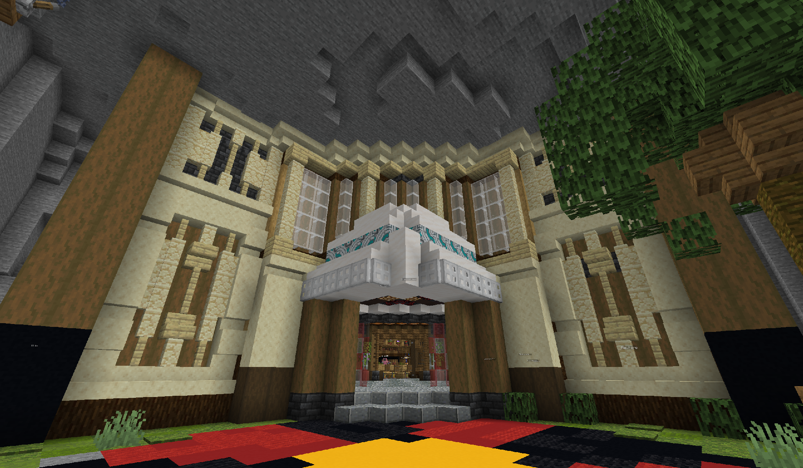
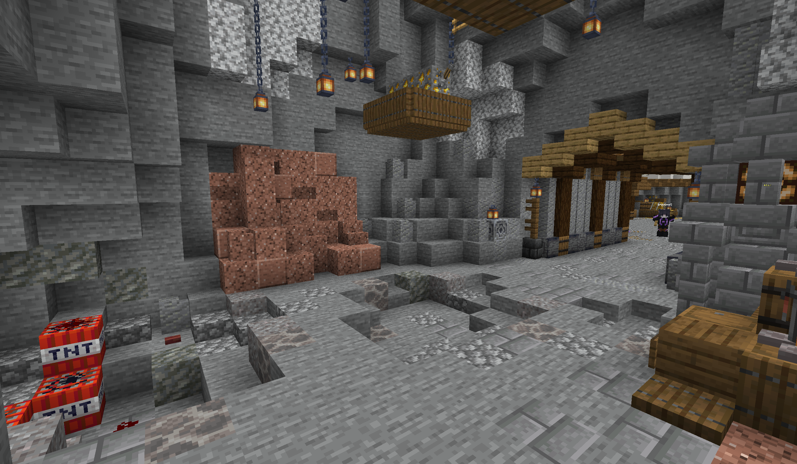
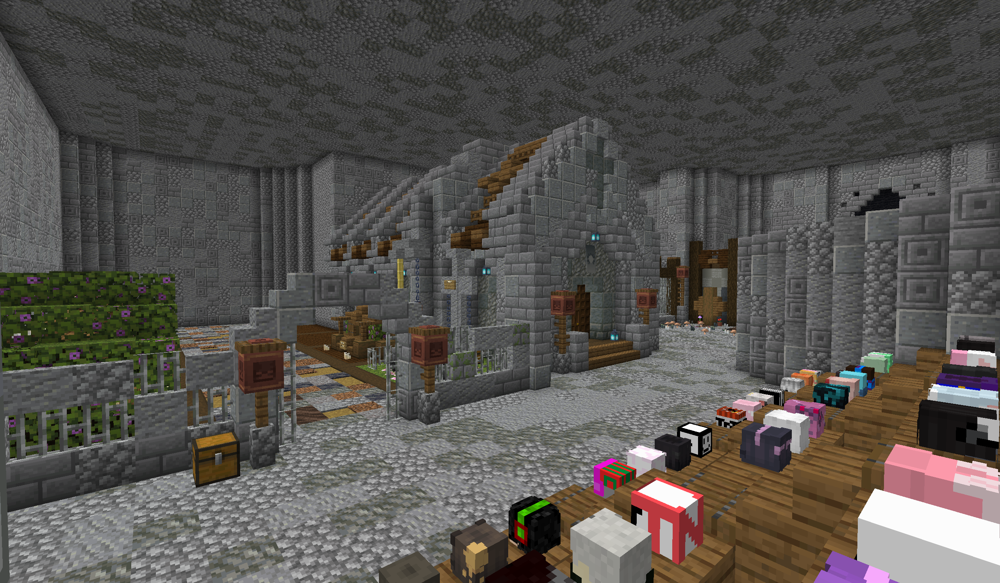
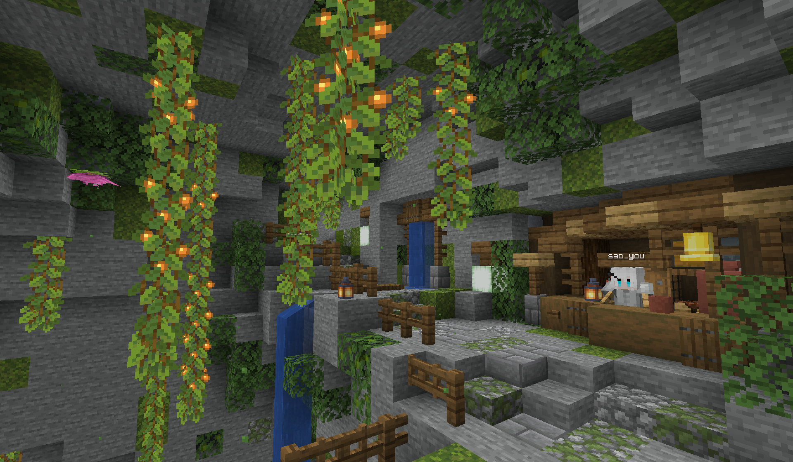
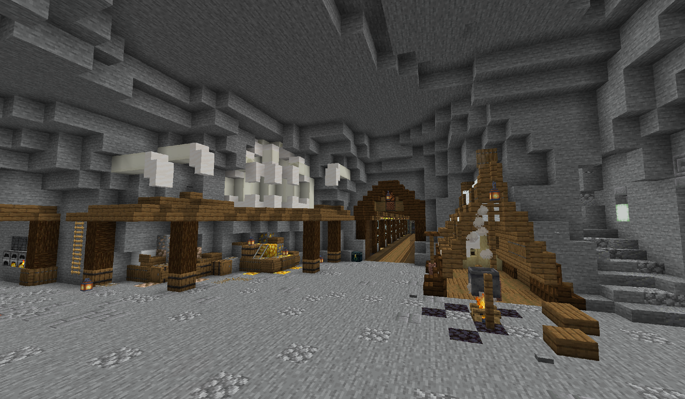

<!-- markdownlint-disable MD033 MD041 -->


<FeatureHead
    title = 'Digging Underground'
    authorName = sao_you
    avatarUrl = '../../_authors/sao_you.jpg'
    :socialLinks="[
        { name: 'BiliBili', url: 'https://space.bilibili.com/286192403' }
    ]"
    cover = '../_assets/6.png'
    resourceLink = 'https://wwdj.lanzout.com/b00mpggbvi'
/>

## 简介

挖掘在地下(Digging Underground)是一张生存PVP类地图，游戏开始时玩家将在洞穴挖掘矿石，制作不同装备与武器，随后与其他玩家进行PVP，取得最终胜利。

**地图包含：**
* 29种独特角色
* 40+种独特道具
* 8个不同矿井
* 多种自定义设置！

## 仍在迭代！

部分内容仍在更新与调整，敬请期待！

如果您在游玩途中遇到任何问题，或是对地图有任何建议，请务必向作者提供反馈！

**⚠️角色：化石尚未完成，请勿选择**

## 截图











## 地图须知

地图指令:
```mcfunction
#重置游戏
function command:stop_game

#解锁所有角色
function command:enlock
#                    [sic]编者注

#重置玩家属性
tag [玩家id] remove __init__
```

## 作者的话

相对来说，这是我第一次制作数据包地图，所以在开发中更多是将角色数值设置过高，或设计过于糟糕的反馈。\
而在其中最大的还是缺少地图经验，不管是UI设计还是代码优化，始终还处于中等偏下的水平，就导致了比较乏味的游戏体验，或者是过于复杂的地图设计，还有大杂烩……\
当然在一年半的摸索中，我逐渐学习高质量地图，并借鉴其他地图并进行好的修改，使地图保持一个相对能玩的程度。\
也非常感谢香草图书馆能给我这一次机会去展示自我。感谢你们的付出与努力！`(编者注：加油！)`

## 地图下载

https://wwdj.lanzout.com/b00mpggbvi \
密码:saoyou