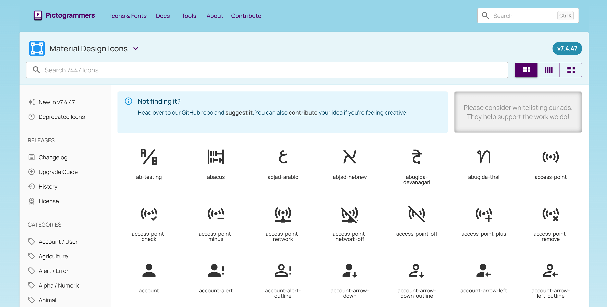
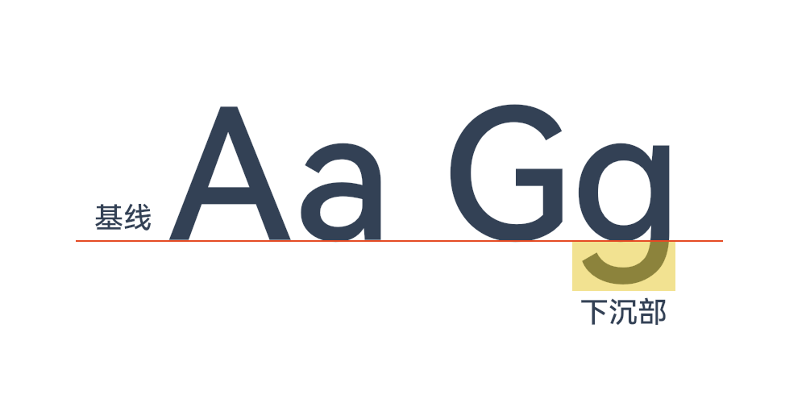
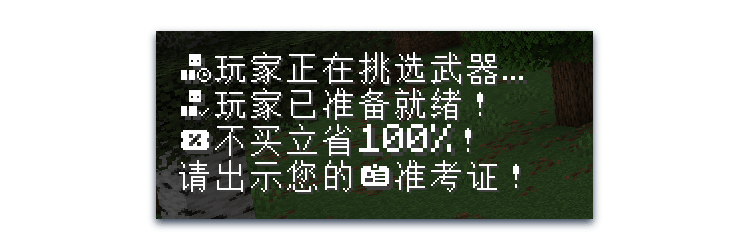
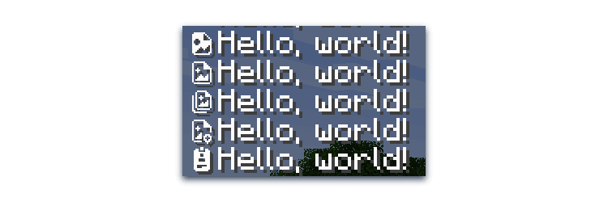
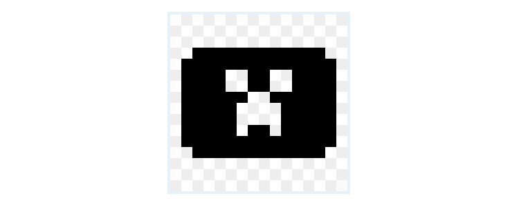
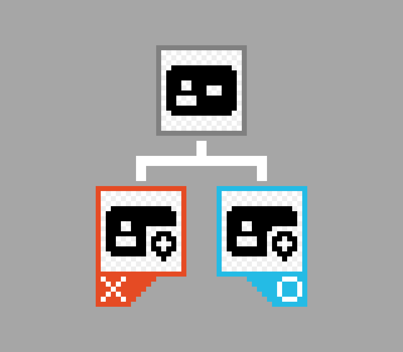
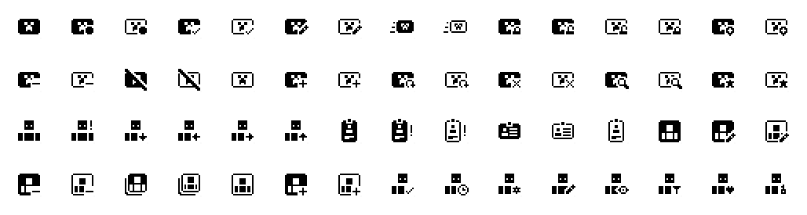
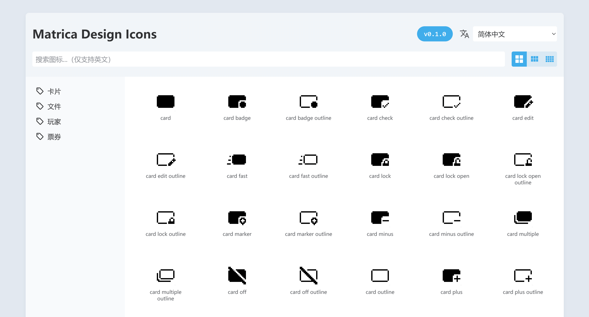
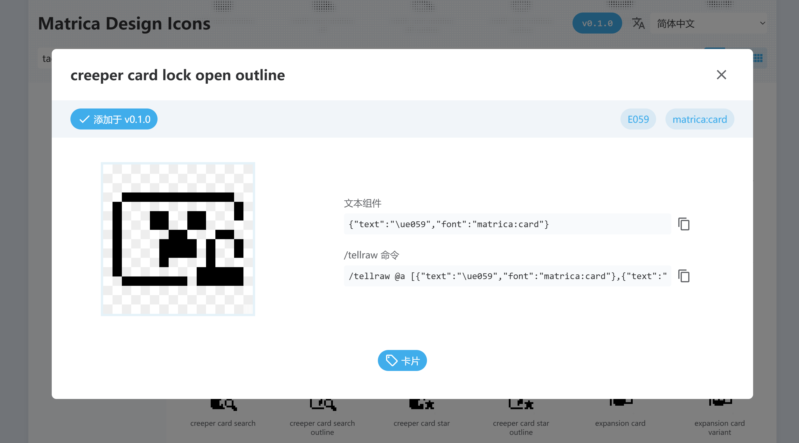

<FeatureHead
    title = '对 Minecraft 图标资产库资源包的可行性尝试'
    authorName = Sheep-realms
    avatarUrl = '../../_authors/sheep-realms.jpg'
    :socialLinks="[
        { name: 'BiliBili', url: 'https://space.bilibili.com/43881503' },
		{ name: 'GitHub', url: 'https://github.com/sheep-realms' }
    ]"
    resourceLink = 'https://github.com/sheep-realms/Matrica-Design-Icons'
/>


不知道您有没有想过，各大网站、APP 中各种精美的图标都是哪里来的？一些大公司通常会自己按需设计一套图标资产库，毕竟自己设计的东西才是最适合自己的。而独立开发者、小型项目则会使用公共图标资产库。

市面上有大量这样的图标资产库可供使用，对于开发者来说，想要使用这些图标资产库，只需将其导入到自己的项目里即可使用。这些图标通常是单色的，开发者可以随意为其填充需要的颜色。

不过，图标库里的图标通常多达上千甚至上万个，如何在其中找到需要的图标呢？为了解决这个问题，图标库通常会提供一个查询工具，帮助用户快速找到所需的图标。



有一天，笔者突然想到了一个点子：我们可不可以设计一套可在 Minecraft 中使用的图标资产库？为此，笔者在各大资源网站简单搜索了一下，没有找到类似产品。既然也许没有人这么做过，那我们就来自己做一个吧！


## 实现方案

从 Minecraft Java 版 1.16 快照 20w17a 开始，文本组件支持指定字体，这使得创作一个图标资产库并制作成一个易用的资源包变得更加便捷。创作者可以将图标以文本的形式插入到任何有文本的地方。

但这么做必然需要替换一些字符，有哪些字符可供我们替换呢？

首先不能替换那些我们有可能会用到的字符，无论它是生僻字还是稀奇古怪的火星文，我们要尽可能不破坏人类有可能使用的字符。虽然一般使用默认字体不会有什么问题，但别忘了 Minecraft 有着一项无障碍功能 —— 讲述人。讲述人会将被用作图标的字符读出，这显然不合适。

笔者首先想到了 Unicode 扩展平面的私人使用区（A区），也就是 `E0000` 至 `EFFFF`。但很快就遇到了一个问题，Minecraft 不支持以类似于 `\u{e0000}` 格式的转义符表示基本平面以外的字符，而是要将其转换为两个码元。虽然转换过程不算复杂，但笔者认为没必要给自己找不必要的麻烦。

好在 Unicode 基本多文种平面内还有一个私用区，也就是 `E000` 至 `F8FF`。虽然少了点，但我们可以定义多个字体，所以不需要太担心容量的问题。

> 事实上，市面上的很多图标库都会将使用字体替换私用区字符作为其中一种导入方案。您也许会在某次网络不通畅时，看到过网页上本应显示图标的位置出现了一个方框或是乱码。

于是，通过创建一个字体定义 JSON 和一个 16 × 16 的字符图标矩阵图，我们就能完成图标与文字的映射：

::: details 字体定义 JSON

``` json
{
    "providers": [
        {
            "type": "space",
            "advances": {
                " ": 4
            }
        },
        {
            "type": "bitmap",
            "file": "minecraft:font/test.png",
			"height": 8,
            "ascent": 7,
            "chars": [
				"\ue000\ue001\ue002\ue003\ue004\ue005\ue006\ue007\ue008\ue009\ue00a\ue00b\ue00c\ue00d\ue00e\ue00f",
				"\ue010\ue011\ue012\ue013\ue014\ue015\ue016\ue017\ue018\ue019\ue01a\ue01b\ue01c\ue01d\ue01e\ue01f",
				"\ue020\ue021\ue022\ue023\ue024\ue025\ue026\ue027\ue028\ue029\ue02a\ue02b\ue02c\ue02d\ue02e\ue02f",
				"\ue030\ue031\ue032\ue033\ue034\ue035\ue036\ue037\ue038\ue039\ue03a\ue03b\ue03c\ue03d\ue03e\ue03f",
				"\ue040\ue041\ue042\ue043\ue044\ue045\ue046\ue047\ue048\ue049\ue04a\ue04b\ue04c\ue04d\ue04e\ue04f",
				"\ue050\ue051\ue052\ue053\ue054\ue055\ue056\ue057\ue058\ue059\ue05a\ue05b\ue05c\ue05d\ue05e\ue05f",
				"\ue060\ue061\ue062\ue063\ue064\ue065\ue066\ue067\ue068\ue069\ue06a\ue06b\ue06c\ue06d\ue06e\ue06f",
				"\ue070\ue071\ue072\ue073\ue074\ue075\ue076\ue077\ue078\ue079\ue07a\ue07b\ue07c\ue07d\ue07e\ue07f",
				"\ue080\ue081\ue082\ue083\ue084\ue085\ue086\ue087\ue088\ue089\ue08a\ue08b\ue08c\ue08d\ue08e\ue08f",
				"\ue090\ue091\ue092\ue093\ue094\ue095\ue096\ue097\ue098\ue099\ue09a\ue09b\ue09c\ue09d\ue09e\ue09f",
				"\ue0a0\ue0a1\ue0a2\ue0a3\ue0a4\ue0a5\ue0a6\ue0a7\ue0a8\ue0a9\ue0aa\ue0ab\ue0ac\ue0ad\ue0ae\ue0af",
				"\ue0b0\ue0b1\ue0b2\ue0b3\ue0b4\ue0b5\ue0b6\ue0b7\ue0b8\ue0b9\ue0ba\ue0bb\ue0bc\ue0bd\ue0be\ue0bf",
				"\ue0c0\ue0c1\ue0c2\ue0c3\ue0c4\ue0c5\ue0c6\ue0c7\ue0c8\ue0c9\ue0ca\ue0cb\ue0cc\ue0cd\ue0ce\ue0cf",
				"\ue0d0\ue0d1\ue0d2\ue0d3\ue0d4\ue0d5\ue0d6\ue0d7\ue0d8\ue0d9\ue0da\ue0db\ue0dc\ue0dd\ue0de\ue0df",
				"\ue0e0\ue0e1\ue0e2\ue0e3\ue0e4\ue0e5\ue0e6\ue0e7\ue0e8\ue0e9\ue0ea\ue0eb\ue0ec\ue0ed\ue0ee\ue0ef",
				"\ue0f0\ue0f1\ue0f2\ue0f3\ue0f4\ue0f5\ue0f6\ue0f7\ue0f8\ue0f9\ue0fa\ue0fb\ue0fc\ue0fd\ue0fe\ue0ff"
            ]
        }
    ]
}
```

顺带一提，这里添加了空格宽度的定义只是为了方便在两个图标之间添加空隙。

::: 

当然 16 × 16 的矩阵只是一个习惯，只要您愿意，把所有图标都塞一张图里也不是不行，但不建议这么做。

至此，资源包部分的实现方案已确定可行。


## 选择参考

笔者选用了 Material Design Icons 作为参考，主要是应为个人爱好。不过，将这款图标库转换成像素图标确实是一个不错的选择，原因如下：

- Material Design（译为质感设计、材质设计、材料设计）是一款经过十多年时间迭代的设计语言，其质量受到了广泛认可。
- Material Design 有现成的设计指南可供参考。
- Material Design 提供多种图标线条粗细版本，对于像素化来说非常有利。
- Material Design 拒绝设计立体图标，这能大大降低像素化的难度。

如果我们要从头设计一款图标库，意味着我们要从零开始创作一套设计语言。程序员有一句话：“不要重复造轮子！”

综上所述，使用 Material Design Icons 作为参考是一个不错的选择。

于是在为这款资源包命名的时候，笔者融合了 Material 和 Minecraft 两个单词，命名为 Matrica Design Icons。


## 绘制图标

现在，我们终于要开始画图标了！但是等一下，我们要画多大的图标呢？


### 确定图标尺寸与基线位置

笔者首先想到了 16 × 16 —— 这毕竟是 Minecraft 绝大多数方块和物品所采用的尺寸，其表达力已经足够。

然后要确定基线位置。等等，什么是基线？

好吧，我们立马补习一堂字体设计课。



简单来说，大多英文字母都会 “站” 在基线上，而有一部分英文字母会有一个下沉部（如 g j p q y）。

在 Minecraft 中，英文字符的高度是 8（不论有多少像素），基线的位置从上往下计算是 7。我们沿用了这项设置。



一般情况下，汉字也会 “站” 在基线上。但是 Minecraft 除外！这会导致一个问题：图标在汉字中看起来刚刚好，但在西文中看起来略有偏移。



实际上在基线位置支持浮点数之前，这已经是最佳位置，尝试其他位置只会偏移地更厉害。


### 设计规则

为了让图标的视觉表现统一，我们还需要确定一些规则。


#### 边界限制

为了让图标的视觉尺寸统一，笔者将最外围一圈像素设定为边界。主体元素不应越过此边界，装饰元素则可以越过。




#### 舍弃不可读的细节

像素化会导致很多细节丢失，不要为了抠细节而牺牲可读性。当一个不与其他部件相连的部件因被遮盖而只剩下 2 ~ 3 个像素时就要小心了，它也许并不好看。而只剩 1 个像素时，不用犹豫，直接舍弃。




#### 本土化

显然，为了在各个领域通用而设计的图标不一定能满足 Minecraft 中的使用需求。因此，我们应当融入一些 Minecraft 元素，进行一些本土化修改。



现在，我们已经绘制了一些图标，可问题也随之而来：如何更方便地查找这些图标？


## 制作图标查找工具

非常好，这已经不是美术设计领域了，我们似乎进入了一个未曾设想的领域。

不过好在，这对于笔者来说并不是什么难事，在花了一点时间，修复了少许 BUG、一些 BUG、很多 BUG、和一吨 BUG 以后，我们做出来了这款图标查找工具。



好吧，要是再细讲下去，这篇文章对咱们的目标受众来说可能将会是一篇魔法教学文章，我们摘几个重点来讲。

简单来说，我们往资源包内塞了一个网页，用户在浏览器中打开这个网页即可查询图标。当然我们也准备了在线网页，只不过在线网页只提供最新版本的查询。

用户点击其中列出的图标，即可了解该图标的详细信息，复制文本组件和命令。



如上图所示，使用这个图标需要指定 `matrica:card` 字体，使用 `\ue059` 字符。

当然，这个工具是不能自己识别资源包里有哪些图标的，图标信息需要人工录入。

至此，我们完成了这个资源包的全部基础功能建设。


## 资源包打包

与别的资源包不同的是，这款资源包需要特殊的打包方式。毕竟不是每个人都会用到资源包里的网页，需要向普通玩家和创作者分别提供不同的版本。

由于资源包使用 GitHub 托管，我们可以使用 GitHub 的工作流进行自动化打包。制作为普通玩家提供的资源包时，把网页和别的乱七八糟的东西全部拿走，回归资源包应有的模样。此外还可以搞点花样，比如为不同版本提供不同的资源包图标。

此外，GitHub 还能提供静态网页托管服务，因此资源包内的图标查找工具还可以在线使用。


## 后记

目前，这款资源包仍在填充新内容，可用的图标并不多。可以预见距离正式版的发布仍有很长一段时间，甚至不一定能完成。不过，这仍是一个有趣的尝试，探索了制作图标资产库资源包的可能性。


## 外部链接

- [Matrica Design Icons 资源包的 GitHub 仓库](https://github.com/sheep-realms/Matrica-Design-Icons)
- [Material Design Icons](https://pictogrammers.com/library/mdi/)