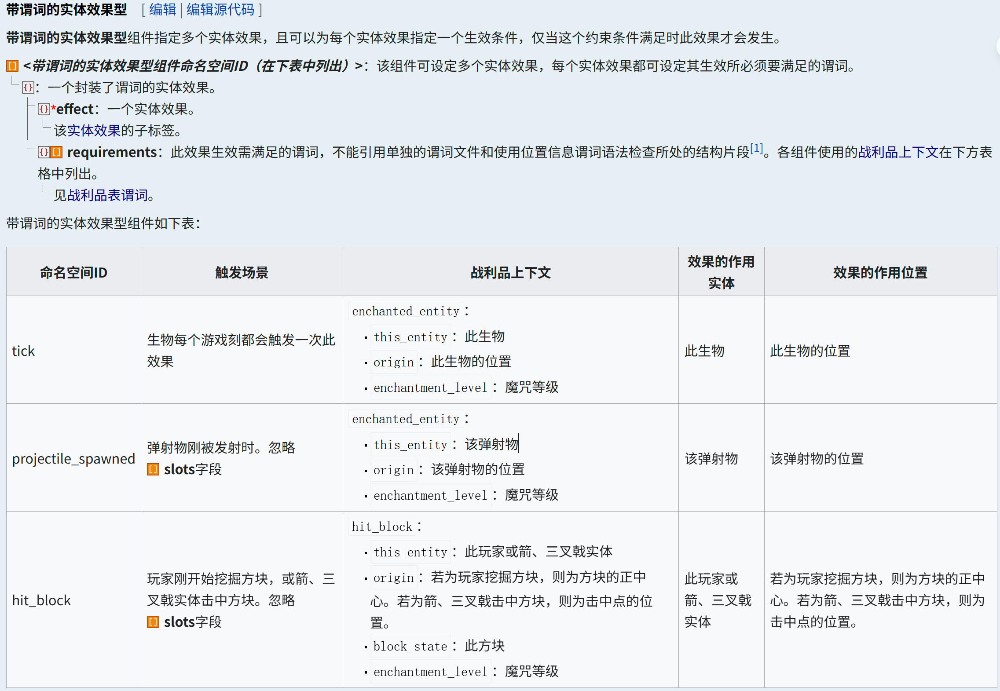

<FeatureHead
    title = 高版本如何更好的编辑自定义物品交互属性(触发器详解)
    authorName = 七柏
    avatarUrl = '../../_authors/七柏.jpg'
    :socialLinks="[
        { name: 'BiliBili', url: 'https://space.bilibili.com/405830542' }
    ]"
/>


## 引言

在原版 Minecraft 中添加自己创作的自定义物品, 一直是众多数据包玩家所热衷的事情. 向游戏内添加物品, 分为资源包和数据包两个部分. 其中资源包负责管理物品的模型和动画, 数据包负责管理物品的**交互特性**. 在较早的没有物品组件的版本中, 我们只能借助原版所提供的物品具有的特性对其进行 "改装" 以实现我们的目的, 得益于原版丰富的武器和工具体系, 在涉及攻击、挖掘等场景下(即左键交互), 由于攻击涉及实体交互, 有较为直接的监听手段, 但在方块交互监听上就显得有些无能为力. 在涉及到使用(即右键交互)时, 往往不尽如人意. 许多物品的使用存在消耗以及我们很难避免这部分**物品所承担的其他游戏机制**的体现, 这极大的限制了创作者创作自定义物品的自由度. 而随着高版本更新, 进度准则的更新和物品数据与魔咒组件化打破了长久以来的困扰, 使得创作者能够像拼积木一样简单地去组合物品组件与触发器来实现自己想要的功能. 

本文将从几个常用的物品组件与触发器出发, 引入**具体实例**来讲解如何在高版本从零创作一个自定义物品. 旨在引导开发者快速熟悉**属性**、**物品组件**、**进度**、**自定义魔咒**、**战利品表**、**战利品上下文**等内容, 综合多种使用情景方便创作者使用, 并引入一些**经验之谈**为创作者提供思路.

## A. 触发方式

首先, 我要在这里声明一点, 本文中所讨论的触发方式仅依赖于物品本身, 而**不涉及到交互实体触发**等类似的触发方式. 根据引言中的内容, 我们暂且将物品的交互方式分为**左键触发**、**右键触发**与**被动触发**三种, 考虑到篇幅问题, 本文仅对前两种触发进行讨论.

### 左键触发

由于原版监听方式仍然存在局限性, 对于物品左键交互效果的管理, 我们只能通过编辑物体**攻击**和**挖掘**两种交互情景下的交互效果. 

#### 攻击(实体交互)

攻击作用涉及到与实体的交互, 我们可以考虑利用实体相关的触发器, 截止当前最新版本(1.21.6-pre3), 和攻击实体相关的触发器有 :

| 类型 |                          命名空间ID                          |                             描述                             |
| :--: | :----------------------------------------------------------: | :----------------------------------------------------------: |
| 进度 | [`killed_by_arrow`](https://zh.minecraft.wiki/w/进度定义格式#killed_by_arrow) | [箭](https://zh.minecraft.wiki/w/箭)杀死实体后对发射箭的玩家触发 |
| 进度 | [`player_hurt_entity`](https://zh.minecraft.wiki/w/进度定义格式#player_hurt_entity) |                玩家伤害实体（包括自己）时触发                |
| 进度 | [`player_killed_entity`](https://zh.minecraft.wiki/w/进度定义格式#player_killed_entity) |                      玩家杀死实体时触发                      |
| 魔咒 | [`post_attack`](https://zh.minecraft.wiki/w/魔咒定义格式#带目标和谓词的实体效果型) | 攻击后触发此效果. 箭和风弹伤害非生物实体不触发. 爆炸伤害等不触发. |

假设我们现在有一个需求 : **为武器添加斩杀效果, 在击杀亡灵生物后给予玩家 5s 的迅捷 I 效果**.

- 使用进度触发器 : `player_killed_entity`

  直接的, 我们可以直接通过 `player_killed_entity` 进度监听到玩家杀死实体这一事件, 进而对玩家进行操作. 为了实现我们的需求, 我们需要在数据包的 `...\advancement\` 目录下写一个 json 文件作为触发器.

  观察 wiki 提供的触发器格式

  

  <details class="details custom-block">
      <summary>...\advancement\1.json</summary>
      <div class="language-mcfunction vp-adaptive-theme">
          <button title="Copy Code" class="copy"></button>
          <span class="lang">JSON</span>
          <pre class="shiki shiki-themes github-light github-dark vp-code" tabindex="0">
          <code>
  {
      "criteria": {	// 该进度的一系列准则
          "1":{	// 准则名称
              "trigger": "player_killed_entity",	// 触发器ID
              "conditions": {	// 通过该触发器所要满足的谓词
                  "entity": {	// 检查被杀死的实体
                      "type": "#undead"	// 类型是否满足亡灵生物
                  },
                  "killing_blow": {	// 检查伤害来源
                      "source_entity": {	// 检查伤害的来源实体
                          "equipment": {	// 检查实体身上的装备
                              "mainhand": {	// 检查主手槽位物品
                                  "predicates": {	// 检查实体的某个组件是否满足某种条件
                                      "custom_data": { // 检查自定义数据是否存在 "1": true
                                          "1": true
                                      }
                                  }
                              }
                          }
                      }
                  }
              }
          }
      },
      "rewards": {	// 奖励
          "function": "cit:1"	// 奖励函数
      }
  }
          </code>
          </pre>
      </div>
  </details>

  而后, 在奖励函数 `cit:1` 中写入如下内容来给予达成该触发器的玩家效果

  > 需要注意的是, 进度传递的**命令上下文**参数始终为**达成进度的玩家**以及其所处的位置. 因此在奖励函数中我们直接使用 @s.

  ```mcfunction
  # 撤销进度
  advancement revoke @s only cit:1
  # 给予玩家迅捷1效果持续5s
  effect give @s minecraft:speed 5 0
  ```

- 使用魔咒触发器 : `post_attack`

  我们通过在数据包的 `...\enchantment\` 路径下编辑一个 json 文件作为魔咒触发器.

  

  <details class="details custom-block">
      <summary>...\enchantment\1.json</summary>
      <p><em>魔咒触发器主要关注 effects</em></p>
      <div class="language-mcfunction vp-adaptive-theme">
          <button title="Copy Code" class="copy"></button>
          <span class="lang">JSON</span>
          <pre class="shiki shiki-themes github-light github-dark vp-code" tabindex="0">
          <code>
  {
      "anvil_cost": 2,	// （值≥0）合并魔咒时每一级魔咒对消耗经验等级的增加量
      "description": "斩杀",	// （文本组件）物品提示框中显示的魔咒名称
      "effects":  {	// 构成该魔咒的魔咒效果组件
          "post_attack": [{	// 触发器ID
              "effect": {	// 一个实体效果
                  "type": "apply_mob_effect",	// 若作用实体为生物，对其施加随机倍率、随机时长的状态效果
                  "to_apply": "minecraft:speed",	// 速度效果
                  "max_amplifier": 0,	// 最大倍率
                  "min_amplifier": 0,	// 最小倍率
                  "max_duration": 5,	// 最大时长
                  "min_duration": 5	// 最小时长
              },
              "affected": "attacker",	// 指定伤害的原发实体为效果作用对象
              "enchanted": "attacker",	// 该效果在攻击时触发
              "requirements": [{	// 通过该触发器所要满足的谓词
                  "condition": "entity_properties",	// 定义实体要满足的特征
                  "entity": "this",	// 受伤实体
                  "predicate": {	// 应用于实体的谓词
                      "type": "#undead",	// 类型是否满足亡灵生物
                      "nbt": "{Health:0.0f}"	// 是否死亡
                  }
              }]
          }]
      },
      "max_level": 1,	// 魔咒等级上限
      "max_cost": {	// 魔咒的最大修正附魔等级
          "base": 18,
          "per_level_above_first": 8
      },
      "min_cost": {	// 魔咒的最小修正附魔等级
          "base": 8,
          "per_level_above_first": 10
      },
      "slots": ["mainhand"],	// 在主手生效
      "supported_items": "#minecraft:enchantable/sword",	// 可通过铁砧附魔在剑上
      "weight": 5	// 附魔权重
  }
          </code>
          </pre>
      </div>
  </details>

#### 挖掘(方块交互)

与攻击行为不同的, 挖掘是与方块进行的交互. 同样的, 我们列出可用的触发器

| 类型 |                          命名空间ID                          |                             描述                             |
| :--: | :----------------------------------------------------------: | :----------------------------------------------------------: |
| 进度 | [`bee_nest_destroyed`](https://zh.minecraft.wiki/w/进度定义格式#bee_nest_destroyed) | 玩家破坏[蜂巢（方块）](https://zh.minecraft.wiki/w/蜂巢（方块）)或[蜂箱](https://zh.minecraft.wiki/w/蜂箱)时触发 |
| 魔咒 | [`hit_block`](https://zh.minecraft.wiki/w/魔咒定义格式#带谓词的实体效果型) |       玩家**刚开始挖掘方块**，或箭、三叉戟实体击中方块       |

可以发现, 对于左键与方块的交互事件游戏内提供的通用触发器有且仅有魔咒组件 `hit_block`, 且该组件只能在**刚开始挖掘**的瞬间触发. 

假设我们现有需求 : **写一个点石成金魔咒, 在使用附魔烈焰棒点击石头(stone)后会将其变为金矿石**.

使用魔咒触发器 : `hit_block`



<details class="details custom-block">
    <summary>...\enchantment\2.json</summary>
    <p><em>相关注释参考实例1-2</em></p>
    <div class="language-mcfunction vp-adaptive-theme">
        <button title="Copy Code" class="copy"></button>
        <span class="lang">JSON</span>
        <pre class="shiki shiki-themes github-light github-dark vp-code" tabindex="0">
        <code>
{
    "anvil_cost": 2,
    "description": "点石成金",
    "effects":  {
        "hit_block": [{
            "effect": {
                "type": "replace_block",
                "block_state": {
                    "type": "simple_state_provider",
                    "state": {
                        "Name": "minecraft:gold_ore"
                    }
                },
                "predicate": {
                    "type": "matching_blocks",
                    "blocks": "minecraft:stone"
                }
            }
        }]
    },
    "max_level": 1,
    "max_cost": {
        "base": 18,
        "per_level_above_first": 8
    },
    "min_cost": {
        "base": 8,
        "per_level_above_first": 10
    },
    "slots": ["mainhand"],
    "supported_items": "minecraft:blaze_rod",
    "weight": 5
}
        </code>
        </pre>
    </div>
</details>

在某些场景下, 我们可能需要监听挖掘事件的结束而非开始, 而游戏并没有提供直接的接口来监听该事件, 难道我们就没有办法了吗? 其实, 我们可以通过计分板读取游戏中关于方块挖掘的统计信息, 结合 tick 函数, 进而实现对挖掘结束的监听.

假设我们现有需求 : **玩家破坏一个刷怪笼后, 给予玩家 10s 的急迫 2 与力量 2**.

`load` 函数负责初始化计分板

```mcfunction
# 刷怪笼挖掘统计计分板
scoreboard objectives add _Spawner_ minecraft.mined:minecraft.spawner
```

`tick` 函数负责对玩家破坏刷怪笼的事件进行监听

```mcfunction
# 刷怪笼挖掘监听
execute as @a if score @s _Spawner_ matches 1 run function cit:2
```

`cit:2` 中执行奖励函数

```mcfunction
# 重置刷怪笼监听计分板
scoreboard players reset @s _Spawner_
# 给予破坏刷怪笼的玩家状态效果
effect give @s minecraft:haste 10 1
effect give @s minecraft:strength 10 1
```

但是这种方法仍然存在一定缺陷, 比如其不能传递被挖掘方块的坐标信息, 且不能对玩家使用的挖掘工具做出区分. 如果要解决这两个问题可以结合使用**方块战利品表**, 不过我们在此处不做详细展开.

### 右键触发

在上文中, 我们通过三个实例讨论了常见的左键触发器如何应用. 接下来, 我们将探讨物品右键触发的相关内容. 虽然右键触发在早期版本也是一个令人头疼的问题, 但得益于新版本物品堆叠组件的更新, 我们现在能**非常方便**的对物品的右键使用事件进行编辑.

与左键触发类似的, 其也有与实体和方块相关的交互类型, 具体实现可以类比上文讨论过的左键触发的几个实例. 区别的, 借助物品组件, 我们可以实现仅依赖物品本身做右键触发来实现一些功能, 常见的便是像枪械和法杖一类的道具.

假设我们现在有一需求 : **制作一个可以无限投掷的喷溅型伤害药水, 拥有 5s 的 cd**.

第一步, 我们需要创建关于该物品的战利品表

<details class="details custom-block">
    <summary>...\loot_table\3.json</summary>
    <div class="language-mcfunction vp-adaptive-theme">
        <button title="Copy Code" class="copy"></button>
        <span class="lang">JSON</span>
        <pre class="shiki shiki-themes github-light github-dark vp-code" tabindex="0">
        <code>
{
    "pools": [{	// 战利品随机池
        "entries": [{	// 抽取项
            "type": "item",	// 生成单一物品堆叠
            "name": "minecraft:splash_potion", // 喷溅型药水
            "functions": [{	// 物品修饰器
                "function": "minecraft:set_components",	// 设定物品组件
                "components": {	// 物品组件
                    "potion_contents": "strong_harming",	// 药水属性 : 瞬间伤害 II
                    "use_cooldown": {	// 使用冷却
                        "cooldown_group": "cit:3",	// 冷却组命名空间ID
                        "seconds": 5	// 冷却时间
                    },
                    "use_remainder": {	// 使用后返还物品
                        "id": "minecraft:splash_potion",	// 喷溅型药水
                        "components": {	// 物品组件
                            "potion_contents": "strong_harming",	// 药水属性 : 瞬间伤害 II
                            "custom_data": {	// 自定义数据
                                "infty": true,	// 无限标签(用于进度识别)
                                "id": "3"	// 战利品表ID(用于宏调用战利品表修饰)
                            }
                        }
                    }
                }
            }]
        }],
        "rolls": 1	// 抽取次数
    }]
}
        </code>
        </pre>
    </div>
</details>

对上述战利品表文件进行拆解, 我们关注的物品组件主要有三部分, 分别为 :

1. 使用冷却 (`use_cooldown`)
2. 使用后返还物品 (`use_remainder`)
3. 其他组件 (`potion_contents` 等)

其中**使用后返还物品**内的物品信息应保证物品**纹理**、**命名**、**修饰**等的一致, 这保证了物品在右键使用时的流畅性, 而其余功能性组件不必写入. 其次, 应为过渡物品添加一个特征性修饰用于进度触发器的读取, 本例中采用 `custom_data: {infty: 1b}`, 以及物品本身的战利品表ID, 这将在后续步骤中使用宏对过渡物品进行更新时作为参数使用. 而 `use_cooldown` 及其他组件作为独立的功能单元, 不参与后续物品更新.

在物品设计好后, 我们需要选取一个触发器来监听物品的使用事件, 以及考虑到部分物品的消耗性使用(如本案例中的喷溅型药水), 我们需要对其进行更新重置. 下面我将列出三种常用的监听物品使用的触发器

| 类型 |                          命名空间ID                          |                             描述                             |
| :--: | :----------------------------------------------------------: | :----------------------------------------------------------: |
| 进度 | [consume_item](https://zh.minecraft.wiki/w/进度定义格式#consume_item) | 玩家消耗了带有`consumable`[组件](https://zh.minecraft.wiki/w/组件)的物品后触发 |
| 进度 | [inventory_changed](https://zh.minecraft.wiki/w/进度定义格式#inventory_changed) |  玩家[物品栏](https://zh.minecraft.wiki/w/物品栏)变化时触发  |
| 进度 | [using_item](https://zh.minecraft.wiki/w/进度定义格式#using_item) | 玩家使用“可持续使用”的物品时，每[游戏刻](https://zh.minecraft.wiki/w/游戏刻)触发一次 |

让我们首先讨论在预先假设的需求下, 哪种触发器更适合我们, 后续我们会对剩下两种触发器的优劣及其适用情景做展开说明.

首先, 对于需求中所使用的喷溅型药水, 其中并无 `consumable` 组件, 因此 `consume_item` 用来做触发器显然不合适, 且由于喷溅药水不属于 "可持续使用" 类型的物品, 因此 `using_item` 组件也不能用在我们当下的需求中, 经考量, 我们最终选择 `inventory_changed` 作为我们的触发器. 经测试(1.21.3), **进度读取物品栏变化是晚于 `use_remainder` 组件对物品的更新**, 因此自然的, 我们可以通过 `inventory_changed` 监听到物品的更新, 并在调用函数中将过渡物品的参数传递给宏进而对物品数据进行更新重置.

有了以上思路, 我们便能很简单的实现物品更新逻辑. 让我们创建进度文件来监听物品的使用.


~~主要是调用玩家谓词, 感觉这张图也不很必要.~~

<details class="details custom-block">
    <summary>...\advancement\3.json</summary>
    <div class="language-mcfunction vp-adaptive-theme">
        <button title="Copy Code" class="copy"></button>
        <span class="lang">JSON</span>
        <pre class="shiki shiki-themes github-light github-dark vp-code" tabindex="0">
        <code>
{
    "criteria": {	// 该进度的一系列准则
        "3": {	// 准则名称
            "trigger": "minecraft:inventory_changed",	// 触发器ID
            "conditions": {	// 通过该触发器所要满足的谓词
                "player": {	// 达成进度玩家要满足的条件
                    "equipment": {	// 检查装备
                        "mainhand": {	// 检查主手物品
                            "predicates": {	// 检查组件中是否存在下文内容
                                "custom_data": {"infty": true}	// 特征修饰
                            }
                        }
                    }
                }
            }
        }
    },
    "rewards": {"function": "cit:3/main"}	// 奖励函数
}
        </code>
        </pre>
    </div>
</details>

创建函数更新物品数据

```mcfunction
#> ...\function\3\main.mcfunction

# 撤销进度
advancement revoke @s only cit:3
# 重置物品数据
function cit:3/reload with entity @s SelectedItem.components."minecraft:custom_data"
```

```mcfunction
#> ...\function\3\reload.mcfunction

#调用战利品表重置物品数据
$loot replace entity @s weapon.mainhand loot cit:$(id)
```

至此, 我们完成了无限药水的一整个逻辑闭环. 关于这种方式实现物品更新的优点, 我认为主要有以下几点 :

1. 物品数据可以在 1tick 内完成更新(详见下文);
2. 过渡物品的数据完全与操作物品独立开;
3. 更新战利品表后下一次使用物品也会被即刻更新.


接下来, 针对 `consume_item` 和 `using_item` 两种触发器, 在此做简要说明

#### `consume_item`触发器说明

`consume_item` - 玩家消耗了带有`consumable`[组件](https://zh.minecraft.wiki/w/组件)的物品后触发.

**适用情景** : 存在需要读取原物品数据 (多读取 `custom_data` 中的内容) 时, 可以和 `inventory_changed` 结合使用, 前者负责传递数据给函数用于实现更多功能, 后者用于更新物品数据.

**缺陷** : 不能配合原版中默认的物品(如食物、药水等不包含 `consumable` 组件但仍有消耗性行为的物品)使用, 且仅用该组件对物品更新不能在 **1tick** 内实现.


> 上图是使用 `inventory_changed` 触发器在暂停游戏刻下读到的使用前和使用后物品的数据, 可以发现其数据在 1tick 内就已完成更新.

#### `using_item`触发器说明

`using_item` - 玩家使用“可持续使用”的物品（详见下文）时，每[游戏刻](https://zh.minecraft.wiki/w/游戏刻)触发一次

**适用场景** : 对于使用时间很长(我们认为是无穷)的物品可以结合计分板使用, 利用分数实现不同的释放效果, 但不适用于上文所提到的消耗更新所使用的物品.

**缺陷** : 由于其 tick 执行的性质, 在和消耗更新物品一起使用会招致一些奇奇怪怪的 bug (考虑是微时序的原因).

## B. 关于自定义物品的一些建议

> 这里的内容没有很多, 就随便写了.

### 关于模板物品的选取

> 理想的模板物品是**追溯指针**.

数据包并不能实际地向游戏中注册一个物品, 我们在创作自定义物品时便需要根据使用情景, 选取一种除了自己想要的属性外基本没有别的交互性内容的物品, 这里的交互包括 : 与方块的交互事件(比如书与雕文书架, 以及方块的放置事件), 合成事件(物品是某个高级物品的合成材料, 被误合成吞掉), 与生物的交互事件(胡萝卜钓竿会吸引猪, 如果我们用其为模板制作枪械, 这显然不是我们想要的结果).

很多玩家在考虑这方面的时候会倾向于在**管理员物品**中找一个合适的, 但很遗憾的是, 管理员物品中也没有完全无交互行为的物品. 之前看到有些玩家会选取**烟火之星**作为模板物品, 我也没有很想明白.

那么我们就真的找不到一个理想的模板物品了吗? 其实不然, 经过对 wiki 的物品界面干瞪眼瞅半天, 还真给我找到一个物品, 那就是**追溯指针(recovery_compass)**. 这个在 1.19 中被加入的小玩意简直就是天选的模板物品, 其不仅没有任何的交互事件, 也不能参与到任何物品的合成中去, 而且, 这个物品完全没有任何的附加数据! 不选它, 那我实在想不到别的物品有什么价值了.

## C. 碎碎念

群里吹水时发现群u在做无限使用的物品就摸了, 本来只想写右键触发来着, 但是看有人写过类似的就展开说说. 关于被动触发的内容... 嗯, 因为内容有点多, 就摆了.

在写这篇文章的过程中还有想过一些事, 就是能不能将这些触发情景抽象一下, 然后归纳一个普适方法塞进数据包里去方便玩家创建自定义物品. 嗯... 就我个人而言, 是不太有什么精力去写这种包, 所以就想想吧.

---
## 附录
[附加实例地图](/feature/archive/202506/_assets/附加实例地图.zip)