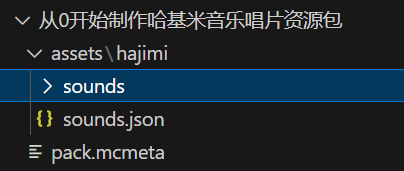

<FeatureHead
    title = '从0开始制作哈基米音乐唱片数据包'
    authorName = 水上的星星
    avatarUrl = '../../_authors/水上的星星.jpg'
    :socialLinks="[
        { name: 'BiliBili', url: 'https://space.bilibili.com/109317273' }
    ]"
/>

***
## 1 - 制作唱片资源包  

### 1.0 - 获取音频和封面  
想要播放带劲的哈基米音乐，首先肯定要从获取音乐开始  
前往bilibili（*使用JJdownload*）或者其他网站下载相关视频或者音频  
将其转换为MC可识别的ogg格式（*使用格式工厂或者ffmpeg*）  


**注意：**  *如果你不想要颅内播放（即播放音量会随着与音源的距离增加而衰减），请记得将音频转换成哈基米能够识别的单声道*  

接下来，前往伟大的 PhotoShop、PS或者绘图 画一个资源包封面（大小为512*512，格式为png）  

***
### 1.1 - 获取Vscode插件 和 新建文件夹  

打开你的Vscode，点击左侧的 **扩展** 按钮  


搜索datapack，找到名为 **Datapack Helper Plus by Spyglass**（以下简写为DHP） 的扩展并且安装！ 


数据包插件就绪，音频文件就绪，封面贴图就绪  

让我们开始为材质包新建文件夹并配置资源包参数  

让我们的目光回到 **资源管理器** ，在工作区内右键，选择新建文件夹，给他一个 **充满爱** 的名字  


接着，在这个 *哈基米音乐资源包文件夹* 内新建并 **重命名** 以下文件/文件夹  

  

其中，**pack.mcmeta** 为资源包的介绍文件，其中包含了资源包的版本信息和描述  

向其中写入以下内容
```
{
    "pack": {
        "description": "A hajimi music disc resource pack",
        "pack_format": 61
    }
}
```
来看看其中的键名  

+ description - 资源包的描述，向小哈基米们介绍资源包是用来干什么的  
+ pack_format - 资源包的版本，具体数值可以查阅wiki获得

如果你有资源包封面，请放置在你最喜欢的资源包文件夹内并重命名为 **pack.png**  
~~假装我有哈基米的图片~~  

接下来，瞄准我们的 *assets* 文件夹，在其内部新建我们的资源包 *命名空间* 文件夹  

  

记住这个名为 hajimi 的文件夹，我们后续的操作大多会围绕 hajimi —— 这个大家都喜欢的 <命名空间> 展开  

回到我们最喜欢的操作： 新建文件和文件夹上  
继续新建以下文件及文件夹  

  

接着，把哈基米音乐放入  *sounds*  件夹内，为了区分各种各样的哈基米，这里我将音乐文件命名为 **hajimisic.ogg**  

  

新建操作到这里就暂时结束了，果咩得多，你已经学会了如何制作一个资源包（向游戏内添加更多音效），下面将正式进入数据包哈气教学  

***
### 1.2 - 定义声音事件

查阅wiki上 **资源包** 页面  
得到以下信息  

  

其中， *sounds* 文件夹是存放我们的哈基米音乐文件的文件夹， **sounds.json** 文件则是告诉 MC 我们有这样的音乐，他的名字 **键名** 是什么，该播放哪个音乐文件（或者调用哪个音乐事件）  

查阅wiki，关于 **sounds.json** 得到以下信息  

  

相信聪明的你肯定看懂了 ~~聪明的哈基米已经开始哈气了~~ ，什么？没看懂？没关系，我们要用到的只有 sounds 这个 json数组 下的 name、stream以及 subtitle *（可选）*  

打开我们的 **sounds.json**，天啊这里怎么一个哈基米都没有，让我们添加可以哈气的内容！  

还记得刚刚在wiki中学到的格式吗？不记得了？你这哈基米...  
果然还是要手把手才能教会吗？  

那么就键入以下内容  
```json
{
  "disc.hajimisic": {
    "sounds": [
      {
        "name": "hajimi:hajimisic",
        "stream": true
      }
    ],
    "subtitle": "哈基米：哈气"
  }
}
```
看懂了吗？  
这样我们就定义了一个名为 `hajimi:disc.hajimisic` 的音乐事件，其中 **hajimi** 是资源包的命名空间， **disc.hajimisic** 是声音事件名称，这个音乐事件调用了位于hajimi这个资源包下的，名为hajimisic的音乐文件，在调用时会有字幕（玩家屏幕左下角的那个）*哈基米：哈气* 出现  

此处存在的各类键名有以下功能  

+ disc.hajimisic - 声音事件的“名字”，我们在使用的时候会用到他  
+ sounds - 所调用的声音，即我们的声音事件包含哪些“发声内容/发声单元”  
+ name - 发声内容的“名字”  
+ stream - 流媒体播放，因为我们的音频文件的播放时长过长（通常认为60s+的音频是长音频），我们的 *哈气* 音频有足足的99秒！所以这一项填写true（如果你的音频是短音频则可以不填写该项）  
+ subtitle - 在播放音频时，游戏内右下角的字幕提示内容（例如 羊：吃草）  

进行到这里，恭喜你已经迈出了哈气的第一步，接下来，是如何在游戏内使用数据包调用这个资源包  

准备好了吗？让我们保持哈气！  

## 2 - 制作唱片数据包

伟大的 Mojang 让我们定义了声音事件，神说：要定义第二遍  

于是众信徒 ~~数据包作者们~~ 便要对同一个声音事件定义两遍  

***
### 2.1 - 新建文件夹？新建文件夹  

不再赘述更多，查阅wiki可得以下文件结构：  


除开数据包元素外（**pack.mcmeta**数据包信息，**pack.png**数据包图标）  

对于数据包信息（**pack.mcmeta**），查阅wiki并猛猛哈气可得 ~~还是假装我已经有数据包封面图了~~  

```
{
    "pack": {
        "description": "A hajimi music disc datapack",
        "pack_format": 61
    }
}
```
很眼熟对吗？结构和资源包一模一样！ 
如果你忘了，让我们再来看看其中的键名  

+ description - 数据包的描述，向小哈基米们介绍数据包是用来干什么的  
+ pack_format - 数据包的版本，具体数值可以查阅wiki获得

此外，易得 **jukebox_song** 是需要重点 **哈气** 的对象  
果断新建！ *（记得哈气）*  


***
### 2.2 - 定义唱片机曲目

再再前往wiki查阅 jukebox_song 词条 ~~为什么Vscode不能内置wiki？~~  

  

怎么这么多是必选词条？写！（此处命名为**hajimi_song.json**）  

```json
{
  "comparator_output": 0,
  "description": "哈基米想要哈气",
  "length_in_seconds": 99.0,
  "sound_event": {
    "sound_id": "hajimi:disc.hajimisic"
  }
}
```

好！写完了！来看看参数。  

+ comparator_output 红石输出强度？跟哈气没关系，不用管  
+ description 播放曲目名称？就写歌名就行  
+ length_in_seconds 音频长度？就是音频长度（单位：秒）  
+ sound_event 声音事件？声音事件！  


还记得在 [1.2 - 定义声音事件](#1.2 - 定义声音事件 ) 中的那个 **声音事件** 吗？我们要引用的声音id就是那个！`hajimi:disc.hajimisic` 填入！

声音事件id为 `hajimi:disc.hajimisic` ，可以用/playsound 向玩家播放，而唱片曲目id为 `hajimidatapack:hajimi_song`  

为了方便管理与编写更多的哈基米 **请将所有同曲目的相关命名修改为统一的hajimi** ，这里只是为了演示各个不同的哈基米而使用了不同的命名方式

最后再来看看数据包的结构  

  

是不是非常的简单呢？  

数据包写到这里就结束了  
但是所有的哈气就此为止了吗？还没有！  

***
### 2.3 - 在游戏内调用自定义唱片  

伟大的 Mojang 在信徒们历经了千辛万苦后，又说：声音事件，定义三次  
于是众信徒们都疯了...  

现在万事具备，只差在游戏里引用这个唱片曲目了，如何做呢？  
还是查wiki！（向伟大的wiki之神致意）  

在 **数据组件** 词条中，有这么一个组件 **jukebox_playable** （于24w21a更新）  

  

看着就觉得很好写！

```mcfunction
#1.21.4
give @s diamond[jukebox_playable={song:"hajimidatapack:hajimi_song"}] 1
```
```mcfunction
#1.21.5
give @s diamond[jukebox_playable="hajimidatapack:hajimi_song"] 1
```
给自己一颗可以播放 `hajimidatapack:hajimi_song` 的钻石！  

这是给你自己的，感谢你能够跟着一起哈气到这里！  