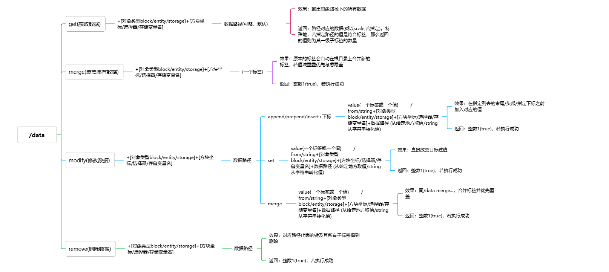

<FeatureHead
    title = '数据包の究极存值原理——什么是SNBT'
    authorName = xiaou0
    avatarUrl = '../../_authors/xiaou0.jpg'
    :socialLinks="[
        { name: 'BiliBili', url: 'https://space.bilibili.com/1998573191' }
    ]"
/>


*本教程为数据包存储复合变量方法的深入浅出保姆级教程(by xiaou0)*


既然要引入数值标签的概念，那么还是得先稍微速通一遍BE玩家最羡慕的`/data`指令。


`/data`的语法结构，先是由两个枚举子命令组成：

````
/data +	get		+	block	+	...
		merge		entity
		modify		storage
		remove
````

其中第一层枚举`{get,merge,modify,remove}`表明了你要进行的操作，第二层枚举`{block,entity,storage}`表明了你要进行操作的对象。

先抛开第一层枚举不管，先来解释一下第二层枚举的意义，即

## 那些地方可以存标签?

### block——方块实体

方块实体是游戏中的一种概念，指代的是拥有实体标签的方块，这里先不细究实体标签和非实体状态的区别（你大概知道一个是用`{}`装，另一个是用`[]`装就行了）

例如. 箱子、漏斗、命令方块就是常见的具有「方块实体」这一性质的方块——没错，我更偏向于将方块实体描述为一类方块本身具有的性质，而不是通俗的一类方块，两种描述亦有微妙的差异。

### entity——实体

实体，通俗点来说，就是可以被`/kill`的对象，据我所知所有实体都是带有实体标签的（如有反例欢迎指出）。

例如. 玩家、牛、僵尸、弓箭、展示实体。

### storage——存储

存储，与前两个相比更为直观，实际上，`storage`里的标签就可以视为存档的全局变量，亦是在储值时最优先考虑的存储位置。

同时，`storage`有着最宽泛的存储条件：你可以在根标签里插入任何值，不像实体，若想插入自定义数据只能在`data`子标签下进行。

存储位置会在第一次访问时被定义，因此无需担心对象定义的问题。


介绍完了在哪存数据之后，介绍数据的存储方法就方便很多了，一般的语法[WIKI](https://zh.minecraft.wiki/w/%E5%91%BD%E4%BB%A4/data?variant=zh-cn)上都有注明，这里只进行精简干练的叙述：




那么到这里，有关`/data`语法的部分就讲的差不多了，如果你仍然不理解其中的一些术语，放心，当你读完整篇后再回来看就能大彻大悟了。

## 什么是键值对(Key-Value Pair)和SNBT(Stringified Named Binary Tag)

关于键值对，[萌茶的视频](https://www.bilibili.com/video/BV1fXV8zvEj8/?spm_id_from=333.337.search-card.all.click&vd_source=a379beb1b990fd565e14f375abf970ea)里有非常详细的说明，这里我做几点补充：

MC里的键值对，冒号前的**键名**部分可以是朴素文本`a:1d`，也可以是引号括起来的字符串`"b":2f,'c':"xiaou0"`,两种叙事方式基本等价，唯一的不同是当键名中有个别符号(比如`:`)时就需要打上引号，避免歧义。

### 那么什么是SNBT

当然，如果你希望系统地学习数据包，JSON绝对是必修课之一，而JSON的格式和SNBT有着异曲同工之妙（[JSON教程移步此处](https://www.runoob.com/json/json-tutorial.html)）

简单地来说，SNBT里一共有3个截然不同的概念：

#### 单值结构

​	SNBT里最基本的结构，由一个单值表示——这个单值可以是以下类型：

​	字节型(`-b`)：-128到127的之间的整数（`= 8 bit = 1 byte`）

​	无符号字节型(`-ub`)：0到255的整数（`= 8 bit = 1 byte`）

​	短整型(`-s`)：-32768到32762的整数（`= 16 byte`）

​	无符号短整型(`-us`)：0到65535的整数（`= 16 byte`）

​	整型(`i`或无特别指定符号)：$[-2^{31},2^{31}-1]$中的整数（`= 32 byte`）

​	无符号整型(`ui`)：$[0,2^{32}-1]$中的整数（`= 32 byte`）

​	长整型(`l`)：$[-2^{63},2^{63}-1]$中的整数（`= 64 byte`）

​	无符号长整型(`ul`)：$[0,2^{64}-1]$中的整数（`= 64 byte`）

​	单精度浮点型(`f`)：不超过`32 byte`的有理数

​	双精度浮点型(`d`)：不超过`64 byte`的有理数

​	字符串(`""或''`)：一个由Unicode字符组成的字符串

​	客观地说，字符串也被归为线性结构，然而MC中的字符串不支持下标访问，因而归为单值

> 编辑的话：mc的字符串可以使用string子命令进行下标访问。

#### 线性结构

​	由多个同级值与标签组成的结构。

​	SNBT里的线性结构有以下两种：

​	**键值集**，由`{}`标识，由多个同级元素组成的集合，注意因为是集合，所以是无序的，而列表是有序的。

​	建值集的的每个用逗号隔开的值称为建值集的**元素**。

​	建值集的键名必须满足唯一性，即一个键只能对应一个值。

​	因此，建值集里的值可以用键名唯一表示，如`set:{a:1,b:2}`中，`set.a`就表示`a`的值，即为2，注意键名之间用点`.`隔开。

​	**列表**，本质上就是java里的List数组，他支持$O(1)$的下标访问，以及$O(n)$的元素查找，对应到SNBT里，就是那些被中括号`[]`括起来的东西。

​	列表中的每个用逗号隔开的值称为列表的**元素**。

​	在最新版本中，列表的类型限制被解除，列表的元素可以是不同的类型，或者不同结构的子标签。

​	（这也导致`{}`复合标签和列表的差距进一步减小，而列表相当于符合标签有一个优势，即有序性）

​	在列表中，所有元素按顺序排成一列并拥有标号，这个标号一般称作**下标**，值得注意的是下标的取值范围为$[0,n-1]$而非$[1,n]$，其中n是元素个数。

​	例如，在列表`list:["a","b","c"]`中，`list[0]`对应的值为`"a"`，`list[1]`对应的值为`"b"`，`list[2]`对应的值为`"c"`

​	特别地，有规定类型的列表，写法一般为`[I;...]`其中`I`代表了整型，若要替换成其他类型同理。

​	列表还支持键值访问，前提是该键值指向唯一的标签，例如`list:[{name:"a",age:1},{name:"b",age:2}]`中，`list[{name:"a"}]`指向的标签就是`{name:"a",age:1}`这一整个标签。

**复合结构**

​	我想举个例子，SNBT标签（注：真实写的时候没有换行和缩进，若要进行换行数据包里需要打出`\`来提示）

```snbt
{
	name:"_u0_",
	age:16,
	friends:[
		{name:"u_0_",age:114514},
		{name:"u0___",age:1919810},
		{name:"TheColdPot",age:15}
	]
}
```

​	总能清晰地写成树的形式：


​	到这一步，我们算是正式揭发了SNBT的本质：他就是由带有键名的边组成的一颗**有根树**。

​	我们定义**同级**的概念，即拥有相同的“**父亲**”标签的两个子标签同级。

​	不难发现，同级的元素都呈线性结构，而这种多种结构通过类似树的“父子”关系连接起来的结构，就是复合结构。

​	了解了复合结构后，我们不妨考虑如何取复合标签的值？

​	很简单，因为每个子结构的每个键名都有唯一确值，通过归纳法可以证明，唯一的键名组合就能确定树上唯一的值。

​	对应到字符串形式的SNBT里，你只需要找到对应值之前所有的键名（或列表下标），然后把他们“叠buff”叠起来就行了——

​	例如，我想知道冷锅酱的年龄，那么我们先定位到他在复合结构里的位置：


然后自底向上找到其到根节点的路径：


那么显而易见，`friends[2].age`就是我们要找的键名。


### 一些杂碎但你可能想要知道的知识：

1. 符合结构在维护时，其复杂度很高程度地被其“树的深度”影响，因此在对于键值较少的情况：

   如`list:[{a:1,b:2},{a:2,b:3}]`，写成`lista:[1,2],listb[2,3]`更宜。

2. 在使用`/execute if`进行数据匹配时，只会匹配给定一条路径上的值，特别地，如果值是一个列表，他只会在目标列表进行有序匹配。

3. 小u0真的16岁

### 一些链接

- [u0の主页](https://space.bilibili.com/1998573191)
- [大佬萌茶の主页](https://space.bilibili.com/320500029)
- [冷锅の主页](https://space.bilibili.com/521345404)
- [wiki/data](https://zh.minecraft.wiki/w/%E5%91%BD%E4%BB%A4/data?variant=zh-cn)
- [wiki/execute](https://zh.minecraft.wiki/w/%E5%91%BD%E4%BB%A4/execute)
- [JSON教程](https://www.runoob.com/json/json-tutorial.html)
- [树-OIwiki](https://oi-wiki.org/graph/tree-basic/)
