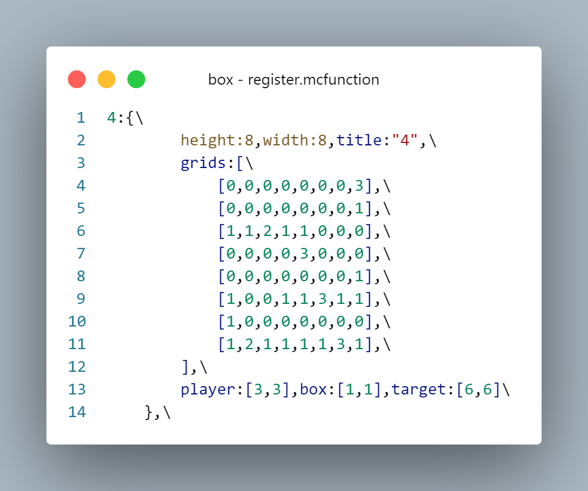
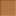
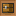

<FeatureHead
    title = 使用对话框制作2D小游戏
    authorName = CR_019
    avatarUrl = '../../_authors/cr_019.jpg'
    :socialLinks="[
        { name: 'BiliBili', url: 'https://space.bilibili.com/85292644' }
    ]"
    cover='../_assets/dust_8.png'
/>

## 引言
在25w20a中，mojang引入了对话框的定义，允许玩家自定义类似暂停界面的对话框。因此我就想到，是否可以用对话框做2D小游戏，类似推箱子一类的，并且进行了一些实践。下面是我的研究成果。

::: tip
本篇我们不会拘泥于dialog的语法部分，而是侧重于讲解实现思路和需要注意的技术细节。想要零基础入手对话框的读者可以去wiki查看，或搜索其他教程。
:::

## 后端准备
我们以我制作的推箱子小游戏为例。游戏逻辑处理部分不是本篇文章的重点，在此略过；  
后端的工作应该做到：在反馈前端对话框的操作后，将当前的游戏状态按照要求存储到指定的storage里，以方便前端对话框读取和展示。在推箱子这个小游戏下，我们可以把固定的地图存储为一个二维的列表，玩家可移动区域记为0，障碍物区域记为1；然后将可变的玩家、箱子、目标点分别用2元列表存储，以供对话框部分处理。



## 动态的对话框
接下来我们着重了解对话框的部分。mj提供的注册方法是，使用json格式在dialog文件夹里定义。这种方式没有任何动态可言，而且不能用reload重新加载，因此我们只使用它做标题界面这种固定的界面。  
而游玩的界面，因为需要动态显示玩家和箱子的当前位置，需要动态读取数据，因此不能使用预先注册的对话框。好在，mj在dialog指令中加入了内联对话框的支持，也就是说我们直接在命令后面接上一个符合要求的对话框参数，也可以直接生成一个对话框。结合函数宏，我们便可以实时读取游戏当前的状态显示了。

为图方便，我们可以把完整的对话框格式写进storage里，然后将其作为一整个宏参数传入命令中。

```mcfunction
$dialog show @s $(dialog)
```

接下来，我们把对话框不变的部分先预先插入storage里：

```mcfunction
data modify storage minecraft:box dialogs.dialog set value {\
    "type":"multi_action",\
    "title": "推箱子",\
    "pause":false,\
    "after_action":"none",\
    "body":[\
        {\
            "type": "plain_message",\
            "width": 300,\
            "contents": []\
        }\
    ],\
    "columns":3,\
    "actions":[\
        ...\
    ]\
}
```

其中actions的按钮部分会在下一部分详解，在此先省略。  
由于我们需要监听按钮处理，因此我们把pause设为false，防止对话框暂停游戏；  
同时默认的按钮行为会关闭对话框，这会导致鼠标光标重置到屏幕中心，并且会导致闪屏，非常影响体验，所以我们要修改默认的按钮行为为none，不做多余的操作。  
注意到目前body部分，也就是显示文字的部分是空的，因为我们接下来需要动态的读取上面提到的地图信息，把地形和玩家位置显示出来。

```mcfunction
function lay:macro/list/init {list:"storage box gameplay.level_dat.grids",func:"x:dialog/level/list1"}
```

这是我自己写的列表遍历宏前置，用途是遍历指定的列表并且将列表的一项作为宏参数传入指定的函数中。我们继续看其中引用的这个函数：

x/function/dialog/level/list1:

```mcfunction
$data modify storage box dialogs.temp.grids set value $(value)

data modify storage minecraft:box dialogs.dialog.body[0].contents append value {"text":"\n\n","font":"box:box","shadow_color":[0,0,0,0],"extra": []}

function lay:macro/list/init {list:"storage box dialogs.temp.grids",func:"x:dialog/level/fill_grids"}
```
x/function/dialog/level/fill_grids:

```mcfunction
$scoreboard players set #grid box_temp $(value)

execute if score #grid box_temp matches 0 run data modify storage box dialogs.dialog.body[0].contents[-1].extra append value {"text":"\u0001\u0020"}
execute if score #grid box_temp matches 1 run data modify storage box dialogs.dialog.body[0].contents[-1].extra append value {"text":"\u0002\u0020"}
```

因为是二维列表，因此使用了两层遍历，首先在列表中加上一行，设定好使用的字体等格式，然后在第二层遍历中，获取每一个坐标的信息，显示对应的字体。  

 

特别的，`\u0020`是设定的负空格字符，用于消除默认字符间的缝隙，将字符图片拼合在一起。  
而纵向的行距目前无法更改，因此网格单元的高度是设定好的，为两倍的行距，这样可以用两个换行符使得网格在纵向上无缝拼合。

接下来我们读取玩家、箱子等的坐标，将它们显示在地图上：

```mcfunction
function x:dialog/level/icons with storage box gameplay.pos
```

x/function/dialog/level/icons:

```mcfunction
$data modify storage box dialogs.dialog.body[0].contents[$(target_y)].extra[$(target_x)] set value "\u0013\u0020"
$data modify storage box dialogs.dialog.body[0].contents[$(player_y)].extra[$(player_x)] set value "\u0011\u0020"
$data modify storage box dialogs.dialog.body[0].contents[$(box_y)].extra[$(box_x)] set value "\u0012\u0020"
```

为了简单处理，玩家和箱子这类的字符图片是包括了下面的网格的，这样我们只需要读取这些图标的位置，然后找到对应的坐标直接替换即可。



这样我们只需要每次刷新时，执行这个level函数，就能实时读取游戏的当前状态，显示在对话框上了。

## 按钮和路由
解决了显示的问题，我们来看一下操作的问题。  
在游戏界面里，我们需要按下方的方向键进行移动；  
此外，我们还需要在首页、选关界面、游玩界面之间跳转。  
这些操作实际上并无太大区别，都是点击按钮后触发一个命令。因此我们放在一起讲解。

由于mj的限制，执行带权限的指令需要二次确认（会跳出一个弹窗），这在需要经常操作的小游戏中无疑是无法接受的。因此我们需要使用权限等级0的trigger指令来间接触发。  

> 在较新版本入坑命令的玩家可能已经不知道trigger是什么了，其实我在制作这个小游戏之前也对它一无所知。简单来说，trigger是一类特殊的计分板准则，在被激活后，可以用/trigger指令修改它的值。然后数据包可以像检测其他计分板接口一样轮询它的值的变化触发一些指令。

我们来看一下刚才省略的level函数的actions部分：

```snbt
    "actions":[\
        {\
            "label":"",\
            "width":50,\
            "action": {\
                "type": "run_command",\
                "command": "trigger box_trigger"\
            }\
        },\
        {\
            "label":"↑",\
            "width":50,\
            "action": {\
                "type": "run_command",\
                "command": "trigger box_operation set 1"\
            }\
        },\
        {\
            "label":"",\
            "width":50,\
            "action": {\
                "type": "run_command",\
                "command": "trigger box_trigger"\
            }\
        },\
        {\
            "label":"←",\
            "width":50,\
            "action": {\
                "type": "run_command",\
                "command": "trigger box_operation set 2"\
            }\
        },\
        {\
            "label":"↓",\
            "width":50,\
            "action": {\
                "type": "run_command",\
                "command": "trigger box_operation set 3"\
            }\
        },\
        {\
            "label":"→",\
            "width":50,\
            "action": {\
                "type": "run_command",\
                "command": "trigger box_operation set 4"\
            }\
        },\
        {\
            "label":"返回选关",\
            "width":50,\
            "action": {\
                "type": "run_command",\
                "command": "trigger box_clicks set 1"\
            }\
        },\
        {\
            "label":"重置",\
            "width":50,\
            "action": {\
                "type": "run_command",\
                "command": "trigger box_operation set 5"\
            }\
        },\
        {\
            "label":"",\
            "width":50,\
            "action": {\
                "type": "run_command",\
                "command": "trigger box_trigger"\
            }\
        },\
    ]\
```

我这里使用了box_trigger和box_operation两个计分板，实际上可以合并为一个。前者是不进行任何操作，显示游玩界面，在现版本可以省略了。  
box_operation是游戏操作相关的计分板，每一个数值对应一个操作，我们来看一下tick函数中相关的部分：

```mcfunction
execute as @a if score @s box_operation matches 1.. run function x:gameplay/operation
scoreboard players enable @a box_operation
```

x/function/gameplay/operation:

```mcfunction
execute unless score @s box_success matches 1 if score @s box_operation matches 1 run function x:operation/up
execute unless score @s box_success matches 1 if score @s box_operation matches 2 run function x:operation/left
execute unless score @s box_success matches 1 if score @s box_operation matches 3 run function x:operation/down
execute unless score @s box_success matches 1 if score @s box_operation matches 4 run function x:operation/right

execute if score @s box_operation matches 5 run function x:gameplay/start

function x:gameplay/success

scoreboard players set @s box_operation 0
function x:dialog/level
```

基本的逻辑是：检测计分板分数并执行对应操作的函数，然后重置计分板，最后刷新对话框。  
当然这里还有一个成功判定，就不详细展开了。

选关界面的路由的基本逻辑也是一样的，只不过我需要方便的添加新的关卡，于是加入了宏来实现更加动态的操作。感兴趣的可以拆包研究一下。

## 结语

使用设定上静态的对话框来制作动态的小游戏确实是一个很有意思的实践，其中的很多破坏体验的毒点在1.21.6 pre1中也基本上得到了解决，目前已经是相当可用的状态了。  
不过对话框的排版还是比较的受限制，行距不能更改，按钮布局中每行有几个按钮不能自由设定，还是有一些局限性。不过现在文本组件也能拥有点击事件了，希望之后能看到完全使用文本组件排版的对话框内容吧。