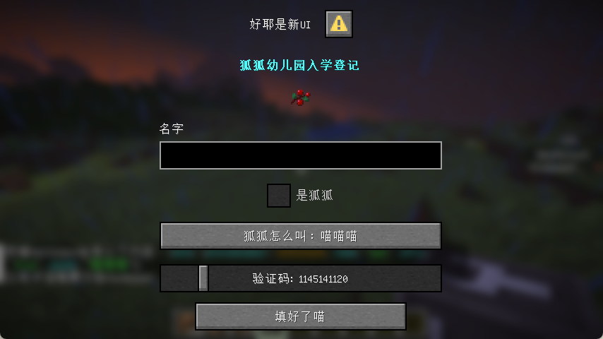

<script setup>
    import SpotlightHead from '/.vitepress/vue/SpotlightHead.vue'
    import ColorLine from '/.vitepress/vue/ColorLine.vue'
    import NBTNode from '/.vitepress/vue/NBTNode.vue'
</script>

<SpotlightHead
    title = "香草快讯 - Mojang Spotlight - 2025年6月"
    authorName = Alumopper
    avatarUrl = '../../_authors/alumopper.jpg'
    :socialLinks="[
        { name: 'BiliBili', url: 'https://space.bilibili.com/280394409' },
        { name: 'GitHub', url: 'https://github.com/Alumopper' }
    ]"
    cover='../_assets/spotlight.png'
    type=0
/>

这里是***香草***快讯，全Minecraft最***Vanilla***的技术性快照新闻，由本社记者*香草狐*为你报道最新快照消息~

本月Mojang共更新了两个快照：25w20a、25w21a，以及4个预发布版本：1.21.6-pre1~4。在本文攥写之时，已经发布了1.21.6-rc1，并确定1.12.6的更新时间为 2025.6.15。本月数据包版本号来到了**80**，较上月增加4，资源包版本号来到了**63**，较上月增加3，总体稳中向好。

先说结论，本月更新功能性极强，破坏性偏小，优化性一般，总体属于<span style="font-size: 1.5em; font-weight: bold">超大杯</span>水平。

在本次更新中，Mojang端上了非常有潜力的**对话框**特性。

<ColorLine />

> [!TIP]
>
> 对于比较重要的破坏性更改，会使用💥标注哦

## 对话框

对话框是在25w20a中加入的一个极其重要的特性，允许数据包使用JSON格式定义一个简单的交互界面，可以使用文本组件展示信息，也可以用按钮、文本输入框等接受玩家的输入。同时，通过`#pause_screen_additions`标签，还能将自定义对话框的入口添加到暂停菜单中。游戏提供了快捷键`G`打开`#quick_actions`标签中的对话框。

### 简要入门

首先，要定义一个对话框，需要在`data/<命名空间>/dialog`中定义。要定义一个对话框标签，需要在`data/<命名空间>/tags/dialog`中定义。对话框的定义和`worldgen`类似，**无法热重载**。但是，你仍然可以将其内联到`/dialog`命令中。

对话框分为**框头（Header）**、**内容（Content）**和**框尾（Footer）** 三个部分，并且其中所有内容都强制 **居中对齐**。

对话框的基本结构如下：

<NBTNode>
@Desc<"基本定义">
data Dialog {
    @Desc<"对话框的类型">
    type as string;
    @Desc<"对应框头，即标题，为文本组件">
    title as text;
    @Desc<"对应内容第一部分，对话框的主体元素，可以包含各种控件">
    body as (compound | list&lt;any&gt;);
    @Desc<"对应内容第二部分，通常是一系列的按钮，即输入控件">
    inputs as list&lt;any&gt;;
    @Desc<"在暂停屏幕或其他对话框内用于打开此对话框按钮的文本">
    external_title as text;
    @Desc<"对话框的操作后行为">
    after_action as string;
    @Desc<"单人游戏下对话框是否暂停游戏">
    pause as bool;
}
</NBTNode>

主体元素，即`body`中的内容，有

* `item`：渲染物品
* `plain_message`：文本组件

而输入控件，即`inputs`中的内容，有

* `boolean`：复选框
* `number_range`：数字选择滑条
* `single_option`：选项按钮，可在多个选项之间切换
* `text`：文本输入框，可多行和单行

具体的控件格式可以参考[Wiki](https://zh.minecraft.wiki/w/%E5%AF%B9%E8%AF%9D%E6%A1%86%E5%AE%9A%E4%B9%89%E6%A0%BC%E5%BC%8F?variant=zh-cn)。

不同的对话框类型会在底部渲染不同的按钮，点击这些按钮时候会执行的行为称作**操作（Action）**。点击按钮后，可以执行的操作包括：

* 文本组件点击事件中除了`open_file`以外的所有事件
* `dynamic/custom`：将所有输入控件输入的值整合为复合标签并提交给服务端（命令用不上）
* `dynamic/run_command`：将所有输入控件输入的值作为宏参数传入指定的宏命令中。执行者为看到这个对话框的玩家。

> [!Warning]
>
> 若命令的执行权限大于0，无论是否启用作弊，都会弹出一个警告框，要求玩家确认执行此命令。
>
> 所以，善用`trigger`。

下面是一个简单的例子，包含了对大部分控件的基本展示：

::: details 示例

```json
{
    "type":"notice",
    "title":"好耶是新UI",
    "external_title": "加入狐狐幼儿园",
    "body":[
        {
            "type": "plain_message",
            "contents": {"text": "狐狐幼儿园入学登记", "color": "aqua", "bold": true}
        },
        {
            "type": "item",
            "item": {
                "id": "sweet_berries",
                "count": 1
            },
            "show_tooltip": false
        }
    ],
    "inputs":[
        {
            "type":"text",
            "key":"name",
            "label":"名字"
        },
        {
            "type": "boolean",
            "key": "isFox",
            "label": "是狐狐"
        },
        {
            "type": "single_option",
            "key": "speak",
            "label": "狐狐怎么叫",
            "options": [
                "喵喵喵",
                "咕咕咕",
                "嘤嘤嘤",
                "大楚兴陈胜王"
            ]
        },
        {
            "type": "number_range",
            "key": "phoneNumber",
            "label": "验证码",
            "label_format": "%s: %s",
            "start": 1000000000,
            "end": 2000000000,
            "step": 1,
            "initial": 1145141145
        }
    ],
    "action": {
        "label": "填好了喵",
        "action": {
            "type": "dynamic/run_command",
            "template": "data modify storage test:input data set value {name:'$(name)', isFox:'$(isFox)', speak:'$(speak)', phoneNumber: $(phoneNumber)}" 
        }
    }
}
```

:::

效果如图所示



### 实例展示

CR_019 制作的推箱子小游戏：

<div class="bilibili-video-container">
  <iframe 
    src="//player.bilibili.com/player.html?isOutside=true&aid=114519531589209&bvid=BV1ngEhzQEVj&cid=29997664427&p=1&autoplay=0" 
    scrolling="no" 
    border="0" 
    frameborder="no" 
    framespacing="0" 
    allowfullscreen="true"
    class="bilibili-video">
  </iframe>
</div>

虚灵工坊制作的2048小游戏：

<div class="bilibili-video-container">
  <iframe 
    src="//player.bilibili.com/player.html?isOutside=true&aid=114559327144464&bvid=BV1SpjWzkEyB&cid=30117530438&p=1&autoplay=0" 
    scrolling="no" 
    border="0" 
    frameborder="no" 
    framespacing="0" 
    allowfullscreen="true"
    class="bilibili-video"
    >
  </iframe>
</div>

小棋孜制作的扫雷：

<div class="bilibili-video-container">
  <iframe 
    src="//player.bilibili.com/player.html?isOutside=true&aid=114606437634679&bvid=BV1Kf7gzvEmM&cid=30263347211&p=1&autoplay=0" 
    scrolling="no" 
    border="0" 
    frameborder="no" 
    framespacing="0" 
    allowfullscreen="true"
    class="bilibili-video"
    >
  </iframe>
</div>

## 其他

25w20a中新增了`can_be_sheared`物品组件，允许玩家通过持剪刀右键目标实体以移除此物品，同时增加了`shearing_sound`声音事件，控制此物品被剪下时播放的音效。

1.21.6-pre1中在物品模型映射文件中新增了`oversized_in_gui`字段，控制物品在物品栏中渲染时可以超出槽位边框，否则，物品将在边框处被截断。新增了`minecraft:player_head`模型，用于渲染玩家的头。

::: tip

在 1.21.6-pre1的更新文章中，官方留下了这样的话：

- *This ability of items being rendered outside their slots should not be considered officially supported, it was temporarily restored as an exception since many servers are relying on it*
- 将物品渲染到超出它们所在的格子并不是官方支持的行为，但是因为许多服务器依赖于此，所以这个特性被作为一个例外不被修复。

- *At some point in the future we hope to replace it with an officially supported way of achieving similar functionality*
- 我们倾向于在未来用一种能实现相同功能但是官方支持的方式来替代它。


:::

此外，还在声音方面针对新加入的对话框功能进行了优化和调整，并且对一些音效进行了重命名。增加了鞍的配方，并将原来战利品箱中的鞍替换为了皮革。更多详细的资料请查看[Wiki](https://zh.minecraft.wiki/w/Java%E7%89%881.21.6/%E5%BC%80%E5%8F%91%E7%89%88%E6%9C%AC#25w20a)~