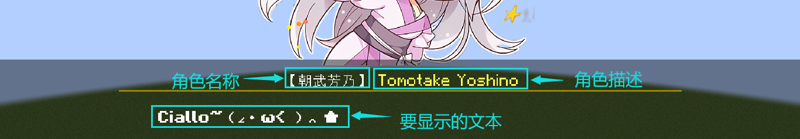
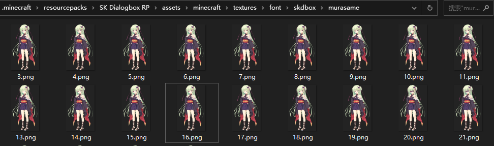
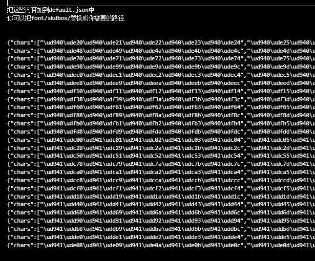
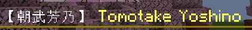

<FeaturedHead
    title = '以防你不知道我可以在MC里玩千恋万花'
    authorName = SKSAMA
    avatarUrl = '../../_authors/sk.jpg'
    :socialLinks="[
        { name: 'BiliBili', url: 'https://space.bilibili.com/1546917549' },
        { name: 'GitHub', url: 'https://github.com/ymqlgthbSakuraDream' }
    ]"
    resourceLink = 'https://ymqlgthbsakuradream.github.io/posts/minecraft/Archive.20250705.html'
    cover='../_assets/0.png'
/>

进来了啥都别说，先一起喊：  

<p style="font-size: 36px;"> Ciallo～ (∠・ω< )⌒★</p>

欢迎来到我们的MC **旮旯给木(Galgame)** 项目，本项目旨在通过简单的方式创建类似Galgame的对话框  
  
- 运作方式：原版游戏，**[数据包](https://zh.minecraft.wiki/w/%E6%95%B0%E6%8D%AE%E5%8C%85)**
- 支持版本：**>=1.21.5**
- **支持多人并行使用**

## Ⅰ 环境准备  

将数据包放在存档的**datapacks**文件夹下，为了方便后续编辑和调整，我们需要将压缩的数据包解压，然后使用[**Visual Studio Code**](https://code.visualstudio.com/)打开数据包文件夹。  


展开到**demo**文件夹里的**foo.mcfunction**，之后的演示和操作都建议在这个文件中进行  


假设现在**foo.mcfunction**中有以下命令，现在看不懂没关系，只是做一个演示

```mcfunction
data modify storage minecraft:skapi.dbox reg.event.foo set value {\
    "main":[\
        {"type":"tachie_load","character":"yoshino","tachie":"ciallo"},\
        {"type":"jump","jump":"1"}\
    ],\
    "1":[\
        {"type":"text","text":"Ciallo~（∠・ω< ）⌒ ★","character":"yoshino"},\
        {"type":"tachie_animation","character":"yoshino","animation":"jump"},\
        {"type":"sound","sound":"skdbox.demo2.ciallo"},\
        {"type":"option","option":[{"text":"再来一次！","jump":"1"},{"text":"0721","jump":"2"}]}\
    ],\
    "2":[\
        {"type":"stop"}\
    ]\
}

```

不难注意到这条命令每行都以`\`结尾，这并不利于我们编辑，一种解决方法是先将内容写在Json文件中，然后查找替换，给行末批量加上`\`  

在开始之前，可以先体验数据包内置的一些示例程序，请在聊天栏运行以下命令

```mcfunction
/function skdbox:dialog {id:"demo1"}
```

```mcfunction
/function skdbox:dialog {id:"demo2"}
```

## Ⅱ 事件列表  

显示文字，显示立绘，播放语音等操作统称为事件，事件存放在事件列表中  

### 基本

#### 定义事件列表

```mcfunction
data modify storage minecraft:skapi.dbox reg.event.<事件列表ID> set value <事件列表>
```

参数说明  
**<事件列表ID>** 事件列表的ID，这是唯一的  
**<事件列表>** 一个包含所有事件的复合标签,格式如下  

<NBTTree code='
@Name<"(根标签)">
data EventList {
    @Desc<"入口子列表"> main as list<compound>;
    @Desc<"一个子列表"> @Name<"(子列表名)"> child as list<compound>;
}
'/>

#### 播放事件列表

```mcfunction
function skdbox:dialog
```

**执行者** 指定要向谁播放事件列表，只能指定单一玩家  
**参数**  

<NBTTree code='
@Name<"(根标签)">
data FunctionArg {
    @Desc<"事件列表的id"> id as string;
}'
/>

#### 终止事件列表  

事件列表可以在播放完毕时自动终止，当然你也可以直接使用该函数终止

```mcfunction
function skdbox:stop
```

### 文本事件

文本事件，顾名思义，就是在玩家屏幕上显示文本，一条文本显示完毕后，将等待玩家按下空格键，然后显示下一条文本

<NBTTree code='
@Name<"(文本事件根标签)">
data TextEvent {
    @Desc<"此项表明该事件是一个文本事件"> @Name<"type: text"> type as string;
    @Desc<"要显示的文本，纯文本，不支持文本组件，可以使用转义"> @Name<"text"> qwq as string;
    @Desc<"说话角色，用于控制显示对话框上方的角色名称和描述，若不存在，则使用上一次调用文本事件时使用的数据。如果此项为 NULL，则不显示角色名称和描述。关于角色定义，详见定义角色"> character as string;
    @Desc<"角色名称（此项会覆盖character）"> display_name as string;
    @Desc<"角色描述（此项会覆盖character）"> description as string;
}'
/>



现在来看一个演示，把下面的命令放到`foo.mcfunction`中，然后重载数据包  
关于`"character":"roka"`，为了方便演示，数据包已经定义好了一些角色，详见[定义角色](#3.1)

```mcfunction
data modify storage minecraft:skapi.dbox reg.event.foo set value {\
    "main":[\
        {"type":"text","character":"NULL","text":"「嘛......要说也的确是好久没来了」"},\
        {"type":"text","character":"roka","text":"「这就直接去志那都庄了？」"},\
        {"type":"text","character":"NULL","text":"「是这个打算」"},\
        {"type":"text","character":"roka","text":"「那我也一起走比较好吧，因为好久不见，再聊会吧」"},\
    ]\
}
```

在聊天栏中输入，就可以运行了

```mcfunction
/function skdbox:dialog {id:"foo"}
```

在后面的演示中，为了方便修改编辑，将会直接以json的形式展示事件列表复合标签，像这样

```json
{
    "main":[
        {"type":"text","character":"NULL","text":"「嘛......要说也的确是好久没来了」"},
        {"type":"text","character":"roka","text":"「这就直接去志那都庄了？」"},
        {"type":"text","character":"NULL","text":"「是这个打算」"},
        {"type":"text","character":"roka","text":"「那我也一起走比较好吧，因为好久不见，再聊会吧」"},
    ]
}
```

<div id="2.2"></div>

### 延时事件

得益于时序控制，我们可以完成很多有用的操作

如果事件列表中只有文本事件，那它的时序是这样的  

文本打字动画占用时间取决于文本的长度

```json
{
    "main":[
        {"type":"text","character":"NULL","text":"第一句话"},
        {"type":"text","character":"roka","text":"第二句话"},
    ]
}
```


如果在文本事件后添加了其他事件，那么这些事件将与文本事件同tick执行

```json
{
    "main":[
        {"type":"text","character":"NULL","text":"第一句话"},
        {"type":"tachie_load","character":"roka","tachie":"1"},
        {"type":"text","character":"roka","text":"第二句话"},
        {"type":"tachie_modify","character":"roka","tachie":"2"},
        {"type":"tachie_animation","animation":"jump"}
    ]
}
```


不难发现tachie_modify事件和tachie_animation事件是同时执行的，但是我们希望执行完tachie_modify事件后延迟一段时间再执行tachie_animation事件  

这种情况下需要使用延迟事件，格式如下

<NBTTree code='
@Name<"(延迟事件根标签)">
data FunctionArg {
    @Desc<"此项表明该事件是一个延迟事件"> @Name<"type: delay"> type as string;
    @Desc<"延迟的时间（tick）"> time as int;
}'
/>

```json
{
    "main":[
        {"type":"text","character":"NULL","text":"第一句话"},
        {"type":"tachie_load","character":"roka","tachie":"1"},
        {"type":"text","character":"roka","text":"第二句话"},
        {"type":"tachie_modify","character":"roka","tachie":"2"},
        {"type":"delay","time":2},
        {"type":"tachie_animation","animation":"jump"}
    ]
}
```


<div id="2.3"></div>

### 立绘事件
只有文本还是太单调了，立绘是必不可少的  

立绘事件使用角色ID作为索引，所以不能在同一时间多次加载同一角色的立绘  

关于角色定义，详见**[定义角色](#3.1)**

#### 加载立绘 tachie_load

<NBTTree code='
@Name<"(事件根标签)">
data FunctionArg {
    @Desc<"此项表明该事件类型为：加载立绘"> @Name<"type: tachie_load"> type as string;
    @Desc<"角色ID"> character as string;
    @Desc<"立绘ID"> tachie as string;
    @Desc<"立绘的x坐标，默认为 CENTER ，可选值为LEFT, M_LEFT, CENTER, M_RIGHT, RIGHT，如果想使用自定义值，详见全局设置 立绘"> position as string;
    @Desc<"颜色叠加，默认为 default(#FFFFFF)，可选值为 midnight, noon，如果想使用自定义值，详见全局设置 立绘"> color as string;
    @Desc<"动画ID，立绘载入动画，默认为 fade_in_left ，详见定义动画"> animation as string;
}'
/>

#### 修改立绘 tachie_modify

<NBTTree code='
@Name<"(事件根标签)">
data FunctionArg {
    @Desc<"此项表明该事件类型为：修改立绘"> @Name<"type: tachie_modify"> type as string;
    @Desc<"角色ID"> character as string;
    @Desc<"立绘ID"> tachie as string;
}'
/>

#### 移除立绘 tachie_remove

<NBTTree code='
@Name<"(事件根标签)">
data FunctionArg {
    @Desc<"此项表明该事件类型为：加载立绘"> @Name<"type: tachie_animation"> type as string;
    @Desc<"角色ID"> character as string;
    @Desc<"动画ID，详见定义动画"> animation as string;
}'
/>

<div id="2.3.1"></div>

关于参数**position**，可以参考这张图


<div id="2.3.2"></div>

关于参数**color**，用处是让立绘的色调更贴合环境，如图所示


<div id="2.4"></div>

### 流程控制事件

#### 终止事件

<NBTTree code='
@Name<"(事件根标签)">
data FunctionArg {
    @Desc<"此项表明该事件是一个终止事件"> @Name<"type: stop"> type as string;
}'
/>

顾名思义，终止事件可以让事件列表提前结束

```json
{
    "main":[
        {"type":"text","character":"NULL","text":"这是一句话"},
        {"type":"stop"},
        {"type":"text","character":"roka","text":"事件列表提前终止了，这句话将不会显示"}
    ]
}
```

#### 跳转事件

<NBTTree code='
@Name<"(事件根标签)">
data FunctionArg {
    @Desc<"此项表明该事件是一个跳转事件"> @Name<"type: jump"> type as string;
    @Desc<"跳转至,子事件列表ID"> jump as string;
}'
/>

```json
{
    "main":[
        {"type":"text","character":"NULL","text":"这是一句话"},
        {"type":"jump","jump":"jmp01"}
    ],
    "jmp01":[
        {"type":"text","character":"roka","text":"使用jump事件可以跳转到这里"}
    ]
}
```

#### 检查条件

检查一个条件，如果条件通过则跳转到指定的子事件列表，条件不通过则继续执行当前的子事件列表  

用**`@a[tag=skdbox.s]`**指代玩家

<NBTTree code='
@Name<"(事件根标签)">
data FunctionArg {
    @Desc<"此项表明该事件是一个检查条件事件"> @Name<"type: check_condition"> type as string;
    @Desc<"一个execute命令的条件子命令"> condition as string;
    @Desc<"跳转至,子事件列表ID"> jump as string;
}'
/>

#### 检查分数

检查分数，如果分数在指定区间内，则跳转到指定的子事件列表，如果分数不在任意一个指定的区间内， 则继续执行当前的子事件列表  

用**@a[tag=skdbox.s]**指代玩家

<NBTTree code='
@Name<"(事件根标签)">
data FunctionArg {
    @Desc<"此项表明该事件是一个检查分数事件"> @Name<"type: check_score"> type as string;
    @Desc<"计分板名称"> scoreboard as string;
    @Desc<"分数持有者"> object as string;
    @Desc<"检查项目列表"> score as list<data {
        @Desc<"区间，两个值对应左端点和右端点值"> interval as list<int>;
        @Desc<"跳转至,子事件列表ID"> jump as string;
    }>
}'
/>

#### 执行命令

执行一条命令，命令的默认执行者为Marker，用**@a[tag=skdbox.s]**指代当前玩家

<NBTTree code='
@Name<"(事件根标签)">
data FunctionArg {
    @Desc<"此项表明该事件是一个执行命令事件"> @Name<"type: cmd"> type as string;
    @Desc<"要执行的命令"> cmd as string;
}'
/>

#### 选项事件

<NBTTree code='
@Name<"(事件根标签)">
data FunctionArg {
    @Desc<"此项表明该事件是一个选项事件"> @Name<"type: option"> type as string;
    @Desc<"选项列表"> cmd as list<data {
        @Desc<"该选项上的文字"> text as string;
        @Desc<"跳转至,子事件列表ID"> jump as string;
    }>;
}'
/>

选项是Galgame必不可少的元素之一，不同的选项往往决定不同的剧情走向  

玩家按**W**(前进键)和**S**(后退键)来切换选项，按**空格键**确认选项  

选项的数量没有限制，但如果同时显示很多选项，会造成选项显示重叠，这时候需要调整选项间距，详见**[全局设置 选项](#4.3)**  

当然关于选项，自然少不了各种各样的冥场面  

~~原来是两句充满童趣的日文呀，不知道的还以为是选择里面外面呢~~  

下面我们来看一个示例，播放Ciallo，玩家可以选择再来一次或者结束


```json
{
    "main":[
        {"type":"tachie_load","character":"yoshino","tachie":"ciallo"},
        {"type":"jump","jump":"1"}
    ],
    "1":[
        {"type":"text","text":"Ciallo~（∠・ω< ）⌒ ★","character":"yoshino"},
        {"type":"tachie_animation","character":"yoshino","animation":"jump"},
        {"type":"sound","sound":"skdbox.demo2.ciallo"},
        {"type":"option","option":[
          {"text":"再来一次！","jump":"1"},
          {"text":"0721","jump":"2"}
        ]}
    ],
    "2":[
        {"type":"stop"}
    ]
}

```

<font size=6>Ciallo~（∠・ω< ）⌒ ★</font>


<div id="2.5"></div>

### 声音事件

#### 播放声音

向当前玩家播放一个声音

<NBTTree code='
@Name<"(事件根标签)">
data FunctionArg {
    @Desc<"此项表明该事件是一个播放声音事件"> @Name<"type: sound"> type as string;
    @Desc<"要播放的声音"> sound as string;
}'
/>

#### 语音事件

如果你想给每一句话都添加语音，使用播放声音事件处理起来很麻烦，这时就需要用到语音事件  

只需要使用一次语音事件，就可以为每一句对话自动播放对应的语音

<NBTTree code='
@Name<"(事件根标签)">
data FunctionArg {
    @Desc<"此项表明该事件是一个语音事件"> @Name<"type: voice"> type as string;
    @Desc<"声音文件路径前缀"> path as string;
    @Desc<"索引值，输入-1表示停止语音播放"> index as int;
    @Desc<"说明哪些角色不需要播放语音，此项默认为[NULL]"> skip as list<string>;
}'
/>

来看一个例子：

```json
{
    "main":[
        {"type":"voice","path":"minecraft:skdbox.demo1.","index":1},
        {"type":"text","character":"roka","text":"「这就直接去志那都庄了？」"},
        {"type":"text","character":"NULL","text":"「是这个打算」"},
        {"type":"text","character":"roka","text":"「那我也一起走比较好吧，因为好久不见，再聊会吧」"},
        {"type":"text","character":"NULL","text":"「我当然可以，不过芦花姐，时间不紧吗？」"},
        {"type":"text","character":"roka","text":"「没事没事，那走吧」"},
        {"type":"text","character":"roka","text":"「......总觉得阿将啊，从刚才开始就好像在盯着我？」"},
        {"type":"text","character":"roka","text":"「被这么盯着，姐姐可是要害羞了呢。怎么怎么？莫非是迷上我了？」"},
        {"type":"text","character":"roka","text":"「还是说，脸上粘了什么东西吗？」"}
    ],
}
```

执行上面的事件列表，语音将会按照这样的顺序播放  
可见语音自动跳过了名字为"NULL"的角色

|语音|文本|
|-|-|
|minecraft:skdbox.demo1.1|「这就直接去志那都庄了？」|
||「是这个打算」|
|minecraft:skdbox.demo1.2|「那我也一起走比较好吧，因为好久不见，再聊会吧」|
||「我当然可以，不过芦花姐，时间不紧吗？」|
|minecraft:skdbox.demo1.3|「没事没事，那走吧」|
|minecraft:skdbox.demo1.4|「......总觉得阿将啊，从刚才开始就好像在盯着我？」|
|minecraft:skdbox.demo1.5|「被这么盯着，姐姐可是要害羞了呢。怎么怎么？莫非是迷上我了？」|
|minecraft:skdbox.demo1.6|「还是说，脸上粘了什么东西吗？」|

<div id="3"></div>

## Ⅲ 添加新内容

<div id="3.1"></div>

### 定义角色

角色信息定义在**function/cfg/character.mcfunction**中，如图所示


你会发现这个文件里大部分都是\uXXXX转义字符，知道你很急但是你先别急，关于这些字符的用处，会在**[导入立绘](#3.2)**这一节讲解  

#### 定义角色

```mcfunction
data modify storage minecraft:skapi.dbox reg.character.<角色ID> set value <角色信息>
```

参数说明  

**<角色ID>** 角色ID，这是唯一的  

**<角色信息>** 一个包含该角色所有信息的复合标签,格式如下

<NBTTree code='
@Name<"(根标签)">
data Character {
    @Desc<"角色的名字，会在对话框上方显示"> display_name as string;
    @Desc<"角色的描述，会在对话框上方显示"> description as string;
    @Desc<"角色的立绘"> tachie as data {
        @Desc<"一个立绘字符串"> @Name<"立绘ID"> tachieID as string;
    };
}'
/>

来看一个示例：定义角色**丛雨**

```json
{
    display_name:"丛雨",
    description:"Murasame"
    tachie:{
      
    }
}
```

<div id="3.2"></div>

#### 导入立绘

刚才我们已经将丛雨的基本信息定义好了，接下来需要导入立绘

首先需要准备一些透明背景的立绘图片，当然这些是没法直接用的，我们需要对其进行进一步处理  

具体处理方式为  

- 宽度为256像素的整数倍
- 高度为2048像素

调整好大小之后，还需要全选图像，填充一个不透明度为1%的白色，如图所示，这样可以避免图像出现空像素从而造成文本错位，游戏渲染文本会丢掉透明度小于24(透明度0~255)的片段，所以在游戏里是看不见这一层白色的


将处理好的立绘放在资源包**assets/minecraft/textures/font/skdbox/murasame**路径下，当然，**/skdbox/murasame**可以改成自己喜欢的位置，文件名用数字命名，从1开始，如图所示


打开数据包文件夹中的**encode.py**程序，这个程序可以为图像上每一个256*256的区域分配一个码位


然后需要填写一些信息，根据实际情况填写就行了

- 起始码位先填上 **0x60220**，实际这里需要填什么下面会讲
- 导入的图片数量根据实际情况填写。这里一共需要导入26张立绘
- 处理好的立绘图片大小为1280\*2048，可以分成5\*8个256*256的区域，所以分割列数填5，分割行数填8

程序会生成一个**output.txt**文件，这个文件的内容分为三部分  
第一部分作用是声明图像上每一个256*256的区域对应的码位，需要把这些内容添加到资源包**assets/font/default.json**中，刚才我们把立绘放到了**assets/minecraft/textures/font/skdbox/murasame**，所以在这里，要把文件中的**font/skdbox/**都替换成**font/skdbox/murasame/**  
这部分的内容长这样


然后是第二部分，每行表示一张立绘，你可以直接在游戏内打印这些字符串来显示立绘图片  
这部分的内容长这样


现在只需要将这些字符串放到角色的tachie标签下就可以了，这里演示只加了两行，实际应该把第二部分的字符串都加上  
立绘ID可以是任意字符串，这里演示使用的数字

```json
{
    display_name:"丛雨",
    description:"Murasame"
    tachie:{
      "1":"\ud940\ude20\ud8fb\udd41\ud940\ude21\ud8fb\udd41\ud940\ude22\ud8fb\udd41\ud940\ude23\ud8fb\udd41\ud940\ude24\ud8fb\udd41\n\n\ud940\ude25\ud8fb\udd41\ud940\ude26\ud8fb\udd41\ud940\ude27\ud8fb\udd41\ud940\ude28\ud8fb\udd41\ud940\ude29\ud8fb\udd41\n\n\ud940\ude2a\ud8fb\udd41\ud940\ude2b\ud8fb\udd41\ud940\ude2c\ud8fb\udd41\ud940\ude2d\ud8fb\udd41\ud940\ude2e\ud8fb\udd41\n\n\ud940\ude2f\ud8fb\udd41\ud940\ude30\ud8fb\udd41\ud940\ude31\ud8fb\udd41\ud940\ude32\ud8fb\udd41\ud940\ude33\ud8fb\udd41\n\n\ud940\ude34\ud8fb\udd41\ud940\ude35\ud8fb\udd41\ud940\ude36\ud8fb\udd41\ud940\ude37\ud8fb\udd41\ud940\ude38\ud8fb\udd41\n\n\ud940\ude39\ud8fb\udd41\ud940\ude3a\ud8fb\udd41\ud940\ude3b\ud8fb\udd41\ud940\ude3c\ud8fb\udd41\ud940\ude3d\ud8fb\udd41\n\n\ud940\ude3e\ud8fb\udd41\ud940\ude3f\ud8fb\udd41\ud940\ude40\ud8fb\udd41\ud940\ude41\ud8fb\udd41\ud940\ude42\ud8fb\udd41\n\n\ud940\ude43\ud8fb\udd41\ud940\ude44\ud8fb\udd41\ud940\ude45\ud8fb\udd41\ud940\ude46\ud8fb\udd41\ud940\ude47\ud8fb\udd41",
      "2":"\ud940\ude48\ud8fb\udd41\ud940\ude49\ud8fb\udd41\ud940\ude4a\ud8fb\udd41\ud940\ude4b\ud8fb\udd41\ud940\ude4c\ud8fb\udd41\n\n\ud940\ude4d\ud8fb\udd41\ud940\ude4e\ud8fb\udd41\ud940\ude4f\ud8fb\udd41\ud940\ude50\ud8fb\udd41\ud940\ude51\ud8fb\udd41\n\n\ud940\ude52\ud8fb\udd41\ud940\ude53\ud8fb\udd41\ud940\ude54\ud8fb\udd41\ud940\ude55\ud8fb\udd41\ud940\ude56\ud8fb\udd41\n\n\ud940\ude57\ud8fb\udd41\ud940\ude58\ud8fb\udd41\ud940\ude59\ud8fb\udd41\ud940\ude5a\ud8fb\udd41\ud940\ude5b\ud8fb\udd41\n\n\ud940\ude5c\ud8fb\udd41\ud940\ude5d\ud8fb\udd41\ud940\ude5e\ud8fb\udd41\ud940\ude5f\ud8fb\udd41\ud940\ude60\ud8fb\udd41\n\n\ud940\ude61\ud8fb\udd41\ud940\ude62\ud8fb\udd41\ud940\ude63\ud8fb\udd41\ud940\ude64\ud8fb\udd41\ud940\ude65\ud8fb\udd41\n\n\ud940\ude66\ud8fb\udd41\ud940\ude67\ud8fb\udd41\ud940\ude68\ud8fb\udd41\ud940\ude69\ud8fb\udd41\ud940\ude6a\ud8fb\udd41\n\n\ud940\ude6b\ud8fb\udd41\ud940\ude6c\ud8fb\udd41\ud940\ude6d\ud8fb\udd41\ud940\ude6e\ud8fb\udd41\ud940\ude6f\ud8fb\udd41",
    }
}
```

至此，已经完成了角色定义  

**output.txt**的第三部分只有一行，就像这样：

但是如果我忘记了或者根本不知道上一次的编码从哪里结束怎么办？  
很简单，如图所示，找到文件**assets/font/default.json**中最后一个编码，只需要将这个编码加一，就可以当作下一次的起始码位  

值得注意的是，default.json中使用的是unicode代理对，这里我们需要将字节字符转为宽字符，听不懂没关系，看操作  
比方说我们要转换这个字符

```text
\ud941\ude2f
```

[点击打开这个网站](https://www.toolhelper.cn/EncodeDecode/UnicodeChinese)  
按照下图的方式解码一次，然后再编码一次，得到**6062f**，加上1得到**60630**，下次编码就可以使用**0x60630**作为起始码位了


<div id="3.3"></div>

### 定义动画

动画信息定义在**function/cfg/animation.mcfunction**中

#### 定义动画

```mcfunction
data modify storage minecraft:skapi.dbox reg.animation.<动画ID> set value <动画信息>
```

参数说明

**<动画ID>** 动画ID，这是唯一的  

**<动画信息>** 一个包含该动画所有信息的列表,格式如下  

<NBTTree code='
@Name<"(根标签)">
data Animation {
    @Name<"第一个项目"> first as data {
        @Desc<"要覆盖进展示实体的数据"> merge as compound;
    }>
    @Name<"第二个项目"> second as data {
        @Desc<"要覆盖进展示实体的数据"> merge as compound;
        @Desc<"本项目距离上一个项目的时间(tick)"> delay as int;
    }>
    @Name<"..."> ect as compound;
}'
/>

值得注意的是，**translation**列表中得坐标是相对于当前坐标的，而不是相对于原点坐标

以下是动画"jump"的定义

```json
[
    {
      merge:{
        transformation:{
          translation:[0f,0.0055f,0f]
        },
        interpolation_duration:5
      }
    },
    {
      delay:5,
      merge:{
        transformation:{
          translation:[0f,-0.0055f,0f]
        },
      interpolation_duration:5
    }
  }
]
```

<div id="4"></div>

## Ⅳ 全局设置

全局设置定义在**function/cfg/config.mcfunction**中  
需要更改请直接到文件中修改  
但是并不是所有的设置都建议更改，后面会讲几个常用的设置

<NBTTree code='
@Name<"(配置根标签)">
data config {
    @Desc<"文本框相关配置"> text_box as data {
        @Desc<"文本框文本的拼接格式，主要用于显示角色名字和描述"> format as list<compound>;
        @Desc<"文本框背景，acacia_chest_boat的string类型物品模型映射字符串"> bg as string;
        @Desc<"行宽"> line_width as int;
        @Desc<"文本对齐方式，可选值为center,left,right"> alignment as string;
        @Desc<"缩放(不建议更改)"> scale as list<double>;
        @Desc<"平移(不建议更改)"> translation as list<double>;
    };
    @Desc<"文本框内的文本相关配置"> text_display as data {
        @Desc<"文本前缀"> prefix as string;
        @Desc<"行宽"> line_width as int;
        @Desc<"缩放(不建议更改)"> scale as list<double>;
        @Desc<"平移(不建议更改)"> translation as list<double>;
    };
    @Desc<"选项相关配置"> option as data {
        @Desc<"背景字符串"> bg as string;
        @Desc<"选中的选项背景字符串"> bg_selected as string;
        @Desc<"文本前缀"> prefix as string;
        @Desc<"选中的选项的文本前缀"> prefix_selected as string;
        @Desc<"行宽"> line_width as int;
        @Desc<"缩放(不建议更改)"> scale as list<double>;
        @Desc<"平移(不建议更改)"> translation as list<double>;
        @Desc<"总行间距"> height as float;
    };
    @Desc<"立绘相关配置"> tachie as data {
        @Desc<"位置枚举"> position as data {
            @Desc<"一个x坐标偏移量"> @Name<"(名称)"> type as double;
        };
        @Desc<"叠加颜色"> color as data {
            @Desc<"一个颜色，例如#FFFFFF"> @Name<"(名称)"> type as string;
        };
        @Desc<"默认动画"> default_animation as data {
            @Desc<"动画ID，立绘载入时自动播放"> load as string;
            @Desc<"动画ID，立绘移除时自动播放"> remove as string;
        };
        @Desc<"缩放(不建议更改)"> scale as list<double>;
        @Desc<"平移(不建议更改)"> translation as list<double>;
    };
    @Desc<"音效相关配置"> sound as data {
        @Desc<"选择选项时播放的音效"> option as string;
        @Desc<"按空格键显示下一句文本时播放的音效"> @Name<"text"> qwq as string;
    };
}'
/>

<div id="4.1"></div>

### 对话框

比较有用的主要是修改文本的拼接格式

<NBTTree code='
data text_box {
    @Desc<"文本框文本的拼接格式，主要用于显示角色名字和描述"> format as list<compound>;
}'
/>

默认是这样的，代表先显示一个“【”,然后放入角色名字，再显示一个"】",最后将文本颜色改为黄色，显示角色描述

```json
format:[
  {text:"【"},
  {place:{type:"display_name"}},
  {text:"】 \u00A7e"},
  {place:{type:"description"}},
  {text:"\u00A7r\n"}
]
```



<div id="4.2"></div>

#### 立绘

<NBTTree code='
data tachie {
    @Desc<"位置枚举"> position as data {
        @Desc<"一个x坐标偏移量"> @Name<"(名称)"> type as double;
    };
    @Desc<"叠加颜色"> color as data {
        @Desc<"一个颜色，例如\"#FFFFFF\""> @Name<"(名称)"> type as string;
    };
    @Desc<"默认动画"> default_animation as data {
        @Desc<"动画ID，立绘载入时自动播放"> load as string;
        @Desc<"动画ID，立绘移除时自动播放"> remove as string;
    };
}'
/>

修改或添加位置/颜色枚举，或者更改默认动画，以下是默认设置

```json
tachie: {
  position: {
    "LEFT":0.01,
    "M_LEFT":0.005,
    "CENTER":0,
    "M_RIGHT":-0.005,
    "RIGHT":-0.01
  },
  color: {
    default:"#FFFFFF",
    midnight:"#8C9ACC",
    noon:"#F0DEAD"
  },
  default_animation: {
    load:"fade_in_left",
    remove:"fade_out_left"
  }
}
```

<div id="4.3"></div>

#### 选项

如果有一次性显示很多选项的需求，请修改总行间距以避免造成选项重叠

<NBTTree code='
data option {
    @Desc<"总行间距"> height as float;
}'
/>

<div id="4.4"></div>

#### 声音

<NBTTree code='
data sound {
    @Desc<"选择选项时播放的音效"> option as string;
    @Desc<"按空格键显示下一句文本时播放的音效"> @Name<"text"> qwq as string;
}'
/>

可以换成自己喜欢的音效，以下是默认设置

```json
sound: {
  option:"minecraft:ui.button.click",
  text:"minecraft:ui.button.click"
},
```